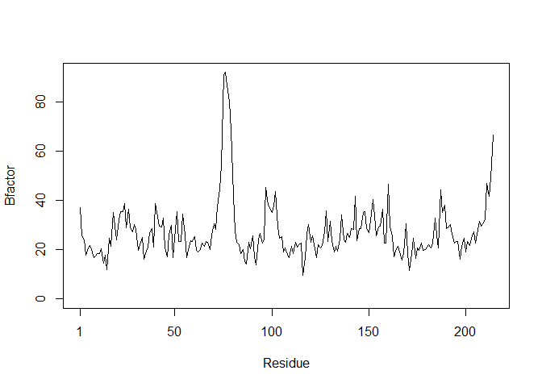
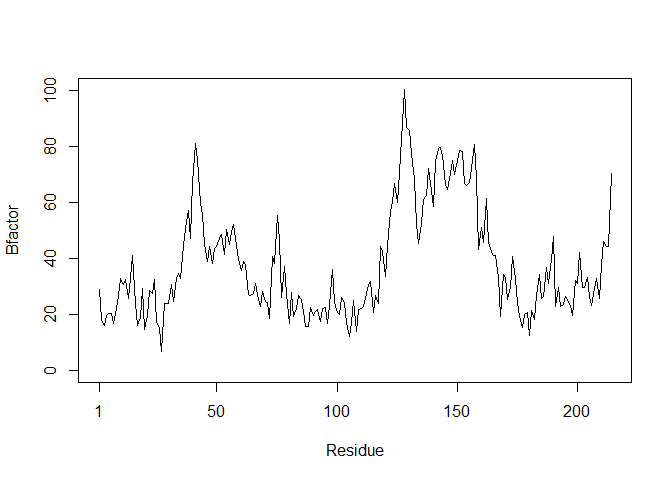
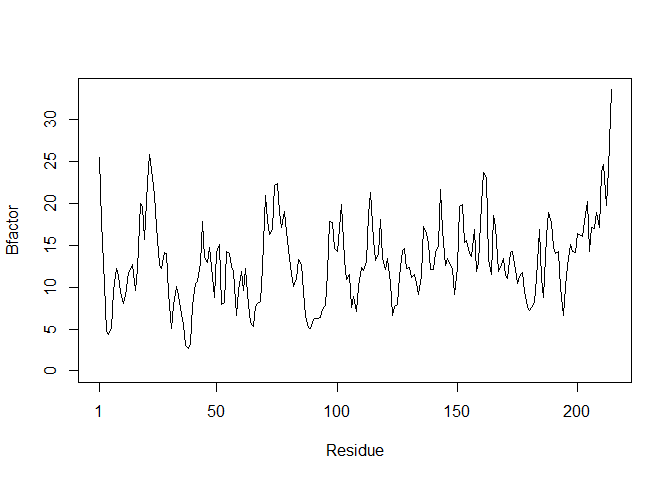
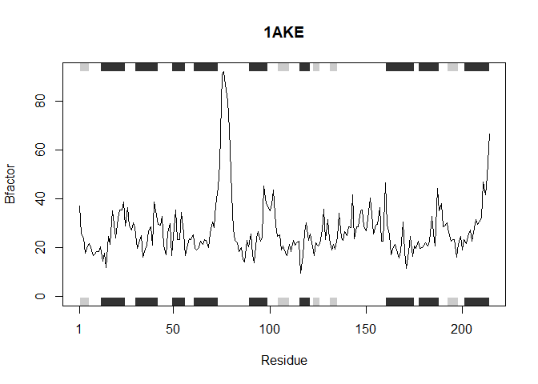

Class 6: why, when and how of writing your own R functions
================

## R Markdown

This is an R Markdown document. Markdown is a simple formatting syntax
for authoring HTML, PDF, and MS Word documents. For more details on
using R Markdown see <http://rmarkdown.rstudio.com>.

``` r
# Can you improve this analysis code?
library(bio3d)
s1 <- read.pdb("4AKE")  # kinase with drug
```

    ##   Note: Accessing on-line PDB file

``` r
s2 <- read.pdb("1AKE")  # kinase no drug
```

    ##   Note: Accessing on-line PDB file
    ##    PDB has ALT records, taking A only, rm.alt=TRUE

``` r
s3 <- read.pdb("1E4Y")  # kinase with drug
```

    ##   Note: Accessing on-line PDB file

``` r
s1.chainA <- trim.pdb(s1, chain="A", elety="CA")
s2.chainA <- trim.pdb(s2, chain="A", elety="CA")
s3.chainA <- trim.pdb(s3, chain="A", elety="CA")

s1.b <- s1.chainA$atom$b
s2.b <- s2.chainA$atom$b
s3.b <- s3.chainA$atom$b

plotb3(s1.b, sse=s1.chainA, typ="l", ylab="Bfactor") 
```

<!-- -->

``` r
plotb3(s2.b, sse=s2.chainA, typ="l", ylab="Bfactor") 
```

<!-- -->

``` r
plotb3(s3.b, sse=s3.chainA, typ="l", ylab="Bfactor")
```

<!-- -->

``` r
plotb3(s1.b, typ="l", ylab="Bfactor") 
```

<!-- -->

``` r
plotb3(s2.b, typ="l", ylab="Bfactor") 
```

<!-- -->

``` r
plotb3(s3.b, typ="l", ylab="Bfactor")
```

<!-- -->

When you click the **Knit** button a document will be generated that
includes both content as well as the output of any embedded R code
chunks within the document. You can embed an R code chunk like this:

``` r
summary(cars)
```

    ##      speed           dist       
    ##  Min.   : 4.0   Min.   :  2.00  
    ##  1st Qu.:12.0   1st Qu.: 26.00  
    ##  Median :15.0   Median : 36.00  
    ##  Mean   :15.4   Mean   : 42.98  
    ##  3rd Qu.:19.0   3rd Qu.: 56.00  
    ##  Max.   :25.0   Max.   :120.00

## Including Plots

You can also embed plots, for example:

<!-- -->

Note that the `echo = FALSE` parameter was added to the code chunk to
prevent printing of the R code that generated the plot.

## Class 06 Homework Assignment

``` r
# Can you improve this analysis code?
library(bio3d)
s1 <- read.pdb("4AKE")  # kinase with drug
```

    ##   Note: Accessing on-line PDB file

    ## Warning in get.pdb(file, path = tempdir(), verbose = FALSE): C:
    ## \Users\dirty\AppData\Local\Temp\RtmpOASeie/4AKE.pdb exists. Skipping
    ## download

``` r
s2 <- read.pdb("1AKE")  # kinase no drug
```

    ##   Note: Accessing on-line PDB file

    ## Warning in get.pdb(file, path = tempdir(), verbose = FALSE): C:
    ## \Users\dirty\AppData\Local\Temp\RtmpOASeie/1AKE.pdb exists. Skipping
    ## download

    ##    PDB has ALT records, taking A only, rm.alt=TRUE

``` r
s3 <- read.pdb("1E4Y")  # kinase with drug
```

    ##   Note: Accessing on-line PDB file

    ## Warning in get.pdb(file, path = tempdir(), verbose = FALSE): C:
    ## \Users\dirty\AppData\Local\Temp\RtmpOASeie/1E4Y.pdb exists. Skipping
    ## download

``` r
s1.chainA <- trim.pdb(s1, chain="A", elety="CA")
s2.chainA <- trim.pdb(s2, chain="A", elety="CA")
s3.chainA <- trim.pdb(s3, chain="A", elety="CA")

s1.b <- s1.chainA$atom$b
s2.b <- s2.chainA$atom$b
s3.b <- s3.chainA$atom$b

plotb3(s1.b, sse=s1.chainA, typ="l", ylab="Bfactor") 
```

<!-- -->

``` r
plotb3(s2.b, sse=s2.chainA, typ="l", ylab="Bfactor") 
```

<!-- -->

``` r
plotb3(s3.b, sse=s3.chainA, typ="l", ylab="Bfactor")
```

<!-- -->

``` r
plotb3(s1.b, typ="l", ylab="Bfactor") 
```

<!-- -->

``` r
plotb3(s2.b, typ="l", ylab="Bfactor") 
```

<!-- -->

``` r
plotb3(s3.b, typ="l", ylab="Bfactor")
```

<!-- -->

## Class06 Homework Submission:

This function will read a vector of pdb IDs and output a plot showing
druggable targets

Step-1: Load bio3d

``` r
library(bio3d)
```

Step-2: Input a vector containing the pdb IDs for proteins you wish to
plot (protein\_list) In this case the pdb IDs for 3 proteins are:
“4AKE”,“1AKE”,“1E4Y”

``` r
protein_list <- c("4AKE","1AKE","1E4Y")
```

Step-3: Creates the function “plot\_kinase\_druggable”. This function
will A:load and trim the pdb file, B:then plot the A chain by residue
(x-axis) and b-factor (Y-axis), as well as add secondary structure
element of the trimmed pdb file.

``` r
plot_kinase_druggable <- function(x) {
  trim_pdb_info <- trim.pdb(read.pdb(x), chain = "A", elety = "CA")
     plotb3(trim_pdb_info $atom$b, 
      sse = trim_pdb_info, 
      typ = "l", ylab = "Bfactor", main = x)  
}
```

Step-4: Applies the plot\_druggable\_kinase function (plots the pdb
information) to protein\_list (Vector containin pdb IDs). Outputs a list
of the plots.

``` r
lapply(protein_list, plot_kinase_druggable)
```

    ##   Note: Accessing on-line PDB file

    ## Warning in get.pdb(file, path = tempdir(), verbose = FALSE): C:
    ## \Users\dirty\AppData\Local\Temp\RtmpOASeie/4AKE.pdb exists. Skipping
    ## download

    ##   Note: Accessing on-line PDB file

    ## Warning in get.pdb(file, path = tempdir(), verbose = FALSE): C:
    ## \Users\dirty\AppData\Local\Temp\RtmpOASeie/1AKE.pdb exists. Skipping
    ## download

<!-- -->

    ##    PDB has ALT records, taking A only, rm.alt=TRUE

    ##   Note: Accessing on-line PDB file

    ## Warning in get.pdb(file, path = tempdir(), verbose = FALSE): C:
    ## \Users\dirty\AppData\Local\Temp\RtmpOASeie/1E4Y.pdb exists. Skipping
    ## download

<!-- --><!-- -->

    ## [[1]]
    ## NULL
    ## 
    ## [[2]]
    ## NULL
    ## 
    ## [[3]]
    ## NULL
