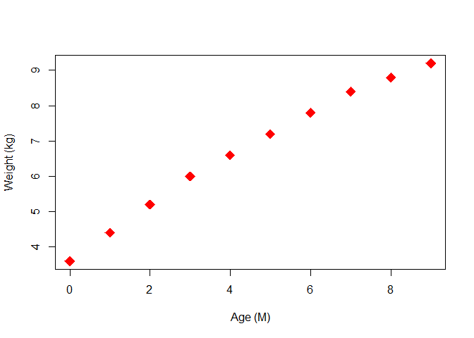
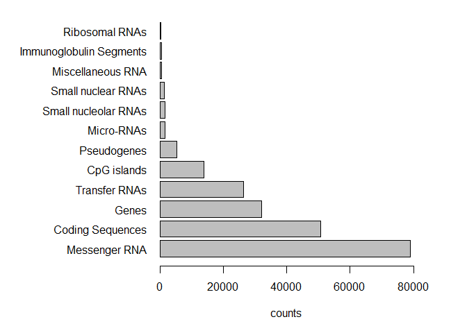
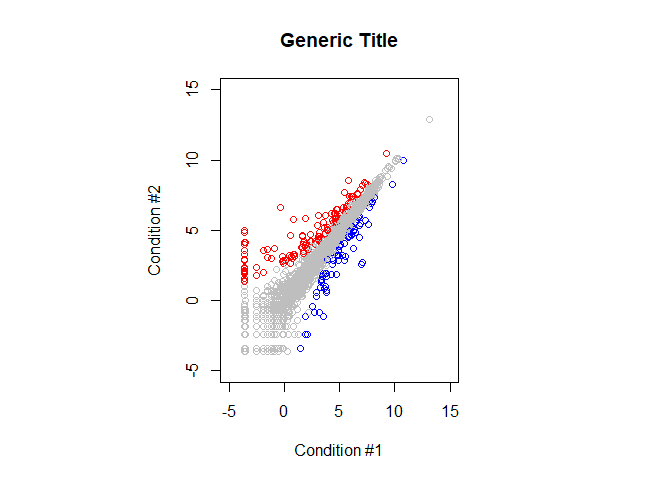

Class 05: Data exploration and visualization in R
================

``` r
# class 5 R graphics and plots
weight <- read.table("bimm143_05_rstats/weight_chart.txt", header = TRUE)
```

``` r
# plot a scaterplot of age vs weight
plot(weight$Age, weight$Weight, xlab="Age (M)", ylab="Weight (kg)",pch=18, cex=(2),col="red")
```

<!-- -->

``` r
#Class05 Section 2B Barplot

feature_counts <- read.table("bimm143_05_rstats/feature_counts.txt", header = TRUE, sep="\t")
feature_counts
```

    ##                    Feature Count
    ## 1            Messenger RNA 79049
    ## 2         Coding Sequences 50770
    ## 3                    Genes 32029
    ## 4            Transfer RNAs 26248
    ## 5              CpG islands 13840
    ## 6              Pseudogenes  5195
    ## 7               Micro-RNAs  1638
    ## 8     Small nucleolar RNAs  1602
    ## 9       Small nuclear RNAs  1431
    ## 10       Miscellaneous RNA   491
    ## 11 Immunoglobulin Segments   474
    ## 12          Ribosomal RNAs   341

``` r
par(mar=c(5,12,1,4))
barplot(feature_counts$Count,names.arg = feature_counts$Feature, horiz = TRUE, xlab = "counts", las = 1, xlim = c(0,80000))
```

<!-- -->

``` r
genes <- read.table("bimm143_05_rstats/up_down_expression.txt", header = TRUE, sep="\t")

palette()
```

    ## [1] "black"   "red"     "green3"  "blue"    "cyan"    "magenta" "yellow" 
    ## [8] "gray"

``` r
levels(genes$State)
```

    ## [1] "down"       "unchanging" "up"

``` r
nrow(genes)
```

    ## [1] 5196

``` r
ncol(genes)
```

    ## [1] 4

``` r
unique(genes$State)
```

    ## [1] unchanging up         down      
    ## Levels: down unchanging up

``` r
table(genes$State)
```

    ## 
    ##       down unchanging         up 
    ##         72       4997        127

``` r
palette(c("blue","grey","red"))
par(mar=c(5.1,11.5,4.1,11.1))
plot(genes$Condition1, genes$Condition2, col=genes$State, xlab = "Condition #1", ylab = "Condition #2", main = "Generic Title", xlim = (c(-5,15)), ylim = (c(-5,15)))
```

<!-- -->
