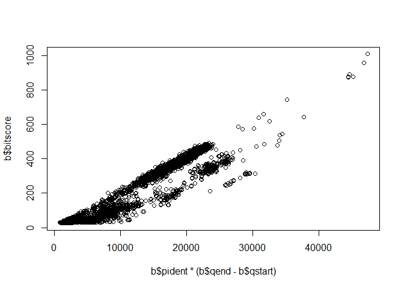
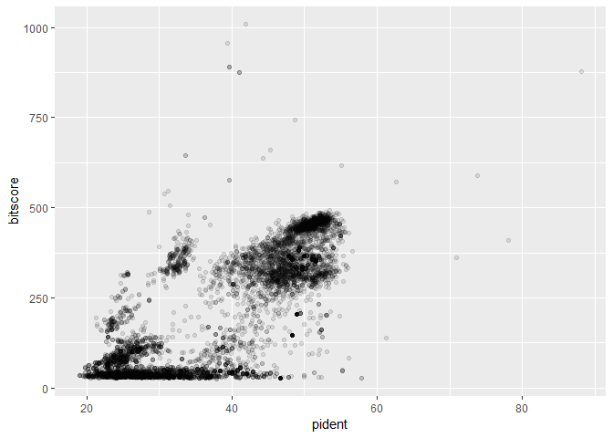

Class 16: Essential UNIX for bioinformatics
================

``` r
read.delim("mm-second.x.zebrafish.tsv")
```

    ##         YP_220550.1    NP_059331.1 X69.010 X313 X97 X0   X4 X316   X10
    ## 1       YP_220551.1    NP_059332.1  44.509  346 188  3    1  344     1
    ## 2       YP_220551.1    NP_059341.1  24.540  163 112  3  112  263   231
    ## 3       YP_220551.1    NP_059340.1  26.804   97  65  2   98  188   200
    ## 4       YP_220552.1    NP_059333.1  88.132  514  61  0    1  514     1
    ## 5       YP_220552.1 XP_021326074.1  31.818   66  32  2  427  482    16
    ## 6       YP_220552.1 XP_005162943.1  31.818   66  32  2  427  482    48
    ## 7       YP_220553.1    NP_059334.1  70.925  227  66  0    1  227     1
    ## 8       YP_220553.1 NP_001038725.1  28.571   70  46  2   15   84   261
    ## 9       YP_220553.1 XP_005161478.1  28.571   70  46  2   15   84   261
    ## 10      YP_220553.1 XP_021324580.1  28.571   70  46  2   15   84   163
    ## 11      YP_220554.1 XP_002665692.3  25.862   58  42  1    5   61  2588
    ## 12      YP_220554.1 XP_021324264.1  25.862   58  42  1    5   61  2278
    ## 13      YP_220554.1 XP_009290033.1  50.000   30  13  1   26   55    42
    ## 14      YP_220554.1 XP_005156656.1  37.931   29  17  1   34   61   167
    ## 15      YP_220554.1 NP_001007391.1  37.931   29  17  1   34   61   167
    ## 16      YP_220555.1    NP_059336.1  52.212  226 107  1    1  225     1
    ## 17      YP_220556.1    NP_059337.1  78.161  261  57  0    1  261     1
    ## 18      YP_220556.1 XP_021330598.1  37.838   37  23  0    3   39    37
    ## 19      YP_220556.1 NP_001139036.1  37.838   37  23  0    3   39    37
    ## 20      YP_220556.1 NP_001070643.1  36.111   36  19  1  173  208   675
    ## 21      YP_220557.1    NP_059338.1  61.207  116  44  1    1  115     1
    ## 22      YP_220558.1    NP_059339.1  53.061   98  46  0    1   98     1
    ## 23      YP_220558.1 NP_001002376.1  57.895   19   8  0   20   38   136
    ## 24      YP_220558.1 XP_005158565.1  57.895   19   8  0   20   38   149
    ## 25      YP_220558.1    XP_706537.4  31.373   51  25  2   40   80    65
    ## 26      YP_220559.1    NP_059340.1  62.582  457 170  1    1  456     1
    ## 27      YP_220559.1    NP_059341.1  23.039  204 146  6  106  306   128
    ## 28      YP_220559.1    NP_059332.1  32.432  111  59  6  198  304    97
    ## 29      YP_220559.1 XP_009301289.1  24.074  108  65  4  169  276   148
    ## 30      YP_220560.1    NP_059341.1  55.126  595 257  8    7  597     9
    ## 31      YP_220560.1    NP_059340.1  23.077  351 246 11  107  442    84
    ## 32      YP_220560.1    NP_059332.1  24.171  211 145  6  226  433   105
    ## 33      YP_220560.1 XP_017210528.1  26.087   69  44  1  365  433   129
    ## 34      YP_220560.1 NP_001159387.1  26.087   69  44  1  365  433   142
    ## 35      YP_220560.1 XP_021330470.1  30.645   62  38  2  164  223   379
    ## 36      YP_220560.1    XP_689554.6  35.417   48  28  1  554  598  1107
    ## 37      YP_220561.1    NP_059342.1  37.143  140  72  3    1  127     1
    ## 38      YP_220561.1 NP_001038688.1  29.412   85  54  3   33  112   306
    ## 39      YP_220562.1    NP_059343.1  73.810  378  99  0    1  378     1
    ## 40      YP_220562.1 XP_021322416.1  28.704  108  60  4  223  315   263
    ## 41      YP_220562.1 XP_021322415.1  28.704  108  60  4  223  315   263
    ## 42      YP_220562.1 XP_021322414.1  28.704  108  60  4  223  315   310
    ## 43      YP_220562.1 XP_021322413.1  28.704  108  60  4  223  315   310
    ## 44      NP_034776.1 XP_009303575.2  28.571  119  79  3  146  259   172
    ## 45      NP_034776.1 XP_021327946.1  26.230  122  85  1  146  262   171
    ## 46      NP_034776.1 XP_021327944.1  25.424  118  81  2  146  259   108
    ## 47      NP_034776.1 XP_009303559.1  25.424  118  81  2  146  259   108
    ## 48      NP_034776.1 XP_001337601.1  33.333   72  46  1  146  215    30
    ## 49      NP_034776.1 XP_021327940.1  26.667   75  55  0  141  215    80
    ## 50      NP_034776.1 XP_021327947.1  25.203  123  77  3   96  215   118
    ## 51      NP_034776.1 XP_017213526.1  25.203  123  77  3   96  215   105
    ## 52      NP_034776.1 NP_001104712.1  34.286   70  44  1  146  213    30
    ## 53      NP_034776.1 XP_021327939.1  30.667   75  52  0  141  215   145
    ## 54      NP_034776.1 XP_005165074.1  30.588   85  55  3  146  229   306
    ## 55      NP_034776.1 XP_009299422.1  30.588   85  55  3  146  229   366
    ## 56      NP_034776.1 XP_001339584.3  30.588   85  55  3  146  229   397
    ## 57      NP_034776.1 XP_021327240.1  30.588   85  55  3  146  229   366
    ## 58      NP_034776.1 XP_021327239.1  30.588   85  55  3  146  229   397
    ## 59      NP_034776.1 XP_017213618.1  29.310  116  78  3  146  260    10
    ## 60      NP_034776.1 XP_005172686.1  25.197  127  83  3  146  260   140
    ## 61      NP_034776.1 XP_021335010.1  25.197  127  83  3  146  260   140
    ## 62      NP_034776.1 XP_005172687.1  25.197  127  83  3  146  260    56
    ## 63      NP_034776.1 XP_021335011.1  25.197  127  83  3  146  260    56
    ## 64      NP_034776.1 XP_003198916.1  28.571  105  66  4  154  256    25
    ## 65      NP_034776.1 NP_001035128.1  26.108  203 118  4   28  218    29
    ## 66      NP_034776.1 XP_005167715.1  33.803   71  46  1  146  215    26
    ## 67      NP_034776.1 NP_001124136.1  33.803   71  46  1  146  215    26
    ## 68      NP_034776.1 XP_021327945.1  28.169   71  50  1  146  215   150
    ## 69      NP_034776.1 XP_009303560.1  28.169   71  50  1  146  215   150
    ## 70      NP_034776.1 XP_021323809.1  26.108  203 118  4   28  218    40
    ## 71      NP_034776.1 XP_003199282.2  29.752  121  72  4  150  260    18
    ## 72      NP_034776.1 XP_021324610.1  29.577   71  50  0  143  213    33
    ## 73      NP_034776.1 XP_021324610.1  26.761   71  51  1  148  218  1385
    ## 74      NP_034776.1 XP_021324610.1  26.515  132  88  5  134  256  1219
    ## 75      NP_034776.1 XP_021324610.1  26.667   60  42  1  146  203  1090
    ## 76      NP_034776.1 XP_021324610.1  28.333   60  41  1  146  203   171
    ## 77      NP_034776.1 XP_021324610.1  22.857   70  52  2  153  221   470
    ## 78      NP_034776.1 XP_021324610.1  26.027   73  50  2  149  218  1829
    ## 79      NP_034776.1 XP_021329528.1  27.848   79  56  1  140  218  1158
    ## 80      NP_034776.1 XP_021326217.1  27.848   79  56  1  140  218  1161
    ## 81      NP_034776.1 NP_001038207.1  31.081   74  50  1  145  218   126
    ## 82      NP_034776.1 XP_021327941.1  24.194  124  84  3   96  215    95
    ## 83      NP_034776.1 NP_001122059.1  26.415  106  74  2  154  256    25
    ## 84      NP_034776.1 XP_017209117.1  25.714   70  52  0  147  216   193
    ## 85      NP_034776.1 NP_001297773.1  36.000   75  43  2  146  216  1223
    ## 86      NP_034776.1 NP_001297773.1  26.573  143  98  2  126  261   477
    ## 87      NP_034776.1 NP_001297773.1  26.316  133  86  6  144  264   210
    ## 88      NP_034776.1 NP_001121843.1  31.081   74  50  1  145  218   117
    ## 89      NP_034776.1 XP_002663014.2  27.723  101  70  1  141  238   502
    ## 90      NP_034776.1 XP_002663014.2  31.148   61  39  1  146  203   365
    ## 91      NP_034776.1 XP_002663014.2  27.848   79  51  2  144  217  1228
    ## 92      NP_034776.1 XP_002663014.2  20.472  127  92  4  144  264  1088
    ## 93      NP_034776.1 XP_002663014.2  24.107  112  76  4  162  264   240
    ## 94      NP_034776.1 XP_002663014.2  24.675   77  56  1  141  215   933
    ## 95      NP_034776.1 XP_009303416.1  30.000   70  48  1  146  215   142
    ## 96      NP_034776.1 NP_001035139.1  31.507   73  49  1  146  218   119
    ## 97      NP_034776.1 XP_005170656.1  21.311  122  84  3  146  256   172
    ## 98      NP_034776.1 XP_021325734.1  21.311  122  84  3  146  256   172
    ## 99      NP_034776.1 NP_001035129.1  23.316  193 117  7   41  229    42
    ## 100     NP_034776.1 NP_001038606.3  32.394   71  47  1  144  213    28
    ## 101     NP_034776.1 XP_021324413.1  32.530   83  51  2  132  213    24
    ## 102     NP_034776.1 XP_005155516.1  26.214  103  54  3  146  248   171
    ## 103     NP_034776.1 XP_005167444.1  33.333   72  46  2  146  216    85
    ## 104     NP_034776.1 XP_002660626.3  30.303   66  44  2  154  218   150
    ## 105     NP_034776.1 XP_009303414.1  25.439  114  69  4  107  214   527
    ## 106     NP_034776.1 XP_021333338.1  26.667  105  68  4  154  256    25
    ## 107     NP_034776.1 XP_005155783.1  31.507   73  48  1  146  216   832
    ## 108     NP_034776.1 XP_005155783.1  31.579   76  49  2  153  225   252
    ## 109     NP_034776.1 XP_005155783.1  24.051   79  57  2  146  221   391
    ## 110     NP_034776.1 NP_001025393.1  26.606  109  73  2  154  256    25
    ## 111     NP_034776.1 XP_009301106.1  26.606  109  73  2  154  256    25
    ## 112     NP_034776.1 XP_017213643.1  24.138   58  44  0  158  215    30
    ## 113     NP_034776.1 NP_001104711.1  27.273  121  75  4  150  260    32
    ## 114     NP_034776.1 XP_021332405.1  32.468   77  44  3  146  215   179
    ## 115     NP_034776.1 XP_005160964.1  30.556   72  49  1  143  213    28
    ## 116     NP_034776.1 XP_005167430.1  29.577   71  48  2  146  215   130
    ## 117     NP_034776.1 XP_002660625.1  25.882   85  56  2  136  220    48
    ## 118     NP_034776.1 NP_001352014.1  30.556   72  49  1  143  213    28
    ## 119     NP_034776.1 NP_001096098.2  30.556   72  49  1  143  213    28
    ## 120     NP_034776.1 NP_001107113.1  29.577   71  48  2  146  215   138
    ## 121     NP_034776.1 XP_021324414.1  30.556   72  49  1  143  213    28
    ## 122     NP_034776.1 NP_001231964.1  30.556   72  49  1  143  213    28
    ## 123     NP_034776.1 NP_001093553.1  25.926  108  67  5  154  256    25
    ## 124     NP_034776.1 NP_001082919.1  26.667  105  68  4  154  256    25
    ## 125     NP_034776.1 NP_001093550.1  28.421   95  53  3  154  248    24
    ## 126     NP_034776.1 XP_021333043.1  25.926  108  67  5  154  256   187
    ## 127     NP_034776.1 XP_021327532.1  34.328   67  42  1  152  216    28
    ## 128     NP_034776.1 NP_001108380.1  33.333   60  39  1  143  201    28
    ## 129     NP_034776.1 XP_017211404.1  31.250   64  43  1  155  218   195
    ## 130     NP_034776.1 NP_001186302.2  24.286   70  51  1  146  215   223
    ## 131     NP_034776.1 XP_005160961.1  30.556   72  49  1  143  213    28
    ## 132     NP_034776.1 XP_009293464.2  31.250   64  43  1  155  218   196
    ## 133     NP_034776.1    NP_999853.1  26.136   88  58  2  146  233  1346
    ## 134     NP_034776.1 XP_003197805.3  30.882   68  43  2  154  218   194
    ## 135     NP_034776.1    XP_686182.6  27.160   81  58  1  133  213  1290
    ## 136     NP_034776.1 XP_021335186.1  30.435   69  48  0  146  214   236
    ## 137     NP_034776.1 XP_021333626.1  27.160   81  58  1  133  213  1327
    ## 138     NP_034776.1 XP_005166542.1  27.160   81  58  1  133  213  1328
    ## 139     NP_034776.1 XP_009301150.1  23.077  104  78  2  154  256    25
    ## 140     NP_034776.1 NP_001313501.1  32.394   71  46  2  146  216   151
    ## 141     NP_034776.1 NP_001093539.1  25.714  105  69  4  154  256    25
    ## 142     NP_034776.1 NP_001314983.1  26.415  106  69  4  154  256    25
    ## 143     NP_034776.1 NP_001093462.1  25.714  105  69  4  154  256    25
    ## 144     NP_034776.1 XP_009301138.1  25.714  105  69  4  154  256    25
    ## 145     NP_034776.1 XP_017212678.2  22.727  110  81  3  154  260    21
    ## 146     NP_034776.1 NP_001020651.1  26.415  106  69  4  154  256    25
    ## 147     NP_034776.1 XP_001344010.4  28.226  124  75  6  153  263   253
    ## 148     NP_034776.1 XP_001344010.4  22.400  125  89  2  146  262   392
    ## 149     NP_034776.1 XP_001344010.4  26.667   75  49  2  141  209   968
    ## 150     NP_034776.1 XP_001344010.4  25.000  108  67  4  140  238   524
    ## 151     NP_034776.1 XP_021327061.1  28.226  124  75  6  153  263   253
    ## 152     NP_034776.1 XP_021327061.1  22.400  125  89  2  146  262   392
    ## 153     NP_034776.1 XP_021327061.1  26.667   75  49  2  141  209   968
    ## 154     NP_034776.1 XP_021327061.1  25.000  108  67  4  140  238   524
    ## 155     NP_034776.1 XP_009304139.1  26.957  115  75  5  152  258   227
    ## 156     NP_034776.1 XP_009304139.1  29.730   74  43  3  152  218   962
    ## 157     NP_034776.1 NP_001038504.2  26.316   76  51  1  146  216   128
    ## 158     NP_034776.1 XP_003200902.3  28.571  133  72  9  147  258   495
    ## 159     NP_034776.1 XP_003200902.3  38.000   50  30  1  154  202   632
    ## 160     NP_034776.1 XP_003200902.3  30.435   92  59  3  125  213   717
    ## 161     NP_034776.1 XP_003200902.3  36.508   63  35  3  154  213    20
    ## 162     NP_034776.1 XP_003200902.3  23.853  109  72  3  154  256   145
    ## 163     NP_034776.1 XP_003200902.3  31.507   73  41  4  148  213   248
    ## 164     NP_034776.1 XP_017208935.1  26.316   76  55  1  141  216  1028
    ## 165     NP_034776.1 NP_001093543.1  30.612   49  34  0  154  202    25
    ## 166     NP_034776.1 NP_001313502.1  32.394   71  46  2  146  216   106
    ## 167     NP_034776.1 XP_021324717.1  27.907  129  72  7  147  256   495
    ## 168     NP_034776.1 XP_021324717.1  29.348   92  60  3  125  213   716
    ## 169     NP_034776.1 XP_021324717.1  32.653   49  33  0  154  202   632
    ## 170     NP_034776.1 XP_021324717.1  36.508   63  35  3  154  213    20
    ## 171     NP_034776.1 XP_021324717.1  23.853  109  72  3  154  256   145
    ## 172     NP_034776.1 NP_001121833.1  24.528  106  75  4  154  256    25
    ## 173     NP_034776.1 NP_001093551.1  22.330  103  75  1  154  256    25
    ## 174     NP_034776.1 XP_009301145.1  21.698  106  79  2  154  256    25
    ## 175     NP_034776.1 XP_009301132.1  24.528  106  75  4  154  256    25
    ## 176     NP_034776.1 XP_001919193.1  28.302  106  69  4  154  254    25
    ## 177     NP_034776.1 XP_017212274.1  30.612   49  34  0  154  202    25
    ## 178     NP_034776.1 XP_009290672.1  20.889  225 143  9    4  217    27
    ## 179     NP_034776.1 XP_021335187.1  30.000   70  49  0  146  215   105
    ## 180     NP_034776.1 NP_001170922.1  22.973   74  54  1  146  216   190
    ## 181     NP_034776.1 XP_002662681.2  23.585  106  77  2  154  256    25
    ## 182     NP_034776.1 XP_009290670.1  21.304  230 150  8    4  217    27
    ## 183     NP_034776.1 XP_021333337.1  26.126  111  75  3  154  260    25
    ## 184     NP_034776.1 XP_021333333.1  27.679  112  74  4  154  260    25
    ## 185     NP_034776.1 XP_021333342.1  21.698  106  79  2  154  256    25
    ## 186     NP_034776.1 XP_021331663.1  24.286   70  52  1  146  215  8702
    ## 187     NP_034776.1 NP_001313486.1  23.944   71  53  1  146  216   401
    ## 188     NP_034776.1 NP_001020652.1  28.358   67  43  2  154  218    25
    ## 189     NP_034776.1 XP_017212679.1  25.472  106  74  4  154  256    34
    ## 190     NP_034776.1 NP_001314984.1  28.358   67  43  2  154  218    25
    ## 191     NP_034776.1 XP_017212436.1  21.698  106  78  1  154  259    25
    ## 192     NP_034776.1 XP_017212436.1  27.692   65  36  2  156  213   131
    ## 193     NP_034776.1 NP_001315006.1  24.528  106  75  4  154  256    25
    ## 194     NP_034776.1 XP_009301135.1  24.528  106  75  4  154  256    25
    ## 195     NP_034776.1 XP_021324715.1  28.070  114  69  7  154  256   511
    ## 196     NP_034776.1 XP_021324715.1  29.167   96  55  5  125  213   719
    ## 197     NP_034776.1 XP_021324716.1  28.070  114  69  7  154  256   510
    ## 198     NP_034776.1 XP_021324716.1  29.167   96  55  5  125  213   718
    ## 199     NP_034776.1 XP_021333211.1  28.358   67  43  2  154  218    25
    ## 200     NP_034776.1 XP_021327448.1  25.000   68  48  1  154  218    16
    ## 201     NP_034776.1 XP_005163514.1  26.027   73  51  2  146  215   608
    ## 202     NP_034776.1 XP_001337068.6  30.208   96  54  5  125  213   719
    ## 203     NP_034776.1 XP_001337068.6  35.821   67  37  4  154  216   511
    ## 204     NP_034776.1 XP_001337068.6  34.921   63  36  3  154  213    20
    ## 205     NP_034776.1 XP_017208517.2  30.208   96  54  5  125  213   718
    ## 206     NP_034776.1 XP_017208517.2  35.821   67  37  4  154  216   510
    ## 207     NP_034776.1 XP_017208517.2  34.921   63  36  3  154  213    20
    ## 208     NP_034776.1 XP_009290811.1  32.759   58  35  3  199  254    71
    ## 209     NP_034776.1 XP_009290811.1  26.190   84  57  2  142  222   120
    ## 210     NP_034776.1 NP_001103314.2  24.528  106  75  4  154  256    25
    ## 211     NP_034776.1 NP_001188329.1  23.944   71  53  1  144  213    26
    ## 212     NP_034776.1 NP_001076271.1  27.358  106  72  5  154  256    25
    ## 213     NP_034776.1 XP_009294520.1  20.354  113  71  3  146  258  2017
    ## 214     NP_034776.1 NP_001131130.1  20.354  113  71  3  146  258  2047
    ## 215     NP_034776.1 XP_021335897.1  21.429   70  55  0  146  215   517
    ## 216     NP_034776.1 NP_001116876.1  27.941   68  45  2  154  218    25
    ## 217     NP_034776.1 NP_001230252.1  28.788   66  38  4  154  214    28
    ## 218     NP_034776.1 XP_021324202.1  28.788   66  38  4  154  214    28
    ## 219     NP_034776.1 NP_001153806.1  22.785   79  61  0  140  218    22
    ## 220     NP_034776.1 NP_001103299.1  22.785   79  61  0  140  218    23
    ## 221     NP_034776.1 XP_021334266.1  22.785   79  61  0  140  218    23
    ## 222     NP_034776.1 NP_001314987.1  29.851   67  44  2  154  218    25
    ## 223     NP_034776.1 XP_021333223.1  29.851   67  44  2  154  218    25
    ## 224     NP_034776.1 NP_001025280.1  29.851   67  44  2  154  218    25
    ## 225     NP_034776.1 XP_021333760.1  24.138  116  81  4  154  262    24
    ## 226     NP_034776.1 XP_017212361.1  29.851   67  44  2  154  218    25
    ## 227     NP_034776.1 XP_021329077.1  38.095   63  34  3  154  213    21
    ## 228     NP_034776.1 XP_021329077.1  30.000  100  57  5  125  213   209
    ## 229     NP_034776.1 XP_021329076.1  38.095   63  34  3  154  213    21
    ## 230     NP_034776.1 XP_021329076.1  30.000  100  57  5  125  213   209
    ## 231     NP_034776.1 XP_021329075.1  38.095   63  34  3  154  213    21
    ## 232     NP_034776.1 XP_021329075.1  30.000  100  57  5  125  213   209
    ## 233     NP_034776.1 NP_001025306.1  26.087   69  47  2  154  219    25
    ## 234     NP_034776.1 XP_021324869.1  28.333   60  41  1  146  203   341
    ## 235     NP_034776.1 XP_021327446.1  26.562   64  44  1  158  218     1
    ## 236     NP_034776.1 XP_021333334.1  25.000  108  72  5  154  256    25
    ## 237     NP_034776.1 XP_017210940.1  29.464  112  65  5  154  255   142
    ## 238     NP_034776.1 NP_001093472.1  24.762  105  70  4  154  256    25
    ## 239     NP_034776.1 XP_021334722.1  27.160   81  46  4  144  213    43
    ## 240     NP_034776.1 NP_001314972.1  27.536   69  46  2  154  219    25
    ## 241     NP_034776.1 XP_009301100.1  27.536   69  46  2  154  219    25
    ## 242     NP_034776.1 XP_002661027.3  26.506   83  60  1  133  215   899
    ## 243     NP_034776.1 XP_017212439.2  22.642  106  78  3  154  256    23
    ## 244     NP_034776.1 NP_001020650.1  27.536   69  46  2  154  219    25
    ## 245     NP_034776.1 NP_001093552.1  26.471   68  47  3  154  219    25
    ## 246     NP_034776.1 XP_021328654.1  29.688   64  42  1  156  216   313
    ## 247     NP_034776.1 XP_021328654.1  26.667   60  41  2  154  213    35
    ## 248     NP_034776.1 XP_021322565.1  29.688   64  42  1  156  216   313
    ## 249     NP_034776.1 XP_021322565.1  26.667   60  41  2  154  213    35
    ## 250     NP_034776.1 XP_017207814.2  26.554  177  90  8   28  185    39
    ## 251     NP_034776.1 XP_021327622.1  28.571   63  40  2  158  216   183
    ## 252     NP_034776.1 XP_021333330.1  25.758   66  48  1  154  219    25
    ## 253     NP_034776.1 NP_001026840.1  20.755  106  80  3  154  256    25
    ## 254     NP_034776.1 XP_005155331.2  27.143   70  51  0  154  223   213
    ## 255     NP_034776.1 XP_021328655.1  26.667   60  41  2  154  213    35
    ## 256     NP_034776.1 XP_009290532.1  26.667   60  41  2  154  213    35
    ## 257     NP_034776.1 XP_009293025.1  25.352   71  49  2  146  214    23
    ## 258     NP_034776.1 XP_021329166.1  28.571   49  31  1  156  200    37
    ## 259     NP_034776.1 XP_017207976.1  25.352   71  49  2  146  214    23
    ## 260     NP_034776.1 XP_021333340.1  26.866   67  46  2  154  218    25
    ## 261     NP_034776.1 XP_009293024.1  25.352   71  49  2  146  214    23
    ## 262     NP_034776.1 XP_017207977.1  25.352   71  49  2  146  214    23
    ## 263     NP_034776.1 XP_009293023.1  25.352   71  49  2  146  214    23
    ## 264     NP_034776.1 XP_021325374.1  28.571   49  31  1  156  200    37
    ## 265     NP_034776.1 XP_021322025.1  31.944   72  44  3  154  222    25
    ## 266     NP_034776.1 XP_009293022.1  25.352   71  49  2  146  214    23
    ## 267     NP_034776.1 NP_001124070.2  25.352   71  49  2  146  214    23
    ## 268     NP_034776.1 XP_021333300.1  28.000  125  66  6  150  261    46
    ## 269     NP_034776.1 XP_017212723.2  34.615   52  33  1  153  203    41
    ## 270     NP_034776.1 XP_021337075.1  28.571   63  41  2  154  213    32
    ## 271     NP_034776.1 XP_009297114.1  28.571   63  41  2  154  213    32
    ## 272  NP_001005418.1 NP_001034768.1  41.935   31  17  1   62   91    32
    ## 273  NP_001005418.1    NP_955983.2  40.625   32  19  0   52   83   310
    ## 274  NP_001005418.1 XP_021335718.1  47.826   23  12  0   66   88   221
    ## 275  NP_001005418.1 XP_009304870.1  47.826   23  12  0   66   88   439
    ## 276  NP_001005418.1 XP_021335716.1  47.826   23  12  0   66   88   439
    ## 277  NP_001005418.1 XP_021335715.1  47.826   23  12  0   66   88   439
    ## 278  NP_001005418.1 XP_021327588.1  33.333   60  32  1   34   85   487
    ## 279  NP_001005418.1 XP_021327589.1  33.333   60  32  1   34   85   487
    ## 280  NP_001005418.1 XP_021327590.1  33.333   60  32  1   34   85   466
    ## 281  NP_001005418.1 NP_001121764.2  33.962   53  35  0    3   55    60
    ## 282  NP_001005418.1 XP_005169862.1  41.026   39  22  1   26   64    57
    ## 283  NP_001005418.1 NP_001070803.1  41.026   39  22  1   26   64    57
    ## 284  NP_001005418.1 XP_021334699.1  35.000   40  15  1   25   64  1192
    ## 285     NP_033511.1 NP_001094425.1  33.956  857 527 18   18  847    12
    ## 286     NP_033511.1 NP_001038510.1  32.555  857 538 14   18  847     1
    ## 287     NP_033511.1 XP_021328990.1  33.670  793 488 15   75  848    73
    ## 288     NP_033511.1 XP_009291997.1  32.826  789 501 15   75  847    82
    ## 289     NP_033511.1 XP_021328986.1  32.700  789 502 15   75  847    82
    ## 290     NP_033511.1 XP_009291998.1  32.234  788 474 15   75  847    82
    ## 291     NP_033511.1 XP_021328987.1  32.107  788 475 15   75  847    82
    ## 292     NP_033511.1 NP_001018157.1  31.907  818 512 16   56  839     3
    ## 293     NP_033511.1    XP_685124.6  33.915  802 485 15   73  847    80
    ## 294     NP_033511.1 XP_021328979.1  35.108  695 413 14  173  849    13
    ## 295     NP_033511.1 XP_009291983.1  33.166  799 486 20   75  847    74
    ## 296     NP_033511.1 XP_001332717.1  33.838  792 488 16   74  848    77
    ## 297     NP_033511.1 XP_021328981.1  33.789  805 483 18   73  847    80
    ## 298     NP_033511.1 XP_003200515.2  34.275  779 481 15   81  839    87
    ## 299     NP_033511.1 XP_021328992.1  34.275  779 481 15   81  839    87
    ## 300     NP_033511.1 XP_017207581.2  34.449  807 459 20   70  849   103
    ## 301     NP_033511.1 NP_001077346.1  33.628  791 488 15   81  847    86
    ## 302     NP_033511.1 NP_001076368.1  32.445  863 542 16   15  848    16
    ## 303     NP_033511.1 NP_001103760.1  34.152  814 462 22   74  847    73
    ## 304     NP_033511.1 XP_021323524.1  34.439  784 475 18   81  839     1
    ## 305     NP_033511.1 NP_001122034.1  32.967  819 480 21   52  847    61
    ## 306     NP_033511.1 XP_009291967.1  33.461  786 473 16   81  847    86
    ## 307     NP_033511.1 XP_021323521.1  34.799  796 474 18   74  847     3
    ## 308     NP_033511.1 NP_001076358.1  34.069  816 485 17   65  847    56
    ## 309     NP_033511.1    XP_696754.5  33.708  801 473 23   74  847    79
    ## 310     NP_033511.1 XP_017207596.1  33.836  795 483 16   74  847    79
    ## 311     NP_033511.1 NP_001103761.1  32.294  802 495 14   73  848    73
    ## 312     NP_033511.1 XP_009292019.1  33.583  801 483 16   74  847    79
    ## 313     NP_033511.1 XP_017207428.1  33.585  795 485 18   75  847    90
    ## 314     NP_033511.1 XP_021328985.1  33.745  809 463 21   74  848    82
    ## 315     NP_033511.1 XP_001334567.2  33.622  809 464 21   74  848    82
    ## 316     NP_033511.1 NP_001153312.1  33.291  790 480 16   74  847    75
    ## 317     NP_033511.1    XP_685037.5  33.375  800 491 16   74  847    80
    ## 318     NP_033511.1 NP_001103413.1  33.625  800 464 19   74  848    75
    ## 319     NP_033511.1 XP_009292006.1  32.304  842 485 21   47  848    55
    ## 320     NP_033511.1 XP_001333318.4  33.375  800 483 15   74  847    79
    ## 321     NP_033511.1    XP_696250.7  33.540  808 466 21   74  848    96
    ## 322     NP_033511.1 XP_002665412.3  33.333  801 492 16   73  847    79
    ## 323     NP_033511.1 XP_021328980.1  33.415  814 464 22   74  848    86
    ## 324     NP_033511.1 XP_021328974.1  32.590  807 473 22   70  848    71
    ## 325     NP_033511.1 XP_017207578.1  32.590  807 473 22   70  848    71
    ## 326     NP_033511.1 XP_021328982.1  32.304  842 485 21   47  848    55
    ## 327     NP_033511.1 XP_009292025.1  34.053  787 486 16   81  847    85
    ## 328     NP_033511.1 XP_009291957.1  33.668  796 447 21   74  839    75
    ## 329     NP_033511.1 XP_021328973.1  32.459  801 483 20   70  848    71
    ## 330     NP_033511.1 XP_001345668.3  32.459  801 483 20   70  848    71
    ## 331     NP_033511.1 NP_001103759.1  34.043  799 466 19   74  849    72
    ## 332     NP_033511.1    XP_683954.5  34.307  787 482 16   81  847    86
    ## 333     NP_033511.1 NP_001076568.1  33.459  795 500 15   69  847    37
    ## 334     NP_033511.1 NP_001074079.1  33.581  807 478 18   69  848    73
    ## 335     NP_033511.1 NP_001353272.1  32.743  791 481 18   74  847    89
    ## 336     NP_033511.1 XP_001332644.4  33.969  786 482 15   81  842    86
    ## 337     NP_033511.1 NP_001103412.1  33.333  792 480 14   74  849    75
    ## 338     NP_033511.1 NP_001119923.1  33.416  805 470 18   73  847    59
    ## 339     NP_033511.1 XP_009291943.1  33.207  792 480 14   74  849    75
    ## 340     NP_033511.1 XP_001332817.5  32.795  805 512 11   65  847    59
    ## 341     NP_033511.1 XP_001332214.6  33.885  785 476 17   81  839    86
    ## 342     NP_033511.1 XP_021328975.1  31.732  791 470 16   70  848    71
    ## 343     NP_033511.1 XP_009291932.1  31.732  791 470 16   70  848    71
    ## 344     NP_033511.1 XP_021323509.1  33.627  794 472 20   74  847    83
    ## 345     NP_033511.1    XP_684062.4  33.291  796 495 15   73  847    78
    ## 346     NP_033511.1 XP_021328976.1  33.248  779 495 16   75  839    81
    ## 347     NP_033511.1 NP_001153313.1  33.666  802 461 19   74  847    74
    ## 348     NP_033511.1 XP_021328984.1  31.468  804 499 14   76  847    83
    ## 349     NP_033511.1 XP_001335414.4  31.468  804 499 14   76  847    83
    ## 350     NP_033511.1 XP_001335160.3  34.122  803 467 27   74  847    79
    ## 351     NP_033511.1 XP_021323513.1  34.122  803 467 27   74  847    79
    ## 352     NP_033511.1 XP_021323526.1  33.460  789 476 20   81  839    10
    ## 353     NP_033511.1 XP_017207591.1  31.559  789 489 16   81  839     4
    ## 354     NP_033511.1    XP_683668.6  33.460  789 476 20   81  839    86
    ## 355     NP_033511.1 XP_017207589.2  31.360  794 494 16   76  839    83
    ## 356     NP_033511.1 XP_021328991.1  31.281  796 492 17   76  839    83
    ## 357     NP_033511.1 XP_021328983.1  31.453  833 450 19   47  848    55
    ## 358     NP_033511.1 XP_009292007.1  31.453  833 450 19   47  848    55
    ## 359     NP_033511.1 XP_021323612.1  41.004  478 270  6  378  848    26
    ## 360     NP_033511.1 XP_021328978.1  31.830  798 501 16   76  847    83
    ## 361     NP_033511.1 XP_001919635.1  31.421  802 499 15   76  847    83
    ## 362     NP_033511.1    XP_684341.5  33.501  794 501 13   73  847    79
    ## 363     NP_033511.1 XP_009292037.1  32.357  785 457 18   81  839    86
    ## 364     NP_033511.1 XP_021323244.1  46.961  362 189  2  487  847     3
    ## 365     NP_033511.1 NP_001338594.1  29.312  829 515 21   63  842    52
    ## 366     NP_033511.1 XP_009291947.1  44.063  379 194  4  477  847    43
    ## 367     NP_033511.1 XP_017211901.1  28.998  838 516 21   63  842    52
    ## 368     NP_033511.1 XP_009292045.1  28.420  848 529 20   47  839    60
    ## 369     NP_033511.1 NP_001121719.1  45.000  360 194  3  490  847   184
    ## 370     NP_033511.1 XP_009291991.1  40.097  414 241  5  436  847     1
    ## 371     NP_033511.1 XP_021323523.1  45.455  341 185  1  508  847    44
    ## 372     NP_033511.1 XP_021323613.1  44.000  300 167  1  550  849    18
    ## 373     NP_033511.1 XP_021323519.1  45.660  265 144  0  584  848     1
    ## 374     NP_033511.1 NP_001034614.2  26.216  843 541 28   28  839    12
    ## 375     NP_033511.1 NP_001008731.1  25.631  792 517 25   79  843    78
    ## 376     NP_033511.1 NP_001186897.2  25.441  680 450 18  175  839   175
    ## 377     NP_033511.1 XP_021332580.1  24.632  816 525 27   78  842    82
    ## 378     NP_033511.1 XP_021332579.1  24.632  816 525 27   78  842    82
    ## 379     NP_033511.1    XP_695566.4  24.632  816 525 27   78  842    82
    ## 380     NP_033511.1 NP_001289170.1  24.510  816 526 27   78  842    78
    ## 381     NP_033511.1 NP_001289176.1  24.142  816 535 29   78  845    66
    ## 382     NP_033511.1 NP_001077325.1  21.320  788 565 15   68  839    56
    ## 383     NP_033511.1 NP_001289157.1  23.572  823 531 24   78  845    75
    ## 384     NP_033511.1 XP_009298326.1  23.572  823 531 24   78  845    75
    ## 385     NP_033511.1 XP_009298329.1  23.572  823 531 24   78  845    75
    ## 386     NP_033511.1 NP_001121815.1  23.369  843 579 22   39  845    30
    ## 387     NP_033511.1 XP_005159074.1  23.369  843 579 22   39  845    30
    ## 388     NP_033511.1 NP_001073489.1  24.331  822 523 27   80  845    92
    ## 389     NP_033511.1 NP_001116764.1  23.256  817 541 23   78  845    92
    ## 390     NP_033511.1 XP_021333966.1  23.256  817 542 24   78  845    92
    ## 391     NP_033511.1 NP_001274468.1  22.426  816 548 25   78  845    75
    ## 392     NP_033511.1 XP_001922055.2  22.426  816 548 25   78  845    75
    ## 393     NP_033511.1 XP_009291102.1  23.492  796 542 23   80  839    81
    ## 394     NP_033511.1 NP_001289154.1  23.845  801 528 24   78  839    83
    ## 395     NP_033511.1 XP_021332465.1  23.845  801 528 24   78  839    90
    ## 396     NP_033511.1 XP_005166174.1  23.845  801 528 24   78  839    90
    ## 397     NP_033511.1 NP_001034920.1  22.544  794 546 23   68  839    60
    ## 398     NP_033511.1 NP_001289167.1  23.762  808 525 31   80  839    72
    ## 399     NP_033511.1 NP_001289181.2  23.492  796 542 23   80  839    81
    ## 400     NP_033511.1 XP_021332581.1  24.415  684 443 22  196  842     1
    ## 401     NP_033511.1 XP_009293059.1  24.025  795 540 27   80  839    93
    ## 402     NP_033511.1 NP_001315639.1  23.192  802 535 24   80  839    76
    ## 403     NP_033511.1 XP_009303580.3  23.067  802 536 24   80  839    76
    ## 404     NP_033511.1 XP_002665785.3  24.055  794 541 26   80  839    93
    ## 405     NP_033511.1 XP_009291971.1  27.500  560 378 14   69  613    76
    ## 406     NP_033511.1 XP_009291945.1  27.821  514 302 20   74  549    73
    ## 407     NP_033511.1 NP_001274476.1  22.778  799 539 26   78  839    69
    ## 408     NP_033511.1 XP_005172971.1  22.778  799 539 26   78  839    69
    ## 409     NP_033511.1 XP_005172970.1  22.778  799 539 26   78  839    69
    ## 410     NP_033511.1 XP_005172969.1  22.778  799 539 26   78  839    69
    ## 411     NP_033511.1 NP_001034717.1  28.852  357 240  8  490  839   481
    ## 412     NP_033511.1 NP_001034717.1  24.631  203 128  5   52  243    64
    ## 413     NP_033511.1 XP_009292028.1  25.494  506 349 10   65  549    59
    ## 414     NP_033511.1 XP_009291954.1  26.772  508 314 18   69  549    78
    ## 415     NP_033511.1 XP_017207588.1  26.820  522 328 24   74  570    79
    ## 416     NP_033511.1 XP_021323241.1  24.798  496 326 16   74  553    75
    ## 417     NP_033511.1 XP_021323515.1  24.405  504 330 16   76  549    83
    ## 418     NP_033511.1 XP_009291988.2  24.308  506 328 17   76  549    83
    ## 419     NP_033511.1 XP_009291982.2  24.850  499 327 17   74  551    72
    ## 420     NP_033511.1 XP_009291987.1  26.946  501 312 24   74  549    79
    ## 421     NP_033511.1 XP_021323514.1  26.946  501 312 24   74  549    79
    ## 422     NP_033511.1 XP_009291944.1  25.247  507 312 19   74  555    75
    ## 423     NP_033511.1 XP_009291990.1  24.506  506 331 15   76  551    83
    ## 424     NP_033511.1 XP_009291958.1  25.498  502 301 21   74  549    75
    ## 425     NP_033511.1 XP_009292000.1  25.723  346 242  9   75  411    82
    ## 426     NP_033511.1 XP_009292013.1  27.557  352 231  9   73  408    79
    ## 427     NP_033511.1 XP_009291999.1  25.723  346 242  9   75  411    82
    ## 428     NP_033511.1 XP_021328988.1  25.723  346 242  9   75  411    82
    ## 429     NP_033511.1 XP_009292011.1  27.635  351 230  9   74  408    80
    ## 430     NP_033511.1 XP_021323520.1  27.171  357 237  9   66  410     3
    ## 431     NP_033511.1 XP_009291946.1  26.005  423 240 18   74  467    73
    ## 432     NP_033511.1 XP_021323516.1  26.629  353 232  9   75  410    73
    ## 433     NP_033511.1 XP_021323517.1  26.801  347 233  9   75  410    73
    ## 434     NP_033511.1 XP_021323385.1  25.837  418 269 13   73  464    79
    ## 435     NP_033511.1 XP_021328989.1  23.837  344 218  7   75  411    82
    ## 436     NP_033511.1 XP_021323507.1  24.558  452 285 20   74  503    75
    ## 437     NP_033511.1 XP_021323508.1  24.888  446 279 20   80  503     4
    ## 438     NP_033511.1 XP_009292002.1  27.228  202 137  5   75  271    82
    ## 439     NP_033511.1 XP_009291964.2  22.404  366 266 11   66  422    73
    ## 440     NP_033511.1 XP_017207580.1  26.786  168 119  3   74  238    75
    ## 441     NP_033511.1 XP_017207378.1  21.396  444 308 11   74  503    75
    ## 442     NP_033511.1 XP_017207584.1  34.524   84  53  1  603  684   392
    ## 443     NP_033511.1 XP_017207586.1  34.524   84  53  1  603  684   296
    ## 444     NP_033511.1 NP_001103165.1  23.602  161 100  6   83  239    83
    ## 445     NP_033511.1 XP_017212295.1  23.602  161 100  6   83  239    83
    ## 446     NP_033511.1 XP_021333059.1  23.602  161 100  6   83  239    83
    ## 447     NP_033511.1 XP_021322474.1  25.137  183  95  7   79  247    55
    ## 448     NP_033511.1 XP_021322473.1  25.137  183  95  7   79  247    55
    ## 449     NP_033511.1 XP_021322472.1  25.137  183  95  7   79  247    55
    ## 450     NP_033511.1 XP_005161118.1  27.869  122  73  4  184  302   136
    ## 451     NP_033511.1 XP_009293491.1  27.869  122  73  4  184  302   136
    ## 452     NP_033511.1 XP_005161125.1  27.869  122  73  4  184  302   136
    ## 453     NP_033511.1 XP_021324586.1  27.869  122  73  4  184  302   136
    ## 454     NP_033511.1 XP_005161126.1  27.869  122  73  4  184  302   136
    ## 455     NP_033511.1 NP_001137515.1  19.531  128 101  2  112  237    97
    ## 456     NP_033511.1 XP_021324588.1  27.869  122  73  4  184  302   136
    ## 457     NP_033511.1 NP_001070182.2  27.869  122  73  4  184  302   136
    ## 458     NP_033511.1 XP_021322611.1  22.388   67  52  0  171  237   136
    ## 459     NP_033511.1 XP_021322611.1  28.431  102  65  4  744  841   631
    ## 460     NP_033511.1 XP_021322612.1  22.388   67  52  0  171  237   136
    ## 461     NP_033511.1 XP_003200653.2  20.192  104  76  1  166  269   263
    ## 462     NP_033511.1 XP_005170159.1  20.192  104  76  1  166  269   263
    ## 463     NP_033511.1 XP_005161127.1  37.143   35  22  0  184  218   136
    ## 464     NP_033511.1 XP_021324589.1  37.143   35  22  0  184  218   136
    ## 465     NP_033511.1 XP_009293494.1  37.143   35  22  0  184  218   136
    ## 466     NP_033511.1 XP_009293492.1  37.143   35  22  0  184  218   136
    ## 467     NP_033511.1 XP_017206939.1  25.466  161 101  5   79  236    52
    ## 468     NP_081215.1    NP_998676.1  53.636  220  91  3    1  212     1
    ## 469     NP_081215.1    NP_991200.2  37.037   54  33  1   22   75    17
    ## 470     NP_081215.1 XP_005171450.1  28.302  106  55  5   12  114   310
    ## 471     NP_081215.1    XP_699171.3  28.302  106  55  5   12  114   310
    ## 472  NP_001093886.1 XP_021331208.1  53.425  438 204  0   56  493    19
    ## 473  NP_001093886.1 XP_021331208.1  53.380  429 200  0   70  498     5
    ## 474  NP_001093886.1 XP_021331208.1  54.208  404 185  0   94  497     1
    ## 475  NP_001093886.1 XP_021331204.1  52.968  438 206  0   56  493    75
    ## 476  NP_001093886.1 XP_021331204.1  53.226  434 203  0   65  498    56
    ## 477  NP_001093886.1 XP_021331204.1  52.262  442 211  0   56  497    19
    ## 478  NP_001093886.1 XP_021331204.1  52.336  428 204  0   70  497     5
    ## 479  NP_001093886.1 XP_021331206.1  51.919  443 213  0   56  498    19
    ## 480  NP_001093886.1 XP_021331206.1  53.271  428 200  0   70  497     5
    ## 481  NP_001093886.1 XP_021331206.1  54.208  404 185  0   94  497     1
    ## 482  NP_001093886.1 XP_021331206.1  52.683  410 194  0   56  465    75
    ## 483  NP_001093886.1 XP_021331206.1  54.624  346 157  0  153  498     4
    ## 484  NP_001093886.1 XP_021331207.1  53.380  429 200  0   65  493    56
    ## 485  NP_001093886.1 XP_021331207.1  52.596  443 210  0   56  498    19
    ## 486  NP_001093886.1 XP_021331207.1  52.570  428 203  0   70  497     5
    ## 487  NP_001093886.1 XP_021331207.1  53.465  404 188  0   94  497     1
    ## 488  NP_001093886.1 XP_021331207.1  53.171  410 192  0   56  465    75
    ## 489  NP_001093886.1 XP_021331202.1  52.715  442 209  0   56  497    19
    ## 490  NP_001093886.1 XP_021331202.1  52.304  434 207  0   65  498    56
    ## 491  NP_001093886.1 XP_021331202.1  53.037  428 201  0   70  497     5
    ## 492  NP_001093886.1 XP_021331202.1  53.960  404 186  0   94  497     1
    ## 493  NP_001093886.1 XP_021331202.1  54.813  374 169  0  125  498     4
    ## 494  NP_001093886.1 XP_021331203.1  52.262  442 211  0   56  497    19
    ## 495  NP_001093886.1 XP_021331203.1  52.804  428 202  0   70  497     5
    ## 496  NP_001093886.1 XP_021331203.1  52.074  434 208  0   65  498    56
    ## 497  NP_001093886.1 XP_021331203.1  53.713  404 187  0   94  497     1
    ## 498  NP_001093886.1 XP_021331203.1  54.813  374 169  0  125  498     4
    ## 499  NP_001093886.1 XP_021328500.1  52.036  442 212  0   56  497    75
    ## 500  NP_001093886.1 XP_021328500.1  52.500  440 209  0   56  495   103
    ## 501  NP_001093886.1 XP_021328500.1  52.304  434 207  0   64  497    27
    ## 502  NP_001093886.1 XP_021328500.1  52.570  428 203  0   70  497     5
    ## 503  NP_001093886.1 XP_021328500.1  54.863  401 181  0   97  497     4
    ## 504  NP_001093886.1 XP_021328500.1  54.933  375 169  0  123  497     2
    ## 505  NP_001093886.1 XP_021328500.1  54.023  348 160  0  151  498     2
    ## 506  NP_001093886.1 XP_017209855.2  52.304  434 207  0   65  498   240
    ## 507  NP_001093886.1 XP_017209855.2  51.357  442 215  0   56  497   175
    ## 508  NP_001093886.1 XP_017209855.2  51.732  433 209  0   65  497   212
    ## 509  NP_001093886.1 XP_017209855.2  51.152  434 212  0   65  498   128
    ## 510  NP_001093886.1 XP_017209855.2  50.230  434 216  0   65  498   100
    ## 511  NP_001093886.1 XP_017209855.2  50.957  418 205  0   80  497    87
    ## 512  NP_001093886.1 XP_017209855.2  50.641  312 154  0  187  498    82
    ## 513  NP_001093886.1 XP_017209855.2  36.735   49  31  0   53  101   648
    ## 514  NP_001093886.1 XP_021326473.1  52.857  420 198  0   79  498    11
    ## 515  NP_001093886.1 XP_021326473.1  53.494  415 193  0   79  493    39
    ## 516  NP_001093886.1 XP_021326473.1  54.198  393 180  0  105  497     9
    ## 517  NP_001093886.1 XP_021326473.1  54.223  367 168  0  131  497     7
    ## 518  NP_001093886.1 XP_021326473.1  52.885  312 147  0  187  498     7
    ## 519  NP_001093886.1 XP_021326473.1  36.735   49  31  0   53  101   405
    ## 520  NP_001093886.1 XP_021331440.1  53.919  421 194  0   70  490     5
    ## 521  NP_001093886.1 XP_021331440.1  53.367  401 187  0   97  497     4
    ## 522  NP_001093886.1 XP_021331440.1  50.827  423 202  3   56  473    19
    ## 523  NP_001093886.1 XP_021331440.1  53.788  264 122  0  235  498     2
    ## 524  NP_001093886.1 XP_017211154.1  51.242  443 216  0   56  498    46
    ## 525  NP_001093886.1 XP_017211154.1  51.810  442 213  0   56  497    18
    ## 526  NP_001093886.1 XP_017211154.1  53.271  428 200  0   70  497     4
    ## 527  NP_001093886.1 XP_017211154.1  54.591  403 183  0   95  497     1
    ## 528  NP_001093886.1 XP_017211154.1  55.346  318 142  0  181  498     3
    ## 529  NP_001093886.1 XP_017211154.1  50.765  327 161  0   55  381   185
    ## 530  NP_001093886.1 XP_017211154.1  36.364   77  49  0   53  129   435
    ## 531  NP_001093886.1 XP_021331166.1  54.009  424 195  0   70  493   341
    ## 532  NP_001093886.1 XP_021331166.1  49.787  470 208  1   56  497   215
    ## 533  NP_001093886.1 XP_021331166.1  51.584  442 214  0   56  497   159
    ## 534  NP_001093886.1 XP_021331166.1  52.448  429 204  0   70  498   201
    ## 535  NP_001093886.1 XP_021331166.1  52.681  429 203  0   70  498   313
    ## 536  NP_001093886.1 XP_021331166.1  51.869  428 206  0   70  497     5
    ## 537  NP_001093886.1 XP_021331166.1  52.804  428 202  0   70  497   117
    ## 538  NP_001093886.1 XP_021331166.1  51.810  442 213  0   56  497   271
    ## 539  NP_001093886.1 XP_021331166.1  51.584  442 214  0   56  497    75
    ## 540  NP_001093886.1 XP_021331166.1  51.636  428 207  0   70  497    33
    ## 541  NP_001093886.1 XP_021331166.1  50.564  443 219  0   56  498    47
    ## 542  NP_001093886.1 XP_021331166.1  54.667  375 170  0  123  497     2
    ## 543  NP_001093886.1 XP_021331166.1  53.681  326 151  0   56  381   439
    ## 544  NP_001093886.1 XP_021331166.1  56.061   66  29  0  433  498     4
    ## 545  NP_001093886.1 XP_021331048.1  48.298  470 215  1   56  497    46
    ## 546  NP_001093886.1 XP_021331048.1  50.452  442 219  0   56  497    18
    ## 547  NP_001093886.1 XP_021331048.1  50.452  442 219  0   56  497   102
    ## 548  NP_001093886.1 XP_021331048.1  50.701  428 211  0   70  497     4
    ## 549  NP_001093886.1 XP_021331048.1  48.416  442 228  0   56  497   130
    ## 550  NP_001093886.1 XP_021331048.1  42.446  139  74  1   51  189   439
    ## 551  NP_001093886.1 XP_021331122.1  52.074  434 207  1   65  497   102
    ## 552  NP_001093886.1 XP_021331122.1  47.974  469 234  2   35  493    91
    ## 553  NP_001093886.1 XP_021331122.1  51.905  420 201  1   79  497    60
    ## 554  NP_001093886.1 XP_021331122.1  52.475  404 191  1   95  497    48
    ## 555  NP_001093886.1 XP_021331122.1  49.367  395 199  1   56  449   177
    ## 556  NP_001093886.1 XP_021331122.1  49.128  344 174  1   56  398   233
    ## 557  NP_001093886.1 XP_021331122.1  39.597  149  90  0   56  204   430
    ## 558  NP_001093886.1 XP_021331122.1  51.136   88  43  0  411  498    56
    ## 559  NP_001093886.1 XP_021328522.1  53.505  428 199  0   70  497     5
    ## 560  NP_001093886.1 XP_021328522.1  52.778  432 204  0   64  495    27
    ## 561  NP_001093886.1 XP_021328522.1  55.467  375 167  0  123  497     2
    ## 562  NP_001093886.1 XP_021328522.1  56.563  320 139  0  179  498     2
    ## 563  NP_001093886.1 XP_021327225.1  53.037  428 201  0   70  497     5
    ## 564  NP_001093886.1 XP_021327225.1  52.715  442 209  0   56  497    47
    ## 565  NP_001093886.1 XP_021327225.1  50.000  472 227  2   35  497   129
    ## 566  NP_001093886.1 XP_021327225.1  51.919  443 213  0   56  498   103
    ## 567  NP_001093886.1 XP_021327225.1  52.489  442 210  0   56  497    75
    ## 568  NP_001093886.1 XP_021327225.1  51.584  442 214  0   56  497    19
    ## 569  NP_001093886.1 XP_021327225.1  52.294  436 208  0   56  491   243
    ## 570  NP_001093886.1 XP_021327225.1  54.364  401 183  0   97  497     4
    ## 571  NP_001093886.1 XP_021327225.1  50.679  442 218  0   56  497   215
    ## 572  NP_001093886.1 XP_021327225.1  50.226  442 220  0   56  497   187
    ## 573  NP_001093886.1 XP_021327225.1  55.200  375 168  0  123  497     2
    ## 574  NP_001093886.1 XP_021327225.1  55.172  348 156  0  151  498     2
    ## 575  NP_001093886.1 XP_021331209.1  52.830  424 200  0   70  493     5
    ## 576  NP_001093886.1 XP_021331209.1  53.483  402 187  0   97  498     4
    ## 577  NP_001093886.1 XP_021331209.1  55.467  375 167  0  123  497     2
    ## 578  NP_001093886.1 XP_021331209.1  49.869  383 192  0   55  437    46
    ## 579  NP_001093886.1 XP_021331209.1  36.735   49  31  0   53  101   380
    ## 580  NP_001093886.1 XP_021331413.1  53.271  428 200  0   70  497   124
    ## 581  NP_001093886.1 XP_021331413.1  52.489  442 210  0   56  497   138
    ## 582  NP_001093886.1 XP_021331413.1  52.262  442 211  0   56  497    54
    ## 583  NP_001093886.1 XP_021331413.1  53.118  433 203  0   65  497     7
    ## 584  NP_001093886.1 XP_021331413.1  52.489  442 210  0   56  497   194
    ## 585  NP_001093886.1 XP_021331413.1  52.489  442 210  0   56  497   418
    ## 586  NP_001093886.1 XP_021331413.1  52.995  434 204  0   64  497   342
    ## 587  NP_001093886.1 XP_021331413.1  52.804  428 202  0   70  497   180
    ## 588  NP_001093886.1 XP_021331413.1  51.810  442 213  0   56  497    26
    ## 589  NP_001093886.1 XP_021331413.1  51.810  442 213  0   56  497   390
    ## 590  NP_001093886.1 XP_021331413.1  52.656  433 205  0   65  497   371
    ## 591  NP_001093886.1 XP_021331413.1  52.425  433 206  0   65  497   259
    ## 592  NP_001093886.1 XP_021331413.1  53.037  428 201  0   70  497   292
    ## 593  NP_001093886.1 XP_021331413.1  51.810  442 213  0   56  497   222
    ## 594  NP_001093886.1 XP_021331413.1  50.679  442 218  0   56  497   446
    ## 595  NP_001093886.1 XP_021331413.1  52.620  439 208  0   59  497   309
    ## 596  NP_001093886.1 XP_021331413.1  51.494  435 211  0   56  490   474
    ## 597  NP_001093886.1 XP_021331413.1  55.236  382 171  0  116  497     2
    ## 598  NP_001093886.1 XP_021331184.1  51.357  442 215  0   56  497    36
    ## 599  NP_001093886.1 XP_021331184.1  52.448  429 204  0   70  498    22
    ## 600  NP_001093886.1 XP_021331184.1  53.222  419 196  0   79  497     3
    ## 601  NP_001093886.1 XP_021331184.1  54.453  393 179  0  105  497     1
    ## 602  NP_001093886.1 XP_021331184.1  49.312  436 221  0   56  491    64
    ## 603  NP_001093886.1 XP_021331184.1  52.837  282 133  0  217  498     1
    ## 604  NP_001093886.1 XP_021331184.1  37.333   75  47  0   53  127   425
    ## 605  NP_001093886.1 XP_003198540.5  54.525  442 201  0   56  497   352
    ## 606  NP_001093886.1 XP_003198540.5  53.738  428 198  0   70  497   226
    ## 607  NP_001093886.1 XP_003198540.5  53.394  442 206  0   56  497   296
    ## 608  NP_001093886.1 XP_003198540.5  55.131  419 188  0   79  497   207
    ## 609  NP_001093886.1 XP_003198540.5  53.047  443 208  0   56  498   408
    ## 610  NP_001093886.1 XP_003198540.5  52.715  442 209  0   56  497   324
    ## 611  NP_001093886.1 XP_003198540.5  52.262  442 211  0   56  497   268
    ## 612  NP_001093886.1 XP_003198540.5  52.036  442 212  0   56  497   240
    ## 613  NP_001093886.1 XP_003198540.5  51.818  440 212  0   56  495   436
    ## 614  NP_001093886.1 XP_003198540.5  51.163  430 206  1   72  497    56
    ## 615  NP_001093886.1 XP_003198540.5  50.572  437 212  1   65  497    77
    ## 616  NP_001093886.1 XP_003198540.5  51.415  424 206  0   56  479   464
    ## 617  NP_001093886.1 XP_003198540.5  50.750  400 189  2  102  497    34
    ## 618  NP_001093886.1 XP_003198540.5  50.811  370 182  0   56  425   520
    ## 619  NP_001093886.1 XP_021331282.1  52.194  433 207  0   65  497   140
    ## 620  NP_001093886.1 XP_021331282.1  51.357  442 215  0   56  497   159
    ## 621  NP_001093886.1 XP_021331282.1  51.247  441 215  0   53  493   184
    ## 622  NP_001093886.1 XP_021331282.1  50.701  428 211  0   70  497    89
    ## 623  NP_001093886.1 XP_021331282.1  50.226  442 220  0   56  497   103
    ## 624  NP_001093886.1 XP_021328503.1  52.535  434 206  0   64  497    27
    ## 625  NP_001093886.1 XP_021328503.1  52.668  431 204  0   65  495    56
    ## 626  NP_001093886.1 XP_021328503.1  52.804  428 202  0   70  497     5
    ## 627  NP_001093886.1 XP_021328503.1  54.863  401 181  0   97  497     4
    ## 628  NP_001093886.1 XP_021328503.1  54.933  375 169  0  123  497     2
    ## 629  NP_001093886.1 XP_021328503.1  54.023  348 160  0  151  498     2
    ## 630  NP_001093886.1 XP_021328499.1  52.144  443 209  1   56  495   103
    ## 631  NP_001093886.1 XP_021328499.1  52.304  434 207  0   64  497    27
    ## 632  NP_001093886.1 XP_021328499.1  49.784  464 202  2   65  497    56
    ## 633  NP_001093886.1 XP_021328499.1  52.570  428 203  0   70  497     5
    ## 634  NP_001093886.1 XP_021328499.1  54.863  401 181  0   97  497     4
    ## 635  NP_001093886.1 XP_021328499.1  54.933  375 169  0  123  497     2
    ## 636  NP_001093886.1 XP_021328499.1  54.023  348 160  0  151  498     2
    ## 637  NP_001093886.1 XP_021328528.1  53.505  428 199  0   70  497     5
    ## 638  NP_001093886.1 XP_021328528.1  51.584  442 214  0   56  497   103
    ## 639  NP_001093886.1 XP_021328528.1  52.045  440 211  0   56  495   131
    ## 640  NP_001093886.1 XP_021328528.1  52.304  434 207  0   64  497    55
    ## 641  NP_001093886.1 XP_021328528.1  51.810  442 213  0   56  497    19
    ## 642  NP_001093886.1 XP_021328528.1  54.455  404 184  0   94  497     1
    ## 643  NP_001093886.1 XP_021328528.1  54.011  374 172  0  125  498     4
    ## 644  NP_001093886.1 XP_021328508.1  52.535  434 206  0   64  497    27
    ## 645  NP_001093886.1 XP_021328508.1  52.436  431 205  0   65  495    56
    ## 646  NP_001093886.1 XP_021328508.1  52.804  428 202  0   70  497     5
    ## 647  NP_001093886.1 XP_021328508.1  54.863  401 181  0   97  497     4
    ## 648  NP_001093886.1 XP_021328508.1  54.933  375 169  0  123  497     2
    ## 649  NP_001093886.1 XP_021328508.1  54.023  348 160  0  151  498     2
    ## 650  NP_001093886.1 XP_021331014.1  52.074  434 207  1   65  498    76
    ## 651  NP_001093886.1 XP_021331014.1  52.143  420 201  0   79  498    62
    ## 652  NP_001093886.1 XP_021331014.1  52.723  404 191  0   95  498    50
    ## 653  NP_001093886.1 XP_021331014.1  51.566  415 200  1   56  470    95
    ## 654  NP_001093886.1 XP_021331375.1  53.917  434 200  0   56  489   103
    ## 655  NP_001093886.1 XP_021331375.1  52.941  442 208  0   56  497    75
    ## 656  NP_001093886.1 XP_021331375.1  52.489  442 210  0   56  497    47
    ## 657  NP_001093886.1 XP_021331375.1  52.995  434 204  0   64  497    27
    ## 658  NP_001093886.1 XP_021331375.1  52.570  428 203  0   70  497     5
    ## 659  NP_001093886.1 XP_021331375.1  54.863  401 181  0   97  497     4
    ## 660  NP_001093886.1 XP_021331375.1  54.933  375 169  0  123  497     2
    ## 661  NP_001093886.1 XP_021331294.1  55.362  401 179  0   95  495     2
    ## 662  NP_001093886.1 XP_021331294.1  53.207  421 195  1   70  488     5
    ## 663  NP_001093886.1 XP_021331294.1  55.615  374 166  0  125  498     4
    ## 664  NP_001093886.1 XP_021331333.1  54.734  433 196  0   65  497   229
    ## 665  NP_001093886.1 XP_021331333.1  52.822  443 209  0   55  497   247
    ## 666  NP_001093886.1 XP_021331333.1  53.580  433 201  0   65  497   173
    ## 667  NP_001093886.1 XP_021331333.1  53.167  442 207  0   56  497   472
    ## 668  NP_001093886.1 XP_021331333.1  52.887  433 204  0   65  497   201
    ## 669  NP_001093886.1 XP_021331333.1  51.810  442 213  0   56  497   612
    ## 670  NP_001093886.1 XP_021331333.1  53.118  433 203  0   65  497   285
    ## 671  NP_001093886.1 XP_021331333.1  51.810  442 213  0   56  497   584
    ## 672  NP_001093886.1 XP_021331333.1  51.242  443 216  0   56  498   556
    ## 673  NP_001093886.1 XP_021331333.1  53.222  419 196  0   79  497    75
    ## 674  NP_001093886.1 XP_021331333.1  52.036  442 212  0   56  497   332
    ## 675  NP_001093886.1 XP_021331333.1  52.765  434 205  0   64  497   424
    ## 676  NP_001093886.1 XP_021331333.1  52.489  442 210  0   56  497   500
    ## 677  NP_001093886.1 XP_021331333.1  51.963  433 208  0   65  497   313
    ## 678  NP_001093886.1 XP_021331333.1  51.732  433 209  0   65  497   369
    ## 679  NP_001093886.1 XP_021331333.1  51.501  433 210  0   65  497    89
    ## 680  NP_001093886.1 XP_021331333.1  51.584  442 214  0   56  497   388
    ## 681  NP_001093886.1 XP_021331333.1  51.810  442 213  0   56  497   444
    ## 682  NP_001093886.1 XP_021331333.1  51.157  432 211  0   56  487   640
    ## 683  NP_001093886.1 XP_021331333.1  50.455  440 211  3   59  497    32
    ## 684  NP_001093886.1 XP_021331333.1  50.398  377 187  0   53  429   693
    ## 685  NP_001093886.1 XP_021330828.1  53.167  442 207  0   56  497   214
    ## 686  NP_001093886.1 XP_021330828.1  52.489  442 210  0   56  497   186
    ## 687  NP_001093886.1 XP_021330828.1  52.489  442 210  0   56  497   158
    ## 688  NP_001093886.1 XP_021330828.1  53.271  428 200  0   70  497    88
    ## 689  NP_001093886.1 XP_021330828.1  53.226  434 203  0   64  497   138
    ## 690  NP_001093886.1 XP_021330828.1  51.810  442 213  0   56  497   102
    ## 691  NP_001093886.1 XP_021330828.1  53.938  419 193  0   79  497    69
    ## 692  NP_001093886.1 XP_021330828.1  50.909  440 216  0   56  495   270
    ## 693  NP_001093886.1 XP_021330828.1  54.945  364 164  0  134  497    68
    ## 694  NP_001093886.1 XP_021331302.1  51.357  442 215  0   56  497    95
    ## 695  NP_001093886.1 XP_021331302.1  51.357  442 215  0   56  497    39
    ## 696  NP_001093886.1 XP_021331302.1  50.676  444 219  0   54  497     9
    ## 697  NP_001093886.1 XP_021331302.1  50.452  442 219  0   56  497   123
    ## 698  NP_001093886.1 XP_021331302.1  50.465  430 213  0   64  493   159
    ## 699  NP_001093886.1 XP_021331302.1  51.179  424 207  0   74  497     1
    ## 700  NP_001093886.1 XP_021331302.1  50.882  397 195  0   70  466   193
    ## 701  NP_001093886.1 XP_021331302.1  50.704  355 175  0   56  410   235
    ## 702  NP_001093886.1 XP_021331302.1  47.248  218 115  0   53  270   372
    ## 703  NP_001093886.1 XP_021331199.1  54.318  440 200  1   58  497   106
    ## 704  NP_001093886.1 XP_021331199.1  52.941  442 208  0   56  497    19
    ## 705  NP_001093886.1 XP_021331199.1  53.167  442 207  0   56  497   187
    ## 706  NP_001093886.1 XP_021331199.1  52.489  442 210  0   56  497    47
    ## 707  NP_001093886.1 XP_021331199.1  53.182  440 206  0   56  495   243
    ## 708  NP_001093886.1 XP_021331199.1  52.036  442 212  0   56  497   159
    ## 709  NP_001093886.1 XP_021331199.1  52.144  443 212  0   56  498   215
    ## 710  NP_001093886.1 XP_021331199.1  53.505  428 199  0   70  497    89
    ## 711  NP_001093886.1 XP_021331199.1  53.271  428 200  0   70  497     5
    ## 712  NP_001093886.1 XP_021331199.1  46.787  498 209  3   56  498   551
    ## 713  NP_001093886.1 XP_021331199.1  53.960  404 186  0   94  497     1
    ## 714  NP_001093886.1 XP_021331199.1  46.479  497 211  2   56  497   467
    ## 715  NP_001093886.1 XP_021331199.1  48.571  385 196  2   53  437   688
    ## 716  NP_001093886.1 XP_021331201.1  51.357  442 215  0   56  497    75
    ## 717  NP_001093886.1 XP_021331201.1  51.810  442 213  0   56  497    19
    ## 718  NP_001093886.1 XP_021331201.1  52.103  428 205  0   70  497     5
    ## 719  NP_001093886.1 XP_021331201.1  51.126  444 217  0   54  497   129
    ## 720  NP_001093886.1 XP_021331201.1  52.336  428 204  0   70  497   117
    ## 721  NP_001093886.1 XP_021331201.1  51.357  442 215  0   56  497   187
    ## 722  NP_001093886.1 XP_021331201.1  50.452  442 219  0   56  497   159
    ## 723  NP_001093886.1 XP_021331201.1  50.226  442 220  0   56  497   215
    ## 724  NP_001093886.1 XP_021331201.1  50.226  442 220  0   56  497   243
    ## 725  NP_001093886.1 XP_021331201.1  49.548  442 223  0   56  497   271
    ## 726  NP_001093886.1 XP_021331201.1  48.869  442 226  0   56  497   299
    ## 727  NP_001093886.1 XP_021331201.1  46.596  470 223  1   56  497   355
    ## 728  NP_001093886.1 XP_021331201.1  48.416  442 228  0   56  497   327
    ## 729  NP_001093886.1 XP_021331201.1  49.091  440 224  0   56  495   411
    ## 730  NP_001093886.1 XP_021331201.1  55.080  374 168  0  125  498     4
    ## 731  NP_001093886.1 XP_021331201.1  45.026  191 105  0   53  243   660
    ## 732  NP_001093886.1 XP_021331276.1  52.304  434 207  0   65  498   266
    ## 733  NP_001093886.1 XP_021331276.1  52.995  434 204  0   65  498   238
    ## 734  NP_001093886.1 XP_021331276.1  53.333  420 196  0   79  498    84
    ## 735  NP_001093886.1 XP_021331276.1  52.425  433 206  0   65  497    98
    ## 736  NP_001093886.1 XP_021331276.1  51.843  434 209  0   65  498   154
    ## 737  NP_001093886.1 XP_021331276.1  51.382  434 211  0   65  498   294
    ## 738  NP_001093886.1 XP_021331276.1  51.382  434 211  0   65  498   126
    ## 739  NP_001093886.1 XP_021331276.1  51.732  433 203  1   66  498   189
    ## 740  NP_001093886.1 XP_021331276.1  49.661  443 223  0   56  498   313
    ## 741  NP_001093886.1 XP_021331276.1  50.230  434 216  0   65  498   350
    ## 742  NP_001093886.1 XP_021331276.1  48.837  430 220  0   65  494   378
    ## 743  NP_001093886.1 XP_021331276.1  52.030  394 189  0  104  497    81
    ## 744  NP_001093886.1 XP_021331276.1  49.631  407 205  0   56  462   397
    ## 745  NP_001093886.1 XP_021331276.1  36.893  103  65  0   56  158   705
    ## 746  NP_001093886.1 XP_021331338.1  50.000  442 221  0   56  497   159
    ## 747  NP_001093886.1 XP_021331338.1  49.654  433 218  0   63  495   222
    ## 748  NP_001093886.1 XP_021331338.1  49.095  442 225  0   56  497   103
    ## 749  NP_001093886.1 XP_021331338.1  50.115  433 216  0   65  497   140
    ## 750  NP_001093886.1 XP_021331338.1  49.423  433 219  0   65  497    84
    ## 751  NP_001093886.1 XP_021331338.1  51.117  403 197  0   95  497    58
    ## 752  NP_001093886.1 XP_021331338.1  50.597  419 207  0   79  497    70
    ## 753  NP_001093886.1 XP_021331338.1  48.090  445 226  2   56  498   243
    ## 754  NP_001093886.1 XP_021331338.1  48.098  368 187  1   53  420   324
    ## 755  NP_001093886.1 XP_021331338.1  42.857  161  88  1   65  225   532
    ## 756  NP_001093886.1 XP_009299203.2  48.374  492 247  1    6  497    42
    ## 757  NP_001093886.1 XP_021331421.1  50.701  428 211  0   70  497     5
    ## 758  NP_001093886.1 XP_021331421.1  51.621  401 194  0   97  497     4
    ## 759  NP_001093886.1 XP_021331421.1  51.733  375 181  0  123  497     2
    ## 760  NP_001093886.1 XP_021331421.1  52.419  124  59  0  375  498     2
    ## 761  NP_001093886.1 XP_021328513.1  52.304  434 206  1   64  497    27
    ## 762  NP_001093886.1 XP_021328513.1  52.570  428 203  0   70  497     5
    ## 763  NP_001093886.1 XP_021328513.1  54.863  401 181  0   97  497     4
    ## 764  NP_001093886.1 XP_021328513.1  52.436  431 204  1   65  495    56
    ## 765  NP_001093886.1 XP_021328513.1  54.933  375 169  0  123  497     2
    ## 766  NP_001093886.1 XP_021328513.1  54.023  348 160  0  151  498     2
    ## 767  NP_001093886.1 XP_021328513.1  49.347  383 167  1   56  411   103
    ## 768  NP_001093886.1 XP_021331342.1  51.810  442 213  0   56  497    19
    ## 769  NP_001093886.1 XP_021331342.1  51.869  428 206  0   70  497     5
    ## 770  NP_001093886.1 XP_021331342.1  52.582  426 201  1   65  489    56
    ## 771  NP_001093886.1 XP_021331342.1  52.475  404 192  0   94  497     1
    ## 772  NP_001093886.1 XP_021331342.1  52.247  178  85  0  321  498     4
    ## 773  NP_001093886.1 XP_017211215.2  53.725  443 205  0   56  498   413
    ## 774  NP_001093886.1 XP_017211215.2  53.380  429 200  0   70  498   287
    ## 775  NP_001093886.1 XP_017211215.2  51.919  443 213  0   56  498   469
    ## 776  NP_001093886.1 XP_017211215.2  52.370  443 211  0   56  498   357
    ## 777  NP_001093886.1 XP_017211215.2  52.596  443 210  0   56  498   385
    ## 778  NP_001093886.1 XP_017211215.2  52.370  443 211  0   56  498   329
    ## 779  NP_001093886.1 XP_017211215.2  51.693  443 214  0   56  498   301
    ## 780  NP_001093886.1 XP_017211215.2  51.357  442 215  0   56  497   581
    ## 781  NP_001093886.1 XP_017211215.2  51.242  443 216  0   56  498   525
    ## 782  NP_001093886.1 XP_017211215.2  51.467  443 215  0   56  498   553
    ## 783  NP_001093886.1 XP_017211215.2  50.564  443 219  0   56  498   497
    ## 784  NP_001093886.1 XP_017211215.2  53.207  421 197  0   78  498   267
    ## 785  NP_001093886.1 XP_017211215.2  51.236  445 215  1   56  498   215
    ## 786  NP_001093886.1 XP_017211215.2  49.661  443 223  0   56  498   609
    ## 787  NP_001093886.1 XP_017211215.2  51.147  436 211  1   65  498    28
    ## 788  NP_001093886.1 XP_017211215.2  49.315  438 222  0   56  493   637
    ## 789  NP_001093886.1 XP_017211215.2  48.211  475 235  2   35  498    17
    ## 790  NP_001093886.1 XP_017211215.2  51.740  431 206  1   70  498     5
    ## 791  NP_001093886.1 XP_017211215.2  53.429  350 161  1  151  498     2
    ## 792  NP_001093886.1 XP_017211215.2  41.799  189 110  0   53  241   886
    ## 793  NP_001093886.1 XP_021331163.1  52.036  442 212  0   56  497   410
    ## 794  NP_001093886.1 XP_021331163.1  50.452  442 219  0   56  497    18
    ## 795  NP_001093886.1 XP_021331163.1  51.131  442 216  0   56  497   466
    ## 796  NP_001093886.1 XP_021331163.1  50.226  442 220  0   56  497   494
    ## 797  NP_001093886.1 XP_021331163.1  48.936  470 212  2   56  497   270
    ## 798  NP_001093886.1 XP_021331163.1  50.905  442 217  0   56  497   382
    ## 799  NP_001093886.1 XP_021331163.1  51.039  433 211  1   65  497   559
    ## 800  NP_001093886.1 XP_021331163.1  51.402  428 208  0   70  497   256
    ## 801  NP_001093886.1 XP_021331163.1  50.226  442 220  0   56  497   158
    ## 802  NP_001093886.1 XP_021331163.1  50.226  442 220  0   56  497    74
    ## 803  NP_001093886.1 XP_021331163.1  50.339  443 220  0   56  498   326
    ## 804  NP_001093886.1 XP_021331163.1  51.174  426 208  0   70  495     4
    ## 805  NP_001093886.1 XP_021331163.1  48.203  473 236  2   35  498   492
    ## 806  NP_001093886.1 XP_021331163.1  49.774  442 222  0   56  497    46
    ## 807  NP_001093886.1 XP_021331163.1  49.774  442 222  0   56  497   354
    ## 808  NP_001093886.1 XP_021331163.1  49.774  442 221  1   56  497   578
    ## 809  NP_001093886.1 XP_021331163.1  48.643  442 227  0   56  497   102
    ## 810  NP_001093886.1 XP_021331163.1  49.095  442 225  0   56  497   186
    ## 811  NP_001093886.1 XP_021331163.1  49.321  442 224  0   56  497   130
    ## 812  NP_001093886.1 XP_021331163.1  51.117  403 197  0   95  497     1
    ## 813  NP_001093886.1 XP_017211133.2  51.810  442 213  0   56  497   130
    ## 814  NP_001093886.1 XP_017211133.2  52.983  419 197  0   79  497    69
    ## 815  NP_001093886.1 XP_017211133.2  52.214  429 205  0   70  498   200
    ## 816  NP_001093886.1 XP_017211133.2  53.222  419 196  0   79  497    97
    ## 817  NP_001093886.1 XP_017211133.2  50.913  438 215  0   56  493   214
    ## 818  NP_001093886.1 XP_017211133.2  50.109  457 219  2   50  497    87
    ## 819  NP_001093886.1 XP_017211133.2  52.605  403 191  0   95  497    57
    ## 820  NP_001093886.1 XP_017211133.2  50.000  382 190  1   56  437   298
    ## 821  NP_001093886.1 XP_021331165.1  51.963  433 208  0   65  497    28
    ## 822  NP_001093886.1 XP_021331165.1  51.049  429 210  0   70  498     5
    ## 823  NP_001093886.1 XP_021331165.1  52.736  402 190  0   97  498     4
    ## 824  NP_001093886.1 XP_021331165.1  47.983  471 216  1   56  497   187
    ## 825  NP_001093886.1 XP_021331165.1  49.886  439 219  1   56  493   411
    ## 826  NP_001093886.1 XP_021331165.1  45.200  500 217  2   56  498   327
    ## 827  NP_001093886.1 XP_021331165.1  49.275  414 209  1   53  465   436
    ## 828  NP_001093886.1 XP_021331165.1  49.713  348 147  1  179  498     2
    ## 829  NP_001093886.1 XP_021331293.1  54.478  402 183  0   94  495     1
    ## 830  NP_001093886.1 XP_021331293.1  52.683  410 194  0   70  479     5
    ## 831  NP_001093886.1 XP_021331293.1  55.615  374 166  0  125  498     4
    ## 832  NP_001093886.1 XP_021331293.1  50.811  370 182  0   56  425    47
    ## 833  NP_001093886.1 XP_021328514.1  52.570  428 203  0   70  497     5
    ## 834  NP_001093886.1 XP_021328514.1  54.863  401 181  0   97  497     4
    ## 835  NP_001093886.1 XP_021328514.1  51.620  432 209  0   64  495    27
    ## 836  NP_001093886.1 XP_021328514.1  54.933  375 169  0  123  497     2
    ## 837  NP_001093886.1 XP_021328514.1  54.023  348 160  0  151  498     2
    ## 838  NP_001093886.1 XP_021328514.1  41.772   79  46  0   53  131   380
    ## 839  NP_001093886.1 XP_017210844.2  53.735  415 191  1   79  492     1
    ## 840  NP_001093886.1 XP_017210844.2  53.944  393 180  1  107  498     1
    ## 841  NP_001093886.1 XP_017210844.2  50.785  382 187  1   56  436    34
    ## 842  NP_001093886.1 XP_021331448.1  51.869  428 206  0   70  497   117
    ## 843  NP_001093886.1 XP_021331448.1  49.224  451 223  1   47  497    16
    ## 844  NP_001093886.1 XP_021331448.1  49.774  442 222  0   56  497    47
    ## 845  NP_001093886.1 XP_021331448.1  50.701  428 211  0   70  497     5
    ## 846  NP_001093886.1 XP_021331448.1  52.120  401 192  0   97  497     4
    ## 847  NP_001093886.1 XP_021331448.1  52.533  375 178  0  123  497     2
    ## 848  NP_001093886.1 XP_021331233.1  52.214  429 205  0   70  498     5
    ## 849  NP_001093886.1 XP_021331233.1  51.807  415 200  0   56  470    19
    ## 850  NP_001093886.1 XP_021331233.1  53.234  402 188  0   97  498     4
    ## 851  NP_001093886.1 XP_021331233.1  53.989  376 173  0  123  498     2
    ## 852  NP_001093886.1 XP_021331104.1  52.489  442 210  0   56  497   863
    ## 853  NP_001093886.1 XP_021331104.1  49.679  467 232  1   34  497   726
    ## 854  NP_001093886.1 XP_021331104.1  52.103  428 205  0   70  497   849
    ## 855  NP_001093886.1 XP_021331104.1  52.262  442 211  0   56  497   919
    ## 856  NP_001093886.1 XP_021331104.1  52.103  428 205  0   70  497   821
    ## 857  NP_001093886.1 XP_021331104.1  51.152  434 212  0   64  497   787
    ## 858  NP_001093886.1 XP_021331104.1  52.055  438 210  0   53  490   944
    ## 859  NP_001093886.1 XP_021331104.1  54.455  404 183  1   95  497    58
    ## 860  NP_001093886.1 XP_021331104.1  51.794  446 211  2   56  497   215
    ## 861  NP_001093886.1 XP_021331104.1  50.905  442 217  0   56  497   695
    ## 862  NP_001093886.1 XP_021331104.1  50.334  449 219  2   53  497   240
    ## 863  NP_001093886.1 XP_021331104.1  51.382  434 210  1   65  497    84
    ## 864  NP_001093886.1 XP_021331104.1  49.885  433 217  0   65  497   620
    ## 865  NP_001093886.1 XP_021331104.1  48.734  474 211  2   56  497   131
    ## 866  NP_001093886.1 XP_021331104.1  49.321  442 224  0   56  497   639
    ## 867  NP_001093886.1 XP_021331104.1  52.857  420 197  1   79  497    70
    ## 868  NP_001093886.1 XP_021331104.1  48.922  464 206  2   65  497   337
    ## 869  NP_001093886.1 XP_021331104.1  49.770  434 218  0   64  497   675
    ## 870  NP_001093886.1 XP_021331104.1  50.711  422 204  1   56  473   975
    ## 871  NP_001093886.1 XP_021331217.1  48.701  462 209  1   65  498    98
    ## 872  NP_001093886.1 XP_021331217.1  50.583  429 212  0   65  493   154
    ## 873  NP_001093886.1 XP_021331217.1  49.885  433 217  0   65  497    70
    ## 874  NP_001093886.1 XP_021331217.1  47.595  395 179  2  131  497    52
    ## 875  NP_001093886.1 XP_021331217.1  52.454  326 155  0   56  381   257
    ## 876  NP_001093886.1 XP_021331301.1  54.386  399 182  0   97  495     4
    ## 877  NP_001093886.1 XP_021331301.1  54.521  376 171  0  123  498     2
    ## 878  NP_001093886.1 XP_021331301.1  51.759  398 192  0   70  467     5
    ## 879  NP_001093886.1 XP_021331301.1  49.740  384 193  0   56  439    19
    ## 880  NP_001093886.1 XP_021331301.1  38.776   49  30  0   53  101   352
    ## 881  NP_001093886.1 XP_017211047.2  52.262  442 211  0   56  497   159
    ## 882  NP_001093886.1 XP_017211047.2  51.693  443 214  0   56  498   131
    ## 883  NP_001093886.1 XP_017211047.2  51.131  442 216  0   56  497   243
    ## 884  NP_001093886.1 XP_017211047.2  51.963  433 208  0   65  497    56
    ## 885  NP_001093886.1 XP_017211047.2  52.425  433 206  0   65  497   224
    ## 886  NP_001093886.1 XP_017211047.2  51.843  434 209  0   64  497   195
    ## 887  NP_001093886.1 XP_017211047.2  52.706  425 201  0   73  497   120
    ## 888  NP_001093886.1 XP_017211047.2  50.935  428 210  0   70  497    33
    ## 889  NP_001093886.1 XP_017211047.2  50.234  428 213  0   70  497     5
    ## 890  NP_001093886.1 XP_017211047.2  52.369  401 191  0   97  497     4
    ## 891  NP_001093886.1 XP_021331446.1  52.103  428 205  0   70  497    89
    ## 892  NP_001093886.1 XP_021331446.1  52.103  428 205  0   70  497   117
    ## 893  NP_001093886.1 XP_021331446.1  51.869  428 206  0   70  497   145
    ## 894  NP_001093886.1 XP_021331446.1  52.029  419 201  0   79  497    70
    ## 895  NP_001093886.1 XP_021331446.1  52.605  403 191  0   95  497    58
    ## 896  NP_001093886.1 XP_001923745.2  51.236  445 217  0   53  497   212
    ## 897  NP_001093886.1 XP_001923745.2  49.774  442 222  0   56  497   271
    ## 898  NP_001093886.1 XP_001923745.2  50.000  442 221  0   56  497   103
    ## 899  NP_001093886.1 XP_001923745.2  51.501  433 210  0   65  497    84
    ## 900  NP_001093886.1 XP_001923745.2  50.000  442 221  0   56  497   159
    ## 901  NP_001093886.1 XP_001923745.2  49.550  444 224  0   54  497   241
    ## 902  NP_001093886.1 XP_001923745.2  50.112  445 222  0   53  497   296
    ## 903  NP_001093886.1 XP_001923745.2  50.835  419 206  0   79  497    70
    ## 904  NP_001093886.1 XP_001923745.2  49.425  435 220  0   63  497   138
    ## 905  NP_001093886.1 XP_001923745.2  48.821  424 217  0   70  493   341
    ## 906  NP_001093886.1 XP_001923745.2  49.118  397 202  0   70  466   369
    ## 907  NP_001093886.1 XP_021331033.1  50.901  444 216  1   56  497    48
    ## 908  NP_001093886.1 XP_021331033.1  51.628  430 206  1   70  497     6
    ## 909  NP_001093886.1 XP_021331033.1  53.071  407 189  1   93  497     1
    ## 910  NP_001093886.1 XP_021331033.1  47.679  474 237  2   35  497   300
    ## 911  NP_001093886.1 XP_021331033.1  49.776  446 220  2   56  497   104
    ## 912  NP_001093886.1 XP_021331331.1  52.983  419 197  0   80  498    43
    ## 913  NP_001093886.1 XP_021331331.1  52.336  428 204  0   65  492    56
    ## 914  NP_001093886.1 XP_021331331.1  52.381  420 200  0   79  498    14
    ## 915  NP_001093886.1 XP_021331331.1  52.488  402 191  0   97  498     4
    ## 916  NP_001093886.1 XP_021331331.1  53.457  376 175  0  123  498     2
    ## 917  NP_001093886.1 XP_021331331.1  52.231  381 182  0   56  436   103
    ## 918  NP_001093886.1 XP_021331110.1  53.037  428 201  0   70  497   471
    ## 919  NP_001093886.1 XP_021331110.1  52.194  433 207  0   65  497   298
    ## 920  NP_001093886.1 XP_021331110.1  49.775  444 223  0   54  497   371
    ## 921  NP_001093886.1 XP_021331110.1  51.152  434 212  0   64  497   325
    ## 922  NP_001093886.1 XP_021331110.1  49.887  443 222  0   56  498   401
    ## 923  NP_001093886.1 XP_021331110.1  51.039  433 212  0   65  497   214
    ## 924  NP_001093886.1 XP_021331110.1  51.054  427 209  0   71  497    80
    ## 925  NP_001093886.1 XP_021331110.1  51.402  428 208  0   70  497   247
    ## 926  NP_001093886.1 XP_021331110.1  50.691  434 214  0   64  497   269
    ## 927  NP_001093886.1 XP_021331110.1  50.228  438 218  0   56  493   513
    ## 928  NP_001093886.1 XP_021331110.1  50.226  442 220  0   56  497   121
    ## 929  NP_001093886.1 XP_021331110.1  49.095  442 225  0   56  497   149
    ## 930  NP_001093886.1 XP_021331110.1  49.774  442 222  0   56  497    93
    ## 931  NP_001093886.1 XP_021331110.1  52.289  415 194  2   87  497    64
    ## 932  NP_001093886.1 XP_021331110.1  51.090  413 202  0   54  466   539
    ## 933  NP_001093886.1 XP_021331198.1  52.584  445 211  0   53  497   377
    ## 934  NP_001093886.1 XP_021331198.1  53.687  434 201  0   64  497   472
    ## 935  NP_001093886.1 XP_021331198.1  52.715  442 209  0   56  497   604
    ## 936  NP_001093886.1 XP_021331198.1  52.715  442 209  0   56  497   632
    ## 937  NP_001093886.1 XP_021331198.1  52.941  442 208  0   56  497   436
    ## 938  NP_001093886.1 XP_021331198.1  53.738  428 198  0   70  497   562
    ## 939  NP_001093886.1 XP_021331198.1  51.242  443 216  0   56  498    72
    ## 940  NP_001093886.1 XP_021331198.1  49.787  470 208  1   56  497   212
    ## 941  NP_001093886.1 XP_021331198.1  52.715  442 209  0   56  497   576
    ## 942  NP_001093886.1 XP_021331198.1  49.574  470 209  1   56  497   156
    ## 943  NP_001093886.1 XP_021331198.1  49.787  470 208  2   56  497   100
    ## 944  NP_001093886.1 XP_021331198.1  52.983  419 197  0   79  497    39
    ## 945  NP_001093886.1 XP_021331198.1  53.095  420 197  0   79  498    11
    ## 946  NP_001093886.1 XP_021331198.1  50.213  470 206  1   56  497   492
    ## 947  NP_001093886.1 XP_021331198.1  52.941  442 208  0   56  497   408
    ## 948  NP_001093886.1 XP_021331198.1  49.574  470 209  2   56  497   184
    ## 949  NP_001093886.1 XP_021331198.1  52.262  442 211  0   56  497   352
    ## 950  NP_001093886.1 XP_021331198.1  52.194  433 207  0   65  497   277
    ## 951  NP_001093886.1 XP_021331198.1  52.535  434 206  0   56  489   660
    ## 952  NP_001093886.1 XP_021331198.1  52.911  395 186  0  104  498     8
    ## 953  NP_001093886.1 XP_021331198.1  54.496  367 167  0  131  497     7
    ## 954  NP_001093886.1 XP_021331198.1  52.113  284 136  0  215  498     7
    ## 955  NP_001093886.1 XP_021330858.1  53.811  433 200  0   65  497    57
    ## 956  NP_001093886.1 XP_021330858.1  52.656  433 205  0   65  497   141
    ## 957  NP_001093886.1 XP_021330858.1  52.194  433 207  0   65  497    85
    ## 958  NP_001093886.1 XP_021330858.1  52.267  419 200  0   79  497    43
    ## 959  NP_001093886.1 XP_021330858.1  52.103  428 205  0   70  497   230
    ## 960  NP_001093886.1 XP_021330858.1  51.732  433 209  0   65  497   197
    ## 961  NP_001093886.1 XP_021330858.1  52.778  396 187  0  102  497    38
    ## 962  NP_001093886.1 XP_021330858.1  43.416  486 217  3   70  497   510
    ## 963  NP_001093886.1 XP_021330858.1  43.162  468 236  2   56  493   552
    ## 964  NP_001093886.1 XP_021330858.1  51.163  172  84  0  327  498    39
    ## 965  NP_001093886.1 XP_021331407.1  49.783  460 205  2   64  497   351
    ## 966  NP_001093886.1 XP_021331407.1  49.032  465 213  2   56  497   430
    ## 967  NP_001093886.1 XP_021331407.1  43.347  496 227  3   56  497   203
    ## 968  NP_001093886.1 XP_021331407.1  48.866  397 200  1  104  497    83
    ## 969  NP_001093886.1 XP_021331407.1  47.568  370 163  2  159  497    82
    ## 970  NP_001093886.1 XP_021331407.1  50.000  284 142  0  215  498    82
    ## 971  NP_001093886.1 XP_021331407.1  34.694   49  32  0   53  101   842
    ## 972  NP_001093886.1 XP_021331108.1  53.167  442 207  0   56  497   216
    ## 973  NP_001093886.1 XP_021331108.1  53.394  442 206  0   56  497   188
    ## 974  NP_001093886.1 XP_021331108.1  52.656  433 205  0   65  497   337
    ## 975  NP_001093886.1 XP_021331108.1  52.425  433 206  0   65  497   421
    ## 976  NP_001093886.1 XP_021331108.1  52.941  442 208  0   56  497   244
    ## 977  NP_001093886.1 XP_021331108.1  52.262  442 211  0   56  497   272
    ## 978  NP_001093886.1 XP_021331108.1  51.131  442 216  0   56  497   552
    ## 979  NP_001093886.1 XP_021331108.1  51.584  442 214  0   56  497   384
    ## 980  NP_001093886.1 XP_021331108.1  51.919  443 212  1   56  497    19
    ## 981  NP_001093886.1 XP_021331108.1  53.047  443 207  1   56  497   159
    ## 982  NP_001093886.1 XP_021331108.1  51.039  433 212  0   65  497   505
    ## 983  NP_001093886.1 XP_021331108.1  52.448  429 203  1   70  497     5
    ## 984  NP_001093886.1 XP_021331108.1  52.489  442 210  0   56  497   300
    ## 985  NP_001093886.1 XP_021331108.1  51.136  440 215  0   56  495   580
    ## 986  NP_001093886.1 XP_021331108.1  52.036  442 212  0   56  497   356
    ## 987  NP_001093886.1 XP_021331108.1  50.922  434 213  0   64  497   448
    ## 988  NP_001093886.1 XP_021331108.1  51.270  433 211  0   65  497   477
    ## 989  NP_001093886.1 XP_021331108.1  54.229  402 183  1   97  497     4
    ## 990  NP_001093886.1 XP_021331108.1  50.226  442 220  0   56  497   524
    ## 991  NP_001093886.1 XP_021331108.1  56.117  376 164  1  123  497     2
    ## 992  NP_001093886.1 XP_021329622.1  50.339  443 220  0   56  498   233
    ## 993  NP_001093886.1 XP_021329622.1  50.339  443 220  0   56  498   149
    ## 994  NP_001093886.1 XP_021329622.1  49.321  442 224  0   56  497   205
    ## 995  NP_001093886.1 XP_021329622.1  50.679  442 218  0   56  497   121
    ## 996  NP_001093886.1 XP_021329622.1  50.467  428 212  0   70  497   303
    ## 997  NP_001093886.1 XP_021329622.1  50.704  426 210  0   72  497    53
    ## 998  NP_001093886.1 XP_021329622.1  50.115  433 216  0   65  497   410
    ## 999  NP_001093886.1 XP_021329622.1  50.701  428 211  0   70  497    79
    ## 1000 NP_001093886.1 XP_021329622.1  50.000  428 214  0   70  497   331
    ## 1001 NP_001093886.1 XP_021329622.1  50.230  434 216  0   64  497   101
    ## 1002 NP_001093886.1 XP_021329622.1  48.869  442 226  0   56  497   457
    ## 1003 NP_001093886.1 XP_021329622.1  51.117  403 197  0   95  497    48
    ## 1004 NP_001093886.1 XP_021329622.1  47.696  434 227  0   64  497   493
    ## 1005 NP_001093886.1 XP_021329622.1  49.034  414 211  0   56  469   513
    ## 1006 NP_001093886.1 XP_021329622.1  47.938  388 202  0   56  443   541
    ## 1007 NP_001093886.1 XP_021329622.1  51.916  287 138  0  212  498    53
    ## 1008 NP_001093886.1 XP_021330543.1  46.371  496 263  1    3  498   156
    ## 1009 NP_001093886.1 XP_021330543.1  49.661  443 223  0   56  498   234
    ## 1010 NP_001093886.1 XP_021330543.1  49.888  445 221  1   56  498   120
    ## 1011 NP_001093886.1 XP_021330543.1  50.455  440 218  0   56  495   346
    ## 1012 NP_001093886.1 XP_021330543.1  49.539  434 219  0   65  498   327
    ## 1013 NP_001093886.1 XP_021330543.1  49.650  429 216  0   70  498   304
    ## 1014 NP_001093886.1 XP_021330543.1  46.491  456 215  2   72  498    53
    ## 1015 NP_001093886.1 XP_021330543.1  46.774  434 200  2   95  498    48
    ## 1016 NP_001093886.1 XP_021331157.1  50.564  443 218  1   56  498    46
    ## 1017 NP_001093886.1 XP_021331157.1  52.914  429 200  2   70  498     5
    ## 1018 NP_001093886.1 XP_021331157.1  50.350  429 212  1   70  498    88
    ## 1019 NP_001093886.1 XP_021331157.1  50.345  435 215  1   64  498    26
    ## 1020 NP_001093886.1 XP_021331157.1  52.488  402 189  2   97  498     4
    ## 1021 NP_001093886.1 XP_021331157.1  50.129  387 192  1   56  442   130
    ## 1022 NP_001093886.1 XP_021331157.1  51.437  348 167  2  151  498     2
    ## 1023 NP_001093886.1 XP_021327006.1  48.874  444 219  1   55  498    41
    ## 1024 NP_001093886.1 XP_021327006.1  48.317  416 215  0   56  471    90
    ## 1025 NP_001093886.1 XP_021327006.1  49.858  353 177  0  146  498    40
    ## 1026 NP_001093886.1 XP_021331366.1  53.735  415 191  1   79  492     2
    ## 1027 NP_001093886.1 XP_021331366.1  53.690  393 181  1  107  498     2
    ## 1028 NP_001093886.1 XP_021331366.1  52.120  401 191  1   65  464    16
    ## 1029 NP_001093886.1 XP_021331366.1  50.524  382 188  1   56  436    35
    ## 1030 NP_001093886.1 XP_021331225.1  53.365  416 194  0   82  497    34
    ## 1031 NP_001093886.1 XP_021331225.1  50.583  429 212  0   65  493    73
    ## 1032 NP_001093886.1 XP_021331225.1  51.667  420 203  0   79  498    59
    ## 1033 NP_001093886.1 XP_021331225.1  52.442  389 185  0  110  498    34
    ## 1034 NP_001093886.1 XP_021331225.1  50.307  326 162  0   56  381   176
    ## 1035 NP_001093886.1 XP_021331115.1  51.843  434 209  0   65  498   268
    ## 1036 NP_001093886.1 XP_021331115.1  50.922  434 213  0   65  498   240
    ## 1037 NP_001093886.1 XP_021331115.1  51.190  420 205  0   79  498   226
    ## 1038 NP_001093886.1 XP_021331115.1  50.230  434 216  0   65  498   156
    ## 1039 NP_001093886.1 XP_021331115.1  50.694  432 213  0   56  487   287
    ## 1040 NP_001093886.1 XP_021331115.1  50.461  434 215  0   65  498   100
    ## 1041 NP_001093886.1 XP_021331115.1  50.461  434 215  0   65  498   184
    ## 1042 NP_001093886.1 XP_021331115.1  51.190  420 205  0   79  498   142
    ## 1043 NP_001093886.1 XP_021331115.1  50.886  395 194  0  104  498    83
    ## 1044 NP_001093886.1 XP_021331115.1  47.273  440 231  1   59  498    67
    ## 1045 NP_001093886.1 XP_021331127.1  50.113  443 221  0   56  498    19
    ## 1046 NP_001093886.1 XP_021331127.1  50.346  433 215  0   65  497   112
    ## 1047 NP_001093886.1 XP_021331127.1  49.774  442 222  0   56  497    47
    ## 1048 NP_001093886.1 XP_021331127.1  50.701  428 211  0   70  497     5
    ## 1049 NP_001093886.1 XP_021331127.1  52.120  401 192  0   97  497     4
    ## 1050 NP_001093886.1 XP_021331127.1  53.067  375 176  0  123  497     2
    ## 1051 NP_001093886.1 XP_021331127.1  48.309  414 214  0   56  469   159
    ## 1052 NP_001093886.1 XP_021331127.1  52.874  348 164  0  151  498     2
    ## 1053 NP_001093886.1 XP_021331127.1  47.861  374 195  0   70  443   201
    ## 1054 NP_001093886.1 XP_021331223.1  52.194  433 207  0   65  497    98
    ## 1055 NP_001093886.1 XP_021331223.1  51.313  419 204  0   79  497    84
    ## 1056 NP_001093886.1 XP_021331223.1  50.461  434 215  0   65  498   126
    ## 1057 NP_001093886.1 XP_021331223.1  51.699  412 199  0   65  476   154
    ## 1058 NP_001093886.1 XP_021331223.1  50.895  391 186  1   66  456   189
    ## 1059 NP_001093886.1 XP_021331223.1  48.608  395 175  1  131  497    80
    ## 1060 NP_001093886.1 XP_021331223.1  50.685  365 180  0   56  420   201
    ## 1061 NP_001093886.1 XP_021331223.1  50.980  306 150  0   65  370   266
    ## 1062 NP_001093886.1 XP_021331223.1  50.000  256 128  0  243  498    80
    ## 1063 NP_001093886.1 XP_021331223.1  50.732  205 101  0   56  260   369
    ## 1064 NP_001093886.1 XP_017211205.2  51.039  433 212  0   65  497   336
    ## 1065 NP_001093886.1 XP_017211205.2  52.336  428 204  0   70  497   481
    ## 1066 NP_001093886.1 XP_017211205.2  51.584  442 214  0   56  497   411
    ## 1067 NP_001093886.1 XP_017211205.2  50.679  442 218  0   56  497   383
    ## 1068 NP_001093886.1 XP_017211205.2  50.905  442 217  0   56  497   243
    ## 1069 NP_001093886.1 XP_017211205.2  50.452  442 219  0   56  497   439
    ## 1070 NP_001093886.1 XP_017211205.2  49.885  433 217  0   65  497   364
    ## 1071 NP_001093886.1 XP_017211205.2  50.905  442 217  0   56  497   495
    ## 1072 NP_001093886.1 XP_017211205.2  50.115  433 216  0   65  497   280
    ## 1073 NP_001093886.1 XP_017211205.2  51.313  419 204  0   79  497    98
    ## 1074 NP_001093886.1 XP_017211205.2  50.835  419 206  0   79  497    70
    ## 1075 NP_001093886.1 XP_017211205.2  48.796  457 225  2   50  497    88
    ## 1076 NP_001093886.1 XP_017211205.2  49.321  442 224  0   56  497   131
    ## 1077 NP_001093886.1 XP_017211205.2  47.964  442 230  0   56  497   299
    ## 1078 NP_001093886.1 XP_017211205.2  49.065  428 218  0   70  497   201
    ## 1079 NP_001093886.1 XP_017211205.2  48.869  442 226  0   56  497   159
    ## 1080 NP_001093886.1 XP_017211205.2  50.620  403 199  0   95  497    58
    ## 1081 NP_001093886.1 XP_005157357.4  50.905  442 217  0   56  497    36
    ## 1082 NP_001093886.1 XP_005157357.4  50.226  442 220  0   56  497    92
    ## 1083 NP_001093886.1 XP_005157357.4  50.939  426 209  0   72  497   136
    ## 1084 NP_001093886.1 XP_005157357.4  50.452  442 219  0   56  497   148
    ## 1085 NP_001093886.1 XP_005157357.4  51.551  419 203  0   79  497     3
    ## 1086 NP_001093886.1 XP_005157357.4  50.939  426 209  0   72  497    80
    ## 1087 NP_001093886.1 XP_005157357.4  50.346  433 215  0   65  497    17
    ## 1088 NP_001093886.1 XP_005157357.4  53.181  393 184  0  105  497     1
    ## 1089 NP_001093886.1 XP_005157357.4  53.548  310 144  0  189  498     1
    ## 1090 NP_001093886.1 XP_005157357.4  40.000   80  48  0   54  133   510
    ## 1091 NP_001093886.1 XP_021331200.1  48.479  493 247  1    6  498    42
    ## 1092 NP_001093886.1 XP_021331200.1  53.153  444 206  1   56  497   169
    ## 1093 NP_001093886.1 XP_021331200.1  50.790  443 218  0   56  498   113
    ## 1094 NP_001093886.1 XP_021331200.1  49.883  429 215  0   70  498   633
    ## 1095 NP_001093886.1 XP_021331200.1  50.112  445 220  1   56  498   589
    ## 1096 NP_001093886.1 XP_021331200.1  49.157  415 211  0   56  470   647
    ## 1097 NP_001093886.1 XP_021331200.1  50.299  334 166  0   53  386   728
    ## 1098 NP_001093886.1 XP_021327003.1  52.262  442 211  0   56  497   476
    ## 1099 NP_001093886.1 XP_021327003.1  52.262  442 211  0   56  497   560
    ## 1100 NP_001093886.1 XP_021327003.1  51.357  442 215  0   56  497   280
    ## 1101 NP_001093886.1 XP_021327003.1  51.131  442 216  0   56  497   364
    ## 1102 NP_001093886.1 XP_021327003.1  51.357  442 215  0   56  497   532
    ## 1103 NP_001093886.1 XP_021327003.1  53.037  428 201  0   70  497   322
    ## 1104 NP_001093886.1 XP_021327003.1  51.357  442 215  0   56  497   392
    ## 1105 NP_001093886.1 XP_021327003.1  51.732  433 209  0   65  497   345
    ## 1106 NP_001093886.1 XP_021327003.1  50.000  442 221  0   56  497   812
    ## 1107 NP_001093886.1 XP_021327003.1  50.790  443 218  0   56  498   728
    ## 1108 NP_001093886.1 XP_021327003.1  50.905  442 217  0   56  497   588
    ## 1109 NP_001093886.1 XP_021327003.1  51.584  442 214  0   56  497   448
    ## 1110 NP_001093886.1 XP_021327003.1  50.226  442 220  0   56  497   700
    ## 1111 NP_001093886.1 XP_021327003.1  52.336  428 204  0   70  497   630
    ## 1112 NP_001093886.1 XP_021327003.1  51.905  420 202  0   79  498   191
    ## 1113 NP_001093886.1 XP_021327003.1  51.613  434 210  0   64  497   512
    ## 1114 NP_001093886.1 XP_021327003.1  51.843  434 209  0   64  497   260
    ## 1115 NP_001093886.1 XP_021327003.1  50.816  429 211  0   70  498   658
    ## 1116 NP_001093886.1 XP_021327003.1  50.115  433 216  0   65  497   793
    ## 1117 NP_001093886.1 XP_021327003.1  50.679  442 218  0   56  497   224
    ## 1118 NP_001093886.1 XP_021327003.1  51.049  429 210  0   70  498   154
    ## 1119 NP_001093886.1 XP_021327003.1  49.774  442 222  0   56  497    84
    ## 1120 NP_001093886.1 XP_021327003.1  49.887  443 222  0   56  498   756
    ## 1121 NP_001093886.1 XP_021327003.1  51.294  425 205  1   75  497    73
    ## 1122 NP_001093886.1 XP_021327003.1  49.321  442 224  0   56  497   868
    ## 1123 NP_001093886.1 XP_021327003.1  49.885  433 217  0   65  497   905
    ## 1124 NP_001093886.1 XP_021327003.1  49.548  442 223  0   56  497   196
    ## 1125 NP_001093886.1 XP_021327003.1  48.869  442 226  0   56  497   952
    ## 1126 NP_001093886.1 XP_021327003.1  48.643  442 227  0   56  497   924
    ## 1127 NP_001093886.1 XP_021327003.1  47.926  434 226  0   64  497   988
    ## 1128 NP_001093886.1 XP_021327003.1  49.517  414 209  0   56  469  1008
    ## 1129 NP_001093886.1 XP_021327003.1  49.000  200 102  0  299  498    75
    ## 1130 NP_001093886.1 XP_021327003.1  48.299  147  76  0  352  498    72
    ## 1131 NP_001093886.1 XP_021330542.1  52.262  442 211  0   56  497   476
    ## 1132 NP_001093886.1 XP_021330542.1  52.262  442 211  0   56  497   560
    ## 1133 NP_001093886.1 XP_021330542.1  51.357  442 215  0   56  497   280
    ## 1134 NP_001093886.1 XP_021330542.1  51.131  442 216  0   56  497   364
    ## 1135 NP_001093886.1 XP_021330542.1  51.357  442 215  0   56  497   532
    ## 1136 NP_001093886.1 XP_021330542.1  53.037  428 201  0   70  497   322
    ## 1137 NP_001093886.1 XP_021330542.1  51.357  442 215  0   56  497   392
    ## 1138 NP_001093886.1 XP_021330542.1  51.732  433 209  0   65  497   345
    ## 1139 NP_001093886.1 XP_021330542.1  50.000  442 221  0   56  497   812
    ## 1140 NP_001093886.1 XP_021330542.1  50.790  443 218  0   56  498   728
    ## 1141 NP_001093886.1 XP_021330542.1  50.905  442 217  0   56  497   588
    ## 1142 NP_001093886.1 XP_021330542.1  51.584  442 214  0   56  497   448
    ## 1143 NP_001093886.1 XP_021330542.1  50.226  442 220  0   56  497   700
    ## 1144 NP_001093886.1 XP_021330542.1  52.336  428 204  0   70  497   630
    ## 1145 NP_001093886.1 XP_021330542.1  51.905  420 202  0   79  498   191
    ## 1146 NP_001093886.1 XP_021330542.1  51.613  434 210  0   64  497   512
    ## 1147 NP_001093886.1 XP_021330542.1  51.843  434 209  0   64  497   260
    ## 1148 NP_001093886.1 XP_021330542.1  50.816  429 211  0   70  498   658
    ## 1149 NP_001093886.1 XP_021330542.1  50.115  433 216  0   65  497   793
    ## 1150 NP_001093886.1 XP_021330542.1  50.679  442 218  0   56  497   224
    ## 1151 NP_001093886.1 XP_021330542.1  51.049  429 210  0   70  498   154
    ## 1152 NP_001093886.1 XP_021330542.1  49.774  442 222  0   56  497    84
    ## 1153 NP_001093886.1 XP_021330542.1  49.887  443 222  0   56  498   756
    ## 1154 NP_001093886.1 XP_021330542.1  51.294  425 205  1   75  497    73
    ## 1155 NP_001093886.1 XP_021330542.1  49.321  442 224  0   56  497   868
    ## 1156 NP_001093886.1 XP_021330542.1  49.885  433 217  0   65  497   905
    ## 1157 NP_001093886.1 XP_021330542.1  49.548  442 223  0   56  497   196
    ## 1158 NP_001093886.1 XP_021330542.1  48.869  442 226  0   56  497   952
    ## 1159 NP_001093886.1 XP_021330542.1  48.643  442 227  0   56  497   924
    ## 1160 NP_001093886.1 XP_021330542.1  47.926  434 226  0   64  497   988
    ## 1161 NP_001093886.1 XP_021330542.1  49.517  414 209  0   56  469  1008
    ## 1162 NP_001093886.1 XP_021330542.1  49.000  200 102  0  299  498    75
    ## 1163 NP_001093886.1 XP_021330542.1  48.299  147  76  0  352  498    72
    ## 1164 NP_001093886.1 XP_021326773.1  51.551  419 203  0   79  497     2
    ## 1165 NP_001093886.1 XP_021326773.1  50.935  428 210  0   70  497    21
    ## 1166 NP_001093886.1 XP_021326773.1  50.801  437 215  0   56  492    35
    ## 1167 NP_001093886.1 XP_021331232.1  54.229  402 184  0   97  498     4
    ## 1168 NP_001093886.1 XP_021331232.1  52.369  401 191  0   70  470     5
    ## 1169 NP_001093886.1 XP_021331232.1  54.787  376 170  0  123  498     2
    ## 1170 NP_001093886.1 XP_021331232.1  51.938  387 186  0   56  442    19
    ## 1171 NP_001093886.1 XP_021331405.1  50.922  434 213  0   64  497    55
    ## 1172 NP_001093886.1 XP_021331405.1  50.901  444 218  0   54  497    73
    ## 1173 NP_001093886.1 XP_021331405.1  51.636  428 207  0   70  497   201
    ## 1174 NP_001093886.1 XP_021331405.1  51.131  442 216  0   56  497   103
    ## 1175 NP_001093886.1 XP_021331405.1  50.226  442 220  0   56  497    19
    ## 1176 NP_001093886.1 XP_021331405.1  50.337  445 220  1   53  497   268
    ## 1177 NP_001093886.1 XP_021331405.1  52.103  428 205  0   70  497     5
    ## 1178 NP_001093886.1 XP_021331405.1  50.679  442 218  0   56  497   159
    ## 1179 NP_001093886.1 XP_021331405.1  46.908  469 222  1   56  497   383
    ## 1180 NP_001093886.1 XP_021331405.1  53.117  401 188  0   97  497     4
    ## 1181 NP_001093886.1 XP_021331405.1  48.869  442 225  1   56  497   215
    ## 1182 NP_001093886.1 XP_021331405.1  47.021  470 221  2   56  498   467
    ## 1183 NP_001093886.1 XP_021331405.1  53.600  375 174  0  123  497     2
    ## 1184 NP_001093886.1 XP_021331405.1  48.402  438 224  2   56  493   523
    ## 1185 NP_001093886.1 XP_021331266.1  52.262  442 211  0   56  497   534
    ## 1186 NP_001093886.1 XP_021331266.1  52.036  442 212  0   56  497   646
    ## 1187 NP_001093886.1 XP_021331266.1  52.036  442 212  0   56  497   618
    ## 1188 NP_001093886.1 XP_021331266.1  50.212  472 226  1   35  497   672
    ## 1189 NP_001093886.1 XP_021331266.1  52.262  442 211  0   56  497   730
    ## 1190 NP_001093886.1 XP_021331266.1  52.144  443 212  0   56  498   562
    ## 1191 NP_001093886.1 XP_021331266.1  52.144  443 212  0   56  498   422
    ## 1192 NP_001093886.1 XP_021331266.1  51.693  443 214  0   56  498   590
    ## 1193 NP_001093886.1 XP_021331266.1  51.584  442 214  0   56  497   394
    ## 1194 NP_001093886.1 XP_021331266.1  53.047  443 208  0   56  498  1234
    ## 1195 NP_001093886.1 XP_021331266.1  53.271  428 200  0   70  497   464
    ## 1196 NP_001093886.1 XP_021331266.1  52.941  442 208  0   56  497  1262
    ## 1197 NP_001093886.1 XP_021331266.1  52.715  442 209  0   56  497  2270
    ## 1198 NP_001093886.1 XP_021331266.1  49.362  470 210  1   56  497   954
    ## 1199 NP_001093886.1 XP_021331266.1  51.357  442 215  0   56  497  1066
    ## 1200 NP_001093886.1 XP_021331266.1  51.810  442 213  0   56  497  2326
    ## 1201 NP_001093886.1 XP_021331266.1  52.336  428 204  0   70  497   492
    ## 1202 NP_001093886.1 XP_021331266.1  51.131  442 216  0   56  497   898
    ## 1203 NP_001093886.1 XP_021331266.1  52.262  442 211  0   56  497  2214
    ## 1204 NP_001093886.1 XP_021331266.1  49.892  461 203  1   65  497  1019
    ## 1205 NP_001093886.1 XP_021331266.1  48.832  471 213  2   56  498   842
    ## 1206 NP_001093886.1 XP_021331266.1  52.425  433 206  0   65  497  1355
    ## 1207 NP_001093886.1 XP_021331266.1  52.500  440 209  0   58  497  2188
    ## 1208 NP_001093886.1 XP_021331266.1  50.000  442 221  0   56  497   786
    ## 1209 NP_001093886.1 XP_021331266.1  51.963  433 208  0   65  497  1215
    ## 1210 NP_001093886.1 XP_021331266.1  51.131  442 216  0   56  497   310
    ## 1211 NP_001093886.1 XP_021331266.1  52.036  442 212  0   56  497  2130
    ## 1212 NP_001093886.1 XP_021331266.1  50.679  442 218  0   56  497   814
    ## 1213 NP_001093886.1 XP_021331266.1  51.242  443 216  0   56  498  2242
    ## 1214 NP_001093886.1 XP_021331266.1  52.425  433 206  0   65  497  2111
    ## 1215 NP_001093886.1 XP_021331266.1  52.036  442 212  0   56  497  2158
    ## 1216 NP_001093886.1 XP_021331266.1  51.357  442 215  0   56  497  1878
    ## 1217 NP_001093886.1 XP_021331266.1  51.636  428 207  0   70  497   380
    ## 1218 NP_001093886.1 XP_021331266.1  51.357  442 215  0   56  497  2354
    ## 1219 NP_001093886.1 XP_021331266.1  50.905  442 217  0   56  497  2018
    ## 1220 NP_001093886.1 XP_021331266.1  51.732  433 209  0   65  497  1299
    ## 1221 NP_001093886.1 XP_021331266.1  52.036  442 212  0   56  497  2410
    ## 1222 NP_001093886.1 XP_021331266.1  52.336  428 204  0   70  497  1836
    ## 1223 NP_001093886.1 XP_021331266.1  51.357  442 215  0   56  497  2046
    ## 1224 NP_001093886.1 XP_021331266.1  49.364  472 230  2   35  497  2044
    ## 1225 NP_001093886.1 XP_021331266.1  51.501  433 210  0   65  497  1131
    ## 1226 NP_001093886.1 XP_021331266.1  51.584  442 214  0   56  497  1962
    ## 1227 NP_001093886.1 XP_021331266.1  51.357  442 215  0   56  497  2382
    ## 1228 NP_001093886.1 XP_021331266.1  51.357  442 215  0   56  497  1570
    ## 1229 NP_001093886.1 XP_021331266.1  50.679  442 218  0   56  497  1990
    ## 1230 NP_001093886.1 XP_021331266.1  51.131  442 216  0   56  497  1906
    ## 1231 NP_001093886.1 XP_021331266.1  51.131  442 216  0   56  497   226
    ## 1232 NP_001093886.1 XP_021331266.1  50.113  443 221  0   55  497   281
    ## 1233 NP_001093886.1 XP_021331266.1  50.808  433 213  0   65  497   207
    ## 1234 NP_001093886.1 XP_021331266.1  52.381  420 200  0   79  498  1173
    ## 1235 NP_001093886.1 XP_021331266.1  51.732  433 209  0   65  497  1187
    ## 1236 NP_001093886.1 XP_021331266.1  51.402  428 208  0   70  497   352
    ## 1237 NP_001093886.1 XP_021331266.1  51.732  433 209  0   65  497  1411
    ## 1238 NP_001093886.1 XP_021331266.1  51.152  434 212  0   64  497  1662
    ## 1239 NP_001093886.1 XP_021331266.1  51.636  428 207  0   70  497  1864
    ## 1240 NP_001093886.1 XP_021331266.1  50.577  433 214  0   65  497   179
    ## 1241 NP_001093886.1 XP_021331266.1  51.402  428 208  0   70  497  1444
    ## 1242 NP_001093886.1 XP_021331266.1  51.402  428 208  0   70  497  1808
    ## 1243 NP_001093886.1 XP_021331266.1  50.452  442 219  0   56  497  1934
    ## 1244 NP_001093886.1 XP_021331266.1  50.808  433 213  0   65  497   263
    ## 1245 NP_001093886.1 XP_021331266.1  49.548  442 223  0   56  497  1682
    ## 1246 NP_001093886.1 XP_021331266.1  50.461  434 215  0   64  497  1494
    ## 1247 NP_001093886.1 XP_021331266.1  50.452  442 219  0   56  497  1514
    ## 1248 NP_001093886.1 XP_021331266.1  49.774  442 222  0   56  497  1766
    ## 1249 NP_001093886.1 XP_021331266.1  50.935  428 210  0   70  497  1724
    ## 1250 NP_001093886.1 XP_021331266.1  50.000  428 214  0   70  497  1752
    ## 1251 NP_001093886.1 XP_021331266.1  49.885  433 217  0   65  497    95
    ## 1252 NP_001093886.1 XP_021331266.1  49.774  442 222  0   56  497  1542
    ## 1253 NP_001093886.1 XP_021331266.1  51.142  438 214  0   56  493  2438
    ## 1254 NP_001093886.1 XP_021331266.1  49.654  433 218  0   65  497   123
    ## 1255 NP_001093886.1 XP_021331266.1  49.774  442 222  0   56  497  1458
    ## 1256 NP_001093886.1 XP_021331266.1  50.608  411 203  0   56  466  2466
    ## 1257 NP_001093886.1 XP_021331266.1  42.857  105  60  0   53  157  2771
    ## 1258 NP_001093886.1 XP_021331106.1  51.584  442 214  0   56  497   271
    ## 1259 NP_001093886.1 XP_021331106.1  51.685  445 215  0   53  497   240
    ## 1260 NP_001093886.1 XP_021331106.1  51.810  442 213  0   56  497   383
    ## 1261 NP_001093886.1 XP_021331106.1  51.810  442 213  0   56  497   327
    ## 1262 NP_001093886.1 XP_021331106.1  50.226  442 220  0   56  497    75
    ## 1263 NP_001093886.1 XP_021331106.1  50.452  442 219  0   56  497   131
    ## 1264 NP_001093886.1 XP_021331106.1  51.810  442 213  0   56  497   355
    ## 1265 NP_001093886.1 XP_021331106.1  50.226  442 220  0   56  497   103
    ## 1266 NP_001093886.1 XP_021331106.1  50.226  442 220  0   56  497   159
    ## 1267 NP_001093886.1 XP_021331106.1  51.131  442 216  0   56  497   299
    ## 1268 NP_001093886.1 XP_021331106.1  51.270  433 211  0   65  497   196
    ## 1269 NP_001093886.1 XP_021331106.1  52.582  426 202  0   70  495   453
    ## 1270 NP_001093886.1 XP_021331106.1  50.450  444 220  0   54  497   213
    ## 1271 NP_001093886.1 XP_021331106.1  49.423  433 219  0   65  497    56
    ## 1272 NP_001093886.1 XP_021331106.1  49.578  474 204  2   58  497   638
    ## 1273 NP_001093886.1 XP_021331106.1  50.117  429 214  0   70  498     5
    ## 1274 NP_001093886.1 XP_021331106.1  49.299  428 217  0   70  497    33
    ## 1275 NP_001093886.1 XP_021331106.1  50.905  442 217  0   56  497   411
    ## 1276 NP_001093886.1 XP_021331106.1  50.623  401 198  0   97  497     4
    ## 1277 NP_001093886.1 XP_021331106.1  51.467  375 182  0  123  497     2
    ## 1278 NP_001093886.1 XP_021331106.1  46.398  472 191  3   56  465   663
    ## 1279 NP_001093886.1 XP_021331106.1  52.419  124  59  0  375  498     2
    ## 1280 NP_001093886.1 XP_021331332.1  52.370  443 211  0   56  498   103
    ## 1281 NP_001093886.1 XP_021331332.1  52.425  433 206  0   65  497   196
    ## 1282 NP_001093886.1 XP_021331332.1  52.381  420 200  0   79  498    14
    ## 1283 NP_001093886.1 XP_021331332.1  51.382  434 211  0   65  498    56
    ## 1284 NP_001093886.1 XP_021331332.1  52.074  434 208  0   65  498   140
    ## 1285 NP_001093886.1 XP_021331332.1  52.745  419 198  0   80  498    43
    ## 1286 NP_001093886.1 XP_021331332.1  51.382  434 211  0   65  498   224
    ## 1287 NP_001093886.1 XP_021331332.1  50.679  442 218  0   56  497   159
    ## 1288 NP_001093886.1 XP_021331332.1  51.131  442 216  0   56  497   243
    ## 1289 NP_001093886.1 XP_021331332.1  49.887  443 221  1   56  498   831
    ## 1290 NP_001093886.1 XP_021331332.1  50.575  435 215  0   64  498   335
    ## 1291 NP_001093886.1 XP_021331332.1  48.081  443 230  0   56  498   635
    ## 1292 NP_001093886.1 XP_021331332.1  48.869  442 225  1   56  497   691
    ## 1293 NP_001093886.1 XP_021331332.1  49.436  443 224  0   56  498   355
    ## 1294 NP_001093886.1 XP_021331332.1  49.436  443 224  0   56  498   383
    ## 1295 NP_001093886.1 XP_021331332.1  50.922  434 213  0   65  498   280
    ## 1296 NP_001093886.1 XP_021331332.1  52.488  402 191  0   97  498     4
    ## 1297 NP_001093886.1 XP_021331332.1  45.000  500 265  3    2  498   668
    ## 1298 NP_001093886.1 XP_021331332.1  49.425  435 220  0   64  498   587
    ## 1299 NP_001093886.1 XP_021331332.1  49.539  434 219  0   65  498   616
    ## 1300 NP_001093886.1 XP_021331332.1  48.655  446 229  0   53  498   548
    ## 1301 NP_001093886.1 XP_021331332.1  48.307  443 229  0   56  498   411
    ## 1302 NP_001093886.1 XP_021331332.1  49.436  443 224  0   56  498   299
    ## 1303 NP_001093886.1 XP_021331332.1  47.964  442 230  0   56  497   663
    ## 1304 NP_001093886.1 XP_021331332.1  48.387  434 224  0   65  498   476
    ## 1305 NP_001093886.1 XP_021331332.1  48.081  443 230  0   56  498   523
    ## 1306 NP_001093886.1 XP_021331332.1  49.184  429 218  0   70  498   509
    ## 1307 NP_001093886.1 XP_021331332.1  53.191  376 176  0  123  498     2
    ## 1308 NP_001093886.1 XP_021331332.1  44.928  138  76  0   53  190  1135
    ## 1309 NP_001093886.1 XP_021331254.1  49.881  419 210  0   79  497     3
    ## 1310 NP_001093886.1 XP_021331254.1  52.163  393 188  0  105  497     1
    ## 1311 NP_001093886.1 XP_021331254.1  50.370  405 201  0   65  469    17
    ## 1312 NP_001093886.1 XP_021331254.1  49.741  386 194  0   56  441    36
    ## 1313 NP_001093886.1 XP_021331254.1  41.727  139  75  1   51  189   289
    ## 1314 NP_001093886.1 XP_021331376.1  50.790  443 218  0   56  498   355
    ## 1315 NP_001093886.1 XP_021331376.1  48.626  473 234  2   35  498   185
    ## 1316 NP_001093886.1 XP_021331376.1  51.756  427 206  0   72  498   343
    ## 1317 NP_001093886.1 XP_021331376.1  50.339  443 220  0   56  498   243
    ## 1318 NP_001093886.1 XP_021331376.1  50.922  434 213  0   65  498    56
    ## 1319 NP_001093886.1 XP_021331376.1  50.679  442 218  0   56  497   383
    ## 1320 NP_001093886.1 XP_021331376.1  50.564  443 219  0   56  498   103
    ## 1321 NP_001093886.1 XP_021331376.1  51.515  429 208  0   70  498     5
    ## 1322 NP_001093886.1 XP_021331376.1  49.887  443 222  0   56  498   271
    ## 1323 NP_001093886.1 XP_021331376.1  50.691  434 214  0   65  498   140
    ## 1324 NP_001093886.1 XP_021331376.1  49.210  443 225  0   56  498   299
    ## 1325 NP_001093886.1 XP_021331376.1  50.461  434 215  0   65  498    28
    ## 1326 NP_001093886.1 XP_021331376.1  50.000  434 217  0   65  498   168
    ## 1327 NP_001093886.1 XP_021331376.1  50.339  443 220  0   56  498    75
    ## 1328 NP_001093886.1 XP_021331376.1  49.772  438 220  0   56  493   439
    ## 1329 NP_001093886.1 XP_021331376.1  53.616  401 186  0   97  497     4
    ## 1330 NP_001093886.1 XP_021331376.1  52.926  376 177  0  123  498     2
    ## 1331 NP_001093886.1 XP_021331047.1  50.000  452 202  1   70  497     5
    ## 1332 NP_001093886.1 XP_021331047.1  51.389  432 202  2   70  497   145
    ## 1333 NP_001093886.1 XP_021331047.1  49.887  443 218  1   56  498    75
    ## 1334 NP_001093886.1 XP_021331047.1  48.598  428 196  2   94  497     1
    ## 1335 NP_001093886.1 XP_021331047.1  50.365  411 196  2   56  462   187
    ## 1336 NP_001093886.1 XP_021331047.1  55.263   38  17  0  461  498     4
    ## 1337 NP_001093886.1 XP_021331415.1  50.905  442 217  0   56  497    51
    ## 1338 NP_001093886.1 XP_021331415.1  50.679  442 218  0   56  497    79
    ## 1339 NP_001093886.1 XP_021331415.1  50.230  434 216  0   64  497     3
    ## 1340 NP_001093886.1 XP_021331415.1  50.922  434 213  0   64  497   143
    ## 1341 NP_001093886.1 XP_021331415.1  49.774  442 222  0   56  497   219
    ## 1342 NP_001093886.1 XP_021331415.1  51.074  419 205  0   79  497   130
    ## 1343 NP_001093886.1 XP_021331415.1  48.869  442 226  0   56  497   191
    ## 1344 NP_001093886.1 XP_021331415.1  48.052  462 221  1   56  498   303
    ## 1345 NP_001093886.1 XP_021331415.1  49.321  442 224  0   56  497   163
    ## 1346 NP_001093886.1 XP_021331415.1  50.350  429 213  0   70  498   289
    ## 1347 NP_001093886.1 XP_021331415.1  47.921  457 219  2   56  493   331
    ## 1348 NP_001093886.1 XP_021331415.1  52.632  380 180  0  118  497     1
    ## 1349 NP_001093886.1 XP_021331415.1  49.169  421 195  3   65  466   368
    ## 1350 NP_001093886.1 XP_021331415.1  48.010  402 190  1   56  438   387
    ## 1351 NP_001093886.1 XP_021331158.1  49.887  443 222  0   56  498    46
    ## 1352 NP_001093886.1 XP_021331158.1  47.484  457 185  2   97  498     4
    ## 1353 NP_001093886.1 XP_021331158.1  52.394  376 178  1  123  498     2
    ## 1354 NP_001093886.1 XP_021331498.1  49.423  433 219  0   65  497   102
    ## 1355 NP_001093886.1 XP_021331498.1  49.766  428 215  0   70  497   163
    ## 1356 NP_001093886.1 XP_021331498.1  50.115  433 216  0   65  497   382
    ## 1357 NP_001093886.1 XP_021331498.1  48.730  433 222  0   65  497   298
    ## 1358 NP_001093886.1 XP_021331498.1  49.299  428 217  0   70  497   247
    ## 1359 NP_001093886.1 XP_021331498.1  49.885  433 217  0   65  497   186
    ## 1360 NP_001093886.1 XP_021331498.1  48.499  433 223  0   65  497   130
    ## 1361 NP_001093886.1 XP_021331498.1  49.192  433 220  0   65  497   214
    ## 1362 NP_001093886.1 XP_021331498.1  49.766  428 215  0   70  497   275
    ## 1363 NP_001093886.1 XP_021331498.1  49.043  418 213  0   80  497    89
    ## 1364 NP_001093886.1 XP_021331498.1  48.730  433 222  0   65  497   466
    ## 1365 NP_001093886.1 XP_021331498.1  48.499  433 223  0   65  497   550
    ## 1366 NP_001093886.1 XP_021331498.1  45.336  461 224  2   65  497   326
    ## 1367 NP_001093886.1 XP_021331498.1  48.499  433 223  0   65  497   522
    ## 1368 NP_001093886.1 XP_021331498.1  48.190  442 229  0   56  497   569
    ## 1369 NP_001093886.1 XP_021331498.1  50.636  393 194  0  105  497    86
    ## 1370 NP_001093886.1 XP_021331498.1  49.192  433 220  0   65  497   494
    ## 1371 NP_001093886.1 XP_021331498.1  47.796  431 224  1   65  495   606
    ## 1372 NP_001093886.1 XP_021331211.1  50.905  442 217  0   56  497   424
    ## 1373 NP_001093886.1 XP_021331211.1  51.357  442 215  0   56  497   340
    ## 1374 NP_001093886.1 XP_021331211.1  50.226  442 220  0   56  497   172
    ## 1375 NP_001093886.1 XP_021331211.1  51.402  428 208  0   70  497   298
    ## 1376 NP_001093886.1 XP_021331211.1  50.226  442 220  0   56  497   480
    ## 1377 NP_001093886.1 XP_021331211.1  51.402  428 208  0   70  497    46
    ## 1378 NP_001093886.1 XP_021331211.1  50.226  442 220  0   56  497   228
    ## 1379 NP_001093886.1 XP_021331211.1  50.452  442 219  0   56  497   396
    ## 1380 NP_001093886.1 XP_021331211.1  50.226  442 220  0   56  497    88
    ## 1381 NP_001093886.1 XP_021331211.1  50.935  428 210  0   70  497   326
    ## 1382 NP_001093886.1 XP_021331211.1  51.168  428 209  0   70  497   382
    ## 1383 NP_001093886.1 XP_021331211.1  50.234  428 213  0   70  497   130
    ## 1384 NP_001093886.1 XP_021331211.1  50.701  428 211  0   70  497   466
    ## 1385 NP_001093886.1 XP_021331211.1  49.436  443 224  0   56  498   144
    ## 1386 NP_001093886.1 XP_021331211.1  50.233  430 214  0   56  485   508
    ## 1387 NP_001093886.1 XP_021331211.1  50.000  428 214  0   70  497    74
    ## 1388 NP_001093886.1 XP_021331211.1  50.839  417 205  0   81  497     1
    ## 1389 NP_001093886.1 XP_021331211.1  49.299  428 217  0   70  497    18
    ## 1390 NP_001093886.1 XP_021331032.1  48.052  462 221  1   56  498   157
    ## 1391 NP_001093886.1 XP_021331032.1  47.505  461 214  1   65  497    82
    ## 1392 NP_001093886.1 XP_021331032.1  49.770  434 218  0   65  498   138
    ## 1393 NP_001093886.1 XP_021331032.1  48.104  422 191  1  105  498    66
    ## 1394 NP_001093886.1 XP_021331032.1  48.837  430 201  3   56  466   213
    ## 1395 NP_001093886.1 XP_021331032.1  50.815  368 181  0  131  498    64
    ## 1396 NP_001093886.1 XP_021331164.1  50.679  442 218  0   56  497    75
    ## 1397 NP_001093886.1 XP_021331164.1  50.452  442 219  0   56  497   299
    ## 1398 NP_001093886.1 XP_021331164.1  50.226  442 220  0   56  497   159
    ## 1399 NP_001093886.1 XP_021331164.1  49.548  442 223  0   56  497    47
    ## 1400 NP_001093886.1 XP_021331164.1  50.935  428 210  0   70  497   397
    ## 1401 NP_001093886.1 XP_021331164.1  50.000  442 221  0   56  497   327
    ## 1402 NP_001093886.1 XP_021331164.1  50.905  442 217  0   56  497   131
    ## 1403 NP_001093886.1 XP_021331164.1  51.174  426 208  0   72  497     7
    ## 1404 NP_001093886.1 XP_021331164.1  50.000  442 221  0   56  497   271
    ## 1405 NP_001093886.1 XP_021331164.1  50.000  442 221  0   56  497   243
    ## 1406 NP_001093886.1 XP_021331164.1  50.935  428 210  0   70  497   201
    ## 1407 NP_001093886.1 XP_021331164.1  49.770  434 218  0   64  497    27
    ## 1408 NP_001093886.1 XP_021331164.1  49.774  442 222  0   56  497   355
    ## 1409 NP_001093886.1 XP_021331164.1  50.226  442 220  0   56  497   103
    ## 1410 NP_001093886.1 XP_021331164.1  48.093  472 236  2   35  497   437
    ## 1411 NP_001093886.1 XP_021331164.1  49.774  442 222  0   56  497   495
    ## 1412 NP_001093886.1 XP_021331164.1  50.117  429 214  0   70  498   229
    ## 1413 NP_001093886.1 XP_021331164.1  49.095  442 225  0   56  497   411
    ## 1414 NP_001093886.1 XP_021331164.1  51.621  401 194  0   97  497     4
    ## 1415 NP_001093886.1 XP_021331164.1  52.800  375 177  0  123  497     2
    ## 1416 NP_001093886.1 XP_021331164.1  40.000   80  48  0   54  133   857
    ## 1417 NP_001093886.1 XP_021331020.1  52.822  443 209  0   56  498   271
    ## 1418 NP_001093886.1 XP_021331020.1  53.687  434 201  0   65  498   196
    ## 1419 NP_001093886.1 XP_021331020.1  52.596  443 210  0   56  498   299
    ## 1420 NP_001093886.1 XP_021331020.1  52.144  443 212  0   56  498   355
    ## 1421 NP_001093886.1 XP_021331020.1  53.380  429 200  0   70  498   229
    ## 1422 NP_001093886.1 XP_021331020.1  52.144  443 212  0   56  498  3005
    ## 1423 NP_001093886.1 XP_021331020.1  51.693  443 214  0   56  498  3117
    ## 1424 NP_001093886.1 XP_021331020.1  52.144  443 212  0   56  498  3061
    ## 1425 NP_001093886.1 XP_021331020.1  53.167  442 207  0   56  497  1308
    ## 1426 NP_001093886.1 XP_021331020.1  51.919  443 213  0   56  498   439
    ## 1427 NP_001093886.1 XP_021331020.1  50.564  443 219  0   56  498  2165
    ## 1428 NP_001093886.1 XP_021331020.1  51.357  442 215  0   56  497  3145
    ## 1429 NP_001093886.1 XP_021331020.1  51.919  443 213  0   56  498   327
    ## 1430 NP_001093886.1 XP_021331020.1  52.681  429 203  0   70  498   257
    ## 1431 NP_001093886.1 XP_021331020.1  51.748  429 207  0   70  498  2963
    ## 1432 NP_001093886.1 XP_021331020.1  51.584  442 213  1   56  497  3173
    ## 1433 NP_001093886.1 XP_021331020.1  52.822  443 209  0   56  498  1280
    ## 1434 NP_001093886.1 XP_021331020.1  51.584  442 214  0   56  497  1476
    ## 1435 NP_001093886.1 XP_021331020.1  50.790  443 218  0   56  498  5130
    ## 1436 NP_001093886.1 XP_021331020.1  51.467  443 215  0   56  498  3089
    ## 1437 NP_001093886.1 XP_021331020.1  52.036  442 212  0   56  497  1336
    ## 1438 NP_001093886.1 XP_021331020.1  49.554  448 224  1   53  498  3617
    ## 1439 NP_001093886.1 XP_021331020.1  51.843  434 209  0   65  498    56
    ## 1440 NP_001093886.1 XP_021331020.1  52.995  434 204  0   65  498  1205
    ## 1441 NP_001093886.1 XP_021331020.1  52.144  443 212  0   56  498  1252
    ## 1442 NP_001093886.1 XP_021331020.1  53.380  429 200  0   70  498  1238
    ## 1443 NP_001093886.1 XP_021331020.1  51.467  443 215  0   56  498   383
    ## 1444 NP_001093886.1 XP_021331020.1  50.226  442 220  0   56  497  1504
    ## 1445 NP_001093886.1 XP_021331020.1  51.467  443 215  0   56  498  2725
    ## 1446 NP_001093886.1 XP_021331020.1  51.981  429 206  0   70  498  2991
    ## 1447 NP_001093886.1 XP_021331020.1  50.790  443 218  0   56  498  2081
    ## 1448 NP_001093886.1 XP_021331020.1  51.121  446 215  1   53  498  4291
    ## 1449 NP_001093886.1 XP_021331020.1  50.562  445 218  1   56  498  3872
    ## 1450 NP_001093886.1 XP_021331020.1  51.515  429 208  0   70  498  2879
    ## 1451 NP_001093886.1 XP_021331020.1  51.693  443 214  0   56  498  2641
    ## 1452 NP_001093886.1 XP_021331020.1  52.535  434 206  0   65  498   140
    ## 1453 NP_001093886.1 XP_021331020.1  49.548  442 223  0   56  497  4962
    ## 1454 NP_001093886.1 XP_021331020.1  51.016  443 217  0   56  498  2809
    ## 1455 NP_001093886.1 XP_021331020.1  51.016  443 217  0   56  498   411
    ## 1456 NP_001093886.1 XP_021331020.1  52.074  434 208  0   65  498   168
    ## 1457 NP_001093886.1 XP_021331020.1  51.016  443 217  0   56  498  2585
    ## 1458 NP_001093886.1 XP_021331020.1  50.905  442 217  0   56  497  2501
    ## 1459 NP_001093886.1 XP_021331020.1  49.666  449 218  2   51  497  3901
    ## 1460 NP_001093886.1 XP_021331020.1  50.679  442 218  0   56  497  2921
    ## 1461 NP_001093886.1 XP_021331020.1  49.661  443 223  0   56  498  1588
    ## 1462 NP_001093886.1 XP_021331020.1  51.016  443 217  0   56  498  2529
    ## 1463 NP_001093886.1 XP_021331020.1  49.774  442 222  0   56  497  2361
    ## 1464 NP_001093886.1 XP_021331020.1  50.905  442 217  0   56  497  1364
    ## 1465 NP_001093886.1 XP_021331020.1  50.905  442 217  0   56  497  1420
    ## 1466 NP_001093886.1 XP_021331020.1  50.905  442 217  0   56  497  5102
    ## 1467 NP_001093886.1 XP_021331020.1  50.113  443 221  0   56  498  2781
    ## 1468 NP_001093886.1 XP_021331020.1  50.348  431 211  2   70  498  3579
    ## 1469 NP_001093886.1 XP_021331020.1  49.887  443 222  0   56  498  1532
    ## 1470 NP_001093886.1 XP_021331020.1  51.613  434 210  0   65  498   112
    ## 1471 NP_001093886.1 XP_021331020.1  50.339  443 220  0   56  498  2893
    ## 1472 NP_001093886.1 XP_021331020.1  50.564  443 219  0   56  498  2557
    ## 1473 NP_001093886.1 XP_021331020.1  50.226  442 220  0   56  497  1392
    ## 1474 NP_001093886.1 XP_021331020.1  49.210  443 225  0   56  498  5046
    ## 1475 NP_001093886.1 XP_021331020.1  50.452  442 219  0   56  497  1448
    ## 1476 NP_001093886.1 XP_021331020.1  50.787  445 216  1   56  497   467
    ## 1477 NP_001093886.1 XP_021331020.1  49.887  443 222  0   56  498  4794
    ## 1478 NP_001093886.1 XP_021331020.1  50.691  434 214  0   65  498  2230
    ## 1479 NP_001093886.1 XP_021331020.1  51.049  429 210  0   70  498  2459
    ## 1480 NP_001093886.1 XP_021331020.1  49.321  442 224  0   56  497  5018
    ## 1481 NP_001093886.1 XP_021331020.1  50.230  434 216  0   65  498  2202
    ## 1482 NP_001093886.1 XP_021331020.1  50.339  443 220  0   56  498  2697
    ## 1483 NP_001093886.1 XP_021331020.1  48.337  451 216  1   65  498  2017
    ## 1484 NP_001093886.1 XP_021331020.1  50.816  429 211  0   70  498  2487
    ## 1485 NP_001093886.1 XP_021331020.1  51.613  434 210  0   65  498    84
    ## 1486 NP_001093886.1 XP_021331020.1  50.673  446 220  0   53  498  1165
    ## 1487 NP_001093886.1 XP_021331020.1  49.661  443 223  0   56  498  4822
    ## 1488 NP_001093886.1 XP_021331020.1  50.564  443 219  0   56  498  4042
    ## 1489 NP_001093886.1 XP_021331020.1  52.619  420 199  0   79  498    14
    ## 1490 NP_001093886.1 XP_021331020.1  50.790  443 218  0   56  498  2613
    ## 1491 NP_001093886.1 XP_021331020.1  51.981  429 205  1   70  498  1127
    ## 1492 NP_001093886.1 XP_021331020.1  49.887  443 222  0   56  498  4906
    ## 1493 NP_001093886.1 XP_021331020.1  49.539  434 219  0   65  498  4775
    ## 1494 NP_001093886.1 XP_021331020.1  50.922  434 213  0   65  498    28
    ## 1495 NP_001093886.1 XP_021331020.1  51.429  420 204  0   79  498  2076
    ## 1496 NP_001093886.1 XP_021331020.1  48.180  467 233  2   41  498  2309
    ## 1497 NP_001093886.1 XP_021331020.1  49.436  443 224  0   56  498  2389
    ## 1498 NP_001093886.1 XP_021331020.1  50.691  434 214  0   65  498  4887
    ## 1499 NP_001093886.1 XP_021331020.1  48.764  445 228  0   53  497  4987
    ## 1500 NP_001093886.1 XP_021331020.1  52.257  421 201  0   78  498  1162
    ## 1501 NP_001093886.1 XP_021331020.1  49.213  445 226  0   54  498  2667
    ## 1502 NP_001093886.1 XP_021331020.1  50.230  434 216  0   65  498  2286
    ## 1503 NP_001093886.1 XP_021331020.1  49.770  434 218  0   65  498  3995
    ## 1504 NP_001093886.1 XP_021331020.1  48.780  451 214  1   65  498  1989
    ## 1505 NP_001093886.1 XP_021331020.1  49.210  443 225  0   56  498  1560
    ## 1506 NP_001093886.1 XP_021331020.1  47.712  459 223  1   56  497  1644
    ## 1507 NP_001093886.1 XP_021331020.1  50.230  434 216  0   65  498  2118
    ## 1508 NP_001093886.1 XP_021331020.1  49.661  443 223  0   56  498  2417
    ## 1509 NP_001093886.1 XP_021331020.1  50.113  443 217  2   56  498  4434
    ## 1510 NP_001093886.1 XP_021331020.1  49.539  434 219  0   65  498  4943
    ## 1511 NP_001093886.1 XP_021331020.1  47.569  473 217  3   56  498   747
    ## 1512 NP_001093886.1 XP_021331020.1  49.309  434 220  0   65  498  2258
    ## 1513 NP_001093886.1 XP_021331020.1  48.758  443 227  0   56  498  5074
    ## 1514 NP_001093886.1 XP_021331020.1  47.473  455 212  2   70  497  3439
    ## 1515 NP_001093886.1 XP_021331020.1  50.939  426 209  0   65  490  4107
    ## 1516 NP_001093886.1 XP_021331020.1  47.630  443 232  0   56  498  1616
    ## 1517 NP_001093886.1 XP_021331020.1  46.581  468 225  1   56  498  4182
    ## 1518 NP_001093886.1 XP_021331020.1  49.661  443 220  1   56  498  4238
    ## 1519 NP_001093886.1 XP_021331020.1  47.392  441 232  0   56  496  5186
    ## 1520 NP_001093886.1 XP_021331020.1  46.512  473 222  3   56  498   775
    ## 1521 NP_001093886.1 XP_021331020.1  50.000  404 174  1  123  498     2
    ## 1522 NP_001093886.1 XP_021331195.1  51.693  443 214  0   56  498    75
    ## 1523 NP_001093886.1 XP_021331195.1  51.357  442 215  0   56  497  1029
    ## 1524 NP_001093886.1 XP_021331195.1  51.667  420 203  0   79  498   632
    ## 1525 NP_001093886.1 XP_021331195.1  49.887  443 222  0   56  498   805
    ## 1526 NP_001093886.1 XP_021331195.1  51.402  428 208  0   70  497   987
    ## 1527 NP_001093886.1 XP_021331195.1  50.790  443 218  0   56  498   131
    ## 1528 NP_001093886.1 XP_021331195.1  51.467  443 215  0   56  498   103
    ## 1529 NP_001093886.1 XP_021331195.1  50.564  443 219  0   56  498   159
    ## 1530 NP_001093886.1 XP_021331195.1  51.131  442 216  0   56  497   833
    ## 1531 NP_001093886.1 XP_021331195.1  51.270  433 211  0   65  497  1010
    ## 1532 NP_001093886.1 XP_021331195.1  52.029  419 201  0   79  497  1080
    ## 1533 NP_001093886.1 XP_021331195.1  49.661  443 223  0   56  498   945
    ## 1534 NP_001093886.1 XP_021331195.1  49.887  443 222  0   56  498   889
    ## 1535 NP_001093886.1 XP_021331195.1  50.113  443 221  0   56  498   777
    ## 1536 NP_001093886.1 XP_021331195.1  50.917  436 214  0   56  491  1085
    ## 1537 NP_001093886.1 XP_021331195.1  50.350  429 213  0   70  498   651
    ## 1538 NP_001093886.1 XP_021331195.1  49.661  443 223  0   56  498   749
    ## 1539 NP_001093886.1 XP_021331195.1  49.448  453 205  1   70  498  1127
    ## 1540 NP_001093886.1 XP_021331195.1  50.805  435 214  0   56  490   187
    ## 1541 NP_001093886.1 XP_021331195.1  48.984  443 226  0   56  498   693
    ## 1542 NP_001093886.1 XP_021331195.1  49.210  443 225  0   56  498   721
    ## 1543 NP_001093886.1 XP_021331195.1  49.661  443 223  0   56  498   917
    ## 1544 NP_001093886.1 XP_021331195.1  49.539  434 219  0   65  498   870
    ## 1545 NP_001093886.1 XP_021331195.1  48.643  442 227  0   56  497   665
    ## 1546 NP_001093886.1 XP_021331195.1  45.885  486 211  2   65  498  1150
    ## 1547 NP_001093886.1 XP_021331195.1  45.671  462 227  1   56  493  1197
    ## 1548 NP_001093886.1 XP_021331195.1  56.028  282 124  0  217  498    68
    ## 1549 NP_001093886.1 XP_021331422.1  49.882  425 213  0   70  494     5
    ## 1550 NP_001093886.1 XP_021331422.1  52.239  402 192  0   97  498     4
    ## 1551 NP_001093886.1 XP_021331422.1  47.971  419 212  1   47  465    16
    ## 1552 NP_001093886.1 XP_021331422.1  51.862  376 181  0  123  498     2
    ## 1553 NP_001093886.1 XP_021331422.1  39.806  103  62  0   56  158   327
    ## 1554 NP_001093886.1 XP_021330855.1  49.528  424 214  0   70  493    11
    ## 1555 NP_001093886.1 XP_021330855.1  49.635  411 207  0   56  466    25
    ## 1556 NP_001093886.1 XP_009298780.3  52.657  414 196  0   74  487     1
    ## 1557 NP_001093886.1 XP_009298780.3  52.672  393 186  0  105  497     4
    ## 1558 NP_001093886.1 XP_009298780.3  52.446  368 175  0  130  497     1
    ## 1559 NP_001093886.1 XP_009298780.3  49.752  404 203  0   56  459    11
    ## 1560 NP_001093886.1 XP_009298780.3  53.824  340 157  0  159  498     2
    ## 1561 NP_001093886.1 XP_009298780.3  54.386  285 130  0  214  498     1
    ## 1562 NP_001093886.1 XP_009298780.3  44.516  155  86  0   53  207   260
    ## 1563 NP_001093886.1 XP_021331401.1  53.499  443 206  0   56  498   439
    ## 1564 NP_001093886.1 XP_021331401.1  53.226  434 203  0   65  498   392
    ## 1565 NP_001093886.1 XP_021331401.1  52.262  442 211  0   56  497   467
    ## 1566 NP_001093886.1 XP_021331401.1  53.380  429 200  0   70  498   425
    ## 1567 NP_001093886.1 XP_021331401.1  49.574  470 209  2   56  498   747
    ## 1568 NP_001093886.1 XP_021331401.1  51.121  446 218  0   53  498   352
    ## 1569 NP_001093886.1 XP_021331401.1  53.207  421 197  0   78  498   349
    ## 1570 NP_001093886.1 XP_021331401.1  52.074  434 208  0   65  498   140
    ## 1571 NP_001093886.1 XP_021331401.1  51.242  443 215  1   56  498   495
    ## 1572 NP_001093886.1 XP_021331401.1  50.564  443 219  0   56  498   159
    ## 1573 NP_001093886.1 XP_021331401.1  48.620  471 214  1   56  498   271
    ## 1574 NP_001093886.1 XP_021331401.1  49.567  462 205  1   65  498  1202
    ## 1575 NP_001093886.1 XP_021331401.1  48.832  471 213  1   56  498  1221
    ## 1576 NP_001093886.1 XP_021331401.1  50.339  443 220  0   56  498   215
    ## 1577 NP_001093886.1 XP_021331401.1  50.922  434 213  0   65  498    84
    ## 1578 NP_001093886.1 XP_021331401.1  50.816  429 211  0   70  498   257
    ## 1579 NP_001093886.1 XP_021331401.1  50.905  442 215  2   56  497   803
    ## 1580 NP_001093886.1 XP_021331401.1  49.451  455 221  3   48  498    40
    ## 1581 NP_001093886.1 XP_021331401.1  48.775  449 202  1   78  498  1159
    ## 1582 NP_001093886.1 XP_021331401.1  49.015  457 204  2   70  498  1124
    ## 1583 NP_001093886.1 XP_021331400.1  53.052  426 200  0   72  497   120
    ## 1584 NP_001093886.1 XP_021331400.1  51.357  442 215  0   56  497  1286
    ## 1585 NP_001093886.1 XP_021331400.1  51.584  442 214  0   56  497   132
    ## 1586 NP_001093886.1 XP_021331400.1  51.357  442 215  0   56  497  1258
    ## 1587 NP_001093886.1 XP_021331400.1  48.298  470 215  1   56  497   160
    ## 1588 NP_001093886.1 XP_021331400.1  53.222  419 196  0   79  497  1197
    ## 1589 NP_001093886.1 XP_021331400.1  50.776  451 216  1   53  497   885
    ## 1590 NP_001093886.1 XP_021331400.1  51.002  449 214  1   56  498  1112
    ## 1591 NP_001093886.1 XP_021331400.1  48.511  470 214  1   56  497  1202
    ## 1592 NP_001093886.1 XP_021331400.1  46.000  500 257  2    5  497   556
    ## 1593 NP_001093886.1 XP_021331400.1  50.905  442 217  0   56  497   384
    ## 1594 NP_001093886.1 XP_021331400.1  50.000  442 221  0   56  497   692
    ## 1595 NP_001093886.1 XP_021331400.1  50.000  442 221  0   56  497   356
    ## 1596 NP_001093886.1 XP_021331400.1  51.270  433 211  0   65  497   533
    ## 1597 NP_001093886.1 XP_021331400.1  50.808  433 213  0   65  497   281
    ## 1598 NP_001093886.1 XP_021331400.1  50.226  442 220  0   56  497   244
    ## 1599 NP_001093886.1 XP_021331400.1  50.808  433 213  0   65  497   337
    ## 1600 NP_001093886.1 XP_021331400.1  50.701  428 211  0   70  497   650
    ## 1601 NP_001093886.1 XP_021331400.1  48.511  470 214  2   56  497   188
    ## 1602 NP_001093886.1 XP_021331400.1  48.214  448 204  1   78  497   490
    ## 1603 NP_001093886.1 XP_021331400.1  50.000  442 221  0   56  497   440
    ## 1604 NP_001093886.1 XP_021331400.1  48.884  448 223  1   56  497   748
    ## 1605 NP_001093886.1 XP_021331400.1  50.826  242 119  0   53  294  1507
    ## 1606 NP_001093886.1 XP_021331231.1  52.840  405 187  1   97  497     4
    ## 1607 NP_001093886.1 XP_021331231.1  51.980  404 190  1   70  469     5
    ## 1608 NP_001093886.1 XP_021331231.1  54.090  379 170  1  123  497     2
    ## 1609 NP_001093886.1 XP_021331231.1  51.538  390 185  1   56  441    19
    ## 1610 NP_001093886.1 XP_021331169.1  49.663  445 224  0   53  497    44
    ## 1611 NP_001093886.1 XP_021331169.1  50.808  433 213  0   65  497   140
    ## 1612 NP_001093886.1 XP_021331169.1  50.337  445 221  0   53  497   212
    ## 1613 NP_001093886.1 XP_021331169.1  50.452  442 219  0   56  497    19
    ## 1614 NP_001093886.1 XP_021331169.1  50.704  426 210  0   72  497   175
    ## 1615 NP_001093886.1 XP_021331169.1  50.000  442 221  0   56  497    75
    ## 1616 NP_001093886.1 XP_021331169.1  49.095  442 225  0   56  497   187
    ## 1617 NP_001093886.1 XP_021331169.1  51.485  404 196  0   94  497     1
    ## 1618 NP_001093886.1 XP_021331169.1  50.122  411 205  0   56  466   271
    ## 1619 NP_001093886.1 XP_021331169.1  53.103  290 136  0  209  498     4
    ## 1620 NP_001093886.1 XP_021331169.1  44.030  134  75  0   53  186   548
    ## 1621 NP_001093886.1 XP_021331304.1  53.788  396 183  0   97  492     4
    ## 1622 NP_001093886.1 XP_021331304.1  54.933  375 169  0  123  497     2
    ## 1623 NP_001093886.1 XP_021331304.1  53.368  386 180  0   79  464    14
    ## 1624 NP_001093886.1 XP_021331304.1  52.419  372 177  0   65  436    28
    ## 1625 NP_001093886.1 XP_021330715.1  52.489  442 210  0   56  497    46
    ## 1626 NP_001093886.1 XP_021330715.1  51.810  442 213  0   56  497   102
    ## 1627 NP_001093886.1 XP_021330715.1  50.339  443 220  0   56  498   466
    ## 1628 NP_001093886.1 XP_021330715.1  51.016  443 217  0   56  498   130
    ## 1629 NP_001093886.1 XP_021330715.1  50.333  451 218  1   47  497    71
    ## 1630 NP_001093886.1 XP_021330715.1  50.790  443 218  0   56  498   158
    ## 1631 NP_001093886.1 XP_021330715.1  50.790  443 218  0   56  498    18
    ## 1632 NP_001093886.1 XP_021330715.1  51.748  429 207  0   70  498   620
    ## 1633 NP_001093886.1 XP_021330715.1  51.282  429 209  0   70  498   760
    ## 1634 NP_001093886.1 XP_021330715.1  50.564  443 219  0   56  498   690
    ## 1635 NP_001093886.1 XP_021330715.1  50.922  434 213  0   65  498   643
    ## 1636 NP_001093886.1 XP_021330715.1  49.661  443 223  0   56  498   774
    ## 1637 NP_001093886.1 XP_021330715.1  48.837  473 233  2   35  498   632
    ## 1638 NP_001093886.1 XP_021330715.1  50.816  429 211  0   70  498     4
    ## 1639 NP_001093886.1 XP_021330715.1  50.339  443 220  0   56  498   718
    ## 1640 NP_001093886.1 XP_021330715.1  50.922  434 213  0   65  498   279
    ## 1641 NP_001093886.1 XP_021330715.1  50.000  442 220  1   56  497   830
    ## 1642 NP_001093886.1 XP_021330715.1  49.210  443 225  0   56  498   494
    ## 1643 NP_001093886.1 XP_021330715.1  50.339  443 220  0   56  498   354
    ## 1644 NP_001093886.1 XP_021330715.1  52.475  404 192  0   95  498     1
    ## 1645 NP_001093886.1 XP_021330715.1  50.226  442 220  0   56  497   522
    ## 1646 NP_001093886.1 XP_021330715.1  47.447  470 220  1   56  498   858
    ## 1647 NP_001093886.1 XP_021330715.1  51.152  434 212  0   65  498   223
    ## 1648 NP_001093886.1 XP_021330715.1  51.429  420 204  0   79  498   601
    ## 1649 NP_001093886.1 XP_021330715.1  50.691  434 214  0   65  498   419
    ## 1650 NP_001093886.1 XP_021330715.1  49.887  443 222  0   56  498   242
    ## 1651 NP_001093886.1 XP_021330715.1  48.984  443 226  0   56  498   438
    ## 1652 NP_001093886.1 XP_021330715.1  49.436  443 224  0   56  498   382
    ## 1653 NP_001093886.1 XP_021330715.1  51.551  419 203  0   80  498   574
    ## 1654 NP_001093886.1 XP_021330715.1  50.350  429 213  0   70  498   340
    ## 1655 NP_001093886.1 XP_021330715.1  49.210  443 225  0   56  498   802
    ## 1656 NP_001093886.1 XP_021330715.1  49.770  434 218  0   65  498   195
    ## 1657 NP_001093886.1 XP_021330715.1  47.357  473 240  2   35  498   268
    ## 1658 NP_001093886.1 XP_021330715.1  47.312  465 218  1   56  493   886
    ## 1659 NP_001093886.1 XP_021330715.1  47.135  384 202  1   54  437   968
    ## 1660 NP_001093886.1 XP_021330715.1  33.766   77  51  0   53  129  1274
    ## 1661 NP_001093886.1 XP_021331433.1  52.956  389 183  0  105  493     2
    ## 1662 NP_001093886.1 XP_021331433.1  50.000  404 200  1   79  482     4
    ## 1663 NP_001093886.1 XP_021331433.1  52.877  365 172  0  133  497     2
    ## 1664 NP_001093886.1 XP_021331433.1  50.392  383 190  0   56  438     9
    ## 1665 NP_001093886.1 XP_021331433.1  55.674  282 125  0  217  498     2
    ## 1666 NP_001093886.1 XP_021331433.1  36.364   77  49  0   56  132   317
    ## 1667 NP_001093886.1 XP_017209852.2  49.020  459 208  4   59  497    20
    ## 1668 NP_001093886.1 XP_017209852.2  50.240  416 188  1   79  475    63
    ## 1669 NP_001093886.1 XP_017209852.2  46.753  385 186  1   26  391    94
    ## 1670 NP_001093886.1 XP_021331156.1  50.226  442 220  0   56  497    83
    ## 1671 NP_001093886.1 XP_021331156.1  48.936  470 213  1   56  498   978
    ## 1672 NP_001093886.1 XP_021331156.1  51.467  443 215  0   56  498   838
    ## 1673 NP_001093886.1 XP_021331156.1  51.016  443 217  0   56  498   810
    ## 1674 NP_001093886.1 XP_021331156.1  49.548  442 222  1   56  497   307
    ## 1675 NP_001093886.1 XP_021331156.1  49.883  429 214  1   70  498   349
    ## 1676 NP_001093886.1 XP_021331156.1  46.400  500 258  3    1  497   898
    ## 1677 NP_001093886.1 XP_021331156.1  51.905  420 202  0   79  498   917
    ## 1678 NP_001093886.1 XP_021331156.1  48.359  457 208  3   70  498  1216
    ## 1679 NP_001093886.1 XP_021331156.1  49.887  443 222  0   56  498   642
    ## 1680 NP_001093886.1 XP_021331156.1  51.288  427 208  0   72  498   798
    ## 1681 NP_001093886.1 XP_021331156.1  48.414  473 212  4   56  498  1034
    ## 1682 NP_001093886.1 XP_021331156.1  51.152  434 212  0   65  498   707
    ## 1683 NP_001093886.1 XP_021331156.1  49.048  420 214  0   79  498    50
    ## 1684 NP_001093886.1 XP_021331156.1  47.856  443 231  0   56  498   558
    ## 1685 NP_001093886.1 XP_021331156.1  47.265  457 213  1   70  498   600
    ## 1686 NP_001093886.1 XP_021331156.1  48.655  446 229  0   53  498   751
    ## 1687 NP_001093886.1 XP_021331156.1  49.624  399 197  1  104  498    43
    ## 1688 NP_001093886.1 XP_021331156.1  46.747  415 193  2   56  442  1258
    ## 1689 NP_001093886.1 XP_021331156.1  48.921  278 141  1   53  329  1394
    ## 1690 NP_001093886.1 XP_021330576.1  51.591  440 213  0   59  498  1122
    ## 1691 NP_001093886.1 XP_021330576.1  52.144  443 212  0   56  498  1231
    ## 1692 NP_001093886.1 XP_021330576.1  50.790  443 218  0   56  498   503
    ## 1693 NP_001093886.1 XP_021330576.1  52.804  428 202  0   70  497  1161
    ## 1694 NP_001093886.1 XP_021330576.1  50.790  443 218  0   56  498   475
    ## 1695 NP_001093886.1 XP_021330576.1  50.790  443 218  0   56  498   979
    ## 1696 NP_001093886.1 XP_021330576.1  50.564  443 219  0   56  498  1063
    ## 1697 NP_001093886.1 XP_021330576.1  52.304  434 207  0   65  498  1184
    ## 1698 NP_001093886.1 XP_021330576.1  50.583  429 212  0   70  498   461
    ## 1699 NP_001093886.1 XP_021330576.1  47.780  473 238  2   35  498   389
    ## 1700 NP_001093886.1 XP_021330576.1  49.891  457 201  1   70  498  1301
    ## 1701 NP_001093886.1 XP_021330576.1  49.887  443 222  0   56  498   671
    ## 1702 NP_001093886.1 XP_021330576.1  49.661  443 223  0   56  498   811
    ## 1703 NP_001093886.1 XP_021330576.1  49.661  443 223  0   56  498   755
    ## 1704 NP_001093886.1 XP_021330576.1  50.679  442 218  0   56  497   699
    ## 1705 NP_001093886.1 XP_021330576.1  50.113  443 221  0   56  498   335
    ## 1706 NP_001093886.1 XP_021330576.1  50.790  443 218  0   56  498  1091
    ## 1707 NP_001093886.1 XP_021330576.1  50.113  443 221  0   56  498   587
    ## 1708 NP_001093886.1 XP_021330576.1  50.787  445 219  0   54  498   613
    ## 1709 NP_001093886.1 XP_021330576.1  51.467  443 215  0   56  498  1007
    ## 1710 NP_001093886.1 XP_021330576.1  49.210  443 225  0   56  498   727
    ## 1711 NP_001093886.1 XP_021330576.1  49.661  443 223  0   56  498   363
    ## 1712 NP_001093886.1 XP_021330576.1  50.339  443 220  0   56  498   307
    ## 1713 NP_001093886.1 XP_021330576.1  51.007  447 213  1   57  497  1254
    ## 1714 NP_001093886.1 XP_021330576.1  50.564  443 219  0   56  498   643
    ## 1715 NP_001093886.1 XP_021330576.1  49.887  443 222  0   56  498   895
    ## 1716 NP_001093886.1 XP_021330576.1  50.113  443 221  0   56  498   923
    ## 1717 NP_001093886.1 XP_021330576.1  50.119  421 210  0   78  498   301
    ## 1718 NP_001093886.1 XP_021330576.1  50.113  443 221  0   56  498   559
    ## 1719 NP_001093886.1 XP_021330576.1  50.685  438 216  0   56  493  1343
    ## 1720 NP_001093886.1 XP_021330576.1  49.539  434 219  0   65  498   876
    ## 1721 NP_001093886.1 XP_021330576.1  47.404  443 232  1   56  498    84
    ## 1722 NP_001093886.1 XP_021330576.1  46.309  447 213  1   79  498    51
    ## 1723 NP_001093886.1 XP_021330576.1  44.681  423 179  2  131  498    47
    ## 1724 NP_001093886.1 XP_021330576.1  33.766   77  51  0   53  129  1704
    ## 1725 NP_001093886.1 XP_021331105.1  51.016  443 217  0   56  498   263
    ## 1726 NP_001093886.1 XP_021331105.1  51.382  434 211  0   65  498   328
    ## 1727 NP_001093886.1 XP_021331105.1  50.922  434 213  0   65  498   244
    ## 1728 NP_001093886.1 XP_021331105.1  49.887  443 222  0   56  498   347
    ## 1729 NP_001093886.1 XP_021331105.1  48.918  462 216  2   56  497    19
    ## 1730 NP_001093886.1 XP_021331105.1  50.682  440 215  1   56  493   852
    ## 1731 NP_001093886.1 XP_021331105.1  50.805  435 213  1   65  498   215
    ## 1732 NP_001093886.1 XP_021331105.1  51.282  429 207  1   72  498   840
    ## 1733 NP_001093886.1 XP_021331105.1  49.889  449 205  2   70  498     5
    ## 1734 NP_001093886.1 XP_021331105.1  48.596  463 218  2   56  498   131
    ## 1735 NP_001093886.1 XP_021331105.1  48.211  475 217  2   53  498   540
    ## 1736 NP_001093886.1 XP_021331105.1  50.353  425 211  0   70  494   417
    ## 1737 NP_001093886.1 XP_021331105.1  50.588  425 190  2   94  498     1
    ## 1738 NP_001093886.1 XP_021331105.1  52.047  342 162  1   71  410   951
    ## 1739 NP_001093886.1 XP_021331105.1  50.204  245 120  1   56  298  1048
    ## 1740 NP_001093886.1 XP_017210364.1  48.055  437 227  0   61  497    69
    ## 1741 NP_001093886.1 XP_017210364.1  49.746  394 198  0  105  498    57
    ## 1742 NP_001093886.1 XP_017210364.1  45.940  431 233  0   65  495   129
    ## 1743 NP_001093886.1 XP_017210364.1  45.966  409 220  1   58  465   149
    ## 1744 NP_001093886.1 XP_017210364.1  45.170  383 181  2  145  498    40
    ## 1745 NP_001093886.1 XP_017210364.1  44.935  385 212  0   53  437   173
    ## 1746 NP_001093886.1 XP_017211012.2  51.131  442 216  0   56  497   467
    ## 1747 NP_001093886.1 XP_017211012.2  51.402  428 208  0   70  497    89
    ## 1748 NP_001093886.1 XP_017211012.2  50.922  434 213  0   64  497   279
    ## 1749 NP_001093886.1 XP_017211012.2  51.168  428 209  0   70  497   229
    ## 1750 NP_001093886.1 XP_017211012.2  49.774  442 222  0   56  497   243
    ## 1751 NP_001093886.1 XP_017211012.2  50.691  434 214  0   64  497   139
    ## 1752 NP_001093886.1 XP_017211012.2  50.115  433 216  0   65  497   336
    ## 1753 NP_001093886.1 XP_017211012.2  49.774  442 222  0   56  497   439
    ## 1754 NP_001093886.1 XP_017211012.2  50.000  442 221  0   56  497   383
    ## 1755 NP_001093886.1 XP_017211012.2  49.533  428 216  0   70  497   173
    ## 1756 NP_001093886.1 XP_017211012.2  47.854  466 219  1   56  497   495
    ## 1757 NP_001093886.1 XP_017211012.2  47.425  466 221  1   56  497   831
    ## 1758 NP_001093886.1 XP_017211012.2  52.672  393 186  0  105  497    68
    ## 1759 NP_001093886.1 XP_017211012.2  46.753  462 222  1   56  493   859
    ## 1760 NP_001093886.1 XP_017211012.2  49.539  434 219  0   64  497   419
    ## 1761 NP_001093886.1 XP_017211012.2  50.694  144  71  0  355  498    66
    ## 1762 NP_001093886.1 XP_009296573.2  49.083  436 222  0   56  491    55
    ## 1763 NP_001093886.1 XP_009296573.2  47.856  443 231  0   56  498    27
    ## 1764 NP_001093886.1 XP_009296573.2  47.552  429 225  0   70  498    13
    ## 1765 NP_001093886.1 XP_009296573.2  47.816  412 215  0   87  498     2
    ## 1766 NP_001093886.1 XP_021326559.1  54.377  377 172  0  104  480     1
    ## 1767 NP_001093886.1 XP_021326559.1  53.887  373 172  0   79  451     4
    ## 1768 NP_001093886.1 XP_021326559.1  54.918  366 165  0  132  497     1
    ## 1769 NP_001093886.1 XP_021326559.1  51.781  365 176  0   56  420     9
    ## 1770 NP_001093886.1 XP_021326559.1  53.079  341 160  0   56  396    37
    ## 1771 NP_001093886.1 XP_021326559.1  55.294  255 114  0  244  498     1
    ## 1772 NP_001093886.1 XP_021330854.1  53.763  372 172  0  114  485     2
    ## 1773 NP_001093886.1 XP_021330854.1  52.603  365 173  0   93  457     9
    ## 1774 NP_001093886.1 XP_021330854.1  53.714  350 162  0  148  497     8
    ## 1775 NP_001093886.1 XP_021330854.1  51.944  360 173  0   70  429    14
    ## 1776 NP_001093886.1 XP_021330854.1  49.711  346 174  0   56  401    28
    ## 1777 NP_001093886.1 XP_021330854.1  53.361  238 111  0  261  498     9
    ## 1778 NP_001093886.1 XP_021330854.1  51.948   77  37  0  421  497     1
    ## 1779 NP_001093886.1 XP_021327156.1  49.524  420 212  0   79  498    60
    ## 1780 NP_001093886.1 XP_021327156.1  48.196  388 201  0   56  443    93
    ## 1781 NP_001093886.1 XP_021327156.1  48.485  363 187  0   53  415   118
    ## 1782 NP_001093886.1 XP_017208296.1  50.350  429 213  0   70  498   167
    ## 1783 NP_001093886.1 XP_017208296.1  45.455  484 246  2   32  497    27
    ## 1784 NP_001093886.1 XP_017208296.1  48.081  443 230  0   56  498   125
    ## 1785 NP_001093886.1 XP_017208296.1  48.227  423 219  0   76  498    33
    ## 1786 NP_001093886.1 XP_017208296.1  45.755  424 202  1   70  465   195
    ## 1787 NP_001093886.1 XP_017208296.1  46.597  382 204  0  117  498    18
    ## 1788 NP_001093886.1 XP_017208296.1  45.055  273 150  0  225  497    14
    ## 1789 NP_001093886.1 XP_017208296.1  37.864  103  64  0   56  158   517
    ## 1790 NP_001093886.1 XP_001336870.2  48.848  434 222  0   65  498    11
    ## 1791 NP_001093886.1 XP_001336870.2  48.798  416 213  0   83  498     1
    ## 1792 NP_001093886.1 XP_001336870.2  46.857  350 186  0   56  405   114
    ## 1793 NP_001093886.1 XP_009297415.1  50.461  434 213  1   65  498    99
    ## 1794 NP_001093886.1 XP_009297415.1  48.276  435 223  1   56  490   118
    ## 1795 NP_001093886.1 XP_009297415.1  46.905  420 221  1   79  498    29
    ## 1796 NP_001093886.1 XP_009297415.1  46.632  386 202  2  112  497     8
    ## 1797 NP_001093886.1 XP_009297415.1  47.740  354 185  0   53  406   197
    ## 1798 NP_001093886.1 XP_009297415.1  39.130   92  56  0  407  498    21
    ## 1799 NP_001093886.1 XP_021331368.1  49.515  412 208  0   82  493     1
    ## 1800 NP_001093886.1 XP_021331368.1  49.005  402 205  0   65  466    12
    ## 1801 NP_001093886.1 XP_021331368.1  47.520  383 201  0   56  438    31
    ## 1802 NP_001093886.1 XP_021328707.1  48.848  434 222  0   65  498    92
    ## 1803 NP_001093886.1 XP_021328707.1  47.816  435 227  0   64  498    63
    ## 1804 NP_001093886.1 XP_021328707.1  47.356  435 229  0   64  498    35
    ## 1805 NP_001093886.1 XP_021328707.1  47.356  435 229  0   64  498     7
    ## 1806 NP_001093886.1 XP_021328707.1  47.573  412 216  0   87  498     2
    ## 1807 NP_001093886.1 XP_021328707.1  48.010  402 209  0   65  466   148
    ## 1808 NP_001093886.1 XP_021326627.1  51.074  419 205  0   80  498   141
    ## 1809 NP_001093886.1 XP_021326627.1  47.835  462 213  1   65  498    70
    ## 1810 NP_001093886.1 XP_021326627.1  49.539  434 219  0   65  498    42
    ## 1811 NP_001093886.1 XP_021326627.1  50.240  416 207  0   78  493   167
    ## 1812 NP_001093886.1 XP_021326627.1  50.000  418 207  1   53  470   170
    ## 1813 NP_001093886.1 XP_021326627.1  48.456  421 217  0   78  498    27
    ## 1814 NP_001093886.1 XP_021326627.1  47.677  409 214  0   90  498    11
    ## 1815 NP_001093886.1 XP_021331140.1  52.956  389 182  1  110  497     1
    ## 1816 NP_001093886.1 XP_021331140.1  51.157  389 189  1   82  469     1
    ## 1817 NP_001093886.1 XP_021331140.1  49.354  387 195  1   56  441     3
    ## 1818 NP_001093886.1 XP_021328589.1  49.770  434 218  0   65  498    38
    ## 1819 NP_001093886.1 XP_021328589.1  51.190  420 205  0   79  498    24
    ## 1820 NP_001093886.1 XP_021328589.1  48.307  443 229  0   56  498    85
    ## 1821 NP_001093886.1 XP_021328589.1  50.868  403 198  0   95  497    12
    ## 1822 NP_001093886.1 XP_021328589.1  49.043  418 213  0   78  495   191
    ## 1823 NP_001093886.1 XP_021328589.1  47.552  429 225  0   70  498   155
    ## 1824 NP_001093886.1 XP_021328589.1  48.762  404 207  0   64  467   205
    ## 1825 NP_001093886.1 XP_021328589.1  51.282  312 152  0  187  498    20
    ## 1826 NP_001093886.1 XP_021328589.1  46.043  278 150  0   64  341   345
    ## 1827 NP_001093886.1 XP_021328589.1  45.736  258 140  0   56  313   365
    ## 1828 NP_001093886.1 XP_021331500.1  50.254  394 196  0  105  498    76
    ## 1829 NP_001093886.1 XP_021331500.1  46.778  419 223  0   79  497    78
    ## 1830 NP_001093886.1 XP_021331500.1  46.336  423 227  0   65  487    92
    ## 1831 NP_001093886.1 XP_021331253.1  50.508  394 195  0  104  497     5
    ## 1832 NP_001093886.1 XP_021331253.1  48.086  418 217  0   79  496     8
    ## 1833 NP_001093886.1 XP_021331253.1  48.020  404 210  0   65  468    22
    ## 1834 NP_001093886.1 XP_021331253.1  50.543  368 182  0  131  498     4
    ## 1835 NP_001093886.1 XP_021331253.1  47.792  385 201  0   56  440    41
    ## 1836 NP_001093886.1 XP_021330562.1  47.992  473 237  1   35  498    61
    ## 1837 NP_001093886.1 XP_021330562.1  47.964  442 230  0   56  497   511
    ## 1838 NP_001093886.1 XP_021330562.1  48.643  442 227  0   56  497   315
    ## 1839 NP_001093886.1 XP_021330562.1  49.309  434 214  1   65  498   576
    ## 1840 NP_001093886.1 XP_021330562.1  46.727  443 236  0   56  498   539
    ## 1841 NP_001093886.1 XP_021330562.1  49.078  434 221  0   65  498    44
    ## 1842 NP_001093886.1 XP_021330562.1  47.235  434 229  0   65  498   492
    ## 1843 NP_001093886.1 XP_021330562.1  49.184  429 216  1   72  498    21
    ## 1844 NP_001093886.1 XP_021330562.1  46.204  461 220  1   65  497   408
    ## 1845 NP_001093886.1 XP_021330562.1  46.188  446 240  0   53  498   200
    ## 1846 NP_001093886.1 XP_021330562.1  48.492  431 214  1   68  498   167
    ## 1847 NP_001093886.1 XP_021330562.1  47.235  434 229  0   65  498   184
    ## 1848 NP_001093886.1 XP_021330562.1  44.805  462 227  1   64  497   351
    ## 1849 NP_001093886.1 XP_021330562.1  45.217  345 183  1   53  397   676
    ## 1850 NP_001093886.1 XP_021330459.1  48.416  442 220  2   65  498   235
    ## 1851 NP_001093886.1 XP_021330459.1  47.765  425 218  1   78  498   164
    ## 1852 NP_001093886.1 XP_021330459.1  46.698  424 222  1   79  498    53
    ## 1853 NP_001093886.1 XP_021330459.1  45.727  433 231  2   70  498    72
    ## 1854 NP_001093886.1 XP_021330459.1  43.972  423 226  2   87  498    26
    ## 1855 NP_001093886.1 XP_021330459.1  48.451  355 179  1   59  409   345
    ## 1856 NP_001093886.1 XP_021329720.1  47.664  428 224  0   70  497    93
    ## 1857 NP_001093886.1 XP_021329720.1  47.971  419 218  0   79  497    46
    ## 1858 NP_001093886.1 XP_021329720.1  47.552  429 225  0   70  498    65
    ## 1859 NP_001093886.1 XP_021329720.1  44.060  463 250  1   35  488    77
    ## 1860 NP_001093886.1 XP_021329720.1  48.985  394 201  0  104  497    43
    ## 1861 NP_001093886.1 XP_009300324.1  47.664  428 224  0   70  497    76
    ## 1862 NP_001093886.1 XP_009300324.1  47.971  419 218  0   79  497    29
    ## 1863 NP_001093886.1 XP_009300324.1  47.552  429 225  0   70  498    48
    ## 1864 NP_001093886.1 XP_009300324.1  44.060  463 250  1   35  488    60
    ## 1865 NP_001093886.1 XP_009300324.1  48.985  394 201  0  104  497    26
    ## 1866 NP_001093886.1 XP_021330462.1  44.924  463 247  1   36  498    59
    ## 1867 NP_001093886.1 XP_021330462.1  47.126  435 230  0   59  493   102
    ## 1868 NP_001093886.1 XP_021330462.1  45.366  410 224  0   56  465   127
    ## 1869 NP_001093886.1 XP_021330461.1  44.924  463 247  1   36  498    59
    ## 1870 NP_001093886.1 XP_021330461.1  47.126  435 230  0   59  493   102
    ## 1871 NP_001093886.1 XP_021330461.1  45.366  410 224  0   56  465   127
    ## 1872 NP_001093886.1 XP_021330460.1  44.924  463 247  1   36  498    59
    ## 1873 NP_001093886.1 XP_021330460.1  47.126  435 230  0   59  493   102
    ## 1874 NP_001093886.1 XP_021330460.1  45.366  410 224  0   56  465   127
    ## 1875 NP_001093886.1 XP_021331392.1  53.100  371 174  0  123  493     2
    ## 1876 NP_001093886.1 XP_021331392.1  52.575  369 175  0   97  465     4
    ## 1877 NP_001093886.1 XP_021331392.1  51.087  368 180  0   70  437     5
    ## 1878 NP_001093886.1 XP_021331392.1  53.026  347 163  0  151  497     2
    ## 1879 NP_001093886.1 XP_021331392.1  50.847  354 174  0   56  409    19
    ## 1880 NP_001093886.1 XP_021331392.1  53.125  320 150  0  179  498     2
    ## 1881 NP_001093886.1 XP_017211180.1  52.861  367 173  0  131  497    66
    ## 1882 NP_001093886.1 XP_017211180.1  50.667  375 185  0   95  469    58
    ## 1883 NP_001093886.1 XP_017211180.1  52.342  363 173  0   79  441    70
    ## 1884 NP_001093886.1 XP_017211180.1  50.552  362 170  1  145  497    43
    ## 1885 NP_001093886.1 XP_017211180.1  52.679  336 159  0   78  413    97
    ## 1886 NP_001093886.1 XP_017211180.1  49.394  330 167  0   56  385   103
    ## 1887 NP_001093886.1 XP_017211180.1  45.324  139  67  1  369  498    43
    ## 1888 NP_001093886.1 XP_021330825.1  43.232  495 225  2   56  494   103
    ## 1889 NP_001093886.1 XP_021330825.1  42.604  507 229  4   47  497    72
    ## 1890 NP_001093886.1 XP_021330825.1  43.093  485 218  7   70  497     5
    ## 1891 NP_001093886.1 XP_021330825.1  44.884  430 207  4   97  497     4
    ## 1892 NP_001093886.1 XP_021330825.1  45.074  406 212  4   10  409   196
    ## 1893 NP_001093886.1 XP_021330825.1  45.050  404 192  4  123  497     2
    ## 1894 NP_001093886.1 XP_021330455.1  45.824  443 240  0   56  498    88
    ## 1895 NP_001093886.1 XP_021330455.1  45.952  420 227  0   79  498    83
    ## 1896 NP_001093886.1 XP_021330455.1  44.977  438 241  0   56  493   116
    ## 1897 NP_001093886.1 XP_021330455.1  47.208  394 208  0  105  498    81
    ## 1898 NP_001093886.1 XP_021330455.1  45.455  385 210  0   53  437   169
    ## 1899 NP_001093886.1 XP_021330454.1  45.824  443 240  0   56  498    88
    ## 1900 NP_001093886.1 XP_021330454.1  45.952  420 227  0   79  498    83
    ## 1901 NP_001093886.1 XP_021330454.1  44.977  438 241  0   56  493   116
    ## 1902 NP_001093886.1 XP_021330454.1  47.208  394 208  0  105  498    81
    ## 1903 NP_001093886.1 XP_021330454.1  45.455  385 210  0   53  437   169
    ## 1904 NP_001093886.1 XP_017210344.1  48.341  422 218  0   70  491    13
    ## 1905 NP_001093886.1 XP_017210344.1  48.058  412 214  0   87  498     2
    ## 1906 NP_001093886.1 XP_017210344.1  48.284  408 211  0   56  463    27
    ## 1907 NP_001093886.1 XP_021326626.1  48.299  441 225  1   53  493   170
    ## 1908 NP_001093886.1 XP_021326626.1  47.059  459 218  1   65  498    42
    ## 1909 NP_001093886.1 XP_021326626.1  45.175  487 214  2   65  498    70
    ## 1910 NP_001093886.1 XP_021326626.1  45.291  446 219  1   78  498    27
    ## 1911 NP_001093886.1 XP_021326626.1  47.433  409 212  1   90  498    11
    ## 1912 NP_001093886.1 XP_021331419.1  53.243  370 173  0  128  497    47
    ## 1913 NP_001093886.1 XP_021331419.1  52.468  385 183  0   95  479    42
    ## 1914 NP_001093886.1 XP_021331419.1  51.752  371 179  0   79  449    54
    ## 1915 NP_001093886.1 XP_021331419.1  49.000  400 193  3   32  422    28
    ## 1916 NP_001093886.1 XP_021331419.1  48.739  119  61  0  380  498    47
    ## 1917 NP_001093886.1 XP_021331419.1  43.056  144  82  0   56  199   283
    ## 1918 NP_001093886.1 XP_017212100.2  45.958  433 234  0   65  497    28
    ## 1919 NP_001093886.1 XP_017212100.2  46.809  376 200  0  123  498     2
    ## 1920 NP_001093886.1 XP_017212100.2  44.118  374 209  0   64  437   111
    ## 1921 NP_001093886.1 XP_017212100.2  43.785  354 199  0   56  409   131
    ## 1922 NP_001093886.1 XP_017212100.2  43.854  301 169  0   53  353   184
    ## 1923 NP_001093886.1 XP_009297410.1  50.843  415 204  0   79  493    28
    ## 1924 NP_001093886.1 XP_009297410.1  49.510  408 206  0   90  497    11
    ## 1925 NP_001093886.1 XP_009297410.1  49.005  402 205  0   65  466    42
    ## 1926 NP_001093886.1 XP_009297410.1  48.936  282 144  0  217  498    26
    ## 1927 NP_001093886.1 XP_021330478.1  48.252  429 222  0   70  498    13
    ## 1928 NP_001093886.1 XP_021330478.1  45.912  477 224  3   56  498   251
    ## 1929 NP_001093886.1 XP_021330478.1  48.330  449 220  3   57  493   302
    ## 1930 NP_001093886.1 XP_021330478.1  46.325  449 235  2   56  498   139
    ## 1931 NP_001093886.1 XP_021330478.1  44.276  463 224  1   70  498    69
    ## 1932 NP_001093886.1 XP_021330478.1  46.091  243 131  0   55  297   508
    ## 1933 NP_001093886.1 XP_021330478.1  32.468   77  52  0   53  129   674
    ## 1934 NP_001093886.1 XP_017210343.1  46.387  429 230  0   70  498    61
    ## 1935 NP_001093886.1 XP_017210343.1  45.824  443 240  0   56  498    19
    ## 1936 NP_001093886.1 XP_017210343.1  47.393  422 222  0   70  491    89
    ## 1937 NP_001093886.1 XP_017210343.1  45.561  428 233  0   71  498     6
    ## 1938 NP_001093886.1 XP_017210343.1  42.767  159  91  0   53  211   352
    ## 1939 NP_001093886.1 XP_021330458.1  54.670  364 165  0  131  494    56
    ## 1940 NP_001093886.1 XP_021330458.1  54.366  355 161  1  145  498    41
    ## 1941 NP_001093886.1 XP_021330458.1  52.925  359 169  0   79  437    60
    ## 1942 NP_001093886.1 XP_021330458.1  42.105   95  55  0   64  158   325
    ## 1943 NP_001093886.1 XP_021329627.1  48.675  415 213  0   79  493    36
    ## 1944 NP_001093886.1 XP_021329627.1  47.716  394 206  0  105  498    34
    ## 1945 NP_001093886.1 XP_021329627.1  45.833  384 208  0   54  437    67
    ## 1946 NP_001093886.1 XP_021329627.1  44.898  245 135  0   53  297   206
    ## 1947 NP_001093886.1 XP_021328583.1  48.387  434 224  0   65  498   696
    ## 1948 NP_001093886.1 XP_021328583.1  48.276  435 225  0   64  498   667
    ## 1949 NP_001093886.1 XP_021328583.1  47.758  446 233  0   53  498   488
    ## 1950 NP_001093886.1 XP_021328583.1  48.019  429 223  0   70  498  1065
    ## 1951 NP_001093886.1 XP_021328583.1  49.644  421 212  0   78  498   485
    ## 1952 NP_001093886.1 XP_021328583.1  48.618  434 223  0   65  498   808
    ## 1953 NP_001093886.1 XP_021328583.1  46.204  461 220  1   65  497   528
    ## 1954 NP_001093886.1 XP_021328583.1  47.786  429 224  0   70  498   449
    ## 1955 NP_001093886.1 XP_021328583.1  47.738  442 231  0   56  497    99
    ## 1956 NP_001093886.1 XP_021328583.1  47.534  446 234  0   53  498   600
    ## 1957 NP_001093886.1 XP_021328583.1  48.848  434 222  0   65  498   332
    ## 1958 NP_001093886.1 XP_021328583.1  48.449  419 216  0   79  497    66
    ## 1959 NP_001093886.1 XP_021328583.1  47.926  434 226  0   64  497   639
    ## 1960 NP_001093886.1 XP_021328583.1  45.532  470 228  1   56  497   883
    ## 1961 NP_001093886.1 XP_021328583.1  46.104  462 221  2   65  498   752
    ## 1962 NP_001093886.1 XP_021328583.1  46.953  443 235  0   56  498   855
    ## 1963 NP_001093886.1 XP_021328583.1  47.856  443 231  0   56  498   379
    ## 1964 NP_001093886.1 XP_021328583.1  48.276  435 225  0   64  498   359
    ## 1965 NP_001093886.1 XP_021328583.1  46.953  443 235  0   56  498   575
    ## 1966 NP_001093886.1 XP_021328583.1  48.276  435 225  0   64  498   247
    ## 1967 NP_001093886.1 XP_021328583.1  48.456  421 217  0   78  498   205
    ## 1968 NP_001093886.1 XP_021328583.1  45.964  446 241  0   53  498   992
    ## 1969 NP_001093886.1 XP_021328583.1  47.059  442 234  0   56  497   827
    ## 1970 NP_001093886.1 XP_021328583.1  47.356  435 229  0   64  498   303
    ## 1971 NP_001093886.1 XP_021328583.1  45.946  444 237  1   54  497  1024
    ## 1972 NP_001093886.1 XP_021328583.1  46.620  429 229  0   70  498   953
    ## 1973 NP_001093886.1 XP_021328583.1  46.774  434 231  0   65  498   276
    ## 1974 NP_001093886.1 XP_021328583.1  47.816  435 227  0   64  498   219
    ## 1975 NP_001093886.1 XP_021328583.1  49.492  394 199  0  105  498    64
    ## 1976 NP_001093886.1 XP_021328583.1  46.108  334 180  0   53  386  1160
    ## 1977 NP_001093886.1 XP_021325064.1  46.387  429 230  0   70  498    85
    ## 1978 NP_001093886.1 XP_021325064.1  45.238  420 230  0   79  498    66
    ## 1979 NP_001093886.1 XP_021325064.1  42.822  404 231  0   95  498    54
    ## 1980 NP_001093886.1 XP_017208849.1  46.387  429 230  0   70  498    85
    ## 1981 NP_001093886.1 XP_017208849.1  45.238  420 230  0   79  498    66
    ## 1982 NP_001093886.1 XP_017208849.1  42.822  404 231  0   95  498    54
    ## 1983 NP_001093886.1 XP_021327374.1  45.532  470 228  1   56  497   230
    ## 1984 NP_001093886.1 XP_021327374.1  46.953  443 235  0   56  498   202
    ## 1985 NP_001093886.1 XP_021327374.1  47.653  426 223  0   72  497    78
    ## 1986 NP_001093886.1 XP_021327374.1  48.095  420 218  0   79  498    29
    ## 1987 NP_001093886.1 XP_021327374.1  47.816  412 215  0   79  490   337
    ## 1988 NP_001093886.1 XP_021327374.1  46.154  442 238  0   56  497   146
    ## 1989 NP_001093886.1 XP_021327374.1  45.853  434 235  0   65  498   295
    ## 1990 NP_001093886.1 XP_021327374.1  46.882  433 230  0   65  497   183
    ## 1991 NP_001093886.1 XP_021327374.1  46.083  434 234  0   65  498    43
    ## 1992 NP_001093886.1 XP_021327374.1  47.304  408 215  0   90  497    12
    ## 1993 NP_001093886.1 XP_021327374.1  47.118  399 211  0   64  462   350
    ## 1994 NP_001093886.1 XP_021327374.1  46.797  359 187  1  144  498     6
    ## 1995 NP_001093886.1 XP_021327374.1  45.869  351 190  0   56  406   398
    ## 1996 NP_001093886.1 XP_021327374.1  42.975  242 138  0   53  294   507
    ## 1997 NP_001093886.1 XP_021323881.1  47.856  443 231  0   56  498   537
    ## 1998 NP_001093886.1 XP_021323881.1  47.717  438 229  0   56  493   565
    ## 1999 NP_001093886.1 XP_021323881.1  47.971  419 218  0   79  497    41
    ## 2000 NP_001093886.1 XP_021323881.1  49.873  393 197  0  105  497    39
    ## 2001 NP_001093886.1 XP_021323881.1  46.347  438 235  0   56  493    46
    ## 2002 NP_001093886.1 XP_021323881.1  40.516  543 252  3   26  497   380
    ## 2003 NP_001093886.1 XP_021323881.1  41.339  508 255  1   34  498    52
    ## 2004 NP_001093886.1 XP_021323881.1  48.662  411 211  0   56  466   593
    ## 2005 NP_001093886.1 XP_021323881.1  46.954  394 205  2  108  497    10
    ## 2006 NP_001093886.1 XP_021323881.1  41.949  472 231  1   70  498   368
    ## 2007 NP_001093886.1 XP_021323881.1  37.121  132  83  0   26  157   871
    ## 2008 NP_001093886.1 XP_009299198.1  48.586  389 200  0  104  492    83
    ## 2009 NP_001093886.1 XP_009299198.1  47.011  368 195  0  131  498    82
    ## 2010 NP_001093886.1 XP_009299198.1  44.472  407 225  1   59  465    67
    ## 2011 NP_001093886.1 NP_001107936.1  48.157  434 225  0   65  498   388
    ## 2012 NP_001093886.1 NP_001107936.1  47.856  443 231  0   56  498   435
    ## 2013 NP_001093886.1 NP_001107936.1  47.183  426 225  0   64  489   499
    ## 2014 NP_001093886.1 NP_001107936.1  46.544  434 232  0   65  498   332
    ## 2015 NP_001093886.1 NP_001107936.1  45.598  443 241  0   56  498   295
    ## 2016 NP_001093886.1 NP_001107936.1  45.701  442 240  0   56  497   239
    ## 2017 NP_001093886.1 NP_001107936.1  44.643  448 220  2   79  498    66
    ## 2018 NP_001093886.1 NP_001107936.1  44.244  443 247  0   56  498   267
    ## 2019 NP_001093886.1 NP_001107936.1  44.921  443 244  0   56  498    99
    ## 2020 NP_001093886.1 NP_001107936.1  44.719  445 246  0   53  497   208
    ## 2021 NP_001093886.1 NP_001107936.1  45.843  421 228  0   78  498   205
    ## 2022 NP_001093886.1 NP_001107936.1  47.208  394 208  0  105  498    64
    ## 2023 NP_001093886.1 NP_001107936.1  45.567  406 221  0   56  461   519
    ## 2024 NP_001093886.1 XP_017211059.1  51.240  363 177  0  131  493    66
    ## 2025 NP_001093886.1 XP_017211059.1  49.311  363 175  1  145  498    43
    ## 2026 NP_001093886.1 XP_017211059.1  48.477  394 194  3   48  437    40
    ## 2027 NP_001093886.1 XP_021326715.1  51.515  363 176  0  131  493    53
    ## 2028 NP_001093886.1 XP_021326715.1  48.223  394 195  3   48  437    27
    ## 2029 NP_001093886.1 XP_021326715.1  49.311  363 175  1  145  498    30
    ## 2030 NP_001093886.1 XP_021326985.1  53.709  337 156  0  156  492   112
    ## 2031 NP_001093886.1 XP_021326985.1  52.339  342 163  0   95  436   107
    ## 2032 NP_001093886.1 XP_021326985.1  52.522  337 160  0  128  464   112
    ## 2033 NP_001093886.1 XP_021326985.1  53.822  314 145  0  184  497   112
    ## 2034 NP_001093886.1 XP_021326985.1  51.039  337 165  0   72  408   112
    ## 2035 NP_001093886.1 XP_021326985.1  50.158  317 158  0   64  380   132
    ## 2036 NP_001093886.1 XP_021326985.1  50.505  297 147  0   56  352   152
    ## 2037 NP_001093886.1 XP_021326985.1  51.111  270 132  0   55  324   179
    ## 2038 NP_001093886.1 XP_021326985.1  51.980  202  97  0  297  498   113
    ## 2039 NP_001093886.1 XP_021326985.1  53.143  175  82  0  324  498   112
    ## 2040 NP_001093886.1 XP_021330513.1  53.709  337 156  0  156  492   112
    ## 2041 NP_001093886.1 XP_021330513.1  52.339  342 163  0   95  436   107
    ## 2042 NP_001093886.1 XP_021330513.1  52.522  337 160  0  128  464   112
    ## 2043 NP_001093886.1 XP_021330513.1  53.822  314 145  0  184  497   112
    ## 2044 NP_001093886.1 XP_021330513.1  51.039  337 165  0   72  408   112
    ## 2045 NP_001093886.1 XP_021330513.1  50.158  317 158  0   64  380   132
    ## 2046 NP_001093886.1 XP_021330513.1  50.505  297 147  0   56  352   152
    ## 2047 NP_001093886.1 XP_021330513.1  51.111  270 132  0   55  324   179
    ## 2048 NP_001093886.1 XP_021330513.1  51.980  202  97  0  297  498   113
    ## 2049 NP_001093886.1 XP_021330513.1  53.143  175  82  0  324  498   112
    ## 2050 NP_001093886.1 XP_017207864.1  46.523  417 223  0   81  497    41
    ## 2051 NP_001093886.1 XP_017207864.1  45.287  435 235  1   56  490    44
    ## 2052 NP_001093886.1 XP_017207864.1  45.432  405 191  2  123  497    25
    ## 2053 NP_001093886.1 XP_017207864.1  45.536  336 177  2  165  498    15
    ## 2054 NP_001093886.1 XP_017207864.1  29.703  101  68  1   26  126   378
    ## 2055 NP_001093886.1 XP_017210218.1  47.970  394 205  0  105  498    64
    ## 2056 NP_001093886.1 XP_017210218.1  46.313  434 233  0   65  498    80
    ## 2057 NP_001093886.1 XP_017210218.1  44.796  442 244  0   56  497   127
    ## 2058 NP_001093886.1 XP_017210218.1  45.853  434 235  0   65  498   192
    ## 2059 NP_001093886.1 XP_017210218.1  45.146  412 226  0   78  489   233
    ## 2060 NP_001093886.1 XP_017210218.1  44.254  409 228  0   53  461   236
    ## 2061 NP_001093886.1 XP_021332374.1  45.745  470 227  1   56  497   230
    ## 2062 NP_001093886.1 XP_021332374.1  46.953  443 235  0   56  498   202
    ## 2063 NP_001093886.1 XP_021332374.1  46.437  435 233  0   64  498   350
    ## 2064 NP_001093886.1 XP_021332374.1  45.598  443 241  0   56  498   398
    ## 2065 NP_001093886.1 XP_021332374.1  47.506  421 221  0   78  498   336
    ## 2066 NP_001093886.1 XP_021332374.1  47.196  428 226  0   70  497    76
    ## 2067 NP_001093886.1 XP_021332374.1  46.380  442 237  0   56  497   146
    ## 2068 NP_001093886.1 XP_021332374.1  43.737  471 237  1   56  498   454
    ## 2069 NP_001093886.1 XP_021332374.1  48.095  420 218  0   79  498    29
    ## 2070 NP_001093886.1 XP_021332374.1  46.083  434 234  0   65  498   295
    ## 2071 NP_001093886.1 XP_021332374.1  46.544  434 232  0   64  497   182
    ## 2072 NP_001093886.1 XP_021332374.1  46.101  436 235  0   63  498   377
    ## 2073 NP_001093886.1 XP_021332374.1  46.083  434 234  0   65  498    43
    ## 2074 NP_001093886.1 XP_021332374.1  44.749  438 242  0   53  490   507
    ## 2075 NP_001093886.1 XP_021332374.1  47.304  408 215  0   90  497    12
    ## 2076 NP_001093886.1 XP_021332374.1  47.159  352 186  0  147  498    13
    ## 2077 NP_001093886.1 XP_021332374.1  47.508  301 154  1  202  498     8
    ## 2078 NP_001093886.1 NP_001108370.1  46.429  420 225  0   79  498    68
    ## 2079 NP_001093886.1 NP_001108370.1  46.701  394 210  0  105  498    66
    ## 2080 NP_001093886.1 NP_001108370.1  44.776  402 222  0   56  457   101
    ## 2081 NP_001093886.1 NP_001108370.1  45.283  371 203  0  128  498    61
    ## 2082 NP_001093886.1 NP_001108370.1  43.137  102  58  0   53  154   406
    ## 2083 NP_001093886.1 XP_021334143.1  46.429  420 225  0   79  498    68
    ## 2084 NP_001093886.1 XP_021334143.1  46.701  394 210  0  105  498    66
    ## 2085 NP_001093886.1 XP_021334143.1  44.776  402 222  0   56  457   101
    ## 2086 NP_001093886.1 XP_021334143.1  45.283  371 203  0  128  498    61
    ## 2087 NP_001093886.1 XP_021334143.1  43.137  102  58  0   53  154   406
    ## 2088 NP_001093886.1 XP_021323944.1  46.336  423 227  0   71  493    22
    ## 2089 NP_001093886.1 XP_021323944.1  47.315  391 206  0  107  497    30
    ## 2090 NP_001093886.1 XP_021323944.1  46.005  413 223  0   54  466    33
    ## 2091 NP_001093886.1 XP_021323944.1  46.486  370 198  0  128  497    23
    ## 2092 NP_001093886.1 XP_021323944.1  45.714  315 171  0  184  498    23
    ## 2093 NP_001093886.1 XP_021323944.1  31.343   67  46  0  431  497    18
    ## 2094 NP_001093886.1 XP_021329613.1  51.621  401 194  0   95  495   787
    ## 2095 NP_001093886.1 XP_021329613.1  49.386  407 199  1   77  483   797
    ## 2096 NP_001093886.1 XP_021329613.1  49.612  387 190  1  112  498   781
    ## 2097 NP_001093886.1 XP_021329613.1  50.000  364 182  0   99  462    47
    ## 2098 NP_001093886.1 XP_021329613.1  50.660  379 187  0   65  443   813
    ## 2099 NP_001093886.1 XP_021329613.1  44.276  463 222  4   72  498   476
    ## 2100 NP_001093886.1 XP_021329613.1  49.189  370 188  0  121  490    41
    ## 2101 NP_001093886.1 XP_021329613.1  42.678  478 238  4   56  497   488
    ## 2102 NP_001093886.1 XP_021329613.1  41.372  481 236  4   53  497    39
    ## 2103 NP_001093886.1 XP_021329613.1  44.191  439 209  5   95  497   471
    ## 2104 NP_001093886.1 XP_021329613.1  49.390  328 166  0  171  498    35
    ## 2105 NP_001093886.1 XP_021329613.1  39.130   46  28  0   56  101  1140
    ## 2106 NP_001093886.1 XP_021331474.1  51.099  364 178  0  131  494    35
    ## 2107 NP_001093886.1 XP_021331474.1  51.811  359 173  0  107  465    39
    ## 2108 NP_001093886.1 XP_021331474.1  51.811  359 173  0   79  437    39
    ## 2109 NP_001093886.1 XP_021331474.1  53.982  339 156  0  159  497    35
    ## 2110 NP_001093886.1 XP_021331474.1  49.080  326 166  0   56  381    72
    ## 2111 NP_001093886.1 XP_021331474.1  36.893  103  65  0   56  158   296
    ## 2112 NP_001093886.1 XP_021331025.1  52.149  349 164  1  134  479    15
    ## 2113 NP_001093886.1 XP_021331025.1  51.149  348 167  1  108  452    17
    ## 2114 NP_001093886.1 XP_021331025.1  51.929  337 159  1  164  497    17
    ## 2115 NP_001093886.1 XP_021331025.1  50.000  344 169  1   80  420    17
    ## 2116 NP_001093886.1 XP_021331025.1  49.544  329 163  1   70  395    35
    ## 2117 NP_001093886.1 XP_021331025.1  52.117  307 147  0  192  498    17
    ## 2118 NP_001093886.1 XP_021331025.1  48.418  316 160  1   56  368    49
    ## 2119 NP_001093886.1 XP_021331025.1  41.333  150  85  1   53  199   214
    ## 2120 NP_001093886.1 XP_021323880.1  49.500  400 202  0   98  497   384
    ## 2121 NP_001093886.1 XP_021323880.1  47.952  415 216  0   79  493   393
    ## 2122 NP_001093886.1 XP_021323880.1  42.767  477 230  1   64  497   279
    ## 2123 NP_001093886.1 XP_021323880.1  42.678  478 231  1   64  498   223
    ## 2124 NP_001093886.1 XP_021323880.1  42.268  485 237  1   56  497    19
    ## 2125 NP_001093886.1 XP_021323880.1  42.463  471 228  1   70  497     5
    ## 2126 NP_001093886.1 XP_021323880.1  41.649  485 240  1   56  497   131
    ## 2127 NP_001093886.1 XP_021323880.1  44.820  444 202  2   97  497     4
    ## 2128 NP_001093886.1 XP_021323880.1  47.445  411 216  0   56  466   398
    ## 2129 NP_001093886.1 XP_021323880.1  45.346  419 186  1  123  498     2
    ## 2130 NP_001093886.1 XP_021331847.1  44.519  447 248  0   52  498    60
    ## 2131 NP_001093886.1 XP_021331847.1  44.118  442 247  0   56  497    92
    ## 2132 NP_001093886.1 XP_021331847.1  42.826  460 253  1   49  498    19
    ## 2133 NP_001093886.1 XP_021331847.1  43.224  428 243  0   70  497   134
    ## 2134 NP_001093886.1 XP_021331847.1  43.357  429 243  0   70  498   162
    ## 2135 NP_001093886.1 XP_021331847.1  41.882  425 247  0   70  494   190
    ## 2136 NP_001093886.1 XP_021331369.1  51.240  363 177  0  132  494     1
    ## 2137 NP_001093886.1 XP_021331369.1  50.552  362 179  0  104  465     1
    ## 2138 NP_001093886.1 XP_021331369.1  52.819  337 159  0  161  497     2
    ## 2139 NP_001093886.1 XP_021331369.1  50.418  359 178  0   79  437     4
    ## 2140 NP_001093886.1 XP_021331369.1  48.023  354 184  0   56  409     9
    ## 2141 NP_001093886.1 XP_021331369.1  39.806  103  62  0   56  158   261
    ## 2142 NP_001093886.1 XP_021330521.1  49.330  373 188  1   91  462    38
    ## 2143 NP_001093886.1 XP_021330521.1  49.189  370 188  0  121  490    41
    ## 2144 NP_001093886.1 XP_021330521.1  48.138  349 181  0  149  497    41
    ## 2145 NP_001093886.1 XP_021330521.1  48.315  356 184  0   79  434    55
    ## 2146 NP_001093886.1 XP_021330521.1  49.689  322 162  0  177  498    41
    ## 2147 NP_001093886.1 XP_021330520.1  49.330  373 188  1   91  462    38
    ## 2148 NP_001093886.1 XP_021330520.1  49.189  370 188  0  121  490    41
    ## 2149 NP_001093886.1 XP_021330520.1  48.138  349 181  0  149  497    41
    ## 2150 NP_001093886.1 XP_021330520.1  48.315  356 184  0   79  434    55
    ## 2151 NP_001093886.1 XP_021330520.1  49.689  322 162  0  177  498    41
    ## 2152 NP_001093886.1 XP_021330518.1  49.330  373 188  1   91  462    38
    ## 2153 NP_001093886.1 XP_021330518.1  49.189  370 188  0  121  490    41
    ## 2154 NP_001093886.1 XP_021330518.1  48.138  349 181  0  149  497    41
    ## 2155 NP_001093886.1 XP_021330518.1  48.315  356 184  0   79  434    55
    ## 2156 NP_001093886.1 XP_021330518.1  49.689  322 162  0  177  498    41
    ## 2157 NP_001093886.1 XP_021327017.1  49.330  373 188  1   91  462    38
    ## 2158 NP_001093886.1 XP_021327017.1  49.189  370 188  0  121  490    41
    ## 2159 NP_001093886.1 XP_021327017.1  48.138  349 181  0  149  497    41
    ## 2160 NP_001093886.1 XP_021327017.1  48.315  356 184  0   79  434    55
    ## 2161 NP_001093886.1 XP_021327017.1  49.689  322 162  0  177  498    41
    ## 2162 NP_001093886.1 XP_021327016.1  49.330  373 188  1   91  462    38
    ## 2163 NP_001093886.1 XP_021327016.1  49.189  370 188  0  121  490    41
    ## 2164 NP_001093886.1 XP_021327016.1  48.138  349 181  0  149  497    41
    ## 2165 NP_001093886.1 XP_021327016.1  48.315  356 184  0   79  434    55
    ## 2166 NP_001093886.1 XP_021327016.1  49.689  322 162  0  177  498    41
    ## 2167 NP_001093886.1 XP_021327015.1  49.330  373 188  1   91  462    38
    ## 2168 NP_001093886.1 XP_021327015.1  49.189  370 188  0  121  490    41
    ## 2169 NP_001093886.1 XP_021327015.1  48.138  349 181  0  149  497    41
    ## 2170 NP_001093886.1 XP_021327015.1  48.315  356 184  0   79  434    55
    ## 2171 NP_001093886.1 XP_021327015.1  49.689  322 162  0  177  498    41
    ## 2172 NP_001093886.1 XP_021327014.1  49.330  373 188  1   91  462    38
    ## 2173 NP_001093886.1 XP_021327014.1  49.189  370 188  0  121  490    41
    ## 2174 NP_001093886.1 XP_021327014.1  48.138  349 181  0  149  497    41
    ## 2175 NP_001093886.1 XP_021327014.1  48.315  356 184  0   79  434    55
    ## 2176 NP_001093886.1 XP_021327014.1  49.689  322 162  0  177  498    41
    ## 2177 NP_001093886.1 XP_021327013.1  49.330  373 188  1   91  462    38
    ## 2178 NP_001093886.1 XP_021327013.1  49.189  370 188  0  121  490    41
    ## 2179 NP_001093886.1 XP_021327013.1  48.138  349 181  0  149  497    41
    ## 2180 NP_001093886.1 XP_021327013.1  48.315  356 184  0   79  434    55
    ## 2181 NP_001093886.1 XP_021327013.1  49.689  322 162  0  177  498    41
    ## 2182 NP_001093886.1 XP_021330522.1  49.330  373 188  1   91  462    38
    ## 2183 NP_001093886.1 XP_021330522.1  49.189  370 188  0  121  490    41
    ## 2184 NP_001093886.1 XP_021330522.1  48.138  349 181  0  149  497    41
    ## 2185 NP_001093886.1 XP_021330522.1  48.315  356 184  0   79  434    55
    ## 2186 NP_001093886.1 XP_021330522.1  49.689  322 162  0  177  498    41
    ## 2187 NP_001093886.1 XP_021330519.1  49.330  373 188  1   91  462    38
    ## 2188 NP_001093886.1 XP_021330519.1  49.189  370 188  0  121  490    41
    ## 2189 NP_001093886.1 XP_021330519.1  48.138  349 181  0  149  497    41
    ## 2190 NP_001093886.1 XP_021330519.1  48.315  356 184  0   79  434    55
    ## 2191 NP_001093886.1 XP_021330519.1  49.689  322 162  0  177  498    41
    ## 2192 NP_001093886.1 XP_021330517.1  49.330  373 188  1   91  462    38
    ## 2193 NP_001093886.1 XP_021330517.1  49.189  370 188  0  121  490    41
    ## 2194 NP_001093886.1 XP_021330517.1  48.138  349 181  0  149  497    41
    ## 2195 NP_001093886.1 XP_021330517.1  48.315  356 184  0   79  434    55
    ## 2196 NP_001093886.1 XP_021330517.1  49.689  322 162  0  177  498    41
    ## 2197 NP_001093886.1 XP_021330516.1  49.330  373 188  1   91  462    38
    ## 2198 NP_001093886.1 XP_021330516.1  49.189  370 188  0  121  490    41
    ## 2199 NP_001093886.1 XP_021330516.1  48.138  349 181  0  149  497    41
    ## 2200 NP_001093886.1 XP_021330516.1  48.315  356 184  0   79  434    55
    ## 2201 NP_001093886.1 XP_021330516.1  49.689  322 162  0  177  498    41
    ## 2202 NP_001093886.1 XP_021330515.1  49.330  373 188  1   91  462    38
    ## 2203 NP_001093886.1 XP_021330515.1  49.189  370 188  0  121  490    41
    ## 2204 NP_001093886.1 XP_021330515.1  48.138  349 181  0  149  497    41
    ## 2205 NP_001093886.1 XP_021330515.1  48.315  356 184  0   79  434    55
    ## 2206 NP_001093886.1 XP_021330515.1  49.689  322 162  0  177  498    41
    ## 2207 NP_001093886.1 XP_021330514.1  49.330  373 188  1   91  462    38
    ## 2208 NP_001093886.1 XP_021330514.1  49.189  370 188  0  121  490    41
    ## 2209 NP_001093886.1 XP_021330514.1  48.138  349 181  0  149  497    41
    ## 2210 NP_001093886.1 XP_021330514.1  48.315  356 184  0   79  434    55
    ## 2211 NP_001093886.1 XP_021330514.1  49.689  322 162  0  177  498    41
    ## 2212 NP_001093886.1 NP_001289162.1  44.519  447 248  0   52  498    60
    ## 2213 NP_001093886.1 NP_001289162.1  44.118  442 247  0   56  497    92
    ## 2214 NP_001093886.1 NP_001289162.1  42.826  460 253  1   49  498    19
    ## 2215 NP_001093886.1 NP_001289162.1  43.224  428 243  0   70  497   134
    ## 2216 NP_001093886.1 NP_001289162.1  43.357  429 243  0   70  498   162
    ## 2217 NP_001093886.1 NP_001289162.1  41.882  425 247  0   70  494   190
    ## 2218 NP_001093886.1 XP_017211885.2  44.894  470 231  1   56  497   202
    ## 2219 NP_001093886.1 XP_017211885.2  46.437  435 233  0   64  498   322
    ## 2220 NP_001093886.1 XP_017211885.2  47.465  434 228  0   65  498   183
    ## 2221 NP_001093886.1 XP_017211885.2  47.143  420 222  0   79  498   309
    ## 2222 NP_001093886.1 XP_017211885.2  44.921  443 244  0   56  498   370
    ## 2223 NP_001093886.1 XP_017211885.2  44.639  457 225  1   70  498    76
    ## 2224 NP_001093886.1 XP_017211885.2  43.100  471 240  1   56  498   426
    ## 2225 NP_001093886.1 XP_017211885.2  45.622  434 236  0   65  498   267
    ## 2226 NP_001093886.1 XP_017211885.2  46.667  420 224  0   79  498    29
    ## 2227 NP_001093886.1 XP_017211885.2  45.475  442 241  0   56  497   146
    ## 2228 NP_001093886.1 XP_017211885.2  46.262  428 230  0   70  497   132
    ## 2229 NP_001093886.1 XP_017211885.2  45.727  433 235  0   65  497    43
    ## 2230 NP_001093886.1 XP_017211885.2  46.944  409 217  0   90  498    12
    ## 2231 NP_001093886.1 XP_017211885.2  44.064  438 245  0   53  490   479
    ## 2232 NP_001093886.1 XP_017211886.2  44.988  429 236  0   70  498    48
    ## 2233 NP_001093886.1 XP_017211886.2  44.524  420 233  0   79  498    29
    ## 2234 NP_001093886.1 XP_017211886.2  46.193  394 212  0  105  498    27
    ## 2235 NP_001093886.1 XP_017211886.2  43.717  382 215  0   70  451   104
    ## 2236 NP_001093886.1 XP_017211886.2  40.777  309 155  1   56  336   174
    ## 2237 NP_001093886.1 XP_017211886.2  38.916  203 124  0   53  255   283
    ## 2238 NP_001093886.1 XP_009302923.1  48.878  401 205  0   93  493    15
    ## 2239 NP_001093886.1 XP_009302923.1  48.601  393 200  1   78  470    28
    ## 2240 NP_001093886.1 XP_009302923.1  49.482  386 190  2   57  442    38
    ## 2241 NP_001093886.1 XP_009302923.1  48.189  359 184  1   56  414    62
    ## 2242 NP_001093886.1 XP_009302923.1  48.175  274 142  0   53  326   143
    ## 2243 NP_001093886.1 XP_021329615.1  50.000  364 182  0   99  462    47
    ## 2244 NP_001093886.1 XP_021329615.1  49.189  370 188  0  121  490    41
    ## 2245 NP_001093886.1 XP_021329615.1  47.851  349 182  0  149  497    41
    ## 2246 NP_001093886.1 XP_021329615.1  46.597  382 194  2   53  434    39
    ## 2247 NP_001093886.1 XP_021329615.1  49.390  328 166  0  171  498    35
    ## 2248 NP_001093886.1 XP_021322178.1  50.127  393 196  0  103  495    27
    ## 2249 NP_001093886.1 XP_021322178.1  47.044  389 206  0   79  467    31
    ## 2250 NP_001093886.1 XP_021322178.1  48.501  367 189  0  131  497    27
    ## 2251 NP_001093886.1 XP_021322178.1  47.647  340 178  0  159  498    27
    ## 2252 NP_001093886.1 XP_021322223.1  49.885  433 214  1   64  493   600
    ## 2253 NP_001093886.1 XP_021322223.1  48.578  422 214  1   79  497   587
    ## 2254 NP_001093886.1 XP_021322223.1  49.048  420 208  2   84  497   561
    ## 2255 NP_001093886.1 XP_021322223.1  51.757  313 148  1  161  470    89
    ## 2256 NP_001093886.1 XP_021322223.1  49.263  339 169  1   79  414   699
    ## 2257 NP_001093886.1 XP_021322223.1  49.258  337 165  2   84  414    65
    ## 2258 NP_001093886.1 XP_021322223.1  49.842  317 156  1  180  493    80
    ## 2259 NP_001093886.1 XP_021322223.1  45.232  367 191  3   79  440    91
    ## 2260 NP_001093886.1 XP_021322223.1  49.180  305 150  2  198  497    68
    ## 2261 NP_001093886.1 XP_021322223.1  48.639  294 148  1   64  354   104
    ## 2262 NP_001093886.1 XP_021322223.1  49.488  293 145  1   65  354   741
    ## 2263 NP_001093886.1 XP_021322223.1  36.695  466 251 12   64  497   188
    ## 2264 NP_001093886.1 XP_021322223.1  33.542  480 276 10   44  497   207
    ## 2265 NP_001093886.1 XP_021322223.1  46.988  249 129  1   53  298   149
    ## 2266 NP_001093886.1 XP_021322223.1  47.170  159  84  0   56  214   875
    ## 2267 NP_001093886.1 XP_003198589.1  43.776  482 253  6   22  493    23
    ## 2268 NP_001093886.1 XP_003198589.1  46.250  400 209  1  105  498    74
    ## 2269 NP_001093886.1 XP_003198589.1  45.953  383 201  1  122  498    63
    ## 2270 NP_001093886.1 XP_002660736.2  45.727  433 235  0   65  497    95
    ## 2271 NP_001093886.1 XP_002660736.2  45.921  429 232  0   70  498    72
    ## 2272 NP_001093886.1 XP_002660736.2  46.890  418 222  0   81  498    55
    ## 2273 NP_001093886.1 XP_002660736.2  45.161  434 238  0   65  498   123
    ## 2274 NP_001093886.1 XP_002660736.2  46.172  418 225  0   53  470   139
    ## 2275 NP_001093886.1 XP_009290247.2  42.941  510 215  2   64  497    44
    ## 2276 NP_001093886.1 XP_009290247.2  43.162  468 218  1   79  498    31
    ## 2277 NP_001093886.1 XP_009290247.2  48.354  395 204  0  103  497   355
    ## 2278 NP_001093886.1 XP_009290247.2  40.117  511 230  2   64  498   212
    ## 2279 NP_001093886.1 XP_009290247.2  47.772  404 211  0   64  467   372
    ## 2280 NP_001093886.1 XP_009290247.2  45.803  417 226  0   79  495   359
    ## 2281 NP_001093886.1 XP_009290247.2  42.568  444 179  2  131  498    27
    ## 2282 NP_001093886.1 XP_017211305.1  46.905  420 221  2   79  497   100
    ## 2283 NP_001093886.1 XP_017211305.1  45.540  426 225  2   79  498    66
    ## 2284 NP_001093886.1 XP_017211305.1  45.309  437 235  3   59  492   106
    ## 2285 NP_001093886.1 XP_017211305.1  44.152  342 184  2  162  497    65
    ## 2286 NP_001093886.1 XP_017211305.1  43.280  372 207  3   53  423   186
    ## 2287 NP_001093886.1 XP_017211305.1  43.011  279 153  2  226  498    45
    ## 2288 NP_001093886.1 XP_021331476.1  46.905  420 221  2   79  497   100
    ## 2289 NP_001093886.1 XP_021331476.1  45.540  426 225  2   79  498    66
    ## 2290 NP_001093886.1 XP_021331476.1  45.309  437 235  3   59  492   106
    ## 2291 NP_001093886.1 XP_021331476.1  44.152  342 184  2  162  497    65
    ## 2292 NP_001093886.1 XP_021331476.1  43.280  372 207  3   53  423   186
    ## 2293 NP_001093886.1 XP_021331476.1  43.011  279 153  2  226  498    45
    ## 2294 NP_001093886.1 XP_021324998.1  48.849  391 199  1  105  495    36
    ## 2295 NP_001093886.1 XP_021324998.1  47.264  402 211  1   66  467    25
    ## 2296 NP_001093886.1 XP_021324998.1  48.378  370 190  1  129  498    32
    ## 2297 NP_001093886.1 XP_021324998.1  46.354  384 205  1   56  439    43
    ## 2298 NP_001093886.1 XP_021324998.1  46.128  297 159  1  202  498    21
    ## 2299 NP_001093886.1 XP_021324998.1  45.660  265 144  0   64  328   162
    ## 2300 NP_001093886.1 XP_021322225.1  44.573  433 240  0   65  497   630
    ## 2301 NP_001093886.1 XP_021322225.1  44.342  433 241  0   65  497   574
    ## 2302 NP_001093886.1 XP_021322225.1  42.950  461 235  2   65  497   490
    ## 2303 NP_001093886.1 XP_021322225.1  45.107  419 230  0   79  497   476
    ## 2304 NP_001093886.1 XP_021322225.1  44.111  433 242  0   65  497   602
    ## 2305 NP_001093886.1 XP_021322225.1  43.880  433 243  0   65  497   546
    ## 2306 NP_001093886.1 XP_021322225.1  40.491  489 235  3   65  497   686
    ## 2307 NP_001093886.1 XP_021322225.1  42.155  427 247  0   65  491   770
    ## 2308 NP_001093886.1 XP_021322225.1  45.906  342 185  0  157  498   470
    ## 2309 NP_001093886.1 XP_021322225.1  37.185  476 241  6   80  497    83
    ## 2310 NP_001093886.1 XP_021322225.1  35.433  508 305  7    2  498   176
    ## 2311 NP_001093886.1 XP_021322225.1  48.014  277 144  0  217  493    80
    ## 2312 NP_001093886.1 XP_021322225.1  47.312  279 147  0  189  467    80
    ## 2313 NP_001093886.1 XP_021322225.1  48.387  279 144  0  133  411    80
    ## 2314 NP_001093886.1 XP_021322225.1  46.595  279 149  0  161  439    80
    ## 2315 NP_001093886.1 XP_021322225.1  45.455  297 159  1   87  383    65
    ## 2316 NP_001093886.1 XP_021322225.1  44.664  253 112  1  273  497    80
    ## 2317 NP_001093886.1 XP_017211055.1  50.138  363 181  0  131  493    82
    ## 2318 NP_001093886.1 XP_017211055.1  50.276  362 180  0  104  465    83
    ## 2319 NP_001093886.1 XP_017211055.1  49.118  340 173  0  159  498    82
    ## 2320 NP_001093886.1 XP_017211055.1  47.230  379 199  1   59  437    67
    ## 2321 NP_001093886.1 XP_017211055.1  39.785  186 112  0   56  241   259
    ## 2322 NP_001093886.1 XP_021327005.1  44.372  462 221  4   72  497    53
    ## 2323 NP_001093886.1 XP_021327005.1  42.259  478 240  4   56  497    65
    ## 2324 NP_001093886.1 XP_021327005.1  42.727  440 216  3   95  498    48
    ## 2325 NP_001093886.1 XP_021327005.1  41.901  463 233  3   64  490   101
    ## 2326 NP_001093886.1 XP_021327005.1  41.761  443 222  3   56  462   121
    ## 2327 NP_001093886.1 XP_021327005.1  40.678  354 168  5   63  375   212
    ## 2328 NP_001093886.1 XP_021330544.1  44.372  462 221  4   72  497    53
    ## 2329 NP_001093886.1 XP_021330544.1  42.259  478 240  4   56  497    65
    ## 2330 NP_001093886.1 XP_021330544.1  42.727  440 216  3   95  498    48
    ## 2331 NP_001093886.1 XP_021330544.1  41.901  463 233  3   64  490   101
    ## 2332 NP_001093886.1 XP_021330544.1  41.761  443 222  3   56  462   121
    ## 2333 NP_001093886.1 XP_021330544.1  40.678  354 168  5   63  375   212
    ## 2334 NP_001093886.1 XP_021327012.1  47.815  389 203  0  105  493    34
    ## 2335 NP_001093886.1 XP_021327012.1  48.320  387 200  0   79  465    36
    ## 2336 NP_001093886.1 XP_021327012.1  48.641  368 189  0  131  498    32
    ## 2337 NP_001093886.1 XP_021327012.1  44.944  356 196  0   54  409    67
    ## 2338 NP_001093886.1 XP_021327012.1  43.779  217 122  0   53  269   206
    ## 2339 NP_001093886.1 XP_021330546.1  47.815  389 203  0  105  493    34
    ## 2340 NP_001093886.1 XP_021330546.1  48.320  387 200  0   79  465    36
    ## 2341 NP_001093886.1 XP_021330546.1  48.641  368 189  0  131  498    32
    ## 2342 NP_001093886.1 XP_021330546.1  44.944  356 196  0   54  409    67
    ## 2343 NP_001093886.1 XP_021330546.1  43.779  217 122  0   53  269   206
    ## 2344 NP_001093886.1 XP_021322226.1  47.285  442 233  0   56  497   101
    ## 2345 NP_001093886.1 XP_021322226.1  47.454  432 227  0   66  497    83
    ## 2346 NP_001093886.1 XP_021322226.1  46.292  445 239  0   53  497   210
    ## 2347 NP_001093886.1 XP_021322226.1  42.974  491 231  1   56  497   297
    ## 2348 NP_001093886.1 XP_021322226.1  46.189  433 233  0   65  497   194
    ## 2349 NP_001093886.1 XP_021322226.1  46.774  434 229  2   65  497   250
    ## 2350 NP_001093886.1 XP_021322226.1  42.917  480 225  1   56  486   381
    ## 2351 NP_001093886.1 XP_021322226.1  42.105  494 237  1   53  497   266
    ## 2352 NP_001093886.1 XP_021322226.1  36.347  531 252  2   53  497   763
    ## 2353 NP_001093886.1 XP_021322226.1  36.149  509 239  3   70  492   808
    ## 2354 NP_001093886.1 XP_021322226.1  37.093  399 203  1   56  406   916
    ## 2355 NP_001093886.1 XP_021322226.1  48.450  258 133  0  241  498    90
    ## 2356 NP_001093886.1 XP_021322226.1  41.784  213 124  0   56  268  1104
    ## 2357 NP_001093886.1 XP_009298896.2  50.139  359 169  1  145  493    43
    ## 2358 NP_001093886.1 XP_009298896.2  50.273  366 178  1  100  465    40
    ## 2359 NP_001093886.1 XP_009298896.2  52.381  315 150  0  184  498    64
    ## 2360 NP_001093886.1 XP_009298896.2  49.704  338 170  0   72  409    64
    ## 2361 NP_001093886.1 XP_021324960.1  45.238  420 230  0   79  498   118
    ## 2362 NP_001093886.1 XP_021324960.1  42.857  434 248  0   65  498   188
    ## 2363 NP_001093886.1 XP_021324960.1  43.590  429 242  0   70  498   165
    ## 2364 NP_001093886.1 XP_021324960.1  42.438  443 255  0   56  498   123
    ## 2365 NP_001093886.1 XP_021324960.1  42.404  441 250  1   61  497    40
    ## 2366 NP_001093886.1 XP_021324960.1  43.230  421 239  0   65  485   244
    ## 2367 NP_001093886.1 XP_021324960.1  44.565  368 204  0  131  498    58
    ## 2368 NP_001093886.1 XP_021324960.1  42.321  293 169  0   53  345   372
    ## 2369 NP_001093886.1 XP_021329614.1  50.000  364 182  0   99  462    47
    ## 2370 NP_001093886.1 XP_021329614.1  43.137  459 225  3   70  492   270
    ## 2371 NP_001093886.1 XP_021329614.1  42.380  479 240  3   56  498   200
    ## 2372 NP_001093886.1 XP_021329614.1  42.887  478 237  2   56  497   228
    ## 2373 NP_001093886.1 XP_021329614.1  49.189  370 188  0  121  490    41
    ## 2374 NP_001093886.1 XP_021329614.1  41.372  481 236  4   53  497    39
    ## 2375 NP_001093886.1 XP_021329614.1  49.390  328 166  0  171  498    35
    ## 2376 NP_001093886.1 XP_021329614.1  42.446  417 204  4   56  436   312
    ## 2377 NP_001093886.1 XP_009301295.1  46.135  401 216  0   93  493    27
    ## 2378 NP_001093886.1 XP_009301295.1  46.429  392 208  1   79  470    41
    ## 2379 NP_001093886.1 XP_009301295.1  46.494  385 204  1   65  449    55
    ## 2380 NP_001093886.1 XP_009301295.1  46.518  359 190  1   56  414    74
    ## 2381 NP_001093886.1 XP_009301295.1  27.132  129  91  1    2  130   303
    ## 2382 NP_001093886.1 XP_009301296.1  46.135  401 216  0   93  493    15
    ## 2383 NP_001093886.1 XP_009301296.1  46.429  392 208  1   79  470    29
    ## 2384 NP_001093886.1 XP_009301296.1  46.494  385 204  1   65  449    43
    ## 2385 NP_001093886.1 XP_009301296.1  46.518  359 190  1   56  414    62
    ## 2386 NP_001093886.1 XP_009301296.1  27.132  129  91  1    2  130   291
    ## 2387 NP_001093886.1 NP_001120944.1  52.226  337 161  0  131  467    56
    ## 2388 NP_001093886.1 NP_001120944.1  50.278  360 170  1  145  495    33
    ## 2389 NP_001093886.1 NP_001120944.1  52.239  335 160  0  105  439    58
    ## 2390 NP_001093886.1 NP_001120944.1  51.952  333 160  0   79  411    60
    ## 2391 NP_001093886.1 NP_001120944.1  53.846  312 144  0  187  498    56
    ## 2392 NP_001093886.1 NP_001120944.1  49.390  328 166  0   56  383    65
    ## 2393 NP_001093886.1 NP_001120944.1  49.505  303 153  0   53  355    90
    ## 2394 NP_001093886.1 XP_017211308.1  44.869  419 231  0   79  497    79
    ## 2395 NP_001093886.1 XP_017211308.1  45.685  394 214  0  105  498    77
    ## 2396 NP_001093886.1 XP_017211308.1  42.563  437 251  0   56  492    84
    ## 2397 NP_001093886.1 XP_017211308.1  44.250  400 221  1   65  464   149
    ## 2398 NP_001093886.1 XP_017211308.1  37.975  158  96  1   55  212   391
    ## 2399 NP_001093886.1 XP_017211307.1  44.869  419 231  0   79  497    79
    ## 2400 NP_001093886.1 XP_017211307.1  45.685  394 214  0  105  498    77
    ## 2401 NP_001093886.1 XP_017211307.1  42.563  437 251  0   56  492    84
    ## 2402 NP_001093886.1 XP_017211307.1  44.250  400 221  1   65  464   149
    ## 2403 NP_001093886.1 XP_017211307.1  37.975  158  96  1   55  212   391
    ## 2404 NP_001093886.1 NP_001017546.1  45.249  442 222  3   70  491    74
    ## 2405 NP_001093886.1 NP_001017546.1  46.715  411 201  2  105  497    83
    ## 2406 NP_001093886.1 NP_001017546.1  46.531  245 113  2  271  497    81
    ## 2407 NP_001093886.1 NP_001017546.1  40.845  213 126  0   55  267   303
    ## 2408 NP_001093886.1 NP_001107903.1  48.895  362 185  0  132  493    78
    ## 2409 NP_001093886.1 NP_001107903.1  47.075  359 190  0   79  437    81
    ## 2410 NP_001093886.1 NP_001107903.1  44.416  385 205  2  115  498    40
    ## 2411 NP_001093886.1 NP_001107903.1  45.399  326 178  0   56  381   114
    ## 2412 NP_001093886.1 XP_017210982.1  49.448  362 183  0  131  492    82
    ## 2413 NP_001093886.1 XP_017210982.1  48.753  361 185  0  104  464    83
    ## 2414 NP_001093886.1 XP_017210982.1  48.235  340 176  0  159  498    82
    ## 2415 NP_001093886.1 XP_017210982.1  46.181  288 155  0   65  352   156
    ## 2416 NP_001093886.1 XP_021331434.1  53.153  333 156  0  161  493     1
    ## 2417 NP_001093886.1 XP_021331434.1  53.453  333 155  0  133  465     1
    ## 2418 NP_001093886.1 XP_021331434.1  51.351  333 162  0  105  437     1
    ## 2419 NP_001093886.1 XP_021331434.1  51.360  331 161  0   79  409     3
    ## 2420 NP_001093886.1 XP_021331434.1  52.581  310 147  0  189  498     1
    ## 2421 NP_001093886.1 XP_021331434.1  50.158  317 158  0   65  381    17
    ## 2422 NP_001093886.1 XP_021331434.1  50.000  298 149  0   56  353    36
    ## 2423 NP_001093886.1 XP_017208652.1  46.944  409 197  2  105  493    89
    ## 2424 NP_001093886.1 XP_017208652.1  45.946  407 200  1   79  465    91
    ## 2425 NP_001093886.1 XP_017208652.1  45.084  417 206  2  101  497    60
    ## 2426 NP_001093886.1 XP_021327028.1  44.714  454 216  2   79  498   139
    ## 2427 NP_001093886.1 XP_021327028.1  45.182  467 222  3   65  498    42
    ## 2428 NP_001093886.1 XP_021327028.1  47.418  426 216  3   79  498    28
    ## 2429 NP_001093886.1 XP_021327028.1  45.642  436 230  2   65  494   209
    ## 2430 NP_001093886.1 XP_021327028.1  46.011  376 196  2  129  498    22
    ## 2431 NP_001093886.1 XP_021327028.1  39.798  495 240  6   56  493   312
    ## 2432 NP_001093886.1 XP_021327028.1  38.776  490 248  4   56  494   513
    ## 2433 NP_001093886.1 XP_021327028.1  42.718  412 203  3   65  443   237
    ## 2434 NP_001093886.1 XP_021327028.1  38.351  485 247  4   65  498   494
    ## 2435 NP_001093886.1 XP_021327028.1  38.269  439 219  4   56  443   569
    ## 2436 NP_001093886.1 XP_021327028.1  37.888  161 100  0   53  213   840
    ## 2437 NP_001093886.1 XP_021330818.1  49.030  361 184  0  105  465    80
    ## 2438 NP_001093886.1 XP_021330818.1  45.592  397 211  2  100  494    48
    ## 2439 NP_001093886.1 XP_021330818.1  49.263  339 172  0  159  497    78
    ## 2440 NP_001093886.1 XP_021330818.1  43.632  424 226  4   22  437    22
    ## 2441 NP_001093886.1 XP_021330818.1  50.000  284 142  0  215  498    78
    ## 2442 NP_001093886.1 XP_021330818.1  41.489   94  55  0   65  158   348
    ## 2443 NP_001093886.1 XP_017208850.2  44.286  420 233  1   79  497    61
    ## 2444 NP_001093886.1 XP_017208850.2  44.138  435 242  1   65  498    75
    ## 2445 NP_001093886.1 XP_017208850.2  42.759  435 248  1   65  498   103
    ## 2446 NP_001093886.1 XP_017208850.2  46.784  342 181  1  157  497    55
    ## 2447 NP_001093886.1 XP_017208850.2  46.606  221 118  0   53  273   316
    ## 2448 NP_001093886.1 XP_021331394.1  54.369  309 141  0  189  497     2
    ## 2449 NP_001093886.1 XP_021331394.1  52.108  332 158  1  161  492     2
    ## 2450 NP_001093886.1 XP_021331394.1  50.751  333 163  1  104  436     1
    ## 2451 NP_001093886.1 XP_021331394.1  50.450  333 164  1  132  464     1
    ## 2452 NP_001093886.1 XP_021331394.1  50.000  330 164  1   79  408     4
    ## 2453 NP_001093886.1 XP_021331394.1  48.615  325 166  1   56  380     9
    ## 2454 NP_001093886.1 XP_017208612.1  46.997  383 197  1  119  495    26
    ## 2455 NP_001093886.1 XP_017208612.1  47.028  387 199  1   87  467    22
    ## 2456 NP_001093886.1 XP_017208612.1  47.368  361 190  0   79  439    48
    ## 2457 NP_001093886.1 XP_017208612.1  47.929  338 176  0  161  498    46
    ## 2458 NP_001093886.1 XP_017208612.1  45.322  342 159  1   70  383    67
    ## 2459 NP_001093886.1 XP_017208612.1  46.599  294 151  1  211  498    34
    ## 2460 NP_001093886.1 XP_017208612.1  43.979  191 107  0   53  243   218
    ## 2461 NP_001093886.1 XP_017208611.1  46.997  383 197  1  119  495    26
    ## 2462 NP_001093886.1 XP_017208611.1  47.028  387 199  1   87  467    22
    ## 2463 NP_001093886.1 XP_017208611.1  47.368  361 190  0   79  439    48
    ## 2464 NP_001093886.1 XP_017208611.1  47.929  338 176  0  161  498    46
    ## 2465 NP_001093886.1 XP_017208611.1  45.322  342 159  1   70  383    67
    ## 2466 NP_001093886.1 XP_017208611.1  46.599  294 151  1  211  498    34
    ## 2467 NP_001093886.1 XP_017208611.1  43.979  191 107  0   53  243   218
    ## 2468 NP_001093886.1 NP_001013514.1  46.997  383 197  1  119  495    25
    ## 2469 NP_001093886.1 NP_001013514.1  47.028  387 199  1   87  467    21
    ## 2470 NP_001093886.1 NP_001013514.1  47.368  361 190  0   79  439    47
    ## 2471 NP_001093886.1 NP_001013514.1  47.929  338 176  0  161  498    45
    ## 2472 NP_001093886.1 NP_001013514.1  45.322  342 159  1   70  383    66
    ## 2473 NP_001093886.1 NP_001013514.1  46.599  294 151  1  211  498    33
    ## 2474 NP_001093886.1 NP_001013514.1  43.455  191 108  0   53  243   217
    ## 2475 NP_001093886.1 XP_021331425.1  51.622  339 164  0  131  469     7
    ## 2476 NP_001093886.1 XP_021331425.1  51.032  339 166  0  159  497     7
    ## 2477 NP_001093886.1 XP_021331425.1  50.592  338 167  0  104  441     8
    ## 2478 NP_001093886.1 XP_021331425.1  49.552  335 169  0   79  413    11
    ## 2479 NP_001093886.1 XP_021331425.1  49.221  321 163  0   65  385    25
    ## 2480 NP_001093886.1 XP_021331425.1  47.967  246 128  0   56  301   100
    ## 2481 NP_001093886.1 XP_017211129.1  47.382  382 193  1  120  493    63
    ## 2482 NP_001093886.1 XP_017211129.1  48.343  362 187  0  104  465    83
    ## 2483 NP_001093886.1 XP_017211129.1  47.941  340 177  0  159  498    82
    ## 2484 NP_001093886.1 XP_017211129.1  46.296  324 170  1   56  375   119
    ## 2485 NP_001093886.1 XP_021325059.1  44.393  428 224  1   80  493   165
    ## 2486 NP_001093886.1 XP_021325059.1  41.810  464 254  2   34  483   147
    ## 2487 NP_001093886.1 XP_021325059.1  42.634  448 229  2   79  498    66
    ## 2488 NP_001093886.1 NP_001128616.1  43.665  442 247  1   56  497   121
    ## 2489 NP_001093886.1 NP_001128616.1  42.478  452 230  3   70  493   191
    ## 2490 NP_001093886.1 NP_001128616.1  43.095  420 237  1   79  498   116
    ## 2491 NP_001093886.1 NP_001128616.1  40.268  447 239  2   78  498    61
    ## 2492 NP_001093886.1 NP_001128616.1  42.615  413 235  1   53  465   230
    ## 2493 NP_001093886.1 NP_001128616.1  40.979  388 227  1  105  492    60
    ## 2494 NP_001093886.1 NP_001128616.1  37.500  400 240  2   99  498    34
    ## 2495 NP_001093886.1 XP_017211130.1  47.781  383 191  2  120  493    63
    ## 2496 NP_001093886.1 XP_017211130.1  47.107  363 191  1  104  465    83
    ## 2497 NP_001093886.1 XP_017211130.1  48.387  341 175  1  159  498    82
    ## 2498 NP_001093886.1 XP_017211130.1  44.923  325 174  2   56  375   119
    ## 2499 NP_001093886.1 XP_017210837.1  50.000  362 181  0  132  493    79
    ## 2500 NP_001093886.1 XP_017210837.1  47.238  362 191  0  104  465    79
    ## 2501 NP_001093886.1 XP_017210837.1  47.929  338 176  0  161  498    80
    ## 2502 NP_001093886.1 XP_017210837.1  46.377  345 185  0   65  409    96
    ## 2503 NP_001093886.1 XP_017210837.1  48.089  314 163  0  184  497    47
    ## 2504 NP_001093886.1 XP_017209848.1  48.760  363 186  0  131  493    78
    ## 2505 NP_001093886.1 XP_017209848.1  47.790  362 189  0  104  465    79
    ## 2506 NP_001093886.1 XP_017209848.1  49.852  337 169  0  161  497    80
    ## 2507 NP_001093886.1 XP_017209848.1  45.961  359 194  0   79  437    82
    ## 2508 NP_001093886.1 XP_017209848.1  46.087  345 186  0   65  409    96
    ## 2509 NP_001093886.1 XP_017209848.1  48.387  310 160  0  189  498    80
    ## 2510 NP_001093886.1 XP_017209848.1  44.631  298 165  0   56  353   143
    ## 2511 NP_001093886.1 XP_021327018.1  51.170  342 166  1  145  485    40
    ## 2512 NP_001093886.1 XP_021327018.1  53.681  326 150  1  174  498    41
    ## 2513 NP_001093886.1 XP_021327018.1  51.026  341 166  1  118  457    41
    ## 2514 NP_001093886.1 XP_021327018.1  51.534  326 158  0   95  420    47
    ## 2515 NP_001093886.1 XP_021327018.1  51.393  323 157  0   79  401    59
    ## 2516 NP_001093886.1 XP_021327018.1  49.196  311 158  0   63  373    71
    ## 2517 NP_001093886.1 XP_021327018.1  39.175   97  59  0   53  149   285
    ## 2518 NP_001093886.1 XP_021329621.1  50.284  352 170  1  112  463    61
    ## 2519 NP_001093886.1 XP_021329621.1  51.952  333 160  0  159  491    75
    ## 2520 NP_001093886.1 XP_021329621.1  51.642  335 160  1   75  407    73
    ## 2521 NP_001093886.1 XP_021329621.1  50.161  311 155  0  187  497    75
    ## 2522 NP_001093886.1 XP_021329621.1  49.500  200 101  0  299  498    75
    ## 2523 NP_001093886.1 XP_021329620.1  50.284  352 170  1  112  463    61
    ## 2524 NP_001093886.1 XP_021329620.1  51.952  333 160  0  159  491    75
    ## 2525 NP_001093886.1 XP_021329620.1  51.642  335 160  1   75  407    73
    ## 2526 NP_001093886.1 XP_021329620.1  50.161  311 155  0  187  497    75
    ## 2527 NP_001093886.1 XP_021329620.1  49.500  200 101  0  299  498    75
    ## 2528 NP_001093886.1 XP_021329619.1  50.284  352 170  1  112  463    61
    ## 2529 NP_001093886.1 XP_021329619.1  51.952  333 160  0  159  491    75
    ## 2530 NP_001093886.1 XP_021329619.1  51.642  335 160  1   75  407    73
    ## 2531 NP_001093886.1 XP_021329619.1  50.161  311 155  0  187  497    75
    ## 2532 NP_001093886.1 XP_021329619.1  49.500  200 101  0  299  498    75
    ## 2533 NP_001093886.1 XP_021329618.1  50.284  352 170  1  112  463    61
    ## 2534 NP_001093886.1 XP_021329618.1  51.952  333 160  0  159  491    75
    ## 2535 NP_001093886.1 XP_021329618.1  51.642  335 160  1   75  407    73
    ## 2536 NP_001093886.1 XP_021329618.1  50.161  311 155  0  187  497    75
    ## 2537 NP_001093886.1 XP_021329618.1  49.500  200 101  0  299  498    75
    ## 2538 NP_001093886.1 XP_021329617.1  50.284  352 170  1  112  463    61
    ## 2539 NP_001093886.1 XP_021329617.1  51.952  333 160  0  159  491    75
    ## 2540 NP_001093886.1 XP_021329617.1  51.642  335 160  1   75  407    73
    ## 2541 NP_001093886.1 XP_021329617.1  50.161  311 155  0  187  497    75
    ## 2542 NP_001093886.1 XP_021329617.1  49.500  200 101  0  299  498    75
    ## 2543 NP_001093886.1 XP_021329616.1  48.677  378 180  3   86  463    69
    ## 2544 NP_001093886.1 XP_021329616.1  51.952  333 160  0  159  491   100
    ## 2545 NP_001093886.1 XP_021329616.1  51.642  335 160  1   75  407    98
    ## 2546 NP_001093886.1 XP_021329616.1  50.161  311 155  0  187  497   100
    ## 2547 NP_001093886.1 XP_021329616.1  49.500  200 101  0  299  498   100
    ## 2548 NP_001093886.1 XP_021330549.1  51.170  342 166  1  145  485    40
    ## 2549 NP_001093886.1 XP_021330549.1  51.026  341 166  1  118  457    41
    ## 2550 NP_001093886.1 XP_021330549.1  53.374  326 151  1  174  498    41
    ## 2551 NP_001093886.1 XP_021330549.1  51.534  326 158  0   95  420    47
    ## 2552 NP_001093886.1 XP_021330549.1  51.393  323 157  0   79  401    59
    ## 2553 NP_001093886.1 XP_021330549.1  49.196  311 158  0   63  373    71
    ## 2554 NP_001093886.1 XP_021330549.1  39.175   97  59  0   53  149   285
    ## 2555 NP_001093886.1 XP_021330548.1  51.170  342 166  1  145  485    40
    ## 2556 NP_001093886.1 XP_021330548.1  51.026  341 166  1  118  457    41
    ## 2557 NP_001093886.1 XP_021330548.1  53.374  326 151  1  174  498    41
    ## 2558 NP_001093886.1 XP_021330548.1  51.534  326 158  0   95  420    47
    ## 2559 NP_001093886.1 XP_021330548.1  51.393  323 157  0   79  401    59
    ## 2560 NP_001093886.1 XP_021330548.1  49.196  311 158  0   63  373    71
    ## 2561 NP_001093886.1 XP_021330548.1  39.175   97  59  0   53  149   285
    ## 2562 NP_001093886.1 XP_017210088.1  51.170  342 166  1  145  485    40
    ## 2563 NP_001093886.1 XP_017210088.1  51.026  341 166  1  118  457    41
    ## 2564 NP_001093886.1 XP_017210088.1  53.374  326 151  1  174  498    41
    ## 2565 NP_001093886.1 XP_017210088.1  51.534  326 158  0   95  420    47
    ## 2566 NP_001093886.1 XP_017210088.1  51.393  323 157  0   79  401    59
    ## 2567 NP_001093886.1 XP_017210088.1  49.196  311 158  0   63  373    71
    ## 2568 NP_001093886.1 XP_017210088.1  39.175   97  59  0   53  149   285
    ## 2569 NP_001093886.1 XP_021330547.1  51.170  342 166  1  145  485    40
    ## 2570 NP_001093886.1 XP_021330547.1  51.026  341 166  1  118  457    41
    ## 2571 NP_001093886.1 XP_021330547.1  53.374  326 151  1  174  498    41
    ## 2572 NP_001093886.1 XP_021330547.1  51.534  326 158  0   95  420    47
    ## 2573 NP_001093886.1 XP_021330547.1  51.393  323 157  0   79  401    59
    ## 2574 NP_001093886.1 XP_021330547.1  49.196  311 158  0   63  373    71
    ## 2575 NP_001093886.1 XP_021330547.1  39.175   97  59  0   53  149   285
    ## 2576 NP_001093886.1 XP_021326992.1  47.757  379 182  2  129  491    29
    ## 2577 NP_001093886.1 XP_021326992.1  50.000  352 171  1  112  463    61
    ## 2578 NP_001093886.1 XP_021326992.1  51.026  341 167  0   95  435    67
    ## 2579 NP_001093886.1 XP_021326992.1  51.642  335 160  1   75  407    73
    ## 2580 NP_001093886.1 XP_021326992.1  49.682  314 158  0  184  497    72
    ## 2581 NP_001093886.1 XP_021326992.1  49.000  200 102  0  299  498    75
    ## 2582 NP_001093886.1 XP_021326992.1  48.299  147  76  0  352  498    72
    ## 2583 NP_001093886.1 XP_021326991.1  47.757  379 182  2  129  491    29
    ## 2584 NP_001093886.1 XP_021326991.1  50.000  352 171  1  112  463    61
    ## 2585 NP_001093886.1 XP_021326991.1  51.026  341 167  0   95  435    67
    ## 2586 NP_001093886.1 XP_021326991.1  51.642  335 160  1   75  407    73
    ## 2587 NP_001093886.1 XP_021326991.1  49.682  314 158  0  184  497    72
    ## 2588 NP_001093886.1 XP_021326991.1  49.000  200 102  0  299  498    75
    ## 2589 NP_001093886.1 XP_021326991.1  48.299  147  76  0  352  498    72
    ## 2590 NP_001093886.1 XP_021326990.1  47.757  379 182  2  129  491    29
    ## 2591 NP_001093886.1 XP_021326990.1  50.000  352 171  1  112  463    61
    ## 2592 NP_001093886.1 XP_021326990.1  51.026  341 167  0   95  435    67
    ## 2593 NP_001093886.1 XP_021326990.1  51.642  335 160  1   75  407    73
    ## 2594 NP_001093886.1 XP_021326990.1  49.682  314 158  0  184  497    72
    ## 2595 NP_001093886.1 XP_021326990.1  49.000  200 102  0  299  498    75
    ## 2596 NP_001093886.1 XP_021326990.1  48.299  147  76  0  352  498    72
    ## 2597 NP_001093886.1 XP_021326989.1  47.757  379 182  2  129  491    29
    ## 2598 NP_001093886.1 XP_021326989.1  50.000  352 171  1  112  463    61
    ## 2599 NP_001093886.1 XP_021326989.1  51.026  341 167  0   95  435    67
    ## 2600 NP_001093886.1 XP_021326989.1  51.642  335 160  1   75  407    73
    ## 2601 NP_001093886.1 XP_021326989.1  49.682  314 158  0  184  497    72
    ## 2602 NP_001093886.1 XP_021326989.1  49.000  200 102  0  299  498    75
    ## 2603 NP_001093886.1 XP_021326989.1  48.299  147  76  0  352  498    72
    ## 2604 NP_001093886.1 XP_021326988.1  47.757  379 182  2  129  491    29
    ## 2605 NP_001093886.1 XP_021326988.1  50.000  352 171  1  112  463    61
    ## 2606 NP_001093886.1 XP_021326988.1  51.026  341 167  0   95  435    67
    ## 2607 NP_001093886.1 XP_021326988.1  51.642  335 160  1   75  407    73
    ## 2608 NP_001093886.1 XP_021326988.1  49.682  314 158  0  184  497    72
    ## 2609 NP_001093886.1 XP_021326988.1  49.000  200 102  0  299  498    75
    ## 2610 NP_001093886.1 XP_021326988.1  48.299  147  76  0  352  498    72
    ## 2611 NP_001093886.1 XP_021326987.1  47.757  379 182  2  129  491    29
    ## 2612 NP_001093886.1 XP_021326987.1  50.000  352 171  1  112  463    61
    ## 2613 NP_001093886.1 XP_021326987.1  51.026  341 167  0   95  435    67
    ## 2614 NP_001093886.1 XP_021326987.1  51.642  335 160  1   75  407    73
    ## 2615 NP_001093886.1 XP_021326987.1  49.682  314 158  0  184  497    72
    ## 2616 NP_001093886.1 XP_021326987.1  49.000  200 102  0  299  498    75
    ## 2617 NP_001093886.1 XP_021326987.1  48.299  147  76  0  352  498    72
    ## 2618 NP_001093886.1 XP_021326986.1  47.757  379 182  2  129  491    29
    ## 2619 NP_001093886.1 XP_021326986.1  50.000  352 171  1  112  463    61
    ## 2620 NP_001093886.1 XP_021326986.1  51.026  341 167  0   95  435    67
    ## 2621 NP_001093886.1 XP_021326986.1  51.642  335 160  1   75  407    73
    ## 2622 NP_001093886.1 XP_021326986.1  49.682  314 158  0  184  497    72
    ## 2623 NP_001093886.1 XP_021326986.1  49.000  200 102  0  299  498    75
    ## 2624 NP_001093886.1 XP_021326986.1  48.299  147  76  0  352  498    72
    ## 2625 NP_001093886.1 XP_021330529.1  47.757  379 182  2  129  491    29
    ## 2626 NP_001093886.1 XP_021330529.1  50.000  352 171  1  112  463    61
    ## 2627 NP_001093886.1 XP_021330529.1  51.026  341 167  0   95  435    67
    ## 2628 NP_001093886.1 XP_021330529.1  51.642  335 160  1   75  407    73
    ## 2629 NP_001093886.1 XP_021330529.1  49.682  314 158  0  184  497    72
    ## 2630 NP_001093886.1 XP_021330529.1  49.000  200 102  0  299  498    75
    ## 2631 NP_001093886.1 XP_021330529.1  48.299  147  76  0  352  498    72
    ## 2632 NP_001093886.1 XP_021330528.1  47.757  379 182  2  129  491    29
    ## 2633 NP_001093886.1 XP_021330528.1  50.000  352 171  1  112  463    61
    ## 2634 NP_001093886.1 XP_021330528.1  51.026  341 167  0   95  435    67
    ## 2635 NP_001093886.1 XP_021330528.1  51.642  335 160  1   75  407    73
    ## 2636 NP_001093886.1 XP_021330528.1  49.682  314 158  0  184  497    72
    ## 2637 NP_001093886.1 XP_021330528.1  49.000  200 102  0  299  498    75
    ## 2638 NP_001093886.1 XP_021330528.1  48.299  147  76  0  352  498    72
    ## 2639 NP_001093886.1 XP_021330527.1  47.757  379 182  2  129  491    29
    ## 2640 NP_001093886.1 XP_021330527.1  50.000  352 171  1  112  463    61
    ## 2641 NP_001093886.1 XP_021330527.1  51.026  341 167  0   95  435    67
    ## 2642 NP_001093886.1 XP_021330527.1  51.642  335 160  1   75  407    73
    ## 2643 NP_001093886.1 XP_021330527.1  49.682  314 158  0  184  497    72
    ## 2644 NP_001093886.1 XP_021330527.1  49.000  200 102  0  299  498    75
    ## 2645 NP_001093886.1 XP_021330527.1  48.299  147  76  0  352  498    72
    ## 2646 NP_001093886.1 XP_021330526.1  47.757  379 182  2  129  491    29
    ## 2647 NP_001093886.1 XP_021330526.1  50.000  352 171  1  112  463    61
    ## 2648 NP_001093886.1 XP_021330526.1  51.026  341 167  0   95  435    67
    ## 2649 NP_001093886.1 XP_021330526.1  51.642  335 160  1   75  407    73
    ## 2650 NP_001093886.1 XP_021330526.1  49.682  314 158  0  184  497    72
    ## 2651 NP_001093886.1 XP_021330526.1  49.000  200 102  0  299  498    75
    ## 2652 NP_001093886.1 XP_021330526.1  48.299  147  76  0  352  498    72
    ## 2653 NP_001093886.1 XP_021330525.1  47.757  379 182  2  129  491    29
    ## 2654 NP_001093886.1 XP_021330525.1  50.000  352 171  1  112  463    61
    ## 2655 NP_001093886.1 XP_021330525.1  51.026  341 167  0   95  435    67
    ## 2656 NP_001093886.1 XP_021330525.1  51.642  335 160  1   75  407    73
    ## 2657 NP_001093886.1 XP_021330525.1  49.682  314 158  0  184  497    72
    ## 2658 NP_001093886.1 XP_021330525.1  49.000  200 102  0  299  498    75
    ## 2659 NP_001093886.1 XP_021330525.1  48.299  147  76  0  352  498    72
    ## 2660 NP_001093886.1 XP_021330524.1  47.757  379 182  2  129  491    29
    ## 2661 NP_001093886.1 XP_021330524.1  50.000  352 171  1  112  463    61
    ## 2662 NP_001093886.1 XP_021330524.1  51.026  341 167  0   95  435    67
    ## 2663 NP_001093886.1 XP_021330524.1  51.642  335 160  1   75  407    73
    ## 2664 NP_001093886.1 XP_021330524.1  49.682  314 158  0  184  497    72
    ## 2665 NP_001093886.1 XP_021330524.1  49.000  200 102  0  299  498    75
    ## 2666 NP_001093886.1 XP_021330524.1  48.299  147  76  0  352  498    72
    ## 2667 NP_001093886.1 XP_021330523.1  47.757  379 182  2  129  491    29
    ## 2668 NP_001093886.1 XP_021330523.1  50.000  352 171  1  112  463    61
    ## 2669 NP_001093886.1 XP_021330523.1  51.026  341 167  0   95  435    67
    ## 2670 NP_001093886.1 XP_021330523.1  51.642  335 160  1   75  407    73
    ## 2671 NP_001093886.1 XP_021330523.1  49.682  314 158  0  184  497    72
    ## 2672 NP_001093886.1 XP_021330523.1  49.000  200 102  0  299  498    75
    ## 2673 NP_001093886.1 XP_021330523.1  48.299  147  76  0  352  498    72
    ## 2674 NP_001093886.1 XP_017210895.1  49.724  362 182  0  132  493    79
    ## 2675 NP_001093886.1 XP_017210895.1  48.817  338 173  0  161  498    80
    ## 2676 NP_001093886.1 XP_017210895.1  47.514  362 190  0  104  465    79
    ## 2677 NP_001093886.1 XP_017210895.1  46.240  359 193  0   79  437    82
    ## 2678 NP_001093886.1 XP_017210895.1  46.377  345 185  0   65  409    96
    ## 2679 NP_001093886.1 NP_001012507.1  39.873  474 254  2   56  498    91
    ## 2680 NP_001093886.1 NP_001012507.1  45.063  395 214  1  105  496    53
    ## 2681 NP_001093886.1 NP_001012507.1  41.801  433 230  2   80  490    56
    ## 2682 NP_001093886.1 NP_001012507.1  41.009  456 238  2   65  489   128
    ## 2683 NP_001093886.1 NP_001012507.1  46.486  370 195  1  131  497    51
    ## 2684 NP_001093886.1 NP_001012507.1  43.902  287 158  1  215  498    51
    ## 2685 NP_001093886.1 NP_001012507.1  35.354  297 161  2   56  321   287
    ## 2686 NP_001093886.1 NP_001012507.1  34.667   75  49  0   51  125   509
    ## 2687 NP_001093886.1 XP_021326998.1  47.757  379 182  2  129  491    10
    ## 2688 NP_001093886.1 XP_021326998.1  50.000  352 171  1  112  463    42
    ## 2689 NP_001093886.1 XP_021326998.1  51.026  341 167  0   95  435    48
    ## 2690 NP_001093886.1 XP_021326998.1  51.642  335 160  1   75  407    54
    ## 2691 NP_001093886.1 XP_021326998.1  49.682  314 158  0  184  497    53
    ## 2692 NP_001093886.1 XP_021326998.1  49.000  200 102  0  299  498    56
    ## 2693 NP_001093886.1 XP_021326998.1  48.299  147  76  0  352  498    53
    ## 2694 NP_001093886.1 XP_021326997.1  47.757  379 182  2  129  491    10
    ## 2695 NP_001093886.1 XP_021326997.1  50.000  352 171  1  112  463    42
    ## 2696 NP_001093886.1 XP_021326997.1  51.026  341 167  0   95  435    48
    ## 2697 NP_001093886.1 XP_021326997.1  51.642  335 160  1   75  407    54
    ## 2698 NP_001093886.1 XP_021326997.1  49.682  314 158  0  184  497    53
    ## 2699 NP_001093886.1 XP_021326997.1  49.000  200 102  0  299  498    56
    ## 2700 NP_001093886.1 XP_021326997.1  48.299  147  76  0  352  498    53
    ## 2701 NP_001093886.1 XP_021326996.1  47.757  379 182  2  129  491    10
    ## 2702 NP_001093886.1 XP_021326996.1  50.000  352 171  1  112  463    42
    ## 2703 NP_001093886.1 XP_021326996.1  51.026  341 167  0   95  435    48
    ## 2704 NP_001093886.1 XP_021326996.1  51.642  335 160  1   75  407    54
    ## 2705 NP_001093886.1 XP_021326996.1  49.682  314 158  0  184  497    53
    ## 2706 NP_001093886.1 XP_021326996.1  49.000  200 102  0  299  498    56
    ## 2707 NP_001093886.1 XP_021326996.1  48.299  147  76  0  352  498    53
    ## 2708 NP_001093886.1 XP_021326995.1  47.757  379 182  2  129  491    10
    ## 2709 NP_001093886.1 XP_021326995.1  50.000  352 171  1  112  463    42
    ## 2710 NP_001093886.1 XP_021326995.1  51.026  341 167  0   95  435    48
    ## 2711 NP_001093886.1 XP_021326995.1  51.642  335 160  1   75  407    54
    ## 2712 NP_001093886.1 XP_021326995.1  49.682  314 158  0  184  497    53
    ## 2713 NP_001093886.1 XP_021326995.1  49.000  200 102  0  299  498    56
    ## 2714 NP_001093886.1 XP_021326995.1  48.299  147  76  0  352  498    53
    ## 2715 NP_001093886.1 XP_021326994.1  47.757  379 182  2  129  491    10
    ## 2716 NP_001093886.1 XP_021326994.1  50.000  352 171  1  112  463    42
    ## 2717 NP_001093886.1 XP_021326994.1  51.026  341 167  0   95  435    48
    ## 2718 NP_001093886.1 XP_021326994.1  51.642  335 160  1   75  407    54
    ## 2719 NP_001093886.1 XP_021326994.1  49.682  314 158  0  184  497    53
    ## 2720 NP_001093886.1 XP_021326994.1  49.000  200 102  0  299  498    56
    ## 2721 NP_001093886.1 XP_021326994.1  48.299  147  76  0  352  498    53
    ## 2722 NP_001093886.1 XP_021326993.1  47.757  379 182  2  129  491    10
    ## 2723 NP_001093886.1 XP_021326993.1  50.000  352 171  1  112  463    42
    ## 2724 NP_001093886.1 XP_021326993.1  51.026  341 167  0   95  435    48
    ## 2725 NP_001093886.1 XP_021326993.1  51.642  335 160  1   75  407    54
    ## 2726 NP_001093886.1 XP_021326993.1  49.682  314 158  0  184  497    53
    ## 2727 NP_001093886.1 XP_021326993.1  49.000  200 102  0  299  498    56
    ## 2728 NP_001093886.1 XP_021326993.1  48.299  147  76  0  352  498    53
    ## 2729 NP_001093886.1 XP_021330536.1  47.757  379 182  2  129  491    10
    ## 2730 NP_001093886.1 XP_021330536.1  50.000  352 171  1  112  463    42
    ## 2731 NP_001093886.1 XP_021330536.1  51.026  341 167  0   95  435    48
    ## 2732 NP_001093886.1 XP_021330536.1  51.642  335 160  1   75  407    54
    ## 2733 NP_001093886.1 XP_021330536.1  49.682  314 158  0  184  497    53
    ## 2734 NP_001093886.1 XP_021330536.1  49.000  200 102  0  299  498    56
    ## 2735 NP_001093886.1 XP_021330536.1  48.299  147  76  0  352  498    53
    ## 2736 NP_001093886.1 XP_021330534.1  47.757  379 182  2  129  491    10
    ## 2737 NP_001093886.1 XP_021330534.1  50.000  352 171  1  112  463    42
    ## 2738 NP_001093886.1 XP_021330534.1  51.026  341 167  0   95  435    48
    ## 2739 NP_001093886.1 XP_021330534.1  51.642  335 160  1   75  407    54
    ## 2740 NP_001093886.1 XP_021330534.1  49.682  314 158  0  184  497    53
    ## 2741 NP_001093886.1 XP_021330534.1  49.000  200 102  0  299  498    56
    ## 2742 NP_001093886.1 XP_021330534.1  48.299  147  76  0  352  498    53
    ## 2743 NP_001093886.1 XP_021330533.1  47.757  379 182  2  129  491    10
    ## 2744 NP_001093886.1 XP_021330533.1  50.000  352 171  1  112  463    42
    ## 2745 NP_001093886.1 XP_021330533.1  51.026  341 167  0   95  435    48
    ## 2746 NP_001093886.1 XP_021330533.1  51.642  335 160  1   75  407    54
    ## 2747 NP_001093886.1 XP_021330533.1  49.682  314 158  0  184  497    53
    ## 2748 NP_001093886.1 XP_021330533.1  49.000  200 102  0  299  498    56
    ## 2749 NP_001093886.1 XP_021330533.1  48.299  147  76  0  352  498    53
    ## 2750 NP_001093886.1 XP_021330532.1  47.757  379 182  2  129  491    10
    ## 2751 NP_001093886.1 XP_021330532.1  50.000  352 171  1  112  463    42
    ## 2752 NP_001093886.1 XP_021330532.1  51.026  341 167  0   95  435    48
    ## 2753 NP_001093886.1 XP_021330532.1  51.642  335 160  1   75  407    54
    ## 2754 NP_001093886.1 XP_021330532.1  49.682  314 158  0  184  497    53
    ## 2755 NP_001093886.1 XP_021330532.1  49.000  200 102  0  299  498    56
    ## 2756 NP_001093886.1 XP_021330532.1  48.299  147  76  0  352  498    53
    ## 2757 NP_001093886.1 XP_021330531.1  47.757  379 182  2  129  491    10
    ## 2758 NP_001093886.1 XP_021330531.1  50.000  352 171  1  112  463    42
    ## 2759 NP_001093886.1 XP_021330531.1  51.026  341 167  0   95  435    48
    ## 2760 NP_001093886.1 XP_021330531.1  51.642  335 160  1   75  407    54
    ## 2761 NP_001093886.1 XP_021330531.1  49.682  314 158  0  184  497    53
    ## 2762 NP_001093886.1 XP_021330531.1  49.000  200 102  0  299  498    56
    ## 2763 NP_001093886.1 XP_021330531.1  48.299  147  76  0  352  498    53
    ## 2764 NP_001093886.1 XP_021330530.1  47.757  379 182  2  129  491    10
    ## 2765 NP_001093886.1 XP_021330530.1  50.000  352 171  1  112  463    42
    ## 2766 NP_001093886.1 XP_021330530.1  51.026  341 167  0   95  435    48
    ## 2767 NP_001093886.1 XP_021330530.1  51.642  335 160  1   75  407    54
    ## 2768 NP_001093886.1 XP_021330530.1  49.682  314 158  0  184  497    53
    ## 2769 NP_001093886.1 XP_021330530.1  49.000  200 102  0  299  498    56
    ## 2770 NP_001093886.1 XP_021330530.1  48.299  147  76  0  352  498    53
    ## 2771 NP_001093886.1 NP_001071241.1  45.519  424 226  1   43  466    18
    ## 2772 NP_001093886.1 NP_001071241.1  45.679  405 220  0   89  493    31
    ## 2773 NP_001093886.1 NP_001071241.1  48.098  368 191  0  131  498    45
    ## 2774 NP_001093886.1 XP_009299138.2  50.289  346 172  0  148  493    49
    ## 2775 NP_001093886.1 XP_009299138.2  49.429  350 177  0  116  465    45
    ## 2776 NP_001093886.1 XP_009299138.2  49.699  332 167  0   65  396    50
    ## 2777 NP_001093886.1 XP_009299138.2  51.084  323 158  0  176  498    49
    ## 2778 NP_001093886.1 XP_009299138.2  50.610  328 162  0   93  420    50
    ## 2779 NP_001093886.1 XP_009299138.2  43.467  375 211  1    8  381    20
    ## 2780 NP_001093886.1 XP_017211108.2  51.343  335 160  1  159  493    78
    ## 2781 NP_001093886.1 XP_017211108.2  48.895  362 181  2  104  465    79
    ## 2782 NP_001093886.1 XP_017211108.2  30.097  103  68  2   56  158   339
    ## 2783 NP_001093886.1 XP_017210573.1  51.652  333 161  0  161  493    83
    ## 2784 NP_001093886.1 XP_017210573.1  51.351  333 162  0  105  437    83
    ## 2785 NP_001093886.1 XP_017210573.1  50.000  310 155  0  189  498    83
    ## 2786 NP_001093886.1 NP_001104669.1  51.652  333 161  0  161  493    83
    ## 2787 NP_001093886.1 NP_001104669.1  51.351  333 162  0  105  437    83
    ## 2788 NP_001093886.1 NP_001104669.1  50.000  310 155  0  189  498    83
    ## 2789 NP_001093886.1 XP_017211020.1  52.548  314 149  0  156  469    63
    ## 2790 NP_001093886.1 XP_017211020.1  52.351  319 152  0   95  413    58
    ## 2791 NP_001093886.1 XP_017211020.1  52.548  314 149  0  128  441    63
    ## 2792 NP_001093886.1 XP_017211020.1  51.274  314 153  0  184  497    63
    ## 2793 NP_001093886.1 XP_017211020.1  51.140  307 150  0   79  385    70
    ## 2794 NP_001093886.1 XP_017211020.1  50.163  307 147  1   57  357    70
    ## 2795 NP_001093886.1 XP_017211020.1  50.000  274 137  0   56  329   103
    ## 2796 NP_001093886.1 XP_017211020.1  47.879  165  86  0   53  217   212
    ## 2797 NP_001093886.1 XP_021321966.1  40.600  500 239  3   56  497   130
    ## 2798 NP_001093886.1 XP_021321966.1  38.941  529 237  4   56  498   355
    ## 2799 NP_001093886.1 XP_021321966.1  44.419  430 210  1   89  489    51
    ## 2800 NP_001093886.1 XP_021321966.1  38.536  519 233  4   65  497    83
    ## 2801 NP_001093886.1 XP_021321966.1  40.702  484 229  3   64  489   419
    ## 2802 NP_001093886.1 XP_021321966.1  42.891  422 212  1  106  498    40
    ## 2803 NP_001093886.1 XP_017211057.1  48.199  361 187  0  104  464    83
    ## 2804 NP_001093886.1 XP_017211057.1  47.790  362 189  0  131  492    82
    ## 2805 NP_001093886.1 XP_017211057.1  47.059  340 180  0  159  498    82
    ## 2806 NP_001093886.1 XP_017211057.1  44.781  297 164  0   56  352   147
    ## 2807 NP_001093886.1 XP_005170433.2  45.343  408 209  1  105  498    58
    ## 2808 NP_001093886.1 XP_005170433.2  41.745  424 233  2   56  465    65
    ## 2809 NP_001093886.1 XP_009299002.1  48.199  361 187  0  104  464    83
    ## 2810 NP_001093886.1 XP_009299002.1  48.343  362 187  0  131  492    82
    ## 2811 NP_001093886.1 XP_009299002.1  47.353  340 179  0  159  498    82
    ## 2812 NP_001093886.1 XP_009299002.1  45.455  297 162  0   56  352   147
    ## 2813 NP_001093886.1 XP_017210838.1  48.199  361 187  0  104  464    83
    ## 2814 NP_001093886.1 XP_017210838.1  48.066  362 188  0  131  492    82
    ## 2815 NP_001093886.1 XP_017210838.1  47.353  340 179  0  159  498    82
    ## 2816 NP_001093886.1 XP_017210838.1  44.444  297 165  0   56  352   147
    ## 2817 NP_001093886.1 XP_021331477.1  46.272  389 207  2  105  492    80
    ## 2818 NP_001093886.1 XP_021331477.1  46.092  371 198  2  129  498    76
    ## 2819 NP_001093886.1 XP_021331477.1  43.392  401 223  3   50  449    81
    ## 2820 NP_001093886.1 XP_017211311.1  46.272  389 207  2  105  492    80
    ## 2821 NP_001093886.1 XP_017211311.1  46.092  371 198  2  129  498    76
    ## 2822 NP_001093886.1 XP_017211311.1  43.392  401 223  3   50  449    81
    ## 2823 NP_001093886.1 XP_005170460.1  43.218  435 246  1   65  498    77
    ## 2824 NP_001093886.1 XP_005170460.1  41.363  411 240  1   56  465   124
    ## 2825 NP_001093886.1 XP_005170460.1  43.784  370 207  1  129  497    57
    ## 2826 NP_001093886.1 XP_005170460.1  45.079  315 172  1  185  498    57
    ## 2827 NP_001093886.1 XP_009297245.1  49.441  358 181  0  105  462    57
    ## 2828 NP_001093886.1 XP_009297245.1  46.927  358 190  0  133  490    57
    ## 2829 NP_001093886.1 XP_009297245.1  47.753  356 186  0   79  434    59
    ## 2830 NP_001093886.1 XP_009297245.1  48.169  355 183  1  145  498    40
    ## 2831 NP_001093886.1 XP_021330457.1  47.154  369 195  0  125  493     4
    ## 2832 NP_001093886.1 XP_021330457.1  49.422  346 175  0  153  498     4
    ## 2833 NP_001093886.1 XP_021330457.1  47.043  372 197  0   94  465     1
    ## 2834 NP_001093886.1 XP_021330457.1  46.739  368 196  0   70  437     5
    ## 2835 NP_001093886.1 XP_021330457.1  39.554  359 180  2   35  356    17
    ## 2836 NP_001093886.1 XP_021330456.1  47.154  369 195  0  125  493     4
    ## 2837 NP_001093886.1 XP_021330456.1  49.422  346 175  0  153  498     4
    ## 2838 NP_001093886.1 XP_021330456.1  47.043  372 197  0   94  465     1
    ## 2839 NP_001093886.1 XP_021330456.1  46.739  368 196  0   70  437     5
    ## 2840 NP_001093886.1 XP_021330456.1  39.554  359 180  2   35  356    17
    ## 2841 NP_001093886.1 XP_021325060.1  43.400  447 223  3   79  497    66
    ## 2842 NP_001093886.1 XP_021325060.1  43.779  434 214  3   78  483   119
    ## 2843 NP_001093886.1 XP_021325060.1  41.469  422 217  3  105  498    64
    ## 2844 NP_001093886.1 XP_021325060.1  43.478  391 205  2   80  456   163
    ## 2845 NP_001093886.1 XP_021325060.1  42.487  386 206  2   56  427   167
    ## 2846 NP_001093886.1 XP_021325060.1  41.296  247 129  2  266  498    57
    ## 2847 NP_001093886.1 XP_021325060.1  45.550  191 102  1   70  260   363
    ## 2848 NP_001093886.1 XP_017208889.1  40.167  478 241  2   63  495    93
    ## 2849 NP_001093886.1 XP_017208889.1  40.506  474 237  2   70  498    44
    ## 2850 NP_001093886.1 XP_017208889.1  37.356  348 174  1   56  359   227
    ## 2851 NP_001093886.1 XP_021331234.1  48.476  361 185  1  105  465    55
    ## 2852 NP_001093886.1 XP_021331234.1  50.448  335 166  0  159  493    53
    ## 2853 NP_001093886.1 XP_021331234.1  48.485  363 186  1  131  493    53
    ## 2854 NP_001093886.1 XP_021331234.1  46.494  385 196  3   55  437    38
    ## 2855 NP_001093886.1 XP_021331234.1  51.282  312 152  0  187  498    53
    ## 2856 NP_001093886.1 XP_021327273.1  47.423  388 204  0   79  466    29
    ## 2857 NP_001093886.1 XP_021327273.1  46.530  389 208  0  105  493    27
    ## 2858 NP_001093886.1 XP_021327273.1  47.554  368 193  0  131  498    25
    ## 2859 NP_001093886.1 XP_021327273.1  47.154  369 195  0   70  438    48
    ## 2860 NP_001093886.1 XP_021327273.1  47.561  246 129  0   53  298   171
    ## 2861 NP_001093886.1 XP_009294078.1  44.924  394 217  0  105  498    64
    ## 2862 NP_001093886.1 XP_009294078.1  41.723  441 248  1   53  493    49
    ## 2863 NP_001093886.1 XP_009294078.1  45.845  373 202  0  126  498    57
    ## 2864 NP_001093886.1 XP_017210198.1  49.861  361 181  0  133  493    27
    ## 2865 NP_001093886.1 XP_017210198.1  47.872  376 196  0   91  466    13
    ## 2866 NP_001093886.1 XP_017210198.1  49.444  360 182  0   79  438    29
    ## 2867 NP_001093886.1 XP_017210198.1  50.592  338 167  0  161  498    27
    ## 2868 NP_001093886.1 XP_017210198.1  50.440  341 169  0   70  410    48
    ## 2869 NP_001093886.1 XP_017210198.1  49.235  327 166  0   56  382    62
    ## 2870 NP_001093886.1 XP_017210198.1  42.593  162  93  0   53  214   227
    ## 2871 NP_001093886.1 XP_009294140.1  46.787  389 207  0   79  467    64
    ## 2872 NP_001093886.1 XP_009294140.1  45.780  391 212  0  105  495    62
    ## 2873 NP_001093886.1 XP_009294140.1  46.543  376 201  0   64  439    77
    ## 2874 NP_001093886.1 XP_009294140.1  45.576  373 203  0  126  498    55
    ## 2875 NP_001093886.1 XP_009294140.1  45.506  356 194  0   56  411    97
    ## 2876 NP_001093886.1 XP_009294140.1  39.109  202 123  0   14  215   251
    ## 2877 NP_001093886.1 XP_005174049.1  43.810  420 236  0   79  498    45
    ## 2878 NP_001093886.1 XP_005174049.1  41.920  427 247  1   72  498   122
    ## 2879 NP_001093886.1 XP_005174049.1  41.535  443 259  0   56  498    50
    ## 2880 NP_001093886.1 XP_005174049.1  39.446  469 257  1   56  497   134
    ## 2881 NP_001093886.1 XP_005174049.1  36.800  250 131  1   70  292   372
    ## 2882 NP_001093886.1 XP_005174049.1  37.799  209 129  1   56  264   414
    ## 2883 NP_001093886.1 XP_003201060.1  43.810  420 236  0   79  498    45
    ## 2884 NP_001093886.1 XP_003201060.1  41.920  427 247  1   72  498   122
    ## 2885 NP_001093886.1 XP_003201060.1  41.535  443 259  0   56  498    50
    ## 2886 NP_001093886.1 XP_003201060.1  39.446  469 257  1   56  497   134
    ## 2887 NP_001093886.1 XP_003201060.1  36.800  250 131  1   70  292   372
    ## 2888 NP_001093886.1 XP_003201060.1  37.799  209 129  1   56  264   414
    ## 2889 NP_001093886.1 XP_009294401.1  43.810  420 236  0   79  498    45
    ## 2890 NP_001093886.1 XP_009294401.1  41.920  427 247  1   72  498   122
    ## 2891 NP_001093886.1 XP_009294401.1  41.535  443 259  0   56  498    50
    ## 2892 NP_001093886.1 XP_009294401.1  39.446  469 257  1   56  497   134
    ## 2893 NP_001093886.1 XP_009294401.1  36.800  250 131  1   70  292   372
    ## 2894 NP_001093886.1 XP_009294401.1  37.799  209 129  1   56  264   414
    ## 2895 NP_001093886.1 XP_021325132.1  43.810  420 236  0   79  498    45
    ## 2896 NP_001093886.1 XP_021325132.1  41.920  427 247  1   72  498   122
    ## 2897 NP_001093886.1 XP_021325132.1  41.535  443 259  0   56  498    50
    ## 2898 NP_001093886.1 XP_021325132.1  39.446  469 257  1   56  497   134
    ## 2899 NP_001093886.1 XP_021325132.1  36.800  250 131  1   70  292   372
    ## 2900 NP_001093886.1 XP_021325132.1  37.799  209 129  1   56  264   414
    ## 2901 NP_001093886.1 XP_021331239.1  54.259  317 145  0  125  441     3
    ## 2902 NP_001093886.1 XP_021331239.1  52.366  317 151  0  153  469     3
    ## 2903 NP_001093886.1 XP_021331239.1  53.628  317 147  0  181  497     3
    ## 2904 NP_001093886.1 XP_021331239.1  52.665  319 151  0   95  413     1
    ## 2905 NP_001093886.1 XP_021331239.1  51.582  316 153  0   70  385     4
    ## 2906 NP_001093886.1 XP_021331239.1  50.000  302 151  0   56  357    18
    ## 2907 NP_001093886.1 XP_021331239.1  55.263   38  17  0  461  498     3
    ## 2908 NP_001093886.1 XP_017211304.1  41.704  446 260  0   53  498    89
    ## 2909 NP_001093886.1 XP_017211304.1  44.146  410 227  1   88  497    70
    ## 2910 NP_001093886.1 XP_017211304.1  43.198  419 238  0   79  497    87
    ## 2911 NP_001093886.1 XP_017211304.1  42.615  413 237  0   73  485   165
    ## 2912 NP_001093886.1 XP_017211304.1  39.421  449 266  1   56  498   176
    ## 2913 NP_001093886.1 XP_017211304.1  37.500  416 254  1   53  462   257
    ## 2914 NP_001093886.1 NP_001108377.1  44.845  388 214  0  100  487    55
    ## 2915 NP_001093886.1 NP_001108377.1  44.837  368 203  0  131  498    58
    ## 2916 NP_001093886.1 NP_001108377.1  42.782  381 218  0   79  459    62
    ## 2917 NP_001093886.1 NP_001108377.1  42.246  374 216  0   56  429    67
    ## 2918 NP_001093886.1 NP_001108377.1  41.875  320 186  0   56  375   123
    ## 2919 NP_001093886.1 XP_005161595.2  48.913  368 188  0  128  495    53
    ## 2920 NP_001093886.1 XP_005161595.2  49.584  361 182  0  105  465    58
    ## 2921 NP_001093886.1 XP_005161595.2  49.025  359 183  0   79  437    60
    ## 2922 NP_001093886.1 XP_005161595.2  48.529  340 175  0  159  498    56
    ## 2923 NP_001093886.1 XP_005161595.2  47.536  345 181  0   65  409    74
    ## 2924 NP_001093886.1 XP_017210004.2  45.301  415 219  1   91  497    51
    ## 2925 NP_001093886.1 XP_017210004.2  42.670  457 245  3   48  487    27
    ## 2926 NP_001093886.1 XP_017210004.2  42.033  364 175  1  170  497    46
    ## 2927 NP_001093886.1 XP_021325334.1  44.604  417 231  0   80  496    48
    ## 2928 NP_001093886.1 XP_021325334.1  45.178  394 216  0  105  498    45
    ## 2929 NP_001093886.1 XP_021325334.1  45.122  410 222  1   87  493   487
    ## 2930 NP_001093886.1 XP_021325334.1  41.253  463 229  1   79  498   411
    ## 2931 NP_001093886.1 XP_021325334.1  48.611  360 185  0   80  439   539
    ## 2932 NP_001093886.1 XP_021325334.1  43.750  416 228  2   56  468    52
    ## 2933 NP_001093886.1 XP_021325334.1  45.946  370 200  0  129  498    41
    ## 2934 NP_001093886.1 XP_021325334.1  37.832  489 261  1   53  498   189
    ## 2935 NP_001093886.1 XP_021325334.1  47.953  342 178  0   70  411   557
    ## 2936 NP_001093886.1 XP_021330537.1  52.229  314 150  0  156  469    53
    ## 2937 NP_001093886.1 XP_021330537.1  50.470  319 158  0   95  413    48
    ## 2938 NP_001093886.1 XP_021330537.1  48.640  331 165  1  111  441    41
    ## 2939 NP_001093886.1 XP_021330537.1  48.466  326 167  1  173  497    41
    ## 2940 NP_001093886.1 XP_021330537.1  49.186  307 156  0   79  385    60
    ## 2941 NP_001093886.1 XP_021330537.1  47.440  293 154  0   65  357    74
    ## 2942 NP_001093886.1 XP_021330537.1  45.985  274 148  0   56  329    93
    ## 2943 NP_001093886.1 XP_021330537.1  48.039  102  52  1  398  498    42
    ## 2944 NP_001093886.1 XP_021329626.1  52.063  315 151  0  156  470    53
    ## 2945 NP_001093886.1 XP_021329626.1  50.467  321 159  0   95  415    48
    ## 2946 NP_001093886.1 XP_021329626.1  48.795  332 165  1  112  443    42
    ## 2947 NP_001093886.1 XP_021329626.1  48.889  315 161  0  184  498    53
    ## 2948 NP_001093886.1 XP_021329626.1  49.191  309 157  0   79  387    60
    ## 2949 NP_001093886.1 XP_021329626.1  47.458  295 155  0   65  359    74
    ## 2950 NP_001093886.1 XP_021329626.1  46.014  276 149  0   56  331    93
    ## 2951 NP_001093886.1 XP_021329625.1  52.063  315 151  0  156  470    53
    ## 2952 NP_001093886.1 XP_021329625.1  50.467  321 159  0   95  415    48
    ## 2953 NP_001093886.1 XP_021329625.1  48.795  332 165  1  112  443    42
    ## 2954 NP_001093886.1 XP_021329625.1  48.889  315 161  0  184  498    53
    ## 2955 NP_001093886.1 XP_021329625.1  49.191  309 157  0   79  387    60
    ## 2956 NP_001093886.1 XP_021329625.1  47.458  295 155  0   65  359    74
    ## 2957 NP_001093886.1 XP_021329625.1  46.014  276 149  0   56  331    93
    ## 2958 NP_001093886.1 XP_021329624.1  52.063  315 151  0  156  470    53
    ## 2959 NP_001093886.1 XP_021329624.1  50.467  321 159  0   95  415    48
    ## 2960 NP_001093886.1 XP_021329624.1  48.795  332 165  1  112  443    42
    ## 2961 NP_001093886.1 XP_021329624.1  48.889  315 161  0  184  498    53
    ## 2962 NP_001093886.1 XP_021329624.1  49.191  309 157  0   79  387    60
    ## 2963 NP_001093886.1 XP_021329624.1  47.458  295 155  0   65  359    74
    ## 2964 NP_001093886.1 XP_021329624.1  46.014  276 149  0   56  331    93
    ## 2965 NP_001093886.1 XP_021329623.1  52.063  315 151  0  156  470    53
    ## 2966 NP_001093886.1 XP_021329623.1  50.467  321 159  0   95  415    48
    ## 2967 NP_001093886.1 XP_021329623.1  48.795  332 165  1  112  443    42
    ## 2968 NP_001093886.1 XP_021329623.1  48.889  315 161  0  184  498    53
    ## 2969 NP_001093886.1 XP_021329623.1  49.191  309 157  0   79  387    60
    ## 2970 NP_001093886.1 XP_021329623.1  47.458  295 155  0   65  359    74
    ## 2971 NP_001093886.1 XP_021329623.1  46.014  276 149  0   56  331    93
    ## 2972 NP_001093886.1 XP_017210643.2  50.915  328 161  0   95  422    36
    ## 2973 NP_001093886.1 XP_017210643.2  49.107  336 170  1  145  479    29
    ## 2974 NP_001093886.1 XP_017210643.2  50.779  321 158  0  131  451    44
    ## 2975 NP_001093886.1 XP_017210643.2  50.482  311 154  0  187  497    44
    ## 2976 NP_001093886.1 XP_017210643.2  50.000  318 159  0   78  395    47
    ## 2977 NP_001093886.1 XP_017210643.2  40.972  144  85  0   56  199   221
    ## 2978 NP_001093886.1 NP_001124130.1  43.489  407 215  4  104  497    65
    ## 2979 NP_001093886.1 NP_001124130.1  40.558  466 251  6   48  493    34
    ## 2980 NP_001093886.1 NP_001124130.1  37.500   32  20  0  467  498    64
    ## 2981 NP_001093886.1 NP_001032484.1  41.794  457 236  3   70  498   191
    ## 2982 NP_001093886.1 NP_001032484.1  41.784  426 244  2   73  498    84
    ## 2983 NP_001093886.1 NP_001032484.1  41.866  418 241  1   53  470   230
    ## 2984 NP_001093886.1 NP_001032484.1  40.979  388 227  1  105  492    60
    ## 2985 NP_001093886.1 NP_001032484.1  40.000  340 202  1  159  498    58
    ## 2986 NP_001093886.1    XP_699917.3  45.714  385 207  1  110  492    53
    ## 2987 NP_001093886.1    XP_699917.3  45.026  382 210  0   85  466    58
    ## 2988 NP_001093886.1    XP_699917.3  45.278  360 197  0   79  438    80
    ## 2989 NP_001093886.1    XP_699917.3  46.903  339 180  0  159  497    76
    ## 2990 NP_001093886.1    XP_699917.3  44.509  346 192  0   65  410    94
    ## 2991 NP_001093886.1    XP_699917.3  43.574  319 180  0   64  382   121
    ## 2992 NP_001093886.1    XP_699917.3  42.857  105  60  0  393  497    58
    ## 2993 NP_001093886.1 XP_009294138.1  45.013  391 215  0  105  495    44
    ## 2994 NP_001093886.1 XP_009294138.1  44.504  373 207  0  126  498    37
    ## 2995 NP_001093886.1 XP_009294138.1  42.931  389 222  0   79  467    46
    ## 2996 NP_001093886.1 XP_009294138.1  43.784  370 208  0   70  439    65
    ## 2997 NP_001093886.1 XP_009294138.1  42.416  356 205  0   56  411    79
    ## 2998 NP_001093886.1 XP_021331277.1  50.440  341 163  1  159  493    82
    ## 2999 NP_001093886.1 XP_021331277.1  47.514  362 168  1  104  465    83
    ## 3000 NP_001093886.1 XP_021331277.1  49.057  318 156  1  187  498    82
    ## 3001 NP_001093886.1 XP_021331277.1  42.523  214 123  0   56  269   209
    ## 3002 NP_001093886.1 XP_021331277.1  40.107  187 112  0   55  241   236
    ## 3003 NP_001093886.1 XP_021325072.1  47.514  362 190  0  105  466    95
    ## 3004 NP_001093886.1 XP_021325072.1  45.179  363 199  0  131  493    93
    ## 3005 NP_001093886.1 XP_021325072.1  47.941  340 177  0  159  498    93
    ## 3006 NP_001093886.1 XP_021325072.1  45.556  360 196  0   79  438    97
    ## 3007 NP_001093886.1 XP_021325072.1  44.526  274 152  0   53  326   183
    ## 3008 NP_001093886.1 XP_017209955.1  46.961  362 192  0  104  465    83
    ## 3009 NP_001093886.1 XP_017209955.1  46.832  363 193  0  131  493    82
    ## 3010 NP_001093886.1 XP_017209955.1  47.059  340 180  0  159  498    82
    ## 3011 NP_001093886.1 XP_017209955.1  44.295  298 166  0   56  353   147
    ## 3012 NP_001093886.1 XP_021325074.1  47.514  362 190  0  105  466    60
    ## 3013 NP_001093886.1 XP_021325074.1  45.179  363 199  0  131  493    58
    ## 3014 NP_001093886.1 XP_021325074.1  47.941  340 177  0  159  498    58
    ## 3015 NP_001093886.1 XP_021325074.1  45.556  360 196  0   79  438    62
    ## 3016 NP_001093886.1 XP_021325074.1  44.526  274 152  0   53  326   148
    ## 3017 NP_001093886.1 NP_001121715.1  42.609  460 234  2   65  494   252
    ## 3018 NP_001093886.1 NP_001121715.1  44.000  450 222  2   79  498   238
    ## 3019 NP_001093886.1 NP_001121715.1  38.577  534 236  4   56  497    97
    ## 3020 NP_001093886.1 NP_001121715.1  43.013  458 210  2   79  485    64
    ## 3021 NP_001093886.1 NP_001121715.1  40.241  497 233  3   65  497    78
    ## 3022 NP_001093886.1 NP_001121715.1  41.124  445 211  2  105  498    62
    ## 3023 NP_001093886.1 NP_001121715.1  41.509  424 197  2  126  498    55
    ## 3024 NP_001093886.1 NP_001121715.1  41.363  411 211  3   56  436   299
    ## 3025 NP_001093886.1 NP_001121715.1  42.453  106  61  0  393  498    42
    ## 3026 NP_001093886.1 XP_017210610.1  53.571  308 143  0  184  491    32
    ## 3027 NP_001093886.1 XP_017210610.1  49.695  328 156  1  145  463    12
    ## 3028 NP_001093886.1 XP_017210610.1  51.118  313 153  0   95  407    27
    ## 3029 NP_001093886.1 XP_017210610.1  50.974  308 151  0  128  435    32
    ## 3030 NP_001093886.1 XP_017210610.1  51.827  301 145  0   79  379    39
    ## 3031 NP_001093886.1 XP_017210610.1  53.497  286 133  0  212  497    32
    ## 3032 NP_001093886.1 XP_021322746.1  39.149  470 258  1   56  497    95
    ## 3033 NP_001093886.1 XP_021322746.1  40.421  428 255  0   71  498    26
    ## 3034 NP_001093886.1 XP_021322746.1  39.130  460 252  1   56  487   123
    ## 3035 NP_001093886.1 NP_001116087.1  50.149  335 166  1  159  493    66
    ## 3036 NP_001093886.1 NP_001116087.1  45.646  379 191  3   87  465    36
    ## 3037 NP_001093886.1 NP_001116087.1  48.640  331 169  1   79  409    70
    ## 3038 NP_001093886.1 NP_001116087.1  50.530  283 140  0  215  497    66
    ## 3039 NP_001093886.1 XP_021322935.1  40.657  487 248  1   53  498   310
    ## 3040 NP_001093886.1 XP_021322935.1  40.702  484 246  1   56  498   117
    ## 3041 NP_001093886.1 XP_021322935.1  42.678  478 240  3   53  497  1067
    ## 3042 NP_001093886.1 XP_021322935.1  41.365  469 234  2   70  497   355
    ## 3043 NP_001093886.1 XP_021322935.1  42.857  434 207  1  105  497   110
    ## 3044 NP_001093886.1 XP_021322935.1  40.435  460 233  1   79  497   112
    ## 3045 NP_001093886.1 XP_021322935.1  42.544  456 230  2   70  493  1112
    ## 3046 NP_001093886.1 XP_021322935.1  41.026  468 244  2   63  498  1049
    ## 3047 NP_001093886.1 XP_021322935.1  40.807  446 223  1   65  469   378
    ## 3048 NP_001093886.1 XP_021322935.1  38.075  478 252  3   65  498   727
    ## 3049 NP_001093886.1 XP_021322935.1  40.492  447 218  6   65  465   783
    ## 3050 NP_001093886.1 XP_021322935.1  37.263  475 254  3   65  495   755
    ## 3051 NP_001093886.1 XP_021322935.1  38.217  471 249  5   56  497   494
    ## 3052 NP_001093886.1 XP_021322935.1  48.387  310 160  0  189  498   110
    ## 3053 NP_001093886.1 XP_021322935.1  38.495  465 264  3   53  498   659
    ## 3054 NP_001093886.1 XP_021322935.1  47.037  270 143  0   56  325  1298
    ## 3055 NP_001093886.1 XP_021322935.1  40.994  161  95  0   53  213  1407
    ## 3056 NP_001093886.1 XP_021331497.1  43.692  428 217  6   43  467     1
    ## 3057 NP_001093886.1 XP_021331497.1  49.552  335 168  1  159  493    72
    ## 3058 NP_001093886.1 XP_021331497.1  48.734  316 162  0  182  497    67
    ## 3059 NP_001093886.1 XP_021331497.1  44.211  190 106  0  308  497    53
    ## 3060 NP_001093886.1 XP_017210893.2  40.716  447 242  2   66  490    39
    ## 3061 NP_001093886.1 XP_017210893.2  37.694  451 258  2   56  483    84
    ## 3062 NP_001093886.1 XP_017210893.2  38.333  420 230  4   65  460   149
    ## 3063 NP_001093886.1 XP_017210893.2  36.943  314 193  2   64  376   254
    ## 3064 NP_001093886.1 XP_021331029.1  54.397  307 140  0  158  464    57
    ## 3065 NP_001093886.1 XP_021331029.1  53.035  313 147  0   95  407    50
    ## 3066 NP_001093886.1 XP_021331029.1  52.941  306 144  0  131  436    58
    ## 3067 NP_001093886.1 XP_021331029.1  52.288  306 146  0  187  492    58
    ## 3068 NP_001093886.1 XP_021331029.1  52.318  302 144  0   79  380    62
    ## 3069 NP_001093886.1 XP_021331029.1  52.465  284 135  0  215  498    58
    ## 3070 NP_001093886.1 XP_021331029.1  50.347  288 143  0   65  352    76
    ## 3071 NP_001093886.1 XP_021331029.1  52.045  269 129  0   56  324    95
    ## 3072 NP_001093886.1 XP_005170468.3  46.649  373 199  0  126  498   114
    ## 3073 NP_001093886.1 XP_005170468.3  44.444  387 215  0   79  465   123
    ## 3074 NP_001093886.1 XP_005170468.3  44.473  389 216  0  105  493   121
    ## 3075 NP_001093886.1 XP_005170468.3  42.945  326 186  0   56  381   184
    ## 3076 NP_001093886.1 XP_009294396.1  39.593  442 267  0   56  497   121
    ## 3077 NP_001093886.1 XP_009294396.1  39.394  429 260  0   70  498   191
    ## 3078 NP_001093886.1 XP_009294396.1  40.000  420 252  0   79  498   116
    ## 3079 NP_001093886.1 XP_009294396.1  35.598  368 207  2  159  498    58
    ## 3080 NP_001093886.1 XP_009294396.1  35.808  229 120  2  296  497    54
    ## 3081 NP_001093886.1 XP_021331067.1  54.072  307 141  0  158  464    69
    ## 3082 NP_001093886.1 XP_021331067.1  53.035  313 147  0   95  407    62
    ## 3083 NP_001093886.1 XP_021331067.1  52.941  306 144  0  131  436    70
    ## 3084 NP_001093886.1 XP_021331067.1  51.961  306 147  0  187  492    70
    ## 3085 NP_001093886.1 XP_021331067.1  51.987  302 145  0   79  380    74
    ## 3086 NP_001093886.1 XP_021331067.1  52.113  284 136  0  215  498    70
    ## 3087 NP_001093886.1 XP_021331067.1  50.347  288 143  0   65  352    88
    ## 3088 NP_001093886.1 XP_021331067.1  51.301  269 131  0   56  324   107
    ## 3089 NP_001093886.1 XP_021322212.1  46.250  400 214  1   98  497     5
    ## 3090 NP_001093886.1 XP_021322212.1  47.532  385 202  0  103  487    37
    ## 3091 NP_001093886.1 XP_021322212.1  44.619  381 211  0   79  459    41
    ## 3092 NP_001093886.1 XP_021322212.1  37.821  468 255  4   65  498   195
    ## 3093 NP_001093886.1 XP_021322212.1  37.083  480 244  6   53  487   239
    ## 3094 NP_001093886.1 NP_001107943.1  46.381  373 200  0  117  489    18
    ## 3095 NP_001093886.1 NP_001107943.1  46.927  358 190  0   76  433    33
    ## 3096 NP_001093886.1 NP_001107943.1  50.309  324 161  0  175  498    48
    ## 3097 NP_001093886.1 NP_001107943.1  44.385  374 198  1   32  405    27
    ## 3098 NP_001093886.1 NP_001107943.1  45.055  273 150  0  225  497    14
    ## 3099 NP_001093886.1 XP_017208838.1  40.637  502 235  3   60  498   147
    ## 3100 NP_001093886.1 XP_017208838.1  43.084  441 235  2   70  494   401
    ## 3101 NP_001093886.1 XP_017208838.1  43.018  444 238  1   70  498   373
    ## 3102 NP_001093886.1 XP_017208838.1  39.130  506 245  4   56  498   199
    ## 3103 NP_001093886.1 XP_017208838.1  41.315  426 234  2   56  465   415
    ## 3104 NP_001093886.1 XP_017208838.1  40.789  380 174  4  162  497   120
    ## 3105 NP_001093886.1 NP_001012503.1  44.000  400 223  1   98  497    47
    ## 3106 NP_001093886.1 NP_001012503.1  42.280  421 242  1   70  490    47
    ## 3107 NP_001093886.1 NP_001012503.1  45.272  349 190  1  150  498    43
    ## 3108 NP_001093886.1 NP_001012503.1  42.450  351 201  1   56  406   117
    ## 3109 NP_001093886.1 XP_005174011.1  44.000  400 223  1   98  497    47
    ## 3110 NP_001093886.1 XP_005174011.1  42.280  421 242  1   70  490    47
    ## 3111 NP_001093886.1 XP_005174011.1  45.272  349 190  1  150  498    43
    ## 3112 NP_001093886.1 XP_005174011.1  42.450  351 201  1   56  406   117
    ## 3113 NP_001093886.1 XP_017206612.1  41.898  432 212  3   97  489    78
    ## 3114 NP_001093886.1 XP_017206612.1  43.223  391 211  1  118  497    71
    ## 3115 NP_001093886.1 XP_017206612.1  41.484  364 174  1  173  497    70
    ## 3116 NP_001093886.1 XP_017206612.1  39.733  375 215  1   70  433   135
    ## 3117 NP_001093886.1 XP_017206612.1  37.700  313 156  1  224  497    65
    ## 3118 NP_001093886.1 XP_002664560.3  41.898  432 212  3   97  489    78
    ## 3119 NP_001093886.1 XP_002664560.3  43.223  391 211  1  118  497    71
    ## 3120 NP_001093886.1 XP_002664560.3  41.484  364 174  1  173  497    70
    ## 3121 NP_001093886.1 XP_002664560.3  39.733  375 215  1   70  433   135
    ## 3122 NP_001093886.1 XP_002664560.3  37.700  313 156  1  224  497    65
    ## 3123 NP_001093886.1 XP_021324487.1  48.980  343 175  0  147  489    47
    ## 3124 NP_001093886.1 XP_021324487.1  42.893  401 210  1   33  433     8
    ## 3125 NP_001093886.1 XP_021324487.1  48.688  343 176  0  119  461    47
    ## 3126 NP_001093886.1 XP_021324487.1  50.000  324 162  0  175  498    47
    ## 3127 NP_001093886.1 XP_017210929.2  53.770  305 141  0  174  478     2
    ## 3128 NP_001093886.1 XP_017210929.2  53.443  305 142  0  146  450     2
    ## 3129 NP_001093886.1 XP_017210929.2  52.597  308 146  0  118  425     2
    ## 3130 NP_001093886.1 XP_017210929.2  53.535  297 138  0  201  497     1
    ## 3131 NP_001093886.1 XP_017210929.2  52.597  308 143  1   93  400     5
    ## 3132 NP_001093886.1 XP_017210929.2  50.000  302 151  0   65  366     5
    ## 3133 NP_001093886.1 XP_017210929.2  50.545  275 136  0   65  339    33
    ## 3134 NP_001093886.1 XP_021326474.1  55.401  287 128  0  123  409     2
    ## 3135 NP_001093886.1 XP_021326474.1  55.749  287 127  0  207  493     2
    ## 3136 NP_001093886.1 XP_021326474.1  53.659  287 133  0  151  437     2
    ## 3137 NP_001093886.1 XP_021326474.1  54.704  287 130  0  179  465     2
    ## 3138 NP_001093886.1 XP_021326474.1  53.333  285 133  0   97  381     4
    ## 3139 NP_001093886.1 XP_021326474.1  54.373  263 120  0  235  497     2
    ## 3140 NP_001093886.1 XP_021326474.1  51.761  284 137  0   70  353     5
    ## 3141 NP_001093886.1 XP_021326474.1  39.024   41  25  0   64  104   251
    ## 3142 NP_001093886.1 XP_017208888.1  46.703  364 193  1  135  498    66
    ## 3143 NP_001093886.1 XP_017208888.1  42.821  390 222  1  106  495    65
    ## 3144 NP_001093886.1 XP_017208888.1  44.875  361 199  0   79  439    93
    ## 3145 NP_001093886.1 XP_017208888.1  40.752  319 161  1   65  355   135
    ## 3146 NP_001093886.1 NP_001103336.1  51.045  335 164  0  131  465     9
    ## 3147 NP_001093886.1 NP_001103336.1  51.051  333 163  0  105  437    11
    ## 3148 NP_001093886.1 NP_001103336.1  48.521  338 174  0  158  495     8
    ## 3149 NP_001093886.1 NP_001103336.1  49.245  331 168  0   79  409    13
    ## 3150 NP_001093886.1 NP_001103336.1  49.359  312 158  0  187  498     9
    ## 3151 NP_001093886.1 NP_001103336.1  45.622  217 118  0   53  269   127
    ## 3152 NP_001093886.1 XP_017210839.1  48.802  334 171  0  159  492    82
    ## 3153 NP_001093886.1 XP_017210839.1  48.204  334 173  0  104  437    83
    ## 3154 NP_001093886.1 XP_017210839.1  47.436  312 164  0  187  498    82
    ## 3155 NP_001093886.1 XP_017210839.1  45.970  335 181  0  131  465    82
    ## 3156 NP_001093886.1 XP_017210839.1  42.963  270 154  0   56  325   147
    ## 3157 NP_001093886.1 XP_021331264.1  53.220  295 138  0  174  468     4
    ## 3158 NP_001093886.1 XP_021331264.1  51.852  297 143  0  200  496     2
    ## 3159 NP_001093886.1 XP_021331264.1  52.881  295 139  0  146  440     4
    ## 3160 NP_001093886.1 XP_021331264.1  51.186  295 144  0  118  412     4
    ## 3161 NP_001093886.1 XP_021331264.1  50.000  298 149  0   87  384     1
    ## 3162 NP_001093886.1 XP_021331264.1  52.222  270 129  0  228  497     2
    ## 3163 NP_001093886.1 XP_021331264.1  50.342  292 145  0   65  356     7
    ## 3164 NP_001093886.1 XP_021331264.1  49.451  273 138  0   56  328    26
    ## 3165 NP_001093886.1 XP_021327798.1  40.206  485 236  5   65  497    42
    ## 3166 NP_001093886.1 XP_021327798.1  38.314  522 242  4   56  498    61
    ## 3167 NP_001093886.1 XP_021327798.1  42.398  467 216  5   79  493    28
    ## 3168 NP_001093886.1 XP_021327798.1  39.457  479 223  7   79  498   139
    ## 3169 NP_001093886.1 XP_021327798.1  47.239  326 167  2  174  495     7
    ## 3170 NP_001093886.1 XP_021327798.1  46.061  330 173  2  118  443     7
    ## 3171 NP_001093886.1 XP_021327798.1  47.902  286 148  1  213  498    22
    ## 3172 NP_001093886.1 XP_021327798.1  38.051  431 214  4   65  443   209
    ## 3173 NP_001093886.1 XP_005174044.1  42.619  420 239  1   79  498   116
    ## 3174 NP_001093886.1 XP_005174044.1  39.113  496 248  3   56  497   177
    ## 3175 NP_001093886.1 XP_005174044.1  40.043  462 251  1   53  488   230
    ## 3176 NP_001093886.1 XP_005174044.1  40.979  388 227  1  105  492    60
    ## 3177 NP_001093886.1 XP_017211125.2  52.649  302 143  0  186  487     1
    ## 3178 NP_001093886.1 XP_017211125.2  53.265  291 136  0  130  420     1
    ## 3179 NP_001093886.1 XP_017211125.2  51.163  301 147  0  159  459     2
    ## 3180 NP_001093886.1 XP_017211125.2  52.174  299 143  0  105  403     4
    ## 3181 NP_001093886.1 XP_017211125.2  52.817  284 134  0  214  497     1
    ## 3182 NP_001093886.1 XP_017211125.2  49.669  302 152  0   74  375     1
    ## 3183 NP_001093886.1 XP_017211125.2  48.630  292 150  0   56  347    11
    ## 3184 NP_001093886.1 XP_017211125.2  51.965  229 110  0  270  498     1
    ## 3185 NP_001093886.1 NP_001314845.1  48.094  341 177  0  149  489    82
    ## 3186 NP_001093886.1 NP_001314845.1  45.380  368 201  0   94  461    55
    ## 3187 NP_001093886.1 NP_001314845.1  47.401  327 172  0   79  405    96
    ## 3188 NP_001093886.1 NP_001314845.1  47.205  322 170  0  177  498    82
    ## 3189 NP_001093886.1 NP_001083032.1  45.000  360 198  0  131  490    55
    ## 3190 NP_001093886.1 NP_001083032.1  44.382  356 198  0   79  434    59
    ## 3191 NP_001093886.1 NP_001083032.1  43.824  340 191  0  159  498    55
    ## 3192 NP_001093886.1 XP_021324489.1  49.112  338 172  0  152  489     3
    ## 3193 NP_001093886.1 XP_021324489.1  48.817  338 173  0  124  461     3
    ## 3194 NP_001093886.1 XP_021324489.1  47.941  340 177  0   94  433     1
    ## 3195 NP_001093886.1 XP_021324489.1  50.157  319 159  0  180  498     3
    ## 3196 NP_001093886.1 XP_021324489.1  47.321  336 177  0   70  405     5
    ## 3197 NP_001093886.1 XP_021324489.1  46.178  314 169  0   64  377    27
    ## 3198 NP_001093886.1 XP_021324489.1  45.489  266 145  0   56  321    75
    ## 3199 NP_001093886.1 XP_005170431.1  41.725  429 236  1   79  493    62
    ## 3200 NP_001093886.1 XP_005170431.1  42.402  408 221  1  105  498    60
    ## 3201 NP_001093886.1 XP_005170431.1  42.377  387 209  1  126  498    53
    ## 3202 NP_001093886.1 XP_005170431.1  39.765  425 240  4   56  465    67
    ## 3203 NP_001093886.1 NP_001353568.1  37.052  502 228  2   79  492    97
    ## 3204 NP_001093886.1 NP_001353568.1  38.411  453 219  4  105  497    95
    ## 3205 NP_001093886.1 NP_001353568.1  37.527  461 218  5  107  497    59
    ## 3206 NP_001093886.1 NP_001353568.1  35.611  483 223  3   70  464   116
    ## 3207 NP_001093886.1 NP_001353568.1  35.891  404 199  5   65  408   195
    ## 3208 NP_001093886.1 NP_001353568.1  41.573  267 145  1  243  498    93
    ## 3209 NP_001093886.1 XP_005161607.1  47.619  357 187  0  105  461    35
    ## 3210 NP_001093886.1 XP_005161607.1  45.970  335 181  0  161  495    35
    ## 3211 NP_001093886.1 XP_005161607.1  43.978  357 200  0  133  489    35
    ## 3212 NP_001093886.1 XP_005161607.1  42.400  375 211  1   46  420     9
    ## 3213 NP_001093886.1 XP_005161607.1  46.278  309 166  0  189  497    35
    ## 3214 NP_001093886.1 XP_005161607.1  48.582  282 145  0  217  498    35
    ## 3215 NP_001093886.1 XP_009294102.1  47.619  357 187  0  105  461    35
    ## 3216 NP_001093886.1 XP_009294102.1  45.970  335 181  0  161  495    35
    ## 3217 NP_001093886.1 XP_009294102.1  43.978  357 200  0  133  489    35
    ## 3218 NP_001093886.1 XP_009294102.1  42.400  375 211  1   46  420     9
    ## 3219 NP_001093886.1 XP_009294102.1  46.278  309 166  0  189  497    35
    ## 3220 NP_001093886.1 XP_009294102.1  48.582  282 145  0  217  498    35
    ## 3221 NP_001093886.1 XP_009294101.1  47.619  357 187  0  105  461    35
    ## 3222 NP_001093886.1 XP_009294101.1  45.970  335 181  0  161  495    35
    ## 3223 NP_001093886.1 XP_009294101.1  43.978  357 200  0  133  489    35
    ## 3224 NP_001093886.1 XP_009294101.1  42.400  375 211  1   46  420     9
    ## 3225 NP_001093886.1 XP_009294101.1  46.278  309 166  0  189  497    35
    ## 3226 NP_001093886.1 XP_009294101.1  48.582  282 145  0  217  498    35
    ## 3227 NP_001093886.1 XP_017207345.1  40.125  481 281  3   14  493    14
    ## 3228 NP_001093886.1 XP_017207345.1  40.501  479 268  5   14  477    24
    ## 3229 NP_001093886.1 XP_017207345.1  46.486  370 197  1  129  497    95
    ## 3230 NP_001093886.1 XP_017207345.1  42.274  343 169  2  185  498    95
    ## 3231 NP_001093886.1 XP_017207344.1  40.125  481 281  3   14  493    14
    ## 3232 NP_001093886.1 XP_017207344.1  40.501  479 268  5   14  477    24
    ## 3233 NP_001093886.1 XP_017207344.1  46.486  370 197  1  129  497    95
    ## 3234 NP_001093886.1 XP_017207344.1  42.274  343 169  2  185  498    95
    ## 3235 NP_001093886.1 XP_017209967.1  48.802  334 171  0  159  492    82
    ## 3236 NP_001093886.1 XP_017209967.1  48.048  333 173  0  104  436    83
    ## 3237 NP_001093886.1 XP_017209967.1  47.605  334 175  0  131  464    82
    ## 3238 NP_001093886.1 XP_017209967.1  45.429  350 190  1   59  408    67
    ## 3239 NP_001093886.1 XP_017209967.1  47.267  311 164  0  187  497    82
    ## 3240 NP_001093886.1 XP_017209967.1  51.056  284 139  0  215  498    82
    ## 3241 NP_001093886.1 XP_021331131.1  48.358  335 173  0  159  493    52
    ## 3242 NP_001093886.1 XP_021331131.1  48.358  335 173  0  131  465    52
    ## 3243 NP_001093886.1 XP_021331131.1  48.204  334 173  0  104  437    53
    ## 3244 NP_001093886.1 XP_021331131.1  48.397  312 161  0  187  498    52
    ## 3245 NP_001093886.1 XP_021331131.1  47.720  329 168  1   79  403    56
    ## 3246 NP_001093886.1 XP_021331131.1  39.674  184 107  1   56  235   201
    ## 3247 NP_001093886.1 NP_001107110.1  48.974  341 170  1  131  467    99
    ## 3248 NP_001093886.1 NP_001107110.1  47.801  341 174  1  159  495    99
    ## 3249 NP_001093886.1 NP_001107110.1  48.179  357 178  3   88  439    85
    ## 3250 NP_001093886.1 NP_001107110.1  48.889  315 157  1  187  497    99
    ## 3251 NP_001093886.1 NP_001107110.1  47.181  337 174  1   79  411   103
    ## 3252 NP_001093886.1 NP_001107110.1  46.440  323 169  1   65  383   117
    ## 3253 NP_001093886.1 NP_001107110.1  47.692  260 132  1  243  498    99
    ## 3254 NP_001093886.1 NP_001107110.1  46.014  276 145  1   56  327   164
    ## 3255 NP_001093886.1 XP_021330824.1  49.254  335 170  0  159  493    68
    ## 3256 NP_001093886.1 XP_021330824.1  48.955  335 171  0  131  465    68
    ## 3257 NP_001093886.1 XP_021330824.1  48.503  334 172  0  104  437    69
    ## 3258 NP_001093886.1 XP_021330824.1  48.875  311 159  0  187  497    68
    ## 3259 NP_001093886.1 XP_021330824.1  46.224  331 178  0   79  409    72
    ## 3260 NP_001093886.1 XP_021330824.1  51.408  284 138  0  215  498    68
    ## 3261 NP_001093886.1 XP_021330824.1  48.265  317 164  0   65  381    86
    ## 3262 NP_001093886.1 XP_021330824.1  40.323  186 111  0   56  241   217
    ## 3263 NP_001093886.1 XP_017211261.1  52.769  307 145  0  187  493    66
    ## 3264 NP_001093886.1 XP_017211261.1  52.131  305 146  0  105  409    68
    ## 3265 NP_001093886.1 XP_017211261.1  48.788  330 160  1  145  465    43
    ## 3266 NP_001093886.1 XP_017211261.1  49.704  338 161  3   48  381    40
    ## 3267 NP_001093886.1 XP_017211261.1  51.408  284 138  0  215  498    66
    ## 3268 NP_001093886.1 XP_017207343.2  45.000  400 219  1   95  493   170
    ## 3269 NP_001093886.1 XP_017207343.2  40.586  478 267  5   14  476   105
    ## 3270 NP_001093886.1 XP_017207343.2  46.486  370 197  1  129  497   176
    ## 3271 NP_001093886.1 XP_017207343.2  42.274  343 169  2  185  498   176
    ## 3272 NP_001093886.1 XP_021331298.1  46.978  364 188  2  131  493    77
    ## 3273 NP_001093886.1 XP_021331298.1  47.214  341 175  2  159  498    77
    ## 3274 NP_001093886.1 XP_021331298.1  46.866  335 177  1   72  405    98
    ## 3275 NP_001093886.1 XP_021331298.1  45.570  316 167  2   65  375   119
    ## 3276 NP_001093886.1 XP_021331298.1  41.395  215 125  1   56  269   222
    ## 3277 NP_001093886.1 XP_021331298.1  36.250  160 101  1   55  213   277
    ## 3278 NP_001093886.1 XP_021331297.1  46.978  364 188  2  131  493    77
    ## 3279 NP_001093886.1 XP_021331297.1  47.214  341 175  2  159  498    77
    ## 3280 NP_001093886.1 XP_021331297.1  46.866  335 177  1   72  405    98
    ## 3281 NP_001093886.1 XP_021331297.1  45.570  316 167  2   65  375   119
    ## 3282 NP_001093886.1 XP_021331297.1  41.395  215 125  1   56  269   222
    ## 3283 NP_001093886.1 XP_021331297.1  36.250  160 101  1   55  213   277
    ## 3284 NP_001093886.1 XP_017210830.1  48.503  334 172  0  159  492    82
    ## 3285 NP_001093886.1 XP_017210830.1  47.748  333 174  0  104  436    83
    ## 3286 NP_001093886.1 XP_017210830.1  47.305  334 176  0  131  464    82
    ## 3287 NP_001093886.1 XP_017210830.1  45.429  350 190  1   59  408    67
    ## 3288 NP_001093886.1 XP_017210830.1  46.945  311 165  0  187  497    82
    ## 3289 NP_001093886.1 XP_017210830.1  50.704  284 140  0  215  498    82
    ## 3290 NP_001093886.1 XP_017211184.1  54.325  289 132  0  209  497     4
    ## 3291 NP_001093886.1 XP_017211184.1  53.287  289 135  0  125  413     4
    ## 3292 NP_001093886.1 XP_017211184.1  53.979  289 133  0  181  469     4
    ## 3293 NP_001093886.1 XP_017211184.1  52.941  289 136  0   97  385     4
    ## 3294 NP_001093886.1 XP_017211184.1  52.941  289 136  0  153  441     4
    ## 3295 NP_001093886.1 XP_017211184.1  51.429  280 136  0   78  357    13
    ## 3296 NP_001093886.1 XP_017211184.1  50.752  266 131  0   64  329    27
    ## 3297 NP_001093886.1 XP_017211184.1  50.407  246 122  0   56  301    47
    ## 3298 NP_001093886.1 XP_017211184.1  52.128   94  45  0  405  498     4
    ## 3299 NP_001093886.1 XP_021331430.1  51.572  318 152  1  151  466     2
    ## 3300 NP_001093886.1 XP_021331430.1  50.629  318 155  1  123  438     2
    ## 3301 NP_001093886.1 XP_021331430.1  48.896  317 160  1  179  493     2
    ## 3302 NP_001093886.1 XP_021331430.1  49.684  316 157  1   97  410     4
    ## 3303 NP_001093886.1 XP_021331430.1  48.889  315 159  1   70  382     5
    ## 3304 NP_001093886.1 XP_021331430.1  50.690  290 143  0  207  496     2
    ## 3305 NP_001093886.1 XP_021331430.1  51.711  263 127  0  235  497     2
    ## 3306 NP_001093886.1 XP_021331430.1  47.176  301 157  1   56  354    19
    ## 3307 NP_001093886.1 XP_009299288.1  47.397  365 190  2  101  464    76
    ## 3308 NP_001093886.1 XP_009299288.1  43.224  428 226  6   72  492    22
    ## 3309 NP_001093886.1 XP_009299288.1  45.161  372 200  3   79  449    82
    ## 3310 NP_001093886.1 XP_009299288.1  47.813  343 177  2  157  498    76
    ## 3311 NP_001093886.1 XP_009299288.1  44.837  368 197  4   59  423    88
    ## 3312 NP_001093886.1 XP_002661879.3  47.397  365 190  2  101  464    76
    ## 3313 NP_001093886.1 XP_002661879.3  43.224  428 226  6   72  492    22
    ## 3314 NP_001093886.1 XP_002661879.3  45.161  372 200  3   79  449    82
    ## 3315 NP_001093886.1 XP_002661879.3  47.813  343 177  2  157  498    76
    ## 3316 NP_001093886.1 XP_002661879.3  44.837  368 197  4   59  423    88
    ## 3317 NP_001093886.1 XP_021325070.1  42.389  427 206  2   79  465    65
    ## 3318 NP_001093886.1 XP_021325070.1  41.002  439 219  2   95  493    53
    ## 3319 NP_001093886.1 XP_021325070.1  42.195  410 197  2  129  498    59
    ## 3320 NP_001093886.1 XP_021325070.1  40.102  394 196  2   56  409    98
    ## 3321 NP_001093886.1 XP_017211134.1  52.443  307 146  0  187  493    66
    ## 3322 NP_001093886.1 XP_017211134.1  47.879  330 163  1  145  465    43
    ## 3323 NP_001093886.1 XP_017211134.1  51.803  305 147  0  105  409    68
    ## 3324 NP_001093886.1 XP_017211134.1  48.521  338 165  3   48  381    40
    ## 3325 NP_001093886.1 XP_017211134.1  51.056  284 139  0  215  498    66
    ## 3326 NP_001093886.1 XP_009294134.1  45.553  371 199  1  120  490    88
    ## 3327 NP_001093886.1 XP_009294134.1  46.439  351 185  1  148  498    88
    ## 3328 NP_001093886.1 XP_009294134.1  45.506  356 194  0   79  434   100
    ## 3329 NP_001093886.1 XP_021331159.1  52.131  305 146  0  189  493    68
    ## 3330 NP_001093886.1 XP_021331159.1  51.803  305 147  0  105  409    68
    ## 3331 NP_001093886.1 XP_021331159.1  47.273  330 165  1  145  465    43
    ## 3332 NP_001093886.1 XP_021331159.1  49.508  305 154  0  133  437    68
    ## 3333 NP_001093886.1 XP_021331159.1  51.815  303 146  0   79  381    70
    ## 3334 NP_001093886.1 XP_021331159.1  50.355  282 140  0  217  498    68
    ## 3335 NP_001093886.1 XP_021330822.1  44.041  386 214  2  105  490    82
    ## 3336 NP_001093886.1 XP_021330822.1  44.565  368 202  2  131  498    80
    ## 3337 NP_001093886.1 XP_021330822.1  43.750  384 214  2   79  462    84
    ## 3338 NP_001093886.1 XP_021330822.1  42.895  380 215  2   55  434    88
    ## 3339 NP_001093886.1 XP_021323189.1  48.159  353 181  2  105  457    71
    ## 3340 NP_001093886.1 XP_021323189.1  46.479  355 188  2  131  485    69
    ## 3341 NP_001093886.1 XP_021323189.1  47.353  340 177  2  159  498    69
    ## 3342 NP_001093886.1 XP_021323189.1  45.038  393 208  4   48  438    44
    ## 3343 NP_001093886.1 XP_017210984.1  48.358  335 173  0  159  493    82
    ## 3344 NP_001093886.1 XP_017210984.1  47.305  334 176  0  104  437    83
    ## 3345 NP_001093886.1 XP_017210984.1  48.397  312 161  0  187  498    82
    ## 3346 NP_001093886.1 XP_017210984.1  45.619  331 180  0   79  409    86
    ## 3347 NP_001093886.1 XP_017210984.1  47.003  317 168  0   65  381   100
    ## 3348 NP_001093886.1 XP_021331300.1  46.961  362 187  2  131  491    77
    ## 3349 NP_001093886.1 XP_021331300.1  45.810  358 189  2  107  463    81
    ## 3350 NP_001093886.1 XP_021331300.1  47.478  337 172  2  163  498    81
    ## 3351 NP_001093886.1 XP_021331300.1  40.845  213 125  1   56  267   222
    ## 3352 NP_001093886.1 XP_021331300.1  37.975  158  97  1   55  211   277
    ## 3353 NP_001093886.1 NP_001103202.1  43.782  386 215  2  105  490    82
    ## 3354 NP_001093886.1 NP_001103202.1  42.432  403 229  3   96  498    46
    ## 3355 NP_001093886.1 NP_001103202.1  43.490  384 215  2   79  462    84
    ## 3356 NP_001093886.1 NP_001103202.1  42.816  348 196  3   64  410   125
    ## 3357 NP_001093886.1 NP_001232021.1  46.784  342 182  0  129  470    88
    ## 3358 NP_001093886.1 NP_001232021.1  44.633  354 193  1   92  442    76
    ## 3359 NP_001093886.1 NP_001232021.1  44.737  342 189  0  157  498    88
    ## 3360 NP_001093886.1 NP_001232021.1  44.940  336 185  0   79  414    94
    ## 3361 NP_001093886.1 XP_017210690.1  48.657  335 172  0  159  493    55
    ## 3362 NP_001093886.1 XP_017210690.1  46.893  354 180  1  120  465    36
    ## 3363 NP_001093886.1 XP_017210690.1  47.904  334 174  0  104  437    56
    ## 3364 NP_001093886.1 XP_017210690.1  46.970  330 167  1  176  497    36
    ## 3365 NP_001093886.1 XP_017210690.1  45.619  331 180  0   79  409    59
    ## 3366 NP_001093886.1 XP_017210690.1  49.502  301 144  1  206  498    38
    ## 3367 NP_001093886.1 XP_017210690.1  42.781  374 213  1    8  381    17
    ## 3368 NP_001093886.1 XP_021335810.1  41.500  400 233  1   98  497    62
    ## 3369 NP_001093886.1 XP_021335810.1  39.762  420 252  1   70  489    62
    ## 3370 NP_001093886.1 XP_021335810.1  42.105  342 197  1   64  405   140
    ## 3371 NP_001093886.1 XP_021335810.1  44.715  246 134  1  252  497    50
    ## 3372 NP_001093886.1 XP_021335810.1  36.502  263 163  2   34  293   219
    ## 3373 NP_001093886.1 XP_017208863.2  49.591  367 185  0  126  492    57
    ## 3374 NP_001093886.1 XP_017208863.2  41.593  452 232  2   79  498   832
    ## 3375 NP_001093886.1 XP_017208863.2  51.026  341 167  0  157  497    60
    ## 3376 NP_001093886.1 XP_017208863.2  42.129  451 229  3   79  497   608
    ## 3377 NP_001093886.1 XP_017208863.2  39.316  468 252  2   63  498   620
    ## 3378 NP_001093886.1 XP_017208863.2  40.928  474 248  2   56  497   725
    ## 3379 NP_001093886.1 XP_017208863.2  41.492  429 213  3  105  498   606
    ## 3380 NP_001093886.1 XP_017208863.2  38.048  502 251  5   56  497   753
    ## 3381 NP_001093886.1 XP_017208863.2  46.369  358 192  0   79  436    66
    ## 3382 NP_001093886.1 XP_017208863.2  47.937  315 164  0  182  496   599
    ## 3383 NP_001093886.1 XP_017208863.2  46.815  314 167  0  159  472   604
    ## 3384 NP_001093886.1 XP_017208863.2  38.534  423 222  2   56  443   865
    ## 3385 NP_001093886.1 XP_017208863.2  42.973  370 210  1   53  421    96
    ## 3386 NP_001093886.1 XP_017208863.2  49.653  288 145  0  210  497    57
    ## 3387 NP_001093886.1 XP_017208863.2  42.125  273 158  0   22  294   149
    ## 3388 NP_001093886.1 XP_017208863.2  42.727  220 126  0   53  272  1062
    ## 3389 NP_001093886.1 XP_017208863.2  44.340  106  59  0  393  498    44
    ## 3390 NP_001093886.1 XP_017208863.2  35.088   57  37  0   56  112  1233
    ## 3391 NP_001093886.1 NP_001083040.2  47.312  372 192  3   95  463    54
    ## 3392 NP_001093886.1 NP_001083040.2  48.256  344 175  2  157  498    60
    ## 3393 NP_001093886.1 NP_001083040.2  46.612  369 193  3  126  491    57
    ## 3394 NP_001093886.1 NP_001083040.2  46.512  344 181  2   79  420    66
    ## 3395 NP_001093886.1 NP_001083040.2  44.828  348 188  3   63  407    78
    ## 3396 NP_001093886.1 NP_001083040.2  45.426  317 172  1  182  498    57
    ## 3397 NP_001093886.1 NP_001083040.2  43.256  215 119  2   56  267   210
    ## 3398 NP_001093886.1 XP_021325073.1  47.312  372 192  3   95  463    54
    ## 3399 NP_001093886.1 XP_021325073.1  48.256  344 175  2  157  498    60
    ## 3400 NP_001093886.1 XP_021325073.1  46.612  369 193  3  126  491    57
    ## 3401 NP_001093886.1 XP_021325073.1  46.512  344 181  2   79  420    66
    ## 3402 NP_001093886.1 XP_021325073.1  44.828  348 188  3   63  407    78
    ## 3403 NP_001093886.1 XP_021325073.1  45.426  317 172  1  182  498    57
    ## 3404 NP_001093886.1 XP_021325073.1  43.256  215 119  2   56  267   210
    ## 3405 NP_001093886.1 XP_009301501.1  46.409  362 189  2  131  491    77
    ## 3406 NP_001093886.1 XP_009301501.1  45.531  358 190  2  107  463    81
    ## 3407 NP_001093886.1 XP_009301501.1  46.884  337 174  2  163  498    81
    ## 3408 NP_001093886.1 XP_009301501.1  46.176  340 182  1   97  435    95
    ## 3409 NP_001093886.1 XP_009301501.1  40.376  213 126  1   56  267   222
    ## 3410 NP_001093886.1 NP_001025265.3  49.249  333 169  0  161  493    41
    ## 3411 NP_001093886.1 NP_001025265.3  45.232  367 201  0   72  438     8
    ## 3412 NP_001093886.1 NP_001025265.3  47.619  336 176  0  131  466    39
    ## 3413 NP_001093886.1 NP_001025265.3  48.387  310 160  0  189  498    41
    ## 3414 NP_001093886.1 NP_001025265.3  47.923  313 163  0   70  382    62
    ## 3415 NP_001093886.1 NP_001025265.3  46.154  299 161  0   56  354    76
    ## 3416 NP_001093886.1 NP_001025265.3  37.179   78  49  0   53  130   297
    ## 3417 NP_001093886.1 XP_003198608.1  43.989  366 201  2  100  465    56
    ## 3418 NP_001093886.1 XP_003198608.1  43.296  358 199  2   80  437    64
    ## 3419 NP_001093886.1 XP_003198608.1  43.978  357 196  2  136  492    64
    ## 3420 NP_001093886.1 XP_003198608.1  42.398  342 193  2  156  497    56
    ## 3421 NP_001093886.1 XP_003198608.1  46.021  289 156  0   65  353   129
    ## 3422 NP_001093886.1 XP_003198608.1  40.187  321 168  1  201  497    45
    ## 3423 NP_001093886.1 XP_003198608.1  43.750  240 135  0   56  295   176
    ## 3424 NP_001093886.1 XP_009297802.1  45.580  362 195  1   49  408    44
    ## 3425 NP_001093886.1 XP_009297802.1  46.547  333 178  0  160  492    73
    ## 3426 NP_001093886.1 XP_009297802.1  46.988  332 176  0  105  436    74
    ## 3427 NP_001093886.1 XP_009297802.1  46.452  310 166  0  188  497    73
    ## 3428 NP_001093886.1 XP_017206666.1  40.265  452 248  6   57  498   183
    ## 3429 NP_001093886.1 XP_017206666.1  43.005  386 209  4   80  458   257
    ## 3430 NP_001093886.1 XP_017206666.1  40.212  378 218  3   60  430   262
    ## 3431 NP_001093886.1 XP_017206666.1  40.580  345 197  3   56  393   286
    ## 3432 NP_001093886.1 XP_017206666.1  38.211  123  76  0   56  178   516
    ## 3433 NP_001093886.1 XP_017210896.2  47.164  335 177  0  159  493    52
    ## 3434 NP_001093886.1 XP_017210896.2  45.672  335 182  0  131  465    52
    ## 3435 NP_001093886.1 XP_017210896.2  46.108  334 180  0  104  437    53
    ## 3436 NP_001093886.1 XP_017210896.2  46.154  312 168  0  187  498    52
    ## 3437 NP_001093886.1 XP_017210896.2  42.146  261 151  0   65  325   126
    ## 3438 NP_001093886.1 XP_017210896.2  40.212  189 113  0   53  241   198
    ## 3439 NP_001093886.1 XP_017210033.1  47.463  335 176  0  159  493    82
    ## 3440 NP_001093886.1 XP_017210033.1  45.373  335 183  0  131  465    82
    ## 3441 NP_001093886.1 XP_017210033.1  45.808  334 181  0  104  437    83
    ## 3442 NP_001093886.1 XP_017210033.1  45.833  312 169  0  187  498    82
    ## 3443 NP_001093886.1 XP_017210033.1  43.590  351 197  1   59  409    67
    ## 3444 NP_001093886.1 XP_017210033.1  39.720  214 129  0   56  269   203
    ## 3445 NP_001093886.1 XP_021329636.1  48.817  338 172  1  157  494    14
    ## 3446 NP_001093886.1 XP_021329636.1  48.071  337 174  1   79  415    20
    ## 3447 NP_001093886.1 XP_021329636.1  45.584  351 190  1   93  443     6
    ## 3448 NP_001093886.1 XP_021329636.1  47.134  314 165  1  185  498    14
    ## 3449 NP_001093886.1 XP_021329636.1  45.970  335 173  2   65  399    34
    ## 3450 NP_001093886.1 XP_021329636.1  43.750  304 170  1   56  359    53
    ## 3451 NP_001093886.1 XP_021331129.1  48.943  331 169  0  159  489    77
    ## 3452 NP_001093886.1 XP_021331129.1  46.835  316 168  0  118  433    92
    ## 3453 NP_001093886.1 XP_021331129.1  47.468  316 165  1   94  409    97
    ## 3454 NP_001093886.1 XP_021331129.1  46.154  312 168  0  187  498    77
    ## 3455 NP_001093886.1 XP_021331129.1  46.580  307 160  1   73  375   103
    ## 3456 NP_001093886.1 XP_021331129.1  45.455  286 156  0   64  349   122
    ## 3457 NP_001093886.1 XP_021327020.1  48.378  339 174  1  156  494    21
    ## 3458 NP_001093886.1 XP_021327020.1  47.774  337 175  1   79  415    28
    ## 3459 NP_001093886.1 XP_021327020.1  45.559  349 189  1   95  443    16
    ## 3460 NP_001093886.1 XP_021327020.1  46.349  315 168  1  184  498    21
    ## 3461 NP_001093886.1 XP_021327020.1  46.269  335 172  2   65  399    42
    ## 3462 NP_001093886.1 XP_021327020.1  44.079  304 169  1   56  359    61
    ## 3463 NP_001093886.1 XP_021327019.1  48.378  339 174  1  156  494    21
    ## 3464 NP_001093886.1 XP_021327019.1  47.774  337 175  1   79  415    28
    ## 3465 NP_001093886.1 XP_021327019.1  45.559  349 189  1   95  443    16
    ## 3466 NP_001093886.1 XP_021327019.1  46.349  315 168  1  184  498    21
    ## 3467 NP_001093886.1 XP_021327019.1  46.269  335 172  2   65  399    42
    ## 3468 NP_001093886.1 XP_021327019.1  44.079  304 169  1   56  359    61
    ## 3469 NP_001093886.1 XP_021325340.1  40.167  478 239  3   65  495   395
    ## 3470 NP_001093886.1 XP_021325340.1  45.244  389 213  0   79  467   101
    ## 3471 NP_001093886.1 XP_021325340.1  46.381  373 200  0  126  498    92
    ## 3472 NP_001093886.1 XP_021325340.1  45.213  376 206  0   64  439   114
    ## 3473 NP_001093886.1 XP_021325340.1  38.241  489 271  5   32  498   312
    ## 3474 NP_001093886.1 XP_021325340.1  37.744  461 238  4   79  490   437
    ## 3475 NP_001093886.1 XP_021325340.1  45.404  359 196  0   53  411   131
    ## 3476 NP_001093886.1 XP_021325340.1  43.098  297 167  1   56  350   601
    ## 3477 NP_001093886.1 XP_021325340.1  42.593  216 122  1   53  266   682
    ## 3478 NP_001093886.1 XP_021331229.1  47.164  335 177  0  159  493    82
    ## 3479 NP_001093886.1 XP_021331229.1  45.373  335 183  0  131  465    82
    ## 3480 NP_001093886.1 XP_021331229.1  45.509  334 182  0  104  437    83
    ## 3481 NP_001093886.1 XP_021331229.1  45.833  312 169  0  187  498    82
    ## 3482 NP_001093886.1 XP_021331229.1  44.109  331 185  0   79  409    86
    ## 3483 NP_001093886.1 XP_021331229.1  39.720  214 129  0   56  269   203
    ## 3484 NP_001093886.1 XP_017211286.1  53.819  288 133  0   95  382    58
    ## 3485 NP_001093886.1 XP_017211286.1  55.714  280 124  0  187  466    66
    ## 3486 NP_001093886.1 XP_017211286.1  54.286  280 128  0  131  410    66
    ## 3487 NP_001093886.1 XP_017211286.1  54.839  279 126  0  215  493    66
    ## 3488 NP_001093886.1 XP_017211286.1  51.815  303 137  1  145  438    43
    ## 3489 NP_001093886.1 XP_017211286.1  53.261  276 129  0   79  354    70
    ## 3490 NP_001093886.1 XP_017211286.1  51.254  279 127  1  229  498    43
    ## 3491 NP_001093886.1 XP_017211286.1  51.527  262 127  0   65  326    84
    ## 3492 NP_001093886.1 XP_017211286.1  49.302  215 109  0   56  270   131
    ## 3493 NP_001093886.1 XP_017211286.1  40.952  105  62  0   53  157   240
    ## 3494 NP_001093886.1 XP_021331384.1  48.358  335 173  0  159  493    80
    ## 3495 NP_001093886.1 XP_021331384.1  48.060  335 174  0  131  465    80
    ## 3496 NP_001093886.1 XP_021331384.1  47.748  333 174  0  105  437    82
    ## 3497 NP_001093886.1 XP_021331384.1  48.875  311 159  0  187  497    80
    ## 3498 NP_001093886.1 XP_021331384.1  46.177  327 176  0   79  405    84
    ## 3499 NP_001093886.1 XP_021331384.1  50.704  284 140  0  215  498    80
    ## 3500 NP_001093886.1 XP_021331384.1  47.302  315 162  1   65  375    98
    ## 3501 NP_001093886.1 XP_021331384.1  43.137  204 110  1   66  269   217
    ## 3502 NP_001093886.1 XP_021331384.1  39.674  184 107  1   56  235   229
    ## 3503 NP_001093886.1 XP_017209950.1  47.851  349 178  1  145  489     7
    ## 3504 NP_001093886.1 XP_017209950.1  48.328  329 170  0  170  498     8
    ## 3505 NP_001093886.1 XP_017209950.1  47.214  341 180  0   93  433    15
    ## 3506 NP_001093886.1 XP_017209950.1  47.463  335 176  0  127  461    21
    ## 3507 NP_001093886.1 XP_017209950.1  47.706  327 171  0   79  405    29
    ## 3508 NP_001093886.1 XP_017209950.1  49.026  308 157  0   70  377    48
    ## 3509 NP_001093886.1 XP_017209950.1  40.845  213 126  0   25  237   143
    ## 3510 NP_001093886.1 XP_017209950.1  41.111   90  53  0   65  154   267
    ## 3511 NP_001093886.1 XP_017211225.1  48.810  336 157  2  145  465    43
    ## 3512 NP_001093886.1 XP_017211225.1  52.412  311 142  1  105  409    68
    ## 3513 NP_001093886.1 XP_017211225.1  51.447  311 145  1  189  493    68
    ## 3514 NP_001093886.1 XP_017211225.1  51.780  309 143  1   79  381    70
    ## 3515 NP_001093886.1 XP_017211225.1  51.042  288 135  1  217  498    68
    ## 3516 NP_001093886.1 XP_003198571.1  46.866  335 178  0  159  493    82
    ## 3517 NP_001093886.1 XP_003198571.1  45.075  335 184  0  131  465    82
    ## 3518 NP_001093886.1 XP_003198571.1  45.210  334 183  0  104  437    83
    ## 3519 NP_001093886.1 XP_003198571.1  45.513  312 170  0  187  498    82
    ## 3520 NP_001093886.1 XP_003198571.1  43.807  331 186  0   79  409    86
    ## 3521 NP_001093886.1 XP_003198571.1  39.252  214 130  0   56  269   203
    ## 3522 NP_001093886.1 XP_017208231.1  38.926  447 246  2   79  498    68
    ## 3523 NP_001093886.1 XP_017208231.1  40.000  395 235  1   79  473   125
    ## 3524 NP_001093886.1 XP_017208231.1  37.767  421 235  2  105  498    66
    ## 3525 NP_001093886.1 XP_017208231.1  37.436  390 242  1   56  445   130
    ## 3526 NP_001093886.1 XP_021325069.1  41.990  412 192  2  131  495    63
    ## 3527 NP_001093886.1 XP_021325069.1  42.718  412 209  3   79  467    67
    ## 3528 NP_001093886.1 XP_021325069.1  40.102  394 189  2   65  411    81
    ## 3529 NP_001093886.1 XP_017211222.1  47.164  335 177  0  159  493    52
    ## 3530 NP_001093886.1 XP_017211222.1  45.672  335 182  0  131  465    52
    ## 3531 NP_001093886.1 XP_017211222.1  45.808  334 181  0  104  437    53
    ## 3532 NP_001093886.1 XP_017211222.1  46.154  312 168  0  187  498    52
    ## 3533 NP_001093886.1 XP_017211222.1  43.590  351 197  1   59  409    37
    ## 3534 NP_001093886.1 XP_017211222.1  39.720  214 129  0   56  269   173
    ## 3535 NP_001093886.1 XP_017208590.1  41.990  412 192  2  131  495    54
    ## 3536 NP_001093886.1 XP_017208590.1  42.718  412 209  3   79  467    58
    ## 3537 NP_001093886.1 XP_017208590.1  40.102  394 189  2   65  411    72
    ## 3538 NP_001093886.1 XP_021331309.1  50.779  321 155  1   89  409    32
    ## 3539 NP_001093886.1 XP_021331309.1  51.466  307 149  0  159  465    43
    ## 3540 NP_001093886.1 XP_021331309.1  50.489  307 152  0  131  437    43
    ## 3541 NP_001093886.1 XP_021331309.1  50.489  307 152  0  187  493    43
    ## 3542 NP_001093886.1 XP_021331309.1  52.465  284 135  0  215  498    43
    ## 3543 NP_001093886.1 XP_021331309.1  47.037  270 143  0   56  325    80
    ## 3544 NP_001093886.1 XP_017211075.1  46.567  335 179  0  159  493    82
    ## 3545 NP_001093886.1 XP_017211075.1  45.075  335 184  0  131  465    82
    ## 3546 NP_001093886.1 XP_017211075.1  45.210  334 183  0  104  437    83
    ## 3547 NP_001093886.1 XP_017211075.1  45.833  312 169  0  187  498    82
    ## 3548 NP_001093886.1 XP_017211075.1  42.146  261 151  0   65  325   156
    ## 3549 NP_001093886.1 XP_017211075.1  40.212  189 113  0   53  241   228
    ## 3550 NP_001093886.1 XP_017208589.1  41.990  412 192  2  131  495    54
    ## 3551 NP_001093886.1 XP_017208589.1  42.718  412 209  3   79  467    58
    ## 3552 NP_001093886.1 XP_017208589.1  40.102  394 189  2   65  411    72
    ## 3553 NP_001093886.1 XP_005164989.2  50.160  313 152  1  187  495    52
    ## 3554 NP_001093886.1 XP_005164989.2  48.949  333 163  3   88  415    38
    ## 3555 NP_001093886.1 XP_005164989.2  46.398  347 174  2  109  443    22
    ## 3556 NP_001093886.1 XP_005164989.2  50.174  287 139  1  215  497    52
    ## 3557 NP_001093886.1 XP_005164989.2  46.441  295 154  1   65  355    70
    ## 3558 NP_001093886.1 XP_005164989.2  48.077  260 131  1  243  498    52
    ## 3559 NP_001093886.1 XP_005164989.2  46.371  248 129  1   56  299   117
    ## 3560 NP_001093886.1 XP_005164989.2  47.244  127  67  0   65  191   242
    ## 3561 NP_001093886.1 XP_021324969.1  41.990  412 192  2  131  495    54
    ## 3562 NP_001093886.1 XP_021324969.1  42.718  412 209  3   79  467    58
    ## 3563 NP_001093886.1 XP_021324969.1  40.102  394 189  2   65  411    72
    ## 3564 NP_001093886.1 XP_021324968.1  41.990  412 192  2  131  495    54
    ## 3565 NP_001093886.1 XP_021324968.1  42.718  412 209  3   79  467    58
    ## 3566 NP_001093886.1 XP_021324968.1  40.102  394 189  2   65  411    72
    ## 3567 NP_001093886.1 XP_005174058.1  41.446  415 242  1   72  485    23
    ## 3568 NP_001093886.1 XP_005174058.1  44.236  373 207  1  126  497    49
    ## 3569 NP_001093886.1 XP_005174058.1  43.988  341 190  1  159  498    54
    ## 3570 NP_001093886.1 XP_005174058.1  43.072  332 189  0   70  401   106
    ## 3571 NP_001093886.1 XP_021324959.1  41.446  415 242  1   72  485    23
    ## 3572 NP_001093886.1 XP_021324959.1  44.236  373 207  1  126  497    49
    ## 3573 NP_001093886.1 XP_021324959.1  43.988  341 190  1  159  498    54
    ## 3574 NP_001093886.1 XP_021324959.1  43.072  332 189  0   70  401   106
    ## 3575 NP_001093886.1 XP_005171144.1  46.789  327 174  0  159  485    54
    ## 3576 NP_001093886.1 XP_005171144.1  48.553  311 160  0  187  497    54
    ## 3577 NP_001093886.1 XP_005171144.1  47.319  317 167  0  104  420    55
    ## 3578 NP_001093886.1 XP_005171144.1  46.177  327 176  0  131  457    54
    ## 3579 NP_001093886.1 XP_005171144.1  44.892  323 178  0   79  401    58
    ## 3580 NP_001093886.1 XP_005171144.1  44.718  284 157  0  215  498    54
    ## 3581 NP_001093886.1 XP_005171144.1  41.695  295 162  1   51  345    96
    ## 3582 NP_001093886.1 XP_009301276.1  47.278  349 180  1  145  489     7
    ## 3583 NP_001093886.1 XP_009301276.1  48.328  329 170  0  170  498     8
    ## 3584 NP_001093886.1 XP_009301276.1  47.214  341 180  0   93  433    15
    ## 3585 NP_001093886.1 XP_009301276.1  47.305  334 176  0  128  461    22
    ## 3586 NP_001093886.1 XP_009301276.1  47.706  327 171  0   79  405    29
    ## 3587 NP_001093886.1 XP_009301276.1  49.026  308 157  0   70  377    48
    ## 3588 NP_001093886.1 XP_009301276.1  46.599  294 157  0   56  349    62
    ## 3589 NP_001093886.1 XP_009301276.1  40.376  213 127  0   25  237   143
    ## 3590 NP_001093886.1 XP_009301276.1  40.000   90  54  0   65  154   267
    ## 3591 NP_001093886.1 XP_021325077.1  41.902  389 210  1  105  493    64
    ## 3592 NP_001093886.1 XP_021325077.1  42.473  372 202  2   79  438    66
    ## 3593 NP_001093886.1 XP_021325077.1  43.466  352 187  1  159  498    62
    ## 3594 NP_001093886.1 XP_021325077.1  41.781  292 170  0   63  354   146
    ## 3595 NP_001093886.1 XP_021325077.1  40.329  243 145  0   56  298   195
    ## 3596 NP_001093886.1 XP_021325077.1  40.541   37  22  0  462  498    57
    ## 3597 NP_001093886.1 XP_017211166.1  54.643  280 127  0  159  438    66
    ## 3598 NP_001093886.1 XP_017211166.1  53.047  279 131  0  215  493    66
    ## 3599 NP_001093886.1 XP_017211166.1  52.857  280 132  0  131  410    66
    ## 3600 NP_001093886.1 XP_017211166.1  51.736  288 139  0   95  382    58
    ## 3601 NP_001093886.1 XP_017211166.1  51.449  276 134  0   79  354    70
    ## 3602 NP_001093886.1 XP_017211166.1  52.157  255 122  0  243  497    66
    ## 3603 NP_001093886.1 XP_021321964.1  37.573  511 253  4   53  497   153
    ## 3604 NP_001093886.1 XP_021321964.1  39.040  479 254  3   54  494   210
    ## 3605 NP_001093886.1 XP_021321964.1  38.293  457 244  2   79  497    67
    ## 3606 NP_001093886.1 XP_021321964.1  38.631  409 213  3  127  497    59
    ## 3607 NP_001093886.1 XP_021331002.1  45.946  333 180  0  159  491    75
    ## 3608 NP_001093886.1 XP_021331002.1  46.269  335 180  0  105  439    77
    ## 3609 NP_001093886.1 XP_021331002.1  44.444  333 185  0   79  411    79
    ## 3610 NP_001093886.1 XP_021331002.1  47.267  311 164  0  187  497    75
    ## 3611 NP_001093886.1 XP_021331002.1  44.510  337 187  0  131  467    75
    ## 3612 NP_001093886.1 XP_021331002.1  43.598  328 185  0   56  383    84
    ## 3613 NP_001093886.1 XP_005165065.1  44.414  367 203  1  128  493    80
    ## 3614 NP_001093886.1 XP_005165065.1  39.955  443 264  2   57  498    65
    ## 3615 NP_001093886.1 XP_005165065.1  39.563  412 221  2   65  448   101
    ## 3616 NP_001093886.1 XP_005165065.1  44.348  345 185  2  154  497    56
    ## 3617 NP_001093886.1 XP_005165065.1  34.395  314 204  2   34  346   210
    ## 3618 NP_001093886.1 XP_009296639.2  46.407  334 179  0  154  487    31
    ## 3619 NP_001093886.1 XP_009296639.2  46.407  334 179  0  126  459    31
    ## 3620 NP_001093886.1 XP_009296639.2  45.690  348 181  1   56  403    25
    ## 3621 NP_001093886.1 XP_009296639.2  45.482  332 181  0   99  430    32
    ## 3622 NP_001093886.1 XP_009296639.2  46.688  317 169  0  182  498    31
    ## 3623 NP_001093886.1 XP_009296639.2  39.744   78  47  0  421  498    18
    ## 3624 NP_001093886.1 XP_021330441.1  51.333  300 146  0  194  493    15
    ## 3625 NP_001093886.1 XP_021330441.1  49.834  301 151  0  166  466    15
    ## 3626 NP_001093886.1 XP_021330441.1  49.502  301 152  0  110  410    15
    ## 3627 NP_001093886.1 XP_021330441.1  49.832  297 146  1  145  438    19
    ## 3628 NP_001093886.1 XP_021330441.1  48.867  309 155  1   77  382     7
    ## 3629 NP_001093886.1 XP_021330441.1  49.458  277 140  0  222  498    15
    ## 3630 NP_001093886.1 XP_021330441.1  45.079  315 173  0   40  354     1
    ## 3631 NP_001093886.1 XP_021330830.1  54.317  278 127  0  187  464    25
    ## 3632 NP_001093886.1 XP_021330830.1  54.317  278 127  0  131  408    25
    ## 3633 NP_001093886.1 XP_021330830.1  53.957  278 128  0  215  492    25
    ## 3634 NP_001093886.1 XP_021330830.1  52.797  286 135  0   95  380    17
    ## 3635 NP_001093886.1 XP_021330830.1  53.381  281 131  0  156  436    22
    ## 3636 NP_001093886.1 XP_021330830.1  52.920  274 129  0   79  352    29
    ## 3637 NP_001093886.1 XP_021330830.1  52.941  255 120  0  243  497    25
    ## 3638 NP_001093886.1 XP_021330830.1  51.673  269 130  0   56  324    34
    ## 3639 NP_001093886.1 XP_021330830.1  52.907  172  81  0  327  498    25
    ## 3640 NP_001093886.1 NP_001013574.1  46.407  334 179  0  154  487    55
    ## 3641 NP_001093886.1 NP_001013574.1  46.407  334 179  0  126  459    55
    ## 3642 NP_001093886.1 NP_001013574.1  45.690  348 181  1   56  403    49
    ## 3643 NP_001093886.1 NP_001013574.1  45.482  332 181  0   99  430    56
    ## 3644 NP_001093886.1 NP_001013574.1  46.688  317 169  0  182  498    55
    ## 3645 NP_001093886.1 NP_001013574.1  39.744   78  47  0  421  498    42
    ## 3646 NP_001093886.1 NP_001314932.1  53.763  279 129  0  187  465    66
    ## 3647 NP_001093886.1 NP_001314932.1  49.677  310 151  1  100  409    40
    ## 3648 NP_001093886.1 NP_001314932.1  51.254  279 136  0  215  493    66
    ## 3649 NP_001093886.1 NP_001314932.1  51.613  279 135  0  159  437    66
    ## 3650 NP_001093886.1 NP_001314932.1  52.727  275 130  0   79  353    70
    ## 3651 NP_001093886.1 NP_001314932.1  51.172  256 125  0  243  498    66
    ## 3652 NP_001093886.1 XP_009294080.2  42.893  394 225  0  105  498   362
    ## 3653 NP_001093886.1 XP_009294080.2  41.176  425 250  0   70  494   355
    ## 3654 NP_001093886.1 XP_009294080.2  37.862  449 233  2   94  498     1
    ## 3655 NP_001093886.1 XP_009294080.2  35.948  459 258  4   65  498    56
    ## 3656 NP_001093886.1 NP_001353204.1  47.550  347 182  0   94  440    61
    ## 3657 NP_001093886.1 NP_001353204.1  44.473  389 211  2   85  468    19
    ## 3658 NP_001093886.1 NP_001353204.1  46.921  341 181  0  156  496    67
    ## 3659 NP_001093886.1 NP_001353204.1  46.686  347 185  0   66  412    61
    ## 3660 NP_001093886.1 NP_001353204.1  49.045  314 160  0  184  497    67
    ## 3661 NP_001093886.1 NP_001353204.1  48.084  287 149  0  212  498    67
    ## 3662 NP_001093886.1 NP_001353204.1  45.933  209 113  0  290  498    61
    ## 3663 NP_001093886.1 NP_001353204.1  43.386  189 107  0   56  244   219
    ## 3664 NP_001093886.1 NP_001103300.1  37.447  470 267  2   56  498    45
    ## 3665 NP_001093886.1 NP_001103300.1  39.747  395 236  1   79  473   125
    ## 3666 NP_001093886.1 NP_001103300.1  37.179  390 243  1   56  445   130
    ## 3667 NP_001093886.1 NP_001025341.1  45.430  372 195  4  106  470    47
    ## 3668 NP_001093886.1 NP_001025341.1  45.810  358 188  3  105  461    80
    ## 3669 NP_001093886.1 NP_001025341.1  44.663  356 195  2   79  433    82
    ## 3670 NP_001093886.1 NP_001025341.1  46.965  313 165  1  185  497    76
    ## 3671 NP_001093886.1 NP_001025341.1  42.898  352 199  2   55  405    86
    ## 3672 NP_001093886.1 NP_001025341.1  43.103  174  99  0  325  498    76
    ## 3673 NP_001093886.1 NP_001103999.1  48.204  334 173  0  105  438    27
    ## 3674 NP_001093886.1 NP_001103999.1  48.048  333 173  0  161  493    27
    ## 3675 NP_001093886.1 NP_001103999.1  47.904  334 174  0  133  466    27
    ## 3676 NP_001093886.1 NP_001103999.1  47.289  332 175  0   79  410    29
    ## 3677 NP_001093886.1 NP_001103999.1  47.742  310 162  0  189  498    27
    ## 3678 NP_001093886.1 NP_001103999.1  45.283  318 174  0   65  382    43
    ## 3679 NP_001093886.1 NP_001103999.1  43.496  246 139  0   53  298   115
    ## 3680 NP_001093886.1 XP_021324621.1  45.658  357 173  2  150  485    49
    ## 3681 NP_001093886.1 XP_021324621.1  45.763  354 171  2   97  429    52
    ## 3682 NP_001093886.1 XP_021324621.1  43.041  388 188  4   91  457    30
    ## 3683 NP_001093886.1 XP_021324621.1  45.294  340 165  2  180  498    51
    ## 3684 NP_001093886.1 XP_021324621.1  44.315  343 170  2   80  401    63
    ## 3685 NP_001093886.1 XP_021324621.1  50.575   87  43  0  402  488    49
    ## 3686 NP_001093886.1 XP_017211883.2  46.608  339 181  0  155  493    15
    ## 3687 NP_001093886.1 XP_017211883.2  46.176  340 183  0  127  466    15
    ## 3688 NP_001093886.1 XP_017211883.2  46.386  332 178  0   79  410    23
    ## 3689 NP_001093886.1 XP_017211883.2  44.767  344 190  0   95  438    11
    ## 3690 NP_001093886.1 XP_017211883.2  44.937  316 174  0  183  498    15
    ## 3691 NP_001093886.1 XP_017211883.2  45.687  313 170  0   70  382    42
    ## 3692 NP_001093886.1 XP_017211883.2  43.542  271 153  0   56  326    84
    ## 3693 NP_001093886.1 XP_009293355.2  38.254  481 257  6   56  498   164
    ## 3694 NP_001093886.1 XP_009293355.2  38.310  509 257  9   36  493   163
    ## 3695 NP_001093886.1 XP_009293355.2  38.976  449 234  6   56  466   220
    ## 3696 NP_001093886.1 XP_009293355.2  36.404  445 239  9   79  498    50
    ## 3697 NP_001093886.1 XP_009293355.2  44.056  286 157  2  212  497    43
    ## 3698 NP_001093886.1 XP_009293355.2  42.177  294 167  2  128  421    43
    ## 3699 NP_001093886.1 XP_009293355.2  42.414  290 164  2  156  445    43
    ## 3700 NP_001093886.1 XP_009293355.2  42.471  259 146  2  240  498    43
    ## 3701 NP_001093886.1 XP_017208844.1  40.281  427 194  2  126  491    56
    ## 3702 NP_001093886.1 XP_017208844.1  39.573  422 194  2  105  465    63
    ## 3703 NP_001093886.1 XP_017208844.1  39.500  400 181  2  159  497    61
    ## 3704 NP_001093886.1 XP_017208844.1  38.425  419 169  3   80  409    66
    ## 3705 NP_001093886.1 XP_003198094.1  48.204  334 173  0  105  438    27
    ## 3706 NP_001093886.1 XP_003198094.1  48.048  333 173  0  161  493    27
    ## 3707 NP_001093886.1 XP_003198094.1  47.904  334 174  0  133  466    27
    ## 3708 NP_001093886.1 XP_003198094.1  47.289  332 175  0   79  410    29
    ## 3709 NP_001093886.1 XP_003198094.1  47.742  310 162  0  189  498    27
    ## 3710 NP_001093886.1 XP_003198094.1  45.283  318 174  0   65  382    43
    ## 3711 NP_001093886.1 XP_003198094.1  43.496  246 139  0   53  298   115
    ## 3712 NP_001093886.1 XP_009299293.1  47.879  330 171  1  105  434    83
    ## 3713 NP_001093886.1 XP_009299293.1  46.687  332 176  1  159  490    81
    ## 3714 NP_001093886.1 XP_009299293.1  47.436  312 163  1  187  498    81
    ## 3715 NP_001093886.1 XP_017210993.2  50.825  303 140  1  145  438    12
    ## 3716 NP_001093886.1 XP_017210993.2  52.330  279 133  0  215  493    35
    ## 3717 NP_001093886.1 XP_017210993.2  52.500  280 133  0  131  410    35
    ## 3718 NP_001093886.1 XP_017210993.2  52.500  280 133  0  187  466    35
    ## 3719 NP_001093886.1 XP_017210993.2  51.042  288 141  0   95  382    27
    ## 3720 NP_001093886.1 XP_017210993.2  51.087  276 135  0   79  354    39
    ## 3721 NP_001093886.1 XP_017210993.2  49.281  278 132  1  229  497    12
    ## 3722 NP_001093886.1 XP_005170442.1  49.216  319 162  0  172  490    68
    ## 3723 NP_001093886.1 XP_005170442.1  46.835  316 168  0  147  462    71
    ## 3724 NP_001093886.1 XP_005170442.1  48.065  310 161  0   97  406    77
    ## 3725 NP_001093886.1 XP_005170442.1  48.675  302 155  0  119  420    71
    ## 3726 NP_001093886.1 XP_005170442.1  47.945  292 152  0  206  497    74
    ## 3727 NP_001093886.1 XP_005170442.1  47.386  306 161  0   73  378    81
    ## 3728 NP_001093886.1 XP_005170442.1  47.387  287 151  0   64  350   100
    ## 3729 NP_001093886.1 XP_005170442.1  45.522  268 146  0  231  498    71
    ## 3730 NP_001093886.1 XP_005170442.1  46.721  244 130  0  255  498    67
    ## 3731 NP_001093886.1 XP_005168295.1  47.463  335 176  0  161  495    27
    ## 3732 NP_001093886.1 XP_005168295.1  46.269  335 180  0  105  439    27
    ## 3733 NP_001093886.1 XP_005168295.1  46.547  333 178  0   79  411    29
    ## 3734 NP_001093886.1 XP_005168295.1  45.672  335 182  0  133  467    27
    ## 3735 NP_001093886.1 XP_005168295.1  46.129  310 167  0  189  498    27
    ## 3736 NP_001093886.1 XP_005168295.1  44.817  328 181  0   56  383    34
    ## 3737 NP_001093886.1 XP_005168295.1  35.926  270 170  1    2  271    95
    ## 3738 NP_001093886.1 XP_005168295.1  36.496  137  87  0   64  200   238
    ## 3739 NP_001093886.1 NP_001107945.1  39.618  419 250  1   22  437    23
    ## 3740 NP_001093886.1 NP_001107945.1  42.424  363 209  0  131  493    79
    ## 3741 NP_001093886.1 NP_001107945.1  43.490  361 204  0  105  465    81
    ## 3742 NP_001093886.1 NP_001107945.1  43.658  339 191  0  159  497    79
    ## 3743 NP_001093886.1 XP_017209999.1  54.122  279 128  0  187  465    66
    ## 3744 NP_001093886.1 XP_017209999.1  49.338  302 144  1  145  437    43
    ## 3745 NP_001093886.1 XP_017209999.1  51.613  279 135  0  215  493    66
    ## 3746 NP_001093886.1 XP_017209999.1  51.971  279 134  0  131  409    66
    ## 3747 NP_001093886.1 XP_017209999.1  51.636  275 133  0   79  353    70
    ## 3748 NP_001093886.1 XP_017209999.1  51.172  256 125  0  243  498    66
    ## 3749 NP_001093886.1 XP_001337387.5  40.253  395 232  1   97  487    47
    ## 3750 NP_001093886.1 XP_001337387.5  41.765  340 198  0  159  498    85
    ## 3751 NP_001093886.1 XP_001337387.5  42.234  367 210  1   66  430    74
    ## 3752 NP_001093886.1 XP_001337387.5  42.769  325 186  0   79  403   117
    ## 3753 NP_001093886.1 XP_021327152.1  44.764  382 178  3  145  493    40
    ## 3754 NP_001093886.1 XP_021327152.1  44.792  384 179  3   87  437    38
    ## 3755 NP_001093886.1 XP_021327152.1  43.864  383 182  3  116  465    39
    ## 3756 NP_001093886.1 XP_021327152.1  44.353  363 170  2   79  409    59
    ## 3757 NP_001093886.1 XP_021327152.1  43.296  358 170  2  174  498    41
    ## 3758 NP_001093886.1 XP_021327152.1  37.986  437 234  6   56  462   264
    ## 3759 NP_001093886.1 XP_021327152.1  42.727  330 157  1   56  353    92
    ## 3760 NP_001093886.1 XP_021327152.1  51.829  164  79  0  327  490   530
    ## 3761 NP_001093886.1 XP_021327152.1  47.312  186  96  1   55  238   508
    ## 3762 NP_001093886.1 XP_021327152.1  50.350  143  71  0  355  497   530
    ## 3763 NP_001093886.1 XP_017211018.1  53.405  279 130  0  187  465    66
    ## 3764 NP_001093886.1 XP_017211018.1  50.538  279 138  0  215  493    66
    ## 3765 NP_001093886.1 XP_017211018.1  51.971  279 134  0  131  409    66
    ## 3766 NP_001093886.1 XP_017211018.1  53.791  277 128  0  105  381    68
    ## 3767 NP_001093886.1 XP_017211018.1  48.013  302 148  1  145  437    43
    ## 3768 NP_001093886.1 XP_017211018.1  51.636  275 133  0   79  353    70
    ## 3769 NP_001093886.1 XP_017211018.1  47.670  279 137  1  229  498    43
    ## 3770 NP_001093886.1 XP_005168173.1  43.767  361 203  0  105  465    81
    ## 3771 NP_001093886.1 XP_005168173.1  42.700  363 208  0  131  493    79
    ## 3772 NP_001093886.1 XP_005168173.1  39.857  419 249  2   22  437    23
    ## 3773 NP_001093886.1 XP_005168173.1  43.363  339 192  0  159  497    79
    ## 3774 NP_001093886.1 NP_001314928.1  50.489  307 152  0  187  493    82
    ## 3775 NP_001093886.1 NP_001314928.1  48.860  307 157  0  131  437    82
    ## 3776 NP_001093886.1 NP_001314928.1  47.231  307 162  0  159  465    82
    ## 3777 NP_001093886.1 NP_001314928.1  47.712  306 160  0  104  409    83
    ## 3778 NP_001093886.1 NP_001314928.1  48.592  284 146  0  215  498    82
    ## 3779 NP_001093886.1 NP_001314928.1  47.059  323 170  1   59  381    67
    ## 3780 NP_001093886.1 XP_017211155.1  53.405  279 130  0  187  465    66
    ## 3781 NP_001093886.1 XP_017211155.1  50.538  279 138  0  215  493    66
    ## 3782 NP_001093886.1 XP_017211155.1  51.971  279 134  0  131  409    66
    ## 3783 NP_001093886.1 XP_017211155.1  53.791  277 128  0  105  381    68
    ## 3784 NP_001093886.1 XP_017211155.1  48.344  302 147  1  145  437    43
    ## 3785 NP_001093886.1 XP_017211155.1  51.636  275 133  0   79  353    70
    ## 3786 NP_001093886.1 XP_017211155.1  47.670  279 137  1  229  498    43
    ## 3787 NP_001093886.1 XP_017211227.1  53.571  280 130  0  187  466    66
    ## 3788 NP_001093886.1 XP_017211227.1  53.571  280 130  0  131  410    66
    ## 3789 NP_001093886.1 XP_017211227.1  50.165  303 142  1  145  438    43
    ## 3790 NP_001093886.1 XP_017211227.1  52.778  288 136  0   95  382    58
    ## 3791 NP_001093886.1 XP_017211227.1  51.613  279 135  0  215  493    66
    ## 3792 NP_001093886.1 XP_017211227.1  51.812  276 133  0   79  354    70
    ## 3793 NP_001093886.1 XP_017211227.1  53.333  255 119  0  243  497    66
    ## 3794 NP_001093886.1 NP_001108212.1  37.963  432 267  1   68  498   196
    ## 3795 NP_001093886.1 NP_001108212.1  38.303  436 267  2   65  498   277
    ## 3796 NP_001093886.1 NP_001108212.1  36.919  409 256  2   56  462   324
    ## 3797 NP_001093886.1 NP_001108212.1  38.667  300 182  2   53  350   433
    ## 3798 NP_001093886.1 XP_017211078.1  50.327  306 152  0  187  492    80
    ## 3799 NP_001093886.1 XP_017211078.1  49.673  306 154  0  131  436    80
    ## 3800 NP_001093886.1 XP_017211078.1  48.525  305 157  0  104  408    81
    ## 3801 NP_001093886.1 XP_017211078.1  48.039  306 159  0  159  464    80
    ## 3802 NP_001093886.1 XP_017211078.1  49.648  284 143  0  215  498    80
    ## 3803 NP_001093886.1 XP_017211078.1  47.682  302 158  0   79  380    84
    ## 3804 NP_001093886.1 XP_017211078.1  48.264  288 149  0   65  352    98
    ## 3805 NP_001093886.1 XP_021331370.1  53.405  279 130  0  209  487     1
    ## 3806 NP_001093886.1 XP_021331370.1  52.330  279 133  0  181  459     1
    ## 3807 NP_001093886.1 XP_021331370.1  52.708  277 131  0  153  429     1
    ## 3808 NP_001093886.1 XP_021331370.1  53.047  279 131  0  125  403     1
    ## 3809 NP_001093886.1 XP_021331370.1  52.874  261 123  0  237  497     1
    ## 3810 NP_001093886.1 XP_021331370.1  50.896  279 137  0   97  375     1
    ## 3811 NP_001093886.1 XP_021331370.1  49.640  278 140  0   70  347     2
    ## 3812 NP_001093886.1 XP_021331370.1  51.942  206  99  0  293  498     1
    ## 3813 NP_001093886.1 XP_009294089.1  43.342  383 194  1  105  464    44
    ## 3814 NP_001093886.1 XP_009294089.1  41.878  394 206  1  126  496    37
    ## 3815 NP_001093886.1 XP_009294089.1  43.836  365 182  1  157  498    40
    ## 3816 NP_001093886.1 XP_009294089.1  41.316  380 200  1   80  436    47
    ## 3817 NP_001093886.1 XP_009294089.1  40.166  361 193  1   70  407    65
    ## 3818 NP_001093886.1 XP_009294089.1  40.230  348 185  1   56  380    79
    ## 3819 NP_001093886.1 XP_021331478.1  45.787  356 162  1  105  429    73
    ## 3820 NP_001093886.1 XP_021331478.1  44.110  365 173  1  156  489    68
    ## 3821 NP_001093886.1 XP_021331478.1  42.151  344 168  1   65  377    89
    ## 3822 NP_001093886.1 XP_021331478.1  41.176   68  40  0  430  497    62
    ## 3823 NP_001093886.1 XP_009299286.1  45.787  356 162  1  105  429    73
    ## 3824 NP_001093886.1 XP_009299286.1  44.110  365 173  1  156  489    68
    ## 3825 NP_001093886.1 XP_009299286.1  42.151  344 168  1   65  377    89
    ## 3826 NP_001093886.1 XP_009299286.1  41.176   68  40  0  430  497    62
    ## 3827 NP_001093886.1 XP_017211069.1  53.405  279 130  0  187  465    66
    ## 3828 NP_001093886.1 XP_017211069.1  50.896  279 137  0  215  493    66
    ## 3829 NP_001093886.1 XP_017211069.1  52.330  279 133  0  131  409    66
    ## 3830 NP_001093886.1 XP_017211069.1  53.791  277 128  0  105  381    68
    ## 3831 NP_001093886.1 XP_017211069.1  48.344  302 147  1  145  437    43
    ## 3832 NP_001093886.1 XP_017211069.1  52.000  275 132  0   79  353    70
    ## 3833 NP_001093886.1 XP_017211069.1  47.670  279 137  1  229  498    43
    ## 3834 NP_001093886.1 XP_009294088.1  43.342  383 194  1  105  464    99
    ## 3835 NP_001093886.1 XP_009294088.1  41.878  394 206  1  126  496    92
    ## 3836 NP_001093886.1 XP_009294088.1  43.836  365 182  1  157  498    95
    ## 3837 NP_001093886.1 XP_009294088.1  41.316  380 200  1   80  436   102
    ## 3838 NP_001093886.1 XP_009294088.1  40.166  361 193  1   70  407   120
    ## 3839 NP_001093886.1 XP_009294088.1  40.230  348 185  1   56  380   134
    ## 3840 NP_001093886.1 XP_021331218.1  53.047  279 131  0  187  465   115
    ## 3841 NP_001093886.1 XP_021331218.1  54.152  277 127  0  105  381   117
    ## 3842 NP_001093886.1 XP_021331218.1  50.896  279 137  0  215  493   115
    ## 3843 NP_001093886.1 XP_021331218.1  51.613  279 135  0  131  409   115
    ## 3844 NP_001093886.1 XP_021331218.1  48.344  302 147  1  145  437    92
    ## 3845 NP_001093886.1 XP_021331218.1  52.364  275 131  0   79  353   119
    ## 3846 NP_001093886.1 XP_021331218.1  47.670  279 137  1  229  498    92
    ## 3847 NP_001093886.1 XP_017210035.1  48.860  307 157  0  187  493    82
    ## 3848 NP_001093886.1 XP_017210035.1  46.254  307 165  0  131  437    82
    ## 3849 NP_001093886.1 XP_017210035.1  45.928  307 166  0  159  465    82
    ## 3850 NP_001093886.1 XP_017210035.1  46.078  306 165  0  104  409    83
    ## 3851 NP_001093886.1 XP_017210035.1  47.535  284 149  0  215  498    82
    ## 3852 NP_001093886.1 XP_017210035.1  42.975  242 138  0   56  297   147
    ## 3853 NP_001093886.1 XP_021331323.1  53.004  283 133  0  175  457     1
    ## 3854 NP_001093886.1 XP_021331323.1  52.650  283 134  0  119  401     1
    ## 3855 NP_001093886.1 XP_021331323.1  52.431  288 136  1  147  433     1
    ## 3856 NP_001093886.1 XP_021331323.1  53.381  281 131  0  205  485     3
    ## 3857 NP_001093886.1 XP_021331323.1  53.558  267 124  0  231  497     1
    ## 3858 NP_001093886.1 XP_021331323.1  52.000  275 132  0   93  367     3
    ## 3859 NP_001093886.1 XP_021331323.1  50.746  268 132  0   70  337     8
    ## 3860 NP_001093886.1 XP_021331323.1  48.819  254 130  0   56  309    22
    ## 3861 NP_001093886.1 XP_021331323.1  48.954  239 121  1   56  293    50
    ## 3862 NP_001093886.1 XP_009294081.2  46.847  333 177  0   79  411    66
    ## 3863 NP_001093886.1 XP_009294081.2  45.029  342 188  0  126  467    57
    ## 3864 NP_001093886.1 XP_009294081.2  44.248  339 189  0  157  495    60
    ## 3865 NP_001093886.1 XP_009294081.2  46.688  317 169  0  182  498    57
    ## 3866 NP_001093886.1 XP_009294081.2  44.586  314 174  0   70  383    85
    ## 3867 NP_001093886.1 XP_009294081.2  44.863  292 161  0   64  355   107
    ## 3868 NP_001093886.1 XP_005174032.1  40.000  430 246  2   79  497    85
    ## 3869 NP_001093886.1 XP_005174032.1  39.101  445 258  3   56  489    90
    ## 3870 NP_001093886.1 XP_005174032.1  40.000  405 231  3  105  498    83
    ## 3871 NP_001093886.1 XP_005174032.1  38.147  367 203  5   34  377   167
    ## 3872 NP_001093886.1 XP_017211221.1  49.346  306 155  0  187  492    82
    ## 3873 NP_001093886.1 XP_017211221.1  48.208  307 159  0  131  437    82
    ## 3874 NP_001093886.1 XP_017211221.1  47.059  306 162  0  104  409    83
    ## 3875 NP_001093886.1 XP_017211221.1  46.254  307 165  0  159  465    82
    ## 3876 NP_001093886.1 XP_017211221.1  47.535  284 149  0  215  498    82
    ## 3877 NP_001093886.1 XP_017211221.1  45.511  323 175  1   59  381    67
    ## 3878 NP_001093886.1 XP_021327230.1  52.962  287 135  0  151  437    68
    ## 3879 NP_001093886.1 XP_021327230.1  52.083  288 138  0  122  409    67
    ## 3880 NP_001093886.1 XP_021327230.1  50.173  289 144  0  206  494    67
    ## 3881 NP_001093886.1 XP_021327230.1  51.042  288 141  0  178  465    67
    ## 3882 NP_001093886.1 XP_021327230.1  50.943  265 130  0  234  498    67
    ## 3883 NP_001093886.1 XP_021327230.1  48.958  288 147  0   66  353    67
    ## 3884 NP_001093886.1 XP_021327230.1  48.352  273 141  0   53  325    82
    ## 3885 NP_001093886.1 XP_021327230.1  39.362   94  57  0   65  158   262
    ## 3886 NP_001093886.1 XP_017211312.1  52.962  287 135  0  151  437    68
    ## 3887 NP_001093886.1 XP_017211312.1  52.083  288 138  0  122  409    67
    ## 3888 NP_001093886.1 XP_017211312.1  50.173  289 144  0  206  494    67
    ## 3889 NP_001093886.1 XP_017211312.1  51.042  288 141  0  178  465    67
    ## 3890 NP_001093886.1 XP_017211312.1  50.943  265 130  0  234  498    67
    ## 3891 NP_001093886.1 XP_017211312.1  48.958  288 147  0   66  353    67
    ## 3892 NP_001093886.1 XP_017211312.1  48.352  273 141  0   53  325    82
    ## 3893 NP_001093886.1 XP_017211312.1  39.362   94  57  0   65  158   262
    ## 3894 NP_001093886.1 XP_021331487.1  52.962  287 135  0  151  437    68
    ## 3895 NP_001093886.1 XP_021331487.1  52.083  288 138  0  122  409    67
    ## 3896 NP_001093886.1 XP_021331487.1  50.173  289 144  0  206  494    67
    ## 3897 NP_001093886.1 XP_021331487.1  51.042  288 141  0  178  465    67
    ## 3898 NP_001093886.1 XP_021331487.1  50.943  265 130  0  234  498    67
    ## 3899 NP_001093886.1 XP_021331487.1  48.958  288 147  0   66  353    67
    ## 3900 NP_001093886.1 XP_021331487.1  48.352  273 141  0   53  325    82
    ## 3901 NP_001093886.1 XP_021331487.1  39.362   94  57  0   65  158   262
    ## 3902 NP_001093886.1 XP_021331486.1  52.962  287 135  0  151  437    68
    ## 3903 NP_001093886.1 XP_021331486.1  52.083  288 138  0  122  409    67
    ## 3904 NP_001093886.1 XP_021331486.1  50.173  289 144  0  206  494    67
    ## 3905 NP_001093886.1 XP_021331486.1  51.042  288 141  0  178  465    67
    ## 3906 NP_001093886.1 XP_021331486.1  50.943  265 130  0  234  498    67
    ## 3907 NP_001093886.1 XP_021331486.1  48.958  288 147  0   66  353    67
    ## 3908 NP_001093886.1 XP_021331486.1  48.352  273 141  0   53  325    82
    ## 3909 NP_001093886.1 XP_021331486.1  39.362   94  57  0   65  158   262
    ## 3910 NP_001093886.1    NP_571052.1  43.923  362 203  0  105  466    38
    ## 3911 NP_001093886.1    NP_571052.1  41.689  367 214  0  127  493    32
    ## 3912 NP_001093886.1    NP_571052.1  42.733  344 197  0  155  498    32
    ## 3913 NP_001093886.1    NP_571052.1  40.751  346 205  0   65  410    54
    ## 3914 NP_001093886.1    NP_571052.1  39.416  274 160  1   53  326   132
    ## 3915 NP_001093886.1    NP_571052.1  42.029   69  40  0  430  498    27
    ## 3916 NP_001093886.1 XP_021331133.1  52.041  294 141  0  156  449    63
    ## 3917 NP_001093886.1 XP_021331133.1  51.701  294 142  0  184  477    63
    ## 3918 NP_001093886.1 XP_021331133.1  49.664  298 150  0  128  425    63
    ## 3919 NP_001093886.1 XP_021331133.1  51.049  286 140  0  212  497    63
    ## 3920 NP_001093886.1 XP_021331133.1  48.562  313 156  1   53  365    49
    ## 3921 NP_001093886.1 XP_021331133.1  49.580  119  60  0  380  498    63
    ## 3922 NP_001093886.1 XP_021331133.1  41.958  143  83  0   56  198   215
    ## 3923 NP_001093886.1 XP_017206631.1  46.177  327 176  0  159  485    72
    ## 3924 NP_001093886.1 XP_017206631.1  46.519  316 169  0  105  420    74
    ## 3925 NP_001093886.1 XP_017206631.1  45.566  327 178  0  131  457    72
    ## 3926 NP_001093886.1 XP_017206631.1  46.302  311 167  0  187  497    72
    ## 3927 NP_001093886.1 XP_017206631.1  44.582  323 179  0   79  401    76
    ## 3928 NP_001093886.1 XP_017206631.1  43.662  284 160  0  215  498    72
    ## 3929 NP_001093886.1 XP_005171145.1  46.177  327 176  0  159  485    72
    ## 3930 NP_001093886.1 XP_005171145.1  46.519  316 169  0  105  420    74
    ## 3931 NP_001093886.1 XP_005171145.1  45.566  327 178  0  131  457    72
    ## 3932 NP_001093886.1 XP_005171145.1  46.302  311 167  0  187  497    72
    ## 3933 NP_001093886.1 XP_005171145.1  44.582  323 179  0   79  401    76
    ## 3934 NP_001093886.1 XP_005171145.1  43.662  284 160  0  215  498    72
    ## 3935 NP_001093886.1 NP_001121721.2  49.186  307 156  0  159  465    80
    ## 3936 NP_001093886.1 NP_001121721.2  49.508  305 154  0  105  409    82
    ## 3937 NP_001093886.1 NP_001121721.2  48.534  307 158  0  131  437    80
    ## 3938 NP_001093886.1 NP_001121721.2  48.860  307 157  0  187  493    80
    ## 3939 NP_001093886.1 NP_001121721.2  48.592  284 146  0  215  498    80
    ## 3940 NP_001093886.1 NP_001121721.2  46.769  325 168  2   59  381    65
    ## 3941 NP_001093886.1 NP_001121721.2  42.963  270 154  0   56  325   117
    ## 3942 NP_001093886.1 XP_017209854.1  48.534  307 158  0  187  493    82
    ## 3943 NP_001093886.1 XP_017209854.1  45.928  307 166  0  131  437    82
    ## 3944 NP_001093886.1 XP_017209854.1  45.603  307 167  0  159  465    82
    ## 3945 NP_001093886.1 XP_017209854.1  46.405  306 164  0  104  409    83
    ## 3946 NP_001093886.1 XP_017209854.1  47.535  284 149  0  215  498    82
    ## 3947 NP_001093886.1 XP_017209854.1  42.918  233 133  0   65  297   156
    ## 3948 NP_001093886.1 XP_009299309.2  43.869  367 173  1  156  489    37
    ## 3949 NP_001093886.1 XP_009299309.2  44.693  358 165  1  105  429    42
    ## 3950 NP_001093886.1 XP_009299309.2  42.816  348 166  1  184  498    37
    ## 3951 NP_001093886.1 XP_009299309.2  42.897  359 172  1   80  405    45
    ## 3952 NP_001093886.1 XP_009299309.2  41.573  356 175  1   55  377    48
    ## 3953 NP_001093886.1 XP_009299309.2  43.284   67  38  0  431  497    32
    ## 3954 NP_001093886.1 XP_017211093.2  43.836  365 197  1   45  409    31
    ## 3955 NP_001093886.1 XP_017211093.2  49.835  303 152  0  159  461    81
    ## 3956 NP_001093886.1 XP_017211093.2  49.175  303 154  0  187  489    81
    ## 3957 NP_001093886.1 XP_017211093.2  45.597  318 153  1  201  498    47
    ## 3958 NP_001093886.1 XP_017211163.1  48.860  307 157  0  187  493    51
    ## 3959 NP_001093886.1 XP_017211163.1  48.534  307 158  0  131  437    51
    ## 3960 NP_001093886.1 XP_017211163.1  47.231  307 162  0  159  465    51
    ## 3961 NP_001093886.1 XP_017211163.1  48.592  284 146  0  215  498    51
    ## 3962 NP_001093886.1 XP_017211163.1  46.732  306 163  0  104  409    52
    ## 3963 NP_001093886.1 XP_017211163.1  46.535  303 162  0   79  381    55
    ## 3964 NP_001093886.1 XP_017211163.1  46.367  289 155  0   65  353    69
    ## 3965 NP_001093886.1 XP_017211163.1  43.333  270 153  0   56  325    88
    ## 3966 NP_001093886.1 XP_021330862.1  35.471  499 312  4    2  494   363
    ## 3967 NP_001093886.1 XP_021330862.1  40.217  368 219  1  131  497   465
    ## 3968 NP_001093886.1 XP_021330862.1  38.428  229 140  1  271  498   465
    ## 3969 NP_001093886.1 XP_021325093.1  45.882  340 183  1  154  493    49
    ## 3970 NP_001093886.1 XP_021325093.1  46.921  341 180  1  126  466    49
    ## 3971 NP_001093886.1 XP_021325093.1  44.479  317 175  1  182  498    49
    ## 3972 NP_001093886.1 XP_021325093.1  42.609  345 197  1   66  410    45
    ## 3973 NP_001093886.1 XP_021325093.1  44.969  318 174  1   65  382    72
    ## 3974 NP_001093886.1 XP_021325093.1  41.975  243 141  0   56  298   146
    ## 3975 NP_001093886.1 XP_021330861.1  39.903  411 240  2   88  494   518
    ## 3976 NP_001093886.1 XP_021330861.1  40.533  375 222  1   64  437   550
    ## 3977 NP_001093886.1 XP_021330861.1  40.217  368 219  1  131  497   533
    ## 3978 NP_001093886.1 XP_021330861.1  38.428  229 140  1  271  498   533
    ## 3979 NP_001093886.1 XP_021330861.1  31.068  103  71  0   56  158   823
    ## 3980 NP_001093886.1 XP_021330861.1  36.364   77  49  0   53  129   848
    ## 3981 NP_001093886.1 XP_021331041.1  52.234  291 139  0  131  421   122
    ## 3982 NP_001093886.1 XP_021331041.1  47.452  314 156  1  145  449    99
    ## 3983 NP_001093886.1 XP_021331041.1  51.203  291 142  0  187  477   122
    ## 3984 NP_001093886.1 XP_021331041.1  50.173  289 144  0  105  393   124
    ## 3985 NP_001093886.1 XP_021331041.1  51.237  283 138  0  215  497   122
    ## 3986 NP_001093886.1 XP_021331041.1  48.601  286 147  0   80  365   127
    ## 3987 NP_001093886.1 NP_001307132.1  54.122  279 119  1  145  414    43
    ## 3988 NP_001093886.1 NP_001307132.1  54.297  256 117  0  131  386    66
    ## 3989 NP_001093886.1 NP_001307132.1  51.613  279 126  1  229  498    43
    ## 3990 NP_001093886.1 NP_001307132.1  52.918  257 121  0  215  471    66
    ## 3991 NP_001093886.1 NP_001307132.1  51.004  249 122  0   79  327    70
    ## 3992 NP_001093886.1 NP_001307132.1  50.000  182  91  0   65  246   140
    ## 3993 NP_001093886.1 NP_001307132.1  45.926  135  73  0   56  190   187
    ## 3994 NP_001093886.1 XP_017211121.2  51.525  295 142  1  145  438    40
    ## 3995 NP_001093886.1 XP_017211121.2  52.857  280 132  0  131  410    55
    ## 3996 NP_001093886.1 XP_017211121.2  52.857  280 132  0  187  466    55
    ## 3997 NP_001093886.1 XP_017211121.2  52.083  288 138  0   95  382    47
    ## 3998 NP_001093886.1 XP_017211121.2  50.896  279 137  0  215  493    55
    ## 3999 NP_001093886.1 XP_017211121.2  53.333  255 119  0  243  497    55
    ## 4000 NP_001093886.1 XP_017211121.2  48.525  305 146  2   53  354    38
    ## 4001 NP_001093886.1 XP_021331509.1  52.190  274 131  0  105  378    59
    ## 4002 NP_001093886.1 XP_021331509.1  48.495  299 145  1  145  434    34
    ## 4003 NP_001093886.1 XP_021331509.1  51.087  276 135  0  187  462    57
    ## 4004 NP_001093886.1 XP_021331509.1  51.087  276 135  0  131  406    57
    ## 4005 NP_001093886.1 XP_021331509.1  48.929  280 143  0  215  494    57
    ## 4006 NP_001093886.1 XP_021331509.1  49.632  272 137  0   79  350    61
    ## 4007 NP_001093886.1 XP_021331509.1  48.387  279 135  1  229  498    34
    ## 4008 NP_001093886.1 XP_021331509.1  36.893  103  65  0   56  158   234
    ## 4009 NP_001093886.1 XP_021330860.1  39.903  411 240  2   88  494   528
    ## 4010 NP_001093886.1 XP_021330860.1  39.535  387 205  3   80  437   548
    ## 4011 NP_001093886.1 XP_021330860.1  40.217  368 219  1  131  497   543
    ## 4012 NP_001093886.1 XP_021330860.1  42.612  291 167  0   63  353   644
    ## 4013 NP_001093886.1 XP_021330860.1  38.428  229 140  1  271  498   543
    ## 4014 NP_001093886.1 XP_021330860.1  31.068  103  71  0   56  158   833
    ## 4015 NP_001093886.1 XP_021330860.1  36.364   77  49  0   53  129   858
    ## 4016 NP_001093886.1 NP_001352876.1  46.023  352 189  1  145  495    40
    ## 4017 NP_001093886.1 NP_001352876.1  46.847  333 177  0  133  465    57
    ## 4018 NP_001093886.1 NP_001352876.1  47.147  333 176  0  105  437    57
    ## 4019 NP_001093886.1 NP_001352876.1  46.224  331 178  0   79  409    59
    ## 4020 NP_001093886.1 NP_001352876.1  46.774  310 165  0  189  498    57
    ## 4021 NP_001093886.1 NP_001352876.1  33.784   74  49  0   56  129   316
    ## 4022 NP_001093886.1 XP_017210985.1  49.511  307 155  0  187  493    82
    ## 4023 NP_001093886.1 XP_017210985.1  48.208  307 159  0  131  437    82
    ## 4024 NP_001093886.1 XP_017210985.1  49.648  284 143  0  215  498    82
    ## 4025 NP_001093886.1 XP_017210985.1  46.906  307 163  0  159  465    82
    ## 4026 NP_001093886.1 XP_017210985.1  47.213  305 161  0  105  409    84
    ## 4027 NP_001093886.1 XP_017210985.1  46.865  303 161  0   79  381    86
    ## 4028 NP_001093886.1 XP_017210985.1  46.367  289 155  0   65  353   100
    ## 4029 NP_001093886.1 XP_017210985.1  40.110  182 105  1   56  233   203
    ## 4030 NP_001093886.1 XP_009299305.1  48.377  308 159  0  187  494    76
    ## 4031 NP_001093886.1 XP_009299305.1  46.906  307 163  0  131  437    76
    ## 4032 NP_001093886.1 XP_009299305.1  47.557  307 161  0  159  465    76
    ## 4033 NP_001093886.1 XP_009299305.1  46.230  305 164  0  105  409    78
    ## 4034 NP_001093886.1 XP_009299305.1  47.195  303 160  0   79  381    80
    ## 4035 NP_001093886.1 XP_009299305.1  46.996  283 150  0  215  497    76
    ## 4036 NP_001093886.1 XP_009299305.1  42.969  256 118  1  271  498    76
    ## 4037 NP_001093886.1 XP_009299305.1  38.298   94  58  0   65  158   290
    ## 4038 NP_001093886.1 XP_021331484.1  48.377  308 159  0  187  494    76
    ## 4039 NP_001093886.1 XP_021331484.1  46.906  307 163  0  131  437    76
    ## 4040 NP_001093886.1 XP_021331484.1  47.557  307 161  0  159  465    76
    ## 4041 NP_001093886.1 XP_021331484.1  46.230  305 164  0  105  409    78
    ## 4042 NP_001093886.1 XP_021331484.1  47.195  303 160  0   79  381    80
    ## 4043 NP_001093886.1 XP_021331484.1  46.996  283 150  0  215  497    76
    ## 4044 NP_001093886.1 XP_021331484.1  42.969  256 118  1  271  498    76
    ## 4045 NP_001093886.1 XP_021331484.1  38.298   94  58  0   65  158   290
    ## 4046 NP_001093886.1 XP_017210515.1  51.485  303 138  1  145  438    43
    ## 4047 NP_001093886.1 XP_017210515.1  52.688  279 132  0  215  493    66
    ## 4048 NP_001093886.1 XP_017210515.1  52.857  280 132  0  131  410    66
    ## 4049 NP_001093886.1 XP_017210515.1  52.500  280 133  0  187  466    66
    ## 4050 NP_001093886.1 XP_017210515.1  51.389  288 140  0   95  382    58
    ## 4051 NP_001093886.1 XP_017210515.1  51.449  276 134  0   79  354    70
    ## 4052 NP_001093886.1 XP_017210515.1  49.104  279 133  1  229  498    43
    ## 4053 NP_001093886.1 XP_021327368.1  50.164  305 152  0  161  465    21
    ## 4054 NP_001093886.1 XP_021327368.1  49.508  305 154  0  189  493    21
    ## 4055 NP_001093886.1 XP_021327368.1  48.525  305 157  0  105  409    21
    ## 4056 NP_001093886.1 XP_021327368.1  47.195  303 160  0   79  381    23
    ## 4057 NP_001093886.1 XP_021327368.1  46.580  307 164  0  131  437    19
    ## 4058 NP_001093886.1 XP_021327368.1  47.887  284 148  0   70  353    42
    ## 4059 NP_001093886.1 XP_021327368.1  47.518  282 148  0  217  498    21
    ## 4060 NP_001093886.1 XP_021332373.1  50.164  305 152  0  161  465    21
    ## 4061 NP_001093886.1 XP_021332373.1  49.508  305 154  0  189  493    21
    ## 4062 NP_001093886.1 XP_021332373.1  48.525  305 157  0  105  409    21
    ## 4063 NP_001093886.1 XP_021332373.1  47.195  303 160  0   79  381    23
    ## 4064 NP_001093886.1 XP_021332373.1  46.580  307 164  0  131  437    19
    ## 4065 NP_001093886.1 XP_021332373.1  47.887  284 148  0   70  353    42
    ## 4066 NP_001093886.1 XP_021332373.1  47.518  282 148  0  217  498    21
    ## 4067 NP_001093886.1 XP_021330710.1  51.485  303 138  1  145  438    43
    ## 4068 NP_001093886.1 XP_021330710.1  52.688  279 132  0  215  493    66
    ## 4069 NP_001093886.1 XP_021330710.1  52.857  280 132  0  131  410    66
    ## 4070 NP_001093886.1 XP_021330710.1  52.500  280 133  0  187  466    66
    ## 4071 NP_001093886.1 XP_021330710.1  51.389  288 140  0   95  382    58
    ## 4072 NP_001093886.1 XP_021330710.1  51.449  276 134  0   79  354    70
    ## 4073 NP_001093886.1 XP_021330710.1  49.104  279 133  1  229  498    43
    ## 4074 NP_001093886.1 XP_021330575.1  47.337  338 170  2  160  493    73
    ## 4075 NP_001093886.1 XP_021330575.1  45.373  335 179  1  131  465    76
    ## 4076 NP_001093886.1 XP_021330575.1  46.341  328 172  1  110  437    83
    ## 4077 NP_001093886.1 XP_021330575.1  46.349  315 161  2  188  498    73
    ## 4078 NP_001093886.1 NP_001104625.1  51.485  303 138  1  145  438    43
    ## 4079 NP_001093886.1 NP_001104625.1  52.688  279 132  0  215  493    66
    ## 4080 NP_001093886.1 NP_001104625.1  52.857  280 132  0  131  410    66
    ## 4081 NP_001093886.1 NP_001104625.1  52.500  280 133  0  187  466    66
    ## 4082 NP_001093886.1 NP_001104625.1  51.389  288 140  0   95  382    58
    ## 4083 NP_001093886.1 NP_001104625.1  51.449  276 134  0   79  354    70
    ## 4084 NP_001093886.1 NP_001104625.1  49.281  278 132  1  229  497    43
    ## 4085 NP_001093886.1 XP_017211076.1  47.557  307 161  0  187  493    82
    ## 4086 NP_001093886.1 XP_017211076.1  44.951  307 169  0  131  437    82
    ## 4087 NP_001093886.1 XP_017211076.1  44.951  307 169  0  159  465    82
    ## 4088 NP_001093886.1 XP_017211076.1  45.098  306 168  0  104  409    83
    ## 4089 NP_001093886.1 XP_017211076.1  46.479  284 152  0  215  498    82
    ## 4090 NP_001093886.1 XP_017211076.1  42.060  233 135  0   65  297   156
    ## 4091 NP_001093886.1 XP_021330555.1  46.847  333 172  2  145  473     6
    ## 4092 NP_001093886.1 XP_021330555.1  45.783  332 175  2  118  445     7
    ## 4093 NP_001093886.1 XP_021330555.1  45.593  329 174  2  174  498     7
    ## 4094 NP_001093886.1 XP_021330555.1  46.154  325 174  1   93  417    14
    ## 4095 NP_001093886.1 XP_021330555.1  48.553  311 159  1   79  389    28
    ## 4096 NP_001093886.1 XP_021330555.1  47.475  297 155  1   65  361    42
    ## 4097 NP_001093886.1 XP_021330555.1  44.604  278 153  1   56  333    61
    ## 4098 NP_001093886.1 XP_021330554.1  46.847  333 172  2  145  473     6
    ## 4099 NP_001093886.1 XP_021330554.1  45.783  332 175  2  118  445     7
    ## 4100 NP_001093886.1 XP_021330554.1  45.593  329 174  2  174  498     7
    ## 4101 NP_001093886.1 XP_021330554.1  46.154  325 174  1   93  417    14
    ## 4102 NP_001093886.1 XP_021330554.1  48.553  311 159  1   79  389    28
    ## 4103 NP_001093886.1 XP_021330554.1  47.475  297 155  1   65  361    42
    ## 4104 NP_001093886.1 XP_021330554.1  44.604  278 153  1   56  333    61
    ## 4105 NP_001093886.1 XP_021331130.1  48.860  307 157  0  187  493    82
    ## 4106 NP_001093886.1 XP_021331130.1  48.534  307 158  0  159  465    82
    ## 4107 NP_001093886.1 XP_021331130.1  49.648  284 143  0  215  498    82
    ## 4108 NP_001093886.1 XP_021331130.1  46.885  305 162  0  105  409    84
    ## 4109 NP_001093886.1 XP_021331130.1  47.195  303 160  0   79  381    86
    ## 4110 NP_001093886.1 XP_021331130.1  46.713  289 154  0   65  353   100
    ## 4111 NP_001093886.1 NP_001038702.1  43.646  362 204  0  105  466    38
    ## 4112 NP_001093886.1 NP_001038702.1  41.689  367 214  0  127  493    32
    ## 4113 NP_001093886.1 NP_001038702.1  42.733  344 197  0  155  498    32
    ## 4114 NP_001093886.1 NP_001038702.1  40.751  346 205  0   65  410    54
    ## 4115 NP_001093886.1 NP_001038702.1  39.051  274 161  1   53  326   132
    ## 4116 NP_001093886.1 NP_001038702.1  43.478   69  39  0  430  498    27
    ## 4117 NP_001093886.1 XP_017211087.1  48.534  307 158  0  187  493    82
    ## 4118 NP_001093886.1 XP_017211087.1  47.883  307 160  0  131  437    82
    ## 4119 NP_001093886.1 XP_017211087.1  46.254  307 165  0  159  465    82
    ## 4120 NP_001093886.1 XP_017211087.1  46.405  306 164  0  104  409    83
    ## 4121 NP_001093886.1 XP_017211087.1  48.239  284 147  0  215  498    82
    ## 4122 NP_001093886.1 XP_017211087.1  46.535  303 162  0   79  381    86
    ## 4123 NP_001093886.1 XP_017211087.1  38.365  159  98  0   55  213   230
    ## 4124 NP_001093886.1 NP_001159918.1  43.017  358 204  0  109  466    42
    ## 4125 NP_001093886.1 NP_001159918.1  40.616  357 212  0  137  493    42
    ## 4126 NP_001093886.1 NP_001159918.1  40.503  358 213  0   81  438    42
    ## 4127 NP_001093886.1 NP_001159918.1  41.916  334 194  0  165  498    42
    ## 4128 NP_001093886.1 XP_021329631.1  52.347  277 131  1  145  420    40
    ## 4129 NP_001093886.1 XP_021329631.1  51.228  285 138  1  174  457    41
    ## 4130 NP_001093886.1 XP_021329631.1  50.877  285 139  1  118  401    41
    ## 4131 NP_001093886.1 XP_021329631.1  51.661  271 130  1  229  498    40
    ## 4132 NP_001093886.1 XP_021329631.1  51.079  278 136  0  208  485    48
    ## 4133 NP_001093886.1 XP_021329631.1  49.821  279 140  0   95  373    47
    ## 4134 NP_001093886.1 XP_021329631.1  51.311  267 130  0   79  345    59
    ## 4135 NP_001093886.1 XP_021329631.1  47.863  234 122  0   56  289    92
    ## 4136 NP_001093886.1 XP_021329631.1  39.175   97  59  0   53  149   229
    ## 4137 NP_001093886.1 XP_017211088.1  48.208  307 159  0  187  493    82
    ## 4138 NP_001093886.1 XP_017211088.1  45.603  307 167  0  159  465    82
    ## 4139 NP_001093886.1 XP_017211088.1  45.603  307 167  0  131  437    82
    ## 4140 NP_001093886.1 XP_017211088.1  45.752  306 166  0  104  409    83
    ## 4141 NP_001093886.1 XP_017211088.1  46.831  284 151  0  215  498    82
    ## 4142 NP_001093886.1 XP_017211088.1  45.215  303 166  0   79  381    86
    ## 4143 NP_001093886.1 XP_017211088.1  39.785  186 112  0   56  241   203
    ## 4144 NP_001093886.1 XP_017211187.1  48.208  307 159  0  187  493    82
    ## 4145 NP_001093886.1 XP_017211187.1  45.603  307 167  0  131  437    82
    ## 4146 NP_001093886.1 XP_017211187.1  44.951  307 169  0  159  465    82
    ## 4147 NP_001093886.1 XP_017211187.1  45.425  306 167  0  104  409    83
    ## 4148 NP_001093886.1 XP_017211187.1  46.479  284 152  0  215  498    82
    ## 4149 NP_001093886.1 XP_017211187.1  41.633  245 143  0   53  297   144
    ## 4150    NP_035223.1 XP_017212440.2  23.059  438 261 15   27  428     8
    ## 4151    NP_035223.1 XP_017212440.2  32.323   99  54  3  425  519    10
    ## 4152    NP_035223.1 XP_021333783.1  25.424  295 179 12   27  295    56
    ## 4153    NP_035223.1 XP_021333783.1  33.000  100  54  3  425  520    58
    ## 4154    NP_035223.1 XP_021333783.1  19.463  298 217  8  218  500    50
    ## 4155    NP_035223.1 XP_017211407.2  24.468  282 151 10   83  348   286
    ## 4156    NP_035223.1 XP_017211407.2  21.622  222 138  8  278  496   283
    ## 4157    NP_035223.1 XP_021333782.1  25.221  226 134  8   13  221   198
    ## 4158    NP_035223.1 XP_021333782.1  23.183  289 181  9   27  295   115
    ## 4159    NP_035223.1 XP_021333780.1  28.682  129  82  2   27  145   501
    ## 4160    NP_035223.1 XP_021333780.1  30.469  128  67  5   27  145   410
    ## 4161    NP_035223.1 XP_021333780.1  24.272  103  70  2   25  121    37
    ## 4162    NP_035223.1 XP_021333780.1  43.590   39  21  1  407  445    24
    ## 4163    NP_035223.1 XP_021333780.1  27.885  104  64  3  429  524   507
    ## 4164    NP_035223.1 XP_005166260.2  21.250  560 359 24   26  558   127
    ## 4165    NP_035223.1 XP_005166260.2  23.011  352 216 18   31  361    36
    ## 4166    NP_035223.1 XP_021332745.1  21.250  560 359 24   26  558   127
    ## 4167    NP_035223.1 XP_021332745.1  23.011  352 216 18   31  361    36
    ## 4168    NP_035223.1 XP_005166258.2  21.612  546 346 24   26  544   127
    ## 4169    NP_035223.1 XP_005166258.2  30.894  123  67  7   31  144    36
    ## 4170    NP_035223.1 XP_021332744.1  21.612  546 346 24   26  544   127
    ## 4171    NP_035223.1 XP_021332744.1  30.894  123  67  7   31  144    36
    ## 4172    NP_035223.1 XP_021333824.1  24.908  273 160 12   83  348    68
    ## 4173    NP_035223.1 XP_021333824.1  21.785  381 227 16  123  496    21
    ## 4174    NP_035223.1 XP_017212102.1  21.468  545 348 24   26  544   127
    ## 4175    NP_035223.1 XP_017212102.1  30.894  123  67  7   31  144    36
    ## 4176    NP_035223.1 XP_021332746.1  21.468  545 348 24   26  544   127
    ## 4177    NP_035223.1 XP_021332746.1  30.894  123  67  7   31  144    36
    ## 4178    NP_035223.1 XP_009301192.1  30.597  134  80  5   27  153   145
    ## 4179    NP_035223.1 XP_009301192.1  25.185  135  78  2   27  145   402
    ## 4180    NP_035223.1 XP_009301192.1  22.059  272 187  9  175  436   357
    ## 4181    NP_035223.1 XP_009301192.1  23.711  291 172 13   27  295   312
    ## 4182    NP_035223.1 XP_009301192.1  23.077  208 131  7  323  520    49
    ## 4183    NP_035223.1 XP_009301192.1  29.524  105  64  3  427  524   406
    ## 4184    NP_035223.1 XP_009301192.1  22.951  305 180 13  227  491    44
    ## 4185    NP_035223.1 XP_021329908.1  24.164  269 177 11  285  549    42
    ## 4186    NP_035223.1 XP_017212103.1  21.212  495 316 21   26  496   127
    ## 4187    NP_035223.1 XP_017212103.1  23.011  352 216 18   31  361    36
    ## 4188    NP_035223.1 XP_021332747.1  21.212  495 316 21   26  496   127
    ## 4189    NP_035223.1 XP_021332747.1  23.011  352 216 18   31  361    36
    ## 4190    NP_035223.1 XP_021325754.1  24.000  500 270 25   25  498    27
    ## 4191    NP_035223.1 XP_009304216.1  22.794  272 184 10  285  552   558
    ## 4192    NP_035223.1    XP_688817.4  22.794  272 184 10  285  552   558
    ## 4193    NP_035223.1 XP_017212447.1  25.843  178 107  8  273  445   414
    ## 4194    NP_035223.1 XP_017212447.1  22.259  301 180 14   27  315   370
    ## 4195    NP_035223.1 XP_017212447.1  24.684  158  94  6  294  445   172
    ## 4196    NP_035223.1 XP_017212447.1  20.892  426 242 18   10  407   262
    ## 4197    NP_035223.1 XP_021326776.1  22.006  359 229 16   31  373    30
    ## 4198    NP_035223.1 XP_021333778.1  23.585  212 131  5   27  221   101
    ## 4199    NP_035223.1 XP_021333778.1  27.815  151  93  5  282  426   170
    ## 4200    NP_035223.1 XP_021333778.1  21.528  288 185 11   27  295    10
    ## 4201    NP_035223.1 XP_021333778.1  27.928  111  60  3  427  524   105
    ## 4202    NP_035223.1 XP_021322213.1  31.944  144  65  7   11  129     1
    ## 4203    NP_035223.1 XP_017212688.1  26.613  124  84  3    2  120   185
    ## 4204    NP_035223.1 XP_017212688.1  27.152  151  90  7   28  173   120
    ## 4205    NP_035223.1 XP_021333826.1  22.101  276 166  9   83  348   271
    ## 4206    NP_035223.1 XP_021333826.1  29.245  106  63  3   94  188   453
    ## 4207    NP_035223.1 XP_021333826.1  22.707  229 138  9  278  501   268
    ## 4208    NP_035223.1 NP_001107271.1  22.006  359 229 16   31  373    30
    ## 4209    NP_035223.1 XP_005164330.1  22.006  359 229 16   31  373    30
    ## 4210    NP_035223.1 XP_021333417.1  25.731  171 100  8   29  196   221
    ## 4211    NP_035223.1 XP_021333417.1  21.654  254 160  8  266  518   169
    ## 4212    NP_035223.1 XP_021327041.1  33.065  124  68  5   27  145    42
    ## 4213    NP_035223.1 XP_021332447.1  28.652  178 100 10  226  381   135
    ## 4214    NP_035223.1 XP_021332444.1  28.652  178 100 10  226  381   135
    ## 4215    NP_035223.1 XP_021332437.1  28.652  178 100 10  226  381   135
    ## 4216    NP_035223.1 XP_021329653.1  32.000  100  49  5   57  144   725
    ## 4217    NP_035223.1 XP_017213228.1  22.741  321 185 14   85  368   511
    ## 4218    NP_035223.1 XP_009302721.1  22.741  321 185 14   85  368   512
    ## 4219    NP_035223.1 XP_009302720.1  22.741  321 185 14   85  368   512
    ## 4220    NP_035223.1 XP_021333801.1  23.881  134  88  3   83  216    35
    ## 4221    NP_035223.1 XP_021333786.1  28.986  138  74  5   28  153    89
    ## 4222    NP_035223.1 XP_021333786.1  24.167  240 156 10  126  361     6
    ## 4223    NP_035223.1 XP_021333786.1  23.370  184 110  7  321  500     2
    ## 4224    NP_035223.1 XP_021333841.1  23.626  182 117  6  266  447   170
    ## 4225    NP_035223.1 XP_021333841.1  24.766  214 138  6   88  285   189
    ## 4226    NP_035223.1 XP_021333841.1  34.328   67  43  1   83  149   267
    ## 4227    NP_035223.1 XP_021333347.1  22.523  222 132  6   27  221    39
    ## 4228    NP_035223.1 XP_009293586.2  22.222  270 173  8   82  348   184
    ## 4229    NP_035223.1 XP_009293586.2  26.016  123  78  3   83  193   354
    ## 4230    NP_035223.1 XP_009293586.2  20.814  221 148  6   83  302   268
    ## 4231    NP_035223.1 XP_021332443.1  28.889  180 101 11  226  381   135
    ## 4232    NP_035223.1 XP_021332438.1  28.889  180 101 11  226  381   135
    ## 4233    NP_035223.1 XP_021333822.1  28.846  104  60  3   94  197   238
    ## 4234    NP_035223.1 XP_021333822.1  22.511  231 145  8  266  496   131
    ## 4235    NP_035223.1 XP_021333822.1  23.148  216 134  6   82  295   142
    ## 4236    NP_035223.1 XP_021332442.1  28.889  180 101 11  226  381   135
    ## 4237    NP_035223.1 XP_021332436.1  28.889  180 101 11  226  381   135
    ## 4238    NP_035223.1 XP_021332435.1  28.889  180 101 11  226  381   135
    ## 4239    NP_035223.1 XP_021333776.1  28.082  146  89  5  289  428   134
    ## 4240    NP_035223.1 XP_021333776.1  22.936  218 136  6   27  221    47
    ## 4241    NP_035223.1 XP_021332441.1  28.889  180 101 11  226  381   135
    ## 4242    NP_035223.1 XP_021330835.1  21.922  333 224 10  107  423   645
    ## 4243    NP_035223.1 XP_021330835.1  21.218  509 289 20   27  447  1268
    ## 4244    NP_035223.1 XP_021330835.1  20.312  320 178 10   83  348  1459
    ## 4245    NP_035223.1    XP_688939.6  33.333   87  45  5   57  141   725
    ## 4246    NP_035223.1    XP_688939.6  32.727  110  55  7   37  139   364
    ## 4247    NP_035223.1 XP_017212300.1  24.790  238 138 11   82  314   185
    ## 4248    NP_035223.1 XP_021328870.1  21.490  349 194 15  211  518   227
    ## 4249    NP_035223.1 XP_009291416.1  21.490  349 194 15  211  518   227
    ## 4250    NP_035223.1 XP_021328869.1  21.490  349 194 15  211  518   228
    ## 4251    NP_035223.1 XP_021328871.1  21.490  349 194 15  211  518   228
    ## 4252    NP_035223.1 XP_021328872.1  21.490  349 194 15  211  518   227
    ## 4253    NP_035223.1 XP_017207308.1  21.490  349 194 15  211  518   227
    ## 4254    NP_035223.1 XP_005163795.2  29.688  128  76  4   23  145    21
    ## 4255    NP_035223.1 XP_021333326.1  31.325   83  47  2   83  165    44
    ## 4256    NP_035223.1 XP_021333326.1  22.652  181 106  7  126  302     1
    ## 4257    NP_035223.1 XP_009293029.1  34.247   73  40  2  277  348   746
    ## 4258    NP_035223.1 XP_009293029.1  26.429  140  85  6   45  181  2207
    ## 4259    NP_035223.1 NP_001077304.1  28.455  123  69  5  275  394   634
    ## 4260    NP_035223.1 XP_021333359.1  35.821   67  42  1   83  149   268
    ## 4261    NP_035223.1 XP_021334756.1  26.163  172 115  6  235  395    18
    ## 4262    NP_035223.1 XP_021334753.1  26.163  172 115  6  235  395    18
    ## 4263    NP_035223.1 XP_017208645.1  28.455  123  69  5  275  394   634
    ## 4264    NP_035223.1 XP_017208644.1  28.455  123  69  5  275  394   634
    ## 4265    NP_035223.1 XP_021334752.1  26.163  172 115  6  235  395    18
    ## 4266    NP_035223.1 XP_021334750.1  26.163  172 115  6  235  395    18
    ## 4267    NP_035223.1 XP_017213401.1  26.163  172 115  6  235  395    18
    ## 4268    NP_035223.1 XP_021334751.1  26.163  172 115  6  235  395    18
    ## 4269    NP_035223.1 XP_021334748.1  26.163  172 115  6  235  395    18
    ## 4270    NP_035223.1 XP_021334755.1  26.163  172 115  6  235  395    18
    ## 4271    NP_035223.1 XP_021322445.1  23.121  173 117  5  227  395   211
    ## 4272    NP_035223.1 XP_021334749.1  26.163  172 115  6  235  395    18
    ## 4273    NP_035223.1 XP_021334754.1  26.163  172 115  6  235  395    18
    ## 4274    NP_035223.1 XP_021333843.1  23.077  182 118  6  266  447    49
    ## 4275    NP_035223.1 XP_003199290.2  26.163  172 115  6  235  395    18
    ## 4276    NP_035223.1 XP_009293028.1  34.247   73  40  2  277  348   746
    ## 4277    NP_035223.1 XP_009293028.1  26.515  132  79  5   45  164  2207
    ## 4278    NP_035223.1 XP_021333370.1  34.328   67  43  1   83  149    35
    ## 4279    NP_035223.1 NP_001177233.1  34.247   73  40  2  277  348   745
    ## 4280    NP_035223.1 NP_001177233.1  26.515  132  79  5   45  164  2206
    ## 4281    NP_035223.1 XP_005160777.1  34.247   73  40  2  277  348   746
    ## 4282    NP_035223.1 XP_005160777.1  26.515  132  79  5   45  164  2207
    ## 4283    NP_035223.1 XP_021333396.1  25.217  115  72  3   83  197   269
    ## 4284    NP_035223.1 XP_021333396.1  23.950  238 144  9   88  320   190
    ## 4285    NP_035223.1 XP_021333851.1  24.725  182 115  6  266  447   161
    ## 4286    NP_035223.1 XP_021333851.1  30.392  102  57  3   82  182   174
    ## 4287    NP_035223.1 XP_021333851.1  32.836   67  44  1   83  149   258
    ## 4288    NP_035223.1 XP_009295217.1  22.674  344 208 13   25  347  2317
    ## 4289    NP_035223.1 XP_021325658.1  22.674  344 208 13   25  347  2309
    ## 4290    NP_035223.1 XP_021325660.1  22.674  344 208 13   25  347  2286
    ## 4291    NP_035223.1 XP_021325656.1  22.674  344 208 13   25  347  2329
    ## 4292    NP_035223.1 XP_021325657.1  22.674  344 208 13   25  347  2329
    ## 4293    NP_035223.1 XP_021325659.1  22.674  344 208 13   25  347  2303
    ## 4294    NP_035223.1 XP_001920501.5  23.446  354 211 19   27  358  2394
    ## 4295    NP_035223.1 XP_001920501.5  26.702  191  95 11  222  395  1156
    ## 4296    NP_035223.1 XP_001920501.5  23.214  336 205 16   35  347  1745
    ## 4297    NP_035223.1 XP_021325655.1  22.674  344 208 13   25  347  2319
    ## 4298    NP_035223.1 XP_021325652.1  22.674  344 208 13   25  347  2329
    ## 4299    NP_035223.1 XP_021325653.1  22.674  344 208 13   25  347  2320
    ## 4300    NP_035223.1 XP_021325651.1  22.674  344 208 13   25  347  2328
    ## 4301    NP_035223.1 XP_009295216.1  22.741  343 207 13   26  347  2329
    ## 4302    NP_035223.1 XP_009295218.1  22.674  344 208 13   25  347  2316
    ## 4303    NP_035223.1 XP_021325650.1  22.674  344 208 13   25  347  2329
    ## 4304    NP_035223.1 XP_009290914.1  35.802   81  42  4  273  348   358
    ## 4305    NP_035223.1 XP_009295219.1  22.674  344 208 13   25  347  2232
    ## 4306    NP_035223.1 XP_009295221.1  22.674  344 208 13   25  347  2182
    ## 4307    NP_035223.1 XP_009303771.1  26.596   94  63  2  278  371    82
    ## 4308    NP_035223.1 XP_021333363.1  25.333  150  89  5   83  223   268
    ## 4309    NP_035223.1 XP_005168367.1  26.596   94  63  2  278  371    82
    ## 4310    NP_035223.1 NP_001104655.1  31.325   83  47  2   83  165   265
    ## 4311    NP_035223.1 NP_001104655.1  28.358   67  43  1  280  346   182
    ## 4312    NP_035223.1 XP_009295220.1  22.674  344 208 13   25  347  2210
    ## 4313    NP_035223.1 XP_021325663.1  22.674  344 208 13   25  347  2152
    ## 4314    NP_035223.1 XP_021325662.1  22.674  344 208 13   25  347  2153
    ## 4315    NP_035223.1 NP_001294992.1  29.252  147  74  8    6  131     4
    ## 4316    NP_035223.1 XP_021330968.1  24.060  133  98  3   38  168   144
    ## 4317    NP_035223.1 NP_001159520.1  24.060  133  98  3   38  168   144
    ## 4318    NP_035223.1 XP_017210499.1  24.060  133  98  3   38  168   144
    ## 4319    NP_035223.1 NP_001091715.1  26.718  131  84  6  274  402   480
    ## 4320    NP_035223.1 XP_009293582.1  32.836   67  44  1   83  149   269
    ## 4321    NP_035223.1 XP_021333812.1  23.810  168 106  5  280  447   184
    ## 4322    NP_035223.1 XP_021333812.1  30.120   83  48  2   83  165   267
    ## 4323    NP_035223.1 XP_021333812.1  25.543  184 115  6   81  262   182
    ## 4324    NP_035223.1 XP_021333779.1  30.435   69  39  2   21   85   219
    ## 4325    NP_035223.1 XP_021326058.1  21.561  269 185 10   34  295   927
    ## 4326    NP_035223.1 XP_021326058.1  19.784  278 179 10   34  295  1390
    ## 4327    NP_035223.1 XP_021326058.1  20.809  173 120  3  273  444    60
    ## 4328    NP_035223.1 XP_021326058.1  20.147  273 187 11   34  295  1203
    ## 4329    NP_035223.1 XP_021326058.1  20.652  276 180 11   34  297  1574
    ## 4330    NP_035223.1 XP_017209895.1  19.081  283 197  7   38  311   145
    ## 4331    NP_035223.1 XP_017209885.1  19.081  283 197  7   38  311   145
    ## 4332    NP_035223.1 XP_017209894.1  19.081  283 197  7   38  311   145
    ## 4333    NP_035223.1 XP_001919202.4  30.769   78  53  1   72  149   257
    ## 4334    NP_035223.1 XP_017209881.1  19.081  283 197  7   38  311   145
    ## 4335    NP_035223.1 XP_021329655.1  31.707  123  62  7   37  144   330
    ## 4336    NP_035223.1    NP_956202.2  25.000  136  84  5  221  348   110
    ## 4337    NP_035223.1 XP_017209898.1  19.286  280 200  7   38  311   145
    ## 4338    NP_035223.1 XP_005172209.3  30.534  131  80  6   26  150    55
    ## 4339    NP_035223.1 XP_021334745.1  20.504  278 165 10   61  302  7181
    ## 4340    NP_035223.1 XP_021334745.1  22.424  165 113  5  153  311 23183
    ## 4341    NP_035223.1 XP_021334745.1  22.034  118  82  3  211  323 25397
    ## 4342    NP_035223.1 XP_021334745.1  22.590  332 208 14   81  395  4853
    ## 4343    NP_035223.1 XP_021334745.1  24.324  111  74  4  240  347  6594
    ## 4344    NP_035223.1 NP_001027013.1  27.528  178 110  8  322  496   235
    ## 4345    NP_035223.1 NP_001027013.1  24.786  117  77  4  234  347   241
    ## 4346    NP_035223.1 NP_001027012.2  24.074  108  73  3  241  347   274
    ## 4347    NP_035223.1 NP_001027012.2  22.632  190 131  5  317  503   251
    ## 4348    NP_035223.1 XP_005157552.1  27.536   69  43  2  280  347   440
    ## 4349    NP_035223.1 XP_005157551.1  27.536   69  43  2  280  347   440
    ## 4350    NP_035223.1 XP_021328629.1  24.859  177 108  7   84  259   501
    ## 4351    NP_035223.1 XP_005157561.1  27.957   93  48  3  308  395   222
    ## 4352    NP_035223.1 XP_009289806.1  27.536   69  43  2  280  347   440
    ## 4353    NP_035223.1 XP_009289807.1  27.536   69  43  2  280  347   440
    ## 4354    NP_035223.1 XP_021324572.1  27.326  172 109  7  328  496   239
    ## 4355    NP_035223.1 XP_021324572.1  24.786  117  77  4  234  347   242
    ## 4356    NP_035223.1 XP_021324571.1  27.326  172 109  7  328  496   239
    ## 4357    NP_035223.1 XP_021324571.1  24.786  117  77  4  234  347   242
    ## 4358    NP_035223.1    NP_997799.3  27.957   93  48  3  308  395   222
    ## 4359    NP_035223.1 XP_021334747.1  21.296  324 218 12   73  382 12693
    ## 4360    NP_035223.1 XP_021334747.1  27.119   59  43  0  239  297  3788
    ## 4361    NP_035223.1 XP_021334747.1  37.500   32  20  0  271  302  1483
    ## 4362    NP_035223.1 XP_021336076.1  24.545  110  58  3  193  302    39
    ## 4363    NP_035223.1 XP_009303674.1  28.205   78  47  2  427  503   129
    ## 4364    NP_035223.1 NP_001005580.1  28.205   78  47  2  427  503   136
    ## 4365    NP_035223.1 XP_021334746.1  21.296  324 218 12   73  382 15339
    ## 4366    NP_035223.1 XP_021334746.1  27.119   59  43  0  239  297  6434
    ## 4367    NP_035223.1 XP_021334746.1  37.500   32  20  0  271  302  4129
    ## 4368    NP_035223.1 XP_017212927.2  29.167  144  81  7   61  196  1019
    ## 4369    NP_035223.1 XP_005165669.1  22.772  101  63  3  273  371   247
    ## 4370    NP_035223.1 XP_021334072.1  29.167  144  81  7   61  196  1019
    ## 4371    NP_035223.1 XP_021333350.1  27.481  131  84  5   28  153    25
    ## 4372    NP_035223.1 NP_001077045.1  27.523  109  76  3   38  144   147
    ## 4373    NP_035223.1 XP_021337118.1  27.523  109  76  3   38  144   147
    ## 4374    NP_035223.1 XP_009296742.1  27.523  109  76  3   38  144   147
    ## 4375    NP_035223.1 XP_009296739.1  27.523  109  76  3   38  144   147
    ## 4376    NP_035223.1 XP_009296741.1  27.523  109  76  3   38  144   147
    ## 4377    NP_035223.1 XP_021337115.1  27.523  109  76  3   38  144   147
    ## 4378    NP_035223.1 XP_021337113.1  27.523  109  76  3   38  144   147
    ## 4379    NP_035223.1 XP_009296744.1  27.523  109  76  3   38  144   147
    ## 4380    NP_035223.1    XP_699750.6  25.287  174  95 11   26  181   453
    ## 4381    NP_035223.1 XP_021332954.1  25.287  174  95 11   26  181   453
    ## 4382    NP_035223.1 NP_001004503.1  25.000  136  84  5  221  348   110
    ## 4383    NP_035223.1 XP_021330940.1  22.695  141  94  4   38  168   144
    ## 4384    NP_035223.1 XP_021332445.1  25.385  130  93  4   38  164   145
    ## 4385    NP_035223.1 XP_017210483.1  22.695  141  94  4   38  168   144
    ## 4386    NP_035223.1 NP_001298277.1  25.385  130  93  4   38  164   146
    ## 4387    NP_035223.1 XP_021332448.1  25.385  130  93  4   38  164   145
    ## 4388    NP_035223.1 XP_021332440.1  25.385  130  93  4   38  164   145
    ## 4389    NP_035223.1 XP_021332446.1  25.385  130  93  4   38  164   145
    ## 4390    NP_035223.1 XP_021333716.1  19.890  543 348 18   18  523    25
    ## 4391    NP_035223.1 XP_017211411.2  26.050  119  73  3   82  188   184
    ## 4392    NP_035223.1 XP_021325180.1  27.273  110  76  4   38  144   143
    ## 4393    NP_035223.1 XP_021325182.1  27.273  110  76  4   38  144   143
    ## 4394    NP_035223.1 XP_021325187.1  28.182  110  75  4   38  144   143
    ## 4395    NP_035223.1 XP_017211410.2  26.891  119  72  3   82  188   184
    ## 4396    NP_035223.1 XP_021325166.1  27.273  110  76  4   38  144   143
    ## 4397    NP_035223.1 XP_021325186.1  28.182  110  75  4   38  144   143
    ## 4398    NP_035223.1 XP_021325183.1  27.273  110  76  4   38  144   143
    ## 4399    NP_035223.1 XP_021325173.1  27.273  110  76  4   38  144   143
    ## 4400    NP_035223.1 XP_021325184.1  28.182  110  75  4   38  144   143
    ## 4401    NP_035223.1 XP_017212278.1  23.649  148  90  4   82  222   183
    ## 4402    NP_035223.1 XP_021325179.1  28.182  110  75  4   38  144   143
    ## 4403    NP_035223.1 XP_009305145.1  26.154   65  40  1  238  302    69
    ## 4404    NP_035223.1 XP_009305143.1  26.154   65  40  1  238  302    69
    ## 4405    NP_035223.1 XP_005161254.1  24.299  107  64  4   79  175   100
    ## 4406    NP_035223.1 XP_009305142.1  26.154   65  40  1  238  302    69
    ## 4407    NP_035223.1 XP_017213354.1  31.429   70  44  1  278  347  1925
    ## 4408    NP_035223.1 XP_009305144.1  26.154   65  40  1  238  302    69
    ## 4409    NP_035223.1 XP_009289666.1  25.352   71  44  2  275  343  2266
    ## 4410    NP_035223.1 XP_009289666.1  26.389   72  49  2  276  347  1973
    ## 4411    NP_035223.1 XP_009289666.1  22.381  210 112  8  216  398  2297
    ## 4412    NP_035223.1 XP_021333436.1  31.343   67  45  1   83  149    42
    ## 4413    NP_035223.1 XP_005161255.1  24.299  107  64  4   79  175   100
    ## 4414    NP_035223.1 XP_009294942.1  27.143   70  45  3  276  343    87
    ## 4415    NP_035223.1 XP_021325513.1  27.143   70  45  3  276  343    87
    ## 4416    NP_035223.1 XP_009293604.1  24.299  107  64  4   79  175    94
    ## 4417    NP_035223.1 XP_021333823.1  35.294   68  41  1   82  149   126
    ## 4418    NP_035223.1 NP_001107023.2  24.299  107  64  4   79  175   100
    ## 4419    NP_035223.1 XP_021324569.1  24.299  107  64  4   79  175   100
    ## 4420    NP_035223.1 XP_009294856.1  44.444   36  19  1   16   50  1497
    ## 4421    NP_035223.1 XP_009294855.1  44.444   36  19  1   16   50  1511
    ## 4422    NP_035223.1 XP_009294854.1  44.444   36  19  1   16   50  1511
    ## 4423    NP_035223.1 NP_001156578.2  27.143   70  45  3  276  343    87
    ## 4424    NP_035223.1 XP_009294946.1  27.143   70  45  3  276  343    87
    ## 4425    NP_035223.1 XP_009294853.1  44.444   36  19  1   16   50  1516
    ## 4426    NP_035223.1 XP_003201209.2  44.444   36  19  1   16   50  1506
    ## 4427    NP_035223.1 NP_001077292.1  28.723   94  52  4  272  358   187
    ## 4428    NP_035223.1 XP_021333409.1  25.301   83  57  2  266  348    42
    ## 4429    NP_035223.1 XP_009302671.1  30.488   82  42  4   82  154   101
    ## 4430    NP_035223.1 NP_001107266.1  28.986   69  46  2   78  146   525
    ## 4431    NP_035223.1 XP_005170695.1  20.767  313 197 14  217  522    13
    ## 4432    NP_035223.1 XP_005166277.1  25.455  110  66  2  387  496    50
    ## 4433    NP_035223.1 XP_001339587.2  25.926   81  57  2   23  100   129
    ## 4434    NP_035223.1 XP_017206877.2  25.620  121  76  4   84  204   145
    ## 4435    NP_035223.1    NP_957292.1  25.455  110  66  2  387  496    50
    ## 4436    NP_035223.1 XP_021334071.1  25.926   81  57  2   23  100   129
    ## 4437    NP_035223.1 XP_021327871.1  29.213   89  38  5  432  496    19
    ## 4438    NP_035223.1 NP_001107024.1  31.818   66  41  2   79  144   105
    ## 4439    NP_035223.1 XP_021334759.1  29.213   89  38  5  432  496    19
    ## 4440    NP_035223.1 NP_001070095.1  19.858  141  94  3   31  170   259
    ## 4441    NP_035223.1 XP_009301919.1  19.481  154 113  4  180  327   889
    ## 4442    NP_076055.3 XP_021333301.1  41.896 1234 568 21   33 1164    23
    ## 4443    NP_076055.3 XP_021333301.1  33.529  340 214  6 2037 2372  2852
    ## 4444    NP_076055.3 XP_021333301.1  26.062  353 232 14   32  367   407
    ## 4445    NP_076055.3 XP_021333301.1  25.789  380 223 17 1690 2043   854
    ## 4446    NP_076055.3 XP_021333301.1  25.068  367 212 16 1690 2030   400
    ## 4447    NP_076055.3 XP_021333301.1  22.222  360 214 12 1696 2016    21
    ## 4448    NP_076055.3 XP_021333301.1  30.851  188 116  9 1513 1697  2737
    ## 4449    NP_076055.3 XP_021326453.1  39.438 1245 644 21   21 1210    62
    ## 4450    NP_076055.3 XP_021326453.1  26.816  358 185 19 1693 2011   868
    ## 4451    NP_076055.3 XP_021326453.1  26.933  375 211 17 1699 2056    75
    ## 4452    NP_076055.3 XP_021326453.1  25.000  388 244 19 1692 2056   404
    ## 4453    NP_076055.3 XP_021326299.1  39.696 1184 622 15   30 1156    71
    ## 4454    NP_076055.3 XP_021326299.1  27.855  359 205 17 1697 2030   874
    ## 4455    NP_076055.3 XP_021326299.1  25.496  353 200 11  857 1167    73
    ## 4456    NP_076055.3 XP_021326299.1  24.661  369 236 12  850 1201  3549
    ## 4457    NP_076055.3 XP_021326299.1  25.068  367 232 14 1699 2056    75
    ## 4458    NP_076055.3 XP_021326299.1  26.276  392 231 20 1692 2056   408
    ## 4459    NP_076055.3 XP_021326299.1  24.791  359 245 12   34  373  3558
    ## 4460    NP_076055.3 XP_021326299.1  23.324  373 241 14  380  729  3549
    ## 4461    NP_076055.3 XP_021326299.1  38.028   71  34  3 1241 1303  1883
    ## 4462    NP_076055.3 XP_021326298.1  39.696 1184 622 15   30 1156    71
    ## 4463    NP_076055.3 XP_021326298.1  36.290  868 447 24 1531 2372  4326
    ## 4464    NP_076055.3 XP_021326298.1  27.606  355 205 16 1699 2030   878
    ## 4465    NP_076055.3 XP_021326298.1  25.496  353 200 11  857 1167    73
    ## 4466    NP_076055.3 XP_021326298.1  24.661  369 236 12  850 1201  4455
    ## 4467    NP_076055.3 XP_021326298.1  25.068  367 232 14 1699 2056    75
    ## 4468    NP_076055.3 XP_021326298.1  26.276  392 231 20 1692 2056   408
    ## 4469    NP_076055.3 XP_021326298.1  24.791  359 245 12   34  373  4464
    ## 4470    NP_076055.3 XP_021326298.1  23.324  373 241 14  380  729  4455
    ## 4471    NP_076055.3 XP_021326298.1  38.028   71  34  3 1241 1303  1883
    ## 4472    NP_076055.3 XP_021326297.1  39.696 1184 622 15   30 1156    71
    ## 4473    NP_076055.3 XP_021326297.1  36.290  868 447 24 1531 2372  4488
    ## 4474    NP_076055.3 XP_021326297.1  27.606  355 205 16 1699 2030   878
    ## 4475    NP_076055.3 XP_021326297.1  25.496  353 200 11  857 1167    73
    ## 4476    NP_076055.3 XP_021326297.1  24.661  369 236 12  850 1201  4617
    ## 4477    NP_076055.3 XP_021326297.1  25.068  367 232 14 1699 2056    75
    ## 4478    NP_076055.3 XP_021326297.1  26.276  392 231 20 1692 2056   408
    ## 4479    NP_076055.3 XP_021326297.1  24.791  359 245 12   34  373  4626
    ## 4480    NP_076055.3 XP_021326297.1  23.324  373 241 14  380  729  4617
    ## 4481    NP_076055.3 XP_021326297.1  38.028   71  34  3 1241 1303  1883
    ## 4482    NP_076055.3 XP_021326285.1  41.037 1099 600 14   30 1115    71
    ## 4483    NP_076055.3 XP_021326285.1  32.392  673 379 20 1648 2295  1212
    ## 4484    NP_076055.3 XP_021326285.1  23.529  748 472 31   34  718   878
    ## 4485    NP_076055.3 XP_021326285.1  31.273  275 152 12 2112 2373  1943
    ## 4486    NP_076055.3 XP_021326285.1  29.653  317 171 15 1699 1994   878
    ## 4487    NP_076055.3 XP_021326285.1  25.691  362 240  8  850 1202  1253
    ## 4488    NP_076055.3 XP_021326285.1  24.936  389 240 17 1692 2056   408
    ## 4489    NP_076055.3 XP_021326285.1  24.590  366 235 13 1699 2056    75
    ## 4490    NP_076055.3 XP_021326285.1  29.189  185 106  8 2112 2286  1799
    ## 4491    NP_076055.3 XP_021326287.1  41.037 1099 600 14   30 1115    71
    ## 4492    NP_076055.3 XP_021326287.1  32.831  664 370 20 1648 2286  1212
    ## 4493    NP_076055.3 XP_021326287.1  23.529  748 472 31   34  718   878
    ## 4494    NP_076055.3 XP_021326287.1  31.273  275 152 12 2112 2373  1871
    ## 4495    NP_076055.3 XP_021326287.1  29.653  317 171 15 1699 1994   878
    ## 4496    NP_076055.3 XP_021326287.1  25.691  362 240  8  850 1202  1253
    ## 4497    NP_076055.3 XP_021326287.1  24.543  383 249 15 1692 2056   408
    ## 4498    NP_076055.3 XP_021326287.1  24.590  366 235 13 1699 2056    75
    ## 4499    NP_076055.3 XP_021326286.1  41.037 1099 600 14   30 1115    71
    ## 4500    NP_076055.3 XP_021326286.1  32.681  664 371 20 1648 2286  1212
    ## 4501    NP_076055.3 XP_021326286.1  23.529  748 472 31   34  718   878
    ## 4502    NP_076055.3 XP_021326286.1  31.273  275 152 12 2112 2373  1871
    ## 4503    NP_076055.3 XP_021326286.1  29.653  317 171 15 1699 1994   878
    ## 4504    NP_076055.3 XP_021326286.1  25.691  362 240  8  850 1202  1253
    ## 4505    NP_076055.3 XP_021326286.1  24.543  383 249 15 1692 2056   408
    ## 4506    NP_076055.3 XP_021326286.1  24.590  366 235 13 1699 2056    75
    ## 4507    NP_076055.3 XP_021326446.1  48.641  736 362  9   13  737    11
    ## 4508    NP_076055.3 XP_021326446.1  31.844  358 217 16  795 1135   329
    ## 4509    NP_076055.3 XP_021326446.1  26.954  371 244 14  389  750    35
    ## 4510    NP_076055.3 XP_021326446.1  26.449  276 186 10  856 1122    32
    ## 4511    NP_076055.3 XP_021326446.1  25.000  336 228 11 1706 2030   400
    ## 4512    NP_076055.3 XP_021326446.1  23.098  368 251  8 1699 2056    35
    ## 4513    NP_076055.3 XP_021326446.1  43.902   41  23  0  795  835   697
    ## 4514    NP_076055.3 XP_017209972.1  45.326  706 367 11   33  731     1
    ## 4515    NP_076055.3 XP_017209972.1  30.028  353 219 15  795 1128   286
    ## 4516    NP_076055.3 XP_017209972.1  25.137  366 243 16  396  755     9
    ## 4517    NP_076055.3 XP_017209972.1  25.648  347 214 11 1706 2030   357
    ## 4518    NP_076055.3 XP_017209972.1  24.908  273 178 11  859 1122     2
    ## 4519    NP_076055.3 XP_017209972.1  25.915  328 199 15 1699 2015     2
    ## 4520    NP_076055.3 XP_017209972.1  42.857   42  24  0  795  836   656
    ## 4521    NP_076055.3 NP_001268918.1  33.651 1153 690 28   13 1134    13
    ## 4522    NP_076055.3 NP_001268918.1  29.504  383 229 14   33  388   857
    ## 4523    NP_076055.3 NP_001268918.1  22.703  762 447 30 1637 2303  1888
    ## 4524    NP_076055.3 NP_001268918.1  24.603  378 251 13 1693 2056   370
    ## 4525    NP_076055.3 NP_001268918.1  27.037  270 179  8 2108 2372  2553
    ## 4526    NP_076055.3 NP_001268918.1  24.633  341 216 13 1690 2013   849
    ## 4527    NP_076055.3 NP_001268918.1  24.802  379 225 17 1699 2056    29
    ## 4528    NP_076055.3 NP_001268918.1  23.545  378 246 16   41  394  1958
    ## 4529    NP_076055.3 NP_001268918.1  23.615  343 217 15  853 1183  1945
    ## 4530    NP_076055.3 NP_001268918.1  24.793  363 209 20  385  721  1947
    ## 4531    NP_076055.3 NP_001268918.1  26.923  156  86  8 1922 2055   695
    ## 4532    NP_076055.3 XP_002665356.3  33.651 1153 690 28   13 1134    13
    ## 4533    NP_076055.3 XP_002665356.3  29.504  383 229 14   33  388   857
    ## 4534    NP_076055.3 XP_002665356.3  22.703  762 447 30 1637 2303  1888
    ## 4535    NP_076055.3 XP_002665356.3  24.603  378 251 13 1693 2056   370
    ## 4536    NP_076055.3 XP_002665356.3  27.037  270 179  8 2108 2372  2553
    ## 4537    NP_076055.3 XP_002665356.3  24.633  341 216 13 1690 2013   849
    ## 4538    NP_076055.3 XP_002665356.3  24.802  379 225 17 1699 2056    29
    ## 4539    NP_076055.3 XP_002665356.3  23.545  378 246 16   41  394  1958
    ## 4540    NP_076055.3 XP_002665356.3  23.615  343 217 15  853 1183  1945
    ## 4541    NP_076055.3 XP_002665356.3  24.793  363 209 20  385  721  1947
    ## 4542    NP_076055.3 XP_002665356.3  26.923  156  86  8 1922 2055   695
    ## 4543    NP_076055.3 XP_021326301.1  44.334  706 372 11   33  731     1
    ## 4544    NP_076055.3 XP_021326301.1  31.269  323 195 11  795 1100   286
    ## 4545    NP_076055.3 XP_021326301.1  25.770  357 215 11 1706 2038   357
    ## 4546    NP_076055.3 XP_021326301.1  24.868  378 243 19  389  755     2
    ## 4547    NP_076055.3 XP_021326301.1  24.074  270 172 11  859 1115     2
    ## 4548    NP_076055.3 XP_021326301.1  27.134  328 195 16 1699 2015     2
    ## 4549    NP_076055.3 XP_021326301.1  40.385   52  25  1  791  836   644
    ## 4550    NP_076055.3 XP_002667589.3  39.637  772 441 13 1628 2389    21
    ## 4551    NP_076055.3 XP_002667589.3  24.538  595 362 29  377  922    78
    ## 4552    NP_076055.3 XP_002667589.3  23.292  322 192 11  842 1125    64
    ## 4553    NP_076055.3 XP_002667589.3  25.326  383 241 21   34  386    90
    ## 4554    NP_076055.3 XP_021326579.1  39.637  772 441 13 1628 2389    21
    ## 4555    NP_076055.3 XP_021326579.1  24.538  595 362 29  377  922    78
    ## 4556    NP_076055.3 XP_021326579.1  23.292  322 192 11  842 1125    64
    ## 4557    NP_076055.3 XP_021326579.1  25.326  383 241 21   34  386    90
    ## 4558    NP_076055.3 XP_021333298.1  31.229 1172 698 38   30 1134   193
    ## 4559    NP_076055.3 XP_021333298.1  27.725  422 243 13  793 1163   527
    ## 4560    NP_076055.3 XP_021333298.1  26.379  580 355 21 1583 2133  2294
    ## 4561    NP_076055.3 XP_021333298.1  30.030  333 179 15  858 1146   196
    ## 4562    NP_076055.3 XP_021333298.1  29.080  337 209 13 1688 2014   581
    ## 4563    NP_076055.3 XP_021333298.1  25.364  343 197 10 2077 2368  2878
    ## 4564    NP_076055.3 XP_021333298.1  26.897  290 171 12   23  293  1047
    ## 4565    NP_076055.3 XP_021333298.1  24.944  449 242 20 1674 2056   159
    ## 4566    NP_076055.3 XP_021333298.1  25.347  288 174 10  850 1115  2394
    ## 4567    NP_076055.3 XP_021333298.1  25.902  305 181 10 1695 1987  1054
    ## 4568    NP_076055.3 XP_021333298.1  25.000  276 187 11   88  351  2460
    ## 4569    NP_076055.3 XP_021333298.1  32.394  213 113  9 1321 1525  1763
    ## 4570    NP_076055.3 XP_021333298.1  20.621  354 254 11  376  718  2390
    ## 4571    NP_076055.3 XP_021333298.1  27.200  250 138  7 1341 1557  1672
    ## 4572    NP_076055.3 XP_021328895.1  30.729 1139 729 28   23 1134   112
    ## 4573    NP_076055.3 XP_021328895.1  24.885  434 265 15  793 1179   418
    ## 4574    NP_076055.3 XP_021328895.1  27.914  326 213 10 1695 2014   478
    ## 4575    NP_076055.3 XP_021328895.1  23.288  365 261  9 1696 2056   120
    ## 4576    NP_076055.3 XP_021328895.1  25.329  304 204 11 2079 2368  2260
    ## 4577    NP_076055.3 XP_021328895.1  23.692  325 210 11 1690 2007   942
    ## 4578    NP_076055.3 XP_021328895.1  22.491  289 187 10  850 1115  1731
    ## 4579    NP_076055.3 XP_021328895.1  19.795  293 190 12  380  649  1731
    ## 4580    NP_076055.3 XP_021328895.1  20.528  341 237 12   34  351  1740
    ## 4581    NP_076055.3 XP_021325919.1  31.452 1116 687 32   34 1115   197
    ## 4582    NP_076055.3 XP_021325919.1  32.764  351 210 13   34  369  1009
    ## 4583    NP_076055.3 XP_021325919.1  29.199  387 235 15  381  751   189
    ## 4584    NP_076055.3 XP_021325919.1  31.024  332 198 14 1695 2015  1005
    ## 4585    NP_076055.3 XP_021325919.1  28.214  280 175  8  857 1120   195
    ## 4586    NP_076055.3 XP_021325919.1  26.596  376 239 14 1694 2056   552
    ## 4587    NP_076055.3 XP_021325919.1  24.936  393 248 12 1678 2056   185
    ## 4588    NP_076055.3 XP_021325919.1  35.632   87  51  3  293  377  1885
    ## 4589    NP_076055.3 XP_021325919.1  37.143   70  41  1  310  379  3351
    ## 4590    NP_076055.3 XP_021325919.1  28.440  109  68  3  289  390  3126
    ## 4591    NP_076055.3 XP_021325919.1  41.538   65  31  3  326  386  4973
    ## 4592    NP_076055.3 XP_021325919.1  37.805   82  43  5  779  855  4377
    ## 4593    NP_076055.3 XP_021325919.1  35.802   81  46  4  779  855  3559
    ## 4594    NP_076055.3 XP_021325919.1  35.294   68  43  1  792  859  3164
    ## 4595    NP_076055.3 XP_021325919.1  29.915  117  71  3  293  401  2857
    ## 4596    NP_076055.3 XP_021325919.1  27.000  100  67  3  291  387  4361
    ## 4597    NP_076055.3 XP_021325919.1  39.583   96  38  8  779  864  4953
    ## 4598    NP_076055.3 XP_021325919.1  29.114   79  48  2  792  863  1914
    ## 4599    NP_076055.3 XP_021325919.1  28.283   99  67  3  650  746  1874
    ## 4600    NP_076055.3 XP_021325919.1  25.000  144  66  5  273  394  3761
    ## 4601    NP_076055.3 XP_021325919.1  29.808  104  42  5  779  855  4007
    ## 4602    NP_076055.3 XP_021325919.1  34.722   72  38  3  686  749  3153
    ## 4603    NP_076055.3 XP_021325919.1  33.333   84  43  5  672  748  4952
    ## 4604    NP_076055.3 XP_021325919.1  31.183   93  56  5  298  386  3550
    ## 4605    NP_076055.3 XP_021325919.1  33.333   87  39  4 1116 1194  3571
    ## 4606    NP_076055.3 XP_021326300.1  33.979 1033 547 30 1381 2373   384
    ## 4607    NP_076055.3 XP_021326300.1  30.325  277 165 11  850 1113   663
    ## 4608    NP_076055.3 XP_021326300.1  25.132  378 242 14   34  387   672
    ## 4609    NP_076055.3 XP_021326300.1  23.077  377 229 15  380  729   663
    ## 4610    NP_076055.3 XP_021326580.1  36.944  674 402 12 1726 2389     1
    ## 4611    NP_076055.3 XP_021326580.1  24.209  537 323 27  433  922    19
    ## 4612    NP_076055.3 XP_021326580.1  20.915  306 178 10  921 1177    47
    ## 4613    NP_076055.3 XP_021326580.1  31.548  168 100  9  226  386   182
    ## 4614    NP_076055.3 XP_021323627.1  28.559 1187 708 29   23 1134   112
    ## 4615    NP_076055.3 XP_021323627.1  23.041  434 241 15  793 1179   466
    ## 4616    NP_076055.3 XP_021323627.1  25.420  476 300 16 1685 2133  1683
    ## 4617    NP_076055.3 XP_021323627.1  28.012  332 213 11 1689 2014   492
    ## 4618    NP_076055.3 XP_021323627.1  25.329  304 204 11 2079 2368  2217
    ## 4619    NP_076055.3 XP_021323627.1  24.000  325 209 11 1690 2007   958
    ## 4620    NP_076055.3 XP_021323627.1  21.978  273 199  5 1696 1966   120
    ## 4621    NP_076055.3 XP_021323627.1  22.491  289 187 10  850 1115  1688
    ## 4622    NP_076055.3 XP_021323627.1  19.795  293 190 12  380  649  1688
    ## 4623    NP_076055.3 XP_021323627.1  20.528  341 237 12   34  351  1697
    ## 4624    NP_076055.3 XP_002667130.6  30.000  970 589 32   31  983    59
    ## 4625    NP_076055.3 XP_002667130.6  27.070  314 204 12  813 1121   345
    ## 4626    NP_076055.3 XP_002667130.6  25.926  270 160 12 1709 1971   399
    ## 4627    NP_076055.3 XP_002667130.6  21.014  138 100  5 1694 1830   824
    ## 4628    NP_076055.3 XP_021326452.1  33.239  710 350 26 1698 2372     7
    ## 4629    NP_076055.3 XP_021326452.1  25.146  342 209 15  393  712    12
    ## 4630    NP_076055.3 XP_021326452.1  23.469  392 247 15   33  388     7
    ## 4631    NP_076055.3 XP_021326452.1  22.559  297 177 12  859 1125     8
    ## 4632    NP_076055.3 NP_001352287.1  25.578 1255 782 47   34 1167  1581
    ## 4633    NP_076055.3 NP_001352287.1  25.554 1264 771 51   34 1167   703
    ## 4634    NP_076055.3 NP_001352287.1  27.031  751 488 25   34  740  2839
    ## 4635    NP_076055.3 NP_001352287.1  25.097  777 483 23   33  735  3608
    ## 4636    NP_076055.3 NP_001352287.1  26.684  772 477 30   33  745  3223
    ## 4637    NP_076055.3 NP_001352287.1  25.330  758 493 28   34  743  2459
    ## 4638    NP_076055.3 NP_001352287.1  26.722  479 304 17  292  741   587
    ## 4639    NP_076055.3 NP_001352287.1  27.049  488 307 18  292  748  1465
    ## 4640    NP_076055.3 NP_001352287.1  29.447  506 277 19  794 1227  1877
    ## 4641    NP_076055.3 NP_001352287.1  31.880  367 219 15 1699 2054  3224
    ## 4642    NP_076055.3 NP_001352287.1  28.690  481 265 16  781 1191   986
    ## 4643    NP_076055.3 NP_001352287.1  28.825  451 245 16  794 1176  2755
    ## 4644    NP_076055.3 NP_001352287.1  29.255  376 241 14 1699 2067  2459
    ## 4645    NP_076055.3 NP_001352287.1  29.155  367 232 14 1703 2057  3613
    ## 4646    NP_076055.3 NP_001352287.1  29.443  377 241 14 1699 2068  1581
    ## 4647    NP_076055.3 NP_001352287.1  27.107  439 249 17  794 1167   616
    ## 4648    NP_076055.3 NP_001352287.1  28.496  379 240 15 1699 2067   703
    ## 4649    NP_076055.3 NP_001352287.1  26.522  460 248 16  793 1176  3137
    ## 4650    NP_076055.3 NP_001352287.1  25.673  483 283 18  779 1189  3506
    ## 4651    NP_076055.3 NP_001352287.1  29.104  402 233 18 1699 2067  3996
    ## 4652    NP_076055.3 NP_001352287.1  23.617  470 263 17  794 1173  3909
    ## 4653    NP_076055.3 NP_001352287.1  27.447  521 321 25 1665 2157  1925
    ## 4654    NP_076055.3 NP_001352287.1  26.458  480 308 22 1699 2157  1083
    ## 4655    NP_076055.3 NP_001352287.1  27.512  418 269 19 1665 2067  2803
    ## 4656    NP_076055.3 NP_001352287.1  33.333  117  55  3 1974 2068   586
    ## 4657    NP_076055.3 XP_021333481.1  25.578 1255 782 47   34 1167  1581
    ## 4658    NP_076055.3 XP_021333481.1  25.554 1264 771 51   34 1167   703
    ## 4659    NP_076055.3 XP_021333481.1  27.031  751 488 25   34  740  2839
    ## 4660    NP_076055.3 XP_021333481.1  25.097  777 483 23   33  735  3608
    ## 4661    NP_076055.3 XP_021333481.1  26.684  772 477 30   33  745  3223
    ## 4662    NP_076055.3 XP_021333481.1  25.330  758 493 28   34  743  2459
    ## 4663    NP_076055.3 XP_021333481.1  26.722  479 304 17  292  741   587
    ## 4664    NP_076055.3 XP_021333481.1  27.049  488 307 18  292  748  1465
    ## 4665    NP_076055.3 XP_021333481.1  30.374  428 256 19 1639 2054  3173
    ## 4666    NP_076055.3 XP_021333481.1  29.447  506 277 19  794 1227  1877
    ## 4667    NP_076055.3 XP_021333481.1  28.690  481 265 16  781 1191   986
    ## 4668    NP_076055.3 XP_021333481.1  28.825  451 245 16  794 1176  2755
    ## 4669    NP_076055.3 XP_021333481.1  29.255  376 241 14 1699 2067  2459
    ## 4670    NP_076055.3 XP_021333481.1  29.155  367 232 14 1703 2057  3613
    ## 4671    NP_076055.3 XP_021333481.1  29.443  377 241 14 1699 2068  1581
    ## 4672    NP_076055.3 XP_021333481.1  27.107  439 249 17  794 1167   616
    ## 4673    NP_076055.3 XP_021333481.1  28.496  379 240 15 1699 2067   703
    ## 4674    NP_076055.3 XP_021333481.1  26.522  460 248 16  793 1176  3137
    ## 4675    NP_076055.3 XP_021333481.1  25.673  483 283 18  779 1189  3506
    ## 4676    NP_076055.3 XP_021333481.1  29.104  402 233 18 1699 2067  3996
    ## 4677    NP_076055.3 XP_021333481.1  23.617  470 263 17  794 1173  3909
    ## 4678    NP_076055.3 XP_021333481.1  27.447  521 321 25 1665 2157  1925
    ## 4679    NP_076055.3 XP_021333481.1  26.458  480 308 22 1699 2157  1083
    ## 4680    NP_076055.3 XP_021333481.1  27.512  418 269 19 1665 2067  2803
    ## 4681    NP_076055.3 XP_021333481.1  33.333  117  55  3 1974 2068   586
    ## 4682    NP_076055.3 XP_021329501.1  37.403  385 228  4   33  417    71
    ## 4683    NP_076055.3 XP_021329501.1  39.837  123  70  3  768  887   321
    ## 4684    NP_076055.3 XP_021329501.1  25.543  368 237 13  389  750    72
    ## 4685    NP_076055.3 XP_021329501.1  25.915  355 193 12  857 1167    70
    ## 4686    NP_076055.3 XP_021329501.1  23.990  396 247 16 1671 2056    50
    ## 4687    NP_076055.3 XP_021329501.1  39.024   41  20  2 1692 1727   402
    ## 4688    NP_076055.3 XP_017211774.2  25.647 1314 776 55   34 1187  1729
    ## 4689    NP_076055.3 XP_017211774.2  25.647 1314 776 55   34 1187  2618
    ## 4690    NP_076055.3 XP_017211774.2  25.323 1315 779 55   34 1187   840
    ## 4691    NP_076055.3 XP_017211774.2  25.284 1143 693 43   34 1105  3507
    ## 4692    NP_076055.3 XP_017211774.2  28.590  780 484 28   34  758   450
    ## 4693    NP_076055.3 XP_017211774.2  24.184  674 426 23   33  638  3899
    ## 4694    NP_076055.3 XP_017211774.2  28.117  377 249 10  388  751   449
    ## 4695    NP_076055.3 XP_017211774.2  27.731  476 257 18  794 1187   753
    ## 4696    NP_076055.3 XP_017211774.2  29.243  383 234 18 1697 2067  3900
    ## 4697    NP_076055.3 XP_017211774.2  26.471  408 241 13  835 1190   429
    ## 4698    NP_076055.3 XP_017211774.2  30.208  384 229 20 1697 2067  3011
    ## 4699    NP_076055.3 XP_017211774.2  29.155  343 214 15 1697 2030  1233
    ## 4700    NP_076055.3 XP_017211774.2  27.083  384 247 16   33  395  1232
    ## 4701    NP_076055.3 XP_017211774.2  28.035  453 267 23 1643 2066   792
    ## 4702    NP_076055.3 XP_017211774.2  24.152  501 285 22  792 1215  2033
    ## 4703    NP_076055.3 XP_017211774.2  29.948  384 230 20 1697 2067  2122
    ## 4704    NP_076055.3 XP_017211774.2  27.356  435 259 19 1659 2066  1699
    ## 4705    NP_076055.3 XP_017211774.2  26.753  385 249 14 1699 2067   450
    ## 4706    NP_076055.3 XP_017211774.2  27.356  435 259 20 1659 2066  2588
    ## 4707    NP_076055.3 XP_017211774.2  27.415  383 246 18   33  395  2121
    ## 4708    NP_076055.3 XP_017211774.2  27.346  373 241 17   33  387  3010
    ## 4709    NP_076055.3 XP_017211774.2  27.126  435 260 20 1659 2066  3477
    ## 4710    NP_076055.3 XP_017211774.2  22.768  448 261 18  792 1167  3811
    ## 4711    NP_076055.3 XP_017211774.2  26.690  281 172 11 1699 1965  4306
    ## 4712    NP_076055.3 XP_017211776.2  25.647 1314 776 55   34 1187  1729
    ## 4713    NP_076055.3 XP_017211776.2  25.209 1317 778 55   34 1187   840
    ## 4714    NP_076055.3 XP_017211776.2  25.284 1143 693 43   34 1105  2618
    ## 4715    NP_076055.3 XP_017211776.2  28.590  780 484 27   34  758   450
    ## 4716    NP_076055.3 XP_017211776.2  24.184  674 426 23   33  638  3010
    ## 4717    NP_076055.3 XP_017211776.2  28.117  377 249 10  388  751   449
    ## 4718    NP_076055.3 XP_017211776.2  27.941  476 256 19  794 1187   753
    ## 4719    NP_076055.3 XP_017211776.2  29.243  383 234 18 1697 2067  3011
    ## 4720    NP_076055.3 XP_017211776.2  28.477  453 265 22 1643 2066   792
    ## 4721    NP_076055.3 XP_017211776.2  30.208  384 229 20 1697 2067  2122
    ## 4722    NP_076055.3 XP_017211776.2  26.471  408 241 13  835 1190   429
    ## 4723    NP_076055.3 XP_017211776.2  29.948  384 230 20 1697 2067  1233
    ## 4724    NP_076055.3 XP_017211776.2  24.152  501 285 22  792 1215  2033
    ## 4725    NP_076055.3 XP_017211776.2  26.753  385 249 14 1699 2067   450
    ## 4726    NP_076055.3 XP_017211776.2  27.356  435 259 20 1659 2066  1699
    ## 4727    NP_076055.3 XP_017211776.2  27.415  383 246 18   33  395  1232
    ## 4728    NP_076055.3 XP_017211776.2  27.346  373 241 17   33  387  2121
    ## 4729    NP_076055.3 XP_017211776.2  27.126  435 260 20 1659 2066  2588
    ## 4730    NP_076055.3 XP_017211776.2  22.768  448 261 18  792 1167  2922
    ## 4731    NP_076055.3 XP_017211776.2  26.690  281 172 11 1699 1965  3417
    ## 4732    NP_076055.3 XP_021332248.1  25.647 1314 776 55   34 1187  1730
    ## 4733    NP_076055.3 XP_021332248.1  25.000 1316 783 54   34 1187   840
    ## 4734    NP_076055.3 XP_021332248.1  25.284 1143 693 43   34 1105  2619
    ## 4735    NP_076055.3 XP_021332248.1  28.590  780 484 28   34  758   450
    ## 4736    NP_076055.3 XP_021332248.1  24.184  674 426 23   33  638  3011
    ## 4737    NP_076055.3 XP_021332248.1  28.382  377 248 11  388  751   449
    ## 4738    NP_076055.3 XP_021332248.1  27.731  476 257 18  794 1187   753
    ## 4739    NP_076055.3 XP_021332248.1  29.243  383 234 18 1697 2067  3012
    ## 4740    NP_076055.3 XP_021332248.1  30.208  384 229 20 1697 2067  2123
    ## 4741    NP_076055.3 XP_021332248.1  26.471  408 241 13  835 1190   429
    ## 4742    NP_076055.3 XP_021332248.1  29.058  382 237 19 1697 2067  1233
    ## 4743    NP_076055.3 XP_021332248.1  28.035  453 267 23 1643 2066   792
    ## 4744    NP_076055.3 XP_021332248.1  24.152  501 285 22  792 1215  2034
    ## 4745    NP_076055.3 XP_021332248.1  27.083  384 247 16   33  395  1232
    ## 4746    NP_076055.3 XP_021332248.1  26.753  385 249 14 1699 2067   450
    ## 4747    NP_076055.3 XP_021332248.1  27.356  435 259 20 1659 2066  1700
    ## 4748    NP_076055.3 XP_021332248.1  27.346  373 241 17   33  387  2122
    ## 4749    NP_076055.3 XP_021332248.1  27.126  435 260 20 1659 2066  2589
    ## 4750    NP_076055.3 XP_021332248.1  22.768  448 261 18  792 1167  2923
    ## 4751    NP_076055.3 XP_021332248.1  26.690  281 172 11 1699 1965  3418
    ## 4752    NP_076055.3 XP_021327337.1  25.571 1314 777 55   34 1187  1729
    ## 4753    NP_076055.3 XP_021327337.1  24.718 1416 825 61   34 1262   840
    ## 4754    NP_076055.3 XP_021327337.1  25.647 1314 776 55   34 1187  2618
    ## 4755    NP_076055.3 XP_021327337.1  24.934 1143 697 42   34 1105  3507
    ## 4756    NP_076055.3 XP_021327337.1  28.590  780 484 28   34  758   450
    ## 4757    NP_076055.3 XP_021327337.1  24.036  674 427 23   33  638  3899
    ## 4758    NP_076055.3 XP_021327337.1  28.117  377 249 10  388  751   449
    ## 4759    NP_076055.3 XP_021327337.1  27.731  476 257 18  794 1187   753
    ## 4760    NP_076055.3 XP_021327337.1  30.208  384 229 20 1697 2067  2122
    ## 4761    NP_076055.3 XP_021327337.1  28.941  387 230 18 1697 2067  3900
    ## 4762    NP_076055.3 XP_021327337.1  29.155  343 214 15 1697 2030  1233
    ## 4763    NP_076055.3 XP_021327337.1  26.471  408 241 13  835 1190   429
    ## 4764    NP_076055.3 XP_021327337.1  30.208  384 229 20 1697 2067  3011
    ## 4765    NP_076055.3 XP_021327337.1  27.689  437 255 20 1659 2066  1699
    ## 4766    NP_076055.3 XP_021327337.1  27.604  384 245 18   33  395  1232
    ## 4767    NP_076055.3 XP_021327337.1  28.035  453 267 23 1643 2066   792
    ## 4768    NP_076055.3 XP_021327337.1  24.152  501 285 22  792 1215  2033
    ## 4769    NP_076055.3 XP_021327337.1  26.753  385 249 14 1699 2067   450
    ## 4770    NP_076055.3 XP_021327337.1  27.415  383 246 18   33  395  2121
    ## 4771    NP_076055.3 XP_021327337.1  27.346  373 241 17   33  387  3010
    ## 4772    NP_076055.3 XP_021327337.1  27.356  435 259 20 1659 2066  3477
    ## 4773    NP_076055.3 XP_021327337.1  27.126  435 260 20 1659 2066  2588
    ## 4774    NP_076055.3 XP_021327337.1  22.545  448 262 18  792 1167  3811
    ## 4775    NP_076055.3 XP_021327337.1  26.690  281 172 11 1699 1965  4306
    ## 4776    NP_076055.3 XP_021327338.1  25.000 1316 783 54   34 1187   840
    ## 4777    NP_076055.3 XP_021327338.1  25.647 1314 776 55   34 1187  1730
    ## 4778    NP_076055.3 XP_021327338.1  24.934 1143 697 42   34 1105  2619
    ## 4779    NP_076055.3 XP_021327338.1  28.590  780 484 28   34  758   450
    ## 4780    NP_076055.3 XP_021327338.1  24.036  674 427 23   33  638  3011
    ## 4781    NP_076055.3 XP_021327338.1  28.382  377 248 11  388  751   449
    ## 4782    NP_076055.3 XP_021327338.1  27.731  476 257 18  794 1187   753
    ## 4783    NP_076055.3 XP_021327338.1  28.941  387 230 18 1697 2067  3012
    ## 4784    NP_076055.3 XP_021327338.1  29.058  382 237 19 1697 2067  1233
    ## 4785    NP_076055.3 XP_021327338.1  30.208  384 229 20 1697 2067  2123
    ## 4786    NP_076055.3 XP_021327338.1  26.471  408 241 13  835 1190   429
    ## 4787    NP_076055.3 XP_021327338.1  28.035  453 267 23 1643 2066   792
    ## 4788    NP_076055.3 XP_021327338.1  24.152  501 285 22  792 1215  2034
    ## 4789    NP_076055.3 XP_021327338.1  27.604  384 245 18   33  395  1232
    ## 4790    NP_076055.3 XP_021327338.1  26.753  385 249 14 1699 2067   450
    ## 4791    NP_076055.3 XP_021327338.1  27.346  373 241 17   33  387  2122
    ## 4792    NP_076055.3 XP_021327338.1  27.356  435 259 20 1659 2066  2589
    ## 4793    NP_076055.3 XP_021327338.1  27.126  435 260 20 1659 2066  1700
    ## 4794    NP_076055.3 XP_021327338.1  22.545  448 262 18  792 1167  2923
    ## 4795    NP_076055.3 XP_021327338.1  26.690  281 172 11 1699 1965  3418
    ## 4796    NP_076055.3 XP_005169116.2  38.200  411 231  7 1630 2028  1962
    ## 4797    NP_076055.3 XP_005169116.2  26.619  278 176  7  850 1110  2021
    ## 4798    NP_076055.3 XP_005169116.2  24.932  365 231 14  364  712  2022
    ## 4799    NP_076055.3 XP_005169116.2  24.779  339 221 14   33  345  2029
    ## 4800    NP_076055.3 XP_005169116.2  36.232   69  36  1 1243 1303  1337
    ## 4801    NP_076055.3 XP_005169116.2  38.571   70  35  2 1242 1303  1475
    ## 4802    NP_076055.3 XP_005169116.2  35.714   70  37  1 1242 1303  1614
    ## 4803    NP_076055.3 XP_005169116.2  30.631  111  68  3 1202 1303   485
    ## 4804    NP_076055.3 XP_005169116.2  35.065   77  41  2 1236 1303   634
    ## 4805    NP_076055.3 XP_005169116.2  30.097  103  63  3 1210 1303  1720
    ## 4806    NP_076055.3 XP_005169116.2  25.743  101  61  3 1214 1303  1030
    ## 4807    NP_076055.3 XP_005169116.2  31.250   96  50  3 1224 1303   757
    ## 4808    NP_076055.3 XP_021333307.1  36.364  418 158  5  793 1164    81
    ## 4809    NP_076055.3 XP_021333307.1  31.919  495 248 20  245  724     1
    ## 4810    NP_076055.3 XP_021333307.1  25.444  338 197 12   37  359   126
    ## 4811    NP_076055.3 XP_021333307.1  24.277  346 190 12 1702 2031   126
    ## 4812    NP_076055.3 XP_021333307.1  29.231  130  72  8  610  729     2
    ## 4813    NP_076055.3 XP_021322199.1  24.642 1258 752 45   34 1176   853
    ## 4814    NP_076055.3 XP_021322199.1  23.368 1241 748 40   34 1175  1664
    ## 4815    NP_076055.3 XP_021322199.1  23.935 1174 711 42   33 1115  1241
    ## 4816    NP_076055.3 XP_021322199.1  27.238  793 501 28   34  772  2056
    ## 4817    NP_076055.3 XP_021322199.1  26.552  757 458 23   33  724   464
    ## 4818    NP_076055.3 XP_021322199.1  26.335  562 368 16   34  558  2442
    ## 4819    NP_076055.3 XP_021322199.1  28.211  436 272 21 1699 2113  1242
    ## 4820    NP_076055.3 XP_021322199.1  26.923  364 217 13  794 1115   766
    ## 4821    NP_076055.3 XP_021322199.1  29.337  392 242 19 1699 2072  1664
    ## 4822    NP_076055.3 XP_021322199.1  25.926  351 210  8  859 1163   465
    ## 4823    NP_076055.3 XP_021322199.1  27.835  388 243 19 1699 2070  2056
    ## 4824    NP_076055.3 XP_021322199.1  25.126  398 243 16 1699 2070   465
    ## 4825    NP_076055.3 XP_021322199.1  28.101  395 235 18 1699 2071  2442
    ## 4826    NP_076055.3 XP_021322199.1  29.136  405 249 19 1641 2031   802
    ## 4827    NP_076055.3 XP_021322199.1  22.868  258 160 10  794 1020  2743
    ## 4828    NP_076055.3 XP_021326581.1  36.412  379 228  6 2017 2389     3
    ## 4829    NP_076055.3 XP_017214053.1  24.301 1144 701 37   34 1115  2321
    ## 4830    NP_076055.3 XP_017214053.1  24.518 1142 701 38   34 1115  3777
    ## 4831    NP_076055.3 XP_017214053.1  26.184  760 466 29   42  741  4174
    ## 4832    NP_076055.3 XP_017214053.1  25.858  758 471 28   42  741  2718
    ## 4833    NP_076055.3 XP_017214053.1  27.703  444 260 18  351  751  2261
    ## 4834    NP_076055.3 XP_017214053.1  27.027  444 263 18  351  751  3717
    ## 4835    NP_076055.3 XP_017214053.1  30.311  386 239 19 1699 2070  2321
    ## 4836    NP_076055.3 XP_017214053.1  29.793  386 241 19 1699 2070  3777
    ## 4837    NP_076055.3 XP_017214053.1  29.945  364 211 16 1699 2044  4551
    ## 4838    NP_076055.3 XP_017214053.1  29.609  358 220 15 1699 2044  3095
    ## 4839    NP_076055.3 XP_017214053.1  25.057  435 247 15  820 1179  3717
    ## 4840    NP_076055.3 XP_017214053.1  25.505  396 229 13  844 1179  2302
    ## 4841    NP_076055.3 XP_017214053.1  26.119  402 268 15   11  394  3077
    ## 4842    NP_076055.3 XP_017214053.1  26.536  358 242 12   33  375  4550
    ## 4843    NP_076055.3 XP_017214053.1  26.171  363 222 12  798 1124  4085
    ## 4844    NP_076055.3 XP_017214053.1  25.269  372 214 14  798 1124  2629
    ## 4845    NP_076055.3 XP_017214053.1  24.646  353 198 16 1707 2030  4174
    ## 4846    NP_076055.3 XP_017214053.1  23.990  396 227 20 1707 2068  2718
    ## 4847    NP_076055.3 XP_017214053.1  32.927   82  49  5  794  871  4850
    ## 4848    NP_076055.3 XP_017214053.1  34.375   64  39  3  794  855  3394
    ## 4849    NP_076055.3 XP_009305155.1  24.301 1144 701 37   34 1115  2321
    ## 4850    NP_076055.3 XP_009305155.1  24.518 1142 701 38   34 1115  3777
    ## 4851    NP_076055.3 XP_009305155.1  26.184  760 466 29   42  741  4174
    ## 4852    NP_076055.3 XP_009305155.1  25.858  758 471 28   42  741  2718
    ## 4853    NP_076055.3 XP_009305155.1  27.703  444 260 18  351  751  2261
    ## 4854    NP_076055.3 XP_009305155.1  27.027  444 263 18  351  751  3717
    ## 4855    NP_076055.3 XP_009305155.1  30.311  386 239 19 1699 2070  2321
    ## 4856    NP_076055.3 XP_009305155.1  29.793  386 241 19 1699 2070  3777
    ## 4857    NP_076055.3 XP_009305155.1  29.945  364 211 16 1699 2044  4551
    ## 4858    NP_076055.3 XP_009305155.1  29.609  358 220 15 1699 2044  3095
    ## 4859    NP_076055.3 XP_009305155.1  25.057  435 247 15  820 1179  3717
    ## 4860    NP_076055.3 XP_009305155.1  25.505  396 229 13  844 1179  2302
    ## 4861    NP_076055.3 XP_009305155.1  26.119  402 268 15   11  394  3077
    ## 4862    NP_076055.3 XP_009305155.1  26.536  358 242 12   33  375  4550
    ## 4863    NP_076055.3 XP_009305155.1  26.171  363 222 12  798 1124  4085
    ## 4864    NP_076055.3 XP_009305155.1  25.269  372 214 14  798 1124  2629
    ## 4865    NP_076055.3 XP_009305155.1  24.646  353 198 16 1707 2030  4174
    ## 4866    NP_076055.3 XP_009305155.1  23.990  396 227 20 1707 2068  2718
    ## 4867    NP_076055.3 XP_009305155.1  32.927   82  49  5  794  871  4850
    ## 4868    NP_076055.3 XP_009305155.1  34.375   64  39  3  794  855  3394
    ## 4869    NP_076055.3 XP_017214054.1  24.518 1142 701 38   34 1115  2321
    ## 4870    NP_076055.3 XP_017214054.1  26.184  760 466 29   42  741  2718
    ## 4871    NP_076055.3 XP_017214054.1  27.027  444 263 18  351  751  2261
    ## 4872    NP_076055.3 XP_017214054.1  29.793  386 241 19 1699 2070  2321
    ## 4873    NP_076055.3 XP_017214054.1  29.945  364 211 16 1699 2044  3095
    ## 4874    NP_076055.3 XP_017214054.1  25.057  435 247 15  820 1179  2261
    ## 4875    NP_076055.3 XP_017214054.1  26.536  358 242 12   33  375  3094
    ## 4876    NP_076055.3 XP_017214054.1  26.171  363 222 12  798 1124  2629
    ## 4877    NP_076055.3 XP_017214054.1  24.646  353 198 16 1707 2030  2718
    ## 4878    NP_076055.3 XP_017214054.1  32.927   82  49  5  794  871  3394
    ## 4879    NP_076055.3 XP_017214055.1  23.905 1142 708 37   34 1115  2321
    ## 4880    NP_076055.3 XP_017214055.1  26.087  759 468 29   42  741  2718
    ## 4881    NP_076055.3 XP_017214055.1  27.703  444 260 18  351  751  2261
    ## 4882    NP_076055.3 XP_017214055.1  30.311  386 239 19 1699 2070  2321
    ## 4883    NP_076055.3 XP_017214055.1  26.579  380 253 13   11  375  3077
    ## 4884    NP_076055.3 XP_017214055.1  29.945  364 211 16 1699 2044  3095
    ## 4885    NP_076055.3 XP_017214055.1  25.505  396 229 13  844 1179  2302
    ## 4886    NP_076055.3 XP_017214055.1  25.269  372 214 14  798 1124  2629
    ## 4887    NP_076055.3 XP_017214055.1  23.990  396 227 20 1707 2068  2718
    ## 4888    NP_076055.3 XP_017214055.1  32.927   82  49  5  794  871  3394
    ## 4889    NP_076055.3 XP_021336078.1  24.099 1137 712 37   34 1115  1401
    ## 4890    NP_076055.3 XP_021336078.1  23.346 1058 669 36  107 1115    21
    ## 4891    NP_076055.3 XP_021336078.1  26.253  758 468 30   42  741   342
    ## 4892    NP_076055.3 XP_021336078.1  25.132  760 474 30   42  741  1798
    ## 4893    NP_076055.3 XP_021336078.1  27.376  442 268 17  375  792  1388
    ## 4894    NP_076055.3 XP_021336078.1  30.052  386 240 20 1699 2070  1401
    ## 4895    NP_076055.3 XP_021336078.1  24.828  435 248 14  820 1179  1341
    ## 4896    NP_076055.3 XP_021336078.1  28.492  358 224 13 1699 2044  2175
    ## 4897    NP_076055.3 XP_021336078.1  28.492  358 224 13 1699 2044   719
    ## 4898    NP_076055.3 XP_021336078.1  25.781  384 259 13    7  375  2153
    ## 4899    NP_076055.3 XP_021336078.1  25.377  398 270 14    7  388   697
    ## 4900    NP_076055.3 XP_021336078.1  26.648  364 219 13  798 1124  1709
    ## 4901    NP_076055.3 XP_021336078.1  25.620  363 224 12  798 1124   253
    ## 4902    NP_076055.3 XP_021336078.1  28.440  327 207 17 1758 2070     1
    ## 4903    NP_076055.3 XP_021336078.1  24.843  318 179 10  918 1179     2
    ## 4904    NP_076055.3 XP_021336078.1  25.141  354 195 18 1707 2030   342
    ## 4905    NP_076055.3 XP_021336078.1  24.576  354 197 18 1707 2030  1798
    ## 4906    NP_076055.3 XP_021336078.1  32.927   82  49  5  794  871  2474
    ## 4907    NP_076055.3 XP_017209973.1  50.811  185  89  1  954 1136     1
    ## 4908    NP_076055.3 XP_017209973.1  34.637  179 111  4  489  665     2
    ## 4909    NP_076055.3 XP_017209973.1  30.052  193 118  8  131  311     2
    ## 4910    NP_076055.3 XP_017209973.1  28.750  160  98  5 1831 1982    25
    ## 4911    NP_076055.3 XP_021326450.1  41.079  241  95  2  948 1145     6
    ## 4912    NP_076055.3 XP_021326450.1  31.405  242 141 11  121  344     3
    ## 4913    NP_076055.3 XP_021326450.1  34.302  172 105  5  479  648     3
    ## 4914    NP_076055.3 XP_021326450.1  36.029  136  71  7 1907 2028   107
    ## 4915    NP_076055.3 XP_021326447.1  41.391  302 143  6  925 1224    21
    ## 4916    NP_076055.3 XP_021326447.1  29.514  288 171 10  431  709     8
    ## 4917    NP_076055.3 XP_021326447.1  26.070  257 165 12  108  344    24
    ## 4918    NP_076055.3 XP_021326447.1  36.029  136  71  7 1907 2028   145
    ## 4919    NP_076055.3 XP_021326447.1  37.097   62  31  2 1254 1307   422
    ## 4920    NP_076055.3 XP_017209925.1  28.132  455 288 13 1640 2065     3
    ## 4921    NP_076055.3 XP_017209925.1  23.659  317 195  9  850 1130    57
    ## 4922    NP_076055.3 XP_017209925.1  32.258  155  94  8  226  374   287
    ## 4923    NP_076055.3 XP_017209925.1  21.485  377 234 14  380  717    57
    ## 4924    NP_076055.3 XP_017209925.1  26.174  149  95  4 2221 2367   484
    ## 4925    NP_076055.3 XP_017211867.1  24.778  787 485 27   29  740   319
    ## 4926    NP_076055.3 XP_017211867.1  24.194  806 499 26   30  740   715
    ## 4927    NP_076055.3 XP_017211867.1  25.893  448 291 11  230  647  1361
    ## 4928    NP_076055.3 XP_017211867.1  26.147  436 262 16  351  740   262
    ## 4929    NP_076055.3 XP_017211867.1  29.586  338 190 17 1699 2013   324
    ## 4930    NP_076055.3 XP_017211867.1  27.972  286 181  9  857 1124   322
    ## 4931    NP_076055.3 XP_017211867.1  25.000  272 189  8   30  289  1535
    ## 4932    NP_076055.3 XP_017211867.1  24.047  341 218 11  794 1100  1454
    ## 4933    NP_076055.3 XP_017211867.1  24.541  436 233 24 1699 2067  1110
    ## 4934    NP_076055.3 XP_017211867.1  23.200  500 267 18  794 1181  1023
    ## 4935    NP_076055.3 XP_017211867.1  22.704  392 250 13  779 1124   611
    ## 4936    NP_076055.3 XP_017211867.1  27.429  350 202 18 1707 2031   727
    ## 4937    NP_076055.3 XP_017211867.1  24.265  272 178  8 1698 1959  1538
    ## 4938    NP_076055.3 XP_017211866.1  24.778  787 485 27   29  740   319
    ## 4939    NP_076055.3 XP_017211866.1  24.287  807 497 27   30  740   715
    ## 4940    NP_076055.3 XP_017211866.1  25.893  448 291 11  230  647  1361
    ## 4941    NP_076055.3 XP_017211866.1  26.147  436 262 16  351  740   262
    ## 4942    NP_076055.3 XP_017211866.1  29.412  357 199 19 1699 2030   324
    ## 4943    NP_076055.3 XP_017211866.1  27.972  286 181  9  857 1124   322
    ## 4944    NP_076055.3 XP_017211866.1  25.079  315 207 12   30  331  1535
    ## 4945    NP_076055.3 XP_017211866.1  24.047  341 218 11  794 1100  1454
    ## 4946    NP_076055.3 XP_017211866.1  24.374  439 236 24 1696 2067  1107
    ## 4947    NP_076055.3 XP_017211866.1  23.200  500 267 18  794 1181  1023
    ## 4948    NP_076055.3 XP_017211866.1  22.704  392 250 13  779 1124   611
    ## 4949    NP_076055.3 XP_017211866.1  27.507  349 201 18 1707 2030   727
    ## 4950    NP_076055.3 XP_017211866.1  24.265  272 178  8 1698 1959  1538
    ## 4951    NP_076055.3 XP_009300199.1  24.778  787 485 27   29  740   319
    ## 4952    NP_076055.3 XP_009300199.1  24.287  807 497 27   30  740   715
    ## 4953    NP_076055.3 XP_009300199.1  25.893  448 291 11  230  647  1361
    ## 4954    NP_076055.3 XP_009300199.1  26.147  436 262 16  351  740   262
    ## 4955    NP_076055.3 XP_009300199.1  29.412  357 199 19 1699 2030   324
    ## 4956    NP_076055.3 XP_009300199.1  27.972  286 181  9  857 1124   322
    ## 4957    NP_076055.3 XP_009300199.1  25.079  315 207 12   30  331  1535
    ## 4958    NP_076055.3 XP_009300199.1  24.047  341 218 11  794 1100  1454
    ## 4959    NP_076055.3 XP_009300199.1  24.374  439 236 24 1696 2067  1107
    ## 4960    NP_076055.3 XP_009300199.1  23.200  500 267 18  794 1181  1023
    ## 4961    NP_076055.3 XP_009300199.1  22.704  392 250 13  779 1124   611
    ## 4962    NP_076055.3 XP_009300199.1  27.507  349 201 18 1707 2030   727
    ## 4963    NP_076055.3 XP_009300199.1  24.265  272 178  8 1698 1959  1538
    ## 4964    NP_076055.3    XP_697494.6  31.863  408 213 15  778 1130  1745
    ## 4965    NP_076055.3    XP_697494.6  30.029  343 212 11   34  357  1867
    ## 4966    NP_076055.3    XP_697494.6  27.378  347 224 12  383  716  1861
    ## 4967    NP_076055.3    XP_697494.6  27.342  395 234 18 1670 2044  1839
    ## 4968    NP_076055.3    XP_697494.6  27.885  208 107 11 2048 2238  1442
    ## 4969    NP_076055.3    XP_697494.6  26.104  249 133 15 2048 2278   560
    ## 4970    NP_076055.3 NP_001018323.2  28.571  266 174  7  858 1114   347
    ## 4971    NP_076055.3 NP_001018323.2  26.923  312 213  8   33  334   347
    ## 4972    NP_076055.3 NP_001018323.2  24.318  403 248 13  350  716   284
    ## 4973    NP_076055.3 NP_001018323.2  26.844  339 224 12 1699 2032   348
    ## 4974    NP_076055.3 XP_021323715.1  25.771  454 262 17   41  454    54
    ## 4975    NP_076055.3 XP_021323715.1  22.535  426 267 14  813 1190     3
    ## 4976    NP_076055.3 XP_021323715.1  23.902  410 263 16  361  748    15
    ## 4977    NP_076055.3 XP_021323715.1  22.901  393 257 17 1693 2068    39
    ## 4978    NP_076055.3 XP_021323715.1  28.889  180 103  7  779  937   324
    ## 4979    NP_076055.3 XP_021323715.1  30.769   78  53  1 1699 1776   424
    ## 4980    NP_076055.3 XP_021323715.1  27.536   69  50  0   34  102   424
    ## 4981    NP_076055.3 XP_021326445.1  28.611  360 210 17 1694 2031   874
    ## 4982    NP_076055.3 XP_021326445.1  31.022  274 153 10 2112 2373  3110
    ## 4983    NP_076055.3 XP_021326445.1  24.538  379 249 10  833 1202  2411
    ## 4984    NP_076055.3 XP_021326445.1  24.953  537 306 26 1692 2187   402
    ## 4985    NP_076055.3 XP_021326445.1  23.611  360 230 14  380  718  2420
    ## 4986    NP_076055.3 XP_021326445.1  23.978  367 233 14 1699 2056    72
    ## 4987    NP_076055.3 XP_021326445.1  23.096  394 234 15   33  386  2428
    ## 4988    NP_076055.3 XP_021326449.1  40.860   93  52  1 1777 1869     7
    ## 4989    NP_076055.3 XP_021326449.1  45.763   59  30  1 1910 1968   211
    ## 4990    NP_076055.3 XP_021326449.1  40.625   64  31  3  586  649   209
    ## 4991    NP_076055.3 XP_021326449.1  31.667   60  36  1 1052 1111   211
    ## 4992    NP_076055.3 XP_021326449.1  31.373   51  32  1  227  277   211
    ## 4993    NP_076055.3 XP_021326302.1  33.987  153  92  6 2059 2209     2
    ## 4994    NP_076055.3 XP_009294009.1  24.629  337 218 11 1213 1531  8074
    ## 4995    NP_076055.3 XP_009294009.1  25.400  437 281 13 1198 1620  6918
    ## 4996    NP_076055.3 XP_009294009.1  23.789  475 292 17 1198 1632  7856
    ## 4997    NP_076055.3 XP_009294009.1  21.412  439 318 10 1212 1632  7321
    ## 4998    NP_076055.3 XP_009294009.1  23.392  342 216 11 1212 1509  8126
    ## 4999    NP_076055.3 XP_009294009.1  23.009  565 320 22 1212 1686  6975
    ## 5000    NP_076055.3 XP_009294009.1  22.921  493 281 19 1198 1625  7741
    ## 5001    NP_076055.3 XP_009294009.1  22.883  437 279 15 1211 1627  7630
    ## 5002    NP_076055.3 XP_009294009.1  22.803  478 274 18 1212 1621  6816
    ## 5003    NP_076055.3 XP_009294009.1  24.416  385 219 14 1212 1525  7145
    ## 5004    NP_076055.3 XP_009294009.1  22.770  426 262 17 1212 1615  8338
    ## 5005    NP_076055.3 XP_009294009.1  22.574  474 304 17 1200 1629  6741
    ## 5006    NP_076055.3 XP_009294009.1  22.883  437 292 14 1213 1628  8535
    ## 5007    NP_076055.3 XP_009294009.1  23.478  460 272 20 1212 1627  7720
    ## 5008    NP_076055.3 XP_009294009.1  21.272  456 268 15 1212 1633  8232
    ## 5009    NP_076055.3 XP_009294009.1  23.333  330 198 10 1207 1525  6686
    ## 5010    NP_076055.3 XP_009294009.1  22.006  359 228 12 1212 1527  8587
    ## 5011    NP_076055.3 XP_009294009.1  22.078  308 184  8 1335 1628  6594
    ## 5012    NP_076055.3 XP_009294009.1  25.543  184 118  4 1336 1505  8860
    ## 5013    NP_076055.3 XP_021324938.1  24.629  337 218 11 1213 1531  8074
    ## 5014    NP_076055.3 XP_021324938.1  25.400  437 281 13 1198 1620  6918
    ## 5015    NP_076055.3 XP_021324938.1  23.789  475 292 17 1198 1632  7856
    ## 5016    NP_076055.3 XP_021324938.1  21.412  439 318 10 1212 1632  7321
    ## 5017    NP_076055.3 XP_021324938.1  23.392  342 216 11 1212 1509  8126
    ## 5018    NP_076055.3 XP_021324938.1  23.009  565 320 22 1212 1686  6975
    ## 5019    NP_076055.3 XP_021324938.1  22.921  493 281 19 1198 1625  7741
    ## 5020    NP_076055.3 XP_021324938.1  22.883  437 279 15 1211 1627  7630
    ## 5021    NP_076055.3 XP_021324938.1  22.803  478 274 18 1212 1621  6816
    ## 5022    NP_076055.3 XP_021324938.1  24.416  385 219 14 1212 1525  7145
    ## 5023    NP_076055.3 XP_021324938.1  22.770  426 262 17 1212 1615  8338
    ## 5024    NP_076055.3 XP_021324938.1  22.574  474 304 17 1200 1629  6741
    ## 5025    NP_076055.3 XP_021324938.1  22.883  437 292 14 1213 1628  8535
    ## 5026    NP_076055.3 XP_021324938.1  23.478  460 272 20 1212 1627  7720
    ## 5027    NP_076055.3 XP_021324938.1  21.272  456 268 15 1212 1633  8232
    ## 5028    NP_076055.3 XP_021324938.1  23.333  330 198 10 1207 1525  6686
    ## 5029    NP_076055.3 XP_021324938.1  22.006  359 228 12 1212 1527  8587
    ## 5030    NP_076055.3 XP_021324938.1  22.078  308 184  8 1335 1628  6594
    ## 5031    NP_076055.3 XP_021324938.1  25.543  184 118  4 1336 1505  8860
    ## 5032    NP_076055.3 XP_017208449.1  24.629  337 218 11 1213 1531  8074
    ## 5033    NP_076055.3 XP_017208449.1  25.400  437 281 13 1198 1620  6918
    ## 5034    NP_076055.3 XP_017208449.1  23.789  475 292 17 1198 1632  7856
    ## 5035    NP_076055.3 XP_017208449.1  21.412  439 318 10 1212 1632  7321
    ## 5036    NP_076055.3 XP_017208449.1  23.392  342 216 11 1212 1509  8126
    ## 5037    NP_076055.3 XP_017208449.1  23.009  565 320 22 1212 1686  6975
    ## 5038    NP_076055.3 XP_017208449.1  22.921  493 281 19 1198 1625  7741
    ## 5039    NP_076055.3 XP_017208449.1  22.883  437 279 15 1211 1627  7630
    ## 5040    NP_076055.3 XP_017208449.1  22.803  478 274 18 1212 1621  6816
    ## 5041    NP_076055.3 XP_017208449.1  24.416  385 219 14 1212 1525  7145
    ## 5042    NP_076055.3 XP_017208449.1  22.770  426 262 17 1212 1615  8338
    ## 5043    NP_076055.3 XP_017208449.1  22.574  474 304 17 1200 1629  6741
    ## 5044    NP_076055.3 XP_017208449.1  22.883  437 292 14 1213 1628  8535
    ## 5045    NP_076055.3 XP_017208449.1  23.478  460 272 20 1212 1627  7720
    ## 5046    NP_076055.3 XP_017208449.1  21.272  456 268 15 1212 1633  8232
    ## 5047    NP_076055.3 XP_017208449.1  23.333  330 198 10 1207 1525  6686
    ## 5048    NP_076055.3 XP_017208449.1  22.006  359 228 12 1212 1527  8587
    ## 5049    NP_076055.3 XP_017208449.1  22.078  308 184  8 1335 1628  6594
    ## 5050    NP_076055.3 XP_017208449.1  25.543  184 118  4 1336 1505  8860
    ## 5051    NP_076055.3 XP_009294008.1  24.629  337 218 11 1213 1531  8270
    ## 5052    NP_076055.3 XP_009294008.1  25.400  437 281 13 1198 1620  7114
    ## 5053    NP_076055.3 XP_009294008.1  23.789  475 292 17 1198 1632  8052
    ## 5054    NP_076055.3 XP_009294008.1  21.412  439 318 10 1212 1632  7517
    ## 5055    NP_076055.3 XP_009294008.1  23.392  342 216 11 1212 1509  8322
    ## 5056    NP_076055.3 XP_009294008.1  22.921  493 281 19 1198 1625  7937
    ## 5057    NP_076055.3 XP_009294008.1  23.009  565 320 22 1212 1686  7171
    ## 5058    NP_076055.3 XP_009294008.1  22.883  437 279 15 1211 1627  7826
    ## 5059    NP_076055.3 XP_009294008.1  22.803  478 274 18 1212 1621  7012
    ## 5060    NP_076055.3 XP_009294008.1  24.416  385 219 14 1212 1525  7341
    ## 5061    NP_076055.3 XP_009294008.1  22.770  426 262 17 1212 1615  8534
    ## 5062    NP_076055.3 XP_009294008.1  22.574  474 304 17 1200 1629  6937
    ## 5063    NP_076055.3 XP_009294008.1  22.883  437 292 14 1213 1628  8731
    ## 5064    NP_076055.3 XP_009294008.1  23.478  460 272 20 1212 1627  7916
    ## 5065    NP_076055.3 XP_009294008.1  21.272  456 268 15 1212 1633  8428
    ## 5066    NP_076055.3 XP_009294008.1  23.333  330 198 10 1207 1525  6882
    ## 5067    NP_076055.3 XP_009294008.1  22.006  359 228 12 1212 1527  8783
    ## 5068    NP_076055.3 XP_009294008.1  22.078  308 184  8 1335 1628  6790
    ## 5069    NP_076055.3 XP_009294008.1  25.543  184 118  4 1336 1505  9056
    ## 5070    NP_076055.3 XP_021333889.1  28.707  317 186 10 1305 1613 11088
    ## 5071    NP_076055.3 XP_021333889.1  32.812  192 107  5 1337 1525 11000
    ## 5072    NP_076055.3 XP_021333889.1  30.131  229 134  9 1309 1525 11038
    ## 5073    NP_076055.3 XP_021333889.1  25.424  354 194 10 1305 1623 10856
    ## 5074    NP_076055.3 XP_021333889.1  28.194  227 147  4 1311 1525 11195
    ## 5075    NP_076055.3 XP_021333889.1  23.000  300 143  8 1309 1525 11131
    ## 5076    NP_076055.3 XP_021333889.1  27.155  232 139 10 1309 1525 11000
    ## 5077    NP_076055.3 XP_021333889.1  26.503  366 202 13 1218 1525 10996
    ## 5078    NP_076055.3 XP_021333889.1  24.828  145  73  3 1310 1418 11290
    ## 5079    NP_076055.3 XP_021333889.1  25.547  411 217 15 1305 1636 10758
    ## 5080    NP_076055.3 XP_021333889.1  26.991  226 111  6 1307 1480 10687
    ## 5081    NP_076055.3 XP_009290790.1  24.260  169  99  3 1306 1469   326
    ## 5082    NP_076055.3 XP_009290790.1  26.506  166 102  6 1338 1491   318
    ## 5083    NP_076055.3 XP_009290790.1  22.685  216 152  6 1320 1521   234
    ## 5084    NP_076055.3 XP_009290789.1  24.260  169  99  3 1306 1469   333
    ## 5085    NP_076055.3 XP_009290789.1  26.506  166 102  6 1338 1491   325
    ## 5086    NP_076055.3 XP_009290789.1  22.685  216 152  6 1320 1521   241
    ## 5087    NP_076055.3 NP_001313328.1  24.260  169  99  3 1306 1469   368
    ## 5088    NP_076055.3 NP_001313328.1  26.506  166 102  6 1338 1491   360
    ## 5089    NP_076055.3 NP_001313328.1  23.148  216 151  6 1320 1521   276
    ## 5090    NP_076055.3 XP_009290787.1  24.260  169  99  3 1306 1469   368
    ## 5091    NP_076055.3 XP_009290787.1  26.506  166 102  6 1338 1491   360
    ## 5092    NP_076055.3 XP_009290787.1  23.148  216 151  6 1320 1521   276
    ## 5093    NP_076055.3 XP_009301634.1  28.899  218 143  8 1318 1529   101
    ## 5094    NP_076055.3 XP_009301634.1  28.395  243 131 12 1309 1519   110
    ## 5095    NP_076055.3 XP_009301634.1  24.335  263 168  9 1366 1623    86
    ## 5096    NP_076055.3 XP_009301634.1  30.769  117  63  5 1306 1415   248
    ## 5097    NP_076055.3 NP_001314944.1  27.650  217 147  6 1318 1529    79
    ## 5098    NP_076055.3 NP_001314944.1  28.395  243 131 12 1309 1519    88
    ## 5099    NP_076055.3 NP_001314944.1  24.335  263 168  9 1366 1623    64
    ## 5100    NP_076055.3 NP_001314944.1  30.769  117  63  5 1306 1415   226
    ## 5101    NP_076055.3 XP_021322398.1  26.857  175 115  5 1304 1469   314
    ## 5102    NP_076055.3 XP_021322398.1  22.967  209 151  6 1320 1525   234
    ## 5103    NP_076055.3 XP_021322397.1  26.857  175 115  5 1304 1469   321
    ## 5104    NP_076055.3 XP_021322397.1  22.967  209 151  6 1320 1525   241
    ## 5105    NP_076055.3 XP_009301632.1  25.514  243 147  7 1318 1529   101
    ## 5106    NP_076055.3 XP_009301632.1  23.607  305 189 12 1334 1615    85
    ## 5107    NP_076055.3 XP_009301632.1  23.767  223 148  7 1225 1430   143
    ## 5108    NP_076055.3 XP_009301632.1  23.715  253 113  9 1303 1476   111
    ## 5109    NP_076055.3 XP_009301632.1  30.769  117  63  5 1306 1415   276
    ## 5110    NP_076055.3 XP_021322396.1  26.857  175 115  5 1304 1469   349
    ## 5111    NP_076055.3 XP_021322396.1  22.967  209 151  6 1320 1525   269
    ## 5112    NP_076055.3 XP_021322395.1  26.857  175 115  5 1304 1469   356
    ## 5113    NP_076055.3 XP_021322395.1  22.967  209 151  6 1320 1525   276
    ## 5114    NP_076055.3 XP_021322394.1  26.857  175 115  5 1304 1469   356
    ## 5115    NP_076055.3 XP_021322394.1  22.967  209 151  6 1320 1525   276
    ## 5116    NP_076055.3 XP_009301633.1  25.514  243 147  7 1318 1529    79
    ## 5117    NP_076055.3 XP_009301633.1  23.607  305 189 12 1334 1615    63
    ## 5118    NP_076055.3 XP_009301633.1  23.767  223 148  7 1225 1430   121
    ## 5119    NP_076055.3 XP_009301633.1  23.715  253 113  9 1303 1476    89
    ## 5120    NP_076055.3 XP_021332092.1  26.857  175 116  6 1703 1867   443
    ## 5121    NP_076055.3 XP_021332092.1  26.263  198 124  5  364  544   414
    ## 5122    NP_076055.3 XP_021332092.1  22.751  189 112  5  849 1011   429
    ## 5123    NP_076055.3 XP_005161867.1  23.982  221 153  6 1261 1476   316
    ## 5124    NP_076055.3 XP_005161867.1  21.359  206 142  4 1335 1522   307
    ## 5125    NP_076055.3 XP_005161867.1  24.468  188 123  6 1289 1465   369
    ## 5126    NP_076055.3 XP_021325045.1  23.982  221 153  6 1261 1476   193
    ## 5127    NP_076055.3 XP_021325045.1  21.359  206 142  4 1335 1522   184
    ## 5128    NP_076055.3 XP_021325045.1  24.468  188 123  6 1289 1465   246
    ## 5129    NP_076055.3 XP_021325043.1  23.982  221 153  6 1261 1476   193
    ## 5130    NP_076055.3 XP_021325043.1  21.359  206 142  4 1335 1522   184
    ## 5131    NP_076055.3 XP_021325043.1  24.468  188 123  6 1289 1465   246
    ## 5132    NP_076055.3 XP_021332902.1  32.414  145  64  7 1337 1476   265
    ## 5133    NP_076055.3 XP_021332902.1  31.818  132  83  5 1311 1442   265
    ## 5134    NP_076055.3 XP_021332902.1  32.407  108  55  7 1307 1402   273
    ## 5135    NP_076055.3 XP_021332902.1  28.472  144  76  5 1385 1525   262
    ## 5136    NP_076055.3 XP_021332902.1  35.644  101  50  5 1438 1528   274
    ## 5137    NP_076055.3 XP_021332902.1  39.286   56  30  2 1578 1631   303
    ## 5138    NP_076055.3 XP_021332902.1  34.259  108  42  6 1445 1523   241
    ## 5139    NP_076055.3 XP_021332902.1  32.727   55  35  1 1577 1631   326
    ## 5140    NP_076055.3 XP_009300869.1  32.414  145  64  7 1337 1476   265
    ## 5141    NP_076055.3 XP_009300869.1  31.818  132  83  5 1311 1442   265
    ## 5142    NP_076055.3 XP_009300869.1  32.407  108  55  7 1307 1402   273
    ## 5143    NP_076055.3 XP_009300869.1  28.472  144  76  5 1385 1525   262
    ## 5144    NP_076055.3 XP_009300869.1  35.644  101  50  5 1438 1528   274
    ## 5145    NP_076055.3 XP_009300869.1  39.286   56  30  2 1578 1631   303
    ## 5146    NP_076055.3 XP_009300869.1  34.259  108  42  6 1445 1523   241
    ## 5147    NP_076055.3 XP_009300869.1  32.727   55  35  1 1577 1631   326
    ## 5148    NP_076055.3 NP_001007061.2  27.869  183 108  7 1349 1525    24
    ## 5149    NP_076055.3 NP_001007061.2  22.078  154 103  3 1311 1449    54
    ## 5150    NP_076055.3 XP_005155630.1  27.869  183 108  7 1349 1525    24
    ## 5151    NP_076055.3 XP_005155630.1  22.078  154 103  3 1311 1449    54
    ## 5152    NP_076055.3 XP_009289577.1  32.796  186 106  6 1304 1478   111
    ## 5153    NP_076055.3 XP_009289577.1  29.114  158  99  3 1363 1508    97
    ## 5154    NP_076055.3 NP_001107068.1  24.294  177 111  4 1305 1473   101
    ## 5155    NP_076055.3 XP_005157209.1  24.294  177 111  4 1305 1473   101
    ## 5156    NP_076055.3 XP_021324903.1  29.870  154 100  3 1363 1516    37
    ## 5157    NP_076055.3 XP_021324903.1  29.126  206 131  6 1336 1534    36
    ## 5158    NP_076055.3 XP_021324903.1  29.688  128  81  3 1308 1426   109
    ## 5159    NP_076055.3 XP_021324903.1  24.648  142  99  2 1321 1462    86
    ## 5160    NP_076055.3 XP_021324902.1  29.870  154 100  3 1363 1516    37
    ## 5161    NP_076055.3 XP_021324902.1  29.126  206 131  6 1336 1534    36
    ## 5162    NP_076055.3 XP_021324902.1  29.688  128  81  3 1308 1426   109
    ## 5163    NP_076055.3 XP_021324902.1  24.648  142  99  2 1321 1462    86
    ## 5164    NP_076055.3 NP_001013590.1  23.077  247 167  9 1290 1525   281
    ## 5165    NP_076055.3 NP_001013590.1  23.171  164 106  7 1312 1465   383
    ## 5166    NP_076055.3 XP_021332413.1  30.827  133  89  2 1352 1483   223
    ## 5167    NP_076055.3 XP_021332413.1  26.761  142  87  4 1393 1522   223
    ## 5168    NP_076055.3 XP_009300617.1  30.827  133  89  2 1352 1483   223
    ## 5169    NP_076055.3 XP_009300617.1  26.761  142  87  4 1393 1522   223
    ## 5170    NP_076055.3 XP_009297598.1  27.528  178 108  8 1312 1488   504
    ## 5171    NP_076055.3 XP_009297598.1  40.000   50  27  2 1580 1626   620
    ## 5172    NP_076055.3 XP_009297598.1  27.473   91  61  3 1308 1397   583
    ## 5173    NP_076055.3 XP_009297598.1  23.301  103  71  2 1320 1414   564
    ## 5174    NP_076055.3 XP_009297597.1  26.966  178 110  7 1312 1488   504
    ## 5175    NP_076055.3 XP_009297597.1  40.000   50  27  2 1580 1626   621
    ## 5176    NP_076055.3 XP_009297597.1  27.473   91  61  3 1308 1397   584
    ## 5177    NP_076055.3 XP_009297597.1  28.249  177  99  7 1342 1501   487
    ## 5178    NP_076055.3 XP_009297597.1  24.051   79  59  1 1337 1414   589
    ## 5179    NP_076055.3 XP_021324757.1  26.966  178 110  7 1312 1488   504
    ## 5180    NP_076055.3 XP_021324757.1  40.000   50  27  2 1580 1626   621
    ## 5181    NP_076055.3 XP_021324757.1  27.473   91  61  3 1308 1397   584
    ## 5182    NP_076055.3 XP_021324757.1  28.249  177  99  7 1342 1501   487
    ## 5183    NP_076055.3 XP_021324757.1  24.051   79  59  1 1337 1414   589
    ## 5184    NP_076055.3 XP_009297599.1  26.966  178 110  7 1312 1488   504
    ## 5185    NP_076055.3 XP_009297599.1  40.000   50  27  2 1580 1626   621
    ## 5186    NP_076055.3 XP_009297599.1  27.473   91  61  3 1308 1397   584
    ## 5187    NP_076055.3 XP_009297599.1  28.249  177  99  7 1342 1501   487
    ## 5188    NP_076055.3 XP_009297599.1  24.051   79  59  1 1337 1414   589
    ## 5189    NP_076055.3 XP_001922506.2  26.667  105  65  2 1328 1423   334
    ## 5190    NP_076055.3 XP_001922506.2  21.538  195 141  4 1311 1500   220
    ## 5191    NP_076055.3 XP_001922506.2  20.264  227 145  7 1305 1506   221
    ## 5192    NP_076055.3 XP_001922506.2  20.377  265 177  8 1212 1468   192
    ## 5193    NP_076055.3 NP_001082798.1  24.268  239 157  6 1305 1525   380
    ## 5194    NP_076055.3 NP_001082798.1  21.927  301 204 10 1351 1624   378
    ## 5195    NP_076055.3 XP_017213140.1  24.268  239 157  6 1305 1525   398
    ## 5196    NP_076055.3 XP_017213140.1  21.918  292 200  9 1360 1624   402
    ## 5197    NP_076055.3 XP_009303089.1  24.268  239 157  6 1305 1525   399
    ## 5198    NP_076055.3 XP_009303089.1  21.918  292 200  9 1360 1624   403
    ## 5199    NP_076055.3 XP_017213141.1  35.870   92  54  2 1421 1512   301
    ## 5200    NP_076055.3 NP_001124060.2  35.870   92  54  2 1421 1512   302
    ## 5201    NP_076055.3 XP_009303088.1  24.268  239 157  6 1305 1525   402
    ## 5202    NP_076055.3 XP_009303088.1  21.918  292 200  9 1360 1624   406
    ## 5203    NP_076055.3 XP_009297601.1  31.132  106  55  6 1384 1488   502
    ## 5204    NP_076055.3 XP_009297601.1  40.000   50  27  2 1580 1626   549
    ## 5205    NP_076055.3 XP_009297601.1  27.473   91  61  3 1308 1397   512
    ## 5206    NP_076055.3 XP_009297601.1  24.299  107  73  2 1316 1414   489
    ## 5207    NP_076055.3 NP_001017803.1  22.667  225 147  7 1404 1627    86
    ## 5208    NP_076055.3 NP_001316796.1  40.000   50  27  2 1580 1626   550
    ## 5209    NP_076055.3 NP_001316796.1  27.473   91  61  3 1308 1397   513
    ## 5210    NP_076055.3 NP_001316796.1  28.571   84  51  3 1357 1432   504
    ## 5211    NP_076055.3 XP_009297600.1  40.000   50  27  2 1580 1626   550
    ## 5212    NP_076055.3 XP_009297600.1  27.473   91  61  3 1308 1397   513
    ## 5213    NP_076055.3 XP_009297600.1  28.571   84  51  3 1357 1432   504
    ## 5214    NP_076055.3 XP_021335365.1  33.149  181 104  7 1311 1483   265
    ## 5215    NP_076055.3 XP_021335365.1  32.105  190  94  7 1351 1522   238
    ## 5216    NP_076055.3 XP_021333306.1  41.379   58  25  4 1254 1303    62
    ## 5217    NP_076055.3 XP_021333306.1  37.288   59  26  4 1254 1303   461
    ## 5218    NP_076055.3 XP_021333306.1  32.955   88  43  3 1224 1303   239
    ## 5219    NP_076055.3 XP_021328101.1  25.907  193 122  5 1312 1491   104
    ## 5220    NP_076055.3 XP_021328101.1  30.337  178  88  8 1338 1501   107
    ## 5221    NP_076055.3 XP_021330865.1  29.480  346 191 15 1309 1641  1048
    ## 5222    NP_076055.3 XP_017209689.1  30.323  155  93  4 1299 1443  1165
    ## 5223    NP_076055.3 NP_001124312.1  32.990   97  55  4 2122 2217   141
    ## 5224    NP_076055.3 XP_002661425.1  26.277  137  82  7 2143 2278   276
    ## 5225    NP_076055.3 XP_021322435.1  29.878  164  89  6 1307 1448   248
    ## 5226    NP_076055.3 XP_021326915.1  29.130  230 144  5 1311 1525 11592
    ## 5227    NP_076055.3 XP_021326915.1  33.333  150  94  3 1370 1518 11470
    ## 5228    NP_076055.3 XP_021326915.1  27.046  281 137  9 1305 1525 11477
    ## 5229    NP_076055.3 XP_021326916.1  29.130  230 144  5 1311 1525 10988
    ## 5230    NP_076055.3 XP_021326916.1  33.333  150  94  3 1370 1518 10866
    ## 5231    NP_076055.3 XP_021326916.1  27.046  281 137  9 1305 1525 10873
    ## 5232    NP_076055.3 XP_021333304.1  34.375   96  48  3 1223 1303   791
    ## 5233    NP_076055.3 XP_021333304.1  35.065   77  40  3 1235 1303  1657
    ## 5234    NP_076055.3 XP_021336588.1  32.710  107  65  2 1374 1479   292
    ## 5235    NP_076055.3 XP_021336588.1  32.075  106  57  3 1347 1450   300
    ## 5236    NP_076055.3 XP_021322097.1  25.503  149  80  4 1348 1470   323
    ## 5237    NP_076055.3 XP_021322099.1  25.503  149  80  4 1348 1470   323
    ## 5238    NP_076055.3 XP_021322098.1  25.503  149  80  4 1348 1470   323
    ## 5239    NP_076055.3    XP_685164.4  40.698   86  46  4 1341 1422  1276
    ## 5240    NP_076055.3 XP_021334745.1  23.980  196 132  7 1309 1500 30974
    ## 5241    NP_076055.3 XP_021334745.1  25.000  340 171 15 1242 1525 30833
    ## 5242    NP_076055.3 XP_021333305.1  35.616   73  36  4 1240 1303   278
    ## 5243    NP_076055.3 XP_021333305.1  32.653   98  51  4 1221 1303   451
    ## 5244    NP_076055.3 XP_009300963.1  26.712  146 101  2 1292 1437    25
    ## 5245    NP_076055.3 XP_021328718.1  20.238  168 131  1 1323 1490   344
    ## 5246    NP_076055.3 XP_009299931.1  26.984  126  79  4 2096 2216   238
    ## 5247    NP_076055.3 XP_009299931.1  28.000  100  69  1 2068 2164    19
    ## 5248    NP_076055.3 XP_005165392.1  26.984  126  79  4 2096 2216   238
    ## 5249    NP_076055.3 XP_005165392.1  28.000  100  69  1 2068 2164    19
    ## 5250    NP_076055.3 XP_021331936.1  26.984  126  79  4 2096 2216   238
    ## 5251    NP_076055.3 XP_021331936.1  28.000  100  69  1 2068 2164    19
    ## 5252    NP_076055.3 XP_021322436.1  30.534  131  69  5 1307 1418   248
    ## 5253    NP_076055.3 XP_021322436.1  28.986  138  79  3 1361 1497   240
    ## 5254    NP_076055.3 XP_021334966.1  26.238  202 123  7 1347 1538  2072
    ## 5255    NP_076055.3 XP_021334970.1  26.203  187 115  6 1359 1538  2087
    ## 5256    NP_076055.3 XP_021334971.1  26.203  187 115  6 1359 1538  2087
    ## 5257    NP_076055.3 XP_021334965.1  26.238  202 123  7 1347 1538  2072
    ## 5258    NP_076055.3 XP_021334968.1  26.203  187 115  6 1359 1538  2087
    ## 5259    NP_076055.3 XP_021334969.1  26.203  187 115  6 1359 1538  2087
    ## 5260    NP_076055.3 NP_001074099.1  32.812  128  71  5 1306 1418   297
    ## 5261    NP_076055.3 XP_021322100.1  29.134  127  72  6 1348 1470   323
    ## 5262    NP_076055.3 XP_005158511.1  34.454  119  62  4 1313 1418   240
    ## 5263    NP_076055.3 XP_005158511.1  27.660  141  84  2 1361 1501   240
    ## 5264    NP_076055.3 XP_005162739.1  27.711   83  59  1 1390 1471    72
    ## 5265    NP_076055.3    NP_998394.1  27.711   83  59  1 1390 1471    72
    ## 5266    NP_077790.1 XP_009303575.2  31.081   74  50  1  149  222   172
    ## 5267    NP_077790.1 XP_021327944.1  25.424  118  81  2  149  262   108
    ## 5268    NP_077790.1 XP_009303559.1  25.424  118  81  2  149  262   108
    ## 5269    NP_077790.1 XP_005165074.1  30.588   85  55  3  149  232   306
    ## 5270    NP_077790.1 XP_009299422.1  30.588   85  55  3  149  232   366
    ## 5271    NP_077790.1 XP_001339584.3  30.588   85  55  3  149  232   397
    ## 5272    NP_077790.1 XP_021327240.1  30.588   85  55  3  149  232   366
    ## 5273    NP_077790.1 XP_021327239.1  30.588   85  55  3  149  232   397
    ## 5274    NP_077790.1 XP_021327940.1  26.667   75  55  0  144  218    80
    ## 5275    NP_077790.1 XP_021327947.1  25.203  123  77  3   99  218   118
    ## 5276    NP_077790.1 XP_017213526.1  25.203  123  77  3   99  218   105
    ## 5277    NP_077790.1 XP_021327946.1  27.778   72  52  0  149  220   171
    ## 5278    NP_077790.1 XP_021327939.1  30.667   75  52  0  144  218   145
    ## 5279    NP_077790.1 XP_001337601.1  31.944   72  47  1  149  218    30
    ## 5280    NP_077790.1 XP_017213618.1  28.448  116  79  3  149  263    10
    ## 5281    NP_077790.1 NP_001104712.1  31.944   72  47  1  149  218    30
    ## 5282    NP_077790.1 NP_001035128.1  25.728  206 118  5   28  221    29
    ## 5283    NP_077790.1 XP_017209117.1  25.714   70  52  0  150  219   193
    ## 5284    NP_077790.1 XP_021323809.1  25.728  206 118  5   28  221    40
    ## 5285    NP_077790.1 XP_009303416.1  31.429   70  47  1  149  218   142
    ## 5286    NP_077790.1 XP_021329528.1  27.848   79  56  1  143  221  1158
    ## 5287    NP_077790.1 XP_021326217.1  27.848   79  56  1  143  221  1161
    ## 5288    NP_077790.1 NP_001121843.1  32.432   74  49  1  148  221   117
    ## 5289    NP_077790.1 XP_005167715.1  32.394   71  47  1  149  218    26
    ## 5290    NP_077790.1 NP_001124136.1  32.394   71  47  1  149  218    26
    ## 5291    NP_077790.1 NP_001038207.1  29.730   74  51  1  148  221   126
    ## 5292    NP_077790.1 XP_009303414.1  26.957  115  68  4  110  218   527
    ## 5293    NP_077790.1 NP_001035139.1  30.137   73  50  1  149  221   119
    ## 5294    NP_077790.1 XP_021327941.1  24.194  124  84  3   99  218    95
    ## 5295    NP_077790.1 NP_001297773.1  34.667   75  44  2  149  219  1223
    ## 5296    NP_077790.1 NP_001297773.1  32.099   81  52  1  129  206   477
    ## 5297    NP_077790.1 NP_001297773.1  24.444  135  86  6  147  267   210
    ## 5298    NP_077790.1 NP_001297773.1  21.138  123  88  2  149  262   354
    ## 5299    NP_077790.1 XP_021324610.1  27.778  108  70  1  146  253    33
    ## 5300    NP_077790.1 XP_021324610.1  28.169   71  50  1  151  221  1385
    ## 5301    NP_077790.1 XP_021324610.1  30.000   60  40  1  149  206   171
    ## 5302    NP_077790.1 XP_021324610.1  22.951  122  83  4  156  267   470
    ## 5303    NP_077790.1 XP_021324610.1  27.869   61  40  2  149  206  1090
    ## 5304    NP_077790.1 XP_021324610.1  22.414  116  81  4  156  262   616
    ## 5305    NP_077790.1 XP_005172686.1  27.143   70  51  0  149  218   140
    ## 5306    NP_077790.1 XP_021335010.1  27.143   70  51  0  149  218   140
    ## 5307    NP_077790.1 XP_005155516.1  31.429   70  44  2  149  218   171
    ## 5308    NP_077790.1 XP_005172687.1  27.143   70  51  0  149  218    56
    ## 5309    NP_077790.1 XP_021335011.1  27.143   70  51  0  149  218    56
    ## 5310    NP_077790.1 XP_021332405.1  33.766   77  43  3  149  218   179
    ## 5311    NP_077790.1 XP_003198916.1  27.619  105  67  4  157  259    25
    ## 5312    NP_077790.1 NP_001035129.1  22.500  200 124  7   37  232    35
    ## 5313    NP_077790.1 XP_005170656.1  23.684   76  57  1  149  224   172
    ## 5314    NP_077790.1 XP_021325734.1  23.684   76  57  1  149  224   172
    ## 5315    NP_077790.1 XP_021327945.1  26.667   75  53  2  149  222   150
    ## 5316    NP_077790.1 XP_009303560.1  26.667   75  53  2  149  222   150
    ## 5317    NP_077790.1 XP_003199282.2  27.642  123  72  4  153  263    18
    ## 5318    NP_077790.1    XP_686182.6  27.711   83  59  1  136  218  1290
    ## 5319    NP_077790.1 XP_021327532.1  32.836   67  43  1  155  219    28
    ## 5320    NP_077790.1    NP_999853.1  26.136   88  58  2  149  236  1346
    ## 5321    NP_077790.1 XP_021333626.1  27.711   83  59  1  136  218  1327
    ## 5322    NP_077790.1 XP_005166542.1  27.711   83  59  1  136  218  1328
    ## 5323    NP_077790.1 NP_001122059.1  26.415  106  74  2  157  259    25
    ## 5324    NP_077790.1 XP_002660626.3  28.788   66  45  2  157  221   150
    ## 5325    NP_077790.1 NP_001038606.3  30.233   86  55  2  135  219    20
    ## 5326    NP_077790.1 XP_017213643.1  24.138   58  44  0  161  218    30
    ## 5327    NP_077790.1 XP_021324413.1  30.233   86  55  2  135  219    24
    ## 5328    NP_077790.1 XP_017211404.1  29.688   64  44  1  158  221   195
    ## 5329    NP_077790.1 XP_009293464.2  29.688   64  44  1  158  221   196
    ## 5330    NP_077790.1 XP_017208935.1  25.974   77  56  1  143  219  1027
    ## 5331    NP_077790.1 XP_002660625.1  24.706   85  57  2  139  223    48
    ## 5332    NP_077790.1 XP_021335186.1  30.000   70  49  0  149  218   236
    ## 5333    NP_077790.1 NP_001038504.2  26.966   89  56  2  149  232   128
    ## 5334    NP_077790.1 NP_001093553.1  21.905  105  75  3  157  259    25
    ## 5335    NP_077790.1 XP_021333043.1  21.905  105  75  3  157  259   187
    ## 5336    NP_077790.1 NP_001313486.1  23.944   71  53  1  149  219   401
    ## 5337    NP_077790.1 NP_001313501.1  30.986   71  47  2  149  219   151
    ## 5338    NP_077790.1 XP_009294520.1  22.124  113  69  3  149  261  2017
    ## 5339    NP_077790.1 NP_001131130.1  22.124  113  69  3  149  261  2047
    ## 5340    NP_077790.1 NP_001186302.2  22.857   70  52  1  149  218   223
    ## 5341    NP_077790.1 XP_021327061.1  23.200  125  88  2  149  265   392
    ## 5342    NP_077790.1 XP_021327061.1  26.829  123  78  5  156  266   253
    ## 5343    NP_077790.1 XP_001344010.4  23.200  125  88  2  149  265   392
    ## 5344    NP_077790.1 XP_001344010.4  26.829  123  78  5  156  266   253
    ## 5345    NP_077790.1 NP_001352014.1  28.000   75  53  1  146  219    28
    ## 5346    NP_077790.1 NP_001096098.2  28.000   75  53  1  146  219    28
    ## 5347    NP_077790.1 NP_001231964.1  28.000   75  53  1  146  219    28
    ## 5348    NP_077790.1 XP_021333338.1  26.415  106  67  6  157  259    25
    ## 5349    NP_077790.1 XP_002663014.2  28.947   76  51  1  144  216   502
    ## 5350    NP_077790.1 XP_002663014.2  28.333  120  76  6  147  257  1228
    ## 5351    NP_077790.1 XP_002663014.2  27.397   73  50  1  149  218   365
    ## 5352    NP_077790.1 XP_002663014.2  25.974   77  55  1  144  218   933
    ## 5353    NP_077790.1 XP_002663014.2  27.419   62  44  1  163  224   668
    ## 5354    NP_077790.1 XP_002663014.2  25.893  112  74  5  165  267   240
    ## 5355    NP_077790.1 NP_001104711.1  25.203  123  75  4  153  263    32
    ## 5356    NP_077790.1 XP_005160964.1  28.000   75  53  1  146  219    28
    ## 5357    NP_077790.1 XP_005167444.1  29.577   71  48  2  149  218    85
    ## 5358    NP_077790.1 XP_003197805.3  29.412   68  44  2  157  221   194
    ## 5359    NP_077790.1 XP_005155783.1  28.767   73  50  1  149  219   832
    ## 5360    NP_077790.1 XP_005155783.1  30.769   78  49  3  156  229   252
    ## 5361    NP_077790.1 XP_005155783.1  22.785   79  58  1  149  224   391
    ## 5362    NP_077790.1 XP_021331663.1  24.286   70  52  1  149  218  8702
    ## 5363    NP_077790.1 XP_005160961.1  28.000   75  53  1  146  219    28
    ## 5364    NP_077790.1 NP_001313502.1  30.986   71  47  2  149  219   106
    ## 5365    NP_077790.1 XP_021327448.1  25.000   68  48  1  157  221    16
    ## 5366    NP_077790.1 XP_021324414.1  28.000   75  53  1  146  219    28
    ## 5367    NP_077790.1 XP_005167430.1  26.761   71  50  2  149  218   130
    ## 5368    NP_077790.1 NP_001153806.1  24.051   79  60  0  143  221    22
    ## 5369    NP_077790.1 NP_001093539.1  24.762  105  70  4  157  259    25
    ## 5370    NP_077790.1 NP_001103299.1  24.051   79  60  0  143  221    23
    ## 5371    NP_077790.1 XP_021334266.1  24.051   79  60  0  143  221    23
    ## 5372    NP_077790.1 NP_001107113.1  26.761   71  50  2  149  218   138
    ## 5373    NP_077790.1 NP_001170922.1  24.324   74  53  1  149  219   190
    ## 5374    NP_077790.1 XP_009301150.1  22.115  104  79  2  157  259    25
    ## 5375    NP_077790.1 XP_002662681.2  22.642  106  78  2  157  259    25
    ## 5376    NP_077790.1 NP_001025393.1  24.771  109  75  2  157  259    25
    ## 5377    NP_077790.1 XP_009301106.1  24.771  109  75  2  157  259    25
    ## 5378    NP_077790.1 XP_009304139.1  27.723  101  60  4  155  252   227
    ## 5379    NP_077790.1 XP_009304139.1  29.730   74  43  3  155  221   962
    ## 5380    NP_077790.1 XP_021335187.1  28.571   70  50  0  149  218   105
    ## 5381    NP_077790.1 XP_021333342.1  21.698  106  79  2  157  259    25
    ## 5382    NP_077790.1 XP_009290670.1  29.545   88  49  4  149  229   165
    ## 5383    NP_077790.1 XP_009290672.1  29.545   88  49  4  149  229   151
    ## 5384    NP_077790.1 XP_017212678.2  20.909  110  83  3  157  263    21
    ## 5385    NP_077790.1 XP_021324717.1  26.357  129  74  6  150  259   495
    ## 5386    NP_077790.1 XP_021324717.1  28.261   92  61  3  128  216   716
    ## 5387    NP_077790.1 XP_021324717.1  33.333   48  32  0  157  204   632
    ## 5388    NP_077790.1 NP_001093462.1  25.472  106  68  6  157  259    25
    ## 5389    NP_077790.1 XP_009301138.1  25.472  106  68  6  157  259    25
    ## 5390    NP_077790.1 NP_001093550.1  26.190   84  60  2  157  240    24
    ## 5391    NP_077790.1 NP_001082919.1  25.373   67  43  3  157  222    25
    ## 5392    NP_077790.1 NP_001093551.1  21.359  103  76  1  157  259    25
    ## 5393    NP_077790.1 NP_001188329.1  24.000  125  87  4  147  264    26
    ## 5394    NP_077790.1 XP_009290811.1  31.373   51  33  2  201  251    70
    ## 5395    NP_077790.1 XP_009290811.1  25.000   84  58  2  145  225   120
    ## 5396    NP_077790.1 XP_021333760.1  26.761   71  49  2  157  224    24
    ## 5397    NP_077790.1 XP_001919193.1  24.528  106  75  4  157  259    25
    ## 5398    NP_077790.1 NP_001108380.1  28.333   60  42  1  146  204    28
    ## 5399    NP_077790.1 XP_017208517.2  29.167   96  55  5  128  216   718
    ## 5400    NP_077790.1 XP_017208517.2  31.746   63  38  3  157  216   510
    ## 5401    NP_077790.1 XP_001337068.6  29.167   96  55  5  128  216   719
    ## 5402    NP_077790.1 XP_001337068.6  31.746   63  38  3  157  216   511
    ## 5403    NP_077790.1 XP_002661027.3  26.506   83  60  1  136  218   899
    ## 5404    NP_077790.1 XP_021333333.1  24.528  106  75  4  157  259    25
    ## 5405    NP_077790.1 XP_003200902.3  29.348   92  60  3  128  216   717
    ## 5406    NP_077790.1 XP_003200902.3  29.487   78  42  4  150  216   495
    ## 5407    NP_077790.1 XP_005163514.1  26.027   73  51  2  149  218   608
    ## 5408    NP_077790.1 NP_001230252.1  28.788   66  38  4  157  217    28
    ## 5409    NP_077790.1 XP_021324202.1  28.788   66  38  4  157  217    28
    ## 5410    NP_077790.1 XP_021327446.1  26.562   64  44  1  161  221     1
    ## 5411    NP_077790.1 NP_001093543.1  26.531   49  36  0  157  205    25
    ## 5412    NP_077790.1 XP_021334722.1  27.160   81  46  4  147  216    43
    ## 5413    NP_077790.1 XP_017210940.1  26.471  102  68  3  157  255   142
    ## 5414    NP_077790.1 XP_021335897.1  21.429   70  55  0  149  218   517
    ## 5415    NP_077790.1 XP_009301145.1  20.755  106  80  2  157  259    25
    ## 5416    NP_077790.1 XP_021324869.1  30.000   60  40  1  149  206   341
    ## 5417    NP_077790.1 NP_001314983.1  24.528  106  71  4  157  259    25
    ## 5418    NP_077790.1 XP_021329077.1  29.000  100  58  5  128  216   209
    ## 5419    NP_077790.1 XP_021329077.1  33.333   63  37  4  157  216    21
    ## 5420    NP_077790.1 XP_021329076.1  29.000  100  58  5  128  216   209
    ## 5421    NP_077790.1 XP_021329076.1  33.333   63  37  4  157  216    21
    ## 5422    NP_077790.1 XP_021329075.1  29.000  100  58  5  128  216   209
    ## 5423    NP_077790.1 XP_021329075.1  33.333   63  37  4  157  216    21
    ## 5424    NP_077790.1 NP_001020651.1  24.528  106  71  4  157  259    25
    ## 5425    NP_077790.1 NP_001121833.1  24.528  106  75  5  157  259    25
    ## 5426    NP_077790.1 XP_021324715.1  28.125   96  56  5  128  216   719
    ## 5427    NP_077790.1 XP_021324715.1  31.746   63  38  3  157  216   511
    ## 5428    NP_077790.1 XP_009301132.1  24.528  106  75  5  157  259    25
    ## 5429    NP_077790.1 XP_021324716.1  28.125   96  56  5  128  216   718
    ## 5430    NP_077790.1 XP_021324716.1  31.746   63  38  3  157  216   510
    ## 5431    NP_077790.1 XP_017212274.1  26.531   49  36  0  157  205    25
    ## 5432    NP_077790.1 NP_001315006.1  20.952  105  80  2  157  259    25
    ## 5433    NP_077790.1 XP_009301135.1  20.952  105  80  2  157  259    25
    ## 5434    NP_077790.1 XP_021324868.1  22.414  116  81  4  156  262     9
    ## 5435    NP_077790.1 XP_021333798.1  29.851   67  42  2  157  222   174
    ## 5436    NP_077790.1 NP_001103314.2  20.952  105  80  2  157  259    25
    ## 5437    NP_077790.1 XP_021327539.1  24.051   79  56  1  145  219    20
    ## 5438    NP_077790.1 XP_021327622.1  27.419   62  42  1  161  219   183
    ## 5439    NP_077790.1 XP_017207814.2  25.137  183  94 10   31  188    30
    ## 5440    NP_077790.1 NP_001020652.1  25.373   67  45  2  157  221    25
    ## 5441    NP_077790.1 XP_005155331.2  20.536  112  77  2  157  268   213
    ## 5442    NP_077790.1 NP_001077282.1  24.096   83  58  2  139  221  1067
    ## 5443    NP_077790.1 XP_021331094.1  29.167   96  53  3  129  222   125
    ## 5444    NP_077790.1 XP_021333337.1  23.853  109  80  2  157  263    25
    ## 5445    NP_077790.1 XP_021329166.1  32.432   37  25  0  159  195    37
    ## 5446    NP_077790.1 XP_021327540.1  22.642  106  64  3  154  241    20
    ## 5447    NP_077790.1 XP_009293025.1  25.352   71  49  2  149  217    23
    ## 5448    NP_077790.1 NP_001314984.1  20.952  105  78  2  157  259    25
    ## 5449    NP_077790.1 NP_001025306.1  26.316   76  51  3  157  229    25
    ## 5450    NP_077790.1 XP_017207977.1  25.352   71  49  2  149  217    23
    ## 5451    NP_077790.1 XP_017207976.1  25.352   71  49  2  149  217    23
    ## 5452    NP_077790.1 XP_009293024.1  25.352   71  49  2  149  217    23
    ## 5453    NP_077790.1 NP_001116876.1  26.471   68  46  2  157  221    25
    ## 5454    NP_077790.1 XP_021333211.1  20.952  105  78  2  157  259    25
    ## 5455    NP_077790.1 XP_009293023.1  25.352   71  49  2  149  217    23
    ## 5456    NP_077790.1 XP_021325374.1  32.432   37  25  0  159  195    37
    ## 5457    NP_077790.1 XP_021322025.1  30.556   72  45  3  157  225    25
    ## 5458    NP_077790.1 NP_001124070.2  25.352   71  49  2  149  217    23
    ## 5459    NP_077790.1 XP_009293022.1  25.352   71  49  2  149  217    23
    ## 5460    NP_077790.1 XP_017212436.1  19.811  106  80  1  157  262    25
    ## 5461    NP_077790.1 XP_017212436.1  26.866   67  38  2  159  218   131
    ## 5462    NP_077790.1 XP_017212679.1  24.528  106  75  4  157  259    34
    ## 5463    NP_077790.1 NP_001177237.1  23.611   72  53  2  149  218  2042
    ## 5464    NP_077790.1 XP_017212439.2  21.698  106  79  2  157  259    23
    ## 5465    NP_077790.1 XP_021332792.1  27.419   62  41  2  194  255    85
    ## 5466    NP_077790.1 XP_021332793.1  27.419   62  41  2  194  255    85
    ## 5467    NP_077790.1 NP_001020650.1  26.087   69  47  2  157  222    25
    ## 5468    NP_077790.1 XP_021332794.1  27.419   62  41  2  194  255    85
    ## 5469    NP_077790.1 NP_001017578.1  25.424  118  65  4  151  252    38
    ## 5470    NP_077790.1 XP_021332790.1  27.419   62  41  2  194  255    85
    ## 5471    NP_077790.1 XP_021333404.1  27.692   65  45  2  154  216    20
    ## 5472    NP_077790.1 XP_009300696.1  27.419   62  41  2  194  255    85
    ## 5473    NP_077790.1 NP_001025280.1  26.866   67  46  3  157  221    25
    ## 5474    NP_077790.1 NP_001076271.1  30.137   73  47  4  157  227    25
    ## 5475    NP_077790.1 NP_001314972.1  26.087   69  47  2  157  222    25
    ## 5476    NP_077790.1 XP_009301100.1  26.087   69  47  2  157  222    25
    ## 5477    NP_077790.1 NP_001314987.1  26.866   67  46  3  157  221    25
    ## 5478    NP_077790.1 XP_021333223.1  26.866   67  46  3  157  221    25
    ## 5479 XP_017174374.1    XP_683309.3  38.129  139  78  6   55  188   411
    ## 5480 XP_017174374.1    XP_683309.3  51.351   37  18  0   31   67   207
    ## 5481 XP_017174374.1 XP_021329292.1  38.129  139  78  6   55  188   411
    ## 5482 XP_017174374.1 XP_021329292.1  51.351   37  18  0   31   67   207
    ## 5483 XP_017174374.1 XP_005166785.1  37.313  134  60  6   70  188   933
    ## 5484 XP_017174374.1 NP_001002871.2  37.313  134  60  6   70  188   933
    ## 5485 XP_017174374.1 NP_001002870.2  35.659  129  73  4   70  188   696
    ## 5486 XP_017174374.1 XP_001337239.2  34.266  143  88  4   55  194   433
    ## 5487 XP_017174374.1 XP_001337239.2  55.263   38  17  0   30   67   226
    ## 5488 XP_017174374.1 XP_021329284.1  34.266  143  88  4   55  194   433
    ## 5489 XP_017174374.1 XP_021329284.1  55.263   38  17  0   30   67   226
    ## 5490 XP_017174374.1 NP_001098590.2  41.176   68  39  1   65  131   222
    ## 5491 XP_017174374.1 NP_001098590.2  41.176   34  20  0   34   67    71
    ## 5492 XP_017174374.1 XP_021326344.1  41.176   68  39  1   65  131   245
    ## 5493 XP_017174374.1 XP_021326344.1  41.176   34  20  0   34   67    71
    ## 5494 XP_017174374.1 XP_021326342.1  41.176   68  39  1   65  131   245
    ## 5495 XP_017174374.1 XP_021326342.1  41.176   34  20  0   34   67    71
    ## 5496 XP_017174374.1 NP_001017912.2  41.176   68  39  1   65  131   244
    ## 5497 XP_017174374.1 NP_001017912.2  41.176   34  20  0   34   67    71
    ## 5498 XP_017174374.1 XP_021327102.1  32.624  141  65  5   19  130   242
    ## 5499 XP_017174374.1 XP_021327102.1  38.889   72  33  3    5   67    83
    ## 5500 XP_017174374.1 XP_021329288.1  32.624  141  65  5   19  130   242
    ## 5501 XP_017174374.1 XP_021329288.1  38.889   72  33  3    5   67    83
    ## 5502 XP_017174374.1 XP_021327588.1  31.579  133  78  5   67  190   870
    ## 5503 XP_017174374.1 XP_021327589.1  31.579  133  78  5   67  190   869
    ## 5504 XP_017174374.1 XP_021327590.1  31.579  133  78  5   67  190   849
    ## 5505 XP_017174374.1 NP_001103484.1  41.935   62  34  2   60  119   280
    ## 5506 XP_017174374.1 XP_021327591.1  30.216  139  84  5   59  188   351
    ## 5507 XP_017174374.1 XP_017212532.1  29.323  133  81  4   67  190   869
    ## 5508 XP_017174374.1 XP_017212531.1  29.323  133  81  4   67  190   870
    ## 5509 XP_017174374.1 XP_017212535.1  29.323  133  81  4   67  190   849
    ## 5510 XP_017174374.1 XP_017212534.1  29.323  133  81  4   67  190   849
    ## 5511 XP_017174374.1 XP_017212533.1  29.323  133  81  4   67  190   849
    ## 5512 XP_017174374.1 XP_009296781.1  46.154   52  27  1   69  119   269
    ## 5513 XP_017174374.1 XP_017212537.1  28.369  141  88  4   59  190   351
    ## 5514 XP_017174374.1 XP_021328683.1  40.741   54  31  1   67  119   308
    ## 5515 XP_017174374.1 XP_021328683.1  42.857   42  23  1   74  114   397
    ## 5516 XP_017174374.1    XP_685699.5  40.741   54  31  1   67  119   370
    ## 5517 XP_017174374.1    XP_685699.5  42.857   42  23  1   74  114   459
    ## 5518 XP_017174374.1 XP_021328682.1  40.741   54  31  1   67  119   370
    ## 5519 XP_017174374.1 XP_021328682.1  42.857   42  23  1   74  114   459
    ## 5520 XP_017174374.1 XP_021322615.1  40.741   54  31  1   67  119   309
    ## 5521 XP_017174374.1 XP_021322615.1  42.857   42  23  1   74  114   398
    ## 5522 XP_017174374.1 XP_021322614.1  40.741   54  31  1   67  119   371
    ## 5523 XP_017174374.1 XP_021322614.1  42.857   42  23  1   74  114   460
    ## 5524 XP_017174374.1 XP_021322613.1  40.741   54  31  1   67  119   371
    ## 5525 XP_017174374.1 XP_021322613.1  42.857   42  23  1   74  114   460
    ## 5526 XP_017174374.1 XP_005158134.1  33.333   81  50  3   74  152  1072
    ## 5527 XP_017174374.1 XP_005158135.1  33.333   81  50  3   74  152  1058
    ## 5528 XP_017174374.1 XP_021323760.1  42.105   57  30  2   67  122   350
    ## 5529 XP_017174374.1 XP_021323760.1  40.426   47  27  1   74  119   434
    ## 5530 XP_017174374.1 XP_005159409.1  42.105   57  30  2   67  122   349
    ## 5531 XP_017174374.1 XP_005159409.1  40.426   47  27  1   74  119   433
    ## 5532 XP_017174374.1 XP_005172292.1  40.741   54  31  1   67  119   379
    ## 5533 XP_017174374.1 XP_005172292.1  42.857   42  23  1   74  114   471
    ## 5534 XP_017174374.1 XP_009301393.1  40.741   54  31  1   67  119   379
    ## 5535 XP_017174374.1 XP_009301393.1  42.857   42  23  1   74  114   471
    ## 5536 XP_017174374.1 XP_009301392.1  40.741   54  31  1   67  119   379
    ## 5537 XP_017174374.1 XP_009301392.1  42.857   42  23  1   74  114   471
    ## 5538 XP_017174374.1 NP_001038323.1  42.105   57  30  2   67  122   350
    ## 5539 XP_017174374.1 NP_001038323.1  40.426   47  27  1   74  119   434
    ## 5540 XP_017174374.1 XP_021322104.1  35.366   82  44  2   70  142    54
    ## 5541 XP_017174374.1 XP_002664670.2  35.366   82  44  2   70  142    54
    ## 5542 XP_017174374.1 XP_021335531.1  40.741   54  31  1   67  119   347
    ## 5543 XP_017174374.1 XP_021335531.1  45.238   42  22  1   74  114   426
    ## 5544 XP_017174374.1 XP_009304381.1  40.741   54  31  1   67  119   347
    ## 5545 XP_017174374.1 XP_009304381.1  45.238   42  22  1   74  114   426
    ## 5546 XP_017174374.1 XP_009304380.1  40.741   54  31  1   67  119   347
    ## 5547 XP_017174374.1 XP_009304380.1  45.238   42  22  1   74  114   426
    ## 5548 XP_017174374.1 XP_003199545.2  40.741   54  31  1   67  119   347
    ## 5549 XP_017174374.1 XP_003199545.2  45.238   42  22  1   74  114   426
    ## 5550 XP_017174374.1    XP_693915.3  38.333   60  32  2   70  126   461
    ## 5551 XP_017174374.1 XP_005174339.1  38.333   60  32  2   70  126   492
    ## 5552 XP_017174374.1 XP_021326294.1  38.333   60  32  2   70  126   492
    ## 5553 XP_017174374.1 XP_005174340.1  38.333   60  32  2   70  126   492
    ## 5554 XP_017174374.1 XP_005174337.1  38.333   60  32  2   70  126   492
    ## 5555 XP_017174374.1 XP_021326293.1  38.333   60  32  2   70  126   497
    ## 5556 XP_017174374.1 XP_021326291.1  38.333   60  32  2   70  126   525
    ## 5557 XP_017174374.1 XP_021326290.1  38.333   60  32  2   70  126   555
    ## 5558 XP_017174374.1 XP_021326289.1  38.333   60  32  2   70  126   556
    ## 5559 XP_017174374.1 XP_001919955.4  45.833   48  23  1   70  114    55
    ## 5560 XP_017174374.1 XP_009297693.1  39.583   48  28  1   68  114   343
    ## 5561 XP_017174374.1 XP_009297696.1  39.583   48  28  1   68  114   344
    ## 5562 XP_017174374.1 XP_005171684.1  39.583   48  28  1   68  114   344
    ## 5563 XP_017174374.1 XP_009297695.1  39.583   48  28  1   68  114   344
    ## 5564 XP_017174374.1 XP_009297694.1  39.583   48  28  1   68  114   344
    ## 5565 XP_017174374.1 XP_009297692.1  39.583   48  28  1   68  114   344
    ## 5566 XP_017174374.1 XP_017210259.1  39.583   48  28  1   68  114   344
    ## 5567 XP_017174374.1 XP_017210258.1  39.583   48  28  1   68  114   344
    ## 5568 XP_017174374.1 XP_021330985.1  37.500   56  34  1   68  122   349
    ## 5569 XP_017174374.1 NP_001314741.1  45.238   42  23  0   31   72    76
    ## 5570 XP_017174374.1 NP_001314741.1  43.243   37  21  0   31   67   340
    ## 5571 XP_017174374.1 XP_021327310.1  45.238   42  23  0   31   72    76
    ## 5572 XP_017174374.1 XP_021327310.1  43.243   37  21  0   31   67   340
    ## 5573 XP_017174374.1 XP_005166909.1  40.816   49  22  2   73  114    96
    ## 5574 XP_017174374.1 NP_001121998.1  40.816   49  22  2   73  114    96
    ## 5575 XP_017174374.1 XP_005174312.1  46.154   39  21  0   29   67   200
    ## 5576 XP_017174374.1 NP_001124251.1  46.154   39  21  0   29   67   200
    ## 5577 XP_017174374.1    XP_683135.3  44.737   38  21  0   31   68    91
    ## 5578 XP_017174374.1    XP_683890.4  42.857   42  22  1   74  115  1393
    ## 5579 XP_017174374.1 XP_021327101.1  44.737   38  21  0   31   68    91
    ## 5580 XP_017174374.1 XP_021329315.1  44.737   38  21  0   31   68    91
    ## 5581 XP_017174374.1 XP_021324899.1  37.037   54  29  2   74  127  1263
    ## 5582 XP_017174374.1 XP_005173940.1  37.037   54  29  2   74  127  1263
    ## 5583 XP_017174374.1 NP_001107920.2  43.243   37  21  0   31   67   118
    ## 5584 XP_017174374.1 NP_001076020.1  40.476   42  23  1   74  115   926
    ## 5585 XP_017174374.1 NP_001076020.1  45.161   31  15  1   69   97  1325
    ## 5586 XP_017174374.1 XP_021332708.1  31.481   54  33  2   74  123  2039
    ## 5587 XP_017174374.1 XP_021332707.1  31.481   54  33  2   74  123  2048
    ## 5588 XP_017174374.1 XP_021332706.1  31.481   54  33  2   74  123  2061
    ## 5589 XP_017174374.1 XP_021332704.1  31.481   54  33  2   74  123  2072
    ## 5590 XP_017174374.1 XP_021332705.1  31.481   54  33  2   74  123  2070
    ## 5591 XP_017174374.1 XP_021332712.1  31.481   54  33  2   74  123  1992
    ## 5592 XP_017174374.1 XP_021332713.1  31.481   54  33  2   74  123  2001
    ## 5593 XP_017174374.1 XP_021332711.1  31.481   54  33  2   74  123  2026
    ## 5594 XP_017174374.1 XP_021332710.1  31.481   54  33  2   74  123  2027
    ## 5595 XP_017174374.1 XP_017212071.2  31.481   54  33  2   74  123  2036
    ## 5596 XP_017174374.1 XP_021332709.1  31.481   54  33  2   74  123  2037
    ## 5597 XP_017174374.1 XP_017212070.2  31.481   54  33  2   74  123  2038
    ## 5598 XP_017174374.1 XP_021325467.1  35.185   54  31  2   74  123  2214
    ## 5599 XP_017174374.1 NP_001307060.1  35.185   54  31  2   74  123  2236
    ## 5600 XP_017174374.1 XP_021325466.1  35.185   54  31  2   74  123  2236
    ## 5601 XP_017174374.1 XP_017209161.1  31.250   48  27  3   74  116   266
    ## 5602 XP_017174374.1 XP_009295228.1  31.250   48  27  3   74  116   266
    ## 5603 XP_017174374.1 XP_009295229.1  31.250   48  27  3   74  116   266
    ## 5604 XP_017174374.1 XP_017209162.1  31.250   48  27  3   74  116   266
    ## 5605 XP_017174374.1    NP_956947.2  30.769   52  28  1   71  114   168
    ## 5606 XP_017174374.1 XP_021336651.1  30.769   52  28  1   71  114   208
    ## 5607 XP_017174374.1 XP_005162605.1  25.893  112  67  5   14  116   302
    ## 5608 XP_017174374.1 XP_005162605.1  32.000   50  27  2   73  115   403
    ## 5609 XP_017174374.1 XP_005162603.1  25.893  112  67  5   14  116   302
    ## 5610 XP_017174374.1 XP_005162603.1  32.000   50  27  2   73  115   403
    ## 5611 XP_017174374.1 XP_017209414.1  25.893  112  67  5   14  116   302
    ## 5612 XP_017174374.1 XP_017209414.1  32.000   50  27  2   73  115   403
    ## 5613 XP_017174374.1 XP_017209413.1  25.893  112  67  5   14  116   302
    ## 5614 XP_017174374.1 XP_017209413.1  32.000   50  27  2   73  115   403
    ## 5615 XP_017174374.1 XP_005162604.1  25.893  112  67  5   14  116   302
    ## 5616 XP_017174374.1 XP_005162604.1  32.000   50  27  2   73  115   403
    ## 5617 XP_017174374.1 XP_005162602.1  25.893  112  67  5   14  116   302
    ## 5618 XP_017174374.1 XP_005162602.1  32.000   50  27  2   73  115   403
    ## 5619 XP_017174374.1 XP_021325943.1  25.893  112  67  5   14  116   302
    ## 5620 XP_017174374.1 XP_021325943.1  32.000   50  27  2   73  115   403
    ## 5621 XP_017174374.1 XP_002665057.3  38.235   34  19  1   83  114    74
    ## 5622 XP_017174374.1 NP_001116784.4  32.692   52  30  2   74  120   286
    ## 5623 XP_017174374.1 XP_017211519.1  32.692   52  30  2   74  120   286
    ## 5624 XP_017174374.1 XP_017211518.1  32.692   52  30  2   74  120   286
    ## 5625 XP_017174374.1 XP_021334985.1  31.667   60  26  2   70  114   139
    ## 5626 XP_017174374.1    XP_703053.1  37.778   45  24  1   31   71   165
    ## 5627 XP_017174374.1 XP_009296389.1  29.787   47  29  2   74  116   380
    ## 5628 XP_017174374.1 XP_017206871.1  31.915   47  28  2   74  116   380
    ## 5629 XP_017174374.1 XP_017206882.1  31.915   47  28  2   74  116   380
    ## 5630 XP_017174374.1 XP_009296395.1  31.915   47  28  2   74  116   380
    ## 5631 XP_017174374.1 XP_017206869.1  31.915   47  28  2   74  116   380
    ## 5632 XP_017174374.1 XP_005163351.1  31.915   47  28  2   74  116   380
    ## 5633 XP_017174374.1 XP_021327100.1  37.778   45  24  1   31   71   165
    ## 5634 XP_017174374.1 XP_005163354.1  29.787   47  29  2   74  116   380
    ## 5635 XP_017174374.1 XP_009296384.1  31.915   47  28  2   74  116   380
    ## 5636 XP_017174374.1 XP_009296398.1  31.915   47  28  2   74  116   380
    ## 5637 XP_017174374.1 XP_005155383.1  35.714   42  25  1   74  115   978
    ## 5638 XP_017174374.1 XP_017208889.1  25.641  117  67  4   80  177   298
    ## 5639 XP_017174374.1    XP_687326.2  31.667   60  26  2   70  114   139
    ## 5640 XP_017174374.1 NP_001352072.1  36.957   46  25  2   74  115  1119
    ## 5641 XP_017174374.1 NP_001352073.1  36.957   46  25  2   74  115  1119
    ## 5642 XP_017174374.1 XP_005155960.4  29.508   61  32  4   70  129   159
    ## 5643 XP_017174374.1 XP_021323434.1  28.000   75  42  5   69  142  2592
    ## 5644 XP_017174374.1 XP_017207510.1  28.000   75  42  5   69  142  2592
    ## 5645 XP_017174374.1 XP_017207509.1  28.000   75  42  5   69  142  2592
    ## 5646 XP_017174374.1 XP_021323433.1  28.000   75  42  5   69  142  2592
    ## 5647 XP_017174374.1 XP_009291733.1  28.000   75  42  5   69  142  2592
    ## 5648 XP_017174374.1 NP_001070629.1  24.719   89  56  2   86  171   454
    ## 5649 XP_017174374.1 NP_001038729.1  23.684   38  24  1   74  106   104
    ## 5650 XP_017174374.1 XP_009304948.1  24.719   89  56  2   86  171   454
    ## 5651 XP_017174374.1 XP_009304947.1  24.719   89  56  2   86  171   454
    ## 5652 XP_017174374.1 XP_017207511.1  28.000   75  42  5   69  142  2592
    ## 5653 XP_017174374.1 NP_001315135.1  37.500   32  13  1   74   98   357
    ## 5654 XP_017174374.1 NP_001314998.1  27.536   69  46  2   50  117   330
    ## 5655 XP_017174374.1 NP_001002161.2  31.481   54  27  3   74  117   164
    ## 5656 XP_017174374.1 XP_005162002.1  32.727   55  35  2   61  114    77
    ## 5657 XP_017174374.1 XP_005162001.1  32.727   55  35  2   61  114    77
    ## 5658 XP_017174374.1    NP_955935.1  32.727   55  35  2   61  114    77
    ## 5659 XP_017174374.1    NP_998328.2  34.043   47  28  1   70  116   330
    ## 5660 XP_017174374.1 XP_009294940.1  32.727   55  35  2   61  114    97
    ## 5661 XP_017174374.1 XP_009294937.1  32.727   55  35  2   61  114    95
    ## 5662 XP_017174374.1 XP_005162000.1  32.727   55  35  2   61  114    97
    ## 5663 XP_017174374.1 XP_017208439.1  25.472  106  64  5   44  137   164
    ## 5664 XP_017174374.1    NP_998242.1  29.851   67  26  2   70  115   295
    ## 5665 XP_017174374.1 NP_001334601.1  43.750   32  15  1   74  102  1205
    ## 5666 XP_011248115.1 XP_021329113.1  29.787   94  59  3  102  188   447
    ## 5667 XP_011248115.1 XP_021324923.1  29.787   94  59  3  102  188   447
    ## 5668 XP_011248115.1 XP_002660930.2  32.000   50  34  0  243  292   183
    ## 5669 XP_006535921.1 XP_009296781.1  31.858  113  57  6   20  125     8
    ## 5670 XP_006535921.1 NP_001103484.1  31.858  113  57  6   20  125     8
    ## 5671 XP_006535921.1 XP_005166122.1  22.642   53  41  0  102  154   111
    ## 5672 XP_006535921.1 NP_001070085.1  22.642   53  41  0  102  154   115
    ## 5673 XP_006535921.1    XP_697956.4  46.875   32  16  1   72  102  1240
    ## 5674 XP_006535921.1 XP_021332032.1  33.824   68  43  1   10   77   579
    ## 5675 XP_006535921.1 XP_021332028.1  33.824   68  43  1   10   77   579
    ## 5676 XP_006535921.1 NP_001082977.1  36.667   60  20  3   71  120   107
    ## 5677 XP_006535921.1 XP_009300977.1  32.857   70  32  3   34  102   681
    ## 5678 XP_006535921.1 XP_021332977.1  32.857   70  32  3   34  102   679
    ## 5679 XP_006535921.1 XP_009300975.1  32.857   70  32  3   34  102   681
    ## 5680 XP_006535921.1    XP_699360.5  32.857   70  32  3   34  102   681
    ## 5681 XP_006535921.1 XP_009300978.1  32.857   70  32  3   34  102   663
    ## 5682 XP_006535921.1 NP_001070079.1  31.250   80  48  3   38  110   348
    ## 5683 XP_017174375.1 NP_001103484.1  41.509   53  27  1   34   86     8
    ## 5684 XP_017174375.1 XP_009296781.1  41.509   53  27  1   34   86     8
    ## 5685 XP_017174375.1 XP_021332032.1  32.836   67  43  1   25   91   580
    ## 5686 XP_017174375.1    NP_956362.1  35.897   39  22  1  113  148   281
    ## 5687 XP_017174375.1 XP_005163413.1  35.897   39  22  1  113  148   304
    ## 5688 XP_017174375.1 XP_021332028.1  32.836   67  43  1   25   91   580
    ## 5689 XP_017174375.1 XP_003200685.2  24.691   81  41  2   12   86   148
    ## 5690 XP_017174375.1 XP_005159831.1  24.691   81  41  2   12   86   148
    ## 5691 XP_017174375.1    XP_697956.4  43.750   32  17  1   86  116  1240
    ## 5692 XP_017174375.1 NP_001103170.1  28.205   39  25  1  113  148   303
    ## 5693 XP_017174375.1 XP_005162758.1  28.205   39  25  1  113  148   280
    ## 5694 XP_017174375.1 XP_009296271.1  24.138   87  66  0   66  152   318
    ## 5695 XP_017174376.1 XP_017210416.1  32.727   55  35  2   25   77   463
    ## 5696 XP_017174376.1 XP_009298216.1  32.727   55  35  2   25   77   463
    ## 5697 XP_017174376.1 XP_005164504.1  32.727   55  35  2   25   77   463
    ## 5698 XP_017174376.1    XP_697454.3  26.562   64  40  2   30   92   342
    ## 5699 XP_017174376.1 XP_021334643.1  26.562   64  40  2   30   92   342
    ## 5700 XP_017174376.1    NP_571811.3  28.169   71  27  2    8   63  1427
    ## 5701 XP_017174377.1 NP_001103484.1  42.000   50  25  1   20   69     8
    ## 5702 XP_017174377.1 XP_009296781.1  42.000   50  25  1   20   69     8
    ## 5703 XP_017174377.1    NP_956362.1  42.308   26  15  0   99  124   281
    ## 5704 XP_017174377.1 XP_005163413.1  42.308   26  15  0   99  124   304
    ## 5705 XP_017174377.1 XP_021332028.1  33.824   68  43  1   10   77   579
    ## 5706 XP_017174377.1 XP_021332032.1  33.824   68  43  1   10   77   579
    ## 5707 XP_017174377.1    XP_697956.4  43.750   32  17  1   72  102  1240
    ## 5708 XP_011248113.1    XP_683309.3  28.037  107  68  5    7  107     4
    ## 5709 XP_011248113.1 XP_021329292.1  28.037  107  68  5    7  107     4
    ## 5710 XP_011248113.1 XP_009291564.1  27.119   59  42  1   37   95   912
    ## 5711 XP_011248113.1 XP_021323155.1  27.119   59  42  1   37   95   927
    ## 5712 XP_011248113.1 XP_009291563.1  27.119   59  42  1   37   95   927
    ## 5713 XP_011248113.1 XP_021326296.1  33.871   62  38  2   37   97   730
    ## 5714 XP_011248113.1 XP_005174346.1  33.871   62  38  2   37   97   730
    ## 5715 XP_011248113.1 XP_005174345.1  33.871   62  38  2   37   97   729
    ## 5716 XP_011248113.1 XP_003201445.1  33.871   62  38  2   37   97   730
    ## 5717 XP_011248113.1 XP_005174347.1  33.871   62  38  2   37   97   488
    ## 5718 XP_011248113.1 XP_021327103.1  27.848   79  47  3   29  103    53
    ## 5719 XP_011248113.1 XP_017210252.1  27.848   79  47  3   29  103     2
    ## 5720 XP_011248113.1 XP_005158339.1  33.898   59  31  3   70  128   447
    ## 5721 XP_011248113.1 XP_003200294.1  33.898   59  31  3   70  128   455
    ## 5722 XP_011248113.1 XP_009305535.1  22.222   54  41  1   61  113    65
    ## 5723 XP_011248113.1 XP_009305534.1  24.000   50  37  1   65  113    69
    ## 5724 XP_011248113.1 XP_021336341.1  24.000   50  37  1   65  113    69
    ## 5725 XP_011248113.1 NP_001076396.1  35.714   42  22  1   93  129   213
    ## 5726 XP_011248113.1 NP_001035073.2  24.000   50  37  1   65  113    69
    ## 5727 XP_011248113.1 XP_021322429.1  31.915   47  30  1    3   49   328
    ## 5728 XP_011248113.1 NP_001070219.1  36.842   38  22  1   12   49   459
    ## 5729 XP_011248113.1 XP_009305536.1  24.000   50  37  1   65  113    69
    ## 5730 XP_006535920.1    XP_683309.3  28.037  107  68  5    7  107     4
    ## 5731 XP_006535920.1 XP_021329292.1  28.037  107  68  5    7  107     4
    ## 5732 XP_006535920.1 XP_009291564.1  27.119   59  42  1   37   95   912
    ## 5733 XP_006535920.1 XP_021323155.1  27.119   59  42  1   37   95   927
    ## 5734 XP_006535920.1 XP_009291563.1  27.119   59  42  1   37   95   927
    ## 5735 XP_006535920.1 XP_021327103.1  27.848   79  47  3   29  103    53
    ## 5736 XP_006535920.1 XP_017210252.1  27.848   79  47  3   29  103     2
    ## 5737 XP_006535920.1 XP_021326296.1  33.871   62  38  2   37   97   730
    ## 5738 XP_006535920.1 XP_005174346.1  33.871   62  38  2   37   97   730
    ## 5739 XP_006535920.1 XP_005174345.1  33.871   62  38  2   37   97   729
    ## 5740 XP_006535920.1 XP_003201445.1  33.871   62  38  2   37   97   730
    ## 5741 XP_006535920.1 XP_005174347.1  33.871   62  38  2   37   97   488
    ## 5742 XP_006535920.1 NP_001070219.1  36.842   38  22  1   12   49   459
    ## 5743 XP_006535920.1 XP_021322429.1  36.842   38  22  1   12   49   337
    ## 5744 XP_006535920.1 NP_001119924.1  35.484   31  20  0   61   91   229
    ## 5745 XP_006535920.1 XP_009299517.1  35.484   31  20  0   61   91   229
    ## 5746 XP_006535920.1 NP_001038344.1  30.612   49  33  1   12   60   479
    ## 5747 XP_006535920.1 XP_009292322.1  30.612   49  33  1   12   60   479
    ## 5748 XP_006535920.1 XP_005159494.1  30.612   49  33  1   12   60   278
    ## 5749 XP_006535920.1 XP_021336357.1  29.167   48  34  0   33   80   284
    ## 5750 XP_006535920.1 XP_005158339.1  34.146   41  23  1   70  110   447
    ## 5751 XP_006535920.1 XP_003200294.1  34.146   41  23  1   70  110   455
    ## 5752 XP_011248125.2 NP_001103484.1  42.553   47  23  1   20   66     8
    ## 5753 XP_011248125.2 XP_009296781.1  42.553   47  23  1   20   66     8
    ## 5754 XP_011248125.2 XP_005166122.1  22.642   53  41  0  102  154   111
    ## 5755 XP_011248125.2 NP_001070085.1  22.642   53  41  0  102  154   115
    ## 5756 XP_011248125.2 NP_001082977.1  40.816   49  18  2   82  120   111
    ## 5757 XP_011248125.2 XP_005163413.1  38.462   26  16  0   99  124   304
    ## 5758 XP_011248125.2    NP_956362.1  38.462   26  16  0   99  124   281
    ## 5759 XP_011248125.2 XP_021332032.1  32.857   70  45  1    8   77   577
    ## 5760 XP_011248125.2 XP_021332028.1  32.857   70  45  1    8   77   577
    ## 5761 XP_006535938.1 XP_021326296.1  33.871   62  38  2   37   97   730
    ## 5762 XP_006535938.1 XP_005174346.1  33.871   62  38  2   37   97   730
    ## 5763 XP_006535938.1 XP_005174345.1  33.871   62  38  2   37   97   729
    ## 5764 XP_006535938.1 XP_003201445.1  33.871   62  38  2   37   97   730
    ## 5765 XP_006535938.1 XP_005174347.1  33.871   62  38  2   37   97   488
    ## 5766 XP_006535938.1 XP_021323155.1  27.119   59  42  1   37   95   927
    ## 5767 XP_006535938.1 XP_009291563.1  27.119   59  42  1   37   95   927
    ## 5768 XP_006535938.1 XP_009291564.1  27.119   59  42  1   37   95   912
    ## 5769 XP_006535938.1 XP_021327103.1  27.848   79  47  3   29  103    53
    ## 5770 XP_006535938.1 XP_017210252.1  27.848   79  47  3   29  103     2
    ## 5771 XP_006535938.1 XP_009305534.1  24.000   50  37  1   65  113    69
    ## 5772 XP_006535938.1 XP_009305535.1  24.000   50  37  1   65  113    69
    ## 5773 XP_006535938.1 XP_021322429.1  31.915   47  30  1    3   49   328
    ## 5774 XP_006535938.1 XP_005158339.1  33.898   59  31  3   70  128   447
    ## 5775 XP_006535938.1 XP_003200294.1  33.898   59  31  3   70  128   455
    ## 5776 XP_006535938.1 NP_001070219.1  31.915   47  30  1    3   49   450
    ## 5777 XP_006535938.1 XP_021336341.1  24.000   50  37  1   65  113    69
    ## 5778 XP_006535938.1    XP_683309.3  27.103  107  69  5    7  107     4
    ## 5779 XP_006535938.1 XP_021329292.1  27.103  107  69  5    7  107     4
    ## 5780 XP_006535938.1 NP_001038673.1  34.247   73  45  3   25   95   533
    ## 5781 XP_006535938.1 NP_001035073.2  24.000   50  37  1   65  113    69
    ## 5782 XP_006535938.1 XP_005156626.1  34.247   73  45  3   25   95   533
    ## 5783 XP_006535938.1 NP_001076396.1  28.814   59  27  2   86  129   196
    ## 5784 XP_006535938.1 XP_009305536.1  24.000   50  37  1   65  113    69
    ## 5785 XP_006535938.1 XP_021336357.1  26.804   97  55  4   33  116   284
    ## 5786 XP_006535938.1 XP_005159494.1  27.586   58  41  1    3   60   269
    ## 5787 XP_017174378.1 XP_009296720.1  33.803  284 182  3    9  291    22
    ## 5788 XP_017174378.1 NP_001122261.1  29.032  279 176  7   27  295    21
    ## 5789 XP_017174378.1 XP_005172274.1  29.032  279 176  7   27  295    21
    ## 5790 XP_017174378.1 XP_021329595.1  23.129  294 200 11    9  280     8
    ## 5791 XP_017174378.1 XP_009297099.1  23.129  294 200 11    9  280     8
    ## 5792 XP_017174378.1 XP_017208427.1  28.571  196 106 10  105  278   109
    ## 5793 XP_017174378.1 XP_009293665.3  26.203  187 122  6  105  278    35
    ## 5794 XP_017174378.1 NP_001082920.1  27.273  198 118 10  111  290   111
    ## 5795 XP_017174378.1 XP_009300982.1  27.273  198 118 10  111  290   111
    ## 5796 XP_017174378.1 XP_017208419.1  25.946  185 125  4  105  278   107
    ## 5797 XP_017174378.1 NP_001121865.1  24.747  198 137  4  106  291   114
    ## 5798 XP_017174378.1 XP_017208527.1  25.116  215 144  7   92  292   101
    ## 5799 XP_017174378.1 XP_017208426.1  27.179  195 108  8  106  278   108
    ## 5800 XP_017174378.1 NP_001034727.1  29.353  201 121  9  106  290   105
    ## 5801 XP_017174378.1 XP_001923221.1  24.686  239 170  7    1  232     1
    ## 5802 XP_017174378.1 NP_001122033.1  23.770  244 166  7    1  232     1
    ## 5803 XP_017174378.1 XP_009300984.1  23.770  244 166  7    1  232     1
    ## 5804 XP_017174378.1 XP_021332980.1  23.755  261 169 11   50  291    49
    ## 5805 XP_017174378.1    NP_571663.1  26.804  194 116  8  108  282   116
    ## 5806 XP_017174378.1 XP_021329310.1  24.434  221 129 10  105  293   143
    ## 5807 XP_017174378.1 XP_005162197.1  24.434  221 129 10  105  293   143
    ## 5808 XP_017174378.1 XP_017212233.1  23.246  228 143  9   84  291    83
    ## 5809 XP_017174378.1 NP_001124281.1  23.000  200 138  6  106  291   114
    ## 5810 XP_017174378.1 NP_001122031.1  24.378  201 136  6  106  292   114
    ## 5811 XP_017174378.1 XP_017206590.1  28.358  201 123  9  106  290   105
    ## 5812 XP_017174378.1 XP_009293550.2  24.272  206 139  5  106  296   150
    ## 5813 XP_017174378.1 NP_001124269.1  24.000  200 136  4  106  291   115
    ## 5814 XP_017174378.1 XP_009289844.1  21.691  272 198  6   35  293    39
    ## 5815 XP_017174378.1 XP_009293552.1  23.529  187 127  6  106  278   114
    ## 5816 XP_017174378.1 XP_001923211.1  23.013  239 174  7    1  232     1
    ## 5817 XP_017174378.1 NP_001077338.1  23.279  305 216  9    1  293     1
    ## 5818 XP_017174378.1 XP_002665989.1  23.558  208 143  5   88  282    90
    ## 5819 XP_017174378.1 XP_001919585.2  25.000  200 133  7  106  291   115
    ## 5820 XP_017174378.1 NP_001121859.1  22.368  228 147  7   84  291    86
    ## 5821 XP_017174378.1 NP_001121848.1  21.888  233 165  7   72  291    71
    ## 5822 XP_017174378.1 NP_001124276.2  22.594  239 175  7    1  232     1
    ## 5823 XP_017174378.1 NP_001122052.1  24.038  208 138  6  101  294   108
    ## 5824 XP_017174378.1 XP_003200046.1  23.445  209 126  7  102  282   101
    ## 5825 XP_017174378.1 NP_001122055.1  21.401  257 179  9   51  291    50
    ## 5826 XP_017174378.1 XP_017211912.1  21.484  256 178  9   52  291    90
    ## 5827 XP_017174378.1 NP_001103787.1  21.898  274 195  7   35  293    39
    ## 5828 XP_017174378.1 NP_001122038.1  27.805  205 121 10  108  294   116
    ## 5829 XP_017174378.1 XP_005161488.1  27.805  205 121 10  108  294   116
    ## 5830 XP_017174378.1 NP_001122041.1  23.404  235 144  8   86  296    94
    ## 5831 XP_017174378.1 NP_001076406.1  26.238  202 125  9  106  290   108
    ## 5832 XP_017174378.1 XP_005157515.1  26.238  202 125  9  106  290   108
    ## 5833 XP_017174378.1 NP_001082909.1  42.857   42  23  1  106  146   117
    ## 5834 XP_017174378.1 NP_001124278.1  23.737  198 123  7  108  287   116
    ## 5835 XP_017174378.1 XP_009293918.1  23.737  198 123  7  108  287   116
    ## 5836 XP_017174378.1 NP_001035388.1  25.248  202 133  7  108  295   116
    ## 5837 XP_017174378.1 XP_009293929.1  25.248  202 133  7  108  295   116
    ## 5838 XP_017174378.1 NP_001092243.1  26.437   87  37  2  213  285   236
    ## 5839 XP_017174378.1 XP_009303813.1  26.437   87  37  2  213  285   236
    ## 5840 XP_017174378.1 XP_017213410.1  26.437   87  37  2  213  285   260
    ## 5841 XP_017174378.1 NP_001121851.1  26.316  190 116  8  108  279   116
    ## 5842 XP_017174378.1 NP_001007359.1  21.053  228 123  9  105  281   135
    ## 5843 XP_017174378.1 XP_009300774.1  25.123  203 126  8  100  287   109
    ## 5844 XP_017174378.1 XP_009293664.1  26.108  203 134  5   89  278    91
    ## 5845 XP_017174378.1    NP_997920.2  29.231   65  44  1   75  137   109
    ## 5846 XP_017174378.1 NP_001121879.1  29.213   89  54  2  213  296   237
    ## 5847 XP_017174378.1 XP_001922013.3  22.124  226 121 10  105  281   130
    ## 5848 XP_017174378.1 NP_001121850.1  25.500  200 129  6  101  285   108
    ## 5849 XP_017174378.1 NP_001076508.1  24.510  204 128  8  100  288   109
    ## 5850 XP_017174378.1 NP_001304680.1  44.118   34  18  1  261  293   377
    ## 5851 XP_017174378.1 XP_005157996.1  44.118   34  18  1  261  293   377
    ## 5852 XP_017174378.1 NP_001032482.1  25.366  205 121 11  108  292   116
    ## 5853 XP_017174378.1 XP_005170178.1  25.641  117  83  3  108  220   140
    ## 5854 XP_017174378.1 NP_001154872.1  25.581  129  87  4   24  146    28
    ## 5855 XP_017174378.1 XP_009289715.1  25.581  129  87  4   24  146    33
    ## 5856 XP_017174378.1 XP_021324575.1  25.366  205 121 11  108  292   119
    ## 5857 XP_017174378.1    NP_571333.2  29.231   65  44  1   75  137   108
    ## 5858 XP_017174378.1 NP_001122051.1  26.000  200 129  9  106  290   105
    ## 5859 XP_017174378.1 NP_001129719.1  24.638  207 123 11  106  291   112
    ## 5860 XP_017174378.1 XP_005173325.1  24.500  200 129  6  105  284   127
    ## 5861 XP_017174378.1 XP_017213583.1  23.420  269 140 11   51  295    88
    ## 5862 XP_017174378.1    NP_571205.2  25.581  129  87  4   24  146    28
    ## 5863 XP_017174378.1 NP_001139744.1  20.896  201 135  6  105  281   125
    ## 5864 XP_017174378.1 NP_001124286.1  26.866  134  87  5    2  127     3
    ## 5865 XP_017174378.1 XP_017213419.1  40.476   42  24  1  106  146   118
    ## 5866 XP_017174378.1    NP_571245.1  40.476   42  24  1  106  146   118
    ## 5867 XP_017174378.1 NP_001122058.1  27.586  145  92  6  106  238   116
    ## 5868 XP_017174378.1 XP_009303825.1  27.586  145  92  6  106  238   116
    ## 5869 XP_017174378.1    XP_685389.5  27.049  122  74  5  105  222   124
    ## 5870 XP_017174378.1 XP_021334987.1  27.049  122  74  5  105  222   124
    ## 5871 XP_017174378.1 XP_009300776.1  28.431  204 118 10  100  287   109
    ## 5872 XP_017174378.1    NP_982294.1  25.773  194 122  7  108  284   114
    ## 5873 XP_017174378.1 NP_001073124.1  31.250   48  31  1  244  291   276
    ## 5874 XP_017174378.1 XP_001343009.4  25.000  112  62  3   66  176   101
    ## 5875 XP_017174378.1 NP_001076571.1  24.413  213 126 11  105  294   120
    ## 5876 XP_017174378.1 NP_001122045.1  25.854  205 120  8  101  284   108
    ## 5877 XP_017174378.1 XP_005157733.1  25.854  205 120  8  101  284   108
    ## 5878 XP_017174378.1 NP_001034712.1  25.123  203 128  8  100  284   108
    ## 5879 XP_017174378.1 XP_009289925.1  25.123  203 128  8  100  284   108
    ## 5880 XP_017174378.1    NP_571828.2  26.396  197 121  8  106  284   114
    ## 5881 XP_017174378.1 XP_005161314.1  23.529  204 130  7  103  284   100
    ## 5882 XP_017174378.1 XP_017213582.2  22.846  267 144 10   51  295   106
    ## 5883 XP_017174378.1    NP_997521.1  27.273  110  57  4  201  293   403
    ## 5884 XP_017174378.1 NP_001082940.2  22.222  225 137  8  107  296   130
    ## 5885 XP_017174378.1 XP_002666717.1  19.712  208 130  6  105  282   130
    ## 5886 XP_017174378.1    NP_571287.1  21.860  215 141  7  101  295   121
    ## 5887 XP_017174378.1    NP_878311.1  23.358  274 184 11   42  295    61
    ## 5888 XP_017174378.1 NP_001122043.1  43.243   37  20  1  106  141   120
    ## 5889 XP_017174378.1 XP_009303820.1  43.243   37  20  1  106  141   120
    ## 5890 XP_017174378.1 XP_017208556.1  48.148   27  13  1  269  295   286
    ## 5891 XP_017174378.1 NP_001153442.1  30.172  116  70  5  182  290   214
    ## 5892 XP_017174378.1 XP_005158304.1  27.586   87  54  4  201  283   236
    ## 5893 XP_017174378.1 XP_005171475.1  24.742  194 128  7  105  280   157
    ## 5894 XP_017174378.1 NP_001124289.1  23.684  190 119  6  111  282   120
    ## 5895 XP_017174378.1    NP_571816.2  22.751  189 127  4  110  284   118
    ## 5896 XP_017174378.1 XP_005164842.1  24.540  163  98  4   23  170   477
    ## 5897 XP_017174378.1 NP_001305709.1  33.333   33  22  0  105  137   142
    ## 5898 XP_017174378.1 XP_005163478.1  33.333   33  22  0  105  137   199
    ## 5899 XP_017174378.1    NP_878306.2  33.333   33  22  0  105  137   142
    ## 5900 XP_017174378.1 XP_021333086.1  36.170   47  23  2  247  292   295
    ## 5901 XP_017174378.1    XP_700447.5  24.648  142  93  6  106  239   277
    ## 5902 XP_017174378.1 XP_021333088.1  36.170   47  23  2  247  292   295
    ## 5903 XP_017174378.1    XP_693673.2  28.713  101  62  4  200  293   290
    ## 5904 XP_017174378.1 XP_021334996.1  28.713  101  62  4  200  293   290
    ## 5905 XP_017174378.1 NP_001311383.1  22.137  131  94  3  105  233   128
    ## 5906 XP_017174378.1 XP_021329876.1  28.713  101  62  4  200  293   290
    ## 5907 XP_017174378.1 XP_021329403.1  33.962   53  33  1   75  125    25
    ## 5908 XP_017174378.1 XP_021325684.1  33.962   53  33  1   75  125    25
    ## 5909 XP_017174378.1 NP_001122049.1  33.333   57  37  1  101  156   108
    ## 5910 XP_017174378.1 XP_009289883.1  33.333   57  37  1  101  156   108
    ## 5911 XP_017174378.1 NP_001304685.1  22.172  221 128  6  101  293   110
    ## 5912 XP_017174378.1 NP_001030339.2  52.000   25  11  1  269  293   286
    ## 5913 XP_017174378.1 XP_001923166.3  25.871  201 120  9  108  289   116
    ## 5914 XP_017174378.1 XP_021329402.1  33.962   53  33  1   75  125    92
    ## 5915 XP_017174378.1    XP_684448.3  33.962   53  33  1   75  125    92
    ## 5916 XP_017174378.1 NP_001121893.1  27.481  131  84  5    2  124     3
    ## 5917 XP_017174378.1    NP_571817.1  24.742  194 121  8  108  284   116
    ## 5918 XP_017174378.1 NP_001108186.2  37.838   37  22  1  106  141   145
    ## 5919 XP_017174378.1 XP_009289956.1  26.241  141  91  4  108  236   123
    ## 5920 XP_017174378.1 NP_001288043.1  28.571   56  40  0   86  141    93
    ## 5921 XP_017174378.1    NP_571814.1  34.694   49  31  1  108  155   123
    ## 5922 XP_017174378.1 XP_021331324.1  24.793  121  72  7  188  293   195
    ## 5923 XP_017174378.1 XP_017213239.1  35.714   42  26  1  106  146   145
    ## 5924 XP_017174378.1 NP_001191383.1  27.419   62  44  1  111  171   109
    ## 5925 XP_017174378.1 XP_005164383.1  27.419   62  44  1  111  171   109
    ## 5926 XP_017174378.1 NP_001122035.1  40.541   37  21  1  106  141   120
    ## 5927 XP_017174378.1 XP_017213592.2  24.107  112  63  3   66  176   101
    ## 5928 XP_017174378.1 NP_001307062.1  24.793  121  72  7  188  293   195
    ## 5929 XP_017174378.1 XP_021331322.1  24.793  121  72  7  188  293   195
    ## 5930 XP_017174378.1 XP_005171115.1  24.793  121  72  7  188  293   195
    ## 5931 XP_017174378.1 NP_001108618.1  23.707  232 145 11   88  294   116
    ## 5932 XP_017174378.1 XP_021331325.1  24.793  121  72  7  188  293   195
    ## 5933 XP_017174378.1    NP_571818.1  23.881  201 130  6  108  292   116
    ## 5934 XP_017174378.1 XP_009293931.1  23.881  201 130  6  108  292   116
    ## 5935 XP_017174378.1 XP_017209024.1  30.189   53  35  1   75  125    98
    ## 5936 XP_017174378.1 XP_005161487.1  22.798  193 128  6  108  285   133
    ## 5937 XP_017174378.1    NP_991152.1  30.189   53  35  1   75  125    98
    ## 5938 XP_017174378.1 NP_001124274.1  22.381  210 132  8   93  282   103
    ## 5939 XP_017174378.1 NP_001076394.1  24.545  110  71  3  191  290   198
    ## 5940 XP_017174378.1 XP_005170558.1  24.545  110  71  3  191  290   198
    ## 5941 XP_017174378.1 NP_001092732.1  23.037  191 126  6  110  285   118
    ## 5942 XP_017174378.1 NP_001121875.1  25.954  131  86  5    2  124     3
    ## 5943 XP_017174378.1    NP_571329.1  21.698  212 145  7  101  295   121
    ## 5944 XP_017174378.1 NP_001121860.1  35.714   42  26  1  101  141   110
    ## 5945 XP_017174378.1 XP_009289881.1  35.714   42  26  1  101  141   110
    ## 5946 XP_017174378.1 NP_001121883.1  22.936  327 209 15    1  296     1
    ## 5947 XP_017174378.1 XP_005169209.1  22.936  327 209 15    1  296     1
    ## 5948 XP_017174378.1 NP_001314731.1  36.364   44  27  1  252  294   294
    ## 5949 XP_017174378.1 XP_017213591.1  28.571   70  49  1  108  176   122
    ## 5950 XP_017174378.1 NP_001073524.1  23.767  223 138  9   88  284    97
    ## 5951 XP_006535927.1 XP_009296781.1  42.000   50  25  1   34   83     8
    ## 5952 XP_006535927.1 NP_001103484.1  42.000   50  25  1   34   83     8
    ## 5953 XP_006535927.1 XP_021332627.1  30.488   82  55  1  150  229   328
    ## 5954 XP_006535927.1    NP_956076.2  30.488   82  55  1  150  229   528
    ## 5955 XP_006535927.1 NP_001070085.1  31.250   32  22  0  116  147   115
    ## 5956 XP_006535927.1 NP_001082977.1  36.667   60  20  3   85  134   107
    ## 5957 XP_006535927.1 XP_005166122.1  31.250   32  22  0  116  147   111
    ## 5958 XP_006535927.1 XP_009305353.1  24.476  143  90  5  148  280  1747
    ## 5959 XP_006535927.1 XP_005156568.1  24.476  143  90  5  148  280  1746
    ## 5960 XP_011248116.1 XP_009296781.1  42.000   50  25  1   20   69     8
    ## 5961 XP_011248116.1 NP_001103484.1  42.000   50  25  1   20   69     8
    ## 5962 XP_011248116.1 XP_021332627.1  30.488   82  55  1  136  215   328
    ## 5963 XP_011248116.1    NP_956076.2  30.488   82  55  1  136  215   528
    ## 5964 XP_011248116.1 NP_001070085.1  31.250   32  22  0  102  133   115
    ## 5965 XP_011248116.1 XP_021332032.1  32.857   70  45  1    8   77   577
    ## 5966 XP_011248116.1 XP_005166122.1  31.250   32  22  0  102  133   111
    ## 5967 XP_011248116.1 NP_001082977.1  36.667   60  20  3   71  120   107
    ## 5968 XP_011248116.1 XP_021332028.1  32.857   70  45  1    8   77   577
    ## 5969 XP_011248116.1 XP_005156568.1  24.476  143  90  5  134  266  1746
    ## 5970 XP_011248116.1 XP_009305353.1  24.476  143  90  5  134  266  1747
    ## 5971 XP_006535928.1 XP_009296781.1  42.000   50  25  1   20   69     8
    ## 5972 XP_006535928.1 NP_001103484.1  42.000   50  25  1   20   69     8
    ## 5973 XP_006535928.1 XP_021332627.1  30.488   82  55  1  136  215   328
    ## 5974 XP_006535928.1    NP_956076.2  30.488   82  55  1  136  215   528
    ## 5975 XP_006535928.1 NP_001070085.1  31.250   32  22  0  102  133   115
    ## 5976 XP_006535928.1 XP_021332032.1  32.857   70  45  1    8   77   577
    ## 5977 XP_006535928.1 XP_005166122.1  31.250   32  22  0  102  133   111
    ## 5978 XP_006535928.1 NP_001082977.1  36.667   60  20  3   71  120   107
    ## 5979 XP_006535928.1 XP_021332028.1  32.857   70  45  1    8   77   577
    ## 5980 XP_006535928.1 XP_005156568.1  24.476  143  90  5  134  266  1746
    ## 5981 XP_006535928.1 XP_009305353.1  24.476  143  90  5  134  266  1747
    ## 5982 XP_017174379.1 XP_009296781.1  42.000   50  25  1   20   69     8
    ## 5983 XP_017174379.1 NP_001103484.1  42.000   50  25  1   20   69     8
    ## 5984 XP_017174379.1 XP_021332627.1  30.488   82  55  1  136  215   328
    ## 5985 XP_017174379.1    NP_956076.2  30.488   82  55  1  136  215   528
    ## 5986 XP_017174379.1 NP_001070085.1  31.250   32  22  0  102  133   115
    ## 5987 XP_017174379.1 XP_021332032.1  32.857   70  45  1    8   77   577
    ## 5988 XP_017174379.1 XP_005166122.1  31.250   32  22  0  102  133   111
    ## 5989 XP_017174379.1 NP_001082977.1  36.667   60  20  3   71  120   107
    ## 5990 XP_017174379.1 XP_021332028.1  32.857   70  45  1    8   77   577
    ## 5991 XP_017174379.1 XP_005156568.1  24.476  143  90  5  134  266  1746
    ## 5992 XP_017174379.1 XP_009305353.1  24.476  143  90  5  134  266  1747
    ## 5993 XP_011248117.1 XP_009296781.1  42.000   50  25  1   20   69     8
    ## 5994 XP_011248117.1 NP_001103484.1  42.000   50  25  1   20   69     8
    ## 5995 XP_011248117.1 XP_021332627.1  30.488   82  55  1  136  215   328
    ## 5996 XP_011248117.1    NP_956076.2  30.488   82  55  1  136  215   528
    ## 5997 XP_011248117.1 NP_001070085.1  31.250   32  22  0  102  133   115
    ## 5998 XP_011248117.1 XP_021332032.1  32.857   70  45  1    8   77   577
    ## 5999 XP_011248117.1 XP_005166122.1  31.250   32  22  0  102  133   111
    ## 6000 XP_011248117.1 NP_001082977.1  36.667   60  20  3   71  120   107
    ## 6001 XP_011248117.1 XP_021332028.1  32.857   70  45  1    8   77   577
    ## 6002 XP_011248117.1 XP_005156568.1  24.476  143  90  5  134  266  1746
    ## 6003 XP_011248117.1 XP_009305353.1  24.476  143  90  5  134  266  1747
    ## 6004 XP_011248118.1 XP_009296781.1  42.000   50  25  1   20   69     8
    ## 6005 XP_011248118.1 NP_001103484.1  42.000   50  25  1   20   69     8
    ## 6006 XP_011248118.1 XP_021332627.1  30.488   82  55  1  136  215   328
    ## 6007 XP_011248118.1    NP_956076.2  30.488   82  55  1  136  215   528
    ## 6008 XP_011248118.1 NP_001070085.1  31.250   32  22  0  102  133   115
    ## 6009 XP_011248118.1 XP_021332032.1  32.857   70  45  1    8   77   577
    ## 6010 XP_011248118.1 XP_005166122.1  31.250   32  22  0  102  133   111
    ## 6011 XP_011248118.1 NP_001082977.1  36.667   60  20  3   71  120   107
    ## 6012 XP_011248118.1 XP_021332028.1  32.857   70  45  1    8   77   577
    ## 6013 XP_011248118.1 XP_005156568.1  24.476  143  90  5  134  266  1746
    ## 6014 XP_011248118.1 XP_009305353.1  24.476  143  90  5  134  266  1747
    ## 6015 XP_011248119.1 XP_009296781.1  42.000   50  25  1   20   69     8
    ## 6016 XP_011248119.1 NP_001103484.1  42.000   50  25  1   20   69     8
    ## 6017 XP_011248119.1 XP_021332627.1  30.488   82  55  1  136  215   328
    ## 6018 XP_011248119.1    NP_956076.2  30.488   82  55  1  136  215   528
    ## 6019 XP_011248119.1 NP_001070085.1  31.250   32  22  0  102  133   115
    ## 6020 XP_011248119.1 XP_021332032.1  32.857   70  45  1    8   77   577
    ## 6021 XP_011248119.1 XP_005166122.1  31.250   32  22  0  102  133   111
    ## 6022 XP_011248119.1 NP_001082977.1  36.667   60  20  3   71  120   107
    ## 6023 XP_011248119.1 XP_021332028.1  32.857   70  45  1    8   77   577
    ## 6024 XP_011248119.1 XP_005156568.1  24.476  143  90  5  134  266  1746
    ## 6025 XP_011248119.1 XP_009305353.1  24.476  143  90  5  134  266  1747
    ## 6026 XP_011248120.1 XP_009296781.1  42.000   50  25  1   20   69     8
    ## 6027 XP_011248120.1 NP_001103484.1  42.000   50  25  1   20   69     8
    ## 6028 XP_011248120.1 XP_021332627.1  30.488   82  55  1  136  215   328
    ## 6029 XP_011248120.1    NP_956076.2  30.488   82  55  1  136  215   528
    ## 6030 XP_011248120.1 NP_001070085.1  31.250   32  22  0  102  133   115
    ## 6031 XP_011248120.1 XP_021332032.1  32.857   70  45  1    8   77   577
    ## 6032 XP_011248120.1 XP_005166122.1  31.250   32  22  0  102  133   111
    ## 6033 XP_011248120.1 NP_001082977.1  36.667   60  20  3   71  120   107
    ## 6034 XP_011248120.1 XP_021332028.1  32.857   70  45  1    8   77   577
    ## 6035 XP_011248120.1 XP_005156568.1  24.476  143  90  5  134  266  1746
    ## 6036 XP_011248120.1 XP_009305353.1  24.476  143  90  5  134  266  1747
    ## 6037 XP_017174380.1 XP_009296781.1  42.000   50  25  1   20   69     8
    ## 6038 XP_017174380.1 NP_001103484.1  42.000   50  25  1   20   69     8
    ## 6039 XP_017174380.1 NP_001070085.1  31.250   32  22  0  102  133   115
    ## 6040 XP_017174380.1 XP_021332032.1  32.857   70  45  1    8   77   577
    ## 6041 XP_017174380.1 XP_005166122.1  31.250   32  22  0  102  133   111
    ## 6042 XP_017174380.1 XP_021332028.1  32.857   70  45  1    8   77   577
    ## 6043 XP_017174380.1 NP_001082977.1  36.667   60  20  3   71  120   107
    ## 6044 XP_017174380.1 XP_021332627.1  29.268   82  52  2  136  211   328
    ## 6045 XP_011248121.1 XP_009296781.1  44.737   38  21  0    5   42    16
    ## 6046 XP_011248121.1 NP_001103484.1  44.737   38  21  0    5   42    16
    ## 6047 XP_011248121.1 XP_021332627.1  30.488   82  55  1  109  188   328
    ## 6048 XP_011248121.1    NP_956076.2  30.488   82  55  1  109  188   528
    ## 6049 XP_011248121.1 NP_001070085.1  31.250   32  22  0   75  106   115
    ## 6050 XP_011248121.1 XP_005166122.1  31.250   32  22  0   75  106   111
    ## 6051 XP_011248121.1 NP_001082977.1  36.667   60  20  3   44   93   107
    ## 6052 XP_011248122.1 XP_009296781.1  42.000   50  25  1   20   69     8
    ## 6053 XP_011248122.1 NP_001103484.1  42.000   50  25  1   20   69     8
    ## 6054 XP_011248122.1 XP_021332032.1  32.857   70  45  1    8   77   577
    ## 6055 XP_011248122.1 NP_001070085.1  31.250   32  22  0  102  133   115
    ## 6056 XP_011248122.1 NP_001082977.1  36.667   60  20  3   71  120   107
    ## 6057 XP_011248122.1 XP_021332028.1  32.857   70  45  1    8   77   577
    ## 6058 XP_011248122.1 XP_005166122.1  31.250   32  22  0  102  133   111
    ## 6059 XP_017174381.1    NP_694501.1  24.648  142  81  5   63  178  1231
    ## 6060 XP_017174381.1 XP_005165998.1  35.714   56  33  2  100  155   501
    ## 6061 XP_017174381.1 XP_021327562.1  29.333   75  46  2   24   97   116
    ## 6062 XP_017174381.1 XP_021327560.1  29.333   75  46  2   24   97   116
    ## 6063 XP_017174381.1 XP_005172292.1  29.333   75  46  2   24   97  1242
    ## 6064 XP_017174381.1 XP_009301392.1  29.333   75  46  2   24   97  1242
    ## 6065 XP_017174381.1    NP_775383.1  30.667   75  36  5   90  160   546
    ## 6066 XP_017174382.1 XP_005174273.1  30.909   55  34  2   29   83     7
    ## 6067 XP_017174382.1    XP_697280.2  30.909   55  34  2   29   83     7
    ## 6068 XP_017174382.1 NP_001073445.1  32.308   65  40  2   74  138    56
    ## 6069 XP_017174382.1    NP_956076.2  36.364   44  28  0   38   81   566
    ## 6070 XP_017174382.1 XP_021332627.1  36.364   44  28  0   38   81   366
    ## 6071 XP_017174382.1 XP_021322970.1  31.395   86  51  4    3   83   468
    ## 6072 XP_017174382.1 XP_001919948.3  31.395   86  51  4    3   83   468
    ## 6073 XP_017174382.1 XP_021322972.1  31.395   86  51  4    3   83   158
    ## 6074 XP_017174382.1 XP_021322971.1  31.395   86  51  4    3   83   468
    ## 6075 XP_006535941.1 XP_021326296.1  33.871   62  38  2   37   97   730
    ## 6076 XP_006535941.1 XP_005174346.1  33.871   62  38  2   37   97   730
    ## 6077 XP_006535941.1 XP_005174345.1  33.871   62  38  2   37   97   729
    ## 6078 XP_006535941.1 XP_003201445.1  33.871   62  38  2   37   97   730
    ## 6079 XP_006535941.1 XP_005174347.1  33.871   62  38  2   37   97   488
    ## 6080 XP_006535941.1 XP_021327103.1  26.582   79  48  3   29  103    53
    ## 6081 XP_006535941.1 XP_017210252.1  27.848   79  47  3   29  103     2
    ## 6082 XP_006535941.1    XP_683309.3  27.103  107  69  5    7  107     4
    ## 6083 XP_006535941.1 XP_021329292.1  27.103  107  69  5    7  107     4
    ## 6084 XP_006535941.1 XP_021323155.1  27.119   59  42  1   37   95   927
    ## 6085 XP_006535941.1 XP_009291563.1  27.119   59  42  1   37   95   927
    ## 6086 XP_006535941.1 XP_009291564.1  27.119   59  42  1   37   95   912
    ## 6087 XP_006535941.1 XP_021322429.1  31.915   47  30  1    3   49   328
    ## 6088 XP_006535941.1 NP_001070219.1  36.842   38  22  1   12   49   459
    ## 6089 XP_006535941.1 NP_001038673.1  34.247   73  45  3   25   95   533
    ## 6090 XP_006535941.1 XP_005159494.1  27.586   58  41  1    3   60   269
    ## 6091 XP_006535941.1 NP_001119924.1  35.484   31  20  0   61   91   229
    ## 6092 XP_006535941.1 XP_009299517.1  35.484   31  20  0   61   91   229
    ## 6093 XP_006535941.1 XP_005156626.1  34.247   73  45  3   25   95   533
    ## 6094 XP_011248127.1 XP_001337239.2  41.096   73  42  1  387  459   352
    ## 6095 XP_011248127.1 XP_001337239.2  31.061  132  83  4  335  461   141
    ## 6096 XP_011248127.1 XP_021329284.1  41.096   73  42  1  387  459   352
    ## 6097 XP_011248127.1 XP_021329284.1  31.061  132  83  4  335  461   141
    ## 6098 XP_011248127.1    XP_683309.3  35.897   78  47  2  385  461   174
    ## 6099 XP_011248127.1    XP_683309.3  35.294   85  50  2  379  459   318
    ## 6100 XP_011248127.1 XP_021329292.1  35.897   78  47  2  385  461   174
    ## 6101 XP_011248127.1 XP_021329292.1  35.294   85  50  2  379  459   318
    ## 6102 XP_011248127.1 NP_001098590.2  33.036  112  69  3  352  460     1
    ## 6103 XP_011248127.1 NP_001017912.2  33.036  112  69  3  352  460     1
    ## 6104 XP_011248127.1 NP_001017912.2  30.952   84  51  3  380  459   149
    ## 6105 XP_011248127.1 XP_021326344.1  33.036  112  69  3  352  460     1
    ## 6106 XP_011248127.1 XP_021326344.1  30.952   84  51  3  380  459   150
    ## 6107 XP_011248127.1 XP_021326342.1  33.036  112  69  3  352  460     1
    ## 6108 XP_011248127.1 XP_021326342.1  30.952   84  51  3  380  459   150
    ## 6109 XP_011248127.1 XP_009295183.1  38.356   73  44  1  387  459    94
    ## 6110 XP_011248127.1 XP_009295182.1  38.356   73  44  1  387  459    94
    ## 6111 XP_011248127.1 XP_021327102.1  37.662   77  45  2  385  461    85
    ## 6112 XP_011248127.1 XP_021327102.1  36.111   72  45  1  388  459   223
    ## 6113 XP_011248127.1 XP_021329288.1  37.662   77  45  2  385  461    85
    ## 6114 XP_011248127.1 XP_021329288.1  36.111   72  45  1  388  459   223
    ## 6115 XP_011248127.1 XP_005174312.1  25.974  154  93  2  326  459    90
    ## 6116 XP_011248127.1 NP_001124251.1  25.974  154  93  2  326  459    90
    ## 6117 XP_011248127.1 XP_021327103.1  34.940   83  47  3  389  471   223
    ## 6118 XP_011248127.1    XP_683135.3  40.000   65  37  2  389  453    63
    ## 6119 XP_011248127.1 XP_021329315.1  40.000   65  37  2  389  453    63
    ## 6120 XP_011248127.1 XP_021327101.1  40.000   65  37  2  389  453    63
    ## 6121 XP_011248127.1 XP_009295385.1  37.500   72  41  3  390  459    87
    ## 6122 XP_011248127.1 XP_021327100.1  40.351   57  31  2  389  445   138
    ## 6123 XP_011248127.1    XP_703053.1  40.351   57  31  2  389  445   138
    ## 6124 XP_011248127.1 XP_017210252.1  33.735   83  48  3  389  471   172
    ## 6125 XP_011248127.1 XP_021323797.1  25.641  117  78  3  361  469    46
    ## 6126 XP_011248127.1 XP_021323796.1  25.641  117  78  3  361  469    46
    ## 6127 XP_011248127.1 NP_001188372.1  25.641  117  78  3  361  469    46
    ## 6128 XP_011248127.1 XP_005159599.1  25.641  117  78  3  361  469    46
    ## 6129 XP_011248127.1 NP_001107920.2  36.620   71  42  2  389  459    91
    ## 6130 XP_011248127.1 NP_001314741.1  36.620   71  42  2  389  459   313
    ## 6131 XP_011248127.1 NP_001314741.1  41.538   65  35  2  389  453    49
    ## 6132 XP_011248127.1 XP_021327310.1  36.620   71  42  2  389  459   313
    ## 6133 XP_011248127.1 XP_021327310.1  41.538   65  35  2  389  453    49
    ## 6134 XP_011248127.1    NP_694501.1  25.000  148  90  6  104  235  1231
    ## 6135 XP_011248127.1 NP_001103484.1  27.174   92  62  2  329  415   134
    ## 6136 XP_011248127.1 XP_009296781.1  27.174   92  62  2  329  415   134
    ## 6137 XP_011248127.1 XP_021332627.1  36.364   44  28  0  271  314   366
    ## 6138 XP_011248127.1    NP_956076.2  36.364   44  28  0  271  314   566
    ## 6139 XP_011248127.1 NP_001073445.1  31.343   67  42  2  306  372    55
    ## 6140 XP_011248128.1 XP_001337239.2  41.096   73  42  1  384  456   352
    ## 6141 XP_011248128.1 XP_001337239.2  31.061  132  83  4  332  458   141
    ## 6142 XP_011248128.1 XP_021329284.1  41.096   73  42  1  384  456   352
    ## 6143 XP_011248128.1 XP_021329284.1  31.061  132  83  4  332  458   141
    ## 6144 XP_011248128.1    XP_683309.3  35.897   78  47  2  382  458   174
    ## 6145 XP_011248128.1    XP_683309.3  35.294   85  50  2  376  456   318
    ## 6146 XP_011248128.1 XP_021329292.1  35.897   78  47  2  382  458   174
    ## 6147 XP_011248128.1 XP_021329292.1  35.294   85  50  2  376  456   318
    ## 6148 XP_011248128.1 NP_001098590.2  33.036  112  69  3  349  457     1
    ## 6149 XP_011248128.1 XP_021326344.1  33.036  112  69  3  349  457     1
    ## 6150 XP_011248128.1 XP_021326344.1  30.952   84  51  3  377  456   150
    ## 6151 XP_011248128.1 XP_021326342.1  33.036  112  69  3  349  457     1
    ## 6152 XP_011248128.1 XP_021326342.1  30.952   84  51  3  377  456   150
    ## 6153 XP_011248128.1 NP_001017912.2  33.036  112  69  3  349  457     1
    ## 6154 XP_011248128.1 NP_001017912.2  30.952   84  51  3  377  456   149
    ## 6155 XP_011248128.1 XP_009295183.1  38.356   73  44  1  384  456    94
    ## 6156 XP_011248128.1 XP_009295182.1  38.356   73  44  1  384  456    94
    ## 6157 XP_011248128.1 XP_021327102.1  37.662   77  45  2  382  458    85
    ## 6158 XP_011248128.1 XP_021327102.1  36.111   72  45  1  385  456   223
    ## 6159 XP_011248128.1 XP_021329288.1  37.662   77  45  2  382  458    85
    ## 6160 XP_011248128.1 XP_021329288.1  36.111   72  45  1  385  456   223
    ## 6161 XP_011248128.1 NP_001124251.1  25.974  154  93  2  323  456    90
    ## 6162 XP_011248128.1 XP_005174312.1  25.974  154  93  2  323  456    90
    ## 6163 XP_011248128.1 XP_021327103.1  34.940   83  47  3  386  468   223
    ## 6164 XP_011248128.1    XP_683135.3  40.000   65  37  2  386  450    63
    ## 6165 XP_011248128.1 XP_021329315.1  40.000   65  37  2  386  450    63
    ## 6166 XP_011248128.1 XP_021327101.1  40.000   65  37  2  386  450    63
    ## 6167 XP_011248128.1 XP_009295385.1  37.500   72  41  3  387  456    87
    ## 6168 XP_011248128.1 XP_017210252.1  33.735   83  48  3  386  468   172
    ## 6169 XP_011248128.1 XP_021327100.1  39.655   58  32  2  385  442   137
    ## 6170 XP_011248128.1 XP_021323797.1  25.641  117  78  3  358  466    46
    ## 6171 XP_011248128.1 XP_021323796.1  25.641  117  78  3  358  466    46
    ## 6172 XP_011248128.1    XP_703053.1  39.655   58  32  2  385  442   137
    ## 6173 XP_011248128.1 NP_001107920.2  36.620   71  42  2  386  456    91
    ## 6174 XP_011248128.1 NP_001188372.1  25.641  117  78  3  358  466    46
    ## 6175 XP_011248128.1 XP_005159599.1  25.641  117  78  3  358  466    46
    ## 6176 XP_011248128.1 NP_001314741.1  36.620   71  42  2  386  456   313
    ## 6177 XP_011248128.1 NP_001314741.1  41.538   65  35  2  386  450    49
    ## 6178 XP_011248128.1 XP_021327310.1  36.620   71  42  2  386  456   313
    ## 6179 XP_011248128.1 XP_021327310.1  41.538   65  35  2  386  450    49
    ## 6180 XP_011248128.1    NP_694501.1  25.000  148  90  6  104  235  1231
    ## 6181 XP_011248128.1 NP_001103484.1  27.174   92  62  2  326  412   134
    ## 6182 XP_011248128.1 XP_009296781.1  27.174   92  62  2  326  412   134
    ## 6183 XP_011248128.1 NP_001073445.1  31.343   67  42  2  303  369    55
    ## 6184 XP_011248129.1 XP_001337239.2  41.096   73  42  1  383  455   352
    ## 6185 XP_011248129.1 XP_001337239.2  31.061  132  83  4  331  457   141
    ## 6186 XP_011248129.1 XP_021329284.1  41.096   73  42  1  383  455   352
    ## 6187 XP_011248129.1 XP_021329284.1  31.061  132  83  4  331  457   141
    ## 6188 XP_011248129.1    XP_683309.3  35.897   78  47  2  381  457   174
    ## 6189 XP_011248129.1    XP_683309.3  35.294   85  50  2  375  455   318
    ## 6190 XP_011248129.1 XP_021329292.1  35.897   78  47  2  381  457   174
    ## 6191 XP_011248129.1 XP_021329292.1  35.294   85  50  2  375  455   318
    ## 6192 XP_011248129.1 NP_001098590.2  33.036  112  69  3  348  456     1
    ## 6193 XP_011248129.1 XP_021326344.1  33.036  112  69  3  348  456     1
    ## 6194 XP_011248129.1 XP_021326344.1  30.952   84  51  3  376  455   150
    ## 6195 XP_011248129.1 XP_021326342.1  33.036  112  69  3  348  456     1
    ## 6196 XP_011248129.1 XP_021326342.1  30.952   84  51  3  376  455   150
    ## 6197 XP_011248129.1 NP_001017912.2  33.036  112  69  3  348  456     1
    ## 6198 XP_011248129.1 NP_001017912.2  30.952   84  51  3  376  455   149
    ## 6199 XP_011248129.1 XP_009295183.1  38.356   73  44  1  383  455    94
    ## 6200 XP_011248129.1 XP_009295182.1  38.356   73  44  1  383  455    94
    ## 6201 XP_011248129.1 XP_021327102.1  37.662   77  45  2  381  457    85
    ## 6202 XP_011248129.1 XP_021327102.1  36.111   72  45  1  384  455   223
    ## 6203 XP_011248129.1 XP_021329288.1  37.662   77  45  2  381  457    85
    ## 6204 XP_011248129.1 XP_021329288.1  36.111   72  45  1  384  455   223
    ## 6205 XP_011248129.1 NP_001124251.1  25.974  154  93  2  322  455    90
    ## 6206 XP_011248129.1 XP_005174312.1  25.974  154  93  2  322  455    90
    ## 6207 XP_011248129.1 XP_021327103.1  34.940   83  47  3  385  467   223
    ## 6208 XP_011248129.1    XP_683135.3  40.000   65  37  2  385  449    63
    ## 6209 XP_011248129.1 XP_021329315.1  40.000   65  37  2  385  449    63
    ## 6210 XP_011248129.1 XP_021327101.1  40.000   65  37  2  385  449    63
    ## 6211 XP_011248129.1 XP_009295385.1  37.500   72  41  3  386  455    87
    ## 6212 XP_011248129.1 XP_021323797.1  25.641  117  78  3  357  465    46
    ## 6213 XP_011248129.1 XP_021323796.1  25.641  117  78  3  357  465    46
    ## 6214 XP_011248129.1 XP_021327100.1  39.655   58  32  2  384  441   137
    ## 6215 XP_011248129.1    XP_703053.1  39.655   58  32  2  384  441   137
    ## 6216 XP_011248129.1 XP_017210252.1  33.735   83  48  3  385  467   172
    ## 6217 XP_011248129.1 NP_001107920.2  36.620   71  42  2  385  455    91
    ## 6218 XP_011248129.1 NP_001188372.1  25.641  117  78  3  357  465    46
    ## 6219 XP_011248129.1 XP_005159599.1  25.641  117  78  3  357  465    46
    ## 6220 XP_011248129.1 NP_001314741.1  36.620   71  42  2  385  455   313
    ## 6221 XP_011248129.1 NP_001314741.1  41.538   65  35  2  385  449    49
    ## 6222 XP_011248129.1 XP_021327310.1  36.620   71  42  2  385  455   313
    ## 6223 XP_011248129.1 XP_021327310.1  41.538   65  35  2  385  449    49
    ## 6224 XP_011248129.1    NP_694501.1  25.000  148  90  6  104  235  1231
    ## 6225 XP_011248129.1 NP_001103484.1  27.174   92  62  2  325  411   134
    ## 6226 XP_011248129.1 XP_009296781.1  27.174   92  62  2  325  411   134
    ## 6227 XP_011248129.1 NP_001073445.1  31.343   67  42  2  302  368    55
    ## 6228 XP_011248130.1 XP_001337239.2  41.096   73  42  1  333  405   352
    ## 6229 XP_011248130.1 XP_001337239.2  30.075  133  82  4  283  407   140
    ## 6230 XP_011248130.1 XP_021329284.1  41.096   73  42  1  333  405   352
    ## 6231 XP_011248130.1 XP_021329284.1  30.075  133  82  4  283  407   140
    ## 6232 XP_011248130.1    XP_683309.3  35.897   78  47  2  331  407   174
    ## 6233 XP_011248130.1    XP_683309.3  35.294   85  50  2  325  405   318
    ## 6234 XP_011248130.1 XP_021329292.1  35.897   78  47  2  331  407   174
    ## 6235 XP_011248130.1 XP_021329292.1  35.294   85  50  2  325  405   318
    ## 6236 XP_011248130.1 NP_001098590.2  33.036  112  69  3  298  406     1
    ## 6237 XP_011248130.1 XP_021326344.1  33.036  112  69  3  298  406     1
    ## 6238 XP_011248130.1 XP_021326344.1  26.400  125  72  4  285  405   122
    ## 6239 XP_011248130.1 XP_021326342.1  33.036  112  69  3  298  406     1
    ## 6240 XP_011248130.1 XP_021326342.1  26.400  125  72  4  285  405   122
    ## 6241 XP_011248130.1 NP_001017912.2  33.036  112  69  3  298  406     1
    ## 6242 XP_011248130.1 NP_001017912.2  25.984  127  69  5  285  405   122
    ## 6243 XP_011248130.1 XP_009295183.1  38.356   73  44  1  333  405    94
    ## 6244 XP_011248130.1 XP_009295182.1  38.356   73  44  1  333  405    94
    ## 6245 XP_011248130.1 XP_021327102.1  37.662   77  45  2  331  407    85
    ## 6246 XP_011248130.1 XP_021327102.1  36.111   72  45  1  334  405   223
    ## 6247 XP_011248130.1 XP_021329288.1  37.662   77  45  2  331  407    85
    ## 6248 XP_011248130.1 XP_021329288.1  36.111   72  45  1  334  405   223
    ## 6249 XP_011248130.1 XP_005174312.1  36.620   71  44  1  335  405   173
    ## 6250 XP_011248130.1 NP_001124251.1  36.620   71  44  1  335  405   173
    ## 6251 XP_011248130.1 XP_021327103.1  34.940   83  47  3  335  417   223
    ## 6252 XP_011248130.1    XP_683135.3  40.000   65  37  2  335  399    63
    ## 6253 XP_011248130.1 XP_021329315.1  40.000   65  37  2  335  399    63
    ## 6254 XP_011248130.1 XP_021327101.1  40.000   65  37  2  335  399    63
    ## 6255 XP_011248130.1 XP_009295385.1  37.500   72  41  3  336  405    87
    ## 6256 XP_011248130.1 XP_021327100.1  39.655   58  32  2  334  391   137
    ## 6257 XP_011248130.1    XP_703053.1  40.351   57  31  2  335  391   138
    ## 6258 XP_011248130.1 XP_017210252.1  33.735   83  48  3  335  417   172
    ## 6259 XP_011248130.1 XP_021323797.1  27.000  100  71  2  307  405    46
    ## 6260 XP_011248130.1 XP_021323796.1  27.000  100  71  2  307  405    46
    ## 6261 XP_011248130.1 NP_001188372.1  27.000  100  71  2  307  405    46
    ## 6262 XP_011248130.1 XP_005159599.1  27.000  100  71  2  307  405    46
    ## 6263 XP_011248130.1 NP_001107920.2  36.620   71  42  2  335  405    91
    ## 6264 XP_011248130.1 NP_001314741.1  36.620   71  42  2  335  405   313
    ## 6265 XP_011248130.1 NP_001314741.1  41.538   65  35  2  335  399    49
    ## 6266 XP_011248130.1 XP_021327310.1  36.620   71  42  2  335  405   313
    ## 6267 XP_011248130.1 XP_021327310.1  41.538   65  35  2  335  399    49
    ## 6268 XP_011248130.1    NP_694501.1  25.000  148  90  6  104  235  1231
    ## 6269 XP_011248130.1 XP_021335666.1  28.440  109  70  4    2  105    73
    ## 6270 XP_011248130.1 XP_021328126.1  28.440  109  70  4    2  105    73
    ## 6271 XP_011248130.1 NP_001313527.1  27.692   65  46  1  227  290   519
    ## 6272 XP_011248131.1    NP_694501.1  25.000  148  90  6  104  235  1231
    ## 6273 XP_011248131.1    NP_775383.1  31.765   85  40  6  131  209   546
    ## 6274 XP_011248131.1 NP_001073445.1  31.818   66  41  2  306  371    55
    ## 6275 XP_011248131.1 XP_021321970.1  27.586   58  41  1  166  223    47
    ## 6276 XP_011248131.1 XP_001921925.4  27.586   58  41  1  166  223    47
    ## 6277 XP_011248131.1 XP_021332627.1  36.364   44  28  0  271  314   366
    ## 6278 XP_011248131.1    NP_956076.2  36.364   44  28  0  271  314   566
    ## 6279 XP_011248131.1 XP_021335666.1  28.846  104  66  4    7  105    78
    ## 6280 XP_011248131.1    NP_998068.1  29.167   48  34  0   15   62   106
    ## 6281 XP_011248131.1 XP_021328126.1  28.846  104  66  4    7  105    78
    ## 6282 XP_011248131.1 XP_005165998.1  33.929   56  34  2  141  196   501
    ## 6283 XP_011248131.1 NP_001313527.1  27.692   65  46  1  227  290   519
    ## 6284 XP_006535949.1 XP_001337239.2  41.096   73  42  1  154  226   352
    ## 6285 XP_006535949.1 XP_001337239.2  31.061  132  83  4  102  228   141
    ## 6286 XP_006535949.1 XP_021329284.1  41.096   73  42  1  154  226   352
    ## 6287 XP_006535949.1 XP_021329284.1  31.061  132  83  4  102  228   141
    ## 6288 XP_006535949.1    XP_683309.3  35.294   85  50  2  146  226   318
    ## 6289 XP_006535949.1    XP_683309.3  37.838   74  43  2  156  228   178
    ## 6290 XP_006535949.1 XP_021329292.1  35.294   85  50  2  146  226   318
    ## 6291 XP_006535949.1 XP_021329292.1  37.838   74  43  2  156  228   178
    ## 6292 XP_006535949.1 NP_001098590.2  40.278   72  40  2  156  227    41
    ## 6293 XP_006535949.1 NP_001017912.2  40.278   72  40  2  156  227    41
    ## 6294 XP_006535949.1 NP_001017912.2  30.952   84  51  3  147  226   149
    ## 6295 XP_006535949.1 XP_021326344.1  40.278   72  40  2  156  227    41
    ## 6296 XP_006535949.1 XP_021326344.1  30.952   84  51  3  147  226   150
    ## 6297 XP_006535949.1 XP_021326342.1  40.278   72  40  2  156  227    41
    ## 6298 XP_006535949.1 XP_021326342.1  30.952   84  51  3  147  226   150
    ## 6299 XP_006535949.1 XP_021327102.1  39.726   73  41  2  156  228    89
    ## 6300 XP_006535949.1 XP_021327102.1  36.111   72  45  1  155  226   223
    ## 6301 XP_006535949.1 XP_021329288.1  39.726   73  41  2  156  228    89
    ## 6302 XP_006535949.1 XP_021329288.1  36.111   72  45  1  155  226   223
    ## 6303 XP_006535949.1 XP_009295183.1  38.356   73  44  1  154  226    94
    ## 6304 XP_006535949.1 XP_009295182.1  38.356   73  44  1  154  226    94
    ## 6305 XP_006535949.1 NP_001124251.1  25.974  154  93  2   93  226    90
    ## 6306 XP_006535949.1 XP_005174312.1  25.974  154  93  2   93  226    90
    ## 6307 XP_006535949.1 NP_001107920.2  36.620   71  42  2  156  226    91
    ## 6308 XP_006535949.1 XP_021327103.1  34.940   83  47  3  156  238   223
    ## 6309 XP_006535949.1    XP_683135.3  40.000   65  37  2  156  220    63
    ## 6310 XP_006535949.1 XP_021329315.1  40.000   65  37  2  156  220    63
    ## 6311 XP_006535949.1 XP_021327101.1  40.000   65  37  2  156  220    63
    ## 6312 XP_006535949.1 NP_001314741.1  36.620   71  42  2  156  226   313
    ## 6313 XP_006535949.1 NP_001314741.1  41.538   65  35  2  156  220    49
    ## 6314 XP_006535949.1 XP_021327310.1  36.620   71  42  2  156  226   313
    ## 6315 XP_006535949.1 XP_021327310.1  41.538   65  35  2  156  220    49
    ## 6316 XP_006535949.1 XP_009295385.1  37.500   72  41  3  157  226    87
    ## 6317 XP_006535949.1 XP_017210252.1  33.735   83  48  3  156  238   172
    ## 6318 XP_006535949.1 XP_021323797.1  27.000  100  71  2  128  226    46
    ## 6319 XP_006535949.1 XP_021323796.1  27.000  100  71  2  128  226    46
    ## 6320 XP_006535949.1 NP_001188372.1  27.000  100  71  2  128  226    46
    ## 6321 XP_006535949.1 XP_005159599.1  27.000  100  71  2  128  226    46
    ## 6322 XP_006535949.1 XP_021327100.1  39.655   58  32  2  155  212   137
    ## 6323 XP_006535949.1    XP_703053.1  39.655   58  32  2  155  212   137
    ## 6324 XP_006535949.1 XP_009296781.1  27.473   91  61  2   97  182   135
    ## 6325 XP_006535949.1 NP_001103484.1  27.778   90  60  2   97  181   135
    ## 6326 XP_006535949.1    NP_956076.2  36.364   44  28  0   38   81   566
    ## 6327 XP_001477761.1 XP_009296720.1  34.859  284 179  3    9  291    22
    ## 6328 XP_001477761.1 NP_001122261.1  29.032  279 176  7   27  295    21
    ## 6329 XP_001477761.1 XP_005172274.1  29.032  279 176  7   27  295    21
    ## 6330 XP_001477761.1 XP_021329595.1  22.789  294 201 11    9  280     8
    ## 6331 XP_001477761.1 XP_009297099.1  22.789  294 201 11    9  280     8
    ## 6332 XP_001477761.1 XP_017208427.1  28.571  196 106 10  105  278   109
    ## 6333 XP_001477761.1 XP_009293665.3  26.203  187 122  6  105  278    35
    ## 6334 XP_001477761.1 XP_017208419.1  25.946  185 125  4  105  278   107
    ## 6335 XP_001477761.1    NP_571663.1  27.551  196 116  8  108  284   116
    ## 6336 XP_001477761.1 XP_021332980.1  24.904  261 166 11   50  291    49
    ## 6337 XP_001477761.1 NP_001082920.1  27.273  198 118  8  111  290   111
    ## 6338 XP_001477761.1 XP_009300982.1  27.273  198 118  8  111  290   111
    ## 6339 XP_001477761.1 XP_001923221.1  25.105  239 169  7    1  232     1
    ## 6340 XP_001477761.1 XP_017208426.1  27.179  195 108  8  106  278   108
    ## 6341 XP_001477761.1 NP_001122033.1  24.180  244 165  7    1  232     1
    ## 6342 XP_001477761.1 XP_009300984.1  24.180  244 165  7    1  232     1
    ## 6343 XP_001477761.1 XP_017212233.1  24.123  228 141  9   84  291    83
    ## 6344 XP_001477761.1 NP_001121865.1  24.865  185 127  3  106  278   114
    ## 6345 XP_001477761.1 XP_017208527.1  25.373  201 133  6   92  278   101
    ## 6346 XP_001477761.1 NP_001034727.1  28.643  199 125  8  106  290   105
    ## 6347 XP_001477761.1 XP_021329310.1  24.057  212 123 10  105  284   143
    ## 6348 XP_001477761.1 XP_005162197.1  24.057  212 123 10  105  284   143
    ## 6349 XP_001477761.1 NP_001122031.1  23.762  202 137  6  106  293   114
    ## 6350 XP_001477761.1 NP_001124281.1  22.995  187 128  5  106  278   114
    ## 6351 XP_001477761.1 XP_009289844.1  22.059  272 197  6   35  293    39
    ## 6352 XP_001477761.1 XP_009293552.1  22.995  187 128  5  106  278   114
    ## 6353 XP_001477761.1 XP_009293550.2  24.599  187 125  4  106  278   150
    ## 6354 XP_001477761.1 XP_001923211.1  23.431  239 173  7    1  232     1
    ## 6355 XP_001477761.1 XP_017206590.1  27.638  199 127  8  106  290   105
    ## 6356 XP_001477761.1 NP_001124269.1  24.121  199 134  5  106  290   115
    ## 6357 XP_001477761.1 NP_001121848.1  22.624  221 154  7   84  291    83
    ## 6358 XP_001477761.1 NP_001076406.1  27.228  202 123  9  106  290   108
    ## 6359 XP_001477761.1 XP_005157515.1  27.228  202 123  9  106  290   108
    ## 6360 XP_001477761.1 XP_002665989.1  23.558  208 143  5   88  282    90
    ## 6361 XP_001477761.1 NP_001122041.1  24.215  223 133  8   86  284    94
    ## 6362 XP_001477761.1 NP_001124276.2  23.013  239 174  7    1  232     1
    ## 6363 XP_001477761.1 NP_001121859.1  22.368  228 147  7   84  291    86
    ## 6364 XP_001477761.1 NP_001077338.1  22.951  305 217  9    1  293     1
    ## 6365 XP_001477761.1 XP_001919585.2  24.378  201 134  7  106  292   115
    ## 6366 XP_001477761.1 NP_001122055.1  21.622  259 176  9   51  291    50
    ## 6367 XP_001477761.1 NP_001124278.1  23.737  198 123  6  108  287   116
    ## 6368 XP_001477761.1 XP_009293918.1  23.737  198 123  6  108  287   116
    ## 6369 XP_001477761.1 XP_017211912.1  21.705  258 175  9   52  291    90
    ## 6370 XP_001477761.1 NP_001121851.1  26.842  190 115  8  108  279   116
    ## 6371 XP_001477761.1 NP_001103787.1  22.426  272 196  6   35  293    39
    ## 6372 XP_001477761.1 NP_001082909.1  42.857   42  23  1  106  146   117
    ## 6373 XP_001477761.1 NP_001007359.1  21.053  228 123  8  105  281   135
    ## 6374 XP_001477761.1 NP_001121879.1  30.000   80  43  3  213  285   237
    ## 6375 XP_001477761.1 NP_001122052.1  24.020  204 140  5  101  293   108
    ## 6376 XP_001477761.1 XP_001922013.3  22.566  226 120 10  105  281   130
    ## 6377 XP_001477761.1 NP_001035388.1  25.248  202 133  7  108  295   116
    ## 6378 XP_001477761.1 XP_009293929.1  25.248  202 133  7  108  295   116
    ## 6379 XP_001477761.1 NP_001122038.1  27.317  205 122 10  108  294   116
    ## 6380 XP_001477761.1 XP_005161488.1  27.317  205 122 10  108  294   116
    ## 6381 XP_001477761.1 NP_001122058.1  28.276  145  91  6  106  238   116
    ## 6382 XP_001477761.1 XP_009303825.1  28.276  145  91  6  106  238   116
    ## 6383 XP_001477761.1 XP_021324575.1  25.229  218 112 13  108  296   119
    ## 6384 XP_001477761.1 XP_003200046.1  22.967  209 127  7  102  282   101
    ## 6385 XP_001477761.1 NP_001032482.1  25.229  218 112 13  108  296   116
    ## 6386 XP_001477761.1    NP_997920.2  29.231   65  44  1   75  137   109
    ## 6387 XP_001477761.1 XP_009293664.1  26.108  203 134  5   89  278    91
    ## 6388 XP_001477761.1    NP_982294.1  26.289  194 121  7  108  284   114
    ## 6389 XP_001477761.1 XP_009300774.1  23.881  201 131  6  100  287   109
    ## 6390 XP_001477761.1 NP_001076508.1  23.762  202 132  6  100  288   109
    ## 6391 XP_001477761.1 XP_005170178.1  23.387  124  85  4  108  223   140
    ## 6392 XP_001477761.1 NP_001092243.1  22.596  208 117  9  106  285   118
    ## 6393 XP_001477761.1 NP_001034712.1  25.616  203 127  8  100  284   108
    ## 6394 XP_001477761.1 XP_009289925.1  25.616  203 127  8  100  284   108
    ## 6395 XP_001477761.1 XP_005173325.1  24.500  200 129  6  105  284   127
    ## 6396 XP_001477761.1 XP_009303813.1  22.596  208 117  9  106  285   118
    ## 6397 XP_001477761.1    NP_571828.2  26.904  197 120  8  106  284   114
    ## 6398 XP_001477761.1 NP_001154872.1  25.581  129  87  4   24  146    28
    ## 6399 XP_001477761.1 XP_005158304.1  26.214  103  56  5  196  283   220
    ## 6400 XP_001477761.1    NP_571333.2  29.231   65  44  1   75  137   108
    ## 6401 XP_001477761.1 XP_017213410.1  22.596  208 117  9  106  285   142
    ## 6402 XP_001477761.1 XP_009289715.1  25.581  129  87  4   24  146    33
    ## 6403 XP_001477761.1 NP_001121850.1  24.873  197 134  5  101  285   108
    ## 6404 XP_001477761.1 NP_001311383.1  22.901  131  93  3  105  233   128
    ## 6405 XP_001477761.1 NP_001124289.1  24.339  189 117  6  111  281   120
    ## 6406 XP_001477761.1 NP_001124286.1  26.866  134  87  5    2  127     3
    ## 6407 XP_001477761.1    NP_571205.2  25.581  129  87  4   24  146    28
    ## 6408 XP_001477761.1 XP_017213419.1  40.476   42  24  1  106  146   118
    ## 6409 XP_001477761.1    NP_571245.1  40.476   42  24  1  106  146   118
    ## 6410 XP_001477761.1 NP_001122051.1  26.000  200 129  9  106  290   105
    ## 6411 XP_001477761.1 NP_001139744.1  20.896  201 135  6  105  281   125
    ## 6412 XP_001477761.1 XP_002666717.1  20.192  208 129  6  105  282   130
    ## 6413 XP_001477761.1 NP_001076571.1  23.671  207 125 10  105  288   120
    ## 6414 XP_001477761.1 NP_001122045.1  25.854  205 120  8  101  284   108
    ## 6415 XP_001477761.1 XP_005157733.1  25.854  205 120  8  101  284   108
    ## 6416 XP_001477761.1 XP_017213583.1  23.622  127  73  4   51  176    88
    ## 6417 XP_001477761.1 XP_009300776.1  27.228  202 123  8  100  287   109
    ## 6418 XP_001477761.1    NP_571287.1  21.395  215 142  8  101  295   121
    ## 6419 XP_001477761.1 XP_001343009.4  24.107  112  63  3   66  176   101
    ## 6420 XP_001477761.1    NP_571159.1  21.127  213 141  8  101  293   121
    ## 6421 XP_001477761.1 NP_001129719.1  24.155  207 124 11  106  291   112
    ## 6422 XP_001477761.1    NP_571820.1  23.711  194 127  7  107  284   116
    ## 6423 XP_001477761.1    XP_685389.5  28.571  112  65  5  105  209   124
    ## 6424 XP_001477761.1 XP_021334987.1  28.571  112  65  5  105  209   124
    ## 6425 XP_001477761.1 NP_001124274.1  22.967  209 130  8   93  281   103
    ## 6426 XP_001477761.1 NP_001349357.1  24.876  201 123 10  106  285   120
    ## 6427 XP_001477761.1 XP_009289942.1  24.876  201 123 10  106  285   132
    ## 6428 XP_001477761.1    NP_571656.1  24.876  201 123 10  106  285   120
    ## 6429 XP_001477761.1 NP_001122043.1  43.243   37  20  1  106  141   120
    ## 6430 XP_001477761.1 XP_009303820.1  43.243   37  20  1  106  141   120
    ## 6431 XP_001477761.1 NP_001153442.1  31.092  119  65  6  182  290   214
    ## 6432 XP_001477761.1 XP_009289958.1  23.711  194 127  7  107  284   132
    ## 6433 XP_001477761.1 NP_001304680.1  38.235   34  20  1  261  293   377
    ## 6434 XP_001477761.1 XP_005157996.1  38.235   34  20  1  261  293   377
    ## 6435 XP_001477761.1 NP_001082940.2  22.222  225 137  8  107  296   130
    ## 6436 XP_001477761.1 NP_001073124.1  29.167   48  32  1  244  291   276
    ## 6437 XP_001477761.1    XP_697043.2  23.134  134  96  4  105  236   124
    ## 6438 XP_001477761.1    XP_700447.5  24.648  142  93  6  106  239   277
    ## 6439 XP_001477761.1    NP_878311.1  22.711  273 187 11   42  295    61
    ## 6440 XP_001477761.1 XP_005163478.1  33.333   33  22  0  105  137   199
    ## 6441 XP_001477761.1    NP_878306.2  33.333   33  22  0  105  137   142
    ## 6442 XP_001477761.1 NP_001305709.1  33.333   33  22  0  105  137   142
    ## 6443 XP_001477761.1 NP_001122049.1  33.333   57  37  1  101  156   108
    ## 6444 XP_001477761.1 XP_009289883.1  33.333   57  37  1  101  156   108
    ## 6445 XP_001477761.1 XP_021328103.1  32.203   59  36  2  210  266    22
    ## 6446 XP_001477761.1    NP_571816.2  22.513  191 129  4  108  284   116
    ## 6447 XP_001477761.1 XP_001923166.3  25.714  210 109 11  108  289   116
    ## 6448 XP_001477761.1 XP_021329403.1  33.962   53  33  1   75  125    25
    ## 6449 XP_001477761.1 XP_021325684.1  33.962   53  33  1   75  125    25
    ## 6450 XP_001477761.1 NP_001121893.1  27.481  131  84  5    2  124     3
    ## 6451 XP_001477761.1 XP_017213582.2  21.236  259 158  8   51  295   106
    ## 6452 XP_001477761.1 XP_005164842.1  24.540  163  98  4   23  170   477
    ## 6453 XP_001477761.1 NP_001004502.2  22.034  118  78  4  188  293   198
    ## 6454 XP_001477761.1 XP_005161314.1  23.529  204 130  7  103  284   100
    ## 6455 XP_001477761.1 XP_021329402.1  33.962   53  33  1   75  125    92
    ## 6456 XP_001477761.1    XP_684448.3  33.962   53  33  1   75  125    92
    ## 6457 XP_001477761.1 NP_001108186.2  37.838   37  22  1  106  141   145
    ## 6458 XP_001477761.1 XP_017213239.1  25.781  128  75  5  106  220   145
    ## 6459 XP_001477761.1    NP_571814.1  34.694   49  31  1  108  155   123
    ## 6460 XP_001477761.1 XP_009289956.1  34.694   49  31  1  108  155   123
    ## 6461 XP_001477761.1 NP_001288043.1  28.571   56  40  0   86  141    93
    ## 6462 XP_001477761.1 NP_001121861.1  28.814  118  70  5  175  283   184
    ## 6463 XP_001477761.1 NP_001122035.1  40.541   37  21  1  106  141   120
    ## 6464 XP_001477761.1 NP_001108618.1  23.276  232 146 10   88  294   116
    ## 6465 XP_001477761.1 XP_017208556.1  44.444   27  14  1  269  295   286
    ## 6466 XP_001477761.1 NP_001191383.1  27.419   62  44  1  111  171   109
    ## 6467 XP_001477761.1 XP_005164383.1  27.419   62  44  1  111  171   109
    ## 6468 XP_001477761.1    NP_571817.1  23.316  193 125  7  108  284   116
    ## 6469 XP_001477761.1    XP_692819.3  24.286  140  96  5  106  239   317
    ## 6470 XP_001477761.1 XP_017213591.1  28.571   70  49  1  108  176   122
    ## 6471 XP_001477761.1 NP_001121875.1  25.954  131  86  5    2  124     3
    ## 6472 XP_001477761.1    NP_571818.1  22.816  206 126  8  108  292   116
    ## 6473 XP_001477761.1 XP_009293931.1  22.816  206 126  8  108  292   116
    ## 6474 XP_001477761.1 NP_001121860.1  35.714   42  26  1  101  141   110
    ## 6475 XP_001477761.1 XP_009289881.1  35.714   42  26  1  101  141   110
    ## 6476 XP_001477761.1 XP_017209024.1  30.189   53  35  1   75  125    98
    ## 6477 XP_001477761.1    NP_991152.1  30.189   53  35  1   75  125    98
    ## 6478 XP_001477761.1 XP_017213592.2  23.214  112  64  3   66  176   101
    ## 6479 XP_001477761.1 XP_005170982.1  21.667  180 113  7  140  291   168
    ## 6480 XP_001477761.1    XP_697493.2  23.182  220 147  8   16  221    45
    ## 6481 XP_001477761.1 XP_021329876.1  27.723  101  63  3  200  293   290
    ## 6482 XP_001477761.1    XP_693673.2  27.723  101  63  3  200  293   290
    ## 6483 XP_001477761.1 XP_021334996.1  27.723  101  63  3  200  293   290
    ## 6484 XP_017174373.1 NP_001103484.1  42.000   50  25  1   34   83     8
    ## 6485 XP_017174373.1 XP_009296781.1  42.000   50  25  1   34   83     8
    ## 6486 XP_017174373.1 XP_003199017.2  31.667   60  35  2    1   55    39
    ## 6487 XP_017174373.1 XP_005163413.1  37.037   27  17  0  113  139   304
    ## 6488 XP_017174373.1 NP_001082977.1  40.816   49  18  2   96  134   111
    ## 6489 XP_017174373.1    NP_956362.1  37.037   27  17  0  113  139   281
    ## 6490 XP_017174373.1 XP_021332032.1  31.343   67  44  1   25   91   580
    ## 6491 XP_017174373.1 XP_021332028.1  31.343   67  44  1   25   91   580
    ## 6492 XP_017174373.1 XP_003200685.2  23.457   81  42  2   12   86   148
    ## 6493 XP_017174373.1 XP_005159831.1  23.457   81  42  2   12   86   148
    ## 6494 XP_011248033.1    NP_998068.1  29.167   48  34  0   15   62   106
    ## 6495 XP_011248033.1 XP_021328126.1  25.688  109  73  4    2  105    73
    ## 6496 XP_011248033.1 XP_021335666.1  25.688  109  73  4    2  105    73
    ## 6497 XP_011248033.1 NP_001314858.1  30.000   60  37  2   61  115    65
    ## 6498 XP_006535657.1 XP_021326296.1  33.871   62  38  2   37   97   730
    ## 6499 XP_006535657.1 XP_005174346.1  33.871   62  38  2   37   97   730
    ## 6500 XP_006535657.1 XP_005174345.1  33.871   62  38  2   37   97   729
    ## 6501 XP_006535657.1 XP_003201445.1  33.871   62  38  2   37   97   730
    ## 6502 XP_006535657.1 XP_005174347.1  33.871   62  38  2   37   97   488
    ## 6503 XP_006535657.1 XP_021327103.1  26.582   79  48  3   29  103    53
    ## 6504 XP_006535657.1 XP_017210252.1  27.848   79  47  3   29  103     2
    ## 6505 XP_006535657.1    XP_683309.3  27.103  107  69  5    7  107     4
    ## 6506 XP_006535657.1 XP_021329292.1  27.103  107  69  5    7  107     4
    ## 6507 XP_006535657.1 XP_021323155.1  27.119   59  42  1   37   95   927
    ## 6508 XP_006535657.1 XP_009291563.1  27.119   59  42  1   37   95   927
    ## 6509 XP_006535657.1 XP_009291564.1  27.119   59  42  1   37   95   912
    ## 6510 XP_006535657.1 XP_021322429.1  31.915   47  30  1    3   49   328
    ## 6511 XP_006535657.1 NP_001070219.1  36.842   38  22  1   12   49   459
    ## 6512 XP_006535657.1 NP_001038673.1  34.247   73  45  3   25   95   533
    ## 6513 XP_006535657.1 XP_005159494.1  27.586   58  41  1    3   60   269
    ## 6514 XP_006535657.1 NP_001119924.1  35.484   31  20  0   61   91   229
    ## 6515 XP_006535657.1 XP_009299517.1  35.484   31  20  0   61   91   229
    ## 6516 XP_006535657.1 XP_005156626.1  34.247   73  45  3   25   95   533
    ## 6517 XP_006535964.1 XP_009290326.1  52.284  197  94  0   58  254    30
    ## 6518 XP_006535964.1 NP_001243648.1  52.284  197  94  0   58  254   126
    ## 6519 XP_006535964.1 XP_021331653.1  52.284  197  94  0   58  254   126
    ## 6520 XP_006535964.1 XP_021328703.1  40.367  218 120  5   41  254   120
    ## 6521 XP_006535964.1    XP_690042.2  40.367  218 120  5   41  254   120
    ## 6522 XP_006535964.1 NP_001186991.1  37.563  197 114  4   58  254   105
    ## 6523 XP_006535964.1 NP_001002325.1  41.624  197 107  3   58  254   127
    ## 6524 XP_006535964.1 NP_001006031.1  39.086  197 112  3   52  246    85
    ## 6525 XP_006535964.1 NP_001040655.1  41.262  206 113  3   43  246   113
    ## 6526 XP_006535964.1 XP_005163473.1  38.806  201 108  4   58  254    73
    ## 6527 XP_006535964.1 NP_001108390.1  38.806  201 108  4   58  254    57
    ## 6528 XP_006535964.1 XP_005163475.1  38.806  201 108  4   58  254    57
    ## 6529 XP_006535964.1 XP_017212892.1  38.806  201 108  4   58  254   109
    ## 6530 XP_006535964.1 XP_005163472.1  38.806  201 108  4   58  254   108
    ## 6531 XP_006535964.1 NP_001009912.1  37.879  198 110  4   58  252    98
    ## 6532 XP_006535964.1 NP_001186229.1  39.196  199 114  3   49  246   125
    ## 6533 XP_006535964.1 XP_005168926.1  39.196  199 114  3   49  246   125
    ## 6534 XP_006535964.1 XP_021328704.1  40.000  190 104  5   41  226   120
    ## 6535 XP_006535964.1 XP_017206915.1  40.000  190 104  5   41  226   120
    ## 6536 XP_006535964.1 NP_001018519.1  36.548  197 118  3   58  254   105
    ## 6537 XP_006535964.1 XP_009292698.1  37.900  219 126  4   45  259    44
    ## 6538 XP_006535964.1 XP_009292697.1  37.900  219 126  4   45  259    53
    ## 6539 XP_006535964.1 NP_001038920.1  37.900  219 126  4   45  259   124
    ## 6540 XP_006535964.1 NP_001004641.1  35.681  213 122  4   49  254   112
    ## 6541 XP_006535964.1    NP_956671.1  37.634  186 108  4   58  241   115
    ## 6542 XP_006535964.1 NP_001003510.1  35.714  210 120  4   52  254   115
    ## 6543 XP_006535964.1 NP_001007425.2  35.743  249 123  7   32  254    79
    ## 6544 XP_006535964.1 NP_001076385.1  33.152  184 115  3   70  253    75
    ## 6545 XP_006535964.1 XP_005165244.1  33.152  184 115  3   70  253   130
    ## 6546 XP_006535964.1    NP_957207.1  35.468  203 114  6   59  252   207
    ## 6547 XP_006535964.1 NP_001007364.1  39.394  165  83  5   69  224   108
    ## 6548 XP_006535964.1    NP_991211.1  31.373  255 121  7   44  254    72
    ## 6549 XP_006535964.1 XP_009301049.1  30.508  177  93  5   63  236     1
    ## 6550 XP_006535964.1 NP_001070025.1  33.684   95  58  2   58  151   124
    ## 6551 XP_006535964.1 XP_002660947.2  34.884   86  51  2   58  142   145
    ## 6552 XP_006535964.1 NP_001070796.1  27.350  117  77  3   61  177   122
    ## 6553 XP_006535964.1    NP_987120.1  26.590  173 109  7   58  226   125
    ## 6554 XP_006535964.1    NP_997885.2  33.721   86  40  2   80  165   194
    ## 6555 XP_006535964.1 NP_001005597.1  25.352  142  84  5   45  183    84
    ## 6556 XP_006535964.1 NP_001005292.2  39.216   51  29  2   71  121   110
    ## 6557 XP_006535964.1    NP_919360.1  32.143   84  41  2  134  215   190
    ## 6558 XP_006535964.1 NP_001103752.1  32.143   84  41  2  134  215   190
    ## 6559 XP_006535964.1 XP_021325851.1  50.000   26  13  0   58   83   105
    ## 6560 XP_006535964.1    NP_956861.2  30.172  116  58  6   70  183   128
    ## 6561 XP_006535964.1    NP_999936.1  27.619  105  59  3   75  178   139
    ## 6562 XP_006535964.1    NP_919387.1  33.735   83  39  3  134  214   189
    ## 6563 XP_006535964.1 XP_009292092.1  33.735   83  39  3  134  214   189
    ## 6564 XP_006535964.1 NP_001035278.1  28.846  104  55  5   74  177   161
    ## 6565 XP_006535964.1 XP_005163234.1  28.846  104  55  4   74  177   184
    ## 6566 XP_006535964.1 XP_009297199.1  28.000  100  53  4   78  176   136
    ## 6567 XP_006535964.1 NP_001017792.1  28.571  154  90  6   70  221   109
    ## 6568 XP_006535965.1 XP_009290326.1  54.911  224 101  0   11  234     3
    ## 6569 XP_006535965.1 NP_001243648.1  52.991  234 110  0    1  234    89
    ## 6570 XP_006535965.1 XP_021331653.1  52.991  234 110  0    1  234    89
    ## 6571 XP_006535965.1 XP_021328703.1  44.737  228 116  5   11  234   110
    ## 6572 XP_006535965.1    XP_690042.2  44.737  228 116  5   11  234   110
    ## 6573 XP_006535965.1 NP_001002325.1  41.453  234 129  3    1  234    90
    ## 6574 XP_006535965.1 NP_001186991.1  38.839  224 128  4   11  234    78
    ## 6575 XP_006535965.1 NP_001006031.1  40.826  218 121  3   11  226    64
    ## 6576 XP_006535965.1 NP_001108390.1  38.819  237 130  4    2  234    21
    ## 6577 XP_006535965.1 XP_005163475.1  38.819  237 130  4    2  234    21
    ## 6578 XP_006535965.1 XP_005163473.1  38.819  237 130  4    2  234    37
    ## 6579 XP_006535965.1 XP_005163472.1  38.819  237 130  4    2  234    72
    ## 6580 XP_006535965.1 XP_017212892.1  38.819  237 130  4    2  234    73
    ## 6581 XP_006535965.1 NP_001186229.1  40.265  226 128  3    2  226    98
    ## 6582 XP_006535965.1 XP_005168926.1  40.265  226 128  3    2  226    98
    ## 6583 XP_006535965.1 NP_001040655.1  44.037  218 114  3   11  226   101
    ## 6584 XP_006535965.1 XP_021328704.1  45.000  200 100  5   11  206   110
    ## 6585 XP_006535965.1 XP_017206915.1  45.000  200 100  5   11  206   110
    ## 6586 XP_006535965.1 NP_001009912.1  37.788  217 122  4   19  232    79
    ## 6587 XP_006535965.1 XP_009292698.1  41.202  233 127  4   11  239    30
    ## 6588 XP_006535965.1 XP_009292697.1  41.202  233 127  4   11  239    39
    ## 6589 XP_006535965.1 NP_001004641.1  39.167  240 131  4    2  234    85
    ## 6590 XP_006535965.1 NP_001038920.1  41.202  233 127  4   11  239   110
    ## 6591 XP_006535965.1 NP_001018519.1  36.607  224 135  3   11  234    78
    ## 6592 XP_006535965.1 NP_001003510.1  38.750  240 132  4    2  234    85
    ## 6593 XP_006535965.1    NP_957207.1  40.084  237 125  6    5  232   173
    ## 6594 XP_006535965.1    NP_956671.1  38.739  222 128  4    2  221    79
    ## 6595 XP_006535965.1 NP_001007425.2  40.000  240 129  4    2  234    85
    ## 6596 XP_006535965.1 NP_001007364.1  38.430  242 130  6    2  234    63
    ## 6597 XP_006535965.1    NP_991211.1  36.735  245 131  6    2  234    84
    ## 6598 XP_006535965.1 NP_001076385.1  33.040  227 139  5    9  233    35
    ## 6599 XP_006535965.1 XP_005165244.1  33.333  225 141  4    9  233    90
    ## 6600 XP_006535965.1 NP_001070025.1  34.615  130  79  3    3  131    90
    ## 6601 XP_006535965.1 XP_002660947.2  36.283  113  67  2   11  122   118
    ## 6602 XP_006535965.1    NP_987120.1  27.273  209 134  7    2  206    89
    ## 6603 XP_006535965.1 XP_009301049.1  30.508  177  93  5   43  216     1
    ## 6604 XP_006535965.1 XP_021325851.1  42.593   54  31  0   10   63    77
    ## 6605 XP_006535965.1 NP_001005597.1  27.820  133  75  4   33  163    93
    ## 6606 XP_006535965.1 NP_001012506.1  28.387  155  86  6    2  151    97
    ## 6607 XP_006535965.1    NP_998043.2  25.000  164 104  5    2  162    84
    ## 6608 XP_006535965.1    NP_919360.1  26.577  222 108  8    8  195    59
    ## 6609 XP_006535965.1 NP_001103752.1  26.577  222 108  8    8  195    59
    ## 6610 XP_006535965.1    NP_997885.2  30.000  150  83  5    1  145   130
    ## 6611 XP_006535965.1 NP_001070796.1  25.137  183  99  4    5  157    56
    ## 6612 XP_006535965.1 NP_001137514.1  26.415  159 104  6    7  157    62
    ## 6613 XP_006535965.1 NP_001017792.1  27.363  201 122  8    7  201    62
    ## 6614 XP_006535965.1    NP_999936.1  26.115  157  97  5    5  158    87
    ## 6615 XP_006535965.1 NP_001005292.2  32.990   97  58  5    9  101    65
    ## 6616 XP_006535965.1    NP_919387.1  28.372  215 111 10    8  194    58
    ## 6617 XP_006535965.1 XP_009292092.1  28.372  215 111 10    8  194    58
    ## 6618 XP_006535965.1 NP_001074052.1  28.387  155  86  5   11  159   115
    ## 6619 XP_006535965.1 NP_001035278.1  29.600  125  66  6   36  157   140
    ## 6620 XP_006535965.1    NP_956617.2  25.000  204 119  9    1  198    80
    ## 6621 XP_006535965.1 NP_001099077.1  25.000  204 119  9    1  198    80
    ## 6622 XP_006535965.1 XP_005163234.1  29.600  125  66  5   36  157   163
    ## 6623 XP_006535965.1 XP_017211562.1  27.551   98  52  3   33  128    93
    ## 6624 XP_006535965.1    NP_956861.2  29.496  139  66  8   33  163   108
    ## 6625 XP_006535965.1    NP_958488.1  27.746  173  90  6    2  158    93
    ## 6626 XP_006535965.1    NP_956621.2  25.000   92  62  2    2   93    54
    ## 6627 XP_006535965.1 XP_009293870.1  25.000   92  62  2    2   93    54
    ## 6628 XP_006535965.1 XP_009297199.1  28.000  100  53  4   58  156   136
    ## 6629 XP_006535966.1 XP_009290326.1  52.284  197  94  0    4  200    30
    ## 6630 XP_006535966.1 NP_001243648.1  52.284  197  94  0    4  200   126
    ## 6631 XP_006535966.1 XP_021331653.1  52.284  197  94  0    4  200   126
    ## 6632 XP_006535966.1 XP_021328703.1  42.786  201 105  5    4  200   137
    ## 6633 XP_006535966.1    XP_690042.2  42.786  201 105  5    4  200   137
    ## 6634 XP_006535966.1 NP_001186991.1  37.563  197 114  4    4  200   105
    ## 6635 XP_006535966.1 NP_001002325.1  41.624  197 107  3    4  200   127
    ## 6636 XP_006535966.1 NP_001006031.1  39.791  191 107  3    4  192    91
    ## 6637 XP_006535966.1 NP_001108390.1  38.806  201 108  4    4  200    57
    ## 6638 XP_006535966.1 XP_005163475.1  38.806  201 108  4    4  200    57
    ## 6639 XP_006535966.1 XP_005163473.1  38.806  201 108  4    4  200    73
    ## 6640 XP_006535966.1 NP_001040655.1  43.455  191 100  3    4  192   128
    ## 6641 XP_006535966.1 XP_005163472.1  38.806  201 108  4    4  200   108
    ## 6642 XP_006535966.1 XP_017212892.1  38.806  201 108  4    4  200   109
    ## 6643 XP_006535966.1 NP_001009912.1  37.879  198 110  4    4  198    98
    ## 6644 XP_006535966.1 NP_001186229.1  40.000  190 107  3    4  192   134
    ## 6645 XP_006535966.1 XP_005168926.1  40.000  190 107  3    4  192   134
    ## 6646 XP_006535966.1 XP_021328704.1  42.775  173  89  5    4  172   137
    ## 6647 XP_006535966.1 XP_017206915.1  42.775  173  89  5    4  172   137
    ## 6648 XP_006535966.1 NP_001018519.1  36.548  197 118  3    4  200   105
    ## 6649 XP_006535966.1 XP_009292698.1  39.320  206 115  4    4  205    57
    ## 6650 XP_006535966.1 XP_009292697.1  39.320  206 115  4    4  205    66
    ## 6651 XP_006535966.1 NP_001038920.1  39.320  206 115  4    4  205   137
    ## 6652 XP_006535966.1 NP_001004641.1  36.275  204 115  4    4  200   121
    ## 6653 XP_006535966.1    NP_956671.1  37.634  186 108  4    4  187   115
    ## 6654 XP_006535966.1 NP_001003510.1  36.275  204 115  4    4  200   121
    ## 6655 XP_006535966.1 NP_001007425.2  38.235  204 111  4    4  200   121
    ## 6656 XP_006535966.1 NP_001076385.1  33.152  184 115  3   16  199    75
    ## 6657 XP_006535966.1 XP_005165244.1  33.152  184 115  3   16  199   130
    ## 6658 XP_006535966.1    NP_957207.1  35.294  204 115  6    5  199   207
    ## 6659 XP_006535966.1 NP_001007364.1  39.394  165  83  5   15  170   108
    ## 6660 XP_006535966.1    NP_991211.1  35.025  197 106  5   16  200   130
    ## 6661 XP_006535966.1 XP_009301049.1  30.120  166  89  4    9  174     1
    ## 6662 XP_006535966.1 NP_001070025.1  33.684   95  58  2    4   97   124
    ## 6663 XP_006535966.1 XP_002660947.2  34.884   86  51  2    4   88   145
    ## 6664 XP_006535966.1 NP_001070796.1  27.350  117  77  3    7  123   122
    ## 6665 XP_006535966.1    NP_987120.1  26.590  173 109  7    4  172   125
    ## 6666 XP_006535966.1    NP_997885.2  33.721   86  40  2   26  111   194
    ## 6667 XP_006535966.1 NP_001005597.1  25.781  128  74  4    4  129    98
    ## 6668 XP_006535966.1 NP_001005292.2  39.216   51  29  2   17   67   110
    ## 6669 XP_006535966.1    NP_919360.1  32.143   84  41  2   80  161   190
    ## 6670 XP_006535966.1 NP_001103752.1  32.143   84  41  2   80  161   190
    ## 6671 XP_006535966.1 XP_021325851.1  50.000   26  13  0    4   29   105
    ## 6672 XP_006535966.1    NP_956861.2  30.172  116  58  6   16  129   128
    ## 6673 XP_006535966.1    NP_919387.1  33.735   83  39  3   80  160   189
    ## 6674 XP_006535966.1 XP_009292092.1  33.735   83  39  3   80  160   189
    ## 6675 XP_006535966.1    NP_999936.1  27.358  106  60  3   20  124   138
    ## 6676 XP_006535966.1 NP_001035278.1  28.846  104  55  5   20  123   161
    ## 6677 XP_006535966.1 XP_005163234.1  28.846  104  55  4   20  123   184
    ## 6678 XP_006535966.1 XP_009297199.1  27.358  106  58  4   18  122   130
    ## 6679 XP_006535966.1 NP_001012506.1  26.168  107  60  3   11  117   144
    ## 6680 XP_006535966.1 NP_001017792.1  28.571  154  90  6   16  167   109
    ## 6681 XP_006535967.1 XP_009290326.1  52.083  192  92  0    1  192    35
    ## 6682 XP_006535967.1 NP_001243648.1  52.083  192  92  0    1  192   131
    ## 6683 XP_006535967.1 XP_021331653.1  52.083  192  92  0    1  192   131
    ## 6684 XP_006535967.1 XP_021328703.1  42.347  196 103  5    1  192   142
    ## 6685 XP_006535967.1    XP_690042.2  42.347  196 103  5    1  192   142
    ## 6686 XP_006535967.1 NP_001186991.1  37.173  191 111  4    2  192   111
    ## 6687 XP_006535967.1 NP_001002325.1  41.146  192 105  3    1  192   132
    ## 6688 XP_006535967.1 NP_001006031.1  40.437  183 101  3    4  184    99
    ## 6689 XP_006535967.1 NP_001040655.1  44.262  183  94  3    4  184   136
    ## 6690 XP_006535967.1 NP_001108390.1  38.265  196 106  4    1  192    62
    ## 6691 XP_006535967.1 XP_005163475.1  38.265  196 106  4    1  192    62
    ## 6692 XP_006535967.1 XP_005163473.1  38.265  196 106  4    1  192    78
    ## 6693 XP_006535967.1 XP_005163472.1  38.265  196 106  4    1  192   113
    ## 6694 XP_006535967.1 XP_017212892.1  38.265  196 106  4    1  192   114
    ## 6695 XP_006535967.1 NP_001009912.1  37.306  193 108  4    1  190   103
    ## 6696 XP_006535967.1 NP_001186229.1  39.459  185 105  3    1  184   139
    ## 6697 XP_006535967.1 XP_005168926.1  39.459  185 105  3    1  184   139
    ## 6698 XP_006535967.1 XP_021328704.1  42.262  168  87  5    1  164   142
    ## 6699 XP_006535967.1 XP_017206915.1  42.262  168  87  5    1  164   142
    ## 6700 XP_006535967.1 NP_001018519.1  36.458  192 115  3    1  192   110
    ## 6701 XP_006535967.1 XP_009292698.1  38.806  201 113  4    1  197    62
    ## 6702 XP_006535967.1 XP_009292697.1  38.806  201 113  4    1  197    71
    ## 6703 XP_006535967.1 NP_001038920.1  39.286  196 109  4    1  192   142
    ## 6704 XP_006535967.1 NP_001004641.1  36.979  192 108  3    8  192   131
    ## 6705 XP_006535967.1    NP_956671.1  38.202  178 102  4    4  179   123
    ## 6706 XP_006535967.1 NP_001003510.1  36.979  192 108  3    8  192   131
    ## 6707 XP_006535967.1 NP_001007425.2  39.062  192 104  3    8  192   131
    ## 6708 XP_006535967.1 NP_001076385.1  33.152  184 115  3    8  191    75
    ## 6709 XP_006535967.1 XP_005165244.1  33.152  184 115  3    8  191   130
    ## 6710 XP_006535967.1    NP_957207.1  35.354  198 111  6    3  191   213
    ## 6711 XP_006535967.1 NP_001007364.1  37.436  195 105  5    7  192   108
    ## 6712 XP_006535967.1    NP_991211.1  35.025  197 106  5    8  192   130
    ## 6713 XP_006535967.1 XP_009301049.1  30.508  177  93  5    1  174     1
    ## 6714 XP_006535967.1 NP_001070025.1  33.333   90  55  2    1   89   129
    ## 6715 XP_006535967.1 XP_002660947.2  34.568   81  48  2    1   80   150
    ## 6716 XP_006535967.1 NP_001070796.1  28.704  108  69  3    8  115   131
    ## 6717 XP_006535967.1    NP_997885.2  33.721   86  40  2   18  103   194
    ## 6718 XP_006535967.1 NP_001005292.2  39.216   51  29  2    9   59   110
    ## 6719 XP_006535967.1    NP_987120.1  26.190  168 106  7    1  164   130
    ## 6720 XP_006535967.1 NP_001005597.1  26.496  117  65  4    7  121   109
    ## 6721 XP_006535967.1    NP_919360.1  32.143   84  41  2   72  153   190
    ## 6722 XP_006535967.1 NP_001103752.1  32.143   84  41  2   72  153   190
    ## 6723 XP_006535967.1    NP_956861.2  30.172  116  58  6    8  121   128
    ## 6724 XP_006535967.1    NP_919387.1  33.735   83  39  3   72  152   189
    ## 6725 XP_006535967.1 XP_009292092.1  33.735   83  39  3   72  152   189
    ## 6726 XP_006535967.1    NP_999936.1  27.358  106  60  3   12  116   138
    ## 6727 XP_006535967.1 NP_001035278.1  28.846  104  55  5   12  115   161
    ## 6728 XP_006535967.1 XP_009297199.1  27.358  106  58  4   10  114   130
    ## 6729 XP_006535967.1 XP_005163234.1  28.846  104  55  4   12  115   184
    ## 6730 XP_006535967.1 NP_001012506.1  26.168  107  60  3    3  109   144
    ## 6731 XP_006535967.1 NP_001017792.1  28.571  154  90  6    8  159   109
    ## 6732 XP_006535967.1 XP_021325851.1  52.381   21  10  0    1   21   110
    ## 6733 XP_006535967.1    NP_956617.2  30.000  110  54  5   10  114   129
    ## 6734 XP_006535967.1 NP_001099077.1  30.000  110  54  5   10  114   129
    ## 6735 XP_017174389.1 XP_021328990.1  33.289  745 456 19   79  802    77
    ## 6736 XP_017174389.1 NP_001094425.1  32.313  817 505 20   18  802    12
    ## 6737 XP_017174389.1 XP_009291983.1  32.197  792 487 22   40  802    36
    ## 6738 XP_017174389.1 NP_001038510.1  31.470  823 503 20   18  802     1
    ## 6739 XP_017174389.1 XP_009291997.1  32.075  742 472 16   79  802    86
    ## 6740 XP_017174389.1 XP_021328986.1  31.941  742 473 16   79  802    86
    ## 6741 XP_017174389.1 NP_001018157.1  31.740  753 466 18   81  802    38
    ## 6742 XP_017174389.1 XP_003200515.2  32.884  742 468 14   81  802    87
    ## 6743 XP_017174389.1 XP_021328992.1  32.884  742 468 14   81  802    87
    ## 6744 XP_017174389.1    XP_685124.6  31.963  754 475 13   73  802    80
    ## 6745 XP_017174389.1 XP_021328979.1  34.621  647 388 16  173  802    13
    ## 6746 XP_017174389.1 XP_001332717.1  32.800  750 461 18   74  802    77
    ## 6747 XP_017174389.1 XP_021328981.1  31.788  755 476 14   73  802    80
    ## 6748 XP_017174389.1 NP_001077346.1  32.708  746 466 16   81  802    86
    ## 6749 XP_017174389.1 XP_009291998.1  31.444  741 445 16   79  802    86
    ## 6750 XP_017174389.1 XP_021328987.1  31.309  741 446 16   79  802    86
    ## 6751 XP_017174389.1 XP_021323524.1  33.289  757 447 22   81  802     1
    ## 6752 XP_017174389.1 XP_017207581.2  33.289  760 430 22   74  802   107
    ## 6753 XP_017174389.1 NP_001122034.1  32.537  753 448 18   74  803    75
    ## 6754 XP_017174389.1 NP_001076368.1  31.250  816 523 18   15  802    16
    ## 6755 XP_017174389.1 XP_009291967.1  32.659  741 450 18   81  802    86
    ## 6756 XP_017174389.1 XP_021323521.1  33.511  749 458 16   74  802     3
    ## 6757 XP_017174389.1 XP_021328985.1  33.421  760 440 20   74  802    82
    ## 6758 XP_017174389.1 XP_001334567.2  33.465  762 437 22   74  802    82
    ## 6759 XP_017174389.1 XP_021323509.1  33.290  763 427 24   74  802    83
    ## 6760 XP_017174389.1 XP_009292006.1  32.152  762 447 19   74  802    82
    ## 6761 XP_017174389.1 XP_021328982.1  32.540  756 452 18   74  802    82
    ## 6762 XP_017174389.1 NP_001076568.1  33.844  653 411 13  161  802   132
    ## 6763 XP_017174389.1 NP_001076358.1  32.447  752 468 16   73  802    74
    ## 6764 XP_017174389.1 XP_017207596.1  32.620  748 466 15   74  802    79
    ## 6765 XP_017174389.1 XP_021328980.1  33.160  769 435 24   74  802    86
    ## 6766 XP_017174389.1 XP_009292019.1  32.672  756 461 17   74  802    79
    ## 6767 XP_017174389.1 NP_001103413.1  33.113  755 437 21   74  802    75
    ## 6768 XP_017174389.1    XP_685037.5  31.481  756 475 16   74  802    80
    ## 6769 XP_017174389.1    XP_696250.7  33.245  758 444 22   74  802    96
    ## 6770 XP_017174389.1 XP_009291957.1  32.804  756 436 20   74  803    75
    ## 6771 XP_017174389.1 XP_009292025.1  33.742  652 393 14  173  802   180
    ## 6772 XP_017174389.1 XP_002665412.3  31.440  757 476 16   73  802    79
    ## 6773 XP_017174389.1 XP_017207428.1  32.372  763 448 18   75  802    90
    ## 6774 XP_017174389.1 NP_001153312.1  31.530  758 447 18   74  802    75
    ## 6775 XP_017174389.1 NP_001103760.1  32.124  772 447 22   74  803    73
    ## 6776 XP_017174389.1 XP_021328973.1  31.963  754 452 20   74  803    75
    ## 6777 XP_017174389.1 XP_001345668.3  31.963  754 452 20   74  803    75
    ## 6778 XP_017174389.1 NP_001353272.1  32.754  748 449 20   74  802    89
    ## 6779 XP_017174389.1 XP_021328974.1  32.095  754 450 21   74  803    75
    ## 6780 XP_017174389.1 XP_017207578.1  32.095  754 450 21   74  803    75
    ## 6781 XP_017174389.1 NP_001103759.1  33.599  753 440 20   74  803    72
    ## 6782 XP_017174389.1 XP_001333318.4  32.181  752 467 16   74  802    79
    ## 6783 XP_017174389.1 NP_001119923.1  31.275  761 456 15   73  802    59
    ## 6784 XP_017174389.1    XP_683954.5  32.848  755 463 18   73  802    78
    ## 6785 XP_017174389.1 XP_001332817.5  31.890  762 487 14   65  802    59
    ## 6786 XP_017174389.1    XP_696754.5  32.415  762 446 27   74  802    79
    ## 6787 XP_017174389.1 NP_001103761.1  31.102  762 466 18   73  802    73
    ## 6788 XP_017174389.1 XP_021328975.1  31.016  748 435 16   74  803    75
    ## 6789 XP_017174389.1 XP_009291932.1  31.016  748 435 16   74  803    75
    ## 6790 XP_017174389.1 XP_001332644.4  31.824  751 466 16   81  802    86
    ## 6791 XP_017174389.1 NP_001153313.1  33.554  757 433 20   74  802    74
    ## 6792 XP_017174389.1 NP_001103412.1  32.000  750 455 16   74  803    75
    ## 6793 XP_017174389.1 XP_021323526.1  32.580  752 459 20   81  802    10
    ## 6794 XP_017174389.1 XP_001332214.6  32.527  744 468 16   81  802    86
    ## 6795 XP_017174389.1 XP_021328984.1  30.066  755 479 12   81  804    88
    ## 6796 XP_017174389.1 XP_001335414.4  30.066  755 479 12   81  804    88
    ## 6797 XP_017174389.1 XP_009291943.1  32.133  750 453 17   74  803    75
    ## 6798 XP_017174389.1 XP_017207591.1  30.544  753 475 15   81  804     4
    ## 6799 XP_017174389.1    XP_683668.6  32.580  752 459 20   81  802    86
    ## 6800 XP_017174389.1    XP_684062.4  32.067  658 419 12  161  802   169
    ## 6801 XP_017174389.1 XP_017207589.2  30.544  753 475 15   81  804    88
    ## 6802 XP_017174389.1 XP_021328991.1  30.464  755 473 16   81  804    88
    ## 6803 XP_017174389.1 XP_021328983.1  31.076  753 413 18   74  802    82
    ## 6804 XP_017174389.1 XP_009292007.1  31.076  753 413 18   74  802    82
    ## 6805 XP_017174389.1 XP_001335160.3  32.667  750 460 22   74  802    79
    ## 6806 XP_017174389.1 XP_021323513.1  32.667  750 460 22   74  802    79
    ## 6807 XP_017174389.1 XP_021328978.1  31.076  753 471 15   81  804    88
    ## 6808 XP_017174389.1 NP_001074079.1  31.890  762 460 20   69  802    73
    ## 6809 XP_017174389.1 XP_001919635.1  30.943  753 472 15   81  804    88
    ## 6810 XP_017174389.1    XP_684341.5  31.963  754 477 16   73  802    79
    ## 6811 XP_017174389.1 XP_021323612.1  39.631  434 251  6  378  804    26
    ## 6812 XP_017174389.1 XP_021328976.1  30.604  745 487 15   75  802    81
    ## 6813 XP_017174389.1 NP_001338594.1  29.199  774 484 21   75  806    72
    ## 6814 XP_017174389.1 XP_017211901.1  28.444  784 487 20   75  806    72
    ## 6815 XP_017174389.1 XP_009292037.1  30.914  744 449 17   81  802    86
    ## 6816 XP_017174389.1 XP_021323244.1  47.003  317 166  2  487  802     3
    ## 6817 XP_017174389.1 XP_009292045.1  27.146  792 475 21   81  804    93
    ## 6818 XP_017174389.1 XP_009291947.1  42.388  335 176  4  477  803    43
    ## 6819 XP_017174389.1 XP_021323523.1  44.805  308 168  2  496  802    34
    ## 6820 XP_017174389.1 XP_009291991.1  38.504  361 219  3  445  804     9
    ## 6821 XP_017174389.1 NP_001121719.1  42.722  316 178  3  489  802   183
    ## 6822 XP_017174389.1 XP_021323613.1  44.094  254 141  1  549  802    18
    ## 6823 XP_017174389.1 XP_021323519.1  46.364  220 118  0  583  802     1
    ## 6824 XP_017174389.1 NP_001034614.2  25.313  798 506 28   40  802    26
    ## 6825 XP_017174389.1 XP_021332580.1  25.873  773 479 24   78  799    82
    ## 6826 XP_017174389.1 XP_021332579.1  25.873  773 479 24   78  799    82
    ## 6827 XP_017174389.1    XP_695566.4  25.873  773 479 24   78  799    82
    ## 6828 XP_017174389.1 NP_001289170.1  25.744  773 480 24   78  799    78
    ## 6829 XP_017174389.1 NP_001008731.1  25.000  656 438 20  161  802   165
    ## 6830 XP_017174389.1 NP_001186897.2  24.606  634 427 16  175  796   175
    ## 6831 XP_017174389.1 NP_001289176.1  24.638  759 506 25   78  799    66
    ## 6832 XP_017174389.1 NP_001274468.1  23.277  769 503 22   78  799    75
    ## 6833 XP_017174389.1 XP_001922055.2  23.277  769 503 22   78  799    75
    ## 6834 XP_017174389.1 XP_021332581.1  25.592  633 409 19  196  799     1
    ## 6835 XP_017174389.1 NP_001289157.1  23.674  773 496 24   78  799    75
    ## 6836 XP_017174389.1 XP_009298326.1  23.674  773 496 24   78  799    75
    ## 6837 XP_017174389.1 XP_009298329.1  23.674  773 496 24   78  799    75
    ## 6838 XP_017174389.1 NP_001073489.1  24.156  770 493 25   80  799    92
    ## 6839 XP_017174389.1 XP_009291102.1  23.390  761 519 21   80  804    81
    ## 6840 XP_017174389.1 NP_001077325.1  21.362  749 539 15   68  802    56
    ## 6841 XP_017174389.1 NP_001116764.1  22.996  761 516 19   78  799    92
    ## 6842 XP_017174389.1 NP_001121815.1  23.412  803 548 20   33  799    24
    ## 6843 XP_017174389.1 XP_005159074.1  23.412  803 548 20   33  799    24
    ## 6844 XP_017174389.1 XP_021333966.1  22.996  761 517 20   78  799    92
    ## 6845 XP_017174389.1 NP_001289181.2  23.522  761 518 22   80  804    81
    ## 6846 XP_017174389.1 XP_009293059.1  23.338  767 513 25   80  804    93
    ## 6847 XP_017174389.1 XP_002665785.3  23.338  767 513 25   80  804    93
    ## 6848 XP_017174389.1 XP_009291971.1  27.862  463 314 12  161  613   171
    ## 6849 XP_017174389.1 NP_001289167.1  23.476  771 512 26   80  807    72
    ## 6850 XP_017174389.1 NP_001034920.1  21.867  750 530 19   68  802    62
    ## 6851 XP_017174389.1 NP_001289154.1  23.446  772 490 23   76  799    81
    ## 6852 XP_017174389.1 XP_021332465.1  23.446  772 490 23   76  799    88
    ## 6853 XP_017174389.1 XP_005166174.1  23.446  772 490 23   76  799    88
    ## 6854 XP_017174389.1 NP_001315639.1  23.007  765 521 22   80  807    76
    ## 6855 XP_017174389.1 XP_009303580.3  22.876  765 522 22   80  807    76
    ## 6856 XP_017174389.1 XP_009291945.1  26.223  511 316 19   74  549    73
    ## 6857 XP_017174389.1 NP_001274476.1  22.925  759 510 25   76  799    67
    ## 6858 XP_017174389.1 XP_005172971.1  22.925  759 510 25   76  799    67
    ## 6859 XP_017174389.1 XP_005172970.1  22.925  759 510 25   76  799    67
    ## 6860 XP_017174389.1 XP_005172969.1  22.925  759 510 25   76  799    67
    ## 6861 XP_017174389.1 XP_009292028.1  24.704  506 351 12   65  547    59
    ## 6862 XP_017174389.1 NP_001034717.1  28.840  319 216  7  490  802   481
    ## 6863 XP_017174389.1 NP_001034717.1  25.000  204 126  6   52  243    64
    ## 6864 XP_017174389.1 XP_017207588.1  26.459  514 339 19   74  569    79
    ## 6865 XP_017174389.1 XP_021323241.1  24.242  495 328 15   74  551    75
    ## 6866 XP_017174389.1 XP_021323515.1  24.699  498 328 14   80  548    87
    ## 6867 XP_017174389.1 XP_009291988.2  24.600  500 326 15   80  548    87
    ## 6868 XP_017174389.1 XP_009291982.2  25.100  502 316 18   74  547    72
    ## 6869 XP_017174389.1 XP_009291944.1  25.969  516 308 22   74  556    75
    ## 6870 XP_017174389.1 XP_009291987.1  26.800  500 314 23   74  548    79
    ## 6871 XP_017174389.1 XP_021323514.1  26.800  500 314 23   74  548    79
    ## 6872 XP_017174389.1 XP_009291954.1  25.591  508 320 19   69  548    78
    ## 6873 XP_017174389.1 XP_009291990.1  25.251  499 328 14   78  548    85
    ## 6874 XP_017174389.1 XP_009291958.1  25.852  499 307 19   74  550    75
    ## 6875 XP_017174389.1 XP_009292013.1  24.646  353 240  9   73  408    79
    ## 6876 XP_017174389.1 XP_009292011.1  24.716  352 239  9   74  408    80
    ## 6877 XP_017174389.1 XP_021323516.1  27.066  351 225 12   79  410    77
    ## 6878 XP_017174389.1 XP_021323520.1  25.858  437 287 18   66  482     3
    ## 6879 XP_017174389.1 XP_021323517.1  27.246  345 226 12   79  410    77
    ## 6880 XP_017174389.1 XP_009292000.1  26.239  343 234 11   79  410    86
    ## 6881 XP_017174389.1 XP_009291946.1  25.000  420 248 18   74  467    73
    ## 6882 XP_017174389.1 XP_009291999.1  25.731  342 237  9   79  410    86
    ## 6883 XP_017174389.1 XP_021328988.1  26.239  343 234 11   79  410    86
    ## 6884 XP_017174389.1 XP_021323385.1  23.404  423 273 14   73  464    79
    ## 6885 XP_017174389.1 XP_021323507.1  25.221  452 282 19   74  503    75
    ## 6886 XP_017174389.1 XP_021328989.1  24.340  341 210  9   79  410    86
    ## 6887 XP_017174389.1 XP_021323508.1  25.618  445 275 19   81  503     5
    ## 6888 XP_017174389.1 XP_009291964.2  22.764  369 261 11   66  422    73
    ## 6889 XP_017174389.1 XP_009292002.1  26.768  198 135  5   79  271    86
    ## 6890 XP_017174389.1 XP_017207580.1  25.444  169 120  3   74  238    75
    ## 6891 XP_017174389.1 XP_017207378.1  21.099  455 296 16   74  503    75
    ## 6892 XP_017174389.1 XP_017207584.1  33.333   93  60  1  593  683   383
    ## 6893 XP_017174389.1 XP_017207586.1  33.333   93  60  1  593  683   287
    ## 6894 XP_017174389.1 NP_001103165.1  23.602  161 100  6   83  239    83
    ## 6895 XP_017174389.1 XP_017212295.1  23.602  161 100  6   83  239    83
    ## 6896 XP_017174389.1 XP_021333059.1  23.602  161 100  6   83  239    83
    ## 6897 XP_017174389.1 XP_021322474.1  23.889  180 101  5   79  247    55
    ## 6898 XP_017174389.1 XP_021322473.1  23.889  180 101  5   79  247    55
    ## 6899 XP_017174389.1 XP_021322472.1  23.889  180 101  5   79  247    55
    ## 6900 XP_017174389.1 NP_001137515.1  22.222   72  56  0  166  237   153
    ## 6901 XP_017174389.1 XP_021324588.1  26.230  122  75  4  184  302   136
    ## 6902 XP_017174389.1 XP_009293491.1  26.230  122  75  4  184  302   136
    ## 6903 XP_017174389.1 XP_005161125.1  26.230  122  75  4  184  302   136
    ## 6904 XP_017174389.1 XP_021324586.1  26.230  122  75  4  184  302   136
    ## 6905 XP_017174389.1 XP_005161118.1  26.230  122  75  4  184  302   136
    ## 6906 XP_017174389.1 XP_005161126.1  26.230  122  75  4  184  302   136
    ## 6907 XP_017174389.1 XP_021322612.1  20.000   90  72  0  171  260   136
    ## 6908 XP_017174389.1 NP_001070182.2  26.230  122  75  4  184  302   136
    ## 6909 XP_017174389.1 XP_021322611.1  22.388   67  52  0  171  237   136
    ## 6910 XP_017174389.1 XP_005161127.1  37.143   35  22  0  184  218   136
    ## 6911 XP_017174389.1 XP_009293494.1  37.143   35  22  0  184  218   136
    ## 6912 XP_017174389.1 XP_021324589.1  37.143   35  22  0  184  218   136
    ## 6913 XP_017174389.1 XP_009293492.1  37.143   35  22  0  184  218   136
    ## 6914 XP_017174389.1 NP_001038444.2  30.526   95  49  6  489  582   244
    ## 6915 XP_017174389.1 XP_021324141.1  30.526   95  49  6  489  582   244
    ## 6916 XP_017174389.1 XP_021324138.1  30.526   95  49  6  489  582   244
    ## 6917 XP_017174389.1 XP_021324142.1  30.526   95  49  6  489  582   244
    ## 6918 XP_017174389.1 NP_001017777.1  22.222  108  67  3  297  401    69
    ## 6919 XP_017174389.1 XP_021324139.1  30.526   95  49  6  489  582   244
    ## 6920 XP_017174389.1 XP_021322833.1  22.222  108  67  3  297  401    69
    ## 6921 XP_017174389.1 XP_021324144.1  30.526   95  49  6  489  582   244
    ## 6922 XP_017174389.1 XP_021324140.1  30.526   95  49  6  489  582   244
    ## 6923 XP_017174389.1 XP_021324143.1  30.526   95  49  6  489  582   244
    ## 6924 XP_017174390.1 XP_021328990.1  33.333  744 456 18   79  801    77
    ## 6925 XP_017174390.1 NP_001094425.1  32.353  816 505 19   18  801    12
    ## 6926 XP_017174390.1 XP_009291983.1  32.238  791 487 21   40  801    36
    ## 6927 XP_017174390.1 NP_001038510.1  31.509  822 503 19   18  801     1
    ## 6928 XP_017174390.1 XP_009291997.1  32.254  741 471 15   79  801    86
    ## 6929 XP_017174390.1 XP_021328986.1  32.119  741 472 15   79  801    86
    ## 6930 XP_017174390.1 NP_001018157.1  31.782  752 466 17   81  801    38
    ## 6931 XP_017174390.1 XP_003200515.2  32.928  741 468 13   81  801    87
    ## 6932 XP_017174390.1 XP_021328992.1  32.928  741 468 13   81  801    87
    ## 6933 XP_017174390.1 XP_021328979.1  34.675  646 388 15  173  801    13
    ## 6934 XP_017174390.1    XP_685124.6  32.005  753 475 12   73  801    80
    ## 6935 XP_017174390.1 XP_001332717.1  32.844  749 461 17   74  801    77
    ## 6936 XP_017174390.1 XP_021328981.1  31.830  754 476 13   73  801    80
    ## 6937 XP_017174390.1 XP_009291998.1  31.622  740 444 15   79  801    86
    ## 6938 XP_017174390.1 XP_021328987.1  31.486  740 445 15   79  801    86
    ## 6939 XP_017174390.1 NP_001077346.1  32.617  745 467 15   81  801    86
    ## 6940 XP_017174390.1 XP_017207581.2  33.333  759 430 21   74  801   107
    ## 6941 XP_017174390.1 XP_021323524.1  33.201  756 448 21   81  801     1
    ## 6942 XP_017174390.1 NP_001122034.1  32.580  752 448 17   74  802    75
    ## 6943 XP_017174390.1 XP_021323521.1  33.556  748 458 15   74  801     3
    ## 6944 XP_017174390.1 NP_001076368.1  31.166  815 524 17   15  801    16
    ## 6945 XP_017174390.1 XP_021328985.1  33.465  759 440 19   74  801    82
    ## 6946 XP_017174390.1 XP_001334567.2  33.509  761 437 21   74  801    82
    ## 6947 XP_017174390.1 XP_009291967.1  32.568  740 451 17   81  801    86
    ## 6948 XP_017174390.1 XP_021323509.1  33.333  762 427 23   74  801    83
    ## 6949 XP_017174390.1 XP_009292006.1  32.194  761 447 18   74  801    82
    ## 6950 XP_017174390.1 XP_021328982.1  32.583  755 452 17   74  801    82
    ## 6951 XP_017174390.1 NP_001076358.1  32.490  751 468 15   73  801    74
    ## 6952 XP_017174390.1 NP_001076568.1  33.896  652 411 12  161  801   132
    ## 6953 XP_017174390.1 XP_017207596.1  32.664  747 466 14   74  801    79
    ## 6954 XP_017174390.1 XP_021328980.1  33.333  768 434 23   74  801    86
    ## 6955 XP_017174390.1 NP_001103413.1  33.156  754 437 20   74  801    75
    ## 6956 XP_017174390.1 XP_009292019.1  32.715  755 461 16   74  801    79
    ## 6957 XP_017174390.1    XP_685037.5  31.523  755 475 15   74  801    80
    ## 6958 XP_017174390.1    XP_696250.7  33.421  757 443 21   74  801    96
    ## 6959 XP_017174390.1 XP_009291957.1  32.848  755 436 19   74  802    75
    ## 6960 XP_017174390.1 XP_009292025.1  33.794  651 393 13  173  801   180
    ## 6961 XP_017174390.1 XP_002665412.3  31.481  756 476 15   73  801    79
    ## 6962 XP_017174390.1 NP_001153312.1  31.572  757 447 17   74  801    75
    ## 6963 XP_017174390.1 NP_001103760.1  32.166  771 447 21   74  802    73
    ## 6964 XP_017174390.1 XP_021328973.1  32.005  753 452 19   74  802    75
    ## 6965 XP_017174390.1 XP_001345668.3  32.005  753 452 19   74  802    75
    ## 6966 XP_017174390.1 NP_001353272.1  32.798  747 449 19   74  801    89
    ## 6967 XP_017174390.1 XP_017207428.1  32.415  762 448 17   75  801    90
    ## 6968 XP_017174390.1 NP_001103759.1  33.644  752 440 19   74  802    72
    ## 6969 XP_017174390.1 XP_021328974.1  32.138  753 450 20   74  802    75
    ## 6970 XP_017174390.1 XP_017207578.1  32.138  753 450 20   74  802    75
    ## 6971 XP_017174390.1 XP_001333318.4  32.224  751 467 15   74  801    79
    ## 6972 XP_017174390.1 NP_001119923.1  31.406  761 454 16   73  801    59
    ## 6973 XP_017174390.1    XP_683954.5  32.891  754 463 17   73  801    78
    ## 6974 XP_017174390.1 XP_001332817.5  31.800  761 488 13   65  801    59
    ## 6975 XP_017174390.1    XP_696754.5  32.457  761 446 26   74  801    79
    ## 6976 XP_017174390.1 NP_001103761.1  31.143  761 466 17   73  801    73
    ## 6977 XP_017174390.1 XP_021328975.1  31.058  747 435 15   74  802    75
    ## 6978 XP_017174390.1 XP_009291932.1  31.058  747 435 15   74  802    75
    ## 6979 XP_017174390.1 NP_001153313.1  33.598  756 433 19   74  801    74
    ## 6980 XP_017174390.1 NP_001103412.1  32.267  750 452 17   74  802    75
    ## 6981 XP_017174390.1 XP_001332644.4  31.867  750 466 15   81  801    86
    ## 6982 XP_017174390.1 XP_021328984.1  30.106  754 479 11   81  803    88
    ## 6983 XP_017174390.1 XP_001335414.4  30.106  754 479 11   81  803    88
    ## 6984 XP_017174390.1 XP_009291943.1  32.176  749 453 16   74  802    75
    ## 6985 XP_017174390.1 XP_001332214.6  32.436  743 469 15   81  801    86
    ## 6986 XP_017174390.1 XP_021323526.1  32.490  751 460 19   81  801    10
    ## 6987 XP_017174390.1 XP_017207591.1  30.585  752 475 14   81  803     4
    ## 6988 XP_017174390.1    XP_684062.4  32.116  657 419 11  161  801   169
    ## 6989 XP_017174390.1 XP_017207589.2  30.585  752 475 14   81  803    88
    ## 6990 XP_017174390.1    XP_683668.6  32.490  751 460 19   81  801    86
    ## 6991 XP_017174390.1 XP_021328991.1  30.504  754 473 15   81  803    88
    ## 6992 XP_017174390.1 XP_001335160.3  32.710  749 460 21   74  801    79
    ## 6993 XP_017174390.1 XP_021323513.1  32.710  749 460 21   74  801    79
    ## 6994 XP_017174390.1 XP_021328983.1  31.117  752 413 17   74  801    82
    ## 6995 XP_017174390.1 XP_009292007.1  31.117  752 413 17   74  801    82
    ## 6996 XP_017174390.1 XP_021328978.1  31.117  752 471 14   81  803    88
    ## 6997 XP_017174390.1 XP_001919635.1  30.984  752 472 14   81  803    88
    ## 6998 XP_017174390.1 NP_001074079.1  31.932  761 460 19   69  801    73
    ## 6999 XP_017174390.1    XP_684341.5  32.005  753 477 15   73  801    79
    ## 7000 XP_017174390.1 XP_021323612.1  39.723  433 251  5  378  803    26
    ## 7001 XP_017174390.1 XP_021328976.1  30.645  744 487 14   75  801    81
    ## 7002 XP_017174390.1 NP_001338594.1  29.237  773 484 20   75  805    72
    ## 7003 XP_017174390.1 XP_017211901.1  28.480  783 487 19   75  805    72
    ## 7004 XP_017174390.1 XP_009292037.1  30.821  743 450 16   81  801    86
    ## 7005 XP_017174390.1 XP_021323244.1  47.152  316 166  1  487  801     3
    ## 7006 XP_017174390.1 XP_009292045.1  27.181  791 475 20   81  803    93
    ## 7007 XP_017174390.1 XP_009291947.1  42.515  334 176  3  477  802    43
    ## 7008 XP_017174390.1 XP_009291991.1  38.611  360 219  2  445  803     9
    ## 7009 XP_017174390.1 XP_021323523.1  44.625  307 169  1  496  801    34
    ## 7010 XP_017174390.1 NP_001121719.1  42.857  315 178  2  489  801   183
    ## 7011 XP_017174390.1 XP_021323613.1  44.094  254 141  1  548  801    18
    ## 7012 XP_017174390.1 NP_001034614.2  25.345  797 506 27   40  801    26
    ## 7013 XP_017174390.1 XP_021323519.1  46.364  220 118  0  582  801     1
    ## 7014 XP_017174390.1 XP_021332580.1  25.777  772 480 24   78  798    82
    ## 7015 XP_017174390.1 XP_021332579.1  25.584  770 484 24   78  798    82
    ## 7016 XP_017174390.1    XP_695566.4  25.584  770 484 24   78  798    82
    ## 7017 XP_017174390.1 NP_001289170.1  25.455  770 485 24   78  798    78
    ## 7018 XP_017174390.1 NP_001008731.1  25.038  655 438 19  161  801   165
    ## 7019 XP_017174390.1 NP_001186897.2  24.961  633 425 16  175  795   175
    ## 7020 XP_017174390.1 NP_001289176.1  24.670  758 506 25   78  798    66
    ## 7021 XP_017174390.1 NP_001274468.1  23.047  768 505 22   78  798    75
    ## 7022 XP_017174390.1 XP_001922055.2  23.047  768 505 22   78  798    75
    ## 7023 XP_017174390.1 XP_021332581.1  25.475  632 410 19  196  798     1
    ## 7024 XP_017174390.1 NP_001289157.1  23.446  772 498 24   78  798    75
    ## 7025 XP_017174390.1 XP_009298326.1  23.446  772 498 24   78  798    75
    ## 7026 XP_017174390.1 XP_009298329.1  23.446  772 498 24   78  798    75
    ## 7027 XP_017174390.1 NP_001073489.1  24.187  769 493 25   80  798    92
    ## 7028 XP_017174390.1 XP_009291102.1  23.421  760 519 21   80  803    81
    ## 7029 XP_017174390.1 NP_001116764.1  22.895  760 517 19   78  798    92
    ## 7030 XP_017174390.1 NP_001121815.1  23.441  802 548 20   33  798    24
    ## 7031 XP_017174390.1 XP_005159074.1  23.441  802 548 20   33  798    24
    ## 7032 XP_017174390.1 XP_021333966.1  22.895  760 518 20   78  798    92
    ## 7033 XP_017174390.1 NP_001289181.2  23.553  760 518 22   80  803    81
    ## 7034 XP_017174390.1 NP_001077325.1  21.362  749 538 16   68  801    56
    ## 7035 XP_017174390.1 XP_009293059.1  23.368  766 513 25   80  803    93
    ## 7036 XP_017174390.1 XP_009291971.1  27.922  462 314 11  161  612   171
    ## 7037 XP_017174390.1 XP_002665785.3  23.368  766 513 25   80  803    93
    ## 7038 XP_017174390.1 NP_001289167.1  23.506  770 512 26   80  806    72
    ## 7039 XP_017174390.1 NP_001289154.1  23.476  771 490 23   76  798    81
    ## 7040 XP_017174390.1 XP_021332465.1  23.476  771 490 23   76  798    88
    ## 7041 XP_017174390.1 XP_005166174.1  23.476  771 490 23   76  798    88
    ## 7042 XP_017174390.1 NP_001315639.1  23.037  764 521 22   80  806    76
    ## 7043 XP_017174390.1 NP_001034920.1  22.000  750 528 20   68  801    62
    ## 7044 XP_017174390.1 XP_009303580.3  22.816  767 519 22   80  806    76
    ## 7045 XP_017174390.1 XP_009291945.1  26.326  509 314 19   74  547    73
    ## 7046 XP_017174390.1 NP_001274476.1  22.955  758 510 25   76  798    67
    ## 7047 XP_017174390.1 XP_005172971.1  22.955  758 510 25   76  798    67
    ## 7048 XP_017174390.1 XP_005172970.1  22.955  758 510 25   76  798    67
    ## 7049 XP_017174390.1 XP_005172969.1  22.955  758 510 25   76  798    67
    ## 7050 XP_017174390.1 XP_017207588.1  26.511  513 339 18   74  568    79
    ## 7051 XP_017174390.1 NP_001034717.1  28.931  318 216  6  490  801   481
    ## 7052 XP_017174390.1 NP_001034717.1  25.000  204 126  6   52  243    64
    ## 7053 XP_017174390.1 XP_009292028.1  24.704  506 351 12   65  547    59
    ## 7054 XP_017174390.1 XP_009291982.2  25.198  504 317 18   74  549    72
    ## 7055 XP_017174390.1 XP_021323515.1  24.748  497 327 14   80  547    87
    ## 7056 XP_017174390.1 XP_021323241.1  24.260  507 337 15   74  563    75
    ## 7057 XP_017174390.1 XP_009291988.2  24.649  499 325 15   80  547    87
    ## 7058 XP_017174390.1 XP_009291987.1  26.854  499 313 23   74  547    79
    ## 7059 XP_017174390.1 XP_021323514.1  26.854  499 313 23   74  547    79
    ## 7060 XP_017174390.1 XP_009291944.1  26.285  506 306 21   74  553    75
    ## 7061 XP_017174390.1 XP_009291954.1  25.641  507 319 19   69  547    78
    ## 7062 XP_017174390.1 XP_009291990.1  25.200  500 329 14   78  549    85
    ## 7063 XP_017174390.1 XP_009291958.1  26.008  496 304 19   74  547    75
    ## 7064 XP_017174390.1 XP_009292013.1  24.646  353 240  9   73  408    79
    ## 7065 XP_017174390.1 XP_009292011.1  24.716  352 239  9   74  408    80
    ## 7066 XP_017174390.1 XP_021323516.1  27.066  351 225 12   79  410    77
    ## 7067 XP_017174390.1 XP_021323520.1  25.858  437 287 18   66  482     3
    ## 7068 XP_017174390.1 XP_021323517.1  27.246  345 226 12   79  410    77
    ## 7069 XP_017174390.1 XP_009292000.1  26.239  343 234 11   79  410    86
    ## 7070 XP_017174390.1 XP_009291946.1  25.000  420 248 18   74  467    73
    ## 7071 XP_017174390.1 XP_009291999.1  26.239  343 234 11   79  410    86
    ## 7072 XP_017174390.1 XP_021328988.1  25.731  342 237  9   79  410    86
    ## 7073 XP_017174390.1 XP_021323385.1  23.404  423 273 14   73  464    79
    ## 7074 XP_017174390.1 XP_021323507.1  25.221  452 282 19   74  503    75
    ## 7075 XP_017174390.1 XP_021328989.1  24.340  341 210  9   79  410    86
    ## 7076 XP_017174390.1 XP_021323508.1  25.618  445 275 19   81  503     5
    ## 7077 XP_017174390.1 XP_009291964.2  22.283  368 264 10   66  422    73
    ## 7078 XP_017174390.1 XP_009292002.1  26.768  198 135  5   79  271    86
    ## 7079 XP_017174390.1 XP_017207580.1  25.444  169 120  3   74  238    75
    ## 7080 XP_017174390.1 XP_017207378.1  21.099  455 296 16   74  503    75
    ## 7081 XP_017174390.1 XP_017207584.1  33.333   93  60  1  592  682   383
    ## 7082 XP_017174390.1 XP_017207586.1  33.333   93  60  1  592  682   287
    ## 7083 XP_017174390.1 NP_001103165.1  23.602  161 100  6   83  239    83
    ## 7084 XP_017174390.1 XP_017212295.1  23.602  161 100  6   83  239    83
    ## 7085 XP_017174390.1 XP_021333059.1  23.602  161 100  6   83  239    83
    ## 7086 XP_017174390.1 XP_021322474.1  23.889  180 101  5   79  247    55
    ## 7087 XP_017174390.1 XP_021322473.1  23.889  180 101  5   79  247    55
    ## 7088 XP_017174390.1 XP_021322472.1  23.889  180 101  5   79  247    55
    ## 7089 XP_017174390.1 NP_001137515.1  22.222   72  56  0  166  237   153
    ## 7090 XP_017174390.1 XP_021324588.1  26.230  122  75  4  184  302   136
    ## 7091 XP_017174390.1 XP_009293491.1  26.230  122  75  4  184  302   136
    ## 7092 XP_017174390.1 XP_005161118.1  26.230  122  75  4  184  302   136
    ## 7093 XP_017174390.1 XP_021324586.1  26.230  122  75  4  184  302   136
    ## 7094 XP_017174390.1 NP_001070182.2  26.230  122  75  4  184  302   136
    ## 7095 XP_017174390.1 XP_005161125.1  26.230  122  75  4  184  302   136
    ## 7096 XP_017174390.1 XP_021322612.1  20.000   90  72  0  171  260   136
    ## 7097 XP_017174390.1 XP_005161126.1  26.230  122  75  4  184  302   136
    ## 7098 XP_017174390.1 XP_021322611.1  22.388   67  52  0  171  237   136
    ## 7099 XP_017174390.1 XP_005161127.1  37.143   35  22  0  184  218   136
    ## 7100 XP_017174390.1 XP_021324589.1  37.143   35  22  0  184  218   136
    ## 7101 XP_017174390.1 XP_009293494.1  37.143   35  22  0  184  218   136
    ## 7102 XP_017174390.1 NP_001038444.2  30.851   94  49  6  489  581   244
    ## 7103 XP_017174390.1 XP_009293492.1  37.143   35  22  0  184  218   136
    ## 7104 XP_017174390.1 XP_021324142.1  30.851   94  49  6  489  581   244
    ## 7105 XP_017174390.1 XP_021324141.1  30.851   94  49  6  489  581   244
    ## 7106 XP_017174390.1 XP_021324138.1  30.851   94  49  6  489  581   244
    ## 7107 XP_017174390.1 XP_021324139.1  30.851   94  49  6  489  581   244
    ## 7108 XP_017174390.1 XP_021324144.1  30.851   94  49  6  489  581   244
    ## 7109 XP_017174390.1 XP_021324143.1  30.851   94  49  6  489  581   244
    ## 7110 XP_017174390.1 XP_021324140.1  30.851   94  49  6  489  581   244
    ## 7111 XP_017174390.1 NP_001017777.1  22.222  108  67  3  297  401    69
    ## 7112 XP_017174390.1 XP_021322833.1  22.222  108  67  3  297  401    69
    ## 7113 XP_017174390.1 XP_021324145.1  29.592   98  53  6  489  585   244
    ## 7114 XP_017174391.1 XP_017207428.1  28.219  365 234 11   75  423    90
    ## 7115 XP_017174391.1 NP_001076358.1  27.119  354 240 11   73  418    74
    ## 7116 XP_017174391.1 XP_003200515.2  27.378  347 238  7   81  418    87
    ## 7117 XP_017174391.1 XP_021328992.1  27.378  347 238  7   81  418    87
    ## 7118 XP_017174391.1 XP_001332214.6  26.648  349 238  9   81  418    86
    ## 7119 XP_017174391.1    XP_683954.5  27.479  353 226 10   81  418    86
    ## 7120 XP_017174391.1 XP_009291983.1  25.879  398 256 16   40  413    36
    ## 7121 XP_017174391.1 NP_001077346.1  26.000  350 241  8   81  418    86
    ## 7122 XP_017174391.1    XP_685124.6  26.420  352 238 10   73  410    80
    ## 7123 XP_017174391.1 XP_021323521.1  27.143  350 231  8   81  418    10
    ## 7124 XP_017174391.1 XP_021328981.1  26.136  352 239 10   73  410    80
    ## 7125 XP_017174391.1 XP_017207596.1  27.273  352 228 10   81  418    86
    ## 7126 XP_017174391.1 XP_009292019.1  27.273  352 228 10   81  418    86
    ## 7127 XP_017174391.1 XP_001333318.4  27.273  352 228 10   81  418    86
    ## 7128 XP_017174391.1 XP_021323524.1  27.624  362 220 15   81  418     1
    ## 7129 XP_017174391.1 XP_021328990.1  27.826  345 224 12   79  410    77
    ## 7130 XP_017174391.1 NP_001094425.1  24.228  421 280 13   18  413    12
    ## 7131 XP_017174391.1 XP_021323520.1  26.891  357 238 12   66  410     3
    ## 7132 XP_017174391.1 XP_021323516.1  27.066  351 225 12   79  410    77
    ## 7133 XP_017174391.1 XP_009292013.1  24.646  353 240  9   73  408    79
    ## 7134 XP_017174391.1 XP_021323517.1  27.246  345 226 12   79  410    77
    ## 7135 XP_017174391.1 XP_009292011.1  24.586  362 245 10   74  418    80
    ## 7136 XP_017174391.1 XP_009292000.1  26.239  343 234 11   79  410    86
    ## 7137 XP_017174391.1 XP_002665412.3  24.518  363 246 10   73  418    79
    ## 7138 XP_017174391.1 NP_001076368.1  25.058  431 287 16   16  421    17
    ## 7139 XP_017174391.1 XP_021328988.1  26.239  343 234 11   79  410    86
    ## 7140 XP_017174391.1 XP_009291999.1  26.239  343 234 11   79  410    86
    ## 7141 XP_017174391.1 XP_009291997.1  26.239  343 234 11   79  410    86
    ## 7142 XP_017174391.1    XP_685037.5  24.586  362 245 10   74  418    80
    ## 7143 XP_017174391.1 XP_009291946.1  26.404  356 215 16   81  410    80
    ## 7144 XP_017174391.1 XP_021328986.1  26.239  343 234 11   79  410    86
    ## 7145 XP_017174391.1    XP_683668.6  26.891  357 229 13   81  418    86
    ## 7146 XP_017174391.1 NP_001103760.1  26.404  356 215 16   81  410    80
    ## 7147 XP_017174391.1 NP_001038510.1  24.105  419 277 15   18  410     1
    ## 7148 XP_017174391.1 XP_009291967.1  25.797  345 225 10   81  418    86
    ## 7149 XP_017174391.1 XP_009292028.1  24.654  361 250  7   65  408    59
    ## 7150 XP_017174391.1 XP_021323526.1  26.891  357 229 13   81  418    10
    ## 7151 XP_017174391.1 XP_009291945.1  26.404  356 215 16   81  410    80
    ## 7152 XP_017174391.1 XP_001332817.5  24.654  361 250  7   65  408    59
    ## 7153 XP_017174391.1 XP_001332644.4  26.149  348 229  9   81  410    86
    ## 7154 XP_017174391.1 XP_021328979.1  29.960  247 154  9  173  410    13
    ## 7155 XP_017174391.1 XP_009292045.1  25.862  348 218 14   81  407    93
    ## 7156 XP_017174391.1 XP_021323385.1  24.022  358 236  9   73  408    79
    ## 7157 XP_017174391.1 NP_001119923.1  23.913  368 242 10   73  418    59
    ## 7158 XP_017174391.1 NP_001018157.1  24.791  359 232 12   81  415    38
    ## 7159 XP_017174391.1 XP_009291971.1  28.137  263 177  6  161  418   171
    ## 7160 XP_017174391.1 NP_001076568.1  28.137  263 177  6  161  418   132
    ## 7161 XP_017174391.1 XP_021328989.1  24.340  341 210  9   79  410    86
    ## 7162 XP_017174391.1 XP_021328984.1  23.295  352 234  9   81  408    88
    ## 7163 XP_017174391.1 XP_001335414.4  23.295  352 234  9   81  408    88
    ## 7164 XP_017174391.1 XP_009291998.1  24.340  341 210  9   79  410    86
    ## 7165 XP_017174391.1 XP_021328987.1  24.340  341 210  9   79  410    86
    ## 7166 XP_017174391.1 XP_017207591.1  23.796  353 228 10   81  408     4
    ## 7167 XP_017174391.1 XP_001332717.1  23.656  372 252 12   74  426    77
    ## 7168 XP_017174391.1 XP_017207589.2  23.796  353 228 10   81  408    88
    ## 7169 XP_017174391.1 XP_021323515.1  23.796  353 228 10   81  408    88
    ## 7170 XP_017174391.1 XP_001334567.2  24.755  408 249 17   52  431    67
    ## 7171 XP_017174391.1 XP_021328985.1  25.000  408 248 17   52  431    67
    ## 7172 XP_017174391.1 XP_021328991.1  23.513  353 229 10   81  408    88
    ## 7173 XP_017174391.1 XP_009291988.2  23.513  353 229 10   81  408    88
    ## 7174 XP_017174391.1 XP_021323507.1  25.753  365 224 16   74  419    75
    ## 7175 XP_017174391.1    XP_684062.4  25.296  253 179  5  161  408   169
    ## 7176 XP_017174391.1 XP_021323508.1  25.852  352 215 15   81  414     5
    ## 7177 XP_017174391.1    XP_684341.5  25.069  363 244 10   73  418    79
    ## 7178 XP_017174391.1 XP_009292025.1  27.237  257 164  7  173  418   180
    ## 7179 XP_017174391.1 XP_021328983.1  23.797  395 242 15   74  434    82
    ## 7180 XP_017174391.1 XP_009292007.1  23.797  395 242 15   74  434    82
    ## 7181 XP_017174391.1 XP_021328978.1  24.646  353 225 11   81  408    88
    ## 7182 XP_017174391.1 NP_001122034.1  23.684  380 235 13   74  433    75
    ## 7183 XP_017174391.1 XP_001919635.1  24.646  353 225 11   81  408    88
    ## 7184 XP_017174391.1 XP_009291990.1  24.716  352 226 10   81  408    88
    ## 7185 XP_017174391.1 NP_001103759.1  23.810  378 241 14   74  431    72
    ## 7186 XP_017174391.1 XP_009292006.1  23.711  388 241 15   74  431    82
    ## 7187 XP_017174391.1 XP_021328982.1  23.711  388 241 15   74  431    82
    ## 7188 XP_017174391.1 XP_021328980.1  25.515  388 225 19   74  424    86
    ## 7189 XP_017174391.1    XP_696250.7  25.464  377 234 17   74  424    96
    ## 7190 XP_017174391.1 NP_001338594.1  22.527  364 231 14   81  410    78
    ## 7191 XP_017174391.1 XP_017211901.1  22.527  364 231 14   81  410    78
    ## 7192 XP_017174391.1 XP_017207581.2  24.165  389 225 17   74  431   107
    ## 7193 XP_017174391.1 NP_001103761.1  23.398  359 234 12   73  410    73
    ## 7194 XP_017174391.1 XP_021323241.1  22.946  353 229 13   74  410    75
    ## 7195 XP_017174391.1 NP_001153312.1  22.380  353 231 12   74  410    75
    ## 7196 XP_017174391.1 XP_009291982.2  22.969  357 235 13   74  410    72
    ## 7197 XP_017174391.1 XP_009291964.2  23.229  353 253 11   81  422    84
    ## 7198 XP_017174391.1    XP_696754.5  22.691  379 236 16   74  424    79
    ## 7199 XP_017174391.1 XP_009291958.1  23.796  353 220 12   74  410    75
    ## 7200 XP_017174391.1 NP_001289170.1  24.242  363 222 15   78  407    78
    ## 7201 XP_017174391.1 XP_009291957.1  23.796  353 220 12   74  410    75
    ## 7202 XP_017174391.1 XP_021332579.1  24.242  363 222 15   78  407    82
    ## 7203 XP_017174391.1    XP_695566.4  24.242  363 222 15   78  407    82
    ## 7204 XP_017174391.1 XP_017207588.1  25.556  360 221 18   74  410    79
    ## 7205 XP_017174391.1 XP_001335160.3  25.556  360 221 18   74  410    79
    ## 7206 XP_017174391.1 XP_021323513.1  25.556  360 221 18   74  410    79
    ## 7207 XP_017174391.1 XP_021332580.1  24.242  363 222 15   78  407    82
    ## 7208 XP_017174391.1 XP_009291987.1  25.556  360 221 18   74  410    79
    ## 7209 XP_017174391.1 XP_021323514.1  25.556  360 221 18   74  410    79
    ## 7210 XP_017174391.1 XP_021323509.1  24.451  364 204 17   74  407    83
    ## 7211 XP_017174391.1 NP_001034614.2  23.664  393 243 17   40  410    26
    ## 7212 XP_017174391.1 XP_009292002.1  26.768  198 135  5   79  271    86
    ## 7213 XP_017174391.1 NP_001074079.1  24.211  285 180 11   69  334    73
    ## 7214 XP_017174391.1 XP_009291954.1  24.211  285 180 11   69  334    78
    ## 7215 XP_017174391.1 NP_001153313.1  24.722  360 208 14   74  407    74
    ## 7216 XP_017174391.1 XP_009291944.1  25.138  362 208 18   74  410    75
    ## 7217 XP_017174391.1 XP_021328976.1  23.054  334 242 11   81  405    87
    ## 7218 XP_017174391.1 NP_001121815.1  22.030  404 266 14   33  408    24
    ## 7219 XP_017174391.1 XP_005159074.1  22.030  404 266 14   33  408    24
    ## 7220 XP_017174391.1 NP_001103413.1  25.138  362 208 18   74  410    75
    ## 7221 XP_017174391.1 NP_001186897.2  25.410  244 154  8  175  410   175
    ## 7222 XP_017174391.1 NP_001353272.1  23.729  354 223 14   74  410    89
    ## 7223 XP_017174391.1 XP_021328973.1  22.193  383 242 16   74  431    75
    ## 7224 XP_017174391.1 XP_001345668.3  22.193  383 242 16   74  431    75
    ## 7225 XP_017174391.1 XP_021328974.1  21.728  382 245 15   74  431    75
    ## 7226 XP_017174391.1 XP_017207578.1  21.728  382 245 15   74  431    75
    ## 7227 XP_017174391.1 NP_001274468.1  21.212  363 234 13   78  408    75
    ## 7228 XP_017174391.1 XP_001922055.2  21.212  363 234 13   78  408    75
    ## 7229 XP_017174391.1 XP_009298329.1  21.607  361 235 13   78  408    75
    ## 7230 XP_017174391.1 NP_001289157.1  21.607  361 235 13   78  408    75
    ## 7231 XP_017174391.1 XP_009298326.1  21.607  361 235 13   78  408    75
    ## 7232 XP_017174391.1 XP_021332465.1  22.835  381 234 13   76  412    88
    ## 7233 XP_017174391.1 XP_005166174.1  22.835  381 234 13   76  412    88
    ## 7234 XP_017174391.1 XP_017207580.1  25.444  169 120  3   74  238    75
    ## 7235 XP_017174391.1 NP_001289154.1  22.835  381 234 13   76  412    81
    ## 7236 XP_017174391.1 XP_009292037.1  23.209  349 219 10   81  418    86
    ## 7237 XP_017174391.1 NP_001073489.1  22.652  362 225 15   80  407    92
    ## 7238 XP_017174391.1 NP_001077325.1  20.755  371 253 12   68  422    56
    ## 7239 XP_017174391.1 XP_021333966.1  21.229  358 239 10   78  407    92
    ## 7240 XP_017174391.1 NP_001116764.1  21.229  358 239 10   78  407    92
    ## 7241 XP_017174391.1 NP_001008731.1  24.138  145 105  4  161  300   165
    ## 7242 XP_017174391.1 XP_021328975.1  20.267  375 227 12   74  431    75
    ## 7243 XP_017174391.1 XP_009291932.1  20.267  375 227 12   74  431    75
    ## 7244 XP_017174391.1 NP_001034920.1  25.698  179 120  5   68  238    62
    ## 7245 XP_017174391.1 XP_009291102.1  19.718  355 250 11   80  408    81
    ## 7246 XP_017174391.1 NP_001034717.1  24.757  206 124  6   52  243    64
    ## 7247 XP_017174391.1 NP_001289176.1  22.129  357 238 12   78  408    66
    ## 7248 XP_017174391.1 NP_001289181.2  19.718  355 250 11   80  408    81
    ## 7249 XP_017174391.1 NP_001103412.1  20.963  353 230 12   74  407    75
    ## 7250 XP_017174391.1 XP_009291943.1  20.963  353 230 12   74  407    75
    ## 7251 XP_017174391.1 NP_001274476.1  22.967  209 144  6   78  271    69
    ## 7252 XP_017174391.1 XP_005172971.1  22.967  209 144  6   78  271    69
    ## 7253 XP_017174391.1 XP_005172970.1  22.967  209 144  6   78  271    69
    ## 7254 XP_017174391.1 XP_005172969.1  22.967  209 144  6   78  271    69
    ## 7255 XP_017174391.1 XP_017207378.1  20.963  353 230 12   74  407    75
    ## 7256 XP_017174391.1 XP_009293059.1  20.166  362 240 13   80  408    93
    ## 7257 XP_017174391.1 XP_002665785.3  20.166  362 240 13   80  408    93
    ## 7258 XP_017174391.1 NP_001289167.1  21.311  183 122  5   80  242    72
    ## 7259 XP_017174391.1 XP_021332581.1  23.111  225 148 10  196  407     1
    ## 7260 XP_017174391.1 NP_001315639.1  20.213  188 122  5   80  245    76
    ## 7261 XP_017174391.1 XP_009303580.3  20.213  188 122  5   80  245    76
    ## 7262 XP_017174391.1 NP_001103165.1  24.540  163  98  7   83  240    83
    ## 7263 XP_017174391.1 XP_017212295.1  24.540  163  98  7   83  240    83
    ## 7264 XP_017174391.1 XP_021333059.1  24.540  163  98  7   83  240    83
    ## 7265 XP_017174391.1 XP_021322473.1  22.703  185  97  6   79  247    55
    ## 7266 XP_017174391.1 XP_021322472.1  22.703  185  97  6   79  247    55
    ## 7267 XP_017174391.1 NP_001137515.1  20.325  123  96  2  117  237   102
    ## 7268 XP_017174391.1 XP_021322474.1  22.703  185  97  6   79  247    55
    ## 7269 XP_017174391.1 XP_021322612.1  20.000   90  72  0  171  260   136
    ## 7270 XP_017174391.1 XP_021322611.1  22.388   67  52  0  171  237   136
    ## 7271 XP_017174391.1 NP_001017777.1  22.222  108  67  3  297  401    69
    ## 7272 XP_017174391.1 XP_021322833.1  22.222  108  67  3  297  401    69
    ## 7273 XP_017174391.1 XP_005161126.1  37.143   35  22  0  184  218   136
    ## 7274 XP_017174391.1 NP_001070182.2  37.143   35  22  0  184  218   136
    ## 7275 XP_017174391.1 XP_009293491.1  37.143   35  22  0  184  218   136
    ## 7276 XP_017174391.1 XP_005161125.1  37.143   35  22  0  184  218   136
    ## 7277 XP_017174391.1 XP_021324586.1  37.143   35  22  0  184  218   136
    ## 7278 XP_017174391.1 XP_005161127.1  37.143   35  22  0  184  218   136
    ## 7279 XP_017174391.1 XP_005161118.1  37.143   35  22  0  184  218   136
    ## 7280 XP_017174391.1 XP_021324588.1  37.143   35  22  0  184  218   136
    ## 7281 XP_017174391.1 XP_021324589.1  37.143   35  22  0  184  218   136
    ## 7282 XP_017174391.1 XP_009293494.1  37.143   35  22  0  184  218   136
    ## 7283 XP_017174391.1 XP_009293492.1  37.143   35  22  0  184  218   136
    ## 7284 XP_017174392.1 XP_017207428.1  28.219  365 234 11   75  423    90
    ## 7285 XP_017174392.1 NP_001076358.1  27.119  354 240 11   73  418    74
    ## 7286 XP_017174392.1 XP_003200515.2  26.997  363 248  8   81  434    87
    ## 7287 XP_017174392.1 XP_021328992.1  26.997  363 248  8   81  434    87
    ## 7288 XP_017174392.1 XP_001332214.6  26.648  349 238  9   81  418    86
    ## 7289 XP_017174392.1    XP_683954.5  27.479  353 226 10   81  418    86
    ## 7290 XP_017174392.1 XP_009291983.1  25.879  398 256 16   40  413    36
    ## 7291 XP_017174392.1 NP_001077346.1  26.836  354 233 10   81  418    86
    ## 7292 XP_017174392.1 XP_021323521.1  27.049  366 240  9   81  434    10
    ## 7293 XP_017174392.1    XP_685124.6  26.346  353 237 11   73  410    80
    ## 7294 XP_017174392.1 XP_021328981.1  26.136  352 239 10   73  410    80
    ## 7295 XP_017174392.1 XP_017207596.1  27.273  352 228 10   81  418    86
    ## 7296 XP_017174392.1 XP_009292019.1  27.273  352 228 10   81  418    86
    ## 7297 XP_017174392.1 XP_001333318.4  27.273  352 228 10   81  418    86
    ## 7298 XP_017174392.1 XP_021323524.1  27.624  362 220 15   81  418     1
    ## 7299 XP_017174392.1 XP_021328990.1  27.826  345 224 12   79  410    77
    ## 7300 XP_017174392.1 NP_001094425.1  24.228  421 280 13   18  413    12
    ## 7301 XP_017174392.1 XP_021323520.1  26.891  357 238 12   66  410     3
    ## 7302 XP_017174392.1 XP_009292013.1  24.518  363 246 10   73  418    79
    ## 7303 XP_017174392.1 XP_021323516.1  27.066  351 225 12   79  410    77
    ## 7304 XP_017174392.1 XP_021323517.1  27.246  345 226 12   79  410    77
    ## 7305 XP_017174392.1 XP_009292000.1  26.239  343 234 11   79  410    86
    ## 7306 XP_017174392.1 XP_009292011.1  24.716  352 239  9   74  408    80
    ## 7307 XP_017174392.1 XP_002665412.3  24.518  363 246 10   73  418    79
    ## 7308 XP_017174392.1 NP_001076368.1  25.058  431 287 16   16  421    17
    ## 7309 XP_017174392.1 XP_009291999.1  26.239  343 234 11   79  410    86
    ## 7310 XP_017174392.1 XP_021328988.1  26.239  343 234 11   79  410    86
    ## 7311 XP_017174392.1    XP_685037.5  24.586  362 245 10   74  418    80
    ## 7312 XP_017174392.1 XP_009291946.1  26.404  356 215 16   81  410    80
    ## 7313 XP_017174392.1 XP_009291997.1  26.239  343 234 11   79  410    86
    ## 7314 XP_017174392.1 XP_021328986.1  26.239  343 234 11   79  410    86
    ## 7315 XP_017174392.1 NP_001103760.1  26.404  356 215 16   81  410    80
    ## 7316 XP_017174392.1 NP_001038510.1  24.105  419 277 15   18  410     1
    ## 7317 XP_017174392.1    XP_683668.6  26.891  357 229 13   81  418    86
    ## 7318 XP_017174392.1 XP_009291967.1  25.797  345 225 10   81  418    86
    ## 7319 XP_017174392.1 XP_009292028.1  24.654  361 250  7   65  408    59
    ## 7320 XP_017174392.1 XP_009291945.1  26.404  356 215 16   81  410    80
    ## 7321 XP_017174392.1 XP_021323526.1  26.891  357 229 13   81  418    10
    ## 7322 XP_017174392.1 XP_001332817.5  24.654  361 250  7   65  408    59
    ## 7323 XP_017174392.1 XP_001332644.4  26.149  348 229  9   81  410    86
    ## 7324 XP_017174392.1 XP_021328979.1  29.960  247 154  9  173  410    13
    ## 7325 XP_017174392.1 XP_009292045.1  25.862  348 218 14   81  407    93
    ## 7326 XP_017174392.1 NP_001119923.1  23.913  368 242 10   73  418    59
    ## 7327 XP_017174392.1 XP_021323385.1  24.022  358 236  9   73  408    79
    ## 7328 XP_017174392.1 NP_001018157.1  24.791  359 232 12   81  415    38
    ## 7329 XP_017174392.1 XP_009291971.1  28.137  263 177  6  161  418   171
    ## 7330 XP_017174392.1 NP_001076568.1  28.137  263 177  6  161  418   132
    ## 7331 XP_017174392.1 XP_021328989.1  24.340  341 210  9   79  410    86
    ## 7332 XP_017174392.1 XP_021328984.1  23.295  352 234  9   81  408    88
    ## 7333 XP_017174392.1 XP_001335414.4  23.295  352 234  9   81  408    88
    ## 7334 XP_017174392.1 XP_001334567.2  24.694  409 250 17   52  432    67
    ## 7335 XP_017174392.1 XP_017207591.1  23.796  353 228 10   81  408     4
    ## 7336 XP_017174392.1 XP_021328985.1  24.939  409 249 17   52  432    67
    ## 7337 XP_017174392.1 XP_001332717.1  23.656  372 252 12   74  426    77
    ## 7338 XP_017174392.1 XP_009291998.1  24.340  341 210  9   79  410    86
    ## 7339 XP_017174392.1 XP_021328987.1  24.340  341 210  9   79  410    86
    ## 7340 XP_017174392.1 XP_017207589.2  23.796  353 228 10   81  408    88
    ## 7341 XP_017174392.1 XP_021323515.1  23.796  353 228 10   81  408    88
    ## 7342 XP_017174392.1 XP_021323507.1  24.672  381 237 16   74  432    75
    ## 7343 XP_017174392.1 XP_021328991.1  23.513  353 229 10   81  408    88
    ## 7344 XP_017174392.1 XP_009291988.2  23.513  353 229 10   81  408    88
    ## 7345 XP_017174392.1    XP_684062.4  25.296  253 179  5  161  408   169
    ## 7346 XP_017174392.1 XP_021323508.1  25.134  374 230 16   81  432     5
    ## 7347 XP_017174392.1    XP_684341.5  25.069  363 244 10   73  418    79
    ## 7348 XP_017174392.1 NP_001103759.1  23.747  379 242 14   74  432    72
    ## 7349 XP_017174392.1 XP_009292006.1  23.650  389 242 15   74  432    82
    ## 7350 XP_017174392.1 XP_021328982.1  23.650  389 242 15   74  432    82
    ## 7351 XP_017174392.1 XP_009292025.1  27.237  257 164  7  173  418   180
    ## 7352 XP_017174392.1 XP_021328980.1  25.253  396 232 19   74  432    86
    ## 7353 XP_017174392.1 XP_017207581.2  24.359  390 225 17   74  432   107
    ## 7354 XP_017174392.1 XP_021328978.1  24.646  353 225 11   81  408    88
    ## 7355 XP_017174392.1 XP_001919635.1  24.646  353 225 11   81  408    88
    ## 7356 XP_017174392.1    XP_696250.7  24.935  385 242 17   74  432    96
    ## 7357 XP_017174392.1 XP_021328983.1  23.936  376 233 14   74  421    82
    ## 7358 XP_017174392.1 XP_009292007.1  23.936  376 233 14   74  421    82
    ## 7359 XP_017174392.1 XP_009291990.1  24.716  352 226 10   81  408    88
    ## 7360 XP_017174392.1 NP_001338594.1  22.527  364 231 14   81  410    78
    ## 7361 XP_017174392.1 XP_017211901.1  22.527  364 231 14   81  410    78
    ## 7362 XP_017174392.1 NP_001122034.1  23.773  387 240 14   74  436    75
    ## 7363 XP_017174392.1 NP_001103761.1  23.398  359 234 12   73  410    73
    ## 7364 XP_017174392.1 XP_021323241.1  22.946  353 229 13   74  410    75
    ## 7365 XP_017174392.1 XP_009291982.2  22.969  357 235 13   74  410    72
    ## 7366 XP_017174392.1 NP_001153312.1  22.380  353 231 12   74  410    75
    ## 7367 XP_017174392.1 XP_009291964.2  23.035  369 262 12   65  422    72
    ## 7368 XP_017174392.1    XP_696754.5  22.691  379 236 16   74  424    79
    ## 7369 XP_017174392.1 XP_009291958.1  23.796  353 220 12   74  410    75
    ## 7370 XP_017174392.1 XP_009291957.1  23.796  353 220 12   74  410    75
    ## 7371 XP_017174392.1 NP_001289170.1  24.242  363 222 15   78  407    78
    ## 7372 XP_017174392.1 XP_017207588.1  25.556  360 221 18   74  410    79
    ## 7373 XP_017174392.1 XP_021332580.1  24.242  363 222 15   78  407    82
    ## 7374 XP_017174392.1 XP_001335160.3  25.556  360 221 18   74  410    79
    ## 7375 XP_017174392.1 XP_021323513.1  25.556  360 221 18   74  410    79
    ## 7376 XP_017174392.1 XP_021323509.1  24.173  393 224 19   74  436    83
    ## 7377 XP_017174392.1 XP_021332579.1  24.242  363 222 15   78  407    82
    ## 7378 XP_017174392.1    XP_695566.4  24.242  363 222 15   78  407    82
    ## 7379 XP_017174392.1 XP_009291987.1  25.556  360 221 18   74  410    79
    ## 7380 XP_017174392.1 XP_021323514.1  25.556  360 221 18   74  410    79
    ## 7381 XP_017174392.1 NP_001034614.2  23.664  393 243 17   40  410    26
    ## 7382 XP_017174392.1 XP_009292002.1  26.768  198 135  5   79  271    86
    ## 7383 XP_017174392.1 XP_009291954.1  26.818  220 135  7   69  273    78
    ## 7384 XP_017174392.1 NP_001074079.1  24.211  285 180 11   69  334    73
    ## 7385 XP_017174392.1 NP_001153313.1  24.165  389 228 16   74  432    74
    ## 7386 XP_017174392.1 XP_021328976.1  23.054  334 242 11   81  405    87
    ## 7387 XP_017174392.1 XP_009291944.1  25.138  362 208 18   74  410    75
    ## 7388 XP_017174392.1 NP_001121815.1  22.030  404 266 14   33  408    24
    ## 7389 XP_017174392.1 XP_005159074.1  22.030  404 266 14   33  408    24
    ## 7390 XP_017174392.1 NP_001353272.1  22.895  380 242 15   74  432    89
    ## 7391 XP_017174392.1 NP_001186897.2  25.410  244 154  8  175  410   175
    ## 7392 XP_017174392.1 NP_001103413.1  25.138  362 208 18   74  410    75
    ## 7393 XP_017174392.1 XP_021328973.1  21.671  383 246 15   74  432    75
    ## 7394 XP_017174392.1 XP_001345668.3  21.671  383 246 15   74  432    75
    ## 7395 XP_017174392.1 XP_021328974.1  21.671  383 246 15   74  432    75
    ## 7396 XP_017174392.1 XP_017207578.1  21.671  383 246 15   74  432    75
    ## 7397 XP_017174392.1 NP_001274468.1  21.212  363 234 13   78  408    75
    ## 7398 XP_017174392.1 XP_001922055.2  21.212  363 234 13   78  408    75
    ## 7399 XP_017174392.1 XP_009298329.1  21.607  361 235 13   78  408    75
    ## 7400 XP_017174392.1 NP_001289157.1  21.607  361 235 13   78  408    75
    ## 7401 XP_017174392.1 XP_009298326.1  21.607  361 235 13   78  408    75
    ## 7402 XP_017174392.1 XP_017207580.1  25.444  169 120  3   74  238    75
    ## 7403 XP_017174392.1 XP_021332465.1  22.835  381 234 13   76  412    88
    ## 7404 XP_017174392.1 XP_005166174.1  22.835  381 234 13   76  412    88
    ## 7405 XP_017174392.1 NP_001289154.1  22.835  381 234 13   76  412    81
    ## 7406 XP_017174392.1 XP_009292037.1  23.209  349 219 10   81  418    86
    ## 7407 XP_017174392.1 NP_001073489.1  22.652  362 225 15   80  407    92
    ## 7408 XP_017174392.1 NP_001077325.1  20.106  378 264 11   68  432    56
    ## 7409 XP_017174392.1 XP_021328975.1  20.213  376 228 12   74  432    75
    ## 7410 XP_017174392.1 XP_009291932.1  20.213  376 228 12   74  432    75
    ## 7411 XP_017174392.1 NP_001116764.1  21.229  358 239 10   78  407    92
    ## 7412 XP_017174392.1 XP_021333966.1  21.229  358 239 10   78  407    92
    ## 7413 XP_017174392.1 NP_001008731.1  24.138  145 105  4  161  300   165
    ## 7414 XP_017174392.1 NP_001034920.1  25.698  179 120  5   68  238    62
    ## 7415 XP_017174392.1 XP_009291102.1  19.718  355 250 11   80  408    81
    ## 7416 XP_017174392.1 NP_001034717.1  24.757  206 124  6   52  243    64
    ## 7417 XP_017174392.1 NP_001289176.1  21.937  351 246 13   78  408    66
    ## 7418 XP_017174392.1 NP_001289181.2  19.718  355 250 11   80  408    81
    ## 7419 XP_017174392.1 NP_001103412.1  20.963  353 230 12   74  407    75
    ## 7420 XP_017174392.1 XP_009291943.1  20.963  353 230 12   74  407    75
    ## 7421 XP_017174392.1 NP_001274476.1  22.749  211 146  6   76  271    67
    ## 7422 XP_017174392.1 XP_005172971.1  22.749  211 146  6   76  271    67
    ## 7423 XP_017174392.1 XP_005172970.1  22.749  211 146  6   76  271    67
    ## 7424 XP_017174392.1 XP_005172969.1  22.749  211 146  6   76  271    67
    ## 7425 XP_017174392.1 XP_017207378.1  20.963  353 230 12   74  407    75
    ## 7426 XP_017174392.1 XP_009293059.1  20.166  362 240 13   80  408    93
    ## 7427 XP_017174392.1 XP_002665785.3  20.166  362 240 13   80  408    93
    ## 7428 XP_017174392.1 NP_001289167.1  21.311  183 122  5   80  242    72
    ## 7429 XP_017174392.1 XP_021332581.1  23.111  225 148 10  196  407     1
    ## 7430 XP_017174392.1 NP_001315639.1  20.213  188 122  5   80  245    76
    ## 7431 XP_017174392.1 XP_009303580.3  20.213  188 122  5   80  245    76
    ## 7432 XP_017174392.1 NP_001103165.1  24.540  163  98  7   83  240    83
    ## 7433 XP_017174392.1 XP_017212295.1  24.540  163  98  7   83  240    83
    ## 7434 XP_017174392.1 XP_021333059.1  24.540  163  98  7   83  240    83
    ## 7435 XP_017174392.1 XP_021322474.1  22.703  185  97  6   79  247    55
    ## 7436 XP_017174392.1 NP_001137515.1  20.325  123  96  2  117  237   102
    ## 7437 XP_017174392.1 XP_021322473.1  22.703  185  97  6   79  247    55
    ## 7438 XP_017174392.1 XP_021322472.1  22.703  185  97  6   79  247    55
    ## 7439 XP_017174392.1 XP_021322612.1  20.000   90  72  0  171  260   136
    ## 7440 XP_017174392.1 XP_021322611.1  22.388   67  52  0  171  237   136
    ## 7441 XP_017174392.1 NP_001017777.1  22.222  108  67  3  297  401    69
    ## 7442 XP_017174392.1 XP_021322833.1  22.222  108  67  3  297  401    69
    ## 7443 XP_017174392.1 XP_005161125.1  37.143   35  22  0  184  218   136
    ## 7444 XP_017174392.1 NP_001070182.2  37.143   35  22  0  184  218   136
    ## 7445 XP_017174392.1 XP_009293491.1  37.143   35  22  0  184  218   136
    ## 7446 XP_017174392.1 XP_005161126.1  37.143   35  22  0  184  218   136
    ## 7447 XP_017174392.1 XP_005161118.1  37.143   35  22  0  184  218   136
    ## 7448 XP_017174392.1 XP_021324586.1  37.143   35  22  0  184  218   136
    ## 7449 XP_017174392.1 XP_021324588.1  37.143   35  22  0  184  218   136
    ## 7450 XP_017174392.1 XP_005161127.1  37.143   35  22  0  184  218   136
    ## 7451 XP_017174392.1 XP_021324589.1  37.143   35  22  0  184  218   136
    ## 7452 XP_017174392.1 XP_009293492.1  37.143   35  22  0  184  218   136
    ## 7453 XP_017174392.1 XP_009293494.1  37.143   35  22  0  184  218   136
    ## 7454 XP_006536440.2 NP_001289630.1  40.230   87  43  3   74  151    27
    ## 7455 XP_006536440.2 XP_005165111.1  38.043   92  55  1   56  145    11
    ## 7456 XP_006536440.2 NP_001076375.2  38.043   92  55  1   56  145    11
    ## 7457 XP_006536440.2 NP_001129720.2  36.471   85  53  1   60  143    20
    ## 7458 XP_006536440.2 XP_021326968.1  32.836   67  42  1   80  146    30
    ## 7459 XP_006536440.2 XP_002663056.1  32.836   67  42  1   80  146    30
    ## 7460 XP_006536440.2 NP_001129726.1  35.616   73  46  1   77  148    25
    ## 7461 XP_006536440.2 NP_001107067.1  30.000   70  49  0   76  145    22
    ## 7462 XP_006536440.2 XP_005171405.2  26.389   72  53  0   80  151    31
    ## 7463 XP_006536440.2 XP_002661011.2  30.882   68  45  1   78  143    25
    ## 7464 XP_006536440.2 NP_001108569.1  28.736   87  59  2   56  141     8
    ## 7465 XP_006536440.2 XP_005162867.1  25.000   76  54  2   79  153    27
    ## 7466 XP_006536440.2 NP_001108528.1  29.412   68  46  1   80  147    32
    ## 7467 XP_006536440.2 NP_001122280.1  27.941   68  47  1   80  147    32
    ## 7468 XP_006536440.2 NP_001186964.1  33.784   74  40  3   78  143    32
    ## 7469 XP_006536440.2 NP_001123366.1  26.471   68  48  1   80  147    32
    ## 7470 XP_006536440.2 NP_001108533.1  36.207   58  35  2   99  155    47
    ## 7471 XP_006536440.2 NP_001166147.1  34.940   83  43  5   55  135     9
    ## 7472 XP_006536440.2 NP_001076365.2  26.866   67  47  1   78  144    32
    ## 7473 XP_006536440.2 XP_021327047.1  44.444   45  24  1   81  124   664
    ## 7474 XP_006536440.2    XP_686082.4  44.444   45  24  1   81  124   664
    ## 7475 XP_006536440.2 NP_001076549.3  24.242   66  48  1   78  143    29
    ## 7476 XP_006536440.2 NP_001107111.1  32.759   58  37  1   80  137    33
    ## 7477 XP_006536440.2 NP_001025344.1  26.744   86  56  3   61  143    11
    ## 7478 XP_006536440.2 XP_021329506.1  26.667   60  42  1   80  139    33
    ## 7479 XP_006536440.2 NP_001108526.2  29.348   92  58  4   56  147    13
    ## 7480 XP_006536440.2 XP_003201459.1  29.412   85  55  3   57  139     5
    ## 7481 XP_006536440.2 XP_005171406.1  28.378   74  52  1   81  154    31
    ## 7482 XP_006536440.2 XP_021329507.1  32.099   81  49  4   57  135     5
    ## 7483 XP_006536440.2 XP_003199028.1  27.711   83  57  2   56  137     8
    ## 7484 XP_006536440.2 NP_001135739.1  29.762   84  55  3   57  139     5
    ## 7485 XP_006536440.2 XP_017208203.1  28.736   87  53  3   73  152    15
    ## 7486 XP_006536440.2 XP_021325877.1  28.261   92  58  4   56  147    13
    ## 7487 XP_006536440.2 NP_001096095.2  26.316   76  53  2   78  153    29
    ## 7488 XP_006536440.2 XP_021329505.1  27.273   77  39  2   80  139    14
    ## 7489 XP_006536440.2 XP_009296139.1  27.273   77  39  2   80  139    14
    ## 7490 XP_006536440.2 XP_003200783.2  27.778   72  50  1   73  144     7
    ## 7491 XP_006536440.2 XP_021326439.1  30.120   83  52  4   56  134     9
    ## 7492 XP_006536440.2 XP_003201462.1  26.667   60  42  1   80  139    33
    ## 7493 XP_006536440.2 XP_001338140.2  30.120   83  52  4   56  134     9
    ## 7494 XP_006536440.2 XP_021329504.1  29.730   37  26  0   99  135    50
    ## 7495 XP_006536440.2 XP_009296138.1  29.730   37  26  0   99  135    50
    ## 7496 XP_006536440.2 NP_001107123.1  22.973   74  57  0   71  144    25
    ## 7497 XP_006536440.2 XP_021330234.1  25.000   80  56  2   66  143    34
    ## 7498 XP_006536440.2 XP_021329478.1  25.000   80  56  2   66  143    34
    ## 7499 XP_006536440.2 XP_002666714.1  25.000   80  56  2   66  143    34
    ## 7500 XP_006536440.2 NP_001108575.1  26.415   53  37  1   80  132    33
    ## 7501 XP_006536440.2 XP_021327320.1  20.213   94  71  1   52  145    29
    ## 7502 XP_006536440.2 XP_005165445.2  20.213   94  71  1   52  145    29
    ## 7503 XP_006536440.2 NP_001004496.2  31.081   74  44  2    3   71   641
    ## 7504 XP_006536440.2 NP_001306137.1  31.081   74  44  2    3   71   642
    ## 7505 XP_006536440.2 XP_021327946.1  43.478   23  13  0   63   85   248
    ## 7506 XP_006536440.2 XP_009303289.1  31.081   74  44  2    3   71   694
    ## 7507 XP_003689294.1 NP_001334499.1  27.869  122  73  4  767  883   882
    ## 7508 XP_003689294.1 XP_009295051.1  27.869  122  73  4  767  883   895
    ## 7509 XP_003689294.1 XP_021326058.1  34.375   64  36  3  610  671  3270
    ## 7510 XP_003689294.1 NP_001076487.2  27.083   96  66  2  512  607    29
    ## 7511 XP_003689294.1    NP_956593.1  27.536   69  46  1 1046 1114   234
    ## 7512 XP_003689294.1 XP_009304767.1  32.895   76  37  3 1002 1065   468
    ## 7513 XP_006536441.1 XP_021323345.1  25.806  124  88  4   36  157    94
    ## 7514 XP_006536441.1 XP_009291778.1  25.806  124  88  4   36  157    94
    ## 7515 XP_006536441.1 XP_021323344.1  25.806  124  88  4   36  157    94
    ## 7516 XP_006536441.1 XP_009291779.1  25.806  124  88  4   36  157    94
    ## 7517 XP_006536441.1 XP_021323343.1  25.806  124  88  4   36  157    94
    ## 7518 XP_006536441.1 XP_009295051.1  27.869  122  73  4  748  864   895
    ## 7519 XP_006536441.1 NP_001334499.1  27.869  122  73  4  748  864   882
    ## 7520 XP_006536441.1 NP_001038435.1  25.806  124  88  4   36  157    94
    ## 7521 XP_006536441.1 NP_001076487.2  27.083   96  66  2  493  588    29
    ## 7522 XP_006536441.1 XP_021326058.1  34.375   64  36  3  591  652  3270
    ## 7523 XP_006536441.1    NP_956593.1  27.536   69  46  1 1027 1095   234
    ## 7524 XP_006536441.1 XP_009304767.1  32.895   76  37  3  983 1046   468
    ## 7525 XP_006536442.1 XP_021323345.1  25.806  124  88  4   36  157    94
    ## 7526 XP_006536442.1 XP_009291778.1  25.806  124  88  4   36  157    94
    ## 7527 XP_006536442.1 XP_021323344.1  25.806  124  88  4   36  157    94
    ## 7528 XP_006536442.1 XP_009291779.1  25.806  124  88  4   36  157    94
    ## 7529 XP_006536442.1 XP_021323343.1  25.806  124  88  4   36  157    94
    ## 7530 XP_006536442.1 XP_009295051.1  27.869  122  73  4  748  864   895
    ## 7531 XP_006536442.1 NP_001334499.1  27.869  122  73  4  748  864   882
    ## 7532 XP_006536442.1 NP_001038435.1  25.806  124  88  4   36  157    94
    ## 7533 XP_006536442.1 NP_001076487.2  27.083   96  66  2  493  588    29
    ## 7534 XP_006536442.1 XP_021326058.1  34.375   64  36  3  591  652  3270
    ## 7535 XP_006536442.1    NP_956593.1  27.536   69  46  1 1027 1095   234
    ## 7536 XP_006536442.1 XP_009304767.1  32.895   76  37  3  983 1046   468
    ## 7537 XP_017174385.1 XP_009302134.1  27.083   96  66  2  431  526    29
    ## 7538 XP_017174385.1 XP_009302135.1  27.083   96  66  2  431  526    29
    ## 7539 XP_017174385.1 XP_009302136.1  27.083   96  66  2  431  526    29
    ## 7540 XP_017174385.1 XP_009302137.1  27.083   96  66  2  431  526    29
    ## 7541 XP_017174385.1 NP_001076487.2  27.083   96  66  2  431  526    29
    ## 7542 XP_017174385.1 XP_021326058.1  34.375   64  36  3  529  590  3270
    ## 7543 XP_017174385.1 XP_009295051.1  27.869  122  73  4  686  802   895
    ## 7544 XP_017174385.1 NP_001334499.1  27.869  122  73  4  686  802   882
    ## 7545 XP_017174385.1    NP_956593.1  27.536   69  46  1  965 1033   234
    ## 7546 XP_017174385.1 XP_009304767.1  32.895   76  37  3  921  984   468
    ## 7547 XP_011248186.1 XP_009302134.1  27.083   96  66  2  431  526    29
    ## 7548 XP_011248186.1 XP_009302135.1  27.083   96  66  2  431  526    29
    ## 7549 XP_011248186.1 XP_009302136.1  27.083   96  66  2  431  526    29
    ## 7550 XP_011248186.1 XP_009302137.1  27.083   96  66  2  431  526    29
    ## 7551 XP_011248186.1 NP_001076487.2  27.083   96  66  2  431  526    29
    ## 7552 XP_011248186.1 XP_021326058.1  34.375   64  36  3  529  590  3270
    ## 7553 XP_011248186.1 XP_009295051.1  27.869  122  73  4  686  802   895
    ## 7554 XP_011248186.1 NP_001334499.1  27.869  122  73  4  686  802   882
    ## 7555 XP_011248186.1    NP_956593.1  27.536   69  46  1  965 1033   234
    ## 7556 XP_011248186.1 XP_009304767.1  32.895   76  37  3  921  984   468
    ## 7557 XP_017174386.1 XP_017210747.2  25.000   92  63  4   74  164   112
    ## 7558 XP_017174386.1 XP_021330886.1  25.000   92  63  4   74  164   112
    ## 7559 XP_017174386.1 XP_009298373.2  25.000   92  63  4   74  164   112
    ## 7560 XP_017174386.1 XP_021330887.1  25.000   92  63  4   74  164   112
    ## 7561 XP_017174386.1 XP_021330888.1  25.000   92  63  4   74  164   112
    ## 7562 XP_017174386.1 XP_021330884.1  25.000   92  63  4   74  164   112
    ## 7563 XP_017174386.1 XP_021330885.1  25.000   92  63  4   74  164   112
    ## 7564 XP_017174387.1 NP_001091656.1  28.125   96  54  2  283  370   337
    ## 7565 XP_017174387.1 NP_001034899.1  31.250   64  41  2  277  340   515
    ## 7566 XP_001473444.1 XP_002661011.2  38.298   94  52  3    5   95     1
    ## 7567 XP_001473444.1 NP_001129720.2  35.165   91  55  3    3   92    13
    ## 7568 XP_001473444.1 NP_001129726.1  31.868   91  53  3    2   92     6
    ## 7569 XP_001473444.1 XP_005171405.2  29.545   88  59  2    4   90     3
    ## 7570 XP_001473444.1 NP_001076549.3  34.444   90  46  5    7   91     6
    ## 7571 XP_001473444.1 XP_005165111.1  31.897  116  69  3    7  120    11
    ## 7572 XP_001473444.1 NP_001076375.2  33.607  122  67  5    4  120     6
    ## 7573 XP_001473444.1 XP_017208203.1  36.145   83  48  3    9   91     1
    ## 7574 XP_001473444.1 NP_001076365.2  33.333   90  50  5    7   91     6
    ## 7575 XP_001473444.1 XP_005162867.1  31.646   79  51  2   14   92    11
    ## 7576 XP_001473444.1 XP_003200783.2  39.344   61  33  2   31   91    14
    ## 7577 XP_001473444.1 NP_001186964.1  39.189   74  40  3   24   92    27
    ## 7578 XP_001473444.1 NP_001123366.1  31.395   86  54  3    7   91     7
    ## 7579 XP_001473444.1 NP_001122280.1  31.395   86  54  3    7   91     7
    ## 7580 XP_001473444.1 NP_001025344.1  33.708   89  50  5    7   92     6
    ## 7581 XP_001473444.1 NP_001108528.1  31.250   80  51  2   12   91    13
    ## 7582 XP_001473444.1 NP_001289630.1  31.731  104  62  4    7  108    12
    ## 7583 XP_001473444.1 XP_021326968.1  31.667   60  39  1   31   90    30
    ## 7584 XP_001473444.1 XP_002663056.1  31.667   60  39  1   31   90    30
    ## 7585 XP_001473444.1 NP_001108569.1  28.090   89  57  3    7   92     6
    ## 7586 XP_001473444.1 NP_001096095.2  32.927   82  46  4   12   91    12
    ## 7587 XP_001473444.1 NP_001108574.1  31.111   90  59  1    3   92     4
    ## 7588 XP_001473444.1 XP_009304074.1  35.484   62  37  1   31   92    23
    ## 7589 XP_001473444.1 NP_001107067.1  35.185   54  33  1   31   84    26
    ## 7590 XP_001473444.1 XP_005162852.1  28.889   90  56  3    7   92     7
    ## 7591 XP_001473444.1 NP_001108521.2  27.368   95  61  3    2   92     5
    ## 7592 XP_001473444.1 NP_001108533.1  27.174   92  64  2    7   98     6
    ## 7593 XP_001473444.1 XP_021325877.1  30.667   75  47  3   10   84    11
    ## 7594 XP_001473444.1 XP_021327321.1  28.049   82  57  2    6   86     4
    ## 7595 XP_001473444.1 XP_021332027.1  28.049   82  57  2    6   86     4
    ## 7596 XP_001473444.1 XP_021329505.1  25.974   77  53  2   25  101    27
    ## 7597 XP_001473444.1 XP_009296139.1  25.974   77  53  2   25  101    27
    ## 7598 XP_001473444.1 XP_021326439.1  29.412   68  43  3   22   88    27
    ## 7599 XP_001473444.1 NP_001108541.1  28.736   87  56  4    4   90     8
    ## 7600 XP_001473444.1 NP_001107111.1  27.273   66  44  2   26   91    28
    ## 7601 XP_001473444.1 NP_001108573.1  26.761   71  47  3   20   90    25
    ## 7602 XP_001473444.1 NP_001108526.2  30.263   76  47  4   10   84    11
    ## 7603 XP_001473444.1 XP_001338140.2  30.851   94  53  5    1   87     1
    ## 7604 XP_001473444.1 XP_021329504.1  28.814   59  37  3   31   88    32
    ## 7605 XP_001473444.1 XP_009296138.1  28.814   59  37  3   31   88    32
    ## 7606 XP_001473444.1 NP_001121750.1  22.388   67  47  2   23   89    45
    ## 7607 XP_001473444.1 NP_001135739.1  20.482   83  61  2    7   89     5
    ## 7608 XP_001473444.1 NP_001166147.1  21.687   83  57  4    9   89     7
    ## 7609 XP_001473444.1 XP_021329507.1  23.810   84  57  3    7   89     5
    ## 7610 XP_001473444.1 XP_021332706.1  46.667   30  13  1   56   82  1784
    ## 7611 XP_001473444.1 XP_021332705.1  46.667   30  13  1   56   82  1793
    ## 7612 XP_001473444.1 XP_021332704.1  46.667   30  13  1   56   82  1795
    ## 7613 XP_001473444.1 XP_021332708.1  46.667   30  13  1   56   82  1762
    ## 7614 XP_001473444.1 XP_021332713.1  46.667   30  13  1   56   82  1759
    ## 7615 XP_001473444.1 XP_021332711.1  46.667   30  13  1   56   82  1784
    ## 7616 XP_001473444.1 XP_021332707.1  46.667   30  13  1   56   82  1771
    ## 7617 XP_001473444.1 XP_021332712.1  46.667   30  13  1   56   82  1750
    ## 7618 XP_001473444.1 XP_021332710.1  46.667   30  13  1   56   82  1750
    ## 7619 XP_001473444.1 XP_017212071.2  46.667   30  13  1   56   82  1759
    ## 7620 XP_001473444.1 XP_021332709.1  46.667   30  13  1   56   82  1795
    ## 7621 XP_001473444.1 XP_017212070.2  46.667   30  13  1   56   82  1761
    ## 7622 XP_006536448.3 NP_001076375.2  44.156   77  41  1   55  129    11
    ## 7623 XP_006536448.3 NP_001289630.1  41.860   86  47  3   54  136     7
    ## 7624 XP_006536448.3 XP_005165111.1  39.130   92  54  1   55  144    11
    ## 7625 XP_006536448.3 NP_001129720.2  36.471   85  53  1   59  142    20
    ## 7626 XP_006536448.3 NP_001108569.1  33.824   68  43  1   73  140    27
    ## 7627 XP_006536448.3 XP_002661011.2  29.545   88  59  2   57  142     6
    ## 7628 XP_006536448.3 NP_001129726.1  34.247   73  47  1   76  147    25
    ## 7629 XP_006536448.3 XP_005171405.2  26.389   72  53  0   79  150    31
    ## 7630 XP_006536448.3 NP_001107067.1  27.907   86  57  1   59  144    11
    ## 7631 XP_006536448.3 XP_021326968.1  31.343   67  43  1   79  145    30
    ## 7632 XP_006536448.3 XP_002663056.1  31.343   67  43  1   79  145    30
    ## 7633 XP_006536448.3 XP_005162867.1  26.316   95  63  3   59  152    12
    ## 7634 XP_006536448.3 NP_001186964.1  36.842   76  36  4   77  144    32
    ## 7635 XP_006536448.3 NP_001122280.1  27.941   68  47  1   79  146    32
    ## 7636 XP_006536448.3 NP_001108528.1  29.412   68  46  1   79  146    32
    ## 7637 XP_006536448.3 NP_001166147.1  34.524   84  44  5   54  135     9
    ## 7638 XP_006536448.3 NP_001123366.1  27.941   68  47  1   79  146    32
    ## 7639 XP_006536448.3 XP_003199028.1  29.630   81  54  2   55  134     8
    ## 7640 XP_006536448.3 NP_001107111.1  32.759   58  37  1   79  136    33
    ## 7641 XP_006536448.3 XP_021329505.1  27.586   58  40  1   79  136    33
    ## 7642 XP_006536448.3 XP_009296139.1  27.586   58  40  1   79  136    33
    ## 7643 XP_006536448.3 XP_021329506.1  26.316   76  50  2   79  154    33
    ## 7644 XP_006536448.3 NP_001076549.3  25.000   92  66  2   52  142     3
    ## 7645 XP_006536448.3 NP_001108533.1  36.000   50  31  1  105  154    55
    ## 7646 XP_006536448.3 NP_001108526.2  29.348   92  58  4   55  146    13
    ## 7647 XP_006536448.3 NP_001076365.2  26.866   67  47  1   77  143    32
    ## 7648 XP_006536448.3 XP_003201462.1  25.862   58  41  1   79  136    33
    ## 7649 XP_006536448.3 NP_001121750.1  33.333   66  39  3   71  135    45
    ## 7650 XP_006536448.3 XP_021325877.1  28.261   92  58  4   55  146    13
    ## 7651 XP_006536448.3 XP_021329507.1  31.707   82  50  4   56  135     5
    ## 7652 XP_006536448.3 NP_001025344.1  24.176   91  60  3   57  142     6
    ## 7653 XP_006536448.3 XP_003201459.1  29.268   82  53  3   56  135     5
    ## 7654 XP_006536448.3 NP_001096095.2  26.316   76  53  2   77  152    29
    ## 7655 XP_006536448.3 XP_017208203.1  27.778   72  50  1   72  143    15
    ## 7656 XP_006536448.3 NP_001135739.1  29.630   81  53  3   56  135     5
    ## 7657 XP_006536448.3 XP_003200783.2  27.778   72  50  1   72  143     7
    ## 7658 XP_006536448.3 XP_021326439.1  29.670   91  57  5   55  141     9
    ## 7659 XP_006536448.3 XP_021327047.1  42.222   45  25  1   80  123   664
    ## 7660 XP_006536448.3    XP_686082.4  42.222   45  25  1   80  123   664
    ## 7661 XP_006536448.3 XP_001338140.2  29.670   91  57  5   55  141     9
    ## 7662 XP_006536448.3 NP_001108575.1  26.415   53  37  1   79  131    33
    ## 7663 XP_006536448.3 XP_002662020.3  45.946   37  19  1  105  140    20
    ## 7664 XP_006536448.3 NP_001107123.1  22.973   74  57  0   70  143    25
    ## 7665 XP_006536448.3 XP_005171406.1  27.027   74  53  1   80  153    31
    ## 7666 XP_006536448.3 XP_005165445.2  20.213   94  71  1   51  144    29
    ## 7667 XP_006536448.3 XP_021327320.1  20.213   94  71  1   51  144    29
    ## 7668 XP_006536448.3 XP_021330234.1  26.250   80  55  2   65  142    34
    ## 7669 XP_006536448.3 XP_021329478.1  26.250   80  55  2   65  142    34
    ## 7670 XP_006536448.3 XP_002666714.1  26.250   80  55  2   65  142    34
    ## 7671 XP_006536448.3 XP_021329504.1  29.730   37  26  0   98  134    50
    ## 7672 XP_006536448.3 XP_009296138.1  29.730   37  26  0   98  134    50
    ## 7673 XP_006536448.3 NP_001314914.1  26.316   95  57  3   56  142     8
    ## 7674 XP_006536448.3 XP_021327946.1  43.478   23  13  0   62   84   248
    ## 7675 XP_006536448.3 XP_009289807.1  31.081   74  36  2   66  136  1389
    ## 7676 XP_006536448.3 XP_009289806.1  31.081   74  36  2   66  136  1389
    ## 7677 XP_006536448.3 XP_005157552.1  31.081   74  36  2   66  136  1402
    ## 7678 XP_006536448.3 XP_005157551.1  31.081   74  36  2   66  136  1402
    ## 7679 XP_006536448.3 XP_009289808.1  31.081   74  36  2   66  136   823
    ## 7680 XP_006536448.3 NP_001004496.2  31.081   74  44  2    2   70   641
    ## 7681 XP_006536448.3 NP_001306137.1  31.081   74  44  2    2   70   642
    ## 7682 XP_001473308.1 XP_002661011.2  38.298   94  52  3    5   95     1
    ## 7683 XP_001473308.1 NP_001129720.2  35.165   91  55  3    3   92    13
    ## 7684 XP_001473308.1 NP_001129726.1  31.868   91  53  3    2   92     6
    ## 7685 XP_001473308.1 XP_005171405.2  29.545   88  59  2    4   90     3
    ## 7686 XP_001473308.1 NP_001076549.3  34.444   90  46  5    7   91     6
    ## 7687 XP_001473308.1 XP_005165111.1  31.897  116  69  3    7  120    11
    ## 7688 XP_001473308.1 NP_001076375.2  33.607  122  67  5    4  120     6
    ## 7689 XP_001473308.1 XP_017208203.1  36.145   83  48  3    9   91     1
    ## 7690 XP_001473308.1 NP_001076365.2  33.333   90  50  5    7   91     6
    ## 7691 XP_001473308.1 XP_005162867.1  31.646   79  51  2   14   92    11
    ## 7692 XP_001473308.1 XP_003200783.2  39.344   61  33  2   31   91    14
    ## 7693 XP_001473308.1 NP_001186964.1  39.189   74  40  3   24   92    27
    ## 7694 XP_001473308.1 NP_001123366.1  31.395   86  54  3    7   91     7
    ## 7695 XP_001473308.1 NP_001122280.1  31.395   86  54  3    7   91     7
    ## 7696 XP_001473308.1 NP_001025344.1  33.708   89  50  5    7   92     6
    ## 7697 XP_001473308.1 NP_001108528.1  31.250   80  51  2   12   91    13
    ## 7698 XP_001473308.1 NP_001289630.1  31.731  104  62  4    7  108    12
    ## 7699 XP_001473308.1 XP_021326968.1  31.667   60  39  1   31   90    30
    ## 7700 XP_001473308.1 XP_002663056.1  31.667   60  39  1   31   90    30
    ## 7701 XP_001473308.1 NP_001108569.1  28.090   89  57  3    7   92     6
    ## 7702 XP_001473308.1 NP_001096095.2  32.927   82  46  4   12   91    12
    ## 7703 XP_001473308.1 NP_001108574.1  31.111   90  59  1    3   92     4
    ## 7704 XP_001473308.1 XP_009304074.1  35.484   62  37  1   31   92    23
    ## 7705 XP_001473308.1 NP_001107067.1  35.185   54  33  1   31   84    26
    ## 7706 XP_001473308.1 XP_005162852.1  28.889   90  56  3    7   92     7
    ## 7707 XP_001473308.1 NP_001108521.2  27.368   95  61  3    2   92     5
    ## 7708 XP_001473308.1 NP_001108533.1  27.174   92  64  2    7   98     6
    ## 7709 XP_001473308.1 XP_021325877.1  30.667   75  47  3   10   84    11
    ## 7710 XP_001473308.1 XP_021327321.1  28.049   82  57  2    6   86     4
    ## 7711 XP_001473308.1 XP_021332027.1  28.049   82  57  2    6   86     4
    ## 7712 XP_001473308.1 XP_021329505.1  25.974   77  53  2   25  101    27
    ## 7713 XP_001473308.1 XP_009296139.1  25.974   77  53  2   25  101    27
    ## 7714 XP_001473308.1 XP_021326439.1  29.412   68  43  3   22   88    27
    ## 7715 XP_001473308.1 NP_001108541.1  28.736   87  56  4    4   90     8
    ## 7716 XP_001473308.1 NP_001107111.1  27.273   66  44  2   26   91    28
    ## 7717 XP_001473308.1 NP_001108573.1  26.761   71  47  3   20   90    25
    ## 7718 XP_001473308.1 NP_001108526.2  30.263   76  47  4   10   84    11
    ## 7719 XP_001473308.1 XP_001338140.2  30.851   94  53  5    1   87     1
    ## 7720 XP_001473308.1 XP_021329504.1  28.814   59  37  3   31   88    32
    ## 7721 XP_001473308.1 XP_009296138.1  28.814   59  37  3   31   88    32
    ## 7722 XP_001473308.1 NP_001121750.1  22.388   67  47  2   23   89    45
    ## 7723 XP_001473308.1 NP_001135739.1  20.482   83  61  2    7   89     5
    ## 7724 XP_001473308.1 NP_001166147.1  21.687   83  57  4    9   89     7
    ## 7725 XP_001473308.1 XP_021329507.1  23.810   84  57  3    7   89     5
    ## 7726 XP_001473308.1 XP_021332706.1  46.667   30  13  1   56   82  1784
    ## 7727 XP_001473308.1 XP_021332705.1  46.667   30  13  1   56   82  1793
    ## 7728 XP_001473308.1 XP_021332704.1  46.667   30  13  1   56   82  1795
    ## 7729 XP_001473308.1 XP_021332708.1  46.667   30  13  1   56   82  1762
    ## 7730 XP_001473308.1 XP_021332713.1  46.667   30  13  1   56   82  1759
    ## 7731 XP_001473308.1 XP_021332711.1  46.667   30  13  1   56   82  1784
    ## 7732 XP_001473308.1 XP_021332707.1  46.667   30  13  1   56   82  1771
    ## 7733 XP_001473308.1 XP_021332712.1  46.667   30  13  1   56   82  1750
    ## 7734 XP_001473308.1 XP_021332710.1  46.667   30  13  1   56   82  1750
    ## 7735 XP_001473308.1 XP_017212071.2  46.667   30  13  1   56   82  1759
    ## 7736 XP_001473308.1 XP_021332709.1  46.667   30  13  1   56   82  1795
    ## 7737 XP_001473308.1 XP_017212070.2  46.667   30  13  1   56   82  1761
    ## 7738 XP_017174393.1    NP_571137.2  32.812   64  37  2   26   89    20
    ## 7739 XP_017174393.1 NP_001315310.1  34.000   50  32  1   40   89    30
    ## 7740 XP_017174393.1 NP_001121740.1  26.866   67  48  1   41  107    24
    ## 7741 XP_017174393.1 XP_003201462.1  28.986   69  43  3   41  108    33
    ## 7742 XP_017174393.1 NP_001135739.1  23.529   68  47  1   36  103    24
    ## 7743 XP_017174393.1 XP_002661011.2  26.562   64  45  2   37   99    23
    ## 7744 XP_017174393.1 NP_001186964.1  27.397   73  43  3   40  103    33
    ## 7745 XP_017174393.1 XP_021329505.1  29.870   77  47  4   33  107    24
    ## 7746 XP_017174393.1 XP_009296139.1  29.870   77  47  4   33  107    24
    ## 7747 XP_017174393.1 XP_021329506.1  28.986   69  43  3   41  108    33
    ## 7748 XP_017174393.1    NP_956579.1  42.857   28  16  0   93  120   124
    ## 7749 XP_017174393.1 XP_021330209.1  37.209   43  26  1   35   76  2430
    ## 7750 XP_017174393.1 NP_001314914.1  24.138   58  41  1   31   88    25
    ## 7751 XP_017174393.1 XP_021325607.1  36.364   33  21  0   35   67  2430
    ## 7752 XP_017174393.1 NP_001304681.1  34.483   58  34  1   53  106   528
    ## 7753 XP_017174393.1 XP_021329285.1  36.364   33  21  0   35   67  1681
    ## 7754 XP_006542820.1    NP_571137.2  32.812   64  37  2   26   89    20
    ## 7755 XP_006542820.1 NP_001315310.1  34.000   50  32  1   40   89    30
    ## 7756 XP_006542820.1 NP_001121740.1  26.866   67  48  1   41  107    24
    ## 7757 XP_006542820.1 XP_003201462.1  28.986   69  43  3   41  108    33
    ## 7758 XP_006542820.1 NP_001135739.1  23.529   68  47  1   36  103    24
    ## 7759 XP_006542820.1 XP_002661011.2  26.562   64  45  2   37   99    23
    ## 7760 XP_006542820.1 NP_001186964.1  27.397   73  43  3   40  103    33
    ## 7761 XP_006542820.1 XP_021329505.1  29.870   77  47  4   33  107    24
    ## 7762 XP_006542820.1 XP_009296139.1  29.870   77  47  4   33  107    24
    ## 7763 XP_006542820.1 XP_021329506.1  28.986   69  43  3   41  108    33
    ## 7764 XP_006542820.1    NP_956579.1  42.857   28  16  0   93  120   124
    ## 7765 XP_006542820.1 XP_021330209.1  37.209   43  26  1   35   76  2430
    ## 7766 XP_006542820.1 NP_001314914.1  24.138   58  41  1   31   88    25
    ## 7767 XP_006542820.1 XP_021325607.1  36.364   33  21  0   35   67  2430
    ## 7768 XP_006542820.1 NP_001304681.1  34.483   58  34  1   53  106   528
    ## 7769 XP_006542820.1 XP_021329285.1  36.364   33  21  0   35   67  1681
    ## 7770 XP_017174394.1    NP_571137.2  32.812   64  37  2   26   89    20
    ## 7771 XP_017174394.1 NP_001315310.1  34.000   50  32  1   40   89    30
    ## 7772 XP_017174394.1 NP_001121740.1  26.866   67  48  1   41  107    24
    ## 7773 XP_017174394.1 XP_003201462.1  28.986   69  43  3   41  108    33
    ## 7774 XP_017174394.1 NP_001135739.1  23.529   68  47  1   36  103    24
    ## 7775 XP_017174394.1 XP_002661011.2  26.562   64  45  2   37   99    23
    ## 7776 XP_017174394.1 NP_001186964.1  27.397   73  43  3   40  103    33
    ## 7777 XP_017174394.1 XP_021329505.1  29.870   77  47  4   33  107    24
    ## 7778 XP_017174394.1 XP_009296139.1  29.870   77  47  4   33  107    24
    ## 7779 XP_017174394.1 XP_021329506.1  28.986   69  43  3   41  108    33
    ## 7780 XP_017174394.1    NP_956579.1  42.857   28  16  0   93  120   124
    ## 7781 XP_017174394.1 XP_021330209.1  37.209   43  26  1   35   76  2430
    ## 7782 XP_017174394.1 NP_001314914.1  24.138   58  41  1   31   88    25
    ## 7783 XP_017174394.1 XP_021325607.1  36.364   33  21  0   35   67  2430
    ## 7784 XP_017174394.1 NP_001304681.1  34.483   58  34  1   53  106   528
    ## 7785 XP_017174394.1 XP_021329285.1  36.364   33  21  0   35   67  1681
    ## 7786 XP_017174395.1 XP_021334039.1  24.841  157 105  6  159  304    10
    ## 7787 XP_017174395.1 NP_001034899.1  31.250   64  41  2  114  177   515
    ## 7788 XP_017174395.1 NP_001007779.1  29.630   81  43  4  233  301   211
    ## 7789 XP_017174395.1    NP_991192.2  30.645   62  36  2   74  135   338
    ## 7790 XP_017174395.1 XP_021334269.1  29.825   57  37  1   74  130   338
    ## 7791 XP_017174395.1    NP_571542.1  25.000   64  48  0   27   90   186
    ## 7792 XP_017174396.1 XP_021334039.1  25.000  168 111  7  159  313    10
    ## 7793 XP_017174396.1 NP_001034899.1  31.250   64  41  2  114  177   515
    ## 7794 XP_017174396.1 XP_021334269.1  29.825   57  37  1   74  130   338
    ## 7795 XP_017174396.1    NP_991192.2  30.645   62  36  2   74  135   338
    ## 7796 XP_017174396.1 NP_001007779.1  29.630   81  43  4  233  301   211
    ## 7797 XP_006542823.3 NP_001076375.2  44.156   77  41  1   55  129    11
    ## 7798 XP_006542823.3 NP_001289630.1  41.860   86  47  3   54  136     7
    ## 7799 XP_006542823.3 XP_005165111.1  39.130   92  54  1   55  144    11
    ## 7800 XP_006542823.3 NP_001129720.2  36.471   85  53  1   59  142    20
    ## 7801 XP_006542823.3 NP_001108569.1  33.824   68  43  1   73  140    27
    ## 7802 XP_006542823.3 XP_002661011.2  29.545   88  59  2   57  142     6
    ## 7803 XP_006542823.3 NP_001129726.1  34.247   73  47  1   76  147    25
    ## 7804 XP_006542823.3 XP_005171405.2  26.389   72  53  0   79  150    31
    ## 7805 XP_006542823.3 NP_001107067.1  27.907   86  57  1   59  144    11
    ## 7806 XP_006542823.3 XP_021326968.1  31.343   67  43  1   79  145    30
    ## 7807 XP_006542823.3 XP_002663056.1  31.343   67  43  1   79  145    30
    ## 7808 XP_006542823.3 XP_005162867.1  26.316   95  63  3   59  152    12
    ## 7809 XP_006542823.3 NP_001186964.1  36.842   76  36  4   77  144    32
    ## 7810 XP_006542823.3 NP_001122280.1  27.941   68  47  1   79  146    32
    ## 7811 XP_006542823.3 NP_001108528.1  29.412   68  46  1   79  146    32
    ## 7812 XP_006542823.3 NP_001166147.1  34.524   84  44  5   54  135     9
    ## 7813 XP_006542823.3 NP_001123366.1  27.941   68  47  1   79  146    32
    ## 7814 XP_006542823.3 XP_003199028.1  29.630   81  54  2   55  134     8
    ## 7815 XP_006542823.3 NP_001107111.1  32.759   58  37  1   79  136    33
    ## 7816 XP_006542823.3 XP_021329505.1  27.586   58  40  1   79  136    33
    ## 7817 XP_006542823.3 XP_009296139.1  27.586   58  40  1   79  136    33
    ## 7818 XP_006542823.3 XP_021329506.1  26.316   76  50  2   79  154    33
    ## 7819 XP_006542823.3 NP_001076549.3  25.000   92  66  2   52  142     3
    ## 7820 XP_006542823.3 NP_001108533.1  36.000   50  31  1  105  154    55
    ## 7821 XP_006542823.3 NP_001108526.2  29.348   92  58  4   55  146    13
    ## 7822 XP_006542823.3 NP_001076365.2  26.866   67  47  1   77  143    32
    ## 7823 XP_006542823.3 XP_003201462.1  25.862   58  41  1   79  136    33
    ## 7824 XP_006542823.3 NP_001121750.1  33.333   66  39  3   71  135    45
    ## 7825 XP_006542823.3 XP_021325877.1  28.261   92  58  4   55  146    13
    ## 7826 XP_006542823.3 XP_021329507.1  31.707   82  50  4   56  135     5
    ## 7827 XP_006542823.3 NP_001025344.1  24.176   91  60  3   57  142     6
    ## 7828 XP_006542823.3 XP_003201459.1  29.268   82  53  3   56  135     5
    ## 7829 XP_006542823.3 NP_001096095.2  26.316   76  53  2   77  152    29
    ## 7830 XP_006542823.3 XP_017208203.1  27.778   72  50  1   72  143    15
    ## 7831 XP_006542823.3 NP_001135739.1  29.630   81  53  3   56  135     5
    ## 7832 XP_006542823.3 XP_003200783.2  27.778   72  50  1   72  143     7
    ## 7833 XP_006542823.3 XP_021326439.1  29.670   91  57  5   55  141     9
    ## 7834 XP_006542823.3 XP_021327047.1  42.222   45  25  1   80  123   664
    ## 7835 XP_006542823.3    XP_686082.4  42.222   45  25  1   80  123   664
    ## 7836 XP_006542823.3 XP_001338140.2  29.670   91  57  5   55  141     9
    ## 7837 XP_006542823.3 NP_001108575.1  26.415   53  37  1   79  131    33
    ## 7838 XP_006542823.3 XP_002662020.3  45.946   37  19  1  105  140    20
    ## 7839 XP_006542823.3 NP_001107123.1  22.973   74  57  0   70  143    25
    ## 7840 XP_006542823.3 XP_005171406.1  27.027   74  53  1   80  153    31
    ## 7841 XP_006542823.3 XP_005165445.2  20.213   94  71  1   51  144    29
    ## 7842 XP_006542823.3 XP_021327320.1  20.213   94  71  1   51  144    29
    ## 7843 XP_006542823.3 XP_021330234.1  26.250   80  55  2   65  142    34
    ## 7844 XP_006542823.3 XP_021329478.1  26.250   80  55  2   65  142    34
    ## 7845 XP_006542823.3 XP_002666714.1  26.250   80  55  2   65  142    34
    ## 7846 XP_006542823.3 XP_021329504.1  29.730   37  26  0   98  134    50
    ## 7847 XP_006542823.3 XP_009296138.1  29.730   37  26  0   98  134    50
    ## 7848 XP_006542823.3 NP_001314914.1  26.316   95  57  3   56  142     8
    ## 7849 XP_006542823.3 XP_021327946.1  43.478   23  13  0   62   84   248
    ## 7850 XP_006542823.3 XP_009289807.1  31.081   74  36  2   66  136  1389
    ## 7851 XP_006542823.3 XP_009289806.1  31.081   74  36  2   66  136  1389
    ## 7852 XP_006542823.3 XP_005157552.1  31.081   74  36  2   66  136  1402
    ## 7853 XP_006542823.3 XP_005157551.1  31.081   74  36  2   66  136  1402
    ## 7854 XP_006542823.3 XP_009289808.1  31.081   74  36  2   66  136   823
    ## 7855 XP_006542823.3 NP_001004496.2  31.081   74  44  2    2   70   641
    ## 7856 XP_006542823.3 NP_001306137.1  31.081   74  44  2    2   70   642
    ##       X322 X1.24e.150   X426
    ## 1      344   8.62e-92  279.0
    ## 2      393   5.15e-06   49.7
    ## 3      296   1.00e-01   35.8
    ## 4      514   0.00e+00  877.0
    ## 5       78   6.70e+00   29.3
    ## 6      110   7.50e+00   29.6
    ## 7      227  2.97e-127  360.0
    ## 8      326   1.80e+00   31.2
    ## 9      326   1.90e+00   31.2
    ## 10     228   2.10e+00   30.8
    ## 11    2645   8.00e-02   31.2
    ## 12    2335   8.30e-02   31.2
    ## 13      69   1.00e+00   28.1
    ## 14     195   7.70e+00   25.4
    ## 15     195   8.00e+00   25.4
    ## 16     226   2.18e-65  202.0
    ## 17     261  3.61e-146  410.0
    ## 18      73   1.60e+00   31.6
    ## 19      73   1.70e+00   31.6
    ## 20     706   8.40e+00   29.3
    ## 21     116   2.53e-43  138.0
    ## 22      98   5.73e-29  100.0
    ## 23     154   6.50e+00   26.9
    ## 24     167   6.70e+00   26.9
    ## 25     115   1.00e+01   26.6
    ## 26     457   0.00e+00  572.0
    ## 27     323   1.32e-05   48.9
    ## 28     195   1.30e+00   32.7
    ## 29     238   7.30e+00   30.8
    ## 30     597   0.00e+00  617.0
    ## 31     425   1.51e-09   62.0
    ## 32     303   1.17e-06   52.4
    ## 33     190   1.90e+00   33.1
    ## 34     203   2.40e+00   32.7
    ## 35     437   4.20e+00   32.0
    ## 36    1154   8.40e+00   31.2
    ## 37     137   2.34e-20   84.0
    ## 38     389   5.40e+00   28.9
    ## 39     378   0.00e+00  588.0
    ## 40     368   4.80e+00   30.8
    ## 41     368   4.80e+00   30.8
    ## 42     415   5.60e+00   30.4
    ## 43     415   5.60e+00   30.4
    ## 44     289   9.85e-09   56.2
    ## 45     292   1.75e-08   55.5
    ## 46     222   8.45e-08   52.8
    ## 47     222   3.31e-07   51.2
    ## 48     101   6.99e-07   49.3
    ## 49     154   8.88e-07   49.7
    ## 50     228   1.39e-06   49.7
    ## 51     215   1.50e-06   49.7
    ## 52      99   1.52e-06   48.1
    ## 53     219   1.94e-06   49.3
    ## 54     387   3.08e-06   49.3
    ## 55     447   3.21e-06   49.3
    ## 56     478   3.74e-06   48.9
    ## 57     447   3.81e-06   48.9
    ## 58     478   3.95e-06   48.9
    ## 59     122   4.58e-06   46.2
    ## 60     266   1.38e-05   46.6
    ## 61     266   1.38e-05   46.6
    ## 62     182   1.77e-05   45.8
    ## 63     182   1.77e-05   45.8
    ## 64     122   1.84e-05   46.6
    ## 65     211   2.13e-05   46.2
    ## 66      96   2.34e-05   44.7
    ## 67      96   2.34e-05   44.7
    ## 68     220   3.21e-05   45.4
    ## 69     220   3.21e-05   45.4
    ## 70     222   3.70e-05   45.4
    ## 71     135   5.18e-05   43.5
    ## 72     103   5.32e-05   45.8
    ## 73    1454   1.80e-01   34.7
    ## 74    1350   2.40e-01   34.3
    ## 75    1149   3.70e-01   33.9
    ## 76     230   5.30e-01   33.1
    ## 77     538   2.70e+00   31.2
    ## 78    1900   2.90e+00   30.8
    ## 79    1235   8.21e-05   45.1
    ## 80    1238   8.44e-05   45.1
    ## 81     198   9.44e-05   44.3
    ## 82     212   9.83e-05   44.3
    ## 83     129   1.17e-04   44.3
    ## 84     262   1.24e-04   43.9
    ## 85    1296   1.35e-04   44.7
    ## 86     619   3.94e-04   43.1
    ## 87     342   1.30e-02   38.5
    ## 88     189   1.69e-04   43.5
    ## 89     602   2.66e-04   43.5
    ## 90     425   1.30e-02   38.1
    ## 91    1305   2.40e-01   34.3
    ## 92    1211   7.70e-01   32.7
    ## 93     351   4.40e+00   30.4
    ## 94    1009   8.90e+00   29.3
    ## 95     210   2.71e-04   42.7
    ## 96     190   2.90e-04   42.7
    ## 97     292   3.38e-04   42.7
    ## 98     292   3.38e-04   42.7
    ## 99     207   3.84e-04   42.4
    ## 100     98   4.53e-04   41.2
    ## 101    102   4.63e-04   41.2
    ## 102    251   5.59e-04   42.0
    ## 103    155   6.25e-04   41.2
    ## 104    214   7.66e-04   41.6
    ## 105    630   8.69e-04   42.0
    ## 106    122   1.00e-03   41.2
    ## 107    904   1.00e-03   42.0
    ## 108    327   3.90e-01   33.5
    ## 109    469   4.60e+00   30.4
    ## 110    132   1.00e-03   41.2
    ## 111    132   1.00e-03   41.2
    ## 112     87   2.00e-03   38.9
    ## 113    149   2.00e-03   38.9
    ## 114    254   2.00e-03   40.0
    ## 115     99   2.00e-03   38.9
    ## 116    199   3.00e-03   39.7
    ## 117    125   3.00e-03   38.9
    ## 118     99   3.00e-03   38.5
    ## 119     99   3.00e-03   38.5
    ## 120    207   3.00e-03   39.7
    ## 121     99   3.00e-03   38.5
    ## 122     99   4.00e-03   38.5
    ## 123    124   4.00e-03   39.7
    ## 124    122   4.00e-03   39.3
    ## 125    103   4.00e-03   39.7
    ## 126    286   4.00e-03   39.7
    ## 127     94   5.00e-03   38.1
    ## 128     87   5.00e-03   37.0
    ## 129    257   6.00e-03   38.9
    ## 130    290   6.00e-03   38.9
    ## 131     99   6.00e-03   37.7
    ## 132    258   6.00e-03   38.9
    ## 133   1426   7.00e-03   39.3
    ## 134    260   1.00e-02   38.1
    ## 135   1369   1.30e-02   38.5
    ## 136    304   1.40e-02   37.7
    ## 137   1406   1.50e-02   38.1
    ## 138   1407   1.50e-02   38.1
    ## 139    127   1.50e-02   37.7
    ## 140    219   1.60e-02   37.4
    ## 141    122   1.70e-02   37.4
    ## 142    124   2.10e-02   37.4
    ## 143    122   2.20e-02   37.4
    ## 144    122   2.20e-02   37.4
    ## 145    129   2.40e-02   37.0
    ## 146    124   2.60e-02   36.6
    ## 147    375   2.60e-02   37.4
    ## 148    516   3.50e-02   37.0
    ## 149   1042   4.60e-01   33.5
    ## 150    626   2.40e+00   31.2
    ## 151    375   2.70e-02   37.4
    ## 152    516   3.60e-02   37.0
    ## 153   1042   4.60e-01   33.5
    ## 154    626   2.40e+00   31.2
    ## 155    340   2.90e-02   37.4
    ## 156   1033   1.20e+00   32.3
    ## 157    203   3.20e-02   36.6
    ## 158    625   3.20e-02   37.0
    ## 159    681   4.40e-01   33.5
    ## 160    806   4.40e-01   33.5
    ## 161     80   2.70e+00   30.8
    ## 162    248   7.20e+00   29.6
    ## 163    318   9.60e+00   29.3
    ## 164   1102   3.70e-02   37.0
    ## 165     73   3.70e-02   35.8
    ## 166    174   4.00e-02   35.8
    ## 167    621   4.60e-02   36.6
    ## 168    805   1.40e+00   32.0
    ## 169    680   1.60e+00   31.6
    ## 170     80   2.80e+00   30.8
    ## 171    248   7.20e+00   29.6
    ## 172    128   5.70e-02   35.8
    ## 173    122   5.80e-02   35.8
    ## 174    129   6.00e-02   35.8
    ## 175    128   6.60e-02   35.8
    ## 176    128   6.80e-02   35.8
    ## 177     73   6.80e-02   35.4
    ## 178    227   6.80e-02   35.4
    ## 179    174   8.50e-02   35.0
    ## 180    263   9.50e-02   35.0
    ## 181    129   9.60e-02   35.0
    ## 182    241   9.60e-02   35.0
    ## 183    132   1.00e-01   35.0
    ## 184    134   1.00e-01   35.0
    ## 185    129   1.10e-01   35.0
    ## 186   8770   1.40e-01   35.0
    ## 187    470   1.40e-01   35.0
    ## 188     88   1.40e-01   34.3
    ## 189    137   1.50e-01   34.7
    ## 190     88   1.60e-01   34.7
    ## 191    125   1.90e-01   34.3
    ## 192    191   8.30e-01   32.3
    ## 193    128   1.90e-01   34.3
    ## 194    128   1.90e-01   34.3
    ## 195    622   2.00e-01   34.7
    ## 196    808   7.70e-01   32.7
    ## 197    621   2.00e-01   34.7
    ## 198    807   7.50e-01   32.7
    ## 199     88   2.00e-01   34.3
    ## 200     83   2.00e-01   32.0
    ## 201    680   2.20e-01   34.3
    ## 202    808   2.40e-01   34.3
    ## 203    575   4.10e-01   33.5
    ## 204     80   9.10e+00   29.3
    ## 205    807   2.40e-01   34.3
    ## 206    574   4.20e-01   33.5
    ## 207     80   9.40e+00   29.3
    ## 208    126   2.50e-01   33.5
    ## 209    201   4.50e-01   32.7
    ## 210    128   3.00e-01   33.5
    ## 211     96   3.00e-01   32.7
    ## 212    128   3.90e-01   33.5
    ## 213   2110   4.10e-01   33.5
    ## 214   2140   4.10e-01   33.5
    ## 215    586   4.50e-01   33.5
    ## 216     91   4.50e-01   33.1
    ## 217     89   4.80e-01   33.5
    ## 218     89   4.80e-01   33.5
    ## 219    100   5.20e-01   32.0
    ## 220    101   5.20e-01   32.0
    ## 221    101   5.20e-01   32.0
    ## 222     90   5.30e-01   32.7
    ## 223     90   5.30e-01   32.7
    ## 224     90   5.30e-01   32.7
    ## 225    139   5.40e-01   32.3
    ## 226     90   5.90e-01   32.7
    ## 227     81   8.00e-01   32.3
    ## 228    306   8.10e-01   32.3
    ## 229     81   8.00e-01   32.3
    ## 230    306   8.10e-01   32.3
    ## 231     81   8.00e-01   32.3
    ## 232    306   8.10e-01   32.3
    ## 233     92   8.00e-01   32.3
    ## 234    400   1.30e+00   32.0
    ## 235     64   1.30e+00   30.4
    ## 236    128   1.40e+00   31.6
    ## 237    249   1.40e+00   31.6
    ## 238    122   1.50e+00   31.6
    ## 239    121   1.70e+00   31.2
    ## 240     92   1.80e+00   31.2
    ## 241     92   1.80e+00   31.2
    ## 242    980   2.00e+00   31.6
    ## 243    127   2.00e+00   31.2
    ## 244     92   2.10e+00   30.8
    ## 245     91   2.30e+00   30.8
    ## 246    376   2.30e+00   30.8
    ## 247     91   6.30e+00   29.6
    ## 248    376   2.30e+00   30.8
    ## 249     91   6.30e+00   29.6
    ## 250    194   2.60e+00   30.4
    ## 251    244   2.70e+00   30.4
    ## 252     89   2.90e+00   30.8
    ## 253    129   3.40e+00   30.4
    ## 254    282   3.80e+00   30.0
    ## 255     91   4.50e+00   30.0
    ## 256     91   4.50e+00   30.0
    ## 257     91   4.60e+00   30.0
    ## 258     85   4.80e+00   30.0
    ## 259     91   4.80e+00   30.0
    ## 260     90   5.10e+00   30.0
    ## 261     91   5.10e+00   30.0
    ## 262     91   5.10e+00   30.0
    ## 263     91   5.80e+00   30.0
    ## 264     85   6.20e+00   29.6
    ## 265     94   6.30e+00   29.6
    ## 266     91   8.20e+00   29.3
    ## 267     91   8.20e+00   29.3
    ## 268    159   8.30e+00   29.3
    ## 269     92   9.50e+00   29.3
    ## 270     93   9.70e+00   29.3
    ## 271     93   9.70e+00   29.3
    ## 272     62   4.20e-01   30.0
    ## 273    341   4.40e-01   30.0
    ## 274    243   6.60e-01   29.6
    ## 275    461   7.50e-01   29.3
    ## 276    461   8.20e-01   29.3
    ## 277    461   8.20e-01   29.3
    ## 278    546   2.70e+00   27.7
    ## 279    546   2.80e+00   27.7
    ## 280    525   2.80e+00   27.7
    ## 281    112   3.30e+00   27.7
    ## 282     94   3.80e+00   27.3
    ## 283     94   3.80e+00   27.3
    ## 284   1220   6.90e+00   26.6
    ## 285    856  4.57e-145  450.0
    ## 286    844  2.56e-139  435.0
    ## 287    846  2.58e-138  432.0
    ## 288    857  3.16e-136  427.0
    ## 289    857  8.02e-136  426.0
    ## 290    824  2.29e-132  416.0
    ## 291    824  5.12e-132  415.0
    ## 292    809  5.14e-132  415.0
    ## 293    863  5.86e-132  416.0
    ## 294    687  9.08e-132  410.0
    ## 295    850  1.14e-131  415.0
    ## 296    849  4.58e-131  414.0
    ## 297    864  7.78e-130  411.0
    ## 298    854  3.17e-129  409.0
    ## 299    854  3.34e-129  409.0
    ## 300    866  2.64e-128  407.0
    ## 301    863  2.69e-127  404.0
    ## 302    866  3.72e-127  404.0
    ## 303    852  9.29e-127  402.0
    ## 304    770  1.08e-125  397.0
    ## 305    833  1.56e-124  396.0
    ## 306    840  1.84e-124  396.0
    ## 307    775  2.36e-124  394.0
    ## 308    851  1.46e-123  394.0
    ## 309    848  5.21e-123  392.0
    ## 310    851  9.09e-123  392.0
    ## 311    852  2.22e-122  391.0
    ## 312    857  3.67e-122  390.0
    ## 313    863  4.17e-122  390.0
    ## 314    851  1.05e-121  389.0
    ## 315    851  1.10e-121  389.0
    ## 316    833  2.58e-121  387.0
    ## 317    863  5.13e-121  387.0
    ## 318    832  1.18e-120  385.0
    ## 319    851  1.36e-120  386.0
    ## 320    854  1.84e-120  386.0
    ## 321    865  2.36e-120  386.0
    ## 322    863  3.50e-120  385.0
    ## 323    860  4.23e-120  385.0
    ## 324    834  7.11e-120  384.0
    ## 325    834  7.11e-120  384.0
    ## 326    851  8.32e-120  384.0
    ## 327    858  1.02e-119  384.0
    ## 328    819  1.19e-119  383.0
    ## 329    835  1.37e-119  383.0
    ## 330    835  1.37e-119  383.0
    ## 331    832  2.45e-119  382.0
    ## 332    857  4.83e-119  382.0
    ## 333    818  7.94e-119  380.0
    ## 334    848  2.78e-118  380.0
    ## 335    845  2.96e-118  380.0
    ## 336    858  3.74e-118  380.0
    ## 337    834  6.43e-118  379.0
    ## 338    827  1.14e-117  378.0
    ## 339    833  1.85e-117  377.0
    ## 340    856  5.02e-117  377.0
    ## 341    853  8.42e-117  376.0
    ## 342    803  1.35e-116  374.0
    ## 343    803  1.35e-116  374.0
    ## 344    841  1.37e-116  375.0
    ## 345    858  3.12e-116  375.0
    ## 346    848  1.50e-115  373.0
    ## 347    832  2.27e-115  372.0
    ## 348    866  5.23e-115  372.0
    ## 349    866  5.23e-115  372.0
    ## 350    848  1.00e-114  370.0
    ## 351    848  1.00e-114  370.0
    ## 352    779  4.07e-114  367.0
    ## 353    771  1.19e-113  365.0
    ## 354    855  1.79e-113  367.0
    ## 355    855  3.49e-113  367.0
    ## 356    855  3.16e-112  364.0
    ## 357    797  7.57e-112  362.0
    ## 358    797  7.57e-112  362.0
    ## 359    498  1.06e-110  349.0
    ## 360    863  1.42e-110  360.0
    ## 361    863  5.31e-110  358.0
    ## 362    864  5.37e-107  350.0
    ## 363    822   1.99e-99  329.0
    ## 364    362   1.52e-94  302.0
    ## 365    858   1.73e-94  318.0
    ## 366    411   1.02e-93  301.0
    ## 367    868   5.06e-93  315.0
    ## 368    884   9.31e-93  313.0
    ## 369    541   1.31e-88  292.0
    ## 370    409   2.65e-88  287.0
    ## 371    384   3.20e-86  281.0
    ## 372    316   1.94e-85  276.0
    ## 373    265   1.66e-76  250.0
    ## 374    804   7.90e-73  256.0
    ## 375    824   1.10e-69  248.0
    ## 376    812   3.41e-61  224.0
    ## 377    858   1.70e-56  211.0
    ## 378    858   2.55e-56  210.0
    ## 379    858   2.55e-56  210.0
    ## 380    854   1.38e-55  208.0
    ## 381    845   9.81e-53  199.0
    ## 382    804   2.22e-51  194.0
    ## 383    854   5.13e-51  194.0
    ## 384    854   5.13e-51  194.0
    ## 385    854   5.24e-51  194.0
    ## 386    841   1.64e-50  192.0
    ## 387    841   1.64e-50  192.0
    ## 388    870   2.81e-50  192.0
    ## 389    871   2.06e-49  189.0
    ## 390    872   5.26e-49  188.0
    ## 391    853   5.38e-49  188.0
    ## 392    853   5.38e-49  188.0
    ## 393    845   1.66e-47  184.0
    ## 394    840   2.34e-47  183.0
    ## 395    847   2.80e-47  183.0
    ## 396    847   2.80e-47  183.0
    ## 397    806   4.41e-47  182.0
    ## 398    836   5.53e-47  183.0
    ## 399    845   2.40e-46  181.0
    ## 400    647   3.50e-46  178.0
    ## 401    858   1.29e-45  178.0
    ## 402    838   1.32e-45  179.0
    ## 403    838   2.57e-45  177.0
    ## 404    858   3.34e-44  174.0
    ## 405    622   6.11e-41  161.0
    ## 406    555   6.74e-40  157.0
    ## 407    826   2.72e-38  155.0
    ## 408    826   2.72e-38  155.0
    ## 409    826   2.72e-38  155.0
    ## 410    826   2.72e-38  155.0
    ## 411    830   1.52e-35  146.0
    ## 412    252   7.50e-09   60.8
    ## 413    557   1.34e-33  138.0
    ## 414    554   1.84e-33  138.0
    ## 415    571   1.56e-32  135.0
    ## 416    539   9.29e-31  129.0
    ## 417    565   2.26e-30  128.0
    ## 418    565   6.37e-30  127.0
    ## 419    543   6.89e-30  127.0
    ## 420    550   2.72e-29  125.0
    ## 421    550   2.72e-29  125.0
    ## 422    539   7.03e-29  124.0
    ## 423    567   2.66e-28  122.0
    ## 424    529   3.89e-26  115.0
    ## 425    421   2.31e-25  112.0
    ## 426    422   4.71e-25  110.0
    ## 427    421   9.68e-25  111.0
    ## 428    421   1.06e-24  110.0
    ## 429    422   1.38e-24  109.0
    ## 430    348   4.50e-24  107.0
    ## 431    451   8.04e-24  107.0
    ## 432    415   2.17e-23  106.0
    ## 433    409   3.18e-23  106.0
    ## 434    481   2.26e-22  103.0
    ## 435    388   6.49e-22  101.0
    ## 436    492   8.11e-16   82.8
    ## 437    415   3.14e-15   80.5
    ## 438    278   5.45e-15   78.2
    ## 439    429   8.50e-15   79.0
    ## 440    241   3.20e-11   66.2
    ## 441    491   1.94e-09   62.4
    ## 442    475   1.85e-04   46.6
    ## 443    379   2.28e-04   46.2
    ## 444    224   2.30e-02   40.0
    ## 445    224   2.30e-02   40.0
    ## 446    224   2.60e-02   39.7
    ## 447    209   3.00e-01   36.2
    ## 448    209   3.30e-01   36.2
    ## 449    209   3.30e-01   36.2
    ## 450    245   7.40e-01   35.0
    ## 451    245   7.50e-01   35.0
    ## 452    245   8.00e-01   34.7
    ## 453    245   8.30e-01   34.7
    ## 454    245   8.30e-01   34.7
    ## 455    224   8.30e-01   34.7
    ## 456    245   8.40e-01   34.7
    ## 457    245   8.40e-01   34.7
    ## 458    202   3.40e+00   32.7
    ## 459    728   8.90e+00   31.6
    ## 460    202   3.40e+00   32.7
    ## 461    359   3.50e+00   32.7
    ## 462    359   3.50e+00   32.7
    ## 463    170   3.90e+00   32.7
    ## 464    170   4.10e+00   32.3
    ## 465    170   4.10e+00   32.3
    ## 466    170   4.10e+00   32.3
    ## 467    196   4.60e+00   32.3
    ## 468    217   3.14e-64  211.0
    ## 469     69   6.30e+00   29.6
    ## 470    397   8.50e+00   29.3
    ## 471    397   8.50e+00   29.3
    ## 472    456  1.71e-171  492.0
    ## 473    433  1.58e-167  482.0
    ## 474    404  6.86e-161  465.0
    ## 475    512  9.00e-169  487.0
    ## 476    489  1.40e-165  479.0
    ## 477    460  3.34e-165  478.0
    ## 478    432  3.88e-163  473.0
    ## 479    461  5.61e-168  484.0
    ## 480    432  3.81e-167  482.0
    ## 481    404  3.19e-160  464.0
    ## 482    484  3.12e-151  441.0
    ## 483    349  1.74e-138  409.0
    ## 484    484  1.10e-167  483.0
    ## 485    461  3.37e-166  479.0
    ## 486    432  2.47e-163  472.0
    ## 487    404  8.12e-158  458.0
    ## 488    484  2.67e-152  444.0
    ## 489    460  1.50e-166  481.0
    ## 490    489  3.00e-165  478.0
    ## 491    432  4.20e-165  478.0
    ## 492    404  1.33e-159  464.0
    ## 493    377  1.63e-148  435.0
    ## 494    460  5.85e-166  480.0
    ## 495    432  1.58e-165  479.0
    ## 496    489  1.90e-165  479.0
    ## 497    404  2.72e-159  463.0
    ## 498    377  2.23e-149  437.0
    ## 499    516  6.26e-165  478.0
    ## 500    542  3.70e-163  474.0
    ## 501    460  3.46e-159  464.0
    ## 502    432  1.15e-156  457.0
    ## 503    404  6.66e-156  455.0
    ## 504    376  2.66e-143  423.0
    ## 505    349  4.69e-130  389.0
    ## 506    673  3.46e-164  482.0
    ## 507    616  6.52e-161  473.0
    ## 508    644  3.93e-160  471.0
    ## 509    561  4.63e-160  471.0
    ## 510    533  2.55e-156  462.0
    ## 511    504  1.33e-154  457.0
    ## 512    393  1.51e-107  336.0
    ## 513    696   5.80e+00   31.2
    ## 514    430  4.53e-164  473.0
    ## 515    453  6.34e-164  473.0
    ## 516    401  2.23e-159  461.0
    ## 517    373  8.01e-148  431.0
    ## 518    318  1.69e-120  362.0
    ## 519    453   5.80e+00   30.8
    ## 520    425  6.73e-164  472.0
    ## 521    404  3.02e-153  445.0
    ## 522    440  1.74e-143  420.0
    ## 523    265   6.49e-98  303.0
    ## 524    488  8.36e-164  474.0
    ## 525    459  1.00e-162  471.0
    ## 526    431  2.69e-162  471.0
    ## 527    403  9.27e-160  464.0
    ## 528    320  1.48e-121  366.0
    ## 529    511  4.17e-109  334.0
    ## 530    511   5.75e-05   47.0
    ## 531    764  8.39e-164  483.0
    ## 532    684  2.22e-161  477.0
    ## 533    600  1.79e-160  474.0
    ## 534    629  3.35e-160  474.0
    ## 535    741  1.04e-158  470.0
    ## 536    432  7.35e-158  468.0
    ## 537    544  1.21e-157  467.0
    ## 538    712  1.45e-157  467.0
    ## 539    516  7.18e-157  465.0
    ## 540    460  8.55e-154  457.0
    ## 541    489  5.03e-151  450.0
    ## 542    376  2.34e-146  438.0
    ## 543    764  3.27e-115  358.0
    ## 544     69   2.97e-16   83.2
    ## 545    515  1.59e-163  476.0
    ## 546    459  2.54e-162  473.0
    ## 547    543  8.96e-161  469.0
    ## 548    431  3.26e-157  460.0
    ## 549    571  4.65e-153  449.0
    ## 550    571   4.27e-27  115.0
    ## 551    535  6.45e-163  474.0
    ## 552    559  1.34e-152  448.0
    ## 553    479  4.57e-152  447.0
    ## 554    451  2.77e-148  437.0
    ## 555    571  5.73e-132  395.0
    ## 556    576  2.06e-107  332.0
    ## 557    578   7.15e-24  106.0
    ## 558    143   1.85e-20   95.9
    ## 559    432  7.75e-163  470.0
    ## 560    458  1.59e-160  464.0
    ## 561    376  1.72e-147  431.0
    ## 562    321  5.94e-127  378.0
    ## 563    432  1.89e-162  477.0
    ## 564    488  2.68e-162  476.0
    ## 565    600  6.23e-162  475.0
    ## 566    545  1.32e-161  474.0
    ## 567    516  2.50e-161  474.0
    ## 568    460  4.04e-160  471.0
    ## 569    678  1.99e-156  461.0
    ## 570    404  3.05e-155  458.0
    ## 571    656  1.27e-154  457.0
    ## 572    628  1.37e-154  457.0
    ## 573    376  6.70e-145  432.0
    ## 574    349  3.41e-135  407.0
    ## 575    428  1.92e-162  468.0
    ## 576    405  2.22e-160  462.0
    ## 577    376  2.35e-153  444.0
    ## 578    428  5.08e-135  398.0
    ## 579    428   6.70e+00   30.8
    ## 580    551  2.10e-162  484.0
    ## 581    579  6.87e-162  483.0
    ## 582    495  3.59e-159  476.0
    ## 583    439  3.51e-158  473.0
    ## 584    635  1.29e-157  472.0
    ## 585    859  2.65e-157  471.0
    ## 586    775  6.97e-157  470.0
    ## 587    607  8.46e-157  469.0
    ## 588    467  7.99e-156  467.0
    ## 589    831  9.25e-155  464.0
    ## 590    803  3.70e-154  463.0
    ## 591    691  4.68e-154  462.0
    ## 592    719  7.51e-154  462.0
    ## 593    663  1.15e-153  461.0
    ## 594    887  1.28e-151  456.0
    ## 595    747  3.20e-151  455.0
    ## 596    908  1.92e-149  451.0
    ## 597    383  9.87e-146  441.0
    ## 598    477  2.34e-162  470.0
    ## 599    450  4.39e-162  469.0
    ## 600    421  7.03e-159  461.0
    ## 601    393  1.76e-154  450.0
    ## 602    499  1.22e-149  438.0
    ## 603    282  1.72e-102  317.0
    ## 604    499   1.10e-05   49.3
    ## 605    793  3.18e-162  484.0
    ## 606    653  7.63e-157  470.0
    ## 607    737  8.77e-157  469.0
    ## 608    625  4.35e-156  468.0
    ## 609    850  1.09e-155  467.0
    ## 610    765  1.79e-155  466.0
    ## 611    709  2.60e-154  463.0
    ## 612    681  2.67e-153  461.0
    ## 613    875  2.78e-149  450.0
    ## 614    485  8.49e-148  446.0
    ## 615    513  2.00e-144  438.0
    ## 616    887  8.42e-140  426.0
    ## 617    429  1.78e-132  407.0
    ## 618    889  7.52e-117  366.0
    ## 619    572  4.55e-162  474.0
    ## 620    600  1.68e-159  468.0
    ## 621    624  9.40e-158  463.0
    ## 622    516  3.39e-151  446.0
    ## 623    544  6.08e-151  446.0
    ## 624    460  1.49e-161  468.0
    ## 625    486  4.13e-159  461.0
    ## 626    432  2.38e-158  459.0
    ## 627    404  1.13e-156  455.0
    ## 628    376  4.76e-144  423.0
    ## 629    349  8.46e-131  389.0
    ## 630    545  1.81e-161  469.0
    ## 631    460  4.21e-159  464.0
    ## 632    519  9.00e-159  462.0
    ## 633    432  1.35e-156  457.0
    ## 634    404  8.55e-156  455.0
    ## 635    376  3.29e-143  423.0
    ## 636    349  5.61e-130  389.0
    ## 637    432  1.83e-161  471.0
    ## 638    544  3.72e-161  470.0
    ## 639    570  6.13e-160  467.0
    ## 640    488  7.96e-159  464.0
    ## 641    460  9.07e-158  461.0
    ## 642    404  7.75e-153  448.0
    ## 643    377  1.46e-140  417.0
    ## 644    460  1.93e-161  468.0
    ## 645    486  1.29e-158  460.0
    ## 646    432  2.07e-158  459.0
    ## 647    404  1.99e-156  454.0
    ## 648    376  8.19e-144  422.0
    ## 649    349  1.45e-130  389.0
    ## 650    508  9.73e-161  466.0
    ## 651    481  1.47e-154  451.0
    ## 652    453  4.80e-153  447.0
    ## 653    508  1.90e-148  435.0
    ## 654    536  2.35e-160  466.0
    ## 655    516  2.12e-158  461.0
    ## 656    488  4.07e-158  461.0
    ## 657    460  5.12e-157  458.0
    ## 658    432  5.60e-155  452.0
    ## 659    404  1.43e-154  452.0
    ## 660    376  2.24e-142  421.0
    ## 661    402  4.00e-160  462.0
    ## 662    425  7.65e-156  451.0
    ## 663    377  1.74e-148  432.0
    ## 664    661  8.24e-160  483.0
    ## 665    689  4.65e-158  478.0
    ## 666    605  1.00e-157  477.0
    ## 667    913  2.57e-154  468.0
    ## 668    633  4.51e-154  468.0
    ## 669   1053  5.28e-153  465.0
    ## 670    717  8.53e-153  464.0
    ## 671   1025  5.05e-152  462.0
    ## 672    998  1.95e-151  461.0
    ## 673    493  2.32e-151  461.0
    ## 674    773  3.51e-151  460.0
    ## 675    857  5.31e-151  460.0
    ## 676    941  3.93e-150  457.0
    ## 677    745  1.04e-148  454.0
    ## 678    801  2.28e-148  453.0
    ## 679    521  3.70e-147  450.0
    ## 680    829  9.72e-147  449.0
    ## 681    885  1.80e-145  445.0
    ## 682   1071  3.96e-145  444.0
    ## 683    465  4.74e-145  444.0
    ## 684   1069  9.25e-122  383.0
    ## 685    655  8.73e-160  471.0
    ## 686    627  2.17e-158  468.0
    ## 687    599  2.34e-158  468.0
    ## 688    515  3.86e-157  464.0
    ## 689    571  6.02e-156  461.0
    ## 690    543  2.04e-155  460.0
    ## 691    487  3.32e-154  457.0
    ## 692    709  9.78e-152  451.0
    ## 693    431  5.60e-138  415.0
    ## 694    536  9.42e-160  467.0
    ## 695    480  4.20e-157  461.0
    ## 696    452  1.87e-155  456.0
    ## 697    564  3.00e-151  446.0
    ## 698    588  1.88e-150  444.0
    ## 699    424  4.66e-150  442.0
    ## 700    589  6.82e-137  409.0
    ## 701    589  1.11e-118  362.0
    ## 702    589   7.07e-58  203.0
    ## 703    544  1.93e-159  481.0
    ## 704    460  9.51e-155  469.0
    ## 705    628  3.53e-154  468.0
    ## 706    488  1.13e-153  466.0
    ## 707    682  2.28e-153  465.0
    ## 708    600  2.16e-152  463.0
    ## 709    657  8.29e-152  461.0
    ## 710    516  1.41e-151  461.0
    ## 711    432  3.43e-148  452.0
    ## 712   1047  5.39e-145  444.0
    ## 713    404  1.08e-144  443.0
    ## 714    963  1.80e-142  437.0
    ## 715   1070  8.98e-113  359.0
    ## 716    516  2.26e-159  474.0
    ## 717    460  1.27e-158  473.0
    ## 718    432  7.09e-158  471.0
    ## 719    572  1.49e-157  470.0
    ## 720    544  1.72e-157  470.0
    ## 721    628  3.14e-157  469.0
    ## 722    600  4.38e-157  469.0
    ## 723    656  1.03e-153  460.0
    ## 724    684  7.77e-152  455.0
    ## 725    712  2.82e-150  451.0
    ## 726    740  2.21e-147  444.0
    ## 727    824  8.79e-146  439.0
    ## 728    768  2.80e-145  438.0
    ## 729    850  6.30e-144  435.0
    ## 730    377  3.99e-143  432.0
    ## 731    850   6.48e-45  169.0
    ## 732    699  4.02e-159  473.0
    ## 733    671  1.53e-158  471.0
    ## 734    503  8.51e-156  464.0
    ## 735    530  5.32e-155  462.0
    ## 736    587  5.49e-155  462.0
    ## 737    727  4.64e-154  459.0
    ## 738    559  1.27e-151  453.0
    ## 739    615  3.78e-151  452.0
    ## 740    755  1.92e-150  450.0
    ## 741    783  3.59e-150  449.0
    ## 742    807  1.66e-145  437.0
    ## 743    474  2.31e-143  432.0
    ## 744    803  1.10e-133  407.0
    ## 745    807   8.13e-12   69.3
    ## 746    600  5.36e-159  469.0
    ## 747    654  2.14e-154  457.0
    ## 748    544  1.57e-153  454.0
    ## 749    572  1.57e-153  454.0
    ## 750    516  7.68e-151  447.0
    ## 751    460  5.61e-150  446.0
    ## 752    488  2.17e-149  444.0
    ## 753    684  1.32e-144  432.0
    ## 754    687  4.66e-118  363.0
    ## 755    688   2.14e-32  132.0
    ## 756    526  5.87e-159  462.0
    ## 757    432  6.28e-159  459.0
    ## 758    404  1.31e-152  443.0
    ## 759    376  2.77e-144  422.0
    ## 760    125   1.96e-36  140.0
    ## 761    459  9.63e-159  461.0
    ## 762    432  1.74e-157  457.0
    ## 763    404  9.93e-157  455.0
    ## 764    485  1.62e-156  455.0
    ## 765    376  3.83e-144  423.0
    ## 766    349  7.68e-131  389.0
    ## 767    485  6.70e-125  374.0
    ## 768    460  1.33e-158  460.0
    ## 769    432  3.49e-158  459.0
    ## 770    481  5.84e-154  448.0
    ## 771    404  4.75e-149  436.0
    ## 772    181   7.61e-56  195.0
    ## 773    855  1.58e-158  479.0
    ## 774    715  6.40e-154  467.0
    ## 775    911  1.27e-152  463.0
    ## 776    799  1.12e-151  461.0
    ## 777    827  2.11e-151  460.0
    ## 778    771  1.35e-150  458.0
    ## 779    743  5.09e-150  457.0
    ## 780   1022  4.02e-149  454.0
    ## 781    967  4.19e-149  454.0
    ## 782    995  1.14e-148  453.0
    ## 783    939  7.19e-148  451.0
    ## 784    687  9.18e-148  451.0
    ## 785    659  2.12e-146  447.0
    ## 786   1051  1.02e-144  443.0
    ## 787    463  1.02e-143  440.0
    ## 788   1074  2.51e-143  439.0
    ## 789    491  1.06e-142  437.0
    ## 790    435  2.88e-141  434.0
    ## 791    351  4.59e-120  378.0
    ## 792   1074   1.33e-40  157.0
    ## 793    851  1.86e-158  478.0
    ## 794    459  2.36e-154  467.0
    ## 795    907  3.83e-153  464.0
    ## 796    935  5.57e-153  463.0
    ## 797    739  1.13e-152  462.0
    ## 798    823  4.42e-152  461.0
    ## 799    990  7.96e-152  460.0
    ## 800    683  4.30e-151  458.0
    ## 801    599  1.03e-150  457.0
    ## 802    515  4.26e-150  456.0
    ## 803    768  4.74e-150  456.0
    ## 804    429  1.88e-149  454.0
    ## 805    964  3.88e-148  451.0
    ## 806    487  1.64e-147  449.0
    ## 807    795  2.40e-146  446.0
    ## 808   1018  1.53e-145  444.0
    ## 809    543  9.77e-145  442.0
    ## 810    627  2.99e-144  441.0
    ## 811    571  4.43e-144  440.0
    ## 812    403  6.90e-143  437.0
    ## 813    571  1.98e-158  467.0
    ## 814    487  1.15e-153  454.0
    ## 815    628  1.21e-153  454.0
    ## 816    515  3.38e-153  453.0
    ## 817    651  4.53e-153  453.0
    ## 818    543  1.70e-151  449.0
    ## 819    459  2.59e-145  433.0
    ## 820    678  1.99e-123  377.0
    ## 821    460  2.04e-158  472.0
    ## 822    433  1.25e-154  462.0
    ## 823    405  8.95e-150  450.0
    ## 824    657  1.99e-147  444.0
    ## 825    849  1.99e-146  441.0
    ## 826    826  3.93e-140  425.0
    ## 827    849  2.69e-128  394.0
    ## 828    349  3.74e-111  350.0
    ## 829    402  4.30e-158  456.0
    ## 830    414  2.38e-149  434.0
    ## 831    377  1.18e-148  432.0
    ## 832    416  1.13e-127  379.0
    ## 833    432  4.68e-158  457.0
    ## 834    404  2.29e-155  451.0
    ## 835    458  4.13e-155  450.0
    ## 836    376  2.59e-144  423.0
    ## 837    349  4.97e-131  389.0
    ## 838    458   1.85e-08   58.2
    ## 839    415  4.70e-158  457.0
    ## 840    393  1.76e-153  445.0
    ## 841    415  1.87e-128  381.0
    ## 842    544  5.41e-158  461.0
    ## 843    460  2.76e-157  459.0
    ## 844    488  1.11e-155  455.0
    ## 845    432  9.74e-154  450.0
    ## 846    404  1.11e-148  437.0
    ## 847    376  1.37e-140  416.0
    ## 848    433  8.66e-158  456.0
    ## 849    433  1.45e-153  445.0
    ## 850    405  6.47e-152  441.0
    ## 851    377  9.81e-146  425.0
    ## 852   1304  1.03e-157  484.0
    ## 853   1192  6.13e-154  474.0
    ## 854   1276  1.60e-152  471.0
    ## 855   1360  2.99e-152  470.0
    ## 856   1248  1.07e-151  469.0
    ## 857   1220  6.44e-151  466.0
    ## 858   1381  3.23e-150  464.0
    ## 859    461  1.20e-147  458.0
    ## 860    660  4.07e-147  456.0
    ## 861   1136  1.47e-146  455.0
    ## 862    688  1.20e-145  452.0
    ## 863    517  6.92e-145  451.0
    ## 864   1052  2.50e-144  449.0
    ## 865    604  2.74e-144  449.0
    ## 866   1080  5.41e-143  446.0
    ## 867    489  2.98e-142  444.0
    ## 868    800  9.19e-142  442.0
    ## 869   1108  4.20e-141  441.0
    ## 870   1396  2.04e-138  433.0
    ## 871    559  1.12e-157  461.0
    ## 872    582  3.65e-155  455.0
    ## 873    502  1.96e-154  453.0
    ## 874    446  1.15e-126  382.0
    ## 875    582  3.16e-110  340.0
    ## 876    402  1.51e-157  454.0
    ## 877    377  2.76e-150  436.0
    ## 878    402  7.02e-144  419.0
    ## 879    402  9.56e-131  386.0
    ## 880    400   5.40e+00   31.2
    ## 881    600  2.37e-157  464.0
    ## 882    573  2.98e-157  464.0
    ## 883    684  2.77e-156  461.0
    ## 884    488  8.01e-156  460.0
    ## 885    656  2.05e-155  459.0
    ## 886    628  2.22e-154  456.0
    ## 887    544  3.43e-153  453.0
    ## 888    460  3.06e-150  446.0
    ## 889    432  6.04e-149  442.0
    ## 890    404  1.80e-146  436.0
    ## 891    516  6.33e-157  459.0
    ## 892    544  1.44e-156  458.0
    ## 893    572  2.23e-155  455.0
    ## 894    488  6.87e-149  438.0
    ## 895    460  1.13e-147  435.0
    ## 896    656  1.01e-156  465.0
    ## 897    712  5.92e-154  458.0
    ## 898    544  2.18e-152  454.0
    ## 899    516  4.11e-152  453.0
    ## 900    600  1.42e-151  452.0
    ## 901    684  1.30e-150  449.0
    ## 902    740  6.41e-150  447.0
    ## 903    488  7.36e-148  442.0
    ## 904    572  1.23e-144  434.0
    ## 905    764  1.23e-140  424.0
    ## 906    765  3.61e-131  399.0
    ## 907    491  1.37e-156  465.0
    ## 908    435  2.16e-153  457.0
    ## 909    407  2.10e-150  449.0
    ## 910    773  1.58e-149  447.0
    ## 911    549  7.26e-147  440.0
    ## 912    461  1.43e-156  455.0
    ## 913    483  5.90e-156  453.0
    ## 914    433  7.74e-156  453.0
    ## 915    405  6.69e-150  438.0
    ## 916    377  4.54e-139  410.0
    ## 917    483  3.93e-134  397.0
    ## 918    898  3.34e-156  469.0
    ## 919    730  1.89e-152  460.0
    ## 920    814  4.91e-152  459.0
    ## 921    758  3.63e-149  451.0
    ## 922    843  6.34e-149  451.0
    ## 923    646  2.19e-147  446.0
    ## 924    506  2.33e-147  446.0
    ## 925    674  7.41e-147  445.0
    ## 926    702  3.04e-146  444.0
    ## 927    950  9.45e-146  442.0
    ## 928    562  1.03e-145  442.0
    ## 929    590  7.13e-145  440.0
    ## 930    534  1.14e-144  439.0
    ## 931    478  4.34e-144  438.0
    ## 932    951  6.08e-139  425.0
    ## 933    821  3.47e-156  474.0
    ## 934    905  1.17e-155  473.0
    ## 935   1045  5.70e-155  471.0
    ## 936   1073  1.16e-154  470.0
    ## 937    877  1.39e-154  470.0
    ## 938    989  1.02e-153  468.0
    ## 939    514  1.24e-153  467.0
    ## 940    681  1.54e-153  467.0
    ## 941   1017  1.58e-153  467.0
    ## 942    625  2.29e-153  466.0
    ## 943    569  2.57e-153  466.0
    ## 944    457  8.38e-153  465.0
    ## 945    430  1.34e-152  464.0
    ## 946    961  1.35e-152  464.0
    ## 947    849  1.37e-152  464.0
    ## 948    653  3.38e-152  463.0
    ## 949    793  9.93e-151  459.0
    ## 950    709  4.26e-150  458.0
    ## 951   1093  7.68e-147  449.0
    ## 952    402  6.62e-146  447.0
    ## 953    373  7.31e-138  426.0
    ## 954    290   3.07e-98  321.0
    ## 955    489  3.62e-156  473.0
    ## 956    573  4.84e-154  467.0
    ## 957    517  1.95e-151  460.0
    ## 958    461  2.15e-150  457.0
    ## 959    657  7.46e-150  456.0
    ## 960    629  3.63e-148  452.0
    ## 961    433  4.41e-141  433.0
    ## 962    995  9.00e-127  396.0
    ## 963   1019  3.35e-118  373.0
    ## 964    210   1.78e-53  195.0
    ## 965    810  3.85e-156  468.0
    ## 966    893  1.20e-150  454.0
    ## 967    698  2.06e-134  412.0
    ## 968    479  1.27e-131  405.0
    ## 969    451  1.26e-112  355.0
    ## 970    365   2.30e-93  304.0
    ## 971    890   3.70e+00   31.6
    ## 972    657  4.62e-156  471.0
    ## 973    629  6.55e-155  468.0
    ## 974    769  1.01e-154  468.0
    ## 975    853  1.15e-154  467.0
    ## 976    685  2.21e-154  467.0
    ## 977    713  3.15e-154  466.0
    ## 978    993  8.07e-154  465.0
    ## 979    825  7.29e-153  462.0
    ## 980    461  8.65e-153  462.0
    ## 981    601  9.63e-153  462.0
    ## 982    937  1.24e-152  462.0
    ## 983    433  2.35e-151  459.0
    ## 984    741  4.90e-151  458.0
    ## 985   1019  6.14e-151  457.0
    ## 986    797  1.69e-150  456.0
    ## 987    881  9.95e-150  454.0
    ## 988    909  3.29e-149  453.0
    ## 989    405  1.25e-147  449.0
    ## 990    965  4.26e-147  447.0
    ## 991    377  9.31e-140  429.0
    ## 992    675  7.32e-156  468.0
    ## 993    591  5.33e-155  466.0
    ## 994    646  8.87e-154  462.0
    ## 995    562  3.70e-153  461.0
    ## 996    730  6.96e-153  460.0
    ## 997    478  7.03e-153  460.0
    ## 998    842  3.37e-152  458.0
    ## 999    506  4.50e-152  458.0
    ## 1000   758  8.05e-151  455.0
    ## 1001   534  3.97e-150  453.0
    ## 1002   898  6.80e-147  444.0
    ## 1003   450  7.25e-146  442.0
    ## 1004   926  4.24e-145  440.0
    ## 1005   926  3.92e-141  430.0
    ## 1006   928  1.67e-123  384.0
    ## 1007   339   2.58e-99  320.0
    ## 1008   648  8.54e-156  464.0
    ## 1009   676  1.76e-152  455.0
    ## 1010   564  2.55e-151  452.0
    ## 1011   785  4.58e-149  446.0
    ## 1012   760  3.02e-146  439.0
    ## 1013   732  2.54e-145  437.0
    ## 1014   508  6.35e-140  423.0
    ## 1015   480  1.22e-131  401.0
    ## 1016   487  8.70e-156  454.0
    ## 1017   431  5.77e-155  452.0
    ## 1018   515  6.02e-155  452.0
    ## 1019   459  1.51e-151  443.0
    ## 1020   403  9.97e-146  428.0
    ## 1021   515  2.88e-132  394.0
    ## 1022   347  2.12e-121  366.0
    ## 1023   476  1.41e-155  454.0
    ## 1024   505  1.88e-143  423.0
    ## 1025   392  4.12e-123  371.0
    ## 1026   416  1.63e-155  450.0
    ## 1027   394  2.59e-150  437.0
    ## 1028   416  1.22e-142  417.0
    ## 1029   416  2.94e-126  375.0
    ## 1030   449  2.09e-155  452.0
    ## 1031   501  1.37e-152  445.0
    ## 1032   478  1.00e-151  443.0
    ## 1033   422  4.71e-143  421.0
    ## 1034   501  5.11e-106  326.0
    ## 1035   701  2.47e-155  460.0
    ## 1036   673  2.43e-151  450.0
    ## 1037   645  3.69e-149  444.0
    ## 1038   589  5.75e-149  444.0
    ## 1039   718  1.50e-148  443.0
    ## 1040   533  1.82e-147  440.0
    ## 1041   617  4.41e-147  439.0
    ## 1042   561  7.56e-147  438.0
    ## 1043   477  9.59e-140  420.0
    ## 1044   505  2.43e-137  414.0
    ## 1045   461  4.40e-155  454.0
    ## 1046   544  3.96e-151  444.0
    ## 1047   488  4.76e-151  444.0
    ## 1048   432  2.30e-150  442.0
    ## 1049   404  1.42e-148  438.0
    ## 1050   376  5.03e-140  416.0
    ## 1051   572  2.65e-137  409.0
    ## 1052   349  7.75e-128  385.0
    ## 1053   574  1.76e-120  366.0
    ## 1054   530  6.65e-155  454.0
    ## 1055   502  2.02e-151  445.0
    ## 1056   559  5.29e-150  441.0
    ## 1057   565  1.14e-145  431.0
    ## 1058   573  3.23e-130  391.0
    ## 1059   474  2.89e-127  383.0
    ## 1060   565  3.84e-121  367.0
    ## 1061   571   1.85e-96  304.0
    ## 1062   335   1.28e-82  268.0
    ## 1063   573   1.49e-54  193.0
    ## 1064   768  7.74e-155  465.0
    ## 1065   908  7.71e-153  460.0
    ## 1066   852  1.11e-151  457.0
    ## 1067   824  5.27e-151  456.0
    ## 1068   684  9.81e-150  452.0
    ## 1069   880  1.91e-148  449.0
    ## 1070   796  2.41e-148  449.0
    ## 1071   936  3.09e-148  448.0
    ## 1072   712  3.40e-147  446.0
    ## 1073   516  1.53e-145  441.0
    ## 1074   488  4.62e-145  440.0
    ## 1075   544  2.20e-144  438.0
    ## 1076   572  5.64e-144  437.0
    ## 1077   740  1.19e-142  434.0
    ## 1078   628  4.10e-142  432.0
    ## 1079   600  5.30e-142  432.0
    ## 1080   460  9.66e-139  424.0
    ## 1081   477  1.01e-154  454.0
    ## 1082   533  3.63e-151  445.0
    ## 1083   561  7.75e-151  444.0
    ## 1084   589  1.71e-150  443.0
    ## 1085   421  1.86e-149  441.0
    ## 1086   505  2.02e-148  438.0
    ## 1087   449  2.79e-148  437.0
    ## 1088   393  8.67e-147  434.0
    ## 1089   310  1.67e-111  343.0
    ## 1090   589   1.33e-08   58.5
    ## 1091   527  1.14e-154  468.0
    ## 1092   612  2.97e-154  467.0
    ## 1093   555  2.94e-148  452.0
    ## 1094  1061  4.34e-143  438.0
    ## 1095  1033  6.80e-142  435.0
    ## 1096  1061  4.83e-130  404.0
    ## 1097  1061  4.15e-104  335.0
    ## 1098   917  2.22e-154  476.0
    ## 1099  1001  3.52e-154  476.0
    ## 1100   721  5.87e-154  475.0
    ## 1101   805  7.09e-154  475.0
    ## 1102   973  3.27e-153  473.0
    ## 1103   749  4.48e-153  473.0
    ## 1104   833  1.64e-152  471.0
    ## 1105   777  1.84e-152  471.0
    ## 1106  1253  3.10e-151  468.0
    ## 1107  1170  1.33e-150  466.0
    ## 1108  1029  2.78e-150  465.0
    ## 1109   889  1.02e-149  464.0
    ## 1110  1141  1.61e-149  463.0
    ## 1111  1057  2.40e-149  463.0
    ## 1112   610  4.63e-149  462.0
    ## 1113   945  1.10e-148  461.0
    ## 1114   693  2.00e-148  460.0
    ## 1115  1086  1.12e-147  458.0
    ## 1116  1225  1.28e-146  456.0
    ## 1117   665  1.45e-146  455.0
    ## 1118   582  3.05e-146  454.0
    ## 1119   525  4.77e-146  454.0
    ## 1120  1198  6.87e-146  454.0
    ## 1121   497  7.70e-146  453.0
    ## 1122  1309  1.24e-145  453.0
    ## 1123  1337  3.60e-145  452.0
    ## 1124   637  7.23e-144  448.0
    ## 1125  1393  1.56e-143  447.0
    ## 1126  1365  4.12e-141  441.0
    ## 1127  1421  5.98e-141  441.0
    ## 1128  1421  1.13e-139  437.0
    ## 1129   274   1.50e-56  204.0
    ## 1130   218   6.00e-37  147.0
    ## 1131   917  2.22e-154  476.0
    ## 1132  1001  3.52e-154  476.0
    ## 1133   721  5.87e-154  475.0
    ## 1134   805  7.09e-154  475.0
    ## 1135   973  3.27e-153  473.0
    ## 1136   749  4.48e-153  473.0
    ## 1137   833  1.64e-152  471.0
    ## 1138   777  1.84e-152  471.0
    ## 1139  1253  3.10e-151  468.0
    ## 1140  1170  1.33e-150  466.0
    ## 1141  1029  2.78e-150  465.0
    ## 1142   889  1.02e-149  464.0
    ## 1143  1141  1.61e-149  463.0
    ## 1144  1057  2.40e-149  463.0
    ## 1145   610  4.63e-149  462.0
    ## 1146   945  1.10e-148  461.0
    ## 1147   693  2.00e-148  460.0
    ## 1148  1086  1.12e-147  458.0
    ## 1149  1225  1.28e-146  456.0
    ## 1150   665  1.45e-146  455.0
    ## 1151   582  3.05e-146  454.0
    ## 1152   525  4.77e-146  454.0
    ## 1153  1198  6.87e-146  454.0
    ## 1154   497  7.70e-146  453.0
    ## 1155  1309  1.24e-145  453.0
    ## 1156  1337  3.60e-145  452.0
    ## 1157   637  7.23e-144  448.0
    ## 1158  1393  1.56e-143  447.0
    ## 1159  1365  4.12e-141  441.0
    ## 1160  1421  5.98e-141  441.0
    ## 1161  1421  1.13e-139  437.0
    ## 1162   274   1.50e-56  204.0
    ## 1163   218   6.00e-37  147.0
    ## 1164   420  2.96e-154  448.0
    ## 1165   448  1.36e-153  447.0
    ## 1166   471  1.14e-151  442.0
    ## 1167   405  3.58e-154  446.0
    ## 1168   405  4.25e-151  438.0
    ## 1169   377  1.51e-147  429.0
    ## 1170   405  4.48e-139  407.0
    ## 1171   488  5.48e-154  464.0
    ## 1172   516  6.94e-154  464.0
    ## 1173   628  3.58e-153  462.0
    ## 1174   544  7.02e-153  461.0
    ## 1175   460  7.25e-153  461.0
    ## 1176   711  7.57e-152  458.0
    ## 1177   432  5.67e-151  456.0
    ## 1178   600  1.29e-149  452.0
    ## 1179   851  5.76e-145  441.0
    ## 1180   404  1.28e-144  439.0
    ## 1181   655  7.92e-143  435.0
    ## 1182   935  1.84e-142  434.0
    ## 1183   376  8.52e-137  419.0
    ## 1184   958  1.15e-136  419.0
    ## 1185   975  6.74e-154  486.0
    ## 1186  1087  1.68e-153  485.0
    ## 1187  1059  4.01e-153  484.0
    ## 1188  1143  7.72e-153  483.0
    ## 1189  1171  5.79e-152  481.0
    ## 1190  1004  1.95e-151  479.0
    ## 1191   864  3.01e-151  479.0
    ## 1192  1032  6.38e-151  478.0
    ## 1193   835  1.47e-150  477.0
    ## 1194  1676  5.16e-150  475.0
    ## 1195   891  7.81e-150  475.0
    ## 1196  1703  1.53e-149  474.0
    ## 1197  2711  7.38e-149  472.0
    ## 1198  1423  2.51e-148  471.0
    ## 1199  1507  3.45e-148  470.0
    ## 1200  2767  3.83e-148  470.0
    ## 1201   919  8.28e-148  469.0
    ## 1202  1339  8.86e-148  469.0
    ## 1203  2655  1.17e-147  469.0
    ## 1204  1479  1.35e-147  468.0
    ## 1205  1312  1.39e-147  468.0
    ## 1206  1787  3.65e-147  467.0
    ## 1207  2627  3.94e-147  467.0
    ## 1208  1227  9.29e-147  466.0
    ## 1209  1647  2.90e-146  464.0
    ## 1210   751  3.58e-146  464.0
    ## 1211  2571  4.38e-146  464.0
    ## 1212  1255  7.02e-146  463.0
    ## 1213  2684  9.56e-146  463.0
    ## 1214  2543  1.70e-145  462.0
    ## 1215  2599  5.57e-145  461.0
    ## 1216  2319  7.73e-145  460.0
    ## 1217   807  1.31e-144  460.0
    ## 1218  2795  1.31e-144  460.0
    ## 1219  2459  1.84e-144  459.0
    ## 1220  1731  2.15e-144  459.0
    ## 1221  2851  2.15e-144  459.0
    ## 1222  2263  3.75e-144  458.0
    ## 1223  2487  4.17e-144  458.0
    ## 1224  2515  4.46e-144  458.0
    ## 1225  1563  5.31e-144  458.0
    ## 1226  2403  5.31e-144  458.0
    ## 1227  2823  5.62e-144  458.0
    ## 1228  2011  9.73e-144  457.0
    ## 1229  2431  1.05e-143  457.0
    ## 1230  2347  2.23e-143  456.0
    ## 1231   667  5.56e-143  455.0
    ## 1232   723  6.30e-143  455.0
    ## 1233   639  2.38e-142  453.0
    ## 1234  1592  3.30e-142  453.0
    ## 1235  1619  3.97e-142  452.0
    ## 1236   779  4.72e-142  452.0
    ## 1237  1843  9.08e-142  452.0
    ## 1238  2095  9.53e-142  451.0
    ## 1239  2291  1.76e-141  451.0
    ## 1240   611  2.50e-141  450.0
    ## 1241  1871  3.08e-141  450.0
    ## 1242  2235  4.20e-141  450.0
    ## 1243  2375  6.86e-141  449.0
    ## 1244   695  9.24e-141  449.0
    ## 1245  2123  8.38e-140  446.0
    ## 1246  1927  1.44e-139  445.0
    ## 1247  1955  2.46e-139  444.0
    ## 1248  2207  3.23e-139  444.0
    ## 1249  2151  4.43e-139  444.0
    ## 1250  2179  6.03e-139  443.0
    ## 1251   527  9.39e-139  443.0
    ## 1252  1983  1.77e-138  442.0
    ## 1253  2875  2.11e-138  442.0
    ## 1254   555  3.76e-138  441.0
    ## 1255  1899  2.43e-136  436.0
    ## 1256  2876  3.20e-128  412.0
    ## 1257  2875   1.70e-14   78.2
    ## 1258   712  9.23e-154  468.0
    ## 1259   684  1.64e-153  468.0
    ## 1260   824  4.31e-153  466.0
    ## 1261   768  3.38e-152  464.0
    ## 1262   516  4.70e-152  464.0
    ## 1263   572  5.88e-152  463.0
    ## 1264   796  7.44e-151  461.0
    ## 1265   544  7.36e-150  458.0
    ## 1266   600  5.24e-149  456.0
    ## 1267   740  7.68e-149  455.0
    ## 1268   628  1.25e-148  455.0
    ## 1269   878  3.98e-148  453.0
    ## 1270   656  2.92e-147  451.0
    ## 1271   488  4.37e-147  451.0
    ## 1272  1110  3.52e-146  448.0
    ## 1273   433  3.87e-146  448.0
    ## 1274   460  4.89e-146  448.0
    ## 1275   852  1.00e-144  444.0
    ## 1276   404  3.54e-139  430.0
    ## 1277   376  1.62e-135  421.0
    ## 1278  1134  1.36e-128  402.0
    ## 1279   125   6.70e-35  140.0
    ## 1280   545  1.02e-153  471.0
    ## 1281   628  1.20e-151  466.0
    ## 1282   433  1.42e-148  457.0
    ## 1283   489  1.51e-148  457.0
    ## 1284   573  1.72e-147  455.0
    ## 1285   461  2.80e-147  454.0
    ## 1286   657  4.04e-147  454.0
    ## 1287   600  1.04e-146  453.0
    ## 1288   684  1.04e-145  450.0
    ## 1289  1272  3.08e-145  449.0
    ## 1290   769  8.64e-145  447.0
    ## 1291  1077  2.45e-144  446.0
    ## 1292  1131  6.36e-144  445.0
    ## 1293   797  8.45e-144  445.0
    ## 1294   825  1.05e-143  445.0
    ## 1295   713  6.35e-143  443.0
    ## 1296   405  9.17e-143  442.0
    ## 1297  1160  1.82e-142  441.0
    ## 1298  1021  1.89e-142  441.0
    ## 1299  1049  2.31e-142  441.0
    ## 1300   993  1.58e-141  439.0
    ## 1301   853  3.29e-141  438.0
    ## 1302   741  8.46e-141  437.0
    ## 1303  1104  6.89e-140  435.0
    ## 1304   909  3.72e-139  433.0
    ## 1305   965  9.27e-139  432.0
    ## 1306   937  2.08e-138  431.0
    ## 1307   377  5.42e-130  409.0
    ## 1308  1272   2.64e-27  117.0
    ## 1309   421  1.73e-153  445.0
    ## 1310   393  1.51e-152  442.0
    ## 1311   421  6.68e-149  433.0
    ## 1312   421  7.87e-138  405.0
    ## 1313   421   1.75e-26  112.0
    ## 1314   797  5.25e-153  459.0
    ## 1315   657  1.16e-152  458.0
    ## 1316   769  1.73e-152  457.0
    ## 1317   685  3.45e-150  452.0
    ## 1318   489  1.13e-149  450.0
    ## 1319   824  2.12e-149  450.0
    ## 1320   545  3.95e-149  449.0
    ## 1321   433  5.82e-149  449.0
    ## 1322   713  7.13e-149  448.0
    ## 1323   573  1.74e-148  447.0
    ## 1324   741  6.26e-147  443.0
    ## 1325   461  6.02e-146  441.0
    ## 1326   601  6.09e-146  441.0
    ## 1327   517  7.71e-146  441.0
    ## 1328   876  1.09e-144  437.0
    ## 1329   404  3.94e-144  436.0
    ## 1330   377  6.63e-136  415.0
    ## 1331   456  5.62e-153  449.0
    ## 1332   572  5.99e-150  442.0
    ## 1333   513  7.41e-149  439.0
    ## 1334   428  4.82e-142  422.0
    ## 1335   593  4.82e-136  406.0
    ## 1336    41   1.19e-04   46.2
    ## 1337   492  7.45e-153  456.0
    ## 1338   520  1.69e-150  450.0
    ## 1339   436  4.98e-148  443.0
    ## 1340   576  4.07e-147  441.0
    ## 1341   660  2.46e-146  439.0
    ## 1342   548  3.82e-146  439.0
    ## 1343   632  9.96e-146  437.0
    ## 1344   764  1.96e-144  434.0
    ## 1345   604  1.98e-143  431.0
    ## 1346   717  2.04e-141  426.0
    ## 1347   787  7.39e-139  420.0
    ## 1348   380  7.07e-136  412.0
    ## 1349   788  1.02e-126  388.0
    ## 1350   788  9.55e-119  368.0
    ## 1351   488  9.54e-153  445.0
    ## 1352   460  7.51e-142  417.0
    ## 1353   376  1.24e-134  399.0
    ## 1354   534  1.73e-152  462.0
    ## 1355   590  7.79e-151  458.0
    ## 1356   814  6.37e-150  456.0
    ## 1357   730  6.72e-150  456.0
    ## 1358   674  1.58e-149  454.0
    ## 1359   618  2.80e-149  454.0
    ## 1360   562  5.15e-149  453.0
    ## 1361   646  1.85e-148  452.0
    ## 1362   702  4.29e-148  451.0
    ## 1363   506  2.71e-147  449.0
    ## 1364   898  5.17e-145  443.0
    ## 1365   982  2.90e-144  441.0
    ## 1366   786  5.05e-144  440.0
    ## 1367   954  7.72e-144  440.0
    ## 1368  1010  9.35e-144  439.0
    ## 1369   478  5.47e-143  437.0
    ## 1370   926  3.83e-142  435.0
    ## 1371  1035  1.29e-137  424.0
    ## 1372   865  7.34e-152  458.0
    ## 1373   781  1.71e-148  449.0
    ## 1374   613  2.05e-148  449.0
    ## 1375   725  3.35e-148  449.0
    ## 1376   921  4.83e-148  448.0
    ## 1377   473  3.61e-147  446.0
    ## 1378   669  3.85e-147  446.0
    ## 1379   837  4.52e-147  446.0
    ## 1380   529  2.34e-145  441.0
    ## 1381   753  3.43e-145  441.0
    ## 1382   809  3.58e-145  441.0
    ## 1383   557  8.66e-144  437.0
    ## 1384   893  9.14e-144  437.0
    ## 1385   586  3.34e-142  433.0
    ## 1386   937  5.79e-141  430.0
    ## 1387   501  6.51e-141  430.0
    ## 1388   417  1.40e-140  429.0
    ## 1389   445  1.81e-140  429.0
    ## 1390   618  8.97e-152  448.0
    ## 1391   542  1.31e-149  442.0
    ## 1392   571  4.96e-148  439.0
    ## 1393   487  5.63e-143  426.0
    ## 1394   642  2.68e-136  409.0
    ## 1395   431  2.09e-129  391.0
    ## 1396   516  1.23e-151  457.0
    ## 1397   740  1.84e-150  454.0
    ## 1398   600  4.12e-150  453.0
    ## 1399   488  2.19e-149  451.0
    ## 1400   824  4.79e-149  451.0
    ## 1401   768  5.11e-149  450.0
    ## 1402   572  6.60e-149  450.0
    ## 1403   432  1.08e-148  449.0
    ## 1404   712  1.10e-148  449.0
    ## 1405   684  1.77e-148  449.0
    ## 1406   628  3.05e-148  448.0
    ## 1407   460  7.75e-148  447.0
    ## 1408   796  1.01e-147  447.0
    ## 1409   544  1.08e-147  447.0
    ## 1410   908  4.16e-147  446.0
    ## 1411   936  1.36e-145  441.0
    ## 1412   657  2.28e-145  441.0
    ## 1413   852  6.48e-144  437.0
    ## 1414   404  1.50e-142  434.0
    ## 1415   376  9.90e-134  410.0
    ## 1416   936   5.83e-09   60.1
    ## 1417   713  1.77e-151  479.0
    ## 1418   629  1.39e-148  471.0
    ## 1419   741  1.74e-148  471.0
    ## 1420   797  2.58e-148  471.0
    ## 1421   657  2.87e-148  470.0
    ## 1422  3447  5.32e-148  469.0
    ## 1423  3559  8.94e-148  469.0
    ## 1424  3503  8.12e-147  466.0
    ## 1425  1749  1.10e-146  466.0
    ## 1426   881  3.90e-146  464.0
    ## 1427  2607  5.31e-146  464.0
    ## 1428  3586  1.03e-145  463.0
    ## 1429   769  1.87e-145  462.0
    ## 1430   685  2.23e-145  462.0
    ## 1431  3391  2.46e-145  462.0
    ## 1432  3613  3.68e-145  461.0
    ## 1433  1722  4.73e-145  461.0
    ## 1434  1917  1.46e-144  460.0
    ## 1435  5572  1.46e-144  460.0
    ## 1436  3531  4.46e-144  458.0
    ## 1437  1777  8.42e-144  457.0
    ## 1438  4064  1.08e-143  457.0
    ## 1439   489  1.19e-143  457.0
    ## 1440  1638  1.29e-143  457.0
    ## 1441  1694  1.32e-143  457.0
    ## 1442  1666  1.42e-143  457.0
    ## 1443   825  1.46e-143  457.0
    ## 1444  1945  1.84e-143  456.0
    ## 1445  3167  2.18e-143  456.0
    ## 1446  3419  2.29e-143  456.0
    ## 1447  2523  2.89e-143  456.0
    ## 1448  4733  3.00e-143  456.0
    ## 1449  4316  3.15e-143  456.0
    ## 1450  3307  3.53e-143  456.0
    ## 1451  3083  4.08e-143  456.0
    ## 1452   573  4.12e-143  456.0
    ## 1453  5403  6.06e-143  455.0
    ## 1454  3251  3.14e-142  453.0
    ## 1455   853  4.08e-142  452.0
    ## 1456   601  4.20e-142  452.0
    ## 1457  3027  4.49e-142  452.0
    ## 1458  2942  4.58e-142  452.0
    ## 1459  4343  4.76e-142  452.0
    ## 1460  3362  7.13e-142  452.0
    ## 1461  2030  7.41e-142  452.0
    ## 1462  2971  8.73e-142  452.0
    ## 1463  2802  1.37e-141  451.0
    ## 1464  1805  1.57e-141  451.0
    ## 1465  1861  1.73e-141  451.0
    ## 1466  5543  2.62e-141  450.0
    ## 1467  3223  5.08e-141  449.0
    ## 1468  4008  7.05e-141  449.0
    ## 1469  1974  7.12e-141  449.0
    ## 1470   545  1.28e-140  448.0
    ## 1471  3335  1.29e-140  448.0
    ## 1472  2999  1.54e-140  448.0
    ## 1473  1833  1.61e-140  448.0
    ## 1474  5488  1.92e-140  448.0
    ## 1475  1889  2.93e-140  447.0
    ## 1476   911  3.73e-140  447.0
    ## 1477  5236  6.64e-140  446.0
    ## 1478  2663  7.25e-140  446.0
    ## 1479  2887  7.83e-140  446.0
    ## 1480  5459  1.14e-139  446.0
    ## 1481  2635  1.29e-139  446.0
    ## 1482  3139  1.63e-139  445.0
    ## 1483  2467  1.66e-139  445.0
    ## 1484  2915  1.66e-139  445.0
    ## 1485   517  1.83e-139  445.0
    ## 1486  1610  1.93e-139  445.0
    ## 1487  5264  2.32e-139  445.0
    ## 1488  4484  3.13e-139  444.0
    ## 1489   433  3.69e-139  444.0
    ## 1490  3055  5.22e-139  444.0
    ## 1491  1554  5.47e-139  444.0
    ## 1492  5348  6.03e-139  444.0
    ## 1493  5208  6.57e-139  443.0
    ## 1494   461  1.24e-138  442.0
    ## 1495  2495  1.48e-138  442.0
    ## 1496  2775  1.59e-138  442.0
    ## 1497  2831  1.86e-138  442.0
    ## 1498  5320  2.19e-138  442.0
    ## 1499  5431  2.50e-138  442.0
    ## 1500  1582  3.25e-138  441.0
    ## 1501  3111  3.34e-138  441.0
    ## 1502  2719  5.26e-138  441.0
    ## 1503  4428  8.34e-138  440.0
    ## 1504  2439  8.51e-138  440.0
    ## 1505  2002  8.93e-138  440.0
    ## 1506  2102  9.83e-138  440.0
    ## 1507  2551  1.10e-137  440.0
    ## 1508  2859  1.38e-137  440.0
    ## 1509  4872  1.73e-137  439.0
    ## 1510  5376  2.02e-137  439.0
    ## 1511  1218  4.72e-137  438.0
    ## 1512  2691  2.20e-136  436.0
    ## 1513  5516  5.24e-136  435.0
    ## 1514  3893  6.29e-136  435.0
    ## 1515  4532  3.62e-135  432.0
    ## 1516  2058  4.35e-135  432.0
    ## 1517  4649  9.93e-134  429.0
    ## 1518  4677  1.50e-133  428.0
    ## 1519  5626  3.13e-130  419.0
    ## 1520  1246  2.16e-129  416.0
    ## 1521   405  7.76e-126  406.0
    ## 1522   517  1.98e-151  473.0
    ## 1523  1470  1.04e-149  468.0
    ## 1524  1051  2.05e-148  464.0
    ## 1525  1247  4.38e-148  463.0
    ## 1526  1414  5.06e-148  463.0
    ## 1527   573  1.27e-147  462.0
    ## 1528   545  2.17e-147  462.0
    ## 1529   601  5.10e-147  461.0
    ## 1530  1274  1.91e-146  459.0
    ## 1531  1442  2.95e-146  459.0
    ## 1532  1498  8.13e-146  457.0
    ## 1533  1387  4.46e-145  455.0
    ## 1534  1331  9.71e-145  454.0
    ## 1535  1219  1.40e-144  454.0
    ## 1536  1520  2.44e-144  453.0
    ## 1537  1079  4.12e-144  453.0
    ## 1538  1191  6.80e-144  452.0
    ## 1539  1579  1.69e-143  451.0
    ## 1540   621  2.68e-143  451.0
    ## 1541  1135  2.76e-143  451.0
    ## 1542  1163  3.32e-143  450.0
    ## 1543  1359  3.64e-143  450.0
    ## 1544  1303  2.57e-142  448.0
    ## 1545  1106  3.03e-142  447.0
    ## 1546  1635  6.52e-135  428.0
    ## 1547  1658  2.67e-128  410.0
    ## 1548   349  3.54e-101  334.0
    ## 1549   429  3.19e-151  439.0
    ## 1550   405  6.61e-151  438.0
    ## 1551   428  2.83e-142  416.0
    ## 1552   377  1.21e-141  415.0
    ## 1553   429   9.38e-15   77.4
    ## 1554   434  4.70e-151  439.0
    ## 1555   435  9.76e-139  407.0
    ## 1556   414  7.95e-151  437.0
    ## 1557   396  2.14e-145  424.0
    ## 1558   368  4.86e-136  400.0
    ## 1559   414  6.73e-135  397.0
    ## 1560   341  1.33e-128  381.0
    ## 1561   285  2.19e-106  324.0
    ## 1562   414   1.44e-32  129.0
    ## 1563   881  1.14e-150  471.0
    ## 1564   825  2.25e-150  470.0
    ## 1565   908  2.79e-149  467.0
    ## 1566   853  9.94e-149  466.0
    ## 1567  1215  1.08e-146  460.0
    ## 1568   797  1.72e-146  459.0
    ## 1569   769  1.06e-145  457.0
    ## 1570   573  3.98e-145  456.0
    ## 1571   936  1.37e-144  454.0
    ## 1572   601  4.40e-144  453.0
    ## 1573   741  9.37e-144  452.0
    ## 1574  1663  1.53e-143  452.0
    ## 1575  1691  3.68e-143  451.0
    ## 1576   657  5.00e-143  450.0
    ## 1577   517  1.16e-141  446.0
    ## 1578   685  2.78e-141  446.0
    ## 1579  1242  3.05e-140  442.0
    ## 1580   489  2.51e-139  440.0
    ## 1581  1607  4.28e-138  437.0
    ## 1582  1579  9.69e-136  430.0
    ## 1583   545  1.63e-150  471.0
    ## 1584  1727  1.70e-148  466.0
    ## 1585   573  1.88e-148  466.0
    ## 1586  1699  1.67e-147  463.0
    ## 1587   629  3.73e-147  462.0
    ## 1588  1615  7.84e-147  461.0
    ## 1589  1335  2.64e-146  460.0
    ## 1590  1560  8.41e-146  459.0
    ## 1591  1671  8.50e-146  459.0
    ## 1592  1049  1.01e-145  458.0
    ## 1593   825  1.61e-145  458.0
    ## 1594  1133  1.81e-143  452.0
    ## 1595   797  2.82e-143  452.0
    ## 1596   965  1.79e-142  449.0
    ## 1597   713  9.56e-142  447.0
    ## 1598   685  1.04e-141  447.0
    ## 1599   769  3.57e-141  446.0
    ## 1600  1077  3.95e-141  446.0
    ## 1601   657  1.18e-140  444.0
    ## 1602   937  5.45e-140  443.0
    ## 1603   881  5.37e-139  440.0
    ## 1604  1195  1.63e-138  439.0
    ## 1605  1748   6.52e-70  244.0
    ## 1606   408  1.90e-150  436.0
    ## 1607   408  2.27e-150  436.0
    ## 1608   380  4.82e-145  423.0
    ## 1609   408  3.33e-138  405.0
    ## 1610   488  2.31e-150  446.0
    ## 1611   572  1.33e-148  441.0
    ## 1612   656  1.63e-148  441.0
    ## 1613   460  4.28e-147  437.0
    ## 1614   600  1.69e-146  436.0
    ## 1615   516  1.72e-146  436.0
    ## 1616   628  2.76e-143  428.0
    ## 1617   404  1.24e-140  421.0
    ## 1618   681  2.00e-134  405.0
    ## 1619   293  1.46e-102  323.0
    ## 1620   681   3.70e-25  110.0
    ## 1621   399  5.27e-150  435.0
    ## 1622   376  7.71e-148  429.0
    ## 1623   399  2.81e-143  418.0
    ## 1624   399  2.78e-135  397.0
    ## 1625   487  5.36e-150  463.0
    ## 1626   543  1.31e-148  459.0
    ## 1627   908  1.63e-147  456.0
    ## 1628   572  1.07e-146  454.0
    ## 1629   515  1.60e-145  451.0
    ## 1630   600  4.23e-145  450.0
    ## 1631   460  1.85e-144  448.0
    ## 1632  1048  2.30e-144  448.0
    ## 1633  1188  4.79e-144  447.0
    ## 1634  1132  6.15e-144  447.0
    ## 1635  1076  1.09e-143  446.0
    ## 1636  1216  1.12e-143  446.0
    ## 1637  1104  1.24e-143  446.0
    ## 1638   432  1.71e-143  446.0
    ## 1639  1160  2.40e-143  446.0
    ## 1640   712  3.53e-143  445.0
    ## 1641  1270  3.53e-143  445.0
    ## 1642   936  9.32e-143  444.0
    ## 1643   796  3.30e-142  442.0
    ## 1644   404  4.96e-142  442.0
    ## 1645   963  6.64e-142  442.0
    ## 1646  1327  2.28e-141  440.0
    ## 1647   656  2.81e-141  440.0
    ## 1648  1020  2.99e-141  440.0
    ## 1649   852  3.64e-141  440.0
    ## 1650   684  3.88e-141  439.0
    ## 1651   880  1.90e-140  438.0
    ## 1652   824  3.26e-140  437.0
    ## 1653   992  4.32e-140  437.0
    ## 1654   768  5.91e-140  436.0
    ## 1655  1244  1.28e-139  436.0
    ## 1656   628  1.41e-139  436.0
    ## 1657   740  6.25e-138  431.0
    ## 1658  1350  3.20e-136  427.0
    ## 1659  1350  4.56e-109  353.0
    ## 1660  1350   4.33e-04   44.7
    ## 1661   390  1.37e-149  434.0
    ## 1662   405  1.73e-142  416.0
    ## 1663   366  1.29e-139  409.0
    ## 1664   391  2.58e-130  385.0
    ## 1665   283  1.46e-113  342.0
    ## 1666   393   1.08e-06   52.4
    ## 1667   472  2.89e-149  436.0
    ## 1668   478  7.10e-145  425.0
    ## 1669   478  6.64e-113  343.0
    ## 1670   524  4.67e-149  466.0
    ## 1671  1447  2.56e-147  461.0
    ## 1672  1280  9.96e-145  454.0
    ## 1673  1252  5.56e-144  452.0
    ## 1674   747  5.62e-144  452.0
    ## 1675   776  1.11e-143  452.0
    ## 1676  1390  1.14e-143  452.0
    ## 1677  1336  1.42e-142  449.0
    ## 1678  1672  2.76e-140  442.0
    ## 1679  1084  4.59e-140  442.0
    ## 1680  1224  2.60e-139  440.0
    ## 1681  1504  4.23e-138  436.0
    ## 1682  1140  4.64e-138  436.0
    ## 1683   469  4.79e-136  431.0
    ## 1684  1000  4.52e-135  428.0
    ## 1685  1056  2.43e-134  426.0
    ## 1686  1196  1.30e-133  424.0
    ## 1687   441  9.92e-130  414.0
    ## 1688  1672  1.69e-116  377.0
    ## 1689  1671   1.27e-76  263.0
    ## 1690  1561  3.06e-148  466.0
    ## 1691  1673  7.41e-147  462.0
    ## 1692   945  8.45e-147  461.0
    ## 1693  1588  1.08e-146  461.0
    ## 1694   917  6.20e-146  459.0
    ## 1695  1421  9.32e-146  459.0
    ## 1696  1505  9.80e-146  459.0
    ## 1697  1617  1.55e-145  458.0
    ## 1698   889  2.00e-145  458.0
    ## 1699   861  1.11e-144  456.0
    ## 1700  1757  1.52e-144  455.0
    ## 1701  1113  1.77e-144  455.0
    ## 1702  1253  2.19e-144  455.0
    ## 1703  1197  2.45e-144  455.0
    ## 1704  1140  4.42e-144  454.0
    ## 1705   777  4.46e-144  454.0
    ## 1706  1533  5.93e-144  454.0
    ## 1707  1029  8.81e-144  453.0
    ## 1708  1057  3.26e-143  452.0
    ## 1709  1449  1.15e-142  450.0
    ## 1710  1169  1.62e-142  450.0
    ## 1711   805  9.52e-142  448.0
    ## 1712   749  5.89e-141  446.0
    ## 1713  1700  8.14e-141  445.0
    ## 1714  1085  9.38e-141  445.0
    ## 1715  1337  2.15e-140  444.0
    ## 1716  1365  2.31e-140  444.0
    ## 1717   721  7.84e-140  442.0
    ## 1718  1001  1.07e-139  442.0
    ## 1719  1780  4.64e-139  441.0
    ## 1720  1309  8.67e-138  437.0
    ## 1721   525  1.81e-135  431.0
    ## 1722   497  1.28e-132  422.0
    ## 1723   469  1.92e-116  377.0
    ## 1724  1780   1.00e-03   43.1
    ## 1725   705  3.20e-148  457.0
    ## 1726   761  6.83e-147  454.0
    ## 1727   677  5.71e-146  451.0
    ## 1728   789  2.50e-144  447.0
    ## 1729   480  4.27e-144  446.0
    ## 1730  1291  5.27e-144  446.0
    ## 1731   649  1.96e-143  444.0
    ## 1732  1268  6.08e-143  443.0
    ## 1733   453  9.05e-143  443.0
    ## 1734   593  1.48e-142  442.0
    ## 1735  1014  2.26e-141  439.0
    ## 1736   841  1.84e-140  437.0
    ## 1737   425  2.36e-136  426.0
    ## 1738  1292  1.20e-112  362.0
    ## 1739  1292   2.26e-69  242.0
    ## 1740   505  4.30e-148  436.0
    ## 1741   450  6.00e-140  415.0
    ## 1742   559  1.35e-130  391.0
    ## 1743   557  1.13e-119  363.0
    ## 1744   422  3.80e-115  352.0
    ## 1745   557  2.91e-111  342.0
    ## 1746   908  5.39e-148  458.0
    ## 1747   516  1.17e-147  457.0
    ## 1748   712  5.35e-147  455.0
    ## 1749   656  9.62e-147  454.0
    ## 1750   684  3.52e-145  450.0
    ## 1751   572  3.41e-144  448.0
    ## 1752   768  9.78e-143  444.0
    ## 1753   880  7.50e-142  441.0
    ## 1754   824  1.10e-141  441.0
    ## 1755   600  2.63e-141  440.0
    ## 1756   960  2.56e-139  435.0
    ## 1757  1296  2.70e-139  435.0
    ## 1758   460  1.33e-137  430.0
    ## 1759  1320  1.45e-137  430.0
    ## 1760   852  2.62e-137  429.0
    ## 1761   209   5.47e-41  159.0
    ## 1762   490  9.87e-148  433.0
    ## 1763   469  1.11e-143  422.0
    ## 1764   441  3.20e-139  411.0
    ## 1765   413  2.31e-135  401.0
    ## 1766   377  2.25e-147  427.0
    ## 1767   376  1.26e-145  423.0
    ## 1768   366  1.09e-143  418.0
    ## 1769   373  8.41e-134  393.0
    ## 1770   377  3.28e-123  366.0
    ## 1771   255   1.60e-95  295.0
    ## 1772   373  2.53e-147  427.0
    ## 1773   373  1.64e-140  410.0
    ## 1774   357  1.70e-136  400.0
    ## 1775   373  3.61e-133  392.0
    ## 1776   373  4.90e-121  360.0
    ## 1777   246   1.94e-88  277.0
    ## 1778    77   7.67e-20   92.8
    ## 1779   479  3.35e-147  431.0
    ## 1780   480  4.02e-127  379.0
    ## 1781   480  2.03e-119  360.0
    ## 1782   595  3.90e-147  436.0
    ## 1783   510  1.78e-145  431.0
    ## 1784   567  3.69e-144  428.0
    ## 1785   455  2.16e-140  418.0
    ## 1786   618  9.31e-124  376.0
    ## 1787   399  7.76e-118  360.0
    ## 1788   286   9.32e-73  243.0
    ## 1789   619   5.40e-13   72.8
    ## 1790   444  7.41e-147  429.0
    ## 1791   416  1.11e-146  429.0
    ## 1792   463  6.79e-107  327.0
    ## 1793   530  1.84e-146  432.0
    ## 1794   550  6.50e-135  402.0
    ## 1795   446  1.14e-127  384.0
    ## 1796   389  2.40e-115  352.0
    ## 1797   550  7.58e-105  325.0
    ## 1798   112   1.96e-15   80.1
    ## 1799   412  3.33e-146  426.0
    ## 1800   413  2.82e-136  400.0
    ## 1801   413  1.23e-124  371.0
    ## 1802   525  1.94e-145  429.0
    ## 1803   497  7.67e-139  412.0
    ## 1804   469  1.13e-137  409.0
    ## 1805   441  1.19e-136  406.0
    ## 1806   413  5.07e-128  384.0
    ## 1807   549  7.30e-125  376.0
    ## 1808   559  2.80e-145  430.0
    ## 1809   531  2.69e-142  422.0
    ## 1810   475  1.35e-141  421.0
    ## 1811   582  1.99e-141  420.0
    ## 1812   585  1.46e-134  402.0
    ## 1813   447  3.31e-134  402.0
    ## 1814   419  2.03e-124  376.0
    ## 1815   389  3.06e-145  422.0
    ## 1816   389  1.04e-140  411.0
    ## 1817   389  1.19e-132  390.0
    ## 1818   471  2.27e-144  429.0
    ## 1819   443  7.01e-143  425.0
    ## 1820   527  1.37e-140  419.0
    ## 1821   414  1.22e-138  414.0
    ## 1822   608  1.21e-133  401.0
    ## 1823   583  1.14e-130  394.0
    ## 1824   608  4.96e-123  374.0
    ## 1825   331  1.08e-107  334.0
    ## 1826   622   1.30e-74  248.0
    ## 1827   622   3.00e-63  218.0
    ## 1828   469  7.99e-143  422.0
    ## 1829   496  9.81e-137  407.0
    ## 1830   514  2.44e-132  395.0
    ## 1831   398  1.67e-142  417.0
    ## 1832   425  7.53e-140  410.0
    ## 1833   425  3.10e-136  401.0
    ## 1834   371  2.73e-134  396.0
    ## 1835   425  1.52e-128  381.0
    ## 1836   533  2.06e-142  436.0
    ## 1837   952  1.54e-137  423.0
    ## 1838   756  9.88e-137  421.0
    ## 1839  1003  2.04e-136  420.0
    ## 1840   981  3.24e-132  409.0
    ## 1841   477  1.51e-131  407.0
    ## 1842   925  5.32e-131  405.0
    ## 1843   449  7.31e-131  405.0
    ## 1844   868  8.21e-131  405.0
    ## 1845   645  6.76e-130  403.0
    ## 1846   589  2.91e-129  401.0
    ## 1847   617  9.23e-129  400.0
    ## 1848   812  5.72e-126  392.0
    ## 1849  1014   2.73e-90  298.0
    ## 1850   676  9.53e-142  424.0
    ## 1851   588  3.47e-132  400.0
    ## 1852   476  5.28e-130  394.0
    ## 1853   504  5.65e-124  379.0
    ## 1854   448  4.46e-117  361.0
    ## 1855   699  3.10e-110  343.0
    ## 1856   520  2.51e-141  419.0
    ## 1857   464  1.33e-140  417.0
    ## 1858   493  1.37e-139  414.0
    ## 1859   539  1.41e-133  399.0
    ## 1860   436  1.10e-131  394.0
    ## 1861   503  4.11e-141  417.0
    ## 1862   447  2.41e-140  416.0
    ## 1863   476  2.27e-139  413.0
    ## 1864   522  2.05e-133  398.0
    ## 1865   419  1.81e-131  393.0
    ## 1866   513  1.79e-140  416.0
    ## 1867   536  8.02e-139  411.0
    ## 1868   536  1.36e-121  367.0
    ## 1869   513  1.79e-140  416.0
    ## 1870   536  8.02e-139  411.0
    ## 1871   536  1.36e-121  367.0
    ## 1872   513  1.79e-140  416.0
    ## 1873   536  8.02e-139  411.0
    ## 1874   536  1.36e-121  367.0
    ## 1875   372  3.46e-140  409.0
    ## 1876   372  3.39e-137  401.0
    ## 1877   372  4.08e-133  391.0
    ## 1878   348  2.93e-131  386.0
    ## 1879   372  1.08e-123  367.0
    ## 1880   321  1.34e-121  362.0
    ## 1881   432  7.67e-140  410.0
    ## 1882   432  3.67e-138  406.0
    ## 1883   432  3.79e-138  406.0
    ## 1884   404  2.72e-129  384.0
    ## 1885   432  1.53e-126  376.0
    ## 1886   432  3.45e-113  342.0
    ## 1887   181   5.91e-32  128.0
    ## 1888   597  1.01e-139  416.0
    ## 1889   572  3.60e-138  412.0
    ## 1890   488  1.91e-128  387.0
    ## 1891   432  1.07e-123  375.0
    ## 1892   596  2.75e-116  355.0
    ## 1893   404  1.86e-115  353.0
    ## 1894   530  1.72e-139  414.0
    ## 1895   502  1.59e-134  401.0
    ## 1896   553  1.67e-133  399.0
    ## 1897   474  3.45e-132  395.0
    ## 1898   553  6.01e-113  346.0
    ## 1899   530  1.72e-139  414.0
    ## 1900   502  1.59e-134  401.0
    ## 1901   553  1.67e-133  399.0
    ## 1902   474  3.45e-132  395.0
    ## 1903   553  6.01e-113  346.0
    ## 1904   434  2.67e-139  409.0
    ## 1905   413  1.35e-135  400.0
    ## 1906   434  2.46e-131  389.0
    ## 1907   607  3.27e-139  415.0
    ## 1908   500  7.11e-137  409.0
    ## 1909   556  7.26e-136  407.0
    ## 1910   472  4.42e-127  384.0
    ## 1911   416  5.23e-122  371.0
    ## 1912   416  6.52e-139  409.0
    ## 1913   426  4.97e-138  406.0
    ## 1914   424  1.85e-131  390.0
    ## 1915   425  6.13e-124  370.0
    ## 1916   165   9.89e-29  119.0
    ## 1917   426   1.93e-27  115.0
    ## 1918   460  8.78e-139  410.0
    ## 1919   377  3.70e-121  365.0
    ## 1920   484  5.41e-108  332.0
    ## 1921   484   7.26e-99  308.0
    ## 1922   484   2.53e-78  255.0
    ## 1923   442  1.15e-138  408.0
    ## 1924   418  3.14e-135  399.0
    ## 1925   443  1.03e-127  380.0
    ## 1926   307   1.20e-87  277.0
    ## 1927   441  1.79e-138  417.0
    ## 1928   727  4.37e-137  414.0
    ## 1929   750  7.21e-135  408.0
    ## 1930   587  6.94e-133  403.0
    ## 1931   531  3.19e-132  402.0
    ## 1932   750   2.21e-61  215.0
    ## 1933   750   2.00e-03   42.4
    ## 1934   489  6.60e-138  409.0
    ## 1935   461  1.62e-136  405.0
    ## 1936   510  2.26e-136  404.0
    ## 1937   433  1.25e-134  400.0
    ## 1938   510   9.23e-30  123.0
    ## 1939   419  5.31e-137  402.0
    ## 1940   395  7.28e-130  384.0
    ## 1941   418  5.66e-125  372.0
    ## 1942   419   1.02e-12   71.2
    ## 1943   450  5.48e-137  404.0
    ## 1944   427  1.73e-127  379.0
    ## 1945   450  3.85e-113  343.0
    ## 1946   450   4.01e-62  210.0
    ## 1947  1129  5.52e-137  431.0
    ## 1948  1101  1.23e-133  422.0
    ## 1949   933  3.88e-133  421.0
    ## 1950  1493  4.43e-133  421.0
    ## 1951   905  2.11e-132  419.0
    ## 1952  1241  5.75e-132  418.0
    ## 1953   988  8.67e-132  417.0
    ## 1954   877  4.51e-131  416.0
    ## 1955   540  5.59e-131  415.0
    ## 1956  1045  1.40e-130  414.0
    ## 1957   765  1.76e-130  414.0
    ## 1958   484  2.79e-130  413.0
    ## 1959  1072  4.47e-130  413.0
    ## 1960  1352  5.83e-130  412.0
    ## 1961  1213  6.20e-130  412.0
    ## 1962  1297  8.60e-130  412.0
    ## 1963   821  1.09e-129  412.0
    ## 1964   793  3.86e-129  410.0
    ## 1965  1017  6.58e-129  409.0
    ## 1966   681  4.53e-128  407.0
    ## 1967   625  5.36e-127  404.0
    ## 1968  1437  1.23e-126  403.0
    ## 1969  1268  2.26e-126  402.0
    ## 1970   737  4.00e-126  402.0
    ## 1971  1464  6.20e-126  401.0
    ## 1972  1381  8.50e-126  401.0
    ## 1973   709  2.02e-124  397.0
    ## 1974   653  2.35e-124  397.0
    ## 1975   457  1.80e-122  392.0
    ## 1976  1493   8.90e-87  292.0
    ## 1977   513  1.67e-135  403.0
    ## 1978   485  1.10e-130  390.0
    ## 1979   457  3.08e-118  358.0
    ## 1980   513  2.13e-135  403.0
    ## 1981   485  1.23e-130  390.0
    ## 1982   457  3.74e-118  358.0
    ## 1983   699  2.15e-135  410.0
    ## 1984   644  2.02e-132  402.0
    ## 1985   503  4.80e-131  399.0
    ## 1986   448  2.98e-130  396.0
    ## 1987   748  2.66e-129  394.0
    ## 1988   587  4.33e-128  391.0
    ## 1989   728  2.57e-127  389.0
    ## 1990   615  2.92e-127  389.0
    ## 1991   476  1.23e-124  382.0
    ## 1992   419  7.78e-122  375.0
    ## 1993   748  1.09e-120  372.0
    ## 1994   364  2.01e-103  327.0
    ## 1995   748   3.53e-99  316.0
    ## 1996   748   1.73e-55  199.0
    ## 1997   979  1.08e-134  415.0
    ## 1998  1002  2.50e-131  406.0
    ## 1999   459  2.84e-131  406.0
    ## 2000   431  4.38e-131  405.0
    ## 2001   483  6.75e-128  397.0
    ## 2002   922  1.50e-126  394.0
    ## 2003   559  6.25e-124  387.0
    ## 2004  1003  4.27e-123  385.0
    ## 2005   403  3.43e-119  374.0
    ## 2006   839  2.12e-118  372.0
    ## 2007  1002   6.39e-14   75.9
    ## 2008   471  1.55e-134  398.0
    ## 2009   449  1.20e-124  373.0
    ## 2010   472  2.15e-121  365.0
    ## 2011   821  2.03e-134  412.0
    ## 2012   877  2.09e-132  407.0
    ## 2013   924  3.71e-129  399.0
    ## 2014   765  1.27e-127  395.0
    ## 2015   737  1.65e-127  394.0
    ## 2016   680  3.41e-126  391.0
    ## 2017   513  7.26e-125  387.0
    ## 2018   709  1.70e-124  387.0
    ## 2019   541  5.51e-124  385.0
    ## 2020   652  2.46e-123  384.0
    ## 2021   625  4.49e-122  380.0
    ## 2022   457  1.19e-121  379.0
    ## 2023   924  7.04e-112  353.0
    ## 2024   428  3.25e-134  396.0
    ## 2025   405  1.49e-125  374.0
    ## 2026   428  1.95e-124  371.0
    ## 2027   415  3.33e-134  395.0
    ## 2028   415  9.02e-125  371.0
    ## 2029   392  8.80e-124  369.0
    ## 2030   448  1.37e-133  395.0
    ## 2031   448  7.65e-130  385.0
    ## 2032   448  1.50e-129  385.0
    ## 2033   425  8.75e-124  370.0
    ## 2034   448  2.40e-123  369.0
    ## 2035   448  2.00e-109  333.0
    ## 2036   448  3.60e-100  309.0
    ## 2037   448   4.20e-91  286.0
    ## 2038   314   2.45e-70  232.0
    ## 2039   286   5.24e-59  202.0
    ## 2040   448  1.37e-133  395.0
    ## 2041   448  7.65e-130  385.0
    ## 2042   448  1.50e-129  385.0
    ## 2043   425  8.75e-124  370.0
    ## 2044   448  2.40e-123  369.0
    ## 2045   448  2.00e-109  333.0
    ## 2046   448  3.60e-100  309.0
    ## 2047   448   4.20e-91  286.0
    ## 2048   314   2.45e-70  232.0
    ## 2049   286   5.24e-59  202.0
    ## 2050   457  1.41e-133  396.0
    ## 2051   475  2.73e-130  388.0
    ## 2052   429  1.69e-121  365.0
    ## 2053   346   1.03e-99  309.0
    ## 2054   475   5.00e-02   37.7
    ## 2055   457  2.05e-133  402.0
    ## 2056   513  4.46e-133  400.0
    ## 2057   568  1.66e-129  392.0
    ## 2058   625  2.39e-126  383.0
    ## 2059   644  4.31e-122  372.0
    ## 2060   644  1.21e-114  353.0
    ## 2061   699  2.39e-133  410.0
    ## 2062   644  8.24e-131  403.0
    ## 2063   784  2.36e-130  402.0
    ## 2064   840  3.54e-130  402.0
    ## 2065   756  1.10e-129  400.0
    ## 2066   503  5.99e-128  396.0
    ## 2067   587  6.81e-128  396.0
    ## 2068   924  1.48e-127  395.0
    ## 2069   448  5.63e-127  393.0
    ## 2070   728  3.97e-126  391.0
    ## 2071   615  3.35e-125  389.0
    ## 2072   812  1.02e-124  387.0
    ## 2073   476  6.26e-124  385.0
    ## 2074   944  8.19e-122  380.0
    ## 2075   419  2.10e-119  374.0
    ## 2076   364  1.19e-101  327.0
    ## 2077   308   1.22e-84  281.0
    ## 2078   487  2.42e-133  396.0
    ## 2079   459  1.19e-125  377.0
    ## 2080   502  9.55e-121  364.0
    ## 2081   431  3.47e-117  355.0
    ## 2082   507   6.68e-17   84.7
    ## 2083   487  2.42e-133  396.0
    ## 2084   459  1.19e-125  377.0
    ## 2085   502  9.55e-121  364.0
    ## 2086   431  3.47e-117  355.0
    ## 2087   507   6.68e-17   84.7
    ## 2088   444  3.69e-133  394.0
    ## 2089   420  6.84e-129  383.0
    ## 2090   445  1.22e-125  375.0
    ## 2091   392  1.12e-117  354.0
    ## 2092   337   5.77e-95  296.0
    ## 2093    84   1.10e-02   39.7
    ## 2094  1187  6.32e-133  415.0
    ## 2095  1196  7.02e-125  394.0
    ## 2096  1162  1.93e-123  390.0
    ## 2097   410  1.44e-122  387.0
    ## 2098  1191  5.47e-122  386.0
    ## 2099   938  2.07e-121  384.0
    ## 2100   410  1.52e-119  379.0
    ## 2101   965  1.39e-116  372.0
    ## 2102   509  1.87e-115  369.0
    ## 2103   909  1.25e-114  366.0
    ## 2104   362  8.09e-104  337.0
    ## 2105  1185   7.50e+00   30.8
    ## 2106   398  9.41e-133  391.0
    ## 2107   397  3.35e-132  389.0
    ## 2108   397  1.10e-131  388.0
    ## 2109   373  2.88e-131  387.0
    ## 2110   397  1.28e-109  332.0
    ## 2111   398   1.49e-13   73.6
    ## 2112   363  1.41e-132  390.0
    ## 2113   364  8.66e-126  372.0
    ## 2114   353  4.39e-122  363.0
    ## 2115   360  1.07e-120  359.0
    ## 2116   363  1.27e-113  341.0
    ## 2117   323  1.93e-113  341.0
    ## 2118   364  3.62e-101  310.0
    ## 2119   363   7.15e-28  115.0
    ## 2120   783  1.49e-132  404.0
    ## 2121   807  1.57e-132  404.0
    ## 2122   755  6.76e-128  392.0
    ## 2123   700  7.11e-127  390.0
    ## 2124   503  9.28e-127  389.0
    ## 2125   475  2.73e-126  388.0
    ## 2126   615  5.65e-126  387.0
    ## 2127   447  9.85e-126  387.0
    ## 2128   808  1.00e-123  381.0
    ## 2129   420  3.85e-117  364.0
    ## 2130   506  1.66e-132  399.0
    ## 2131   533  2.68e-130  393.0
    ## 2132   478  5.39e-128  387.0
    ## 2133   561  1.14e-124  378.0
    ## 2134   590  3.99e-123  374.0
    ## 2135   614  1.82e-119  365.0
    ## 2136   363  1.83e-132  389.0
    ## 2137   362  4.37e-131  385.0
    ## 2138   338  7.36e-131  385.0
    ## 2139   362  2.55e-125  370.0
    ## 2140   362  6.36e-116  347.0
    ## 2141   363   4.30e-15   78.2
    ## 2142   410  2.89e-132  390.0
    ## 2143   410  7.91e-129  382.0
    ## 2144   389  5.54e-120  359.0
    ## 2145   410  1.49e-118  355.0
    ## 2146   362  1.31e-110  335.0
    ## 2147   410  2.89e-132  390.0
    ## 2148   410  7.91e-129  382.0
    ## 2149   389  5.54e-120  359.0
    ## 2150   410  1.49e-118  355.0
    ## 2151   362  1.31e-110  335.0
    ## 2152   410  2.89e-132  390.0
    ## 2153   410  7.91e-129  382.0
    ## 2154   389  5.54e-120  359.0
    ## 2155   410  1.49e-118  355.0
    ## 2156   362  1.31e-110  335.0
    ## 2157   410  3.05e-132  390.0
    ## 2158   410  8.63e-129  381.0
    ## 2159   389  5.91e-120  359.0
    ## 2160   410  1.63e-118  355.0
    ## 2161   362  1.46e-110  335.0
    ## 2162   410  3.05e-132  390.0
    ## 2163   410  8.63e-129  381.0
    ## 2164   389  5.91e-120  359.0
    ## 2165   410  1.63e-118  355.0
    ## 2166   362  1.46e-110  335.0
    ## 2167   410  3.05e-132  390.0
    ## 2168   410  8.63e-129  381.0
    ## 2169   389  5.91e-120  359.0
    ## 2170   410  1.63e-118  355.0
    ## 2171   362  1.46e-110  335.0
    ## 2172   410  3.05e-132  390.0
    ## 2173   410  8.63e-129  381.0
    ## 2174   389  5.91e-120  359.0
    ## 2175   410  1.63e-118  355.0
    ## 2176   362  1.46e-110  335.0
    ## 2177   410  3.05e-132  390.0
    ## 2178   410  8.63e-129  381.0
    ## 2179   389  5.91e-120  359.0
    ## 2180   410  1.63e-118  355.0
    ## 2181   362  1.46e-110  335.0
    ## 2182   410  3.05e-132  390.0
    ## 2183   410  8.63e-129  381.0
    ## 2184   389  5.91e-120  359.0
    ## 2185   410  1.63e-118  355.0
    ## 2186   362  1.46e-110  335.0
    ## 2187   410  3.05e-132  390.0
    ## 2188   410  8.63e-129  381.0
    ## 2189   389  5.91e-120  359.0
    ## 2190   410  1.63e-118  355.0
    ## 2191   362  1.46e-110  335.0
    ## 2192   410  3.05e-132  390.0
    ## 2193   410  8.63e-129  381.0
    ## 2194   389  5.91e-120  359.0
    ## 2195   410  1.63e-118  355.0
    ## 2196   362  1.46e-110  335.0
    ## 2197   410  3.05e-132  390.0
    ## 2198   410  8.63e-129  381.0
    ## 2199   389  5.91e-120  359.0
    ## 2200   410  1.63e-118  355.0
    ## 2201   362  1.46e-110  335.0
    ## 2202   410  3.05e-132  390.0
    ## 2203   410  8.63e-129  381.0
    ## 2204   389  5.91e-120  359.0
    ## 2205   410  1.63e-118  355.0
    ## 2206   362  1.46e-110  335.0
    ## 2207   410  3.05e-132  390.0
    ## 2208   410  8.63e-129  381.0
    ## 2209   389  5.91e-120  359.0
    ## 2210   410  1.63e-118  355.0
    ## 2211   362  1.46e-110  335.0
    ## 2212   506  4.16e-132  397.0
    ## 2213   533  6.41e-130  392.0
    ## 2214   478  1.21e-127  386.0
    ## 2215   561  3.21e-124  377.0
    ## 2216   590  9.75e-123  373.0
    ## 2217   614  4.30e-119  364.0
    ## 2218   671  4.74e-132  406.0
    ## 2219   756  3.57e-129  398.0
    ## 2220   616  4.10e-129  398.0
    ## 2221   728  6.11e-128  395.0
    ## 2222   812  1.17e-127  394.0
    ## 2223   532  1.73e-127  394.0
    ## 2224   896  8.40e-126  389.0
    ## 2225   700  1.29e-124  386.0
    ## 2226   448  8.27e-124  384.0
    ## 2227   587  8.53e-124  384.0
    ## 2228   559  5.24e-122  380.0
    ## 2229   475  1.18e-120  376.0
    ## 2230   420  5.01e-120  374.0
    ## 2231   916  1.61e-119  373.0
    ## 2232   476  1.90e-131  391.0
    ## 2233   448  1.25e-123  371.0
    ## 2234   420  2.58e-120  363.0
    ## 2235   485  1.76e-107  330.0
    ## 2236   482   2.46e-70  233.0
    ## 2237   485   5.03e-40  152.0
    ## 2238   415  3.53e-131  388.0
    ## 2239   418  7.07e-126  374.0
    ## 2240   418  6.79e-120  359.0
    ## 2241   418  1.25e-105  322.0
    ## 2242   416   2.40e-76  247.0
    ## 2243   410  4.09e-131  389.0
    ## 2244   410  4.66e-128  381.0
    ## 2245   389  5.40e-119  358.0
    ## 2246   410  9.39e-118  355.0
    ## 2247   362  1.91e-111  338.0
    ## 2248   419  5.21e-131  387.0
    ## 2249   419  1.79e-118  355.0
    ## 2250   393  3.18e-118  355.0
    ## 2251   366  2.78e-110  334.0
    ## 2252  1032  6.66e-131  406.0
    ## 2253  1008  1.40e-122  384.0
    ## 2254   980  2.92e-122  383.0
    ## 2255   401   2.84e-94  309.0
    ## 2256  1037   1.00e-93  307.0
    ## 2257   401   1.15e-93  307.0
    ## 2258   396   2.78e-92  303.0
    ## 2259   452   6.55e-90  297.0
    ## 2260   372   1.16e-83  280.0
    ## 2261   397   1.43e-78  266.0
    ## 2262  1033   3.84e-77  262.0
    ## 2263   641   4.98e-67  234.0
    ## 2264   669   1.52e-64  227.0
    ## 2265   397   1.60e-60  216.0
    ## 2266  1033   3.13e-32  132.0
    ## 2267   496  2.27e-130  389.0
    ## 2268   473  1.65e-125  376.0
    ## 2269   445  2.55e-117  355.0
    ## 2270   527  2.97e-130  390.0
    ## 2271   500  1.27e-129  389.0
    ## 2272   472  1.46e-129  389.0
    ## 2273   556  6.98e-127  382.0
    ## 2274   556  2.34e-122  370.0
    ## 2275   553  4.76e-130  397.0
    ## 2276   498  2.06e-123  379.0
    ## 2277   749  1.43e-120  372.0
    ## 2278   722  5.26e-120  370.0
    ## 2279   775  7.17e-120  370.0
    ## 2280   775  5.09e-117  363.0
    ## 2281   470  4.51e-110  345.0
    ## 2282   518  8.37e-130  390.0
    ## 2283   490  7.48e-128  385.0
    ## 2284   541  7.57e-125  377.0
    ## 2285   405   8.41e-92  291.0
    ## 2286   554   2.61e-89  285.0
    ## 2287   323   5.53e-66  224.0
    ## 2288   518  8.37e-130  390.0
    ## 2289   490  7.48e-128  385.0
    ## 2290   541  7.57e-125  377.0
    ## 2291   405   8.41e-92  291.0
    ## 2292   554   2.61e-89  285.0
    ## 2293   323   5.53e-66  224.0
    ## 2294   425  1.01e-129  384.0
    ## 2295   425  2.11e-124  370.0
    ## 2296   400  3.84e-119  357.0
    ## 2297   425  1.91e-115  348.0
    ## 2298   316   3.67e-86  272.0
    ## 2299   426   1.27e-75  245.0
    ## 2300  1062  1.16e-129  406.0
    ## 2301  1006  8.55e-129  404.0
    ## 2302   950  1.49e-128  403.0
    ## 2303   894  6.56e-127  399.0
    ## 2304  1034  2.83e-126  397.0
    ## 2305   978  9.41e-126  396.0
    ## 2306  1174  1.68e-123  390.0
    ## 2307  1196  3.43e-118  376.0
    ## 2308   811  8.81e-108  348.0
    ## 2309   558   2.27e-89  298.0
    ## 2310   671   2.03e-80  273.0
    ## 2311   356   2.46e-79  270.0
    ## 2312   358   1.39e-78  268.0
    ## 2313   358   2.55e-78  267.0
    ## 2314   358   2.47e-77  264.0
    ## 2315   358   7.21e-77  263.0
    ## 2316   332   1.03e-61  219.0
    ## 2317   444  8.41e-129  383.0
    ## 2318   444  1.38e-127  380.0
    ## 2319   421  2.81e-119  358.0
    ## 2320   444  8.84e-119  357.0
    ## 2321   444   1.49e-36  141.0
    ## 2322   514  1.23e-128  386.0
    ## 2323   542  9.07e-123  371.0
    ## 2324   487  2.56e-117  357.0
    ## 2325   563  5.51e-117  356.0
    ## 2326   563  1.13e-109  337.0
    ## 2327   564   1.84e-80  262.0
    ## 2328   514  1.23e-128  386.0
    ## 2329   542  9.07e-123  371.0
    ## 2330   487  2.56e-117  357.0
    ## 2331   563  5.51e-117  356.0
    ## 2332   563  1.13e-109  337.0
    ## 2333   564   1.84e-80  262.0
    ## 2334   422  3.67e-128  380.0
    ## 2335   422  1.99e-124  370.0
    ## 2336   399  1.96e-120  360.0
    ## 2337   422  2.18e-104  319.0
    ## 2338   422   4.17e-52  183.0
    ## 2339   422  3.67e-128  380.0
    ## 2340   422  1.99e-124  370.0
    ## 2341   399  1.96e-120  360.0
    ## 2342   422  2.18e-104  319.0
    ## 2343   422   4.17e-52  183.0
    ## 2344   542  4.64e-128  404.0
    ## 2345   514  3.06e-125  397.0
    ## 2346   654  1.17e-119  382.0
    ## 2347   787  5.15e-118  377.0
    ## 2348   626  1.22e-117  376.0
    ## 2349   682  4.50e-117  375.0
    ## 2350   860  5.09e-115  369.0
    ## 2351   759  1.62e-112  362.0
    ## 2352  1293   5.38e-97  320.0
    ## 2353  1316   4.75e-92  306.0
    ## 2354  1314   6.69e-73  252.0
    ## 2355   347   9.84e-73  251.0
    ## 2356  1316   8.70e-44  167.0
    ## 2357   401  9.85e-128  378.0
    ## 2358   401  2.28e-124  370.0
    ## 2359   378  3.31e-117  351.0
    ## 2360   401  7.40e-113  340.0
    ## 2361   537  6.44e-127  385.0
    ## 2362   621  1.40e-126  385.0
    ## 2363   593  2.36e-124  379.0
    ## 2364   565  7.04e-123  375.0
    ## 2365   480  1.30e-120  369.0
    ## 2366   664  4.26e-119  365.0
    ## 2367   425  3.96e-113  350.0
    ## 2368   664   7.96e-69  234.0
    ## 2369   410  8.76e-127  388.0
    ## 2370   728  2.91e-126  387.0
    ## 2371   678  2.96e-125  384.0
    ## 2372   705  1.38e-124  383.0
    ## 2373   410  1.01e-123  380.0
    ## 2374   509  1.57e-119  370.0
    ## 2375   362  2.00e-107  338.0
    ## 2376   728  1.55e-102  325.0
    ## 2377   427  9.93e-127  377.0
    ## 2378   430  2.05e-121  363.0
    ## 2379   437  1.10e-119  359.0
    ## 2380   430  2.66e-109  332.0
    ## 2381   428   1.00e-03   42.7
    ## 2382   415  1.04e-126  377.0
    ## 2383   418  1.78e-121  363.0
    ## 2384   425  9.81e-120  359.0
    ## 2385   418  2.20e-109  332.0
    ## 2386   416   1.00e-03   42.7
    ## 2387   392  1.06e-126  375.0
    ## 2388   392  2.49e-126  374.0
    ## 2389   392  1.68e-121  362.0
    ## 2390   392  3.40e-121  361.0
    ## 2391   367  7.36e-119  355.0
    ## 2392   392  7.22e-110  332.0
    ## 2393   392   2.37e-97  300.0
    ## 2394   497  2.01e-126  380.0
    ## 2395   470  2.38e-121  367.0
    ## 2396   520  3.01e-119  362.0
    ## 2397   546  1.60e-110  340.0
    ## 2398   546   1.82e-22  102.0
    ## 2399   497  2.01e-126  380.0
    ## 2400   470  2.38e-121  367.0
    ## 2401   520  3.01e-119  362.0
    ## 2402   546  1.60e-110  340.0
    ## 2403   546   1.82e-22  102.0
    ## 2404   515  2.10e-126  379.0
    ## 2405   493  8.38e-124  373.0
    ## 2406   325   4.31e-65  220.0
    ## 2407   515   8.87e-48  174.0
    ## 2408   439  2.31e-126  376.0
    ## 2409   439  3.92e-117  353.0
    ## 2410   416  8.10e-116  349.0
    ## 2411   439   5.17e-95  296.0
    ## 2412   443  2.58e-126  376.0
    ## 2413   443  3.80e-120  360.0
    ## 2414   421  2.39e-115  348.0
    ## 2415   443   8.94e-84  267.0
    ## 2416   333  3.43e-126  372.0
    ## 2417   333  5.48e-124  366.0
    ## 2418   333  2.15e-119  354.0
    ## 2419   333  1.13e-118  353.0
    ## 2420   310  3.64e-115  343.0
    ## 2421   333  4.31e-106  320.0
    ## 2422   333   4.50e-96  295.0
    ## 2423   497  4.41e-126  377.0
    ## 2424   497  1.12e-123  371.0
    ## 2425   473  8.86e-121  364.0
    ## 2426   591  1.00e-125  392.0
    ## 2427   507  6.36e-124  387.0
    ## 2428   451  6.21e-123  384.0
    ## 2429   643  7.59e-123  384.0
    ## 2430   396  4.80e-106  340.0
    ## 2431   805  6.36e-104  334.0
    ## 2432  1001  5.93e-102  329.0
    ## 2433   648   1.31e-98  320.0
    ## 2434   977   3.57e-98  319.0
    ## 2435  1006   6.63e-86  286.0
    ## 2436  1000   4.19e-25  110.0
    ## 2437   440  1.20e-125  374.0
    ## 2438   441  2.62e-121  363.0
    ## 2439   416  1.16e-120  362.0
    ## 2440   440  1.32e-120  362.0
    ## 2441   361   2.11e-97  302.0
    ## 2442   441   1.72e-12   70.5
    ## 2443   480  1.43e-125  377.0
    ## 2444   509  1.00e-121  368.0
    ## 2445   537  1.93e-120  364.0
    ## 2446   396  1.30e-105  326.0
    ## 2447   536   1.01e-56  198.0
    ## 2448   310  2.75e-125  370.0
    ## 2449   332  2.03e-122  362.0
    ## 2450   332  1.78e-118  352.0
    ## 2451   332  5.19e-116  346.0
    ## 2452   332  1.53e-114  342.0
    ## 2453   332  1.21e-101  309.0
    ## 2454   408  2.85e-125  372.0
    ## 2455   408  1.32e-120  360.0
    ## 2456   408  4.70e-116  348.0
    ## 2457   383  2.27e-113  342.0
    ## 2458   408   3.87e-99  305.0
    ## 2459   327   7.80e-90  281.0
    ## 2460   408   4.18e-46  167.0
    ## 2461   408  2.85e-125  372.0
    ## 2462   408  1.32e-120  360.0
    ## 2463   408  4.70e-116  348.0
    ## 2464   383  2.27e-113  342.0
    ## 2465   408   3.87e-99  305.0
    ## 2466   327   7.80e-90  281.0
    ## 2467   408   4.18e-46  167.0
    ## 2468   407  3.32e-125  372.0
    ## 2469   407  1.32e-120  360.0
    ## 2470   407  4.90e-116  348.0
    ## 2471   382  2.32e-113  342.0
    ## 2472   407   4.46e-99  305.0
    ## 2473   326   4.15e-90  282.0
    ## 2474   407   1.45e-45  165.0
    ## 2475   345  4.79e-125  369.0
    ## 2476   345  2.03e-124  368.0
    ## 2477   345  5.22e-122  362.0
    ## 2478   345  3.27e-113  339.0
    ## 2479   345  2.43e-107  324.0
    ## 2480   345   2.68e-72  234.0
    ## 2481   444  5.65e-125  373.0
    ## 2482   444  4.95e-121  363.0
    ## 2483   421  6.43e-115  347.0
    ## 2484   442   4.51e-94  293.0
    ## 2485   592  9.18e-125  378.0
    ## 2486   608  8.14e-121  368.0
    ## 2487   513  7.47e-118  360.0
    ## 2488   560  1.81e-124  378.0
    ## 2489   640  3.20e-118  362.0
    ## 2490   533  5.45e-117  359.0
    ## 2491   505  7.24e-113  348.0
    ## 2492   640  1.34e-105  330.0
    ## 2493   445  9.87e-102  320.0
    ## 2494   423   4.99e-90  289.0
    ## 2495   445  3.27e-124  371.0
    ## 2496   445  1.09e-116  352.0
    ## 2497   422  1.56e-116  351.0
    ## 2498   443   1.49e-89  282.0
    ## 2499   440  6.08e-124  370.0
    ## 2500   440  2.34e-115  348.0
    ## 2501   417  6.53e-114  344.0
    ## 2502   440  4.69e-106  324.0
    ## 2503   360   2.10e-98  305.0
    ## 2504   440  1.02e-123  370.0
    ## 2505   440  1.14e-120  362.0
    ## 2506   416  1.67e-119  359.0
    ## 2507   440  2.14e-114  346.0
    ## 2508   440  4.95e-106  324.0
    ## 2509   389  4.00e-103  317.0
    ## 2510   440   4.71e-85  270.0
    ## 2511   381  2.14e-123  367.0
    ## 2512   366  7.37e-123  365.0
    ## 2513   381  2.35e-122  364.0
    ## 2514   372  1.11e-119  357.0
    ## 2515   381  5.88e-114  342.0
    ## 2516   381  1.24e-102  313.0
    ## 2517   381   2.29e-10   63.5
    ## 2518   407  2.52e-123  367.0
    ## 2519   407  1.12e-122  366.0
    ## 2520   407  7.83e-118  353.0
    ## 2521   385  8.60e-109  330.0
    ## 2522   274   3.75e-61  207.0
    ## 2523   407  2.52e-123  367.0
    ## 2524   407  1.12e-122  366.0
    ## 2525   407  7.83e-118  353.0
    ## 2526   385  8.60e-109  330.0
    ## 2527   274   3.75e-61  207.0
    ## 2528   407  2.52e-123  367.0
    ## 2529   407  1.12e-122  366.0
    ## 2530   407  7.83e-118  353.0
    ## 2531   385  8.60e-109  330.0
    ## 2532   274   3.75e-61  207.0
    ## 2533   407  2.52e-123  367.0
    ## 2534   407  1.12e-122  366.0
    ## 2535   407  7.83e-118  353.0
    ## 2536   385  8.60e-109  330.0
    ## 2537   274   3.75e-61  207.0
    ## 2538   407  2.52e-123  367.0
    ## 2539   407  1.12e-122  366.0
    ## 2540   407  7.83e-118  353.0
    ## 2541   385  8.60e-109  330.0
    ## 2542   274   3.75e-61  207.0
    ## 2543   432  2.90e-123  368.0
    ## 2544   432  1.22e-122  367.0
    ## 2545   432  8.74e-118  354.0
    ## 2546   410  9.97e-109  331.0
    ## 2547   299   5.61e-61  207.0
    ## 2548   381  3.03e-123  366.0
    ## 2549   381  3.63e-122  363.0
    ## 2550   366  4.18e-122  363.0
    ## 2551   372  1.68e-119  357.0
    ## 2552   381  5.34e-114  343.0
    ## 2553   381  1.14e-102  313.0
    ## 2554   381   2.17e-10   63.9
    ## 2555   381  3.03e-123  366.0
    ## 2556   381  3.63e-122  363.0
    ## 2557   366  4.18e-122  363.0
    ## 2558   372  1.68e-119  357.0
    ## 2559   381  5.34e-114  343.0
    ## 2560   381  1.14e-102  313.0
    ## 2561   381   2.17e-10   63.9
    ## 2562   381  3.03e-123  366.0
    ## 2563   381  3.63e-122  363.0
    ## 2564   366  4.18e-122  363.0
    ## 2565   372  1.68e-119  357.0
    ## 2566   381  5.34e-114  343.0
    ## 2567   381  1.14e-102  313.0
    ## 2568   381   2.17e-10   63.9
    ## 2569   381  3.03e-123  366.0
    ## 2570   381  3.63e-122  363.0
    ## 2571   366  4.18e-122  363.0
    ## 2572   372  1.68e-119  357.0
    ## 2573   381  5.34e-114  343.0
    ## 2574   381  1.14e-102  313.0
    ## 2575   381   2.17e-10   63.9
    ## 2576   407  3.72e-123  367.0
    ## 2577   407  8.66e-123  366.0
    ## 2578   407  4.89e-119  356.0
    ## 2579   407  1.00e-117  353.0
    ## 2580   385  9.90e-109  330.0
    ## 2581   274   1.40e-60  205.0
    ## 2582   218   6.17e-39  147.0
    ## 2583   407  3.72e-123  367.0
    ## 2584   407  8.66e-123  366.0
    ## 2585   407  4.89e-119  356.0
    ## 2586   407  1.00e-117  353.0
    ## 2587   385  9.90e-109  330.0
    ## 2588   274   1.40e-60  205.0
    ## 2589   218   6.17e-39  147.0
    ## 2590   407  3.72e-123  367.0
    ## 2591   407  8.66e-123  366.0
    ## 2592   407  4.89e-119  356.0
    ## 2593   407  1.00e-117  353.0
    ## 2594   385  9.90e-109  330.0
    ## 2595   274   1.40e-60  205.0
    ## 2596   218   6.17e-39  147.0
    ## 2597   407  3.72e-123  367.0
    ## 2598   407  8.66e-123  366.0
    ## 2599   407  4.89e-119  356.0
    ## 2600   407  1.00e-117  353.0
    ## 2601   385  9.90e-109  330.0
    ## 2602   274   1.40e-60  205.0
    ## 2603   218   6.17e-39  147.0
    ## 2604   407  3.72e-123  367.0
    ## 2605   407  8.66e-123  366.0
    ## 2606   407  4.89e-119  356.0
    ## 2607   407  1.00e-117  353.0
    ## 2608   385  9.90e-109  330.0
    ## 2609   274   1.40e-60  205.0
    ## 2610   218   6.17e-39  147.0
    ## 2611   407  3.72e-123  367.0
    ## 2612   407  8.66e-123  366.0
    ## 2613   407  4.89e-119  356.0
    ## 2614   407  1.00e-117  353.0
    ## 2615   385  9.90e-109  330.0
    ## 2616   274   1.40e-60  205.0
    ## 2617   218   6.17e-39  147.0
    ## 2618   407  3.72e-123  367.0
    ## 2619   407  8.66e-123  366.0
    ## 2620   407  4.89e-119  356.0
    ## 2621   407  1.00e-117  353.0
    ## 2622   385  9.90e-109  330.0
    ## 2623   274   1.40e-60  205.0
    ## 2624   218   6.17e-39  147.0
    ## 2625   407  3.72e-123  367.0
    ## 2626   407  8.66e-123  366.0
    ## 2627   407  4.89e-119  356.0
    ## 2628   407  1.00e-117  353.0
    ## 2629   385  9.90e-109  330.0
    ## 2630   274   1.40e-60  205.0
    ## 2631   218   6.17e-39  147.0
    ## 2632   407  3.72e-123  367.0
    ## 2633   407  8.66e-123  366.0
    ## 2634   407  4.89e-119  356.0
    ## 2635   407  1.00e-117  353.0
    ## 2636   385  9.90e-109  330.0
    ## 2637   274   1.40e-60  205.0
    ## 2638   218   6.17e-39  147.0
    ## 2639   407  3.72e-123  367.0
    ## 2640   407  8.66e-123  366.0
    ## 2641   407  4.89e-119  356.0
    ## 2642   407  1.00e-117  353.0
    ## 2643   385  9.90e-109  330.0
    ## 2644   274   1.40e-60  205.0
    ## 2645   218   6.17e-39  147.0
    ## 2646   407  3.72e-123  367.0
    ## 2647   407  8.66e-123  366.0
    ## 2648   407  4.89e-119  356.0
    ## 2649   407  1.00e-117  353.0
    ## 2650   385  9.90e-109  330.0
    ## 2651   274   1.40e-60  205.0
    ## 2652   218   6.17e-39  147.0
    ## 2653   407  3.72e-123  367.0
    ## 2654   407  8.66e-123  366.0
    ## 2655   407  4.89e-119  356.0
    ## 2656   407  1.00e-117  353.0
    ## 2657   385  9.90e-109  330.0
    ## 2658   274   1.40e-60  205.0
    ## 2659   218   6.17e-39  147.0
    ## 2660   407  3.72e-123  367.0
    ## 2661   407  8.66e-123  366.0
    ## 2662   407  4.89e-119  356.0
    ## 2663   407  1.00e-117  353.0
    ## 2664   385  9.90e-109  330.0
    ## 2665   274   1.40e-60  205.0
    ## 2666   218   6.17e-39  147.0
    ## 2667   407  3.72e-123  367.0
    ## 2668   407  8.66e-123  366.0
    ## 2669   407  4.89e-119  356.0
    ## 2670   407  1.00e-117  353.0
    ## 2671   385  9.90e-109  330.0
    ## 2672   274   1.40e-60  205.0
    ## 2673   218   6.17e-39  147.0
    ## 2674   440  3.75e-123  368.0
    ## 2675   417  4.55e-117  352.0
    ## 2676   440  1.45e-116  351.0
    ## 2677   440  3.68e-114  345.0
    ## 2678   440  2.96e-107  327.0
    ## 2679   564  3.97e-123  375.0
    ## 2680   447  9.39e-123  374.0
    ## 2681   488  7.10e-122  372.0
    ## 2682   583  8.71e-122  371.0
    ## 2683   420  1.87e-118  363.0
    ## 2684   337   3.51e-81  266.0
    ## 2685   583   2.99e-55  196.0
    ## 2686   583   3.10e-04   44.7
    ## 2687   388  5.34e-123  366.0
    ## 2688   388  9.28e-123  365.0
    ## 2689   388  5.86e-119  355.0
    ## 2690   388  9.82e-118  352.0
    ## 2691   366  9.90e-109  329.0
    ## 2692   255   1.26e-60  205.0
    ## 2693   199   5.93e-39  147.0
    ## 2694   388  5.34e-123  366.0
    ## 2695   388  9.28e-123  365.0
    ## 2696   388  5.86e-119  355.0
    ## 2697   388  9.82e-118  352.0
    ## 2698   366  9.90e-109  329.0
    ## 2699   255   1.26e-60  205.0
    ## 2700   199   5.93e-39  147.0
    ## 2701   388  5.34e-123  366.0
    ## 2702   388  9.28e-123  365.0
    ## 2703   388  5.86e-119  355.0
    ## 2704   388  9.82e-118  352.0
    ## 2705   366  9.90e-109  329.0
    ## 2706   255   1.26e-60  205.0
    ## 2707   199   5.93e-39  147.0
    ## 2708   388  5.34e-123  366.0
    ## 2709   388  9.28e-123  365.0
    ## 2710   388  5.86e-119  355.0
    ## 2711   388  9.82e-118  352.0
    ## 2712   366  9.90e-109  329.0
    ## 2713   255   1.26e-60  205.0
    ## 2714   199   5.93e-39  147.0
    ## 2715   388  5.34e-123  366.0
    ## 2716   388  9.28e-123  365.0
    ## 2717   388  5.86e-119  355.0
    ## 2718   388  9.82e-118  352.0
    ## 2719   366  9.90e-109  329.0
    ## 2720   255   1.26e-60  205.0
    ## 2721   199   5.93e-39  147.0
    ## 2722   388  5.34e-123  366.0
    ## 2723   388  9.28e-123  365.0
    ## 2724   388  5.86e-119  355.0
    ## 2725   388  9.82e-118  352.0
    ## 2726   366  9.90e-109  329.0
    ## 2727   255   1.26e-60  205.0
    ## 2728   199   5.93e-39  147.0
    ## 2729   388  5.34e-123  366.0
    ## 2730   388  9.28e-123  365.0
    ## 2731   388  5.86e-119  355.0
    ## 2732   388  9.82e-118  352.0
    ## 2733   366  9.90e-109  329.0
    ## 2734   255   1.26e-60  205.0
    ## 2735   199   5.93e-39  147.0
    ## 2736   388  5.34e-123  366.0
    ## 2737   388  9.28e-123  365.0
    ## 2738   388  5.86e-119  355.0
    ## 2739   388  9.82e-118  352.0
    ## 2740   366  9.90e-109  329.0
    ## 2741   255   1.26e-60  205.0
    ## 2742   199   5.93e-39  147.0
    ## 2743   388  5.34e-123  366.0
    ## 2744   388  9.28e-123  365.0
    ## 2745   388  5.86e-119  355.0
    ## 2746   388  9.82e-118  352.0
    ## 2747   366  9.90e-109  329.0
    ## 2748   255   1.26e-60  205.0
    ## 2749   199   5.93e-39  147.0
    ## 2750   388  5.34e-123  366.0
    ## 2751   388  9.28e-123  365.0
    ## 2752   388  5.86e-119  355.0
    ## 2753   388  9.82e-118  352.0
    ## 2754   366  9.90e-109  329.0
    ## 2755   255   1.26e-60  205.0
    ## 2756   199   5.93e-39  147.0
    ## 2757   388  5.34e-123  366.0
    ## 2758   388  9.28e-123  365.0
    ## 2759   388  5.86e-119  355.0
    ## 2760   388  9.82e-118  352.0
    ## 2761   366  9.90e-109  329.0
    ## 2762   255   1.26e-60  205.0
    ## 2763   199   5.93e-39  147.0
    ## 2764   388  5.34e-123  366.0
    ## 2765   388  9.28e-123  365.0
    ## 2766   388  5.86e-119  355.0
    ## 2767   388  9.82e-118  352.0
    ## 2768   366  9.90e-109  329.0
    ## 2769   255   1.26e-60  205.0
    ## 2770   199   5.93e-39  147.0
    ## 2771   436  5.67e-123  367.0
    ## 2772   435  1.73e-117  353.0
    ## 2773   412  4.91e-115  347.0
    ## 2774   394  7.49e-123  365.0
    ## 2775   394  5.33e-122  363.0
    ## 2776   381  1.16e-114  345.0
    ## 2777   371  2.39e-114  344.0
    ## 2778   377  2.70e-114  344.0
    ## 2779   394  1.11e-103  317.0
    ## 2780   409  8.29e-123  367.0
    ## 2781   436  2.92e-119  358.0
    ## 2782   437   3.11e-05   47.8
    ## 2783   415  2.11e-122  365.0
    ## 2784   415  1.54e-120  360.0
    ## 2785   392  6.32e-109  331.0
    ## 2786   415  2.11e-122  365.0
    ## 2787   415  1.54e-120  360.0
    ## 2788   392  6.32e-109  331.0
    ## 2789   376  2.29e-122  363.0
    ## 2790   376  1.88e-118  353.0
    ## 2791   376  3.62e-117  350.0
    ## 2792   376  3.42e-114  343.0
    ## 2793   376  2.39e-108  328.0
    ## 2794   376   6.11e-99  304.0
    ## 2795   376   1.73e-87  274.0
    ## 2796   376   3.67e-42  155.0
    ## 2797   629  4.03e-122  380.0
    ## 2798   883  4.73e-119  372.0
    ## 2799   480  3.32e-118  369.0
    ## 2800   601  1.76e-114  360.0
    ## 2801   902  2.25e-112  354.0
    ## 2802   461  6.66e-110  347.0
    ## 2803   443  6.41e-122  365.0
    ## 2804   443  1.11e-119  359.0
    ## 2805   421  5.87e-114  345.0
    ## 2806   443   2.04e-79  255.0
    ## 2807   465  6.44e-122  367.0
    ## 2808   488  7.30e-110  335.0
    ## 2809   443  1.03e-121  364.0
    ## 2810   443  1.78e-120  361.0
    ## 2811   421  1.62e-114  346.0
    ## 2812   443   1.81e-81  261.0
    ## 2813   443  1.14e-121  364.0
    ## 2814   443  1.72e-120  361.0
    ## 2815   421  8.43e-114  344.0
    ## 2816   443   7.64e-79  254.0
    ## 2817   467  1.22e-121  366.0
    ## 2818   445  1.29e-116  353.0
    ## 2819   478  7.12e-110  336.0
    ## 2820   467  1.22e-121  366.0
    ## 2821   445  1.29e-116  353.0
    ## 2822   478  7.12e-110  336.0
    ## 2823   511  1.43e-121  368.0
    ## 2824   534  8.26e-108  332.0
    ## 2825   426  3.95e-106  328.0
    ## 2826   371   2.03e-88  282.0
    ## 2827   414  3.98e-121  362.0
    ## 2828   414  1.86e-117  352.0
    ## 2829   414  3.34e-114  344.0
    ## 2830   394  5.55e-114  343.0
    ## 2831   372  4.61e-121  360.0
    ## 2832   349  2.76e-120  358.0
    ## 2833   372  4.57e-118  353.0
    ## 2834   372  2.45e-113  340.0
    ## 2835   375   1.69e-81  259.0
    ## 2836   372  4.61e-121  360.0
    ## 2837   349  2.76e-120  358.0
    ## 2838   372  4.57e-118  353.0
    ## 2839   372  2.45e-113  340.0
    ## 2840   375   1.69e-81  259.0
    ## 2841   510  5.58e-121  367.0
    ## 2842   550  2.89e-117  358.0
    ## 2843   483  2.38e-107  332.0
    ## 2844   551  1.13e-106  330.0
    ## 2845   550  6.35e-100  313.0
    ## 2846   301   5.89e-55  194.0
    ## 2847   551   2.21e-45  168.0
    ## 2848   570  5.95e-121  367.0
    ## 2849   517  5.48e-120  364.0
    ## 2850   574   3.96e-71  238.0
    ## 2851   414  6.48e-121  362.0
    ## 2852   387  1.43e-120  360.0
    ## 2853   414  4.34e-119  357.0
    ## 2854   414  7.87e-119  356.0
    ## 2855   364  2.36e-113  342.0
    ## 2856   416  6.62e-121  361.0
    ## 2857   415  1.83e-116  350.0
    ## 2858   392  5.31e-114  343.0
    ## 2859   416  5.94e-112  338.0
    ## 2860   416   2.57e-63  213.0
    ## 2861   457  7.20e-121  364.0
    ## 2862   480  2.10e-120  363.0
    ## 2863   429  3.30e-118  357.0
    ## 2864   387  7.25e-121  360.0
    ## 2865   388  3.19e-119  356.0
    ## 2866   388  4.14e-119  356.0
    ## 2867   364  3.66e-116  348.0
    ## 2868   388  1.43e-113  342.0
    ## 2869   388  1.20e-101  311.0
    ## 2870   388   1.82e-31  126.0
    ## 2871   452  8.95e-121  362.0
    ## 2872   452  1.68e-119  359.0
    ## 2873   452  4.24e-114  345.0
    ## 2874   427  5.38e-113  342.0
    ## 2875   452  2.52e-100  310.0
    ## 2876   452   5.31e-36  140.0
    ## 2877   464  1.46e-120  368.0
    ## 2878   547  5.55e-119  363.0
    ## 2879   492  4.76e-118  361.0
    ## 2880   602  2.88e-113  349.0
    ## 2881   621   5.56e-45  168.0
    ## 2882   621   3.99e-38  148.0
    ## 2883   464  1.46e-120  368.0
    ## 2884   547  5.55e-119  363.0
    ## 2885   492  4.76e-118  361.0
    ## 2886   602  2.88e-113  349.0
    ## 2887   621   5.56e-45  168.0
    ## 2888   621   3.99e-38  148.0
    ## 2889   464  1.46e-120  368.0
    ## 2890   547  5.55e-119  363.0
    ## 2891   492  4.76e-118  361.0
    ## 2892   602  2.88e-113  349.0
    ## 2893   621   5.56e-45  168.0
    ## 2894   621   3.99e-38  148.0
    ## 2895   464  1.46e-120  368.0
    ## 2896   547  5.55e-119  363.0
    ## 2897   492  4.76e-118  361.0
    ## 2898   602  2.88e-113  349.0
    ## 2899   621   5.56e-45  168.0
    ## 2900   621   3.99e-38  148.0
    ## 2901   319  1.58e-120  357.0
    ## 2902   319  2.21e-120  357.0
    ## 2903   319  4.32e-119  353.0
    ## 2904   319  4.98e-119  353.0
    ## 2905   319  4.32e-113  338.0
    ## 2906   319   4.66e-98  299.0
    ## 2907    40   5.40e-06   49.7
    ## 2908   534  2.66e-120  369.0
    ## 2909   477  2.39e-118  363.0
    ## 2910   505  4.22e-118  363.0
    ## 2911   577  4.50e-111  345.0
    ## 2912   624  7.18e-108  336.0
    ## 2913   672   2.75e-92  296.0
    ## 2914   442  2.94e-120  361.0
    ## 2915   425  1.24e-117  354.0
    ## 2916   442  7.67e-107  327.0
    ## 2917   440  4.70e-103  317.0
    ## 2918   442   3.96e-82  263.0
    ## 2919   420  4.41e-120  359.0
    ## 2920   418  8.72e-120  358.0
    ## 2921   418  4.77e-117  352.0
    ## 2922   395  9.42e-111  335.0
    ## 2923   418  1.08e-105  323.0
    ## 2924   465  5.98e-120  362.0
    ## 2925   483  6.72e-117  353.0
    ## 2926   409   1.48e-95  299.0
    ## 2927   464  6.07e-120  374.0
    ## 2928   438  2.94e-117  367.0
    ## 2929   896  5.24e-116  363.0
    ## 2930   873  8.74e-115  360.0
    ## 2931   898  8.89e-112  352.0
    ## 2932   464  2.84e-111  351.0
    ## 2933   410  8.69e-110  347.0
    ## 2934   677  3.95e-108  343.0
    ## 2935   898  2.95e-102  327.0
    ## 2936   366  8.48e-120  357.0
    ## 2937   366  1.73e-113  340.0
    ## 2938   366  7.18e-112  337.0
    ## 2939   366  5.50e-111  334.0
    ## 2940   366  1.03e-103  315.0
    ## 2941   366   5.29e-95  293.0
    ## 2942   366   3.19e-82  260.0
    ## 2943   143   1.47e-21   97.4
    ## 2944   367  1.43e-119  356.0
    ## 2945   368  5.86e-114  342.0
    ## 2946   368  3.93e-111  335.0
    ## 2947   367  5.12e-110  332.0
    ## 2948   368  3.82e-104  317.0
    ## 2949   368   2.38e-95  294.0
    ## 2950   368   1.50e-82  261.0
    ## 2951   367  1.43e-119  356.0
    ## 2952   368  5.86e-114  342.0
    ## 2953   368  3.93e-111  335.0
    ## 2954   367  5.12e-110  332.0
    ## 2955   368  3.82e-104  317.0
    ## 2956   368   2.38e-95  294.0
    ## 2957   368   1.50e-82  261.0
    ## 2958   367  1.43e-119  356.0
    ## 2959   368  5.86e-114  342.0
    ## 2960   368  3.93e-111  335.0
    ## 2961   367  5.12e-110  332.0
    ## 2962   368  3.82e-104  317.0
    ## 2963   368   2.38e-95  294.0
    ## 2964   368   1.50e-82  261.0
    ## 2965   367  1.43e-119  356.0
    ## 2966   368  5.86e-114  342.0
    ## 2967   368  3.93e-111  335.0
    ## 2968   367  5.12e-110  332.0
    ## 2969   368  3.82e-104  317.0
    ## 2970   368   2.38e-95  294.0
    ## 2971   368   1.50e-82  261.0
    ## 2972   363  2.19e-119  357.0
    ## 2973   364  6.69e-117  350.0
    ## 2974   364  6.75e-115  345.0
    ## 2975   354  2.65e-113  341.0
    ## 2976   364  3.10e-109  331.0
    ## 2977   364   1.22e-25  109.0
    ## 2978   469  2.87e-119  360.0
    ## 2979   493  1.71e-115  350.0
    ## 2980    95   2.60e+00   32.0
    ## 2981   645  3.18e-119  365.0
    ## 2982   505  1.70e-114  352.0
    ## 2983   645  1.31e-106  332.0
    ## 2984   445  5.74e-101  317.0
    ## 2985   395   6.79e-88  283.0
    ## 2986   437  3.90e-119  358.0
    ## 2987   439  2.64e-113  343.0
    ## 2988   439  5.80e-110  334.0
    ## 2989   414  1.22e-109  333.0
    ## 2990   439  1.22e-102  315.0
    ## 2991   439   1.38e-85  271.0
    ## 2992   162   2.41e-20   94.7
    ## 2993   434  5.37e-119  358.0
    ## 2994   409  9.91e-113  342.0
    ## 2995   434  1.41e-111  338.0
    ## 2996   434  8.40e-111  337.0
    ## 2997   434  5.77e-100  309.0
    ## 2998   422  5.55e-119  357.0
    ## 2999   422  5.27e-115  347.0
    ## 3000   399  3.45e-107  327.0
    ## 3001   422   2.98e-48  173.0
    ## 3002   422   2.25e-37  143.0
    ## 3003   456  1.03e-118  357.0
    ## 3004   455  2.33e-114  346.0
    ## 3005   432  1.13e-113  344.0
    ## 3006   456  1.15e-112  342.0
    ## 3007   456   2.12e-76  248.0
    ## 3008   444  2.42e-118  356.0
    ## 3009   444  2.88e-118  356.0
    ## 3010   421  1.10e-114  347.0
    ## 3011   444   1.24e-79  256.0
    ## 3012   421  2.45e-118  355.0
    ## 3013   420  4.36e-114  344.0
    ## 3014   397  2.21e-113  342.0
    ## 3015   421  2.55e-112  340.0
    ## 3016   421   2.31e-76  247.0
    ## 3017   711  2.69e-118  364.0
    ## 3018   687  5.00e-118  364.0
    ## 3019   630  2.58e-114  354.0
    ## 3020   521  5.17e-114  353.0
    ## 3021   574  6.92e-111  345.0
    ## 3022   506  1.21e-106  334.0
    ## 3023   478  4.36e-101  320.0
    ## 3024   709   1.77e-95  305.0
    ## 3025   147   1.63e-17   87.0
    ## 3026   339  2.86e-118  352.0
    ## 3027   339  2.26e-112  337.0
    ## 3028   339  3.44e-110  332.0
    ## 3029   339  7.42e-110  330.0
    ## 3030   339  9.73e-107  323.0
    ## 3031   317  3.68e-106  321.0
    ## 3032   564  3.19e-118  360.0
    ## 3033   453  1.07e-114  351.0
    ## 3034   582  3.47e-106  329.0
    ## 3035   399  4.41e-118  354.0
    ## 3036   399  1.61e-116  350.0
    ## 3037   399  5.13e-107  325.0
    ## 3038   348   1.17e-99  306.0
    ## 3039   796  4.77e-118  380.0
    ## 3040   600  2.40e-116  376.0
    ## 3041  1543  4.41e-115  372.0
    ## 3042   823  2.26e-114  370.0
    ## 3043   543  2.19e-111  362.0
    ## 3044   571  2.75e-111  362.0
    ## 3045  1567  4.56e-109  355.0
    ## 3046  1516  6.15e-106  347.0
    ## 3047   823  2.34e-105  345.0
    ## 3048  1204  8.14e-100  330.0
    ## 3049  1227   6.64e-97  322.0
    ## 3050  1229   7.04e-97  321.0
    ## 3051   951   4.80e-93  310.0
    ## 3052   419   6.95e-93  310.0
    ## 3053  1120   5.35e-92  307.0
    ## 3054  1567   1.29e-72  251.0
    ## 3055  1567   1.59e-28  121.0
    ## 3056   407  1.05e-117  353.0
    ## 3057   405  1.24e-117  353.0
    ## 3058   382  5.54e-109  331.0
    ## 3059   242   3.22e-50  178.0
    ## 3060   484  1.44e-117  358.0
    ## 3061   534  2.71e-104  324.0
    ## 3062   563   4.86e-90  287.0
    ## 3063   563   5.25e-66  224.0
    ## 3064   363  1.48e-117  351.0
    ## 3065   362  2.95e-114  342.0
    ## 3066   363  1.61e-112  338.0
    ## 3067   363  7.41e-112  336.0
    ## 3068   363  4.03e-105  319.0
    ## 3069   341  5.76e-104  316.0
    ## 3070   363   2.87e-97  299.0
    ## 3071   363   3.24e-90  281.0
    ## 3072   486  1.77e-117  356.0
    ## 3073   509  3.81e-114  347.0
    ## 3074   509  2.41e-113  345.0
    ## 3075   509   4.50e-84  270.0
    ## 3076   562  4.68e-117  360.0
    ## 3077   619  1.33e-113  351.0
    ## 3078   535  5.76e-111  344.0
    ## 3079   423   3.98e-79  261.0
    ## 3080   282   1.00e-42  162.0
    ## 3081   375  4.80e-117  350.0
    ## 3082   374  2.63e-114  343.0
    ## 3083   375  2.46e-112  338.0
    ## 3084   375  2.39e-111  335.0
    ## 3085   375  1.52e-104  318.0
    ## 3086   353  2.32e-103  315.0
    ## 3087   375   2.91e-97  299.0
    ## 3088   375   1.02e-88  277.0
    ## 3089   403  1.11e-116  360.0
    ## 3090   421  1.26e-115  358.0
    ## 3091   421  3.36e-106  333.0
    ## 3092   660   1.81e-95  305.0
    ## 3093   705   9.33e-84  275.0
    ## 3094   390  1.23e-116  350.0
    ## 3095   390  1.85e-113  342.0
    ## 3096   371  1.34e-112  339.0
    ## 3097   390  1.14e-106  324.0
    ## 3098   286   1.05e-75  244.0
    ## 3099   648  1.27e-116  363.0
    ## 3100   841  3.32e-114  357.0
    ## 3101   816  5.89e-113  354.0
    ## 3102   704  1.31e-109  345.0
    ## 3103   840  8.06e-100  320.0
    ## 3104   492   3.92e-81  270.0
    ## 3105   445  5.87e-116  351.0
    ## 3106   466  1.09e-113  345.0
    ## 3107   390  1.99e-103  318.0
    ## 3108   466   2.90e-90  285.0
    ## 3109   445  5.87e-116  351.0
    ## 3110   466  1.09e-113  345.0
    ## 3111   390  1.99e-103  318.0
    ## 3112   466   2.90e-90  285.0
    ## 3113   509  6.12e-116  352.0
    ## 3114   461  4.60e-113  345.0
    ## 3115   433   2.61e-95  299.0
    ## 3116   509   6.51e-91  288.0
    ## 3117   377   1.22e-71  237.0
    ## 3118   509  6.12e-116  352.0
    ## 3119   461  4.60e-113  345.0
    ## 3120   433   2.61e-95  299.0
    ## 3121   509   6.51e-91  288.0
    ## 3122   377   1.22e-71  237.0
    ## 3123   389  6.94e-116  348.0
    ## 3124   389  1.56e-113  342.0
    ## 3125   389  3.19e-113  341.0
    ## 3126   370  4.01e-112  338.0
    ## 3127   306  1.07e-115  344.0
    ## 3128   306  3.21e-112  335.0
    ## 3129   309  9.49e-112  334.0
    ## 3130   297  3.23e-111  333.0
    ## 3131   309  5.31e-108  324.0
    ## 3132   306   5.05e-96  294.0
    ## 3133   307   2.61e-92  284.0
    ## 3134   288  1.39e-115  343.0
    ## 3135   288  9.56e-114  338.0
    ## 3136   288  1.03e-109  328.0
    ## 3137   288  3.70e-108  324.0
    ## 3138   288  3.79e-103  311.0
    ## 3139   264  2.61e-101  307.0
    ## 3140   288   2.68e-99  301.0
    ## 3141   291   6.70e+00   30.4
    ## 3142   428  2.90e-115  348.0
    ## 3143   453  2.06e-110  336.0
    ## 3144   453  3.93e-109  332.0
    ## 3145   453   3.58e-77  250.0
    ## 3146   343  3.76e-115  344.0
    ## 3147   343  3.40e-114  342.0
    ## 3148   345  1.28e-110  332.0
    ## 3149   343  8.15e-108  325.0
    ## 3150   320  9.78e-104  315.0
    ## 3151   343   4.89e-56  191.0
    ## 3152   415  8.33e-115  346.0
    ## 3153   416  2.99e-113  342.0
    ## 3154   393  3.00e-105  321.0
    ## 3155   416  5.04e-105  321.0
    ## 3156   416   1.17e-67  224.0
    ## 3157   298  9.50e-115  341.0
    ## 3158   298  6.22e-110  329.0
    ## 3159   298  6.85e-110  329.0
    ## 3160   298  7.13e-109  326.0
    ## 3161   298  5.88e-102  308.0
    ## 3162   271  2.06e-101  307.0
    ## 3163   298   9.83e-99  300.0
    ## 3164   298   3.65e-87  271.0
    ## 3165   524  1.21e-114  353.0
    ## 3166   581  9.45e-114  351.0
    ## 3167   493  1.55e-111  345.0
    ## 3168   609  7.99e-103  322.0
    ## 3169   331   3.51e-98  310.0
    ## 3170   335   1.47e-93  298.0
    ## 3171   306   1.62e-86  280.0
    ## 3172   638   1.08e-84  275.0
    ## 3173   533  1.32e-114  354.0
    ## 3174   672  4.26e-112  348.0
    ## 3175   691  7.27e-110  342.0
    ## 3176   445   1.45e-98  313.0
    ## 3177   302  1.54e-114  342.0
    ## 3178   291  2.49e-112  336.0
    ## 3179   302  1.85e-111  334.0
    ## 3180   302  1.32e-107  324.0
    ## 3181   284  3.78e-107  323.0
    ## 3182   302  3.20e-101  308.0
    ## 3183   302   3.57e-94  290.0
    ## 3184   229   4.70e-82  258.0
    ## 3185   422  1.75e-114  345.0
    ## 3186   422  9.90e-109  330.0
    ## 3187   422  9.04e-102  313.0
    ## 3188   403  3.55e-101  311.0
    ## 3189   414  2.02e-114  345.0
    ## 3190   414  1.57e-104  320.0
    ## 3191   394  1.01e-102  315.0
    ## 3192   340  2.35e-114  342.0
    ## 3193   340  1.19e-111  335.0
    ## 3194   340  1.23e-110  332.0
    ## 3195   321  1.91e-110  332.0
    ## 3196   340  7.53e-105  318.0
    ## 3197   340   7.79e-96  295.0
    ## 3198   340   1.18e-75  243.0
    ## 3199   490  2.44e-114  347.0
    ## 3200   467  1.46e-109  335.0
    ## 3201   439  2.38e-104  322.0
    ## 3202   490  7.78e-104  320.0
    ## 3203   598  2.44e-114  351.0
    ## 3204   547  4.93e-106  329.0
    ## 3205   519  6.41e-102  319.0
    ## 3206   598   3.75e-99  311.0
    ## 3207   598   1.91e-78  258.0
    ## 3208   359   1.63e-69  234.0
    ## 3209   391  2.85e-114  343.0
    ## 3210   369  1.00e-106  324.0
    ## 3211   391  1.24e-106  324.0
    ## 3212   378  1.46e-100  308.0
    ## 3213   343   8.36e-98  301.0
    ## 3214   316   5.38e-92  286.0
    ## 3215   391  2.85e-114  343.0
    ## 3216   369  1.00e-106  324.0
    ## 3217   391  1.24e-106  324.0
    ## 3218   378  1.46e-100  308.0
    ## 3219   343   8.36e-98  301.0
    ## 3220   316   5.38e-92  286.0
    ## 3221   391  2.85e-114  343.0
    ## 3222   369  1.00e-106  324.0
    ## 3223   391  1.24e-106  324.0
    ## 3224   378  1.46e-100  308.0
    ## 3225   343   8.36e-98  301.0
    ## 3226   316   5.38e-92  286.0
    ## 3227   488  4.57e-114  347.0
    ## 3228   500  4.87e-112  342.0
    ## 3229   464  3.83e-109  335.0
    ## 3230   437   1.73e-88  281.0
    ## 3231   488  4.57e-114  347.0
    ## 3232   500  4.87e-112  342.0
    ## 3233   464  3.83e-109  335.0
    ## 3234   437   1.73e-88  281.0
    ## 3235   415  7.66e-114  343.0
    ## 3236   415  1.15e-109  333.0
    ## 3237   415  9.73e-108  328.0
    ## 3238   415  6.22e-103  315.0
    ## 3239   392  2.94e-102  313.0
    ## 3240   365   1.98e-99  306.0
    ## 3241   386  8.88e-114  342.0
    ## 3242   386  4.47e-112  338.0
    ## 3243   386  5.75e-111  335.0
    ## 3244   363  1.24e-106  324.0
    ## 3245   384  2.38e-105  320.0
    ## 3246   384   1.44e-34  135.0
    ## 3247   439  1.62e-113  343.0
    ## 3248   439  5.56e-113  342.0
    ## 3249   439  1.42e-110  336.0
    ## 3250   413  3.66e-104  319.0
    ## 3251   439  1.23e-103  318.0
    ## 3252   439   2.46e-95  296.0
    ## 3253   358   1.61e-79  256.0
    ## 3254   439   2.93e-78  253.0
    ## 3255   402  1.83e-113  342.0
    ## 3256   402  3.60e-110  333.0
    ## 3257   402  1.73e-108  329.0
    ## 3258   378  1.00e-104  320.0
    ## 3259   402  4.40e-102  313.0
    ## 3260   351   1.20e-99  306.0
    ## 3261   402   1.41e-97  301.0
    ## 3262   402   1.43e-36  140.0
    ## 3263   372  2.15e-113  340.0
    ## 3264   372  1.07e-110  333.0
    ## 3265   372  1.02e-109  331.0
    ## 3266   372  2.04e-104  318.0
    ## 3267   349  8.66e-103  313.0
    ## 3268   569  2.48e-113  348.0
    ## 3269   580  2.51e-111  343.0
    ## 3270   545  1.93e-108  335.0
    ## 3271   518   6.73e-88  282.0
    ## 3272   436  3.39e-113  342.0
    ## 3273   413  3.74e-107  327.0
    ## 3274   432  3.65e-101  311.0
    ## 3275   434   7.10e-89  280.0
    ## 3276   436   6.35e-46  167.0
    ## 3277   436   2.47e-23  103.0
    ## 3278   436  3.39e-113  342.0
    ## 3279   413  3.74e-107  327.0
    ## 3280   432  3.65e-101  311.0
    ## 3281   434   7.10e-89  280.0
    ## 3282   436   6.35e-46  167.0
    ## 3283   436   2.47e-23  103.0
    ## 3284   415  4.37e-113  341.0
    ## 3285   415  6.53e-109  331.0
    ## 3286   415  3.84e-107  326.0
    ## 3287   415  6.82e-102  313.0
    ## 3288   392  1.62e-101  311.0
    ## 3289   365   1.12e-98  304.0
    ## 3290   292  6.36e-113  336.0
    ## 3291   292  1.06e-111  333.0
    ## 3292   292  1.15e-111  333.0
    ## 3293   292  5.95e-109  326.0
    ## 3294   292  1.13e-108  325.0
    ## 3295   292  5.50e-101  306.0
    ## 3296   292   7.66e-92  282.0
    ## 3297   292   5.92e-80  252.0
    ## 3298    97   1.15e-24  105.0
    ## 3299   319  8.46e-113  337.0
    ## 3300   319  6.16e-112  335.0
    ## 3301   318  1.27e-106  321.0
    ## 3302   319  2.74e-106  320.0
    ## 3303   319  1.38e-103  313.0
    ## 3304   291  6.09e-103  312.0
    ## 3305   264   9.20e-97  296.0
    ## 3306   319   1.70e-90  280.0
    ## 3307   439  1.07e-112  342.0
    ## 3308   439  4.95e-109  333.0
    ## 3309   450  1.76e-107  329.0
    ## 3310   417  1.49e-105  324.0
    ## 3311   452   1.52e-95  298.0
    ## 3312   439  1.07e-112  342.0
    ## 3313   439  4.95e-109  333.0
    ## 3314   450  1.76e-107  329.0
    ## 3315   417  1.49e-105  324.0
    ## 3316   452   1.52e-95  298.0
    ## 3317   491  1.29e-112  343.0
    ## 3318   491  3.49e-112  342.0
    ## 3319   468  1.53e-105  325.0
    ## 3320   491   1.68e-91  288.0
    ## 3321   372  1.88e-112  338.0
    ## 3322   372  2.00e-109  330.0
    ## 3323   372  2.29e-108  328.0
    ## 3324   372  3.27e-102  312.0
    ## 3325   349  1.43e-100  308.0
    ## 3326   455  2.98e-112  340.0
    ## 3327   435  4.60e-112  340.0
    ## 3328   455  2.08e-110  336.0
    ## 3329   372  3.88e-112  337.0
    ## 3330   372  6.11e-109  329.0
    ## 3331   372  4.63e-107  324.0
    ## 3332   372  1.05e-103  316.0
    ## 3333   372  2.15e-103  315.0
    ## 3334   349  3.12e-101  309.0
    ## 3335   465  4.64e-112  340.0
    ## 3336   445  1.21e-108  332.0
    ## 3337   465  4.49e-107  328.0
    ## 3338   465   1.08e-99  309.0
    ## 3339   421  6.40e-112  339.0
    ## 3340   421  5.86e-110  334.0
    ## 3341   406  3.52e-109  332.0
    ## 3342   430  1.10e-108  330.0
    ## 3343   416  6.96e-112  338.0
    ## 3344   416  3.61e-105  321.0
    ## 3345   393  1.05e-104  320.0
    ## 3346   416  5.02e-100  308.0
    ## 3347   416   7.36e-94  292.0
    ## 3348   434  7.19e-112  339.0
    ## 3349   434  6.48e-108  329.0
    ## 3350   413  7.25e-106  323.0
    ## 3351   434   2.65e-44  162.0
    ## 3352   434   3.38e-25  108.0
    ## 3353   465  1.47e-111  339.0
    ## 3354   445  9.76e-109  332.0
    ## 3355   465  1.25e-106  327.0
    ## 3356   470   7.69e-93  291.0
    ## 3357   429  1.77e-111  338.0
    ## 3358   429  1.78e-102  315.0
    ## 3359   429  1.21e-101  312.0
    ## 3360   429   9.34e-98  302.0
    ## 3361   389  2.19e-111  336.0
    ## 3362   389  2.46e-108  328.0
    ## 3363   389  1.53e-106  324.0
    ## 3364   365  6.00e-104  317.0
    ## 3365   389  6.48e-101  309.0
    ## 3366   338   2.03e-98  303.0
    ## 3367   389   8.84e-97  299.0
    ## 3368   460  2.76e-111  339.0
    ## 3369   480  7.90e-110  335.0
    ## 3370   480   9.04e-89  281.0
    ## 3371   293   2.53e-70  233.0
    ## 3372   480   2.08e-45  166.0
    ## 3373   423  3.20e-111  359.0
    ## 3374  1283  8.76e-109  352.0
    ## 3375   400  9.40e-108  349.0
    ## 3376  1058  8.37e-107  347.0
    ## 3377  1087  3.55e-106  345.0
    ## 3378  1198  1.06e-105  344.0
    ## 3379  1031  4.58e-105  342.0
    ## 3380  1254  1.81e-101  332.0
    ## 3381   423   6.52e-99  325.0
    ## 3382   913   6.76e-92  306.0
    ## 3383   917   1.47e-89  299.0
    ## 3384  1284   1.71e-87  293.0
    ## 3385   465   1.32e-86  291.0
    ## 3386   344   1.31e-83  283.0
    ## 3387   421   4.39e-61  218.0
    ## 3388  1281   3.97e-50  186.0
    ## 3389   149   1.82e-19   93.6
    ## 3390  1289   7.60e-02   37.4
    ## 3391   424  3.24e-111  337.0
    ## 3392   402  6.18e-110  334.0
    ## 3393   424  3.67e-109  332.0
    ## 3394   408  2.46e-103  317.0
    ## 3395   424   2.35e-97  301.0
    ## 3396   372   1.55e-93  291.0
    ## 3397   424   4.33e-48  172.0
    ## 3398   424  3.24e-111  337.0
    ## 3399   402  6.18e-110  334.0
    ## 3400   424  3.67e-109  332.0
    ## 3401   408  2.46e-103  317.0
    ## 3402   424   2.35e-97  301.0
    ## 3403   372   1.55e-93  291.0
    ## 3404   424   4.33e-48  172.0
    ## 3405   434  3.84e-111  337.0
    ## 3406   434  8.58e-108  328.0
    ## 3407   413  7.30e-105  321.0
    ## 3408   434  1.01e-102  315.0
    ## 3409   434   1.38e-43  160.0
    ## 3410   373  4.44e-111  335.0
    ## 3411   374  4.22e-110  332.0
    ## 3412   374  2.55e-106  322.0
    ## 3413   350  4.05e-101  309.0
    ## 3414   374   2.23e-98  302.0
    ## 3415   374   1.47e-88  277.0
    ## 3416   374   7.52e-07   52.8
    ## 3417   417  6.00e-111  336.0
    ## 3418   417  1.84e-107  327.0
    ## 3419   416  1.80e-106  324.0
    ## 3420   393   1.45e-99  306.0
    ## 3421   417   1.28e-84  268.0
    ## 3422   365   8.09e-82  261.0
    ## 3423   415   1.14e-63  214.0
    ## 3424   405  9.72e-111  335.0
    ## 3425   405  2.03e-109  332.0
    ## 3426   405  4.19e-109  331.0
    ## 3427   382   7.27e-99  305.0
    ## 3428   622  1.16e-110  342.0
    ## 3429   638  6.49e-100  315.0
    ## 3430   638   8.80e-87  280.0
    ## 3431   629   2.36e-79  261.0
    ## 3432   638   1.63e-16   84.0
    ## 3433   386  2.08e-110  334.0
    ## 3434   386  3.45e-106  323.0
    ## 3435   386  1.40e-104  319.0
    ## 3436   363  6.60e-100  307.0
    ## 3437   386   4.32e-65  217.0
    ## 3438   386   5.75e-38  144.0
    ## 3439   416  2.39e-110  334.0
    ## 3440   416  1.64e-104  320.0
    ## 3441   416  5.39e-103  315.0
    ## 3442   393   5.93e-98  303.0
    ## 3443   416   2.59e-97  301.0
    ## 3444   416   3.01e-44  162.0
    ## 3445   350  2.70e-110  332.0
    ## 3446   355  1.32e-103  315.0
    ## 3447   355  8.28e-101  308.0
    ## 3448   326   5.59e-97  298.0
    ## 3449   360   2.10e-94  291.0
    ## 3450   355   7.93e-79  251.0
    ## 3451   407  2.91e-110  334.0
    ## 3452   407  1.84e-102  314.0
    ## 3453   411  3.74e-100  308.0
    ## 3454   388   1.30e-95  296.0
    ## 3455   409   4.20e-90  282.0
    ## 3456   407   7.35e-82  261.0
    ## 3457   358  3.18e-110  332.0
    ## 3458   363  3.13e-103  315.0
    ## 3459   363  2.03e-101  310.0
    ## 3460   334   1.21e-96  298.0
    ## 3461   368   1.74e-94  292.0
    ## 3462   363   7.53e-79  252.0
    ## 3463   358  3.18e-110  332.0
    ## 3464   363  3.13e-103  315.0
    ## 3465   363  2.03e-101  310.0
    ## 3466   334   1.21e-96  298.0
    ## 3467   368   1.74e-94  292.0
    ## 3468   363   7.53e-79  252.0
    ## 3469   872  3.85e-110  348.0
    ## 3470   489  1.52e-109  347.0
    ## 3471   464  3.02e-107  340.0
    ## 3472   489  3.46e-107  340.0
    ## 3473   791  9.24e-104  331.0
    ## 3474   897  2.55e-100  322.0
    ## 3475   489   1.23e-99  320.0
    ## 3476   897   3.09e-74  252.0
    ## 3477   897   3.31e-48  179.0
    ## 3478   416  8.74e-110  333.0
    ## 3479   416  1.52e-104  320.0
    ## 3480   416  1.97e-102  314.0
    ## 3481   393   6.60e-98  302.0
    ## 3482   416   1.02e-96  300.0
    ## 3483   416   2.69e-44  162.0
    ## 3484   345  1.06e-109  330.0
    ## 3485   345  3.35e-109  329.0
    ## 3486   345  4.98e-107  323.0
    ## 3487   344  1.38e-106  322.0
    ## 3488   345  5.63e-106  321.0
    ## 3489   345   2.28e-98  301.0
    ## 3490   321   1.90e-95  294.0
    ## 3491   345   1.87e-88  276.0
    ## 3492   345   3.30e-64  213.0
    ## 3493   344   5.71e-15   77.4
    ## 3494   414  1.33e-109  332.0
    ## 3495   414  3.79e-106  323.0
    ## 3496   414  8.49e-105  320.0
    ## 3497   390  8.82e-104  318.0
    ## 3498   410   9.64e-99  305.0
    ## 3499   363   1.24e-97  301.0
    ## 3500   412   6.64e-94  292.0
    ## 3501   414   1.33e-44  163.0
    ## 3502   412   4.13e-34  134.0
    ## 3503   355  1.40e-109  330.0
    ## 3504   336  6.14e-106  321.0
    ## 3505   355  3.36e-104  317.0
    ## 3506   355  1.40e-103  315.0
    ## 3507   355  4.21e-101  308.0
    ## 3508   355   7.21e-97  298.0
    ## 3509   355   1.79e-43  158.0
    ## 3510   356   1.00e-11   67.8
    ## 3511   378  1.96e-109  331.0
    ## 3512   378  1.39e-108  328.0
    ## 3513   378  2.19e-108  328.0
    ## 3514   378  5.41e-102  311.0
    ## 3515   355  3.82e-101  309.0
    ## 3516   416  1.97e-109  332.0
    ## 3517   416  2.57e-104  319.0
    ## 3518   416  3.72e-102  313.0
    ## 3519   393   1.06e-97  302.0
    ## 3520   416   7.53e-96  297.0
    ## 3521   416   6.04e-44  161.0
    ## 3522   514  3.24e-109  335.0
    ## 3523   517  1.38e-102  318.0
    ## 3524   486  5.79e-101  313.0
    ## 3525   517   2.39e-90  286.0
    ## 3526   474  3.79e-109  333.0
    ## 3527   474  6.22e-109  333.0
    ## 3528   474   1.19e-91  288.0
    ## 3529   386  4.40e-109  330.0
    ## 3530   386  1.48e-104  318.0
    ## 3531   386  7.69e-103  314.0
    ## 3532   363   2.64e-98  302.0
    ## 3533   386   5.90e-97  299.0
    ## 3534   386   2.11e-44  161.0
    ## 3535   465  4.83e-109  333.0
    ## 3536   465  8.29e-109  332.0
    ## 3537   465   1.45e-91  288.0
    ## 3538   349  5.12e-109  328.0
    ## 3539   349  4.05e-108  326.0
    ## 3540   349  1.84e-107  325.0
    ## 3541   349  2.21e-107  324.0
    ## 3542   326  2.00e-103  314.0
    ## 3543   349   5.15e-77  246.0
    ## 3544   416  5.49e-109  331.0
    ## 3545   416  1.76e-104  319.0
    ## 3546   416  1.84e-102  314.0
    ## 3547   393   1.51e-98  304.0
    ## 3548   416   9.34e-65  216.0
    ## 3549   416   1.63e-37  143.0
    ## 3550   465  5.87e-109  332.0
    ## 3551   465  9.54e-109  332.0
    ## 3552   465   1.54e-91  288.0
    ## 3553   364  6.59e-109  329.0
    ## 3554   368  3.31e-107  325.0
    ## 3555   368  3.54e-105  319.0
    ## 3556   338   2.67e-98  301.0
    ## 3557   364   2.55e-86  271.0
    ## 3558   311   4.40e-81  257.0
    ## 3559   364   2.66e-72  234.0
    ## 3560   368   1.80e-28  117.0
    ## 3561   465  7.20e-109  332.0
    ## 3562   465  1.04e-108  332.0
    ## 3563   465   1.79e-91  287.0
    ## 3564   465  7.20e-109  332.0
    ## 3565   465  1.04e-108  332.0
    ## 3566   465   1.79e-91  287.0
    ## 3567   437  8.74e-109  331.0
    ## 3568   421  1.66e-106  325.0
    ## 3569   394   2.88e-99  307.0
    ## 3570   437   3.16e-93  291.0
    ## 3571   437  8.74e-109  331.0
    ## 3572   421  1.66e-106  325.0
    ## 3573   394   2.88e-99  307.0
    ## 3574   437   3.16e-93  291.0
    ## 3575   380  9.80e-109  329.0
    ## 3576   364  8.43e-108  327.0
    ## 3577   371  2.41e-105  320.0
    ## 3578   380  3.33e-105  320.0
    ## 3579   380   2.91e-98  302.0
    ## 3580   337   2.97e-89  279.0
    ## 3581   380   2.82e-77  248.0
    ## 3582   355  9.92e-109  328.0
    ## 3583   336  9.99e-106  320.0
    ## 3584   355  2.76e-104  317.0
    ## 3585   355  8.24e-103  313.0
    ## 3586   355  3.99e-101  308.0
    ## 3587   355   6.91e-97  298.0
    ## 3588   355   1.04e-81  258.0
    ## 3589   355   1.43e-42  155.0
    ## 3590   356   5.90e-11   65.5
    ## 3591   436  1.18e-108  331.0
    ## 3592   437  8.39e-101  310.0
    ## 3593   413   3.92e-99  306.0
    ## 3594   437   2.96e-80  258.0
    ## 3595   437   3.34e-57  197.0
    ## 3596    93   2.40e-01   35.4
    ## 3597   345  1.43e-108  327.0
    ## 3598   344  7.39e-108  325.0
    ## 3599   345  2.60e-106  322.0
    ## 3600   345  7.72e-103  313.0
    ## 3601   345   2.81e-98  301.0
    ## 3602   320   5.21e-92  285.0
    ## 3603   663  1.75e-108  338.0
    ## 3604   688  1.42e-106  333.0
    ## 3605   523   1.25e-99  315.0
    ## 3606   467   2.06e-86  281.0
    ## 3607   407  1.99e-108  329.0
    ## 3608   411  1.42e-107  327.0
    ## 3609   411  1.50e-103  317.0
    ## 3610   385  1.13e-102  315.0
    ## 3611   411  3.77e-102  313.0
    ## 3612   411   9.58e-96  297.0
    ## 3613   446  2.25e-108  333.0
    ## 3614   506  5.00e-108  332.0
    ## 3615   512   5.31e-95  299.0
    ## 3616   394   2.48e-94  297.0
    ## 3617   522   3.12e-56  197.0
    ## 3618   364  3.27e-108  327.0
    ## 3619   364  8.58e-106  321.0
    ## 3620   364  2.04e-105  320.0
    ## 3621   363  4.89e-104  317.0
    ## 3622   347   5.89e-99  303.0
    ## 3623    95   9.14e-12   67.8
    ## 3624   314  3.54e-108  325.0
    ## 3625   315  1.01e-104  316.0
    ## 3626   315  3.51e-101  307.0
    ## 3627   315  9.92e-101  306.0
    ## 3628   315  3.22e-100  305.0
    ## 3629   291   3.48e-93  286.0
    ## 3630   315   1.15e-92  285.0
    ## 3631   302  3.72e-108  325.0
    ## 3632   302  4.68e-108  324.0
    ## 3633   302  3.22e-107  322.0
    ## 3634   302  6.37e-107  322.0
    ## 3635   302  1.63e-104  315.0
    ## 3636   302   1.11e-98  300.0
    ## 3637   279   2.87e-95  291.0
    ## 3638   302   1.26e-91  282.0
    ## 3639   196   1.49e-60  202.0
    ## 3640   388  4.22e-108  328.0
    ## 3641   388  1.06e-105  322.0
    ## 3642   388  1.85e-105  321.0
    ## 3643   387  7.54e-104  317.0
    ## 3644   371   7.55e-99  304.0
    ## 3645   119   9.28e-12   68.2
    ## 3646   344  1.06e-107  325.0
    ## 3647   344  1.14e-106  322.0
    ## 3648   344  1.52e-106  322.0
    ## 3649   344  4.21e-102  311.0
    ## 3650   344  4.69e-100  305.0
    ## 3651   321   1.02e-93  289.0
    ## 3652   755  1.22e-107  340.0
    ## 3653   779  2.15e-107  339.0
    ## 3654   447   4.80e-97  312.0
    ## 3655   503   2.76e-91  296.0
    ## 3656   407  1.33e-107  327.0
    ## 3657   407  2.05e-107  327.0
    ## 3658   407  5.07e-103  315.0
    ## 3659   407  1.59e-100  309.0
    ## 3660   380   1.82e-98  304.0
    ## 3661   353   9.90e-91  284.0
    ## 3662   269   5.00e-60  204.0
    ## 3663   407   3.92e-39  148.0
    ## 3664   514  1.46e-107  330.0
    ## 3665   517  8.07e-101  313.0
    ## 3666   517   1.38e-88  281.0
    ## 3667   417  2.05e-107  327.0
    ## 3668   432  2.86e-106  325.0
    ## 3669   436  1.21e-102  315.0
    ## 3670   387   1.14e-92  290.0
    ## 3671   436   1.02e-91  287.0
    ## 3672   249   1.18e-41  155.0
    ## 3673   360  2.66e-107  325.0
    ## 3674   359  6.33e-107  323.0
    ## 3675   360  6.92e-103  313.0
    ## 3676   360   5.25e-99  303.0
    ## 3677   336   4.99e-97  298.0
    ## 3678   360   8.29e-89  277.0
    ## 3679   360   1.40e-58  198.0
    ## 3680   405  2.89e-107  327.0
    ## 3681   405  4.25e-106  323.0
    ## 3682   405  2.69e-105  322.0
    ## 3683   390  2.83e-102  314.0
    ## 3684   405   7.04e-97  300.0
    ## 3685   135   1.41e-19   92.0
    ## 3686   353  3.03e-107  324.0
    ## 3687   354  6.22e-104  316.0
    ## 3688   354  2.16e-103  314.0
    ## 3689   354   5.04e-99  303.0
    ## 3690   330   6.56e-95  293.0
    ## 3691   354   2.46e-92  286.0
    ## 3692   354   2.68e-72  234.0
    ## 3693   642  3.17e-107  334.0
    ## 3694   665  3.98e-103  324.0
    ## 3695   666   3.84e-96  305.0
    ## 3696   475   8.02e-83  271.0
    ## 3697   325   4.17e-80  263.0
    ## 3698   333   2.00e-77  256.0
    ## 3699   329   5.30e-76  253.0
    ## 3700   298   3.40e-65  224.0
    ## 3701   482  4.33e-107  328.0
    ## 3702   484  9.53e-102  315.0
    ## 3703   460   4.08e-98  305.0
    ## 3704   484   1.98e-90  285.0
    ## 3705   360  4.38e-107  324.0
    ## 3706   359  1.08e-106  323.0
    ## 3707   360  1.18e-102  313.0
    ## 3708   360   8.62e-99  303.0
    ## 3709   336   9.03e-97  297.0
    ## 3710   360   1.37e-88  276.0
    ## 3711   360   8.19e-59  199.0
    ## 3712   411  4.82e-107  326.0
    ## 3713   411  1.94e-105  322.0
    ## 3714   391  1.32e-100  309.0
    ## 3715   314  5.14e-107  322.0
    ## 3716   313  7.38e-106  319.0
    ## 3717   314  7.02e-105  317.0
    ## 3718   314  4.01e-104  315.0
    ## 3719   314  1.36e-100  306.0
    ## 3720   314   5.90e-97  296.0
    ## 3721   289   1.92e-91  282.0
    ## 3722   386  5.50e-107  325.0
    ## 3723   386  6.75e-102  312.0
    ## 3724   386  1.02e-100  309.0
    ## 3725   372  9.54e-100  306.0
    ## 3726   365   1.94e-96  298.0
    ## 3727   386   3.09e-96  298.0
    ## 3728   386   2.20e-87  275.0
    ## 3729   338   3.64e-82  261.0
    ## 3730   310   8.01e-74  239.0
    ## 3731   361  5.68e-107  324.0
    ## 3732   361  2.43e-100  307.0
    ## 3733   361  3.01e-100  307.0
    ## 3734   361  8.67e-100  306.0
    ## 3735   336   6.92e-96  296.0
    ## 3736   361   2.05e-92  287.0
    ## 3737   361   1.60e-48  172.0
    ## 3738   374   1.47e-18   88.6
    ## 3739   441  1.78e-106  325.0
    ## 3740   441  2.50e-105  322.0
    ## 3741   441  4.99e-105  322.0
    ## 3742   417  2.27e-100  310.0
    ## 3743   344  1.84e-106  322.0
    ## 3744   344  7.55e-104  315.0
    ## 3745   344  1.51e-103  314.0
    ## 3746   344  1.64e-102  311.0
    ## 3747   344   3.66e-94  290.0
    ## 3748   321   2.53e-92  285.0
    ## 3749   441  2.33e-106  325.0
    ## 3750   424  7.61e-101  311.0
    ## 3751   440  2.57e-100  310.0
    ## 3752   441   1.14e-91  287.0
    ## 3753   421  2.41e-106  333.0
    ## 3754   421  1.01e-104  328.0
    ## 3755   421  9.77e-102  321.0
    ## 3756   421  3.89e-101  319.0
    ## 3757   398   2.43e-94  301.0
    ## 3758   693   1.06e-80  266.0
    ## 3759   421   1.62e-80  265.0
    ## 3760   693   5.98e-49  180.0
    ## 3761   693   2.20e-44  167.0
    ## 3762   672   3.00e-38  149.0
    ## 3763   344  2.87e-106  321.0
    ## 3764   344  6.78e-103  313.0
    ## 3765   344  4.31e-102  311.0
    ## 3766   344  8.88e-102  310.0
    ## 3767   344   7.86e-99  302.0
    ## 3768   344   4.30e-96  295.0
    ## 3769   321   2.79e-92  285.0
    ## 3770   441  2.89e-106  325.0
    ## 3771   441  2.99e-106  325.0
    ## 3772   441  3.92e-106  324.0
    ## 3773   417   1.14e-99  308.0
    ## 3774   388  3.22e-106  323.0
    ## 3775   388  3.47e-101  310.0
    ## 3776   388   3.26e-99  305.0
    ## 3777   388   4.43e-98  302.0
    ## 3778   365   1.61e-95  295.0
    ## 3779   388   6.39e-93  289.0
    ## 3780   344  3.80e-106  321.0
    ## 3781   344  9.08e-103  312.0
    ## 3782   344  5.29e-102  310.0
    ## 3783   344  1.18e-101  310.0
    ## 3784   344   1.93e-99  304.0
    ## 3785   344   4.64e-96  295.0
    ## 3786   321   3.65e-92  285.0
    ## 3787   345  4.94e-106  321.0
    ## 3788   345  1.00e-104  318.0
    ## 3789   345  1.68e-104  317.0
    ## 3790   345  8.88e-104  315.0
    ## 3791   344  4.02e-100  306.0
    ## 3792   345   2.08e-95  294.0
    ## 3793   320   1.72e-94  291.0
    ## 3794   627  6.47e-106  333.0
    ## 3795   712  8.88e-104  327.0
    ## 3796   732   2.77e-86  281.0
    ## 3797   732   3.55e-60  211.0
    ## 3798   385  6.65e-106  322.0
    ## 3799   385  9.78e-104  317.0
    ## 3800   385  4.96e-101  310.0
    ## 3801   385  5.81e-100  307.0
    ## 3802   363   1.79e-98  303.0
    ## 3803   385   1.04e-95  296.0
    ## 3804   385   1.75e-88  277.0
    ## 3805   279  7.52e-106  318.0
    ## 3806   279  2.13e-105  317.0
    ## 3807   277  3.12e-104  315.0
    ## 3808   279  3.28e-102  309.0
    ## 3809   261   1.45e-97  297.0
    ## 3810   279   6.68e-97  296.0
    ## 3811   279   2.43e-93  286.0
    ## 3812   206   4.41e-72  232.0
    ## 3813   426  8.72e-106  323.0
    ## 3814   430  1.15e-102  315.0
    ## 3815   404  1.89e-102  315.0
    ## 3816   426   4.00e-94  293.0
    ## 3817   425   8.45e-85  269.0
    ## 3818   426   1.70e-79  255.0
    ## 3819   428  9.50e-106  323.0
    ## 3820   432  1.35e-104  320.0
    ## 3821   432   1.86e-87  276.0
    ## 3822   129   1.04e-09   62.0
    ## 3823   428  9.50e-106  323.0
    ## 3824   432  1.35e-104  320.0
    ## 3825   432   1.86e-87  276.0
    ## 3826   129   1.04e-09   62.0
    ## 3827   344  1.25e-105  320.0
    ## 3828   344  4.49e-103  313.0
    ## 3829   344  2.13e-102  311.0
    ## 3830   344  3.74e-101  308.0
    ## 3831   344   5.05e-99  303.0
    ## 3832   344   2.30e-96  296.0
    ## 3833   321   4.63e-92  285.0
    ## 3834   481  1.28e-105  325.0
    ## 3835   485  2.00e-102  317.0
    ## 3836   459  2.82e-102  316.0
    ## 3837   481   5.64e-94  295.0
    ## 3838   480   1.53e-84  270.0
    ## 3839   481   2.52e-79  256.0
    ## 3840   393  1.41e-105  321.0
    ## 3841   393  2.12e-102  313.0
    ## 3842   393  2.51e-102  313.0
    ## 3843   393  2.17e-100  308.0
    ## 3844   393   1.23e-99  306.0
    ## 3845   393   3.29e-96  297.0
    ## 3846   370   4.60e-91  284.0
    ## 3847   388  1.41e-105  321.0
    ## 3848   388   6.63e-99  304.0
    ## 3849   388   4.28e-98  302.0
    ## 3850   388   6.50e-96  296.0
    ## 3851   365   1.17e-91  285.0
    ## 3852   388   4.38e-62  209.0
    ## 3853   283  2.10e-105  317.0
    ## 3854   283  8.57e-105  316.0
    ## 3855   288  7.81e-104  313.0
    ## 3856   283  3.48e-103  311.0
    ## 3857   267   3.29e-99  301.0
    ## 3858   277   3.48e-99  301.0
    ## 3859   275   5.45e-93  285.0
    ## 3860   275   6.98e-79  249.0
    ## 3861   288   6.08e-71  229.0
    ## 3862   398  3.53e-105  320.0
    ## 3863   398  9.10e-104  317.0
    ## 3864   398  2.54e-103  316.0
    ## 3865   373  5.16e-100  307.0
    ## 3866   398   2.77e-90  282.0
    ## 3867   398   3.08e-83  264.0
    ## 3868   513  4.24e-105  325.0
    ## 3869   532  1.62e-103  321.0
    ## 3870   486  5.27e-103  320.0
    ## 3871   532   1.61e-74  245.0
    ## 3872   387  4.64e-105  320.0
    ## 3873   388  1.16e-102  314.0
    ## 3874   388   7.55e-99  304.0
    ## 3875   388   1.40e-98  303.0
    ## 3876   365   4.77e-94  291.0
    ## 3877   388   5.04e-93  289.0
    ## 3878   354  6.01e-105  318.0
    ## 3879   354  1.26e-103  315.0
    ## 3880   355  3.69e-100  306.0
    ## 3881   354   7.41e-98  300.0
    ## 3882   331   2.39e-90  281.0
    ## 3883   354   6.80e-90  280.0
    ## 3884   354   6.62e-82  259.0
    ## 3885   355   2.12e-12   69.7
    ## 3886   354  6.01e-105  318.0
    ## 3887   354  1.26e-103  315.0
    ## 3888   355  3.69e-100  306.0
    ## 3889   354   7.41e-98  300.0
    ## 3890   331   2.39e-90  281.0
    ## 3891   354   6.80e-90  280.0
    ## 3892   354   6.62e-82  259.0
    ## 3893   355   2.12e-12   69.7
    ## 3894   354  6.01e-105  318.0
    ## 3895   354  1.26e-103  315.0
    ## 3896   355  3.69e-100  306.0
    ## 3897   354   7.41e-98  300.0
    ## 3898   331   2.39e-90  281.0
    ## 3899   354   6.80e-90  280.0
    ## 3900   354   6.62e-82  259.0
    ## 3901   355   2.12e-12   69.7
    ## 3902   354  6.01e-105  318.0
    ## 3903   354  1.26e-103  315.0
    ## 3904   355  3.69e-100  306.0
    ## 3905   354   7.41e-98  300.0
    ## 3906   331   2.39e-90  281.0
    ## 3907   354   6.80e-90  280.0
    ## 3908   354   6.62e-82  259.0
    ## 3909   355   2.12e-12   69.7
    ## 3910   399  7.19e-105  320.0
    ## 3911   398  4.95e-103  315.0
    ## 3912   375   2.06e-96  298.0
    ## 3913   399   1.70e-89  280.0
    ## 3914   399   3.62e-60  204.0
    ## 3915    95   1.40e-08   58.2
    ## 3916   356  7.31e-105  318.0
    ## 3917   356  3.90e-102  311.0
    ## 3918   360  6.91e-101  308.0
    ## 3919   348   1.58e-99  305.0
    ## 3920   356   3.89e-95  293.0
    ## 3921   181   4.65e-31  124.0
    ## 3922   357   2.58e-26  111.0
    ## 3923   398  1.29e-104  319.0
    ## 3924   389  5.75e-102  313.0
    ## 3925   398  2.81e-101  311.0
    ## 3926   382   6.79e-99  305.0
    ## 3927   398   2.51e-93  290.0
    ## 3928   355   8.75e-83  263.0
    ## 3929   398  1.29e-104  319.0
    ## 3930   389  5.75e-102  313.0
    ## 3931   398  2.81e-101  311.0
    ## 3932   382   6.79e-99  305.0
    ## 3933   398   2.51e-93  290.0
    ## 3934   355   8.75e-83  263.0
    ## 3935   386  1.37e-104  318.0
    ## 3936   386  7.15e-104  317.0
    ## 3937   386  1.47e-101  311.0
    ## 3938   386  1.56e-101  311.0
    ## 3939   363   4.34e-95  294.0
    ## 3940   386   5.17e-93  289.0
    ## 3941   386   1.21e-68  226.0
    ## 3942   388  1.63e-104  318.0
    ## 3943   388   7.42e-98  301.0
    ## 3944   388   4.95e-97  299.0
    ## 3945   388   1.10e-95  296.0
    ## 3946   365   1.96e-92  287.0
    ## 3947   388   6.06e-60  203.0
    ## 3948   403  1.72e-104  319.0
    ## 3949   399  3.02e-102  313.0
    ## 3950   384   3.07e-94  293.0
    ## 3951   403   5.66e-92  286.0
    ## 3952   403   1.96e-89  280.0
    ## 3953    98   1.14e-09   61.6
    ## 3954   387  1.91e-104  318.0
    ## 3955   383  2.53e-103  315.0
    ## 3956   383  3.81e-100  307.0
    ## 3957   364   6.51e-96  296.0
    ## 3958   357  2.67e-104  317.0
    ## 3959   357  2.98e-103  314.0
    ## 3960   357  6.12e-100  306.0
    ## 3961   334   3.93e-97  298.0
    ## 3962   357   1.45e-96  297.0
    ## 3963   357   1.27e-94  292.0
    ## 3964   357   8.41e-84  264.0
    ## 3965   357   1.15e-69  228.0
    ## 3966   857  2.88e-104  332.0
    ## 3967   832   4.27e-87  286.0
    ## 3968   693   7.53e-44  167.0
    ## 3969   387  3.05e-104  318.0
    ## 3970   388  2.92e-103  315.0
    ## 3971   364   8.59e-94  291.0
    ## 3972   388   3.88e-91  284.0
    ## 3973   388   3.33e-90  281.0
    ## 3974   388   2.36e-60  204.0
    ## 3975   925  7.05e-104  332.0
    ## 3976   924   1.53e-91  300.0
    ## 3977   900   6.28e-87  287.0
    ## 3978   761   6.89e-44  167.0
    ## 3979   925   1.32e-09   62.4
    ## 3980   924   2.60e-05   48.5
    ## 3981   412  8.70e-104  317.0
    ## 3982   412  5.30e-100  308.0
    ## 3983   412   2.42e-99  306.0
    ## 3984   412   6.41e-98  302.0
    ## 3985   404   7.54e-98  302.0
    ## 3986   412   6.19e-91  284.0
    ## 3987   321  1.15e-103  314.0
    ## 3988   321   8.33e-96  294.0
    ## 3989   321   8.13e-95  291.0
    ## 3990   322   7.31e-91  281.0
    ## 3991   318   1.07e-82  260.0
    ## 3992   321   4.28e-51  177.0
    ## 3993   321   6.67e-30  120.0
    ## 3994   334  1.24e-103  315.0
    ## 3995   334  8.69e-103  312.0
    ## 3996   334  1.56e-102  312.0
    ## 3997   334  1.04e-100  307.0
    ## 3998   333   2.86e-97  298.0
    ## 3999   309   2.25e-94  291.0
    ## 4000   334   6.40e-94  290.0
    ## 4001   332  1.54e-103  314.0
    ## 4002   332  3.28e-102  310.0
    ## 4003   332  2.27e-100  306.0
    ## 4004   332  2.61e-100  306.0
    ## 4005   336   5.93e-98  300.0
    ## 4006   332   3.06e-92  285.0
    ## 4007   312   6.64e-92  284.0
    ## 4008   336   1.10e-12   70.5
    ## 4009   935  1.59e-103  332.0
    ## 4010   934   2.92e-91  299.0
    ## 4011   910   1.18e-86  287.0
    ## 4012   934   1.32e-69  240.0
    ## 4013   771   9.38e-44  166.0
    ## 4014   935   1.49e-09   62.0
    ## 4015   934   2.89e-05   48.1
    ## 4016   391  1.61e-103  316.0
    ## 4017   389  4.33e-103  315.0
    ## 4018   389  7.88e-101  309.0
    ## 4019   389  2.10e-100  308.0
    ## 4020   366   2.17e-96  298.0
    ## 4021   389   1.20e-02   39.3
    ## 4022   388  1.73e-103  316.0
    ## 4023   388  4.93e-100  307.0
    ## 4024   365   1.31e-98  303.0
    ## 4025   388   2.64e-98  303.0
    ## 4026   388   5.96e-96  296.0
    ## 4027   388   3.61e-92  287.0
    ## 4028   388   2.00e-84  267.0
    ## 4029   384   2.77e-34  134.0
    ## 4030   383  2.11e-103  315.0
    ## 4031   382   7.83e-99  304.0
    ## 4032   382   1.46e-98  303.0
    ## 4033   382   2.32e-96  297.0
    ## 4034   382   9.05e-94  291.0
    ## 4035   358   3.05e-90  281.0
    ## 4036   331   3.15e-66  219.0
    ## 4037   383   1.25e-12   70.9
    ## 4038   383  2.11e-103  315.0
    ## 4039   382   7.83e-99  304.0
    ## 4040   382   1.46e-98  303.0
    ## 4041   382   2.32e-96  297.0
    ## 4042   382   9.05e-94  291.0
    ## 4043   358   3.05e-90  281.0
    ## 4044   331   3.15e-66  219.0
    ## 4045   383   1.25e-12   70.9
    ## 4046   345  2.51e-103  314.0
    ## 4047   344  9.69e-102  310.0
    ## 4048   345  2.53e-101  308.0
    ## 4049   345   6.91e-99  302.0
    ## 4050   345   6.16e-97  297.0
    ## 4051   345   6.63e-94  290.0
    ## 4052   321   6.43e-87  271.0
    ## 4053   325  2.93e-103  313.0
    ## 4054   325  1.69e-101  308.0
    ## 4055   325   4.02e-98  300.0
    ## 4056   325   6.29e-93  286.0
    ## 4057   325   4.57e-92  284.0
    ## 4058   325   1.10e-87  273.0
    ## 4059   302   2.59e-87  272.0
    ## 4060   325  2.93e-103  313.0
    ## 4061   325  1.69e-101  308.0
    ## 4062   325   4.02e-98  300.0
    ## 4063   325   6.29e-93  286.0
    ## 4064   325   4.57e-92  284.0
    ## 4065   325   1.10e-87  273.0
    ## 4066   302   2.59e-87  272.0
    ## 4067   345  3.39e-103  314.0
    ## 4068   344  1.41e-101  310.0
    ## 4069   345  3.86e-101  308.0
    ## 4070   345   1.03e-98  302.0
    ## 4071   345   9.77e-97  297.0
    ## 4072   345   1.23e-93  289.0
    ## 4073   321   8.33e-87  271.0
    ## 4074   406  3.82e-103  316.0
    ## 4075   406   1.14e-98  304.0
    ## 4076   406   2.79e-96  298.0
    ## 4077   383   8.80e-92  286.0
    ## 4078   345  8.23e-103  312.0
    ## 4079   344  1.52e-101  309.0
    ## 4080   345  8.14e-101  307.0
    ## 4081   345   2.22e-98  301.0
    ## 4082   345   2.11e-96  296.0
    ## 4083   345   2.31e-93  288.0
    ## 4084   320   1.99e-86  270.0
    ## 4085   388  8.84e-103  314.0
    ## 4086   388   5.13e-96  296.0
    ## 4087   388   1.35e-95  296.0
    ## 4088   388   3.28e-93  290.0
    ## 4089   365   1.83e-90  282.0
    ## 4090   388   2.30e-58  199.0
    ## 4091   337  1.07e-102  312.0
    ## 4092   337   7.37e-99  302.0
    ## 4093   334   6.75e-98  300.0
    ## 4094   337   1.44e-95  293.0
    ## 4095   337   4.63e-95  292.0
    ## 4096   337   4.75e-87  271.0
    ## 4097   337   7.10e-72  233.0
    ## 4098   337  1.07e-102  312.0
    ## 4099   337   7.37e-99  302.0
    ## 4100   334   6.75e-98  300.0
    ## 4101   337   1.44e-95  293.0
    ## 4102   337   4.63e-95  292.0
    ## 4103   337   4.75e-87  271.0
    ## 4104   337   7.10e-72  233.0
    ## 4105   388  1.15e-102  314.0
    ## 4106   388  7.57e-102  311.0
    ## 4107   365   1.55e-97  301.0
    ## 4108   388   5.75e-97  299.0
    ## 4109   388   2.94e-92  287.0
    ## 4110   388   5.40e-85  268.0
    ## 4111   399  1.19e-102  314.0
    ## 4112   398  2.90e-102  313.0
    ## 4113   375   5.66e-96  297.0
    ## 4114   399   7.87e-89  279.0
    ## 4115   399   2.99e-59  202.0
    ## 4116    95   7.09e-09   59.3
    ## 4117   388  1.65e-102  313.0
    ## 4118   388   2.83e-99  305.0
    ## 4119   388   1.57e-96  298.0
    ## 4120   388   1.40e-94  293.0
    ## 4121   365   3.85e-94  292.0
    ## 4122   388   3.89e-91  284.0
    ## 4123   388   7.16e-27  113.0
    ## 4124   399  1.77e-102  314.0
    ## 4125   398   2.08e-96  298.0
    ## 4126   399   1.57e-92  288.0
    ## 4127   375   3.91e-91  285.0
    ## 4128   316  2.56e-102  311.0
    ## 4129   325  2.64e-100  305.0
    ## 4130   325   3.49e-98  300.0
    ## 4131   310   4.33e-98  300.0
    ## 4132   325   3.60e-97  298.0
    ## 4133   325   1.59e-94  291.0
    ## 4134   325   4.66e-94  290.0
    ## 4135   325   2.22e-68  223.0
    ## 4136   325   4.91e-11   65.5
    ## 4137   388  2.66e-102  313.0
    ## 4138   388   3.09e-96  297.0
    ## 4139   388   2.24e-95  295.0
    ## 4140   388   1.40e-94  293.0
    ## 4141   365   6.03e-90  281.0
    ## 4142   388   5.96e-87  273.0
    ## 4143   388   4.17e-36  139.0
    ## 4144   388  2.69e-102  313.0
    ## 4145   388   2.81e-95  295.0
    ## 4146   388   9.81e-95  293.0
    ## 4147   388   2.32e-93  290.0
    ## 4148   365   1.75e-89  280.0
    ## 4149   388   1.23e-58  199.0
    ## 4150   405   1.34e-13   75.1
    ## 4151    99   1.20e-01   37.0
    ## 4152   335   1.38e-07   55.5
    ## 4153   148   1.40e-02   39.3
    ## 4154   339   4.40e+00   31.6
    ## 4155   521   1.76e-06   52.4
    ## 4156   471   2.90e-01   35.4
    ## 4157   405   6.22e-05   47.4
    ## 4158   382   3.00e-03   41.6
    ## 4159   629   6.50e-05   47.4
    ## 4160   524   7.90e-01   34.3
    ## 4161   137   1.70e+00   33.1
    ## 4162    61   5.90e+00   31.2
    ## 4163   607   8.80e+00   30.8
    ## 4164   631   1.20e-04   46.6
    ## 4165   353   1.00e-02   40.0
    ## 4166   631   1.20e-04   46.6
    ## 4167   353   1.00e-02   40.0
    ## 4168   617   1.66e-04   45.8
    ## 4169   149   1.10e-02   40.0
    ## 4170   617   1.66e-04   45.8
    ## 4171   149   1.10e-02   40.0
    ## 4172   302   1.78e-04   45.4
    ## 4173   337   4.07e-04   44.3
    ## 4174   617   3.06e-04   45.1
    ## 4175   149   1.40e-02   39.7
    ## 4176   617   3.06e-04   45.1
    ## 4177   149   1.40e-02   39.7
    ## 4178   272   3.84e-04   44.7
    ## 4179   529   1.20e-02   40.0
    ## 4180   613   2.60e-02   38.9
    ## 4181   574   1.70e-01   36.2
    ## 4182   237   3.80e+00   32.0
    ## 4183   507   7.50e+00   30.8
    ## 4184   333   7.70e+00   30.8
    ## 4185   287   3.85e-04   44.7
    ## 4186   571   5.52e-04   44.3
    ## 4187   353   9.00e-03   40.4
    ## 4188   571   5.52e-04   44.3
    ## 4189   353   9.00e-03   40.4
    ## 4190   442   7.68e-04   43.9
    ## 4191   807   1.00e-03   43.5
    ## 4192   807   1.00e-03   43.5
    ## 4193   571   1.00e-03   42.7
    ## 4194   628   7.00e-03   40.8
    ## 4195   310   8.20e-02   37.4
    ## 4196   620   3.10e+00   32.3
    ## 4197   353   2.00e-03   42.4
    ## 4198   298   2.00e-03   42.0
    ## 4199   310   3.80e-02   38.1
    ## 4200   275   1.60e+00   33.1
    ## 4201   208   9.30e+00   30.4
    ## 4202   136   3.00e-03   41.2
    ## 4203   306   3.00e-03   41.6
    ## 4204   255   4.50e+00   31.2
    ## 4205   507   3.00e-03   42.0
    ## 4206   557   7.60e-02   37.4
    ## 4207   462   7.50e+00   30.8
    ## 4208   353   3.00e-03   42.0
    ## 4209   353   3.00e-03   42.0
    ## 4210   367   5.00e-03   40.8
    ## 4211   384   2.10e-01   35.8
    ## 4212   155   5.00e-03   40.8
    ## 4213   307   6.00e-03   41.2
    ## 4214   307   6.00e-03   41.2
    ## 4215   307   7.00e-03   41.2
    ## 4216   817   8.00e-03   40.4
    ## 4217   805   1.10e-02   40.4
    ## 4218   806   1.10e-02   40.4
    ## 4219   806   1.10e-02   40.0
    ## 4220   154   1.30e-02   38.5
    ## 4221   214   1.60e-02   38.9
    ## 4222   223   1.20e-01   36.2
    ## 4223   158   7.00e-01   33.9
    ## 4224   329   2.00e-02   38.9
    ## 4225   395   5.60e-02   37.7
    ## 4226   332   7.40e-02   37.0
    ## 4227   247   2.00e-02   39.3
    ## 4228   419   2.20e-02   39.3
    ## 4229   475   4.20e-02   38.1
    ## 4230   462   1.50e-01   36.6
    ## 4231   311   2.30e-02   39.3
    ## 4232   311   2.50e-02   39.3
    ## 4233   327   2.50e-02   38.5
    ## 4234   327   9.90e-01   33.5
    ## 4235   327   6.00e+00   30.8
    ## 4236   311   2.50e-02   39.3
    ## 4237   311   2.60e-02   39.3
    ## 4238   311   2.60e-02   39.3
    ## 4239   269   2.60e-02   38.5
    ## 4240   255   2.80e-02   38.5
    ## 4241   311   2.60e-02   38.9
    ## 4242   957   2.70e-02   38.9
    ## 4243  1752   1.90e+00   33.1
    ## 4244  1755   6.60e+00   31.2
    ## 4245   800   2.80e-02   38.9
    ## 4246   461   5.40e+00   31.6
    ## 4247   386   3.10e-02   38.5
    ## 4248   536   3.30e-02   38.5
    ## 4249   536   3.30e-02   38.5
    ## 4250   537   3.30e-02   38.5
    ## 4251   537   3.50e-02   38.5
    ## 4252   536   3.80e-02   38.5
    ## 4253   536   3.80e-02   38.5
    ## 4254   139   4.20e-02   38.1
    ## 4255   116   6.80e-02   37.0
    ## 4256   151   2.80e+00   32.0
    ## 4257   811   7.00e-02   37.7
    ## 4258  2331   3.00e+00   32.3
    ## 4259   740   7.20e-02   37.4
    ## 4260   333   7.30e-02   37.4
    ## 4261   188   8.60e-02   37.4
    ## 4262   188   8.70e-02   37.4
    ## 4263   740   9.00e-02   37.4
    ## 4264   740   9.00e-02   37.4
    ## 4265   188   9.20e-02   37.4
    ## 4266   188   9.20e-02   37.4
    ## 4267   188   9.30e-02   37.4
    ## 4268   188   9.30e-02   37.4
    ## 4269   188   9.30e-02   37.4
    ## 4270   188   9.40e-02   37.4
    ## 4271   371   9.40e-02   37.0
    ## 4272   188   9.40e-02   37.4
    ## 4273   188   9.50e-02   37.4
    ## 4274   208   9.70e-02   36.6
    ## 4275   188   9.70e-02   37.4
    ## 4276   811   1.10e-01   37.0
    ## 4277  2332   3.50e+00   32.3
    ## 4278   100   1.20e-01   36.6
    ## 4279   810   1.20e-01   37.0
    ## 4280  2331   3.80e+00   32.0
    ## 4281   811   1.20e-01   37.0
    ## 4282  2332   3.80e+00   32.0
    ## 4283   369   1.30e-01   36.6
    ## 4284   395   9.00e-01   33.9
    ## 4285   320   1.40e-01   36.2
    ## 4286   262   6.20e-01   34.3
    ## 4287   323   1.20e+00   33.5
    ## 4288  2623   1.40e-01   36.6
    ## 4289  2615   1.50e-01   36.6
    ## 4290  2592   1.50e-01   36.6
    ## 4291  2635   1.50e-01   36.6
    ## 4292  2635   1.50e-01   36.6
    ## 4293  2609   1.60e-01   36.6
    ## 4294  2709   1.60e-01   36.6
    ## 4295  1318   2.60e-01   35.8
    ## 4296  2050   1.30e+00   33.5
    ## 4297  2625   1.60e-01   36.6
    ## 4298  2635   1.60e-01   36.6
    ## 4299  2626   1.60e-01   36.6
    ## 4300  2634   1.60e-01   36.6
    ## 4301  2634   1.60e-01   36.6
    ## 4302  2622   1.70e-01   36.6
    ## 4303  2635   1.70e-01   36.6
    ## 4304   433   1.70e-01   36.2
    ## 4305  2538   1.70e-01   36.6
    ## 4306  2488   1.70e-01   36.6
    ## 4307   169   1.70e-01   35.8
    ## 4308   403   1.70e-01   36.2
    ## 4309   169   1.80e-01   35.8
    ## 4310   337   1.80e-01   35.8
    ## 4311   243   7.40e+00   30.8
    ## 4312  2516   1.80e-01   36.2
    ## 4313  2458   2.00e-01   36.2
    ## 4314  2459   2.00e-01   36.2
    ## 4315   141   2.00e-01   35.4
    ## 4316   275   2.20e-01   36.2
    ## 4317   275   2.20e-01   36.2
    ## 4318   275   2.20e-01   36.2
    ## 4319   600   2.40e-01   35.8
    ## 4320   334   3.30e-01   35.0
    ## 4321   329   3.40e-01   35.0
    ## 4322   339   3.60e-01   35.0
    ## 4323   345   3.90e+00   32.0
    ## 4324   282   3.70e-01   35.0
    ## 4325  1176   4.60e-01   35.0
    ## 4326  1639   1.20e+00   33.9
    ## 4327   216   2.00e+00   33.1
    ## 4328  1455   5.80e+00   31.6
    ## 4329  1822   7.50e+00   31.2
    ## 4330   404   5.90e-01   34.7
    ## 4331   404   6.10e-01   34.7
    ## 4332   404   6.20e-01   34.7
    ## 4333   333   6.30e-01   34.3
    ## 4334   404   6.40e-01   34.7
    ## 4335   445   6.50e-01   34.3
    ## 4336   235   6.70e-01   33.9
    ## 4337   404   8.70e-01   34.3
    ## 4338   180   8.70e-01   33.9
    ## 4339  7438   1.00e+00   33.9
    ## 4340 23338   1.40e+00   33.5
    ## 4341 25509   2.10e+00   33.1
    ## 4342  5152   5.50e+00   31.6
    ## 4343  6697   1.00e+01   30.8
    ## 4344   396   1.00e+00   33.9
    ## 4345   349   3.70e+00   32.0
    ## 4346   373   1.10e+00   33.5
    ## 4347   427   1.90e+00   32.7
    ## 4348   502   1.10e+00   33.9
    ## 4349   502   1.10e+00   33.9
    ## 4350   653   1.10e+00   33.5
    ## 4351   300   1.20e+00   33.5
    ## 4352   502   1.20e+00   33.9
    ## 4353   502   1.20e+00   33.9
    ## 4354   397   1.20e+00   33.5
    ## 4355   350   4.40e+00   31.6
    ## 4356   397   1.20e+00   33.5
    ## 4357   350   4.40e+00   31.6
    ## 4358   300   1.20e+00   33.5
    ## 4359 12993   1.30e+00   33.5
    ## 4360  3846   6.20e+00   31.6
    ## 4361  1514   9.10e+00   30.8
    ## 4362   123   1.30e+00   33.5
    ## 4363   198   1.30e+00   33.1
    ## 4364   205   1.40e+00   33.1
    ## 4365 15639   1.40e+00   33.5
    ## 4366  6492   6.60e+00   31.2
    ## 4367  4160   9.50e+00   30.8
    ## 4368  1149   1.40e+00   33.5
    ## 4369   334   1.40e+00   33.1
    ## 4370  1149   1.50e+00   33.5
    ## 4371   149   1.60e+00   32.3
    ## 4372   254   1.60e+00   33.1
    ## 4373   254   1.60e+00   33.1
    ## 4374   254   1.60e+00   33.1
    ## 4375   254   1.60e+00   33.1
    ## 4376   254   1.70e+00   33.1
    ## 4377   254   1.70e+00   33.1
    ## 4378   254   1.70e+00   33.1
    ## 4379   254   1.80e+00   33.1
    ## 4380   609   1.80e+00   33.1
    ## 4381   609   1.80e+00   33.1
    ## 4382   235   2.00e+00   32.7
    ## 4383   279   2.20e+00   32.7
    ## 4384   273   2.20e+00   32.7
    ## 4385   279   2.30e+00   32.7
    ## 4386   274   2.30e+00   32.7
    ## 4387   273   2.30e+00   32.7
    ## 4388   273   2.40e+00   32.7
    ## 4389   273   2.40e+00   32.7
    ## 4390   517   2.60e+00   32.3
    ## 4391   299   2.80e+00   32.3
    ## 4392   251   3.00e+00   32.3
    ## 4393   251   3.10e+00   32.3
    ## 4394   251   3.20e+00   32.3
    ## 4395   299   3.20e+00   32.0
    ## 4396   251   3.20e+00   32.3
    ## 4397   251   3.30e+00   32.3
    ## 4398   251   3.30e+00   32.3
    ## 4399   251   3.40e+00   32.3
    ## 4400   251   3.40e+00   32.3
    ## 4401   314   3.40e+00   32.0
    ## 4402   251   3.40e+00   32.3
    ## 4403   125   3.40e+00   32.3
    ## 4404   125   3.40e+00   32.3
    ## 4405   199   3.50e+00   32.0
    ## 4406   125   3.50e+00   32.3
    ## 4407  1990   3.50e+00   32.3
    ## 4408   125   3.60e+00   32.0
    ## 4409  2329   3.70e+00   32.0
    ## 4410  2040   3.80e+00   32.0
    ## 4411  2482   5.20e+00   31.6
    ## 4412   107   3.70e+00   31.6
    ## 4413   199   3.80e+00   31.6
    ## 4414   152   3.80e+00   32.0
    ## 4415   152   4.00e+00   32.0
    ## 4416   193   4.00e+00   31.6
    ## 4417   190   4.00e+00   31.2
    ## 4418   199   4.20e+00   31.6
    ## 4419   199   4.20e+00   31.6
    ## 4420  1532   4.20e+00   32.0
    ## 4421  1546   4.20e+00   32.0
    ## 4422  1546   4.30e+00   32.0
    ## 4423   152   4.30e+00   32.0
    ## 4424   152   4.30e+00   32.0
    ## 4425  1551   4.40e+00   32.0
    ## 4426  1541   4.40e+00   32.0
    ## 4427   272   4.70e+00   31.6
    ## 4428   119   4.80e+00   30.8
    ## 4429   176   5.10e+00   31.6
    ## 4430   590   5.10e+00   31.6
    ## 4431   281   6.10e+00   31.2
    ## 4432   143   6.90e+00   30.8
    ## 4433   209   7.00e+00   30.8
    ## 4434   251   7.00e+00   31.2
    ## 4435   143   7.10e+00   30.8
    ## 4436   209   7.40e+00   30.8
    ## 4437   106   7.60e+00   30.4
    ## 4438   166   8.30e+00   30.8
    ## 4439   106   8.40e+00   30.4
    ## 4440   381   8.90e+00   30.8
    ## 4441  1037   9.80e+00   30.8
    ## 4442  1209   0.00e+00 1009.0
    ## 4443  3183   1.83e-46  187.0
    ## 4444   747   8.45e-21  102.0
    ## 4445  1200   5.95e-18   93.2
    ## 4446   729   8.80e-11   69.3
    ## 4447   353   1.26e-06   55.8
    ## 4448  2913   1.29e-06   55.8
    ## 4449  1251   0.00e+00  957.0
    ## 4450  1187   2.59e-19   97.8
    ## 4451   403   6.90e-16   86.3
    ## 4452   767   8.87e-10   66.2
    ## 4453  1219   0.00e+00  891.0
    ## 4454  1203   5.95e-18   93.2
    ## 4455   404   2.03e-16   88.2
    ## 4456  3892   5.21e-16   86.7
    ## 4457   407   2.89e-14   80.9
    ## 4458   768   2.28e-13   78.2
    ## 4459  3910   1.06e-12   75.9
    ## 4460  3899   2.35e-12   74.7
    ## 4461  1951   5.30e-01   37.4
    ## 4462  1219   0.00e+00  891.0
    ## 4463  5113  2.24e-133  472.0
    ## 4464  1203   7.23e-18   92.8
    ## 4465   404   1.94e-16   88.2
    ## 4466  4798   5.38e-16   86.7
    ## 4467   407   3.36e-14   80.9
    ## 4468   768   2.67e-13   77.8
    ## 4469  4816   1.17e-12   75.9
    ## 4470  4805   2.19e-12   74.7
    ## 4471  1951   5.70e-01   37.0
    ## 4472  1219   0.00e+00  890.0
    ## 4473  5275  2.67e-133  472.0
    ## 4474  1203   8.02e-18   92.8
    ## 4475   404   2.08e-16   88.2
    ## 4476  4960   4.96e-16   87.0
    ## 4477   407   3.26e-14   80.9
    ## 4478   768   3.32e-13   77.4
    ## 4479  4978   1.23e-12   75.9
    ## 4480  4967   2.16e-12   74.7
    ## 4481  1951   5.90e-01   37.0
    ## 4482  1134   0.00e+00  876.0
    ## 4483  1833   6.52e-87  319.0
    ## 4484  1588   3.02e-30  133.0
    ## 4485  2193   2.27e-21  104.0
    ## 4486  1163   1.37e-20  101.0
    ## 4487  1594   4.14e-18   93.6
    ## 4488   768   1.93e-11   71.6
    ## 4489   407   7.59e-11   69.7
    ## 4490  1968   2.49e-04   48.1
    ## 4491  1134   0.00e+00  875.0
    ## 4492  1824   7.55e-88  322.0
    ## 4493  1588   2.50e-30  134.0
    ## 4494  2121   2.03e-21  104.0
    ## 4495  1163   1.42e-20  101.0
    ## 4496  1594   4.25e-18   93.6
    ## 4497   768   1.98e-11   71.6
    ## 4498   407   6.94e-11   69.7
    ## 4499  1134   0.00e+00  875.0
    ## 4500  1824   7.62e-87  319.0
    ## 4501  1588   2.95e-30  133.0
    ## 4502  2121   2.03e-21  104.0
    ## 4503  1163   1.47e-20  101.0
    ## 4504  1594   4.10e-18   93.6
    ## 4505   768   2.09e-11   71.6
    ## 4506   407   7.68e-11   69.7
    ## 4507   741   0.00e+00  744.0
    ## 4508   676   1.68e-39  160.0
    ## 4509   387   5.54e-25  115.0
    ## 4510   299   1.28e-16   87.8
    ## 4511   722   2.49e-15   83.6
    ## 4512   380   7.27e-14   79.0
    ## 4513   737   1.10e-02   42.4
    ## 4514   694   0.00e+00  660.0
    ## 4515   629   1.03e-33  142.0
    ## 4516   349   2.82e-16   86.7
    ## 4517   681   4.03e-15   82.8
    ## 4518   256   2.68e-12   73.9
    ## 4519   296   1.28e-07   58.5
    ## 4520   697   1.30e-02   42.4
    ## 4521  1121   0.00e+00  644.0
    ## 4522  1225   1.05e-31  138.0
    ## 4523  2602   3.44e-28  127.0
    ## 4524   727   2.70e-22  107.0
    ## 4525  2809   6.91e-20   99.4
    ## 4526  1165   1.07e-16   89.0
    ## 4527   368   4.71e-12   73.6
    ## 4528  2316   5.21e-12   73.6
    ## 4529  2254   2.49e-09   64.7
    ## 4530  2271   4.68e-09   63.9
    ## 4531   844   1.10e+00   36.2
    ## 4532  1121   0.00e+00  644.0
    ## 4533  1225   1.05e-31  138.0
    ## 4534  2602   3.44e-28  127.0
    ## 4535   727   2.70e-22  107.0
    ## 4536  2809   6.91e-20   99.4
    ## 4537  1165   1.07e-16   89.0
    ## 4538   368   4.71e-12   73.6
    ## 4539  2316   5.21e-12   73.6
    ## 4540  2254   2.49e-09   64.7
    ## 4541  2271   4.68e-09   63.9
    ## 4542   844   1.10e+00   36.2
    ## 4543   692   0.00e+00  638.0
    ## 4544   598   1.53e-33  141.0
    ## 4545   687   9.40e-16   85.1
    ## 4546   349   3.85e-15   83.2
    ## 4547   251   1.37e-12   74.7
    ## 4548   296   1.93e-10   67.8
    ## 4549   695   4.40e-02   40.4
    ## 4550   777   0.00e+00  577.0
    ## 4551   634   3.40e-18   93.2
    ## 4552   368   8.70e-15   82.0
    ## 4553   457   4.32e-12   73.2
    ## 4554   777   0.00e+00  577.0
    ## 4555   634   3.40e-18   93.2
    ## 4556   368   8.70e-15   82.0
    ## 4557   457   4.32e-12   73.2
    ## 4558  1323  9.51e-157  546.0
    ## 4559   937   1.65e-41  171.0
    ## 4560  2830   2.16e-35  150.0
    ## 4561   518   7.45e-25  115.0
    ## 4562   897   1.12e-21  105.0
    ## 4563  3212   8.72e-20   99.4
    ## 4564  1314   4.91e-18   93.6
    ## 4565   578   2.27e-16   87.8
    ## 4566  2662   8.71e-13   76.3
    ## 4567  1325   1.62e-12   75.1
    ## 4568  2727   9.80e-08   59.3
    ## 4569  1952   2.00e-04   48.5
    ## 4570  2727   3.97e-04   47.4
    ## 4571  1910   2.60e-02   41.6
    ## 4572  1217  9.53e-155  538.0
    ## 4573   837   2.71e-35  150.0
    ## 4574   787   7.77e-21  102.0
    ## 4575   469   2.41e-15   84.3
    ## 4576  2554   8.46e-13   76.3
    ## 4577  1235   1.42e-11   72.0
    ## 4578  2005   1.00e-03   45.8
    ## 4579  2001   4.30e-02   40.8
    ## 4580  2069   8.80e-01   36.6
    ## 4581  1268  1.35e-143  505.0
    ## 4582  1348   4.95e-38  159.0
    ## 4583   552   3.64e-32  140.0
    ## 4584  1316   2.33e-29  130.0
    ## 4585   464   1.07e-24  115.0
    ## 4586   903   2.68e-21  104.0
    ## 4587   544   1.18e-19   99.0
    ## 4588  1968   2.60e-05   51.6
    ## 4589  3417   5.49e-05   50.4
    ## 4590  3231   8.00e-03   43.1
    ## 4591  5034   1.30e-02   42.4
    ## 4592  4455   2.60e-02   41.6
    ## 4593  3637   4.30e-02   40.8
    ## 4594  3230   4.60e-02   40.8
    ## 4595  2970   7.70e-02   40.0
    ## 4596  4457   1.40e-01   39.3
    ## 4597  5038   1.70e-01   38.9
    ## 4598  1991   3.80e-01   37.7
    ## 4599  1970   5.40e-01   37.4
    ## 4600  3884   1.40e+00   35.8
    ## 4601  4106   2.00e+00   35.4
    ## 4602  3223   2.10e+00   35.4
    ## 4603  5029   3.80e+00   34.3
    ## 4604  3638   4.20e+00   34.3
    ## 4605  3646   7.30e+00   33.5
    ## 4606  1321  1.60e-141  480.0
    ## 4607   924   3.04e-19   97.1
    ## 4608  1032   1.37e-16   88.2
    ## 4609  1005   4.97e-14   80.1
    ## 4610   661  1.88e-139  453.0
    ## 4611   518   9.75e-13   75.1
    ## 4612   337   1.81e-05   51.6
    ## 4613   341   3.02e-05   50.8
    ## 4614  1233  1.54e-138  487.0
    ## 4615   853   1.78e-26  121.0
    ## 4616  2130   6.11e-26  119.0
    ## 4617   803   5.67e-21  103.0
    ## 4618  2511   7.32e-13   76.3
    ## 4619  1251   1.80e-12   75.1
    ## 4620   380   3.57e-11   70.9
    ## 4621  1962   1.00e-03   45.8
    ## 4622  1958   4.40e-02   40.8
    ## 4623  2026   9.40e-01   36.2
    ## 4624   955  9.80e-115  392.0
    ## 4625   638   6.51e-20   99.0
    ## 4626   635   6.37e-08   59.7
    ## 4627   953   1.40e-01   38.9
    ## 4628   627  2.61e-106  357.0
    ## 4629   328   7.69e-11   68.9
    ## 4630   381   4.65e-10   66.6
    ## 4631   281   7.32e-10   65.9
    ## 4632  2804   3.40e-87  321.0
    ## 4633  1926   1.96e-85  315.0
    ## 4634  3573   2.64e-58  226.0
    ## 4635  4359   2.49e-57  223.0
    ## 4636  3964   1.78e-56  220.0
    ## 4637  3191   1.37e-54  214.0
    ## 4638  1047   2.61e-34  147.0
    ## 4639  1934   8.30e-34  145.0
    ## 4640  2374   2.51e-32  140.0
    ## 4641  3570   2.64e-32  140.0
    ## 4642  1458   1.82e-31  137.0
    ## 4643  3197   5.26e-30  132.0
    ## 4644  2816   1.53e-27  124.0
    ## 4645  3963   2.45e-27  124.0
    ## 4646  1939   2.94e-27  124.0
    ## 4647  1048   1.05e-26  122.0
    ## 4648  1060   6.29e-26  119.0
    ## 4649  3582   2.92e-25  117.0
    ## 4650  3984   6.11e-25  116.0
    ## 4651  4378   2.19e-20  101.0
    ## 4652  4372   1.28e-18   95.5
    ## 4653  2416   2.63e-18   94.4
    ## 4654  1538   3.52e-17   90.5
    ## 4655  3201   1.23e-16   89.0
    ## 4656   701   3.00e-03   44.7
    ## 4657  2804   3.43e-87  321.0
    ## 4658  1926   1.96e-85  315.0
    ## 4659  3573   2.62e-58  226.0
    ## 4660  4359   2.60e-57  223.0
    ## 4661  3964   1.86e-56  220.0
    ## 4662  3191   1.37e-54  214.0
    ## 4663  1047   2.63e-34  147.0
    ## 4664  1934   8.37e-34  145.0
    ## 4665  3570   1.29e-32  141.0
    ## 4666  2374   2.53e-32  140.0
    ## 4667  1458   1.82e-31  137.0
    ## 4668  3197   4.26e-30  133.0
    ## 4669  2816   1.53e-27  124.0
    ## 4670  3963   2.51e-27  124.0
    ## 4671  1939   2.94e-27  124.0
    ## 4672  1048   1.05e-26  122.0
    ## 4673  1060   6.24e-26  119.0
    ## 4674  3582   2.43e-25  117.0
    ## 4675  3984   6.22e-25  116.0
    ## 4676  4378   2.23e-20  101.0
    ## 4677  4372   1.29e-18   95.5
    ## 4678  2416   2.72e-18   94.4
    ## 4679  1538   3.58e-17   90.5
    ## 4680  3201   1.00e-16   89.4
    ## 4681   701   3.00e-03   44.7
    ## 4682   442   1.41e-86  292.0
    ## 4683   442   2.56e-19   94.7
    ## 4684   408   1.11e-17   89.7
    ## 4685   398   1.02e-16   87.0
    ## 4686   401   1.43e-09   64.3
    ## 4687   442   5.60e+00   33.5
    ## 4688  3001   7.36e-86  317.0
    ## 4689  3890   1.68e-85  316.0
    ## 4690  2112   8.06e-85  313.0
    ## 4691  4559   1.24e-72  273.0
    ## 4692  1211   2.60e-63  243.0
    ## 4693  4555   1.60e-40  167.0
    ## 4694   816   2.40e-31  137.0
    ## 4695  1223   7.10e-29  129.0
    ## 4696  4257   5.13e-25  116.0
    ## 4697   829   1.73e-24  114.0
    ## 4698  3368   2.08e-24  114.0
    ## 4699  1555   3.56e-24  113.0
    ## 4700  1603   4.01e-24  113.0
    ## 4701  1214   4.94e-24  113.0
    ## 4702  2515   4.94e-24  113.0
    ## 4703  2479   5.16e-24  113.0
    ## 4704  2103   4.72e-23  110.0
    ## 4705   817   6.02e-23  109.0
    ## 4706  2992   1.38e-22  108.0
    ## 4707  2491   3.78e-22  107.0
    ## 4708  3370   4.91e-22  106.0
    ## 4709  3881   1.21e-21  105.0
    ## 4710  4245   5.01e-17   90.1
    ## 4711  4566   9.62e-13   75.9
    ## 4712  3001   1.30e-85  316.0
    ## 4713  2112   3.00e-84  311.0
    ## 4714  3670   8.35e-73  274.0
    ## 4715  1211   4.54e-63  241.0
    ## 4716  3666   1.15e-40  168.0
    ## 4717   816   2.23e-31  137.0
    ## 4718  1223   1.82e-29  131.0
    ## 4719  3368   4.14e-25  116.0
    ## 4720  1214   4.50e-25  116.0
    ## 4721  2479   1.61e-24  114.0
    ## 4722   829   1.67e-24  114.0
    ## 4723  1590   4.02e-24  113.0
    ## 4724  2515   1.06e-23  112.0
    ## 4725   817   5.95e-23  109.0
    ## 4726  2103   1.41e-22  108.0
    ## 4727  1602   2.88e-22  107.0
    ## 4728  2481   3.83e-22  107.0
    ## 4729  2992   1.25e-21  105.0
    ## 4730  3356   3.94e-17   90.5
    ## 4731  3677   8.83e-13   76.3
    ## 4732  3002   1.54e-85  315.0
    ## 4733  2113   2.75e-84  311.0
    ## 4734  3671   9.64e-73  273.0
    ## 4735  1211   2.37e-63  243.0
    ## 4736  3667   1.16e-40  168.0
    ## 4737   816   2.14e-31  137.0
    ## 4738  1223   5.79e-29  129.0
    ## 4739  3369   4.00e-25  117.0
    ## 4740  2480   1.58e-24  114.0
    ## 4741   829   1.60e-24  114.0
    ## 4742  1591   1.92e-24  114.0
    ## 4743  1214   4.23e-24  113.0
    ## 4744  2516   1.11e-23  112.0
    ## 4745  1603   1.81e-23  111.0
    ## 4746   817   5.43e-23  109.0
    ## 4747  2104   1.32e-22  108.0
    ## 4748  2482   4.35e-22  106.0
    ## 4749  2993   1.16e-21  105.0
    ## 4750  3357   4.21e-17   90.5
    ## 4751  3678   8.98e-13   76.3
    ## 4752  3001   1.97e-85  315.0
    ## 4753  2201   9.54e-85  313.0
    ## 4754  3890   1.16e-84  313.0
    ## 4755  4559   8.10e-71  267.0
    ## 4756  1211   1.05e-63  244.0
    ## 4757  4555   1.71e-39  164.0
    ## 4758   816   3.04e-31  137.0
    ## 4759  1223   3.69e-29  130.0
    ## 4760  2479   4.13e-25  117.0
    ## 4761  4257   4.60e-25  116.0
    ## 4762  1555   1.69e-24  114.0
    ## 4763   829   2.08e-24  114.0
    ## 4764  3368   2.55e-24  114.0
    ## 4765  2103   3.94e-24  113.0
    ## 4766  1603   7.46e-24  112.0
    ## 4767  1214   7.52e-24  112.0
    ## 4768  2515   1.21e-23  112.0
    ## 4769   817   7.37e-23  109.0
    ## 4770  2491   1.87e-22  108.0
    ## 4771  3370   6.26e-22  106.0
    ## 4772  3881   7.98e-22  105.0
    ## 4773  2992   1.61e-21  105.0
    ## 4774  4245   2.68e-16   87.8
    ## 4775  4566   1.11e-12   75.9
    ## 4776  2113   4.97e-85  314.0
    ## 4777  3002   8.60e-85  313.0
    ## 4778  3671   4.64e-71  268.0
    ## 4779  1211   9.18e-64  244.0
    ## 4780  3667   1.09e-39  164.0
    ## 4781   816   2.53e-31  137.0
    ## 4782  1223   2.89e-29  130.0
    ## 4783  3369   3.47e-25  117.0
    ## 4784  1591   8.88e-25  115.0
    ## 4785  2480   1.83e-24  114.0
    ## 4786   829   1.99e-24  114.0
    ## 4787  1214   7.36e-24  112.0
    ## 4788  2516   1.34e-23  111.0
    ## 4789  1603   2.94e-23  110.0
    ## 4790   817   6.58e-23  109.0
    ## 4791  2482   4.97e-22  106.0
    ## 4792  2993   7.26e-22  106.0
    ## 4793  2104   1.48e-21  105.0
    ## 4794  3357   2.24e-16   88.2
    ## 4795  3678   1.04e-12   75.9
    ## 4796  2361   3.44e-82  304.0
    ## 4797  2287   7.09e-16   86.3
    ## 4798  2359   8.58e-12   72.8
    ## 4799  2359   1.12e-11   72.4
    ## 4800  1405   5.30e-04   47.0
    ## 4801  1544   7.87e-04   46.6
    ## 4802  1683   1.00e-03   45.8
    ## 4803   595   2.00e-03   45.1
    ## 4804   710   1.80e-02   42.0
    ## 4805  1822   2.00e-02   42.0
    ## 4806  1127   1.40e-01   38.9
    ## 4807   852   6.80e-01   37.0
    ## 4808   436   6.97e-80  273.0
    ## 4809   421   1.37e-57  208.0
    ## 4810   423   1.77e-21  101.0
    ## 4811   415   8.92e-15   80.9
    ## 4812   121   1.00e-03   45.4
    ## 4813  2029   7.73e-78  290.0
    ## 4814  2800   1.58e-66  253.0
    ## 4815  2323   1.39e-65  250.0
    ## 4816  2826   2.50e-60  233.0
    ## 4817  1187   1.93e-57  223.0
    ## 4818  2994   2.79e-37  156.0
    ## 4819  1657   2.16e-26  120.0
    ## 4820  1122   5.96e-26  119.0
    ## 4821  2038   1.01e-25  118.0
    ## 4822   811   6.27e-25  116.0
    ## 4823  2422   9.52e-24  112.0
    ## 4824   833   2.42e-23  110.0
    ## 4825  2809   6.30e-23  109.0
    ## 4826  1182   2.74e-22  107.0
    ## 4827  2992   9.75e-11   69.3
    ## 4828   374   7.66e-69  238.0
    ## 4829  3361   3.13e-67  256.0
    ## 4830  4817   1.67e-65  250.0
    ## 4831  4898   4.11e-51  202.0
    ## 4832  3442   8.58e-49  195.0
    ## 4833  2686   3.75e-30  133.0
    ## 4834  4142   4.42e-29  130.0
    ## 4835  2690   9.25e-27  122.0
    ## 4836  4146   2.29e-26  120.0
    ## 4837  4888   8.65e-25  115.0
    ## 4838  3432   1.48e-24  115.0
    ## 4839  4147   3.51e-24  114.0
    ## 4840  2691   5.03e-24  113.0
    ## 4841  3467   6.47e-24  112.0
    ## 4842  4901   7.53e-24  112.0
    ## 4843  4437   6.04e-20   99.8
    ## 4844  2981   4.01e-17   90.5
    ## 4845  4487   2.00e-10   68.6
    ## 4846  3073   1.53e-09   65.5
    ## 4847  4929   1.10e+00   36.2
    ## 4848  3456   1.90e+00   35.4
    ## 4849  3361   3.13e-67  256.0
    ## 4850  4817   1.67e-65  250.0
    ## 4851  4898   4.11e-51  202.0
    ## 4852  3442   8.58e-49  195.0
    ## 4853  2686   3.75e-30  133.0
    ## 4854  4142   4.42e-29  130.0
    ## 4855  2690   9.25e-27  122.0
    ## 4856  4146   2.29e-26  120.0
    ## 4857  4888   8.65e-25  115.0
    ## 4858  3432   1.48e-24  115.0
    ## 4859  4147   3.51e-24  114.0
    ## 4860  2691   5.03e-24  113.0
    ## 4861  3467   6.47e-24  112.0
    ## 4862  4901   7.53e-24  112.0
    ## 4863  4437   6.04e-20   99.8
    ## 4864  2981   4.01e-17   90.5
    ## 4865  4487   2.00e-10   68.6
    ## 4866  3073   1.53e-09   65.5
    ## 4867  4929   1.10e+00   36.2
    ## 4868  3456   1.90e+00   35.4
    ## 4869  3361   7.89e-66  251.0
    ## 4870  3442   1.87e-51  203.0
    ## 4871  2686   2.91e-29  130.0
    ## 4872  2690   2.19e-26  120.0
    ## 4873  3432   1.11e-24  115.0
    ## 4874  2691   3.82e-24  113.0
    ## 4875  3445   6.07e-24  112.0
    ## 4876  2981   5.41e-20  100.0
    ## 4877  3031   1.95e-10   68.6
    ## 4878  3473   1.10e+00   36.2
    ## 4879  3361   4.24e-65  248.0
    ## 4880  3442   2.59e-49  196.0
    ## 4881  2686   2.97e-30  134.0
    ## 4882  2690   9.23e-27  122.0
    ## 4883  3445   2.22e-24  114.0
    ## 4884  3432   3.18e-24  114.0
    ## 4885  2691   5.62e-24  113.0
    ## 4886  2981   3.67e-17   90.5
    ## 4887  3073   1.67e-09   65.5
    ## 4888  3473   1.10e+00   36.2
    ## 4889  2441   1.35e-63  243.0
    ## 4890   985   1.11e-53  211.0
    ## 4891  1066   8.21e-49  194.0
    ## 4892  2522   6.21e-45  182.0
    ## 4893  1800   6.03e-29  129.0
    ## 4894  1770   8.43e-27  122.0
    ## 4895  1771   1.19e-25  118.0
    ## 4896  2512   4.12e-25  116.0
    ## 4897  1056   4.22e-24  113.0
    ## 4898  2525   1.28e-21  105.0
    ## 4899  1083   6.50e-21  102.0
    ## 4900  2061   3.04e-19   97.4
    ## 4901   605   7.16e-19   96.3
    ## 4902   314   1.66e-18   95.1
    ## 4903   315   3.03e-17   90.9
    ## 4904   655   5.27e-10   67.0
    ## 4905  2111   5.34e-09   63.5
    ## 4906  2553   2.30e-01   38.5
    ## 4907   185   3.58e-60  208.0
    ## 4908   176   1.45e-23  103.0
    ## 4909   189   5.06e-16   81.3
    ## 4910   176   7.78e-05   47.8
    ## 4911   242   2.35e-57  203.0
    ## 4912   237   2.70e-22  101.0
    ## 4913   168   5.41e-22  100.0
    ## 4914   240   1.80e-08   60.1
    ## 4915   290   4.06e-48  185.0
    ## 4916   272   8.40e-21  100.0
    ## 4917   275   1.72e-14   80.9
    ## 4918   278   1.77e-08   61.2
    ## 4919   483   3.00e-03   44.3
    ## 4920   447   9.68e-47  181.0
    ## 4921   362   1.09e-10   68.6
    ## 4922   436   6.43e-05   49.7
    ## 4923   410   1.10e-04   48.9
    ## 4924   619   7.70e-04   46.2
    ## 4925  1073   3.18e-45  182.0
    ## 4926  1503   3.54e-30  133.0
    ## 4927  1797   2.65e-29  130.0
    ## 4928   683   6.97e-26  119.0
    ## 4929   636   2.90e-21  103.0
    ## 4930   600   4.75e-19   96.7
    ## 4931  1803   8.51e-16   85.9
    ## 4932  1787   2.15e-15   84.7
    ## 4933  1516   3.45e-14   80.5
    ## 4934  1517   7.43e-13   76.3
    ## 4935   995   3.03e-11   70.9
    ## 4936  1049   9.98e-08   59.3
    ## 4937  1791   1.60e-06   55.5
    ## 4938  1073   3.19e-45  182.0
    ## 4939  1503   6.12e-30  132.0
    ## 4940  1797   2.13e-29  130.0
    ## 4941   683   6.18e-26  119.0
    ## 4942   652   2.97e-21  103.0
    ## 4943   600   5.50e-19   96.7
    ## 4944  1833   1.69e-16   88.2
    ## 4945  1787   3.48e-15   84.0
    ## 4946  1516   3.51e-14   80.5
    ## 4947  1517   1.26e-12   75.5
    ## 4948   995   4.04e-11   70.5
    ## 4949  1048   1.15e-07   59.3
    ## 4950  1791   1.89e-06   55.1
    ## 4951  1073   3.19e-45  182.0
    ## 4952  1503   6.12e-30  132.0
    ## 4953  1797   2.13e-29  130.0
    ## 4954   683   6.18e-26  119.0
    ## 4955   652   2.97e-21  103.0
    ## 4956   600   5.50e-19   96.7
    ## 4957  1833   1.69e-16   88.2
    ## 4958  1787   3.48e-15   84.0
    ## 4959  1516   3.51e-14   80.5
    ## 4960  1517   1.26e-12   75.5
    ## 4961   995   4.04e-11   70.5
    ## 4962  1048   1.15e-07   59.3
    ## 4963  1791   1.89e-06   55.1
    ## 4964  2142   1.04e-43  177.0
    ## 4965  2200   9.56e-30  132.0
    ## 4966  2192   2.85e-26  120.0
    ## 4967  2200   1.44e-23  111.0
    ## 4968  1623   5.00e-02   40.4
    ## 4969   775   6.10e+00   33.5
    ## 4970   605   9.22e-28  123.0
    ## 4971   653   1.31e-27  122.0
    ## 4972   665   1.10e-21  103.0
    ## 4973   667   1.49e-20  100.0
    ## 4974   472   3.09e-26  117.0
    ## 4975   413   2.64e-18   92.4
    ## 4976   397   4.35e-17   88.6
    ## 4977   402   2.66e-10   67.0
    ## 4978   499   3.04e-08   60.5
    ## 4979   500   4.94e-04   46.6
    ## 4980   492   2.20e-02   41.2
    ## 4981  1208   1.65e-23  111.0
    ## 4982  3359   8.75e-22  105.0
    ## 4983  2761   2.33e-16   87.8
    ## 4984   882   2.75e-11   71.2
    ## 4985  2755   2.97e-11   71.2
    ## 4986   401   2.73e-09   64.7
    ## 4987  2792   3.59e-08   60.8
    ## 4988    96   4.86e-16   82.0
    ## 4989   267   2.01e-09   62.4
    ## 4990   265   2.00e-03   43.9
    ## 4991   265   7.00e-03   42.4
    ## 4992   258   6.20e+00   33.1
    ## 4993   147   1.01e-12   69.7
    ## 4994  8392   1.35e-12   75.5
    ## 4995  7323   7.59e-12   73.2
    ## 4996  8300   2.71e-11   71.2
    ## 4997  7750   1.32e-10   68.9
    ## 4998  8465   1.80e-10   68.6
    ## 4999  7514   3.55e-10   67.8
    ## 5000  8199   3.67e-10   67.4
    ## 5001  8028   1.45e-09   65.5
    ## 5002  7266   4.93e-09   63.9
    ## 5003  7528   2.59e-08   61.6
    ## 5004  8718   7.44e-08   60.1
    ## 5005  7195   1.25e-07   59.3
    ## 5006  8947   2.77e-07   58.2
    ## 5007  8143   3.07e-07   57.8
    ## 5008  8630   1.55e-05   52.4
    ## 5009  6971   3.99e-04   47.8
    ## 5010  8936   8.00e-03   43.1
    ## 5011  6859   9.00e-03   43.1
    ## 5012  9038   1.70e+00   35.4
    ## 5013  8392   1.35e-12   75.5
    ## 5014  7323   7.59e-12   73.2
    ## 5015  8300   2.71e-11   71.2
    ## 5016  7750   1.32e-10   68.9
    ## 5017  8465   1.80e-10   68.6
    ## 5018  7514   3.55e-10   67.8
    ## 5019  8199   3.67e-10   67.4
    ## 5020  8028   1.45e-09   65.5
    ## 5021  7266   4.93e-09   63.9
    ## 5022  7528   2.59e-08   61.6
    ## 5023  8718   7.44e-08   60.1
    ## 5024  7195   1.25e-07   59.3
    ## 5025  8947   2.77e-07   58.2
    ## 5026  8143   3.07e-07   57.8
    ## 5027  8630   1.55e-05   52.4
    ## 5028  6971   3.99e-04   47.8
    ## 5029  8936   8.00e-03   43.1
    ## 5030  6859   9.00e-03   43.1
    ## 5031  9038   1.70e+00   35.4
    ## 5032  8392   1.35e-12   75.5
    ## 5033  7323   7.59e-12   73.2
    ## 5034  8300   2.71e-11   71.2
    ## 5035  7750   1.32e-10   68.9
    ## 5036  8465   1.80e-10   68.6
    ## 5037  7514   3.55e-10   67.8
    ## 5038  8199   3.67e-10   67.4
    ## 5039  8028   1.45e-09   65.5
    ## 5040  7266   4.93e-09   63.9
    ## 5041  7528   2.59e-08   61.6
    ## 5042  8718   7.44e-08   60.1
    ## 5043  7195   1.25e-07   59.3
    ## 5044  8947   2.77e-07   58.2
    ## 5045  8143   3.07e-07   57.8
    ## 5046  8630   1.55e-05   52.4
    ## 5047  6971   3.99e-04   47.8
    ## 5048  8936   8.00e-03   43.1
    ## 5049  6859   9.00e-03   43.1
    ## 5050  9038   1.70e+00   35.4
    ## 5051  8588   1.39e-12   75.5
    ## 5052  7519   7.66e-12   73.2
    ## 5053  8496   2.69e-11   71.2
    ## 5054  7946   1.39e-10   68.9
    ## 5055  8661   1.80e-10   68.6
    ## 5056  8395   3.55e-10   67.8
    ## 5057  7710   3.58e-10   67.4
    ## 5058  8224   1.44e-09   65.5
    ## 5059  7462   4.98e-09   63.9
    ## 5060  7724   2.61e-08   61.2
    ## 5061  8914   7.32e-08   60.1
    ## 5062  7391   1.34e-07   58.9
    ## 5063  9143   2.94e-07   57.8
    ## 5064  8339   2.99e-07   57.8
    ## 5065  8826   1.55e-05   52.4
    ## 5066  7167   3.93e-04   47.8
    ## 5067  9132   8.00e-03   43.1
    ## 5068  7055   9.00e-03   43.1
    ## 5069  9234   1.80e+00   35.4
    ## 5070 11372   3.36e-08   61.2
    ## 5071 11172   3.87e-08   60.8
    ## 5072 11252   2.84e-06   54.7
    ## 5073 11174   4.44e-05   50.8
    ## 5074 11417   5.90e-04   47.0
    ## 5075 11425   2.00e-03   45.4
    ## 5076 11216   3.00e-03   44.7
    ## 5077 11352   1.70e-02   42.4
    ## 5078 11434   1.40e+00   35.8
    ## 5079 11158   2.40e+00   35.0
    ## 5080 10910   7.10e+00   33.5
    ## 5081   470   1.08e-07   58.9
    ## 5082   475   4.13e-04   47.0
    ## 5083   448   1.40e-02   42.0
    ## 5084   477   1.29e-07   58.5
    ## 5085   482   4.87e-04   47.0
    ## 5086   455   1.70e-02   42.0
    ## 5087   512   1.32e-07   58.5
    ## 5088   517   5.03e-04   47.0
    ## 5089   490   1.60e-02   42.0
    ## 5090   512   1.32e-07   58.5
    ## 5091   517   5.03e-04   47.0
    ## 5092   490   1.60e-02   42.0
    ## 5093   312   1.91e-07   58.2
    ## 5094   341   1.57e-05   51.6
    ## 5095   322   2.00e-03   44.7
    ## 5096   353   7.70e+00   33.1
    ## 5097   290   2.53e-07   57.4
    ## 5098   319   2.30e-05   51.2
    ## 5099   300   3.00e-03   44.3
    ## 5100   331   9.60e+00   32.7
    ## 5101   484   5.04e-07   56.6
    ## 5102   435   2.50e-01   38.1
    ## 5103   491   5.37e-07   56.6
    ## 5104   442   2.80e-01   37.7
    ## 5105   340   5.70e-07   56.6
    ## 5106   368   5.45e-04   46.6
    ## 5107   360   3.40e-02   40.8
    ## 5108   362   4.00e-02   40.8
    ## 5109   381   8.90e+00   33.1
    ## 5110   519   5.99e-07   56.6
    ## 5111   470   2.90e-01   37.7
    ## 5112   526   6.06e-07   56.6
    ## 5113   477   2.90e-01   37.7
    ## 5114   526   6.06e-07   56.6
    ## 5115   477   2.90e-01   37.7
    ## 5116   318   6.65e-07   56.2
    ## 5117   346   7.44e-04   46.2
    ## 5118   338   3.60e-02   40.8
    ## 5119   340   5.00e-02   40.4
    ## 5120   615   1.35e-06   55.5
    ## 5121   606   9.36e-06   52.8
    ## 5122   609   9.70e-01   36.2
    ## 5123   526   2.60e-06   54.3
    ## 5124   510   1.00e-03   45.8
    ## 5125   548   4.00e-03   43.9
    ## 5126   403   2.61e-06   53.9
    ## 5127   387   1.00e-03   45.8
    ## 5128   425   4.00e-03   43.9
    ## 5129   403   2.61e-06   53.9
    ## 5130   387   1.00e-03   45.8
    ## 5131   425   4.00e-03   43.9
    ## 5132   380   1.28e-05   52.0
    ## 5133   389   2.33e-05   50.8
    ## 5134   374   1.86e-04   48.1
    ## 5135   381   5.00e-03   43.5
    ## 5136   369   2.00e-02   41.6
    ## 5137   356   7.80e-02   39.7
    ## 5138   348   4.30e-01   37.0
    ## 5139   378   4.80e+00   33.9
    ## 5140   380   1.28e-05   52.0
    ## 5141   389   2.33e-05   50.8
    ## 5142   374   1.86e-04   48.1
    ## 5143   381   5.00e-03   43.5
    ## 5144   369   2.00e-02   41.6
    ## 5145   356   7.80e-02   39.7
    ## 5146   348   4.30e-01   37.0
    ## 5147   378   4.80e+00   33.9
    ## 5148   188   1.38e-05   51.6
    ## 5149   205   2.50e-02   41.2
    ## 5150   188   1.38e-05   51.6
    ## 5151   205   2.50e-02   41.2
    ## 5152   288   1.89e-05   51.6
    ## 5153   253   3.20e-01   37.7
    ## 5154   262   2.88e-05   50.8
    ## 5155   262   3.14e-05   50.4
    ## 5156   182   1.28e-04   48.9
    ## 5157   233   3.37e-04   47.4
    ## 5158   236   8.80e-02   39.7
    ## 5159   219   9.50e-02   39.3
    ## 5160   182   1.28e-04   48.9
    ## 5161   233   3.37e-04   47.4
    ## 5162   236   8.80e-02   39.7
    ## 5163   219   9.50e-02   39.3
    ## 5164   515   2.60e-04   47.8
    ## 5165   536   2.00e-01   38.1
    ## 5166   353   5.78e-04   46.2
    ## 5167   359   4.70e-02   40.0
    ## 5168   353   5.78e-04   46.2
    ## 5169   359   4.70e-02   40.0
    ## 5170   661   7.93e-04   46.2
    ## 5171   669   1.60e-01   38.5
    ## 5172   669   4.20e-01   37.4
    ## 5173   666   1.90e+00   35.0
    ## 5174   662   3.00e-03   44.7
    ## 5175   670   1.60e-01   38.9
    ## 5176   670   4.00e-01   37.4
    ## 5177   652   6.40e-01   36.6
    ## 5178   667   4.30e+00   33.9
    ## 5179   662   3.00e-03   44.3
    ## 5180   670   1.50e-01   38.9
    ## 5181   670   3.90e-01   37.4
    ## 5182   652   6.50e-01   36.6
    ## 5183   667   4.30e+00   33.9
    ## 5184   662   3.00e-03   44.3
    ## 5185   670   1.50e-01   38.9
    ## 5186   670   3.90e-01   37.4
    ## 5187   652   6.50e-01   36.6
    ## 5188   667   4.30e+00   33.9
    ## 5189   435   3.00e-03   44.3
    ## 5190   407   2.00e-02   41.6
    ## 5191   436   4.50e-01   37.4
    ## 5192   430   2.20e+00   35.0
    ## 5193   612   4.00e-03   43.9
    ## 5194   674   3.40e-01   37.7
    ## 5195   630   6.00e-03   43.5
    ## 5196   692   4.30e-01   37.4
    ## 5197   631   6.00e-03   43.5
    ## 5198   693   4.30e-01   37.4
    ## 5199   387   8.00e-03   43.1
    ## 5200   388   9.00e-03   42.7
    ## 5201   634   9.00e-03   42.7
    ## 5202   696   6.80e-01   36.6
    ## 5203   590   2.40e-02   41.2
    ## 5204   598   1.10e-01   39.3
    ## 5205   598   2.90e-01   37.7
    ## 5206   595   6.10e-01   37.0
    ## 5207   284   7.10e-02   39.7
    ## 5208   599   1.10e-01   39.3
    ## 5209   599   2.70e-01   37.7
    ## 5210   586   5.20e+00   33.9
    ## 5211   599   1.10e-01   39.3
    ## 5212   599   2.70e-01   38.1
    ## 5213   586   5.30e+00   33.9
    ## 5214   436   1.10e-01   39.3
    ## 5215   410   9.40e+00   33.1
    ## 5216   118   1.30e-01   38.9
    ## 5217   517   4.40e-01   37.4
    ## 5218   318   1.30e+00   35.8
    ## 5219   288   1.50e-01   38.9
    ## 5220   262   2.10e-01   38.5
    ## 5221  1353   1.70e-01   38.9
    ## 5222  1314   1.70e-01   38.9
    ## 5223   228   1.80e-01   38.9
    ## 5224   394   2.10e-01   38.5
    ## 5225   407   2.20e-01   38.1
    ## 5226 11817   2.60e-01   38.1
    ## 5227 11614   1.20e+00   36.2
    ## 5228 11749   3.30e+00   34.7
    ## 5229 11213   2.60e-01   38.1
    ## 5230 11010   1.20e+00   36.2
    ## 5231 11145   3.30e+00   34.7
    ## 5232   886   2.80e-01   38.1
    ## 5233  1731   5.60e-01   37.0
    ## 5234   392   4.90e-01   37.4
    ## 5235   392   5.20e+00   33.9
    ## 5236   466   7.90e-01   36.6
    ## 5237   466   8.30e-01   36.6
    ## 5238   466   8.40e-01   36.6
    ## 5239  1360   1.20e+00   35.8
    ## 5240 31156   1.60e+00   35.8
    ## 5241 31144   7.50e+00   33.5
    ## 5242   348   2.50e+00   35.0
    ## 5243   548   3.50e+00   34.7
    ## 5244   164   2.70e+00   34.3
    ## 5245   508   2.90e+00   34.7
    ## 5246   355   3.40e+00   34.7
    ## 5247   118   4.70e+00   34.3
    ## 5248   355   3.40e+00   34.7
    ## 5249   118   4.60e+00   34.3
    ## 5250   355   3.50e+00   34.7
    ## 5251   118   4.80e+00   33.9
    ## 5252   375   3.70e+00   34.3
    ## 5253   359   3.80e+00   34.3
    ## 5254  2257   4.10e+00   34.3
    ## 5255  2257   4.20e+00   34.3
    ## 5256  2257   4.30e+00   34.3
    ## 5257  2257   4.40e+00   34.3
    ## 5258  2257   4.70e+00   34.3
    ## 5259  2257   4.80e+00   33.9
    ## 5260   424   4.80e+00   33.9
    ## 5261   435   4.80e+00   33.9
    ## 5262   355   6.00e+00   33.5
    ## 5263   362   7.40e+00   33.1
    ## 5264   154   8.10e+00   33.1
    ## 5265   154   8.20e+00   33.1
    ## 5266   244   5.06e-08   54.3
    ## 5267   222   1.25e-07   52.4
    ## 5268   222   5.55e-07   50.4
    ## 5269   387   1.02e-06   50.8
    ## 5270   447   1.15e-06   50.4
    ## 5271   478   1.17e-06   50.4
    ## 5272   447   1.20e-06   50.4
    ## 5273   478   1.26e-06   50.4
    ## 5274   154   1.50e-06   49.3
    ## 5275   228   1.94e-06   49.3
    ## 5276   215   2.23e-06   49.3
    ## 5277   242   2.51e-06   48.9
    ## 5278   219   3.07e-06   48.9
    ## 5279   101   4.37e-06   47.0
    ## 5280   122   5.67e-06   45.8
    ## 5281   101   9.27e-06   45.8
    ## 5282   211   1.06e-05   47.0
    ## 5283   262   1.34e-05   47.0
    ## 5284   222   1.84e-05   46.6
    ## 5285   210   2.12e-05   46.2
    ## 5286  1235   2.17e-05   47.0
    ## 5287  1238   2.21e-05   47.0
    ## 5288   189   3.89e-05   45.4
    ## 5289    96   5.11e-05   43.5
    ## 5290    96   5.11e-05   43.5
    ## 5291   198   5.94e-05   44.7
    ## 5292   631   7.09e-05   45.1
    ## 5293   190   9.94e-05   43.9
    ## 5294   212   1.07e-04   43.9
    ## 5295  1296   1.56e-04   44.3
    ## 5296   557   5.00e-03   39.7
    ## 5297   342   7.30e-01   32.7
    ## 5298   476   7.80e+00   29.6
    ## 5299   132   1.60e-04   44.3
    ## 5300  1454   1.60e-01   35.0
    ## 5301   230   6.80e-01   33.1
    ## 5302   590   7.20e-01   32.7
    ## 5303  1149   7.30e-01   32.7
    ## 5304   731   1.40e+00   32.0
    ## 5305   209   1.72e-04   43.5
    ## 5306   209   1.72e-04   43.5
    ## 5307   236   2.61e-04   42.7
    ## 5308   125   2.73e-04   42.4
    ## 5309   125   2.73e-04   42.4
    ## 5310   254   2.89e-04   42.7
    ## 5311   122   3.27e-04   42.7
    ## 5312   207   4.97e-04   42.0
    ## 5313   246   5.69e-04   42.0
    ## 5314   246   5.69e-04   42.0
    ## 5315   223   6.13e-04   41.6
    ## 5316   223   6.13e-04   41.6
    ## 5317   135   7.91e-04   40.0
    ## 5318  1371   8.36e-04   42.0
    ## 5319    94   8.41e-04   40.0
    ## 5320  1426   1.00e-03   42.0
    ## 5321  1408   1.00e-03   42.0
    ## 5322  1409   1.00e-03   42.0
    ## 5323   129   1.00e-03   41.2
    ## 5324   214   2.00e-03   40.4
    ## 5325   101   2.00e-03   38.9
    ## 5326    87   2.00e-03   38.5
    ## 5327   105   2.00e-03   38.9
    ## 5328   257   4.00e-03   39.3
    ## 5329   258   5.00e-03   39.3
    ## 5330  1102   6.00e-03   39.3
    ## 5331   125   8.00e-03   37.7
    ## 5332   305   9.00e-03   38.5
    ## 5333   212   9.00e-03   38.1
    ## 5334   124   1.00e-02   38.1
    ## 5335   286   1.00e-02   38.5
    ## 5336   470   1.10e-02   38.5
    ## 5337   219   1.10e-02   37.7
    ## 5338  2110   1.20e-02   38.5
    ## 5339  2140   1.20e-02   38.5
    ## 5340   290   1.40e-02   37.7
    ## 5341   516   1.40e-02   38.1
    ## 5342   375   2.10e-02   37.7
    ## 5343   516   1.50e-02   38.1
    ## 5344   375   2.30e-02   37.7
    ## 5345   102   1.60e-02   36.6
    ## 5346   102   1.60e-02   36.6
    ## 5347   102   1.70e-02   36.6
    ## 5348   122   1.80e-02   37.4
    ## 5349   577   1.90e-02   37.7
    ## 5350  1346   3.40e-02   37.0
    ## 5351   437   8.50e-02   35.8
    ## 5352  1009   7.10e-01   32.7
    ## 5353   728   1.60e+00   31.6
    ## 5354   351   4.20e+00   30.4
    ## 5355   149   2.00e-02   36.2
    ## 5356   102   2.00e-02   36.2
    ## 5357   154   2.10e-02   37.0
    ## 5358   260   2.10e-02   37.4
    ## 5359   904   2.10e-02   37.7
    ## 5360   328   3.80e-01   33.9
    ## 5361   469   4.30e+00   30.4
    ## 5362  8770   2.40e-02   37.7
    ## 5363   102   2.50e-02   35.8
    ## 5364   174   2.70e-02   36.6
    ## 5365    83   2.80e-02   34.7
    ## 5366   102   3.00e-02   35.8
    ## 5367   199   5.10e-02   35.8
    ## 5368   100   5.20e-02   35.0
    ## 5369   122   5.20e-02   36.2
    ## 5370   101   5.30e-02   35.0
    ## 5371   101   5.30e-02   35.0
    ## 5372   207   6.00e-02   35.8
    ## 5373   263   6.20e-02   35.8
    ## 5374   127   6.30e-02   35.8
    ## 5375   129   6.70e-02   35.8
    ## 5376   132   7.10e-02   35.8
    ## 5377   132   7.10e-02   35.8
    ## 5378   317   9.00e-02   35.8
    ## 5379  1033   4.70e+00   30.4
    ## 5380   174   9.90e-02   34.7
    ## 5381   129   1.10e-01   35.0
    ## 5382   246   1.10e-01   35.0
    ## 5383   232   1.20e-01   34.7
    ## 5384   129   1.30e-01   34.7
    ## 5385   621   1.70e-01   34.7
    ## 5386   805   1.30e+00   32.0
    ## 5387   679   3.10e+00   30.8
    ## 5388   122   1.80e-01   34.3
    ## 5389   122   1.80e-01   34.3
    ## 5390   105   1.90e-01   34.3
    ## 5391    85   2.20e-01   33.9
    ## 5392   122   2.20e-01   34.3
    ## 5393   149   2.40e-01   33.1
    ## 5394   118   2.50e-01   33.5
    ## 5395   201   9.30e+00   28.9
    ## 5396    94   2.90e-01   33.1
    ## 5397   128   3.00e-01   33.9
    ## 5398    87   3.00e-01   32.0
    ## 5399   807   3.10e-01   33.9
    ## 5400   570   3.70e+00   30.4
    ## 5401   808   3.20e-01   33.9
    ## 5402   571   3.70e+00   30.4
    ## 5403   980   3.60e-01   33.9
    ## 5404   128   4.30e-01   33.1
    ## 5405   806   4.60e-01   33.5
    ## 5406   570   1.40e+00   32.0
    ## 5407   680   5.00e-01   33.1
    ## 5408    89   5.20e-01   33.1
    ## 5409    89   5.20e-01   33.1
    ## 5410    64   6.10e-01   31.2
    ## 5411    73   6.20e-01   32.3
    ## 5412   121   7.40e-01   32.3
    ## 5413   239   7.60e-01   32.3
    ## 5414   586   7.90e-01   32.7
    ## 5415   129   8.60e-01   32.3
    ## 5416   400   8.80e-01   32.3
    ## 5417   124   9.00e-01   32.3
    ## 5418   306   9.00e-01   32.3
    ## 5419    81   3.10e+00   30.4
    ## 5420   306   9.00e-01   32.3
    ## 5421    81   3.10e+00   30.4
    ## 5422   306   9.00e-01   32.3
    ## 5423    81   3.10e+00   30.4
    ## 5424   124   9.20e-01   32.0
    ## 5425   128   9.40e-01   32.0
    ## 5426   808   9.60e-01   32.3
    ## 5427   571   2.80e+00   30.8
    ## 5428   128   9.70e-01   32.0
    ## 5429   807   9.70e-01   32.3
    ## 5430   570   2.90e+00   30.8
    ## 5431    73   9.70e-01   32.0
    ## 5432   128   1.30e+00   31.6
    ## 5433   128   1.30e+00   31.6
    ## 5434   124   1.30e+00   31.2
    ## 5435   236   1.70e+00   31.2
    ## 5436   128   1.80e+00   31.2
    ## 5437    98   2.00e+00   30.4
    ## 5438   244   2.30e+00   30.8
    ## 5439   194   2.40e+00   30.4
    ## 5440    88   2.50e+00   30.4
    ## 5441   312   2.50e+00   30.8
    ## 5442  1144   2.60e+00   31.2
    ## 5443   207   2.70e+00   30.8
    ## 5444   132   2.80e+00   30.8
    ## 5445    73   2.90e+00   30.8
    ## 5446   125   2.90e+00   30.4
    ## 5447    91   3.10e+00   30.8
    ## 5448   126   3.10e+00   30.4
    ## 5449    98   3.10e+00   30.4
    ## 5450    91   3.10e+00   30.8
    ## 5451    91   3.10e+00   30.8
    ## 5452    91   3.40e+00   30.4
    ## 5453    91   3.40e+00   30.4
    ## 5454   126   3.40e+00   30.4
    ## 5455    91   3.50e+00   30.4
    ## 5456    73   3.60e+00   30.4
    ## 5457    94   3.90e+00   30.4
    ## 5458    91   4.20e+00   30.4
    ## 5459    91   4.20e+00   30.4
    ## 5460   125   4.30e+00   30.0
    ## 5461   193   5.00e+00   30.0
    ## 5462   137   4.90e+00   30.0
    ## 5463  2113   6.10e+00   30.0
    ## 5464   127   6.20e+00   29.6
    ## 5465   142   7.30e+00   29.6
    ## 5466   142   7.40e+00   29.6
    ## 5467    92   7.50e+00   29.3
    ## 5468   142   7.70e+00   29.6
    ## 5469   148   7.80e+00   29.3
    ## 5470   142   7.90e+00   29.6
    ## 5471    84   7.90e+00   29.3
    ## 5472   142   8.10e+00   29.6
    ## 5473    90   8.20e+00   28.9
    ## 5474    95   8.30e+00   29.3
    ## 5475    92   8.90e+00   29.3
    ## 5476    92   8.90e+00   29.3
    ## 5477    90   1.00e+01   28.9
    ## 5478    90   1.00e+01   28.9
    ## 5479   546   7.79e-18   82.0
    ## 5480   243   5.26e-04   41.2
    ## 5481   546   7.79e-18   82.0
    ## 5482   243   5.26e-04   41.2
    ## 5483  1057   1.22e-17   81.6
    ## 5484  1057   1.34e-17   81.3
    ## 5485   824   4.35e-15   73.9
    ## 5486   572   1.89e-14   72.0
    ## 5487   263   6.11e-06   47.0
    ## 5488   572   1.89e-14   72.0
    ## 5489   263   6.11e-06   47.0
    ## 5490   289   1.35e-09   57.8
    ## 5491   104   2.20e+00   30.4
    ## 5492   312   1.36e-09   57.8
    ## 5493   104   2.40e+00   30.0
    ## 5494   312   1.36e-09   57.8
    ## 5495   104   2.40e+00   30.0
    ## 5496   311   1.37e-09   57.8
    ## 5497   104   2.40e+00   30.0
    ## 5498   381   1.71e-09   57.4
    ## 5499   152   1.24e-04   43.1
    ## 5500   381   1.71e-09   57.4
    ## 5501   152   1.24e-04   43.1
    ## 5502   998   3.23e-09   57.0
    ## 5503   997   3.26e-09   57.0
    ## 5504   977   3.68e-09   56.6
    ## 5505   341   5.98e-09   55.8
    ## 5506   485   6.66e-09   55.8
    ## 5507   997   1.62e-08   55.1
    ## 5508   998   1.68e-08   54.7
    ## 5509   977   1.88e-08   54.7
    ## 5510   977   1.88e-08   54.7
    ## 5511   977   1.88e-08   54.7
    ## 5512   320   3.86e-08   53.5
    ## 5513   487   3.92e-08   53.5
    ## 5514   361   6.10e-07   50.4
    ## 5515   438   8.86e-05   43.9
    ## 5516   423   6.11e-07   50.4
    ## 5517   500   8.88e-05   43.9
    ## 5518   423   6.17e-07   50.4
    ## 5519   500   8.87e-05   43.9
    ## 5520   362   6.89e-07   50.1
    ## 5521   439   9.99e-05   43.9
    ## 5522   424   6.90e-07   50.1
    ## 5523   501   1.00e-04   43.9
    ## 5524   424   6.90e-07   50.1
    ## 5525   501   1.00e-04   43.9
    ## 5526  1150   7.01e-07   50.1
    ## 5527  1136   7.41e-07   50.1
    ## 5528   404   8.56e-07   50.1
    ## 5529   480   4.18e-05   44.7
    ## 5530   403   8.72e-07   49.7
    ## 5531   479   4.22e-05   44.7
    ## 5532   432   9.17e-07   49.7
    ## 5533   512   1.16e-04   43.5
    ## 5534   432   9.27e-07   49.7
    ## 5535   512   1.17e-04   43.5
    ## 5536   432   9.27e-07   49.7
    ## 5537   512   1.19e-04   43.5
    ## 5538   404   9.66e-07   49.7
    ## 5539   480   4.72e-05   44.7
    ## 5540   135   4.77e-06   47.8
    ## 5541   135   4.87e-06   47.4
    ## 5542   400   1.40e-05   46.2
    ## 5543   467   1.00e-03   40.4
    ## 5544   400   1.40e-05   46.2
    ## 5545   467   1.00e-03   40.4
    ## 5546   400   1.41e-05   46.2
    ## 5547   467   1.00e-03   40.8
    ## 5548   400   1.42e-05   46.2
    ## 5549   467   1.00e-03   40.4
    ## 5550   518   1.43e-05   46.2
    ## 5551   549   1.44e-05   46.2
    ## 5552   549   1.44e-05   46.2
    ## 5553   549   1.44e-05   46.2
    ## 5554   549   1.44e-05   46.2
    ## 5555   554   1.46e-05   46.2
    ## 5556   582   1.72e-05   45.8
    ## 5557   612   1.73e-05   45.8
    ## 5558   613   1.73e-05   45.8
    ## 5559   102   2.44e-05   45.4
    ## 5560   390   1.42e-04   43.1
    ## 5561   391   1.44e-04   43.1
    ## 5562   391   1.44e-04   43.1
    ## 5563   391   1.44e-04   43.1
    ## 5564   391   1.44e-04   43.1
    ## 5565   391   1.44e-04   43.1
    ## 5566   391   1.60e-04   43.1
    ## 5567   391   1.62e-04   43.1
    ## 5568   404   1.74e-04   42.7
    ## 5569   117   7.55e-04   40.8
    ## 5570   376   3.10e-02   36.2
    ## 5571   117   7.55e-04   40.8
    ## 5572   376   3.10e-02   36.2
    ## 5573   144   1.00e-03   40.0
    ## 5574   144   1.00e-03   40.0
    ## 5575   238   3.00e-03   39.3
    ## 5576   238   3.00e-03   38.9
    ## 5577   128   4.00e-03   38.5
    ## 5578  1432   4.00e-03   38.9
    ## 5579   128   4.00e-03   38.5
    ## 5580   128   5.00e-03   38.5
    ## 5581  1311   1.00e-02   37.7
    ## 5582  1311   1.00e-02   37.7
    ## 5583   154   1.90e-02   36.2
    ## 5584   965   4.90e-02   35.4
    ## 5585  1355   3.70e+00   29.6
    ## 5586  2092   1.20e-01   34.3
    ## 5587  2101   1.20e-01   34.3
    ## 5588  2114   1.20e-01   34.3
    ## 5589  2125   1.20e-01   34.3
    ## 5590  2123   1.20e-01   34.3
    ## 5591  2045   1.20e-01   34.3
    ## 5592  2054   1.20e-01   34.3
    ## 5593  2079   1.20e-01   34.3
    ## 5594  2080   1.20e-01   34.3
    ## 5595  2089   1.20e-01   34.3
    ## 5596  2090   1.20e-01   34.3
    ## 5597  2091   1.20e-01   34.3
    ## 5598  2267   3.70e-01   33.1
    ## 5599  2289   3.70e-01   33.1
    ## 5600  2289   3.70e-01   33.1
    ## 5601   312   3.90e-01   32.7
    ## 5602   312   4.00e-01   32.7
    ## 5603   312   4.00e-01   32.7
    ## 5604   312   4.00e-01   32.7
    ## 5605   219   4.40e-01   32.7
    ## 5606   259   4.50e-01   32.7
    ## 5607   406   5.20e-01   32.3
    ## 5608   452   8.70e+00   28.9
    ## 5609   406   5.30e-01   32.3
    ## 5610   452   8.80e+00   28.9
    ## 5611   406   5.30e-01   32.3
    ## 5612   452   8.70e+00   28.9
    ## 5613   406   5.30e-01   32.3
    ## 5614   452   8.70e+00   28.9
    ## 5615   406   5.30e-01   32.3
    ## 5616   452   8.80e+00   28.9
    ## 5617   406   5.30e-01   32.3
    ## 5618   452   8.70e+00   28.9
    ## 5619   406   5.40e-01   32.3
    ## 5620   452   8.40e+00   28.9
    ## 5621   107   1.10e+00   31.2
    ## 5622   337   1.20e+00   31.2
    ## 5623   337   1.20e+00   31.2
    ## 5624   337   1.20e+00   31.2
    ## 5625   198   1.30e+00   31.2
    ## 5626   209   1.30e+00   31.2
    ## 5627   426   1.30e+00   31.2
    ## 5628   426   1.30e+00   31.2
    ## 5629   426   1.30e+00   31.2
    ## 5630   426   1.30e+00   31.2
    ## 5631   426   1.30e+00   31.2
    ## 5632   426   1.30e+00   31.2
    ## 5633   209   1.30e+00   31.2
    ## 5634   426   1.30e+00   31.2
    ## 5635   426   1.30e+00   31.2
    ## 5636   426   1.30e+00   31.2
    ## 5637  1017   1.30e+00   31.2
    ## 5638   413   1.40e+00   31.2
    ## 5639   198   1.40e+00   30.8
    ## 5640  1164   2.70e+00   30.4
    ## 5641  1164   2.70e+00   30.4
    ## 5642   209   3.00e+00   30.0
    ## 5643  2655   3.90e+00   29.6
    ## 5644  2655   3.90e+00   29.6
    ## 5645  2655   4.00e+00   29.6
    ## 5646  2655   4.00e+00   29.6
    ## 5647  2655   4.00e+00   29.6
    ## 5648   534   4.90e+00   29.3
    ## 5649   141   5.20e+00   29.3
    ## 5650   534   5.30e+00   29.3
    ## 5651   534   5.30e+00   29.3
    ## 5652  2655   5.80e+00   29.3
    ## 5653   388   7.00e+00   28.9
    ## 5654   395   7.30e+00   28.9
    ## 5655   217   7.50e+00   28.9
    ## 5656   130   7.60e+00   28.9
    ## 5657   130   7.60e+00   28.9
    ## 5658   130   7.80e+00   28.9
    ## 5659   373   7.80e+00   28.9
    ## 5660   150   8.10e+00   28.9
    ## 5661   148   8.70e+00   28.5
    ## 5662   150   8.80e+00   28.5
    ## 5663   266   9.10e+00   28.5
    ## 5664   361   9.30e+00   28.5
    ## 5665  1236   9.50e+00   28.5
    ## 5666   540   7.60e-01   33.5
    ## 5667   540   8.00e-01   33.1
    ## 5668   232   3.50e+00   31.2
    ## 5669   107   5.00e-03   38.5
    ## 5670   107   5.00e-03   38.5
    ## 5671   163   1.50e+00   30.4
    ## 5672   167   1.90e+00   30.4
    ## 5673  1271   2.60e+00   30.4
    ## 5674   644   3.40e+00   30.0
    ## 5675   644   3.60e+00   30.0
    ## 5676   158   3.70e+00   29.3
    ## 5677   736   4.00e+00   30.0
    ## 5678   734   4.10e+00   30.0
    ## 5679   736   4.10e+00   30.0
    ## 5680   736   4.10e+00   30.0
    ## 5681   718   4.20e+00   30.0
    ## 5682   427   4.80e+00   29.6
    ## 5683    56   6.00e-03   37.4
    ## 5684    56   6.00e-03   37.4
    ## 5685   644   5.00e-01   32.0
    ## 5686   319   5.00e-01   31.6
    ## 5687   342   5.10e-01   31.6
    ## 5688   644   5.50e-01   31.6
    ## 5689   214   3.70e+00   29.3
    ## 5690   214   3.70e+00   29.3
    ## 5691  1271   6.40e+00   28.5
    ## 5692   341   6.60e+00   28.5
    ## 5693   318   6.90e+00   28.1
    ## 5694   404   7.50e+00   28.1
    ## 5695   517   5.60e+00   28.1
    ## 5696   517   5.60e+00   28.1
    ## 5697   517   5.60e+00   28.1
    ## 5698   399   6.40e+00   28.1
    ## 5699   399   6.40e+00   28.1
    ## 5700  1488   9.30e+00   27.3
    ## 5701    53   6.00e-03   38.5
    ## 5702    53   6.00e-03   38.5
    ## 5703   306   1.20e+00   31.6
    ## 5704   329   1.30e+00   31.6
    ## 5705   644   2.90e+00   30.4
    ## 5706   644   3.00e+00   30.4
    ## 5707  1271   8.10e+00   28.9
    ## 5708   107   6.20e-01   30.8
    ## 5709   107   6.20e-01   30.8
    ## 5710   969   1.60e+00   29.6
    ## 5711   984   1.60e+00   29.6
    ## 5712   984   1.60e+00   29.6
    ## 5713   789   2.30e+00   29.3
    ## 5714   789   2.40e+00   29.3
    ## 5715   788   2.50e+00   29.3
    ## 5716   789   2.50e+00   29.3
    ## 5717   547   2.60e+00   29.3
    ## 5718   125   2.70e+00   28.9
    ## 5719    74   2.80e+00   28.9
    ## 5720   497   3.00e+00   28.9
    ## 5721   505   3.00e+00   28.9
    ## 5722   118   5.50e+00   28.1
    ## 5723   118   5.60e+00   28.1
    ## 5724   118   6.10e+00   27.7
    ## 5725   254   6.20e+00   27.7
    ## 5726   118   7.90e+00   27.3
    ## 5727   372   8.30e+00   27.3
    ## 5728   494   8.30e+00   27.3
    ## 5729   118   9.50e+00   27.3
    ## 5730   107   3.00e-01   31.2
    ## 5731   107   3.00e-01   31.2
    ## 5732   969   1.00e+00   29.6
    ## 5733   984   1.10e+00   29.6
    ## 5734   984   1.10e+00   29.6
    ## 5735   125   1.20e+00   29.6
    ## 5736    74   1.30e+00   29.3
    ## 5737   789   2.00e+00   28.9
    ## 5738   789   2.40e+00   28.9
    ## 5739   788   2.40e+00   28.9
    ## 5740   789   2.40e+00   28.9
    ## 5741   547   2.70e+00   28.5
    ## 5742   494   5.00e+00   27.7
    ## 5743   372   5.60e+00   27.7
    ## 5744   259   8.10e+00   26.9
    ## 5745   259   8.10e+00   26.9
    ## 5746   526   8.40e+00   26.9
    ## 5747   526   8.40e+00   26.9
    ## 5748   325   8.50e+00   26.9
    ## 5749   331   8.70e+00   26.9
    ## 5750   483   9.40e+00   26.9
    ## 5751   491   9.50e+00   26.9
    ## 5752    50   1.20e-02   37.4
    ## 5753    50   1.20e-02   37.4
    ## 5754   163   8.90e-01   31.2
    ## 5755   167   1.10e+00   31.2
    ## 5756   158   1.60e+00   30.0
    ## 5757   329   2.80e+00   30.4
    ## 5758   306   2.80e+00   30.4
    ## 5759   644   4.30e+00   29.6
    ## 5760   644   4.50e+00   29.6
    ## 5761   789   9.00e-01   30.4
    ## 5762   789   9.50e-01   30.4
    ## 5763   788   9.50e-01   30.4
    ## 5764   789   9.50e-01   30.4
    ## 5765   547   1.00e+00   30.4
    ## 5766   984   1.60e+00   29.6
    ## 5767   984   1.60e+00   29.6
    ## 5768   969   1.60e+00   29.6
    ## 5769   125   4.00e+00   28.5
    ## 5770    74   4.40e+00   28.1
    ## 5771   118   4.60e+00   28.1
    ## 5772   118   4.80e+00   28.1
    ## 5773   372   4.90e+00   28.1
    ## 5774   497   5.00e+00   28.1
    ## 5775   505   5.10e+00   28.1
    ## 5776   494   5.20e+00   28.1
    ## 5777   118   5.30e+00   28.1
    ## 5778   107   5.50e+00   28.1
    ## 5779   107   5.50e+00   28.1
    ## 5780   604   5.60e+00   28.1
    ## 5781   118   6.10e+00   27.7
    ## 5782   604   6.20e+00   28.1
    ## 5783   254   7.30e+00   27.7
    ## 5784   118   7.60e+00   27.3
    ## 5785   377   8.50e+00   27.7
    ## 5786   325   9.30e+00   27.3
    ## 5787   300   1.28e-39  143.0
    ## 5788   287   9.92e-16   77.0
    ## 5789   287   1.11e-15   77.4
    ## 5790   297   3.14e-08   55.5
    ## 5791   297   3.14e-08   55.5
    ## 5792   292   2.41e-06   49.7
    ## 5793   218   5.64e-06   48.1
    ## 5794   300   6.26e-06   48.1
    ## 5795   300   6.26e-06   48.1
    ## 5796   290   7.17e-06   48.1
    ## 5797   311   1.62e-05   47.0
    ## 5798   312   3.26e-05   46.2
    ## 5799   290   3.67e-05   45.8
    ## 5800   300   3.87e-05   45.8
    ## 5801   236   5.18e-05   45.4
    ## 5802   236   5.27e-05   45.4
    ## 5803   236   5.27e-05   45.4
    ## 5804   298   5.76e-05   45.4
    ## 5805   302   5.94e-05   45.4
    ## 5806   357   6.54e-05   45.4
    ## 5807   357   6.54e-05   45.4
    ## 5808   298   1.74e-04   43.9
    ## 5809   311   1.99e-04   43.5
    ## 5810   312   2.61e-04   43.5
    ## 5811   300   3.39e-04   43.1
    ## 5812   353   4.94e-04   42.7
    ## 5813   312   5.83e-04   42.4
    ## 5814   308   6.15e-04   42.4
    ## 5815   298   6.72e-04   42.0
    ## 5816   236   2.00e-03   40.8
    ## 5817   299   2.00e-03   40.8
    ## 5818   294   3.00e-03   40.0
    ## 5819   311   3.00e-03   40.0
    ## 5820   303   4.00e-03   39.7
    ## 5821   299   7.00e-03   38.9
    ## 5822   236   7.00e-03   38.9
    ## 5823   309   8.00e-03   38.5
    ## 5824   303   1.00e-02   38.5
    ## 5825   299   1.20e-02   38.1
    ## 5826   338   1.20e-02   38.1
    ## 5827   308   1.40e-02   38.1
    ## 5828   311   1.50e-02   37.7
    ## 5829   311   1.50e-02   37.7
    ## 5830   316   1.60e-02   37.7
    ## 5831   302   1.70e-02   37.7
    ## 5832   302   1.70e-02   37.7
    ## 5833   158   2.20e-02   37.4
    ## 5834   303   3.90e-02   36.6
    ## 5835   303   3.90e-02   36.6
    ## 5836   313   4.10e-02   36.6
    ## 5837   313   4.10e-02   36.6
    ## 5838   309   4.20e-02   36.6
    ## 5839   309   4.20e-02   36.6
    ## 5840   333   5.00e-02   36.2
    ## 5841   299   5.70e-02   36.2
    ## 5842   356   6.00e-02   36.2
    ## 5843   300   6.60e-02   35.8
    ## 5844   290   7.90e-02   35.8
    ## 5845   173   8.40e-02   35.8
    ## 5846   321   9.30e-02   35.4
    ## 5847   349   9.90e-02   35.4
    ## 5848   302   1.30e-01   35.0
    ## 5849   301   1.30e-01   35.0
    ## 5850   410   1.90e-01   34.7
    ## 5851   410   1.90e-01   34.7
    ## 5852   308   2.00e-01   34.3
    ## 5853   256   2.00e-01   34.7
    ## 5854   153   2.10e-01   34.3
    ## 5855   158   2.20e-01   34.3
    ## 5856   311   2.40e-01   34.3
    ## 5857   172   2.40e-01   34.3
    ## 5858   300   2.80e-01   33.9
    ## 5859   306   2.90e-01   33.9
    ## 5860   324   2.90e-01   33.9
    ## 5861   314   3.30e-01   33.9
    ## 5862   153   3.70e-01   33.5
    ## 5863   325   3.80e-01   33.5
    ## 5864   133   4.10e-01   33.5
    ## 5865   159   5.20e-01   33.1
    ## 5866   159   5.20e-01   33.1
    ## 5867   259   5.40e-01   33.1
    ## 5868   259   5.40e-01   33.1
    ## 5869   234   6.00e-01   33.1
    ## 5870   234   6.00e-01   33.1
    ## 5871   300   7.80e-01   32.7
    ## 5872   302   8.70e-01   32.3
    ## 5873   321   9.50e-01   32.3
    ## 5874   191   9.90e-01   32.3
    ## 5875   320   1.00e+00   32.3
    ## 5876   301   1.10e+00   32.0
    ## 5877   301   1.10e+00   32.0
    ## 5878   304   1.10e+00   32.0
    ## 5879   304   1.10e+00   32.0
    ## 5880   304   1.30e+00   32.0
    ## 5881   299   1.30e+00   32.0
    ## 5882   332   1.30e+00   32.0
    ## 5883   506   1.30e+00   32.0
    ## 5884   351   1.50e+00   32.0
    ## 5885   330   1.60e+00   31.6
    ## 5886   328   1.60e+00   31.6
    ## 5887   328   1.70e+00   31.6
    ## 5888   156   2.00e+00   31.2
    ## 5889   156   2.00e+00   31.2
    ## 5890   311   2.00e+00   31.2
    ## 5891   325   2.00e+00   31.2
    ## 5892   317   2.10e+00   31.2
    ## 5893   350   2.30e+00   31.2
    ## 5894   301   2.90e+00   30.8
    ## 5895   301   2.90e+00   30.8
    ## 5896   629   3.10e+00   31.2
    ## 5897   174   3.30e+00   30.8
    ## 5898   231   3.50e+00   30.8
    ## 5899   174   3.50e+00   30.4
    ## 5900   335   3.80e+00   30.4
    ## 5901   412   3.80e+00   30.4
    ## 5902   335   3.90e+00   30.4
    ## 5903   387   4.10e+00   30.4
    ## 5904   387   4.10e+00   30.4
    ## 5905   252   4.10e+00   30.4
    ## 5906   387   4.10e+00   30.4
    ## 5907    77   4.20e+00   30.4
    ## 5908    77   4.20e+00   30.4
    ## 5909   164   4.60e+00   30.0
    ## 5910   164   4.60e+00   30.0
    ## 5911   314   4.80e+00   30.0
    ## 5912   309   4.80e+00   30.0
    ## 5913   306   4.80e+00   30.0
    ## 5914   144   4.90e+00   30.0
    ## 5915   144   4.90e+00   30.0
    ## 5916   130   5.10e+00   30.0
    ## 5917   301   5.10e+00   30.0
    ## 5918   181   5.70e+00   30.0
    ## 5919   262   6.10e+00   29.6
    ## 5920   148   6.20e+00   29.6
    ## 5921   171   6.30e+00   29.6
    ## 5922   311   6.60e+00   29.6
    ## 5923   186   6.70e+00   29.6
    ## 5924   170   6.80e+00   29.6
    ## 5925   170   6.80e+00   29.6
    ## 5926   156   6.90e+00   29.6
    ## 5927   191   6.90e+00   29.6
    ## 5928   311   7.00e+00   29.6
    ## 5929   311   7.00e+00   29.6
    ## 5930   311   7.00e+00   29.6
    ## 5931   340   7.20e+00   29.6
    ## 5932   311   8.00e+00   29.3
    ## 5933   309   8.10e+00   29.3
    ## 5934   309   8.10e+00   29.3
    ## 5935   150   8.40e+00   29.3
    ## 5936   319   8.40e+00   29.3
    ## 5937   150   8.50e+00   29.3
    ## 5938   301   8.60e+00   29.3
    ## 5939   305   8.90e+00   29.3
    ## 5940   305   8.90e+00   29.3
    ## 5941   302   8.90e+00   29.3
    ## 5942   130   9.00e+00   29.3
    ## 5943   328   9.00e+00   29.3
    ## 5944   151   9.10e+00   29.3
    ## 5945   151   9.10e+00   29.3
    ## 5946   315   9.20e+00   29.3
    ## 5947   315   9.20e+00   29.3
    ## 5948   337   9.40e+00   29.3
    ## 5949   191   9.60e+00   29.3
    ## 5950   313   1.00e+01   29.3
    ## 5951    53   1.20e-02   38.5
    ## 5952    53   1.20e-02   38.5
    ## 5953   409   6.40e-01   32.7
    ## 5954   609   1.30e+00   32.0
    ## 5955   146   3.50e+00   30.0
    ## 5956   158   3.80e+00   29.6
    ## 5957   142   3.90e+00   30.0
    ## 5958  1881   7.50e+00   29.6
    ## 5959  1880   7.80e+00   29.6
    ## 5960    53   1.00e-02   38.5
    ## 5961    53   1.00e-02   38.5
    ## 5962   409   5.40e-01   33.1
    ## 5963   609   1.00e+00   32.3
    ## 5964   146   4.00e+00   30.0
    ## 5965   644   4.60e+00   30.4
    ## 5966   142   4.60e+00   29.6
    ## 5967   158   5.00e+00   29.3
    ## 5968   644   5.00e+00   30.0
    ## 5969  1880   7.30e+00   29.6
    ## 5970  1881   7.50e+00   29.6
    ## 5971    53   1.00e-02   38.5
    ## 5972    53   1.00e-02   38.5
    ## 5973   409   5.40e-01   33.1
    ## 5974   609   1.00e+00   32.3
    ## 5975   146   4.00e+00   30.0
    ## 5976   644   4.60e+00   30.4
    ## 5977   142   4.60e+00   29.6
    ## 5978   158   5.00e+00   29.3
    ## 5979   644   5.00e+00   30.0
    ## 5980  1880   7.30e+00   29.6
    ## 5981  1881   7.50e+00   29.6
    ## 5982    53   1.00e-02   38.5
    ## 5983    53   1.00e-02   38.5
    ## 5984   409   5.40e-01   33.1
    ## 5985   609   1.00e+00   32.3
    ## 5986   146   4.00e+00   30.0
    ## 5987   644   4.60e+00   30.4
    ## 5988   142   4.60e+00   29.6
    ## 5989   158   5.00e+00   29.3
    ## 5990   644   5.00e+00   30.0
    ## 5991  1880   7.30e+00   29.6
    ## 5992  1881   7.50e+00   29.6
    ## 5993    53   1.00e-02   38.5
    ## 5994    53   1.00e-02   38.5
    ## 5995   409   5.40e-01   33.1
    ## 5996   609   1.00e+00   32.3
    ## 5997   146   4.00e+00   30.0
    ## 5998   644   4.60e+00   30.4
    ## 5999   142   4.60e+00   29.6
    ## 6000   158   5.00e+00   29.3
    ## 6001   644   5.00e+00   30.0
    ## 6002  1880   7.30e+00   29.6
    ## 6003  1881   7.50e+00   29.6
    ## 6004    53   1.00e-02   38.5
    ## 6005    53   1.00e-02   38.5
    ## 6006   409   5.40e-01   33.1
    ## 6007   609   1.00e+00   32.3
    ## 6008   146   4.00e+00   30.0
    ## 6009   644   4.60e+00   30.4
    ## 6010   142   4.60e+00   29.6
    ## 6011   158   5.00e+00   29.3
    ## 6012   644   5.00e+00   30.0
    ## 6013  1880   7.30e+00   29.6
    ## 6014  1881   7.50e+00   29.6
    ## 6015    53   1.00e-02   38.5
    ## 6016    53   1.00e-02   38.5
    ## 6017   409   5.40e-01   33.1
    ## 6018   609   1.00e+00   32.3
    ## 6019   146   4.00e+00   30.0
    ## 6020   644   4.60e+00   30.4
    ## 6021   142   4.60e+00   29.6
    ## 6022   158   5.00e+00   29.3
    ## 6023   644   5.00e+00   30.0
    ## 6024  1880   7.30e+00   29.6
    ## 6025  1881   7.50e+00   29.6
    ## 6026    53   1.00e-02   38.5
    ## 6027    53   1.00e-02   38.5
    ## 6028   409   5.40e-01   33.1
    ## 6029   609   1.00e+00   32.3
    ## 6030   146   4.00e+00   30.0
    ## 6031   644   4.60e+00   30.4
    ## 6032   142   4.60e+00   29.6
    ## 6033   158   5.00e+00   29.3
    ## 6034   644   5.00e+00   30.0
    ## 6035  1880   7.30e+00   29.6
    ## 6036  1881   7.50e+00   29.6
    ## 6037    53   9.00e-03   38.5
    ## 6038    53   1.00e-02   38.5
    ## 6039   146   4.30e+00   29.6
    ## 6040   644   4.50e+00   30.4
    ## 6041   142   4.80e+00   29.6
    ## 6042   644   4.90e+00   30.0
    ## 6043   158   5.20e+00   29.3
    ## 6044   409   6.80e+00   29.6
    ## 6045    53   1.60e-02   37.4
    ## 6046    53   1.70e-02   37.4
    ## 6047   409   4.70e-01   33.1
    ## 6048   609   1.10e+00   32.0
    ## 6049   146   3.10e+00   30.0
    ## 6050   142   3.50e+00   29.6
    ## 6051   158   4.20e+00   29.3
    ## 6052    53   6.00e-03   38.5
    ## 6053    53   6.00e-03   38.5
    ## 6054   644   4.00e+00   30.0
    ## 6055   146   4.00e+00   29.6
    ## 6056   158   4.20e+00   29.3
    ## 6057   644   4.30e+00   30.0
    ## 6058   142   4.40e+00   29.3
    ## 6059  1372   3.60e-01   32.7
    ## 6060   553   4.60e-01   32.3
    ## 6061   184   1.90e+00   30.4
    ## 6062   184   2.00e+00   30.4
    ## 6063  1310   2.60e+00   30.0
    ## 6064  1310   2.80e+00   30.0
    ## 6065   608   6.40e+00   28.9
    ## 6066    57   3.70e+00   28.5
    ## 6067    57   3.90e+00   28.5
    ## 6068   116   4.50e+00   28.5
    ## 6069   609   5.60e+00   28.5
    ## 6070   409   8.00e+00   27.7
    ## 6071   550   9.00e+00   27.7
    ## 6072   550   9.00e+00   27.7
    ## 6073   240   9.30e+00   27.7
    ## 6074   550   9.80e+00   27.7
    ## 6075   789   6.70e-01   30.4
    ## 6076   789   7.20e-01   30.4
    ## 6077   788   7.20e-01   30.4
    ## 6078   789   7.20e-01   30.4
    ## 6079   547   8.10e-01   30.0
    ## 6080   125   1.60e+00   29.3
    ## 6081    74   1.90e+00   28.9
    ## 6082   107   2.50e+00   28.9
    ## 6083   107   2.50e+00   28.9
    ## 6084   984   2.90e+00   28.5
    ## 6085   984   2.90e+00   28.5
    ## 6086   969   2.90e+00   28.5
    ## 6087   372   4.20e+00   28.1
    ## 6088   494   4.50e+00   28.1
    ## 6089   604   8.00e+00   27.3
    ## 6090   325   8.00e+00   27.3
    ## 6091   259   8.60e+00   26.9
    ## 6092   259   8.60e+00   26.9
    ## 6093   604   9.00e+00   27.3
    ## 6094   423   4.49e-07   53.9
    ## 6095   269   2.51e-06   51.2
    ## 6096   423   4.49e-07   53.9
    ## 6097   269   2.51e-06   51.2
    ## 6098   249   2.52e-06   51.2
    ## 6099   401   3.05e-06   51.2
    ## 6100   249   2.52e-06   51.2
    ## 6101   401   3.05e-06   51.2
    ## 6102   109   1.80e-05   48.1
    ## 6103   109   2.27e-05   48.1
    ## 6104   229   1.90e-01   35.4
    ## 6105   109   2.30e-05   48.1
    ## 6106   230   1.90e-01   35.4
    ## 6107   109   2.30e-05   48.1
    ## 6108   230   1.90e-01   35.4
    ## 6109   165   3.27e-05   47.8
    ## 6110   165   3.61e-05   47.8
    ## 6111   158   4.32e-05   47.0
    ## 6112   293   1.00e-03   42.4
    ## 6113   158   4.32e-05   47.0
    ## 6114   293   1.00e-03   42.4
    ## 6115   242   2.40e-04   45.1
    ## 6116   242   2.44e-04   45.1
    ## 6117   298   4.25e-04   43.5
    ## 6118   125   4.60e-04   43.9
    ## 6119   125   5.01e-04   43.5
    ## 6120   125   6.65e-04   43.1
    ## 6121   156   2.00e-03   42.4
    ## 6122   191   2.00e-03   42.0
    ## 6123   191   2.00e-03   42.0
    ## 6124   247   2.00e-03   41.2
    ## 6125   161   2.00e-03   42.0
    ## 6126   161   2.00e-03   42.0
    ## 6127   161   2.00e-03   42.0
    ## 6128   161   2.00e-03   42.0
    ## 6129   158   3.00e-03   41.2
    ## 6130   380   7.00e-03   40.0
    ## 6131   110   1.80e-02   38.9
    ## 6132   380   7.00e-03   40.0
    ## 6133   110   1.80e-02   38.9
    ## 6134  1373   1.20e+00   33.5
    ## 6135   225   2.40e+00   32.0
    ## 6136   225   2.50e+00   32.0
    ## 6137   409   5.20e+00   30.8
    ## 6138   609   5.70e+00   30.8
    ## 6139   117   7.60e+00   30.4
    ## 6140   423   4.48e-07   53.9
    ## 6141   269   2.42e-06   51.2
    ## 6142   423   4.48e-07   53.9
    ## 6143   269   2.42e-06   51.2
    ## 6144   249   2.74e-06   51.2
    ## 6145   401   3.04e-06   51.2
    ## 6146   249   2.74e-06   51.2
    ## 6147   401   3.04e-06   51.2
    ## 6148   109   1.79e-05   48.1
    ## 6149   109   2.32e-05   48.1
    ## 6150   230   1.80e-01   35.8
    ## 6151   109   2.32e-05   48.1
    ## 6152   230   1.80e-01   35.8
    ## 6153   109   2.48e-05   47.8
    ## 6154   229   1.90e-01   35.4
    ## 6155   165   3.07e-05   48.1
    ## 6156   165   3.63e-05   47.8
    ## 6157   158   4.55e-05   47.0
    ## 6158   293   1.00e-03   42.7
    ## 6159   158   4.55e-05   47.0
    ## 6160   293   1.00e-03   42.7
    ## 6161   242   2.19e-04   45.1
    ## 6162   242   2.38e-04   45.1
    ## 6163   298   4.37e-04   43.5
    ## 6164   125   4.76e-04   43.9
    ## 6165   125   5.38e-04   43.5
    ## 6166   125   6.59e-04   43.1
    ## 6167   156   2.00e-03   42.0
    ## 6168   247   2.00e-03   41.2
    ## 6169   191   2.00e-03   41.6
    ## 6170   161   2.00e-03   42.0
    ## 6171   161   2.00e-03   42.0
    ## 6172   191   2.00e-03   41.6
    ## 6173   158   2.00e-03   41.2
    ## 6174   161   2.00e-03   41.6
    ## 6175   161   2.00e-03   41.6
    ## 6176   380   7.00e-03   40.0
    ## 6177   110   1.90e-02   38.9
    ## 6178   380   7.00e-03   40.0
    ## 6179   110   1.90e-02   38.9
    ## 6180  1373   1.20e+00   33.5
    ## 6181   225   2.10e+00   32.3
    ## 6182   225   2.30e+00   32.3
    ## 6183   117   7.60e+00   30.4
    ## 6184   423   4.42e-07   53.9
    ## 6185   269   2.37e-06   51.6
    ## 6186   423   4.42e-07   53.9
    ## 6187   269   2.37e-06   51.6
    ## 6188   249   2.68e-06   51.2
    ## 6189   401   3.08e-06   51.2
    ## 6190   249   2.68e-06   51.2
    ## 6191   401   3.08e-06   51.2
    ## 6192   109   1.70e-05   48.1
    ## 6193   109   2.45e-05   47.8
    ## 6194   230   1.80e-01   35.4
    ## 6195   109   2.45e-05   47.8
    ## 6196   230   1.80e-01   35.4
    ## 6197   109   2.52e-05   47.8
    ## 6198   229   1.90e-01   35.4
    ## 6199   165   3.11e-05   48.1
    ## 6200   165   3.62e-05   47.8
    ## 6201   158   4.74e-05   47.0
    ## 6202   293   1.00e-03   42.4
    ## 6203   158   4.74e-05   47.0
    ## 6204   293   1.00e-03   42.4
    ## 6205   242   2.11e-04   45.1
    ## 6206   242   2.41e-04   45.1
    ## 6207   298   4.47e-04   43.5
    ## 6208   125   4.75e-04   43.9
    ## 6209   125   5.31e-04   43.5
    ## 6210   125   6.45e-04   43.1
    ## 6211   156   2.00e-03   42.0
    ## 6212   161   2.00e-03   42.0
    ## 6213   161   2.00e-03   42.0
    ## 6214   191   2.00e-03   41.6
    ## 6215   191   2.00e-03   41.6
    ## 6216   247   2.00e-03   41.2
    ## 6217   158   2.00e-03   41.2
    ## 6218   161   2.00e-03   41.6
    ## 6219   161   2.00e-03   41.6
    ## 6220   380   7.00e-03   40.0
    ## 6221   110   1.90e-02   38.9
    ## 6222   380   7.00e-03   40.0
    ## 6223   110   1.90e-02   38.9
    ## 6224  1373   1.20e+00   33.1
    ## 6225   225   2.20e+00   32.3
    ## 6226   225   2.50e+00   32.0
    ## 6227   117   7.40e+00   30.4
    ## 6228   423   4.02e-07   53.5
    ## 6229   269   6.45e-06   49.7
    ## 6230   423   4.02e-07   53.5
    ## 6231   269   6.45e-06   49.7
    ## 6232   249   2.08e-06   51.2
    ## 6233   401   3.40e-06   50.4
    ## 6234   249   2.08e-06   51.2
    ## 6235   401   3.40e-06   50.4
    ## 6236   109   1.50e-05   48.1
    ## 6237   109   1.99e-05   47.8
    ## 6238   230   6.00e-02   37.0
    ## 6239   109   1.99e-05   47.8
    ## 6240   230   6.00e-02   37.0
    ## 6241   109   2.06e-05   47.8
    ## 6242   229   1.30e-01   35.8
    ## 6243   165   2.78e-05   47.8
    ## 6244   165   2.86e-05   47.8
    ## 6245   158   4.14e-05   47.0
    ## 6246   293   1.00e-03   42.4
    ## 6247   158   4.14e-05   47.0
    ## 6248   293   1.00e-03   42.4
    ## 6249   242   3.41e-04   44.3
    ## 6250   242   3.52e-04   44.3
    ## 6251   298   4.82e-04   43.1
    ## 6252   125   5.49e-04   43.1
    ## 6253   125   5.96e-04   43.1
    ## 6254   125   7.67e-04   42.7
    ## 6255   156   2.00e-03   41.6
    ## 6256   191   2.00e-03   41.6
    ## 6257   191   2.00e-03   41.6
    ## 6258   247   2.00e-03   40.8
    ## 6259   144   3.00e-03   41.2
    ## 6260   144   3.00e-03   41.2
    ## 6261   144   3.00e-03   41.2
    ## 6262   144   3.00e-03   41.2
    ## 6263   158   4.00e-03   40.4
    ## 6264   380   1.00e-02   39.3
    ## 6265   110   2.20e-02   38.5
    ## 6266   380   1.00e-02   39.3
    ## 6267   110   2.20e-02   38.5
    ## 6268  1373   1.20e+00   33.1
    ## 6269   178   6.50e+00   30.4
    ## 6270   178   8.30e+00   30.0
    ## 6271   583   9.30e+00   30.0
    ## 6272  1373   2.00e+00   32.3
    ## 6273   618   2.50e+00   32.0
    ## 6274   116   2.80e+00   31.2
    ## 6275   103   3.30e+00   31.6
    ## 6276   103   3.50e+00   31.6
    ## 6277   409   4.10e+00   30.8
    ## 6278   609   4.40e+00   30.8
    ## 6279   178   5.40e+00   30.4
    ## 6280   153   7.00e+00   30.0
    ## 6281   178   7.40e+00   30.0
    ## 6282   553   9.00e+00   30.0
    ## 6283   583   9.10e+00   30.0
    ## 6284   423   7.66e-08   53.9
    ## 6285   269   1.78e-06   49.7
    ## 6286   423   7.66e-08   53.9
    ## 6287   269   1.78e-06   49.7
    ## 6288   401   2.40e-07   52.4
    ## 6289   249   1.83e-06   49.7
    ## 6290   401   2.40e-07   52.4
    ## 6291   249   1.83e-06   49.7
    ## 6292   109   2.40e-06   48.9
    ## 6293   109   2.92e-06   48.9
    ## 6294   229   8.30e-02   35.0
    ## 6295   109   3.00e-06   48.9
    ## 6296   230   8.70e-02   35.0
    ## 6297   109   3.00e-06   48.9
    ## 6298   230   8.70e-02   35.0
    ## 6299   158   1.13e-05   47.0
    ## 6300   293   1.64e-04   43.5
    ## 6301   158   1.13e-05   47.0
    ## 6302   293   1.64e-04   43.5
    ## 6303   165   2.56e-05   46.2
    ## 6304   165   2.71e-05   46.2
    ## 6305   242   3.13e-05   45.8
    ## 6306   242   3.29e-05   45.8
    ## 6307   158   1.27e-04   43.5
    ## 6308   298   1.45e-04   43.5
    ## 6309   125   1.48e-04   43.5
    ## 6310   125   1.86e-04   43.1
    ## 6311   125   1.87e-04   43.1
    ## 6312   380   2.41e-04   43.1
    ## 6313   110   3.00e-03   39.7
    ## 6314   380   2.41e-04   43.1
    ## 6315   110   3.00e-03   39.7
    ## 6316   156   3.85e-04   42.4
    ## 6317   247   6.12e-04   41.2
    ## 6318   144   8.88e-04   41.6
    ## 6319   144   8.88e-04   41.6
    ## 6320   144   1.00e-03   41.2
    ## 6321   144   1.00e-03   41.2
    ## 6322   191   1.00e-03   40.8
    ## 6323   191   1.00e-03   40.8
    ## 6324   225   5.30e+00   29.6
    ## 6325   224   6.20e+00   29.6
    ## 6326   609   8.50e+00   29.3
    ## 6327   300   2.07e-41  147.0
    ## 6328   287   2.85e-16   78.6
    ## 6329   287   3.22e-16   79.0
    ## 6330   297   1.28e-07   53.5
    ## 6331   297   1.28e-07   53.5
    ## 6332   292   1.09e-06   50.4
    ## 6333   218   3.36e-06   48.9
    ## 6334   290   3.66e-06   48.9
    ## 6335   304   6.44e-06   48.1
    ## 6336   298   6.54e-06   48.1
    ## 6337   300   7.71e-06   48.1
    ## 6338   300   7.71e-06   48.1
    ## 6339   236   1.01e-05   47.8
    ## 6340   290   1.39e-05   47.4
    ## 6341   236   1.46e-05   47.0
    ## 6342   236   1.46e-05   47.0
    ## 6343   298   2.39e-05   46.6
    ## 6344   298   3.08e-05   46.2
    ## 6345   298   5.91e-05   45.4
    ## 6346   300   6.08e-05   45.4
    ## 6347   348   2.80e-04   43.5
    ## 6348   348   2.80e-04   43.5
    ## 6349   312   2.86e-04   43.1
    ## 6350   298   3.05e-04   43.1
    ## 6351   308   3.13e-04   43.1
    ## 6352   298   3.88e-04   42.7
    ## 6353   334   4.73e-04   42.7
    ## 6354   236   5.17e-04   42.4
    ## 6355   300   6.14e-04   42.4
    ## 6356   310   7.04e-04   42.0
    ## 6357   299   1.00e-03   41.2
    ## 6358   302   1.00e-03   41.2
    ## 6359   302   1.00e-03   41.2
    ## 6360   294   1.00e-03   41.2
    ## 6361   304   2.00e-03   40.8
    ## 6362   236   2.00e-03   40.8
    ## 6363   303   4.00e-03   39.7
    ## 6364   299   4.00e-03   39.7
    ## 6365   311   5.00e-03   39.3
    ## 6366   299   6.00e-03   39.3
    ## 6367   303   6.00e-03   38.9
    ## 6368   303   6.00e-03   38.9
    ## 6369   338   7.00e-03   38.9
    ## 6370   299   8.00e-03   38.5
    ## 6371   308   9.00e-03   38.5
    ## 6372   158   2.00e-02   37.4
    ## 6373   356   2.80e-02   37.4
    ## 6374   310   2.90e-02   37.0
    ## 6375   307   3.20e-02   37.0
    ## 6376   349   3.70e-02   37.0
    ## 6377   313   3.80e-02   36.6
    ## 6378   313   3.80e-02   36.6
    ## 6379   311   6.70e-02   35.8
    ## 6380   311   6.70e-02   35.8
    ## 6381   259   7.10e-02   35.8
    ## 6382   259   7.10e-02   35.8
    ## 6383   314   7.20e-02   35.8
    ## 6384   303   7.40e-02   35.8
    ## 6385   311   8.10e-02   35.4
    ## 6386   173   8.70e-02   35.8
    ## 6387   290   9.50e-02   35.4
    ## 6388   302   1.10e-01   35.0
    ## 6389   300   1.10e-01   35.0
    ## 6390   301   1.20e-01   35.0
    ## 6391   261   1.30e-01   35.0
    ## 6392   309   1.50e-01   34.7
    ## 6393   304   1.70e-01   34.7
    ## 6394   304   1.70e-01   34.7
    ## 6395   324   1.70e-01   34.7
    ## 6396   309   1.80e-01   34.7
    ## 6397   304   1.90e-01   34.3
    ## 6398   153   2.20e-01   34.3
    ## 6399   317   2.40e-01   34.3
    ## 6400   172   2.50e-01   34.3
    ## 6401   333   2.50e-01   34.3
    ## 6402   158   2.50e-01   33.9
    ## 6403   302   2.60e-01   33.9
    ## 6404   252   2.90e-01   34.3
    ## 6405   300   3.10e-01   33.9
    ## 6406   133   3.50e-01   33.5
    ## 6407   153   4.80e-01   33.1
    ## 6408   159   4.80e-01   33.1
    ## 6409   159   4.80e-01   33.1
    ## 6410   300   4.90e-01   33.1
    ## 6411   325   5.70e-01   33.1
    ## 6412   330   6.90e-01   32.7
    ## 6413   316   8.00e-01   32.7
    ## 6414   301   9.80e-01   32.3
    ## 6415   301   9.80e-01   32.3
    ## 6416   191   1.00e+00   32.3
    ## 6417   300   1.10e+00   32.0
    ## 6418   328   1.10e+00   32.0
    ## 6419   191   1.20e+00   32.0
    ## 6420   326   1.20e+00   32.0
    ## 6421   306   1.40e+00   32.0
    ## 6422   304   1.50e+00   31.6
    ## 6423   227   1.50e+00   32.0
    ## 6424   227   1.50e+00   32.0
    ## 6425   300   1.60e+00   31.6
    ## 6426   313   1.60e+00   31.6
    ## 6427   325   1.70e+00   31.6
    ## 6428   313   1.70e+00   31.6
    ## 6429   156   1.80e+00   31.6
    ## 6430   156   1.80e+00   31.6
    ## 6431   325   2.00e+00   31.2
    ## 6432   320   2.10e+00   31.2
    ## 6433   410   2.20e+00   31.2
    ## 6434   410   2.20e+00   31.2
    ## 6435   351   2.40e+00   31.2
    ## 6436   321   2.50e+00   31.2
    ## 6437   252   2.70e+00   31.2
    ## 6438   412   2.90e+00   30.8
    ## 6439   328   3.00e+00   30.8
    ## 6440   231   3.30e+00   30.8
    ## 6441   174   3.30e+00   30.8
    ## 6442   174   3.30e+00   30.8
    ## 6443   164   3.80e+00   30.4
    ## 6444   164   3.80e+00   30.4
    ## 6445    78   3.90e+00   30.0
    ## 6446   301   4.00e+00   30.4
    ## 6447   306   4.20e+00   30.4
    ## 6448    77   4.50e+00   30.0
    ## 6449    77   4.50e+00   30.0
    ## 6450   130   4.50e+00   30.0
    ## 6451   332   4.60e+00   30.0
    ## 6452   629   4.70e+00   30.4
    ## 6453   313   4.80e+00   30.0
    ## 6454   299   5.00e+00   30.0
    ## 6455   144   5.20e+00   30.0
    ## 6456   144   5.20e+00   30.0
    ## 6457   181   5.20e+00   30.0
    ## 6458   265   5.40e+00   30.0
    ## 6459   171   5.80e+00   30.0
    ## 6460   171   5.80e+00   30.0
    ## 6461   148   6.00e+00   30.0
    ## 6462   296   6.10e+00   29.6
    ## 6463   156   6.20e+00   29.6
    ## 6464   340   6.40e+00   29.6
    ## 6465   311   6.80e+00   29.6
    ## 6466   170   6.90e+00   29.6
    ## 6467   170   6.90e+00   29.6
    ## 6468   301   7.60e+00   29.3
    ## 6469   452   7.80e+00   29.6
    ## 6470   191   7.90e+00   29.3
    ## 6471   130   8.10e+00   29.3
    ## 6472   309   8.10e+00   29.3
    ## 6473   309   8.10e+00   29.3
    ## 6474   151   8.50e+00   29.3
    ## 6475   151   8.50e+00   29.3
    ## 6476   150   8.60e+00   29.3
    ## 6477   150   8.60e+00   29.3
    ## 6478   191   8.70e+00   29.3
    ## 6479   347   8.80e+00   29.3
    ## 6480   256   9.60e+00   29.3
    ## 6481   387   9.90e+00   29.3
    ## 6482   387   9.90e+00   29.3
    ## 6483   387   9.90e+00   29.3
    ## 6484    53   8.00e-03   37.0
    ## 6485    53   8.00e-03   37.0
    ## 6486    97   2.40e+00   29.6
    ## 6487   330   2.90e+00   29.3
    ## 6488   158   3.00e+00   28.9
    ## 6489   307   3.10e+00   29.3
    ## 6490   644   7.90e+00   28.1
    ## 6491   644   8.20e+00   28.1
    ## 6492   214   8.70e+00   28.1
    ## 6493   214   8.70e+00   28.1
    ## 6494   153   1.30e-01   33.1
    ## 6495   178   1.90e-01   32.7
    ## 6496   178   1.90e-01   32.7
    ## 6497   124   9.70e+00   26.9
    ## 6498   789   6.70e-01   30.4
    ## 6499   789   7.20e-01   30.4
    ## 6500   788   7.20e-01   30.4
    ## 6501   789   7.20e-01   30.4
    ## 6502   547   8.10e-01   30.0
    ## 6503   125   1.60e+00   29.3
    ## 6504    74   1.90e+00   28.9
    ## 6505   107   2.50e+00   28.9
    ## 6506   107   2.50e+00   28.9
    ## 6507   984   2.90e+00   28.5
    ## 6508   984   2.90e+00   28.5
    ## 6509   969   2.90e+00   28.5
    ## 6510   372   4.20e+00   28.1
    ## 6511   494   4.50e+00   28.1
    ## 6512   604   8.00e+00   27.3
    ## 6513   325   8.00e+00   27.3
    ## 6514   259   8.60e+00   26.9
    ## 6515   259   8.60e+00   26.9
    ## 6516   604   9.00e+00   27.3
    ## 6517   226   1.49e-48  161.0
    ## 6518   322   3.98e-47  160.0
    ## 6519   322   3.98e-47  160.0
    ## 6520   331   2.32e-35  130.0
    ## 6521   331   2.32e-35  130.0
    ## 6522   292   4.28e-33  123.0
    ## 6523   315   5.59e-33  123.0
    ## 6524   275   4.85e-32  120.0
    ## 6525   312   1.37e-30  117.0
    ## 6526   262   4.40e-30  114.0
    ## 6527   246   5.00e-30  114.0
    ## 6528   246   5.00e-30  114.0
    ## 6529   298   1.30e-29  114.0
    ## 6530   297   1.33e-29  114.0
    ## 6531   285   3.81e-29  112.0
    ## 6532   317   2.41e-28  111.0
    ## 6533   317   2.41e-28  111.0
    ## 6534   303   8.77e-27  107.0
    ## 6535   303   8.77e-27  107.0
    ## 6536   294   2.16e-26  105.0
    ## 6537   256   5.23e-26  103.0
    ## 6538   265   6.55e-26  103.0
    ## 6539   336   1.67e-25  103.0
    ## 6540   316   3.91e-22   94.4
    ## 6541   294   2.25e-21   92.4
    ## 6542   316   6.19e-21   91.3
    ## 6543   316   4.36e-18   83.2
    ## 6544   250   2.06e-17   80.5
    ## 6545   305   5.10e-17   80.1
    ## 6546   401   1.33e-16   80.1
    ## 6547   264   9.79e-16   76.6
    ## 6548   316   3.69e-15   75.1
    ## 6549   150   7.02e-09   55.1
    ## 6550   214   4.34e-08   54.3
    ## 6551   226   2.02e-06   49.7
    ## 6552   230   2.00e-03   40.4
    ## 6553   283   3.00e-03   39.7
    ## 6554   262   1.20e-02   38.1
    ## 6555   206   1.50e-02   37.4
    ## 6556   158   6.50e-02   35.4
    ## 6557   259   1.50e-01   34.3
    ## 6558   259   1.50e-01   34.3
    ## 6559   130   1.50e-01   33.5
    ## 6560   222   3.20e-01   33.5
    ## 6561   227   1.40e+00   31.6
    ## 6562   257   1.80e+00   31.2
    ## 6563   257   1.80e+00   31.2
    ## 6564   245   3.20e+00   30.4
    ## 6565   268   5.70e+00   29.6
    ## 6566   217   6.80e+00   29.3
    ## 6567   244   9.80e+00   28.9
    ## 6568   226   1.06e-63  199.0
    ## 6569   322   1.23e-63  202.0
    ## 6570   322   1.23e-63  202.0
    ## 6571   331   1.43e-45  156.0
    ## 6572   331   1.43e-45  156.0
    ## 6573   315   1.38e-42  148.0
    ## 6574   292   2.08e-40  141.0
    ## 6575   275   2.03e-39  139.0
    ## 6576   246   3.45e-39  137.0
    ## 6577   246   3.45e-39  137.0
    ## 6578   262   4.81e-39  137.0
    ## 6579   297   8.66e-39  137.0
    ## 6580   298   9.16e-39  137.0
    ## 6581   317   2.54e-37  134.0
    ## 6582   317   2.54e-37  134.0
    ## 6583   312   3.24e-37  134.0
    ## 6584   303   7.88e-37  132.0
    ## 6585   303   7.88e-37  132.0
    ## 6586   285   1.44e-35  129.0
    ## 6587   256   4.26e-35  127.0
    ## 6588   265   7.05e-35  126.0
    ## 6589   316   2.08e-34  126.0
    ## 6590   336   3.83e-34  126.0
    ## 6591   294   1.09e-33  124.0
    ## 6592   316   4.08e-33  123.0
    ## 6593   401   1.27e-31  121.0
    ## 6594   294   2.79e-30  115.0
    ## 6595   316   2.48e-28  110.0
    ## 6596   294   1.36e-26  105.0
    ## 6597   316   7.96e-26  103.0
    ## 6598   250   7.81e-24   97.4
    ## 6599   305   2.10e-23   97.4
    ## 6600   214   1.55e-14   72.8
    ## 6601   226   1.50e-12   67.4
    ## 6602   283   1.63e-09   58.5
    ## 6603   150   6.16e-09   54.7
    ## 6604   130   6.14e-08   52.0
    ## 6605   206   6.56e-05   44.3
    ## 6606   231   1.31e-04   43.9
    ## 6607   231   1.77e-04   43.1
    ## 6608   259   2.36e-04   42.7
    ## 6609   259   2.41e-04   42.7
    ## 6610   262   2.73e-04   42.7
    ## 6611   230   4.07e-04   42.4
    ## 6612   215   2.00e-03   40.0
    ## 6613   244   2.00e-03   39.7
    ## 6614   227   3.00e-03   39.7
    ## 6615   158   4.00e-03   38.9
    ## 6616   257   5.00e-03   38.9
    ## 6617   257   5.00e-03   38.9
    ## 6618   250   3.00e-02   36.6
    ## 6619   245   5.90e-02   35.8
    ## 6620   255   1.10e-01   34.7
    ## 6621   255   1.10e-01   34.7
    ## 6622   268   1.60e-01   34.3
    ## 6623   173   1.70e-01   33.9
    ## 6624   222   2.10e-01   33.9
    ## 6625   246   2.30e-01   33.9
    ## 6626   138   1.10e+00   31.6
    ## 6627   138   1.10e+00   31.6
    ## 6628   217   4.90e+00   29.6
    ## 6629   226   2.59e-49  161.0
    ## 6630   322   5.84e-48  160.0
    ## 6631   322   5.84e-48  160.0
    ## 6632   331   8.34e-36  129.0
    ## 6633   331   8.34e-36  129.0
    ## 6634   292   8.01e-34  123.0
    ## 6635   315   1.46e-33  123.0
    ## 6636   275   2.21e-32  119.0
    ## 6637   246   9.70e-31  114.0
    ## 6638   246   9.70e-31  114.0
    ## 6639   262   1.30e-30  114.0
    ## 6640   312   2.42e-30  115.0
    ## 6641   297   2.44e-30  114.0
    ## 6642   298   2.70e-30  114.0
    ## 6643   285   9.73e-30  112.0
    ## 6644   317   1.71e-28  110.0
    ## 6645   317   1.71e-28  110.0
    ## 6646   303   3.29e-27  106.0
    ## 6647   303   3.29e-27  106.0
    ## 6648   294   5.52e-27  105.0
    ## 6649   256   2.88e-26  102.0
    ## 6650   265   3.96e-26  102.0
    ## 6651   336   1.11e-25  102.0
    ## 6652   316   3.45e-22   93.2
    ## 6653   294   1.41e-21   91.3
    ## 6654   316   4.68e-21   90.1
    ## 6655   316   2.91e-18   82.4
    ## 6656   250   7.59e-18   80.5
    ## 6657   305   1.59e-17   80.1
    ## 6658   402   2.48e-17   80.5
    ## 6659   264   4.68e-16   76.3
    ## 6660   316   1.57e-15   74.7
    ## 6661   139   3.78e-09   55.1
    ## 6662   214   1.62e-08   54.7
    ## 6663   226   7.12e-07   50.1
    ## 6664   230   1.00e-03   40.4
    ## 6665   283   2.00e-03   40.0
    ## 6666   262   1.00e-02   37.7
    ## 6667   206   1.00e-02   37.4
    ## 6668   158   4.40e-02   35.4
    ## 6669   259   9.00e-02   34.7
    ## 6670   259   9.20e-02   34.7
    ## 6671   130   1.10e-01   33.5
    ## 6672   222   2.40e-01   33.1
    ## 6673   257   9.30e-01   31.6
    ## 6674   257   9.30e-01   31.6
    ## 6675   227   1.50e+00   30.8
    ## 6676   245   2.00e+00   30.8
    ## 6677   268   4.40e+00   29.6
    ## 6678   217   4.40e+00   29.3
    ## 6679   231   7.60e+00   28.9
    ## 6680   244   7.80e+00   28.5
    ## 6681   226   4.84e-47  155.0
    ## 6682   322   9.37e-46  154.0
    ## 6683   322   9.37e-46  154.0
    ## 6684   331   1.35e-33  123.0
    ## 6685   331   1.35e-33  123.0
    ## 6686   292   8.80e-32  117.0
    ## 6687   315   2.52e-31  117.0
    ## 6688   275   3.81e-31  115.0
    ## 6689   312   2.08e-29  112.0
    ## 6690   246   1.42e-28  108.0
    ## 6691   246   1.42e-28  108.0
    ## 6692   262   1.64e-28  108.0
    ## 6693   297   3.11e-28  108.0
    ## 6694   298   3.52e-28  108.0
    ## 6695   285   1.79e-27  106.0
    ## 6696   317   2.26e-26  104.0
    ## 6697   317   2.26e-26  104.0
    ## 6698   303   5.66e-25  100.0
    ## 6699   303   5.66e-25  100.0
    ## 6700   294   5.87e-25  100.0
    ## 6701   256   3.82e-24   97.1
    ## 6702   265   5.24e-24   96.7
    ## 6703   331   1.58e-23   96.7
    ## 6704   316   7.82e-22   92.0
    ## 6705   294   1.47e-21   90.9
    ## 6706   316   6.18e-21   89.4
    ## 6707   316   4.06e-18   81.6
    ## 6708   250   6.72e-18   80.1
    ## 6709   305   1.39e-17   80.1
    ## 6710   402   1.68e-16   78.2
    ## 6711   294   3.92e-16   76.3
    ## 6712   316   1.13e-15   75.1
    ## 6713   150   3.44e-09   55.1
    ## 6714   214   5.33e-07   50.1
    ## 6715   226   2.25e-05   45.4
    ## 6716   230   5.00e-03   38.5
    ## 6717   262   9.00e-03   37.7
    ## 6718   158   3.80e-02   35.4
    ## 6719   283   4.90e-02   35.4
    ## 6720   206   6.60e-02   34.7
    ## 6721   259   7.70e-02   34.7
    ## 6722   259   8.00e-02   34.7
    ## 6723   222   2.40e-01   33.1
    ## 6724   257   8.30e-01   31.6
    ## 6725   257   8.30e-01   31.6
    ## 6726   227   1.30e+00   31.2
    ## 6727   245   1.60e+00   30.8
    ## 6728   217   3.80e+00   29.6
    ## 6729   268   3.90e+00   29.6
    ## 6730   231   6.10e+00   28.9
    ## 6731   244   6.70e+00   28.9
    ## 6732   130   9.00e+00   28.1
    ## 6733   220   9.70e+00   28.5
    ## 6734   220   9.70e+00   28.5
    ## 6735   801  3.09e-117  376.0
    ## 6736   812  8.73e-117  375.0
    ## 6737   806  1.17e-114  369.0
    ## 6738   800  2.08e-114  369.0
    ## 6739   813  7.47e-114  367.0
    ## 6740   813  1.49e-113  367.0
    ## 6741   773  3.19e-113  365.0
    ## 6742   818  5.17e-112  363.0
    ## 6743   818  6.64e-112  362.0
    ## 6744   819  8.91e-112  362.0
    ## 6745   641  1.17e-111  357.0
    ## 6746   804  1.49e-111  361.0
    ## 6747   820  2.57e-110  358.0
    ## 6748   819  7.28e-110  357.0
    ## 6749   780  9.06e-110  355.0
    ## 6750   780  2.47e-109  354.0
    ## 6751   734  2.70e-109  353.0
    ## 6752   820  9.24e-109  354.0
    ## 6753   790  5.47e-107  348.0
    ## 6754   821  9.59e-107  348.0
    ## 6755   796  9.85e-107  348.0
    ## 6756   731  2.44e-106  345.0
    ## 6757   806  4.90e-106  347.0
    ## 6758   806  8.16e-106  346.0
    ## 6759   797  3.85e-105  344.0
    ## 6760   806  5.76e-105  343.0
    ## 6761   806  3.47e-104  342.0
    ## 6762   774  5.38e-104  340.0
    ## 6763   807  7.88e-104  340.0
    ## 6764   807  9.89e-104  340.0
    ## 6765   815  2.14e-103  340.0
    ## 6766   813  3.45e-103  339.0
    ## 6767   787  3.82e-103  338.0
    ## 6768   819  5.57e-103  338.0
    ## 6769   820  6.79e-103  338.0
    ## 6770   784  7.90e-103  337.0
    ## 6771   814  9.03e-103  338.0
    ## 6772   819  1.25e-102  338.0
    ## 6773   819  1.43e-102  337.0
    ## 6774   789  5.32e-102  335.0
    ## 6775   809  9.19e-102  335.0
    ## 6776   791  1.66e-101  334.0
    ## 6777   791  1.66e-101  334.0
    ## 6778   801  1.69e-101  334.0
    ## 6779   790  4.31e-101  333.0
    ## 6780   790  4.31e-101  333.0
    ## 6781   787  4.44e-101  333.0
    ## 6782   810  5.63e-101  333.0
    ## 6783   783  5.33e-100  330.0
    ## 6784   813  5.48e-100  330.0
    ## 6785   812  6.74e-100  330.0
    ## 6786   804   2.96e-99  328.0
    ## 6787   807   4.29e-99  328.0
    ## 6788   759   1.04e-98  325.0
    ## 6789   759   1.04e-98  325.0
    ## 6790   819   1.13e-98  327.0
    ## 6791   788   1.36e-98  326.0
    ## 6792   789   1.48e-98  326.0
    ## 6793   743   1.50e-98  325.0
    ## 6794   817   2.12e-98  326.0
    ## 6795   824   3.30e-98  326.0
    ## 6796   824   3.30e-98  326.0
    ## 6797   788   3.56e-98  325.0
    ## 6798   737   5.45e-98  323.0
    ## 6799   819   8.01e-98  325.0
    ## 6800   814   2.09e-97  323.0
    ## 6801   821   3.47e-97  323.0
    ## 6802   821   1.64e-96  321.0
    ## 6803   752   4.66e-96  318.0
    ## 6804   752   4.66e-96  318.0
    ## 6805   804   4.78e-96  320.0
    ## 6806   804   4.78e-96  320.0
    ## 6807   821   2.24e-94  315.0
    ## 6808   803   2.73e-94  315.0
    ## 6809   821   3.71e-94  315.0
    ## 6810   820   6.27e-92  309.0
    ## 6811   455   5.52e-91  296.0
    ## 6812   812   1.10e-87  297.0
    ## 6813   823   8.56e-86  294.0
    ## 6814   833   6.97e-83  286.0
    ## 6815   786   4.58e-81  278.0
    ## 6816   318   4.58e-78  258.0
    ## 6817   850   1.16e-72  257.0
    ## 6818   368   2.62e-72  244.0
    ## 6819   340   5.45e-72  242.0
    ## 6820   367   1.47e-71  241.0
    ## 6821   497   2.90e-69  239.0
    ## 6822   270   4.71e-68  229.0
    ## 6823   220   8.02e-61  207.0
    ## 6824   768   7.60e-60  219.0
    ## 6825   811   4.16e-58  215.0
    ## 6826   811   6.70e-58  214.0
    ## 6827   811   6.70e-58  214.0
    ## 6828   807   3.23e-57  212.0
    ## 6829   780   4.86e-53  199.0
    ## 6830   769   5.24e-52  197.0
    ## 6831   795   1.63e-50  192.0
    ## 6832   803   1.97e-49  189.0
    ## 6833   803   1.97e-49  189.0
    ## 6834   600   3.06e-48  184.0
    ## 6835   804   3.52e-48  185.0
    ## 6836   804   3.52e-48  185.0
    ## 6837   804   3.99e-48  185.0
    ## 6838   820   3.21e-46  179.0
    ## 6839   813   1.83e-45  177.0
    ## 6840   768   5.02e-45  175.0
    ## 6841   821   8.78e-45  175.0
    ## 6842   795   9.78e-45  175.0
    ## 6843   795   9.78e-45  175.0
    ## 6844   822   2.60e-44  174.0
    ## 6845   813   3.13e-44  174.0
    ## 6846   826   9.45e-43  169.0
    ## 6847   826   6.11e-42  167.0
    ## 6848   623   2.76e-41  162.0
    ## 6849   807   5.96e-41  164.0
    ## 6850   770   7.44e-41  162.0
    ## 6851   799   1.24e-40  162.0
    ## 6852   806   2.17e-40  161.0
    ## 6853   806   2.17e-40  161.0
    ## 6854   809   4.99e-40  161.0
    ## 6855   809   7.69e-40  160.0
    ## 6856   557   7.92e-35  142.0
    ## 6857   785   7.09e-34  141.0
    ## 6858   785   7.09e-34  141.0
    ## 6859   785   7.09e-34  141.0
    ## 6860   785   7.09e-34  141.0
    ## 6861   557   1.34e-31  132.0
    ## 6862   794   4.24e-31  132.0
    ## 6863   252   6.91e-08   57.8
    ## 6864   571   4.33e-31  130.0
    ## 6865   539   5.75e-31  130.0
    ## 6866   566   8.44e-31  129.0
    ## 6867   566   1.57e-30  129.0
    ## 6868   541   1.76e-30  128.0
    ## 6869   549   6.96e-30  126.0
    ## 6870   551   9.77e-30  126.0
    ## 6871   551   9.77e-30  126.0
    ## 6872   555   1.78e-29  125.0
    ## 6873   566   1.99e-29  125.0
    ## 6874   532   2.54e-29  125.0
    ## 6875   422   1.14e-22  103.0
    ## 6876   422   3.93e-22  102.0
    ## 6877   415   5.04e-22  102.0
    ## 6878   422   6.45e-22  100.0
    ## 6879   409   8.25e-22  101.0
    ## 6880   420   1.04e-21  100.0
    ## 6881   451   1.96e-21   99.8
    ## 6882   420   3.59e-21   99.8
    ## 6883   420   4.67e-21   99.4
    ## 6884   481   2.41e-19   93.6
    ## 6885   492   3.39e-18   90.1
    ## 6886   387   4.15e-18   89.4
    ## 6887   415   1.94e-17   87.0
    ## 6888   429   3.10e-14   77.0
    ## 6889   278   3.84e-13   72.4
    ## 6890   241   2.54e-11   66.6
    ## 6891   491   1.26e-08   59.7
    ## 6892   475   5.37e-05   48.1
    ## 6893   379   7.36e-05   47.8
    ## 6894   224   3.10e-01   36.2
    ## 6895   224   3.10e-01   36.2
    ## 6896   224   3.20e-01   36.2
    ## 6897   209   6.30e-01   35.0
    ## 6898   209   6.90e-01   35.0
    ## 6899   209   6.90e-01   35.0
    ## 6900   224   7.20e-01   35.0
    ## 6901   245   1.70e+00   33.5
    ## 6902   245   1.80e+00   33.5
    ## 6903   245   1.90e+00   33.5
    ## 6904   245   1.90e+00   33.5
    ## 6905   245   1.90e+00   33.5
    ## 6906   245   2.00e+00   33.5
    ## 6907   225   2.00e+00   33.5
    ## 6908   245   2.00e+00   33.5
    ## 6909   202   2.70e+00   33.1
    ## 6910   170   3.30e+00   32.7
    ## 6911   170   3.30e+00   32.7
    ## 6912   170   3.40e+00   32.7
    ## 6913   170   3.40e+00   32.7
    ## 6914   322   4.70e+00   32.3
    ## 6915   322   4.70e+00   32.3
    ## 6916   322   4.70e+00   32.3
    ## 6917   322   4.70e+00   32.3
    ## 6918   162   4.90e+00   32.0
    ## 6919   322   4.90e+00   32.3
    ## 6920   162   5.10e+00   32.0
    ## 6921   322   5.10e+00   32.3
    ## 6922   322   5.20e+00   32.0
    ## 6923   322   5.30e+00   32.0
    ## 6924   801  5.81e-119  380.0
    ## 6925   812  1.66e-118  379.0
    ## 6926   806  5.60e-116  373.0
    ## 6927   800  5.68e-116  372.0
    ## 6928   813  1.39e-115  372.0
    ## 6929   813  2.48e-115  371.0
    ## 6930   773  5.60e-115  369.0
    ## 6931   818  9.11e-114  367.0
    ## 6932   818  1.34e-113  367.0
    ## 6933   641  1.74e-113  362.0
    ## 6934   819  1.80e-113  367.0
    ## 6935   804  3.04e-113  365.0
    ## 6936   820  5.98e-112  362.0
    ## 6937   780  1.50e-111  360.0
    ## 6938   780  3.92e-111  359.0
    ## 6939   819  1.53e-110  358.0
    ## 6940   820  1.91e-110  358.0
    ## 6941   734  5.59e-110  355.0
    ## 6942   790  1.17e-108  353.0
    ## 6943   731  5.75e-108  350.0
    ## 6944   821  7.02e-108  352.0
    ## 6945   806  1.21e-107  351.0
    ## 6946   806  1.48e-107  350.0
    ## 6947   796  1.69e-107  350.0
    ## 6948   797  5.73e-107  348.0
    ## 6949   806  9.25e-107  348.0
    ## 6950   806  6.27e-106  346.0
    ## 6951   807  1.72e-105  345.0
    ## 6952   774  2.22e-105  344.0
    ## 6953   807  2.27e-105  345.0
    ## 6954   815  4.19e-105  344.0
    ## 6955   787  7.11e-105  343.0
    ## 6956   813  7.95e-105  343.0
    ## 6957   819  9.43e-105  343.0
    ## 6958   820  1.24e-104  343.0
    ## 6959   784  1.46e-104  342.0
    ## 6960   814  1.77e-104  342.0
    ## 6961   819  3.42e-104  342.0
    ## 6962   789  1.04e-103  340.0
    ## 6963   809  1.88e-103  339.0
    ## 6964   791  2.14e-103  339.0
    ## 6965   791  2.14e-103  339.0
    ## 6966   801  2.69e-103  339.0
    ## 6967   819  3.27e-103  339.0
    ## 6968   787  6.76e-103  337.0
    ## 6969   790  7.06e-103  337.0
    ## 6970   790  7.06e-103  337.0
    ## 6971   810  2.17e-102  337.0
    ## 6972   783  7.81e-102  335.0
    ## 6973   813  9.88e-102  335.0
    ## 6974   812  4.52e-101  333.0
    ## 6975   804  6.16e-101  333.0
    ## 6976   807  7.43e-101  333.0
    ## 6977   759  2.01e-100  330.0
    ## 6978   759  2.01e-100  330.0
    ## 6979   788  2.28e-100  331.0
    ## 6980   789  2.28e-100  331.0
    ## 6981   819  2.29e-100  332.0
    ## 6982   824  6.32e-100  330.0
    ## 6983   824  6.32e-100  330.0
    ## 6984   788  7.57e-100  329.0
    ## 6985   817   1.06e-99  330.0
    ## 6986   743   1.53e-99  327.0
    ## 6987   737   2.47e-99  327.0
    ## 6988   814   4.06e-99  328.0
    ## 6989   821   8.99e-99  327.0
    ## 6990   819   1.07e-98  327.0
    ## 6991   821   3.89e-98  325.0
    ## 6992   804   8.83e-98  324.0
    ## 6993   804   8.83e-98  324.0
    ## 6994   752   9.60e-98  323.0
    ## 6995   752   9.60e-98  323.0
    ## 6996   821   4.15e-96  320.0
    ## 6997   821   6.13e-96  320.0
    ## 6998   803   6.25e-96  319.0
    ## 6999   820   1.10e-93  313.0
    ## 7000   455   8.71e-93  301.0
    ## 7001   812   2.08e-89  302.0
    ## 7002   823   2.71e-87  298.0
    ## 7003   833   1.94e-84  290.0
    ## 7004   786   2.01e-82  282.0
    ## 7005   318   7.87e-80  262.0
    ## 7006   850   2.92e-74  261.0
    ## 7007   368   6.17e-74  248.0
    ## 7008   367   3.24e-73  246.0
    ## 7009   340   3.25e-73  245.0
    ## 7010   497   5.44e-70  241.0
    ## 7011   270   4.79e-68  229.0
    ## 7012   768   3.47e-61  223.0
    ## 7013   220   8.51e-61  207.0
    ## 7014   811   3.43e-58  215.0
    ## 7015   811   5.28e-58  214.0
    ## 7016   811   5.28e-58  214.0
    ## 7017   807   1.78e-57  213.0
    ## 7018   780   1.30e-54  204.0
    ## 7019   769   1.62e-53  201.0
    ## 7020   795   3.68e-51  194.0
    ## 7021   803   1.05e-48  187.0
    ## 7022   803   1.05e-48  187.0
    ## 7023   600   3.03e-48  184.0
    ## 7024   804   1.49e-47  183.0
    ## 7025   804   1.49e-47  183.0
    ## 7026   804   2.05e-47  183.0
    ## 7027   820   2.63e-46  179.0
    ## 7028   813   1.78e-45  177.0
    ## 7029   821   6.29e-45  175.0
    ## 7030   795   1.36e-44  174.0
    ## 7031   795   1.36e-44  174.0
    ## 7032   822   2.29e-44  174.0
    ## 7033   813   3.36e-44  174.0
    ## 7034   768   1.01e-43  171.0
    ## 7035   826   8.50e-43  169.0
    ## 7036   623   1.82e-42  165.0
    ## 7037   826   6.99e-42  167.0
    ## 7038   807   7.58e-41  163.0
    ## 7039   799   1.54e-40  162.0
    ## 7040   806   1.96e-40  161.0
    ## 7041   806   1.96e-40  161.0
    ## 7042   809   5.76e-40  160.0
    ## 7043   770   6.65e-40  159.0
    ## 7044   809   9.86e-40  160.0
    ## 7045   555   1.70e-34  140.0
    ## 7046   785   5.52e-34  141.0
    ## 7047   785   5.52e-34  141.0
    ## 7048   785   5.52e-34  141.0
    ## 7049   785   5.52e-34  141.0
    ## 7050   571   1.19e-32  135.0
    ## 7051   794   7.75e-32  134.0
    ## 7052   252   6.78e-08   57.8
    ## 7053   557   1.57e-31  131.0
    ## 7054   543   1.92e-31  131.0
    ## 7055   565   9.13e-31  129.0
    ## 7056   551   1.52e-30  129.0
    ## 7057   565   1.73e-30  128.0
    ## 7058   550   1.25e-29  126.0
    ## 7059   550   1.25e-29  126.0
    ## 7060   539   1.76e-29  125.0
    ## 7061   554   1.99e-29  125.0
    ## 7062   567   2.15e-29  125.0
    ## 7063   529   9.94e-29  123.0
    ## 7064   422   1.15e-22  103.0
    ## 7065   422   3.89e-22  102.0
    ## 7066   415   5.26e-22  102.0
    ## 7067   422   6.32e-22  100.0
    ## 7068   409   8.38e-22  101.0
    ## 7069   420   9.92e-22  100.0
    ## 7070   451   1.68e-21   99.8
    ## 7071   420   3.46e-21   99.8
    ## 7072   420   4.42e-21   99.8
    ## 7073   481   2.28e-19   94.0
    ## 7074   492   3.36e-18   90.1
    ## 7075   387   3.79e-18   89.4
    ## 7076   415   1.87e-17   87.0
    ## 7077   429   2.93e-14   77.4
    ## 7078   278   4.01e-13   72.4
    ## 7079   241   2.56e-11   66.6
    ## 7080   491   1.21e-08   59.7
    ## 7081   475   5.50e-05   48.1
    ## 7082   379   7.22e-05   47.8
    ## 7083   224   2.90e-01   36.2
    ## 7084   224   2.90e-01   36.2
    ## 7085   224   3.40e-01   35.8
    ## 7086   209   5.80e-01   35.0
    ## 7087   209   6.40e-01   35.0
    ## 7088   209   6.40e-01   35.0
    ## 7089   224   7.50e-01   35.0
    ## 7090   245   1.80e+00   33.5
    ## 7091   245   1.90e+00   33.5
    ## 7092   245   1.90e+00   33.5
    ## 7093   245   1.90e+00   33.5
    ## 7094   245   1.90e+00   33.5
    ## 7095   245   1.90e+00   33.5
    ## 7096   225   2.00e+00   33.5
    ## 7097   245   2.00e+00   33.5
    ## 7098   202   2.80e+00   33.1
    ## 7099   170   3.30e+00   32.7
    ## 7100   170   3.40e+00   32.7
    ## 7101   170   3.40e+00   32.7
    ## 7102   322   3.40e+00   32.7
    ## 7103   170   3.40e+00   32.7
    ## 7104   322   3.60e+00   32.7
    ## 7105   322   3.60e+00   32.7
    ## 7106   322   3.60e+00   32.7
    ## 7107   322   3.70e+00   32.7
    ## 7108   322   3.90e+00   32.7
    ## 7109   322   3.90e+00   32.3
    ## 7110   322   4.00e+00   32.3
    ## 7111   162   4.90e+00   32.0
    ## 7112   162   5.00e+00   32.0
    ## 7113   326   9.70e+00   31.2
    ## 7114   442   5.89e-27  115.0
    ## 7115   417   1.80e-26  114.0
    ## 7116   428   2.92e-26  113.0
    ## 7117   428   4.26e-26  112.0
    ## 7118   427   9.03e-26  111.0
    ## 7119   423   3.46e-25  110.0
    ## 7120   418   3.95e-25  109.0
    ## 7121   429   6.08e-25  109.0
    ## 7122   424   1.41e-24  108.0
    ## 7123   347   1.68e-24  107.0
    ## 7124   424   1.86e-24  107.0
    ## 7125   423   2.23e-24  107.0
    ## 7126   423   2.50e-24  107.0
    ## 7127   423   2.56e-24  107.0
    ## 7128   344   3.38e-24  107.0
    ## 7129   409   4.44e-24  106.0
    ## 7130   418   1.12e-23  105.0
    ## 7131   348   2.12e-23  103.0
    ## 7132   415   2.51e-23  103.0
    ## 7133   422   3.27e-23  102.0
    ## 7134   409   4.08e-23  103.0
    ## 7135   430   7.06e-23  102.0
    ## 7136   420   7.24e-23  102.0
    ## 7137   430   9.81e-23  102.0
    ## 7138   436   1.22e-22  102.0
    ## 7139   420   1.55e-22  101.0
    ## 7140   420   1.67e-22  101.0
    ## 7141   420   1.98e-22  101.0
    ## 7142   430   2.31e-22  101.0
    ## 7143   414   2.40e-22  100.0
    ## 7144   420   2.47e-22  101.0
    ## 7145   429   2.67e-22  101.0
    ## 7146   414   2.95e-22  101.0
    ## 7147   404   3.01e-22  100.0
    ## 7148   406   3.04e-22  100.0
    ## 7149   414   3.37e-22  100.0
    ## 7150   353   3.44e-22  100.0
    ## 7151   414   3.52e-22  100.0
    ## 7152   414   6.77e-22  100.0
    ## 7153   423   3.54e-21   97.8
    ## 7154   249   3.34e-20   94.7
    ## 7155   421   3.96e-20   94.7
    ## 7156   422   5.38e-20   93.6
    ## 7157   410   5.41e-20   94.4
    ## 7158   382   1.78e-19   92.4
    ## 7159   426   2.36e-19   92.0
    ## 7160   387   3.34e-19   91.7
    ## 7161   387   5.61e-19   90.1
    ## 7162   427   6.02e-19   90.9
    ## 7163   427   6.02e-19   90.9
    ## 7164   387   1.27e-18   90.1
    ## 7165   387   1.28e-18   90.1
    ## 7166   340   1.34e-18   89.7
    ## 7167   435   1.37e-18   89.7
    ## 7168   424   1.80e-18   89.4
    ## 7169   424   1.90e-18   89.0
    ## 7170   444   3.10e-18   89.0
    ## 7171   444   3.16e-18   88.6
    ## 7172   424   1.38e-17   86.7
    ## 7173   424   1.50e-17   86.3
    ## 7174   411   1.52e-17   86.3
    ## 7175   416   1.58e-17   86.7
    ## 7176   328   2.58e-17   85.1
    ## 7177   430   4.09e-17   85.5
    ## 7178   424   6.13e-17   84.7
    ## 7179   451   7.01e-17   84.7
    ## 7180   451   7.01e-17   84.7
    ## 7181   424   7.29e-17   84.7
    ## 7182   419   7.98e-17   84.3
    ## 7183   424   8.71e-17   84.3
    ## 7184   424   9.65e-17   84.0
    ## 7185   422   1.03e-16   84.0
    ## 7186   444   1.07e-16   84.0
    ## 7187   444   1.08e-16   84.0
    ## 7188   446   1.21e-16   84.0
    ## 7189   451   1.22e-16   84.0
    ## 7190   424   1.68e-16   83.6
    ## 7191   424   1.83e-16   83.2
    ## 7192   456   2.33e-16   82.8
    ## 7193   411   2.00e-15   80.1
    ## 7194   400   2.73e-15   79.3
    ## 7195   400   3.69e-15   79.3
    ## 7196   408   4.16e-15   78.6
    ## 7197   429   4.98e-15   78.2
    ## 7198   428   8.50e-15   78.2
    ## 7199   394   1.06e-14   77.4
    ## 7200   420   2.24e-14   77.0
    ## 7201   394   2.29e-14   76.6
    ## 7202   424   2.37e-14   76.6
    ## 7203   424   2.37e-14   76.6
    ## 7204   414   2.37e-14   76.3
    ## 7205   414   2.50e-14   76.6
    ## 7206   414   2.50e-14   76.6
    ## 7207   424   2.62e-14   76.6
    ## 7208   414   2.64e-14   76.3
    ## 7209   414   2.64e-14   76.3
    ## 7210   405   2.78e-14   76.6
    ## 7211   383   6.64e-14   75.5
    ## 7212   278   1.83e-13   72.0
    ## 7213   340   1.90e-13   73.9
    ## 7214   345   2.04e-13   73.6
    ## 7215   396   3.12e-13   73.2
    ## 7216   398   3.41e-13   72.8
    ## 7217   414   3.48e-13   73.2
    ## 7218   406   3.81e-13   72.8
    ## 7219   406   3.81e-13   72.8
    ## 7220   398   7.39e-13   72.0
    ## 7221   398   7.41e-13   72.0
    ## 7222   412   9.30e-13   71.6
    ## 7223   426   4.13e-12   69.7
    ## 7224   426   4.13e-12   69.7
    ## 7225   426   4.59e-12   69.7
    ## 7226   426   4.59e-12   69.7
    ## 7227   417   9.16e-12   68.6
    ## 7228   417   9.16e-12   68.6
    ## 7229   417   1.39e-11   68.2
    ## 7230   417   1.79e-11   67.8
    ## 7231   417   1.79e-11   67.8
    ## 7232   452   1.99e-11   67.4
    ## 7233   452   1.99e-11   67.4
    ## 7234   241   2.06e-11   65.5
    ## 7235   445   2.28e-11   67.4
    ## 7236   396   8.53e-11   65.5
    ## 7237   432   2.11e-10   64.3
    ## 7238   401   8.41e-10   62.4
    ## 7239   434   1.15e-09   62.0
    ## 7240   434   1.19e-09   62.0
    ## 7241   309   2.04e-09   61.2
    ## 7242   394   2.11e-09   61.2
    ## 7243   394   2.11e-09   61.2
    ## 7244   235   3.01e-08   57.4
    ## 7245   426   4.12e-08   57.0
    ## 7246   252   6.83e-08   56.2
    ## 7247   408   8.74e-08   55.8
    ## 7248   426   1.01e-07   55.8
    ## 7249   397   1.85e-07   55.1
    ## 7250   397   2.05e-07   54.7
    ## 7251   275   3.10e-07   54.3
    ## 7252   275   3.10e-07   54.3
    ## 7253   275   3.10e-07   54.3
    ## 7254   275   3.10e-07   54.3
    ## 7255   397   3.10e-07   53.9
    ## 7256   438   1.29e-06   52.4
    ## 7257   438   3.02e-06   51.2
    ## 7258   252   9.04e-05   46.6
    ## 7259   213   1.33e-04   45.8
    ## 7260   257   3.12e-04   44.7
    ## 7261   257   3.55e-04   44.7
    ## 7262   225   1.50e-01   36.2
    ## 7263   225   1.50e-01   36.2
    ## 7264   225   1.70e-01   35.8
    ## 7265   209   3.70e-01   34.7
    ## 7266   209   3.70e-01   34.7
    ## 7267   224   3.70e-01   34.7
    ## 7268   209   3.80e-01   34.7
    ## 7269   225   9.50e-01   33.5
    ## 7270   202   1.60e+00   32.7
    ## 7271   162   3.70e+00   31.2
    ## 7272   162   3.80e+00   31.2
    ## 7273   170   3.90e+00   31.6
    ## 7274   170   4.00e+00   31.6
    ## 7275   170   4.00e+00   31.6
    ## 7276   170   4.00e+00   31.6
    ## 7277   170   4.10e+00   31.6
    ## 7278   170   4.10e+00   31.6
    ## 7279   170   4.10e+00   31.6
    ## 7280   170   4.10e+00   31.2
    ## 7281   170   4.30e+00   31.2
    ## 7282   170   4.30e+00   31.2
    ## 7283   170   4.30e+00   31.2
    ## 7284   442   6.08e-27  115.0
    ## 7285   417   1.51e-26  114.0
    ## 7286   441   2.11e-26  113.0
    ## 7287   441   3.04e-26  113.0
    ## 7288   427   6.76e-26  112.0
    ## 7289   423   3.54e-25  110.0
    ## 7290   418   4.39e-25  109.0
    ## 7291   429   5.73e-25  109.0
    ## 7292   360   6.23e-25  108.0
    ## 7293   424   1.66e-24  107.0
    ## 7294   424   1.88e-24  107.0
    ## 7295   423   2.16e-24  107.0
    ## 7296   423   2.44e-24  107.0
    ## 7297   423   2.57e-24  107.0
    ## 7298   344   3.10e-24  107.0
    ## 7299   409   4.34e-24  106.0
    ## 7300   418   1.11e-23  105.0
    ## 7301   348   2.13e-23  103.0
    ## 7302   430   2.68e-23  103.0
    ## 7303   415   2.72e-23  103.0
    ## 7304   409   3.71e-23  103.0
    ## 7305   420   8.23e-23  101.0
    ## 7306   422   8.42e-23  101.0
    ## 7307   430   9.09e-23  102.0
    ## 7308   436   1.13e-22  102.0
    ## 7309   420   1.56e-22  101.0
    ## 7310   420   1.93e-22  101.0
    ## 7311   430   1.95e-22  101.0
    ## 7312   414   2.18e-22  100.0
    ## 7313   420   2.22e-22  101.0
    ## 7314   420   2.33e-22  101.0
    ## 7315   414   2.54e-22  101.0
    ## 7316   404   2.74e-22  101.0
    ## 7317   429   2.89e-22  101.0
    ## 7318   406   2.95e-22  101.0
    ## 7319   414   3.40e-22  100.0
    ## 7320   414   3.58e-22  100.0
    ## 7321   353   3.96e-22  100.0
    ## 7322   414   5.94e-22  100.0
    ## 7323   423   3.50e-21   97.8
    ## 7324   249   3.30e-20   94.7
    ## 7325   421   3.61e-20   94.7
    ## 7326   410   4.93e-20   94.4
    ## 7327   422   5.10e-20   93.6
    ## 7328   382   1.67e-19   92.8
    ## 7329   426   2.28e-19   92.0
    ## 7330   387   3.11e-19   91.7
    ## 7331   387   5.77e-19   90.1
    ## 7332   427   6.24e-19   90.9
    ## 7333   427   6.24e-19   90.9
    ## 7334   445   1.06e-18   90.1
    ## 7335   340   1.16e-18   90.1
    ## 7336   445   1.21e-18   90.1
    ## 7337   435   1.29e-18   90.1
    ## 7338   387   1.29e-18   89.7
    ## 7339   387   1.35e-18   89.7
    ## 7340   424   1.52e-18   89.7
    ## 7341   424   1.80e-18   89.0
    ## 7342   427   1.03e-17   86.7
    ## 7343   424   1.12e-17   87.0
    ## 7344   424   1.26e-17   86.7
    ## 7345   416   1.40e-17   86.7
    ## 7346   350   1.97e-17   85.5
    ## 7347   430   4.05e-17   85.5
    ## 7348   423   4.26e-17   85.1
    ## 7349   445   4.28e-17   85.1
    ## 7350   445   4.56e-17   85.1
    ## 7351   424   5.61e-17   84.7
    ## 7352   454   6.55e-17   84.7
    ## 7353   457   6.68e-17   84.7
    ## 7354   424   6.78e-17   84.7
    ## 7355   424   7.49e-17   84.3
    ## 7356   459   8.44e-17   84.3
    ## 7357   432   9.67e-17   84.0
    ## 7358   432   9.67e-17   84.0
    ## 7359   424   1.04e-16   83.6
    ## 7360   424   1.51e-16   83.6
    ## 7361   424   1.82e-16   83.2
    ## 7362   430   1.97e-16   83.2
    ## 7363   411   1.92e-15   80.1
    ## 7364   400   2.52e-15   79.3
    ## 7365   408   3.98e-15   79.0
    ## 7366   400   4.00e-15   79.0
    ## 7367   429   4.56e-15   78.2
    ## 7368   428   8.36e-15   78.2
    ## 7369   394   1.09e-14   77.4
    ## 7370   394   2.02e-14   77.0
    ## 7371   420   2.15e-14   77.0
    ## 7372   414   2.20e-14   76.6
    ## 7373   424   2.40e-14   76.6
    ## 7374   414   2.44e-14   76.6
    ## 7375   414   2.44e-14   76.6
    ## 7376   431   2.59e-14   76.6
    ## 7377   424   2.64e-14   76.6
    ## 7378   424   2.64e-14   76.6
    ## 7379   414   2.97e-14   76.3
    ## 7380   414   2.97e-14   76.3
    ## 7381   383   7.07e-14   75.1
    ## 7382   278   1.77e-13   72.0
    ## 7383   286   1.92e-13   73.6
    ## 7384   340   1.95e-13   73.9
    ## 7385   425   2.55e-13   73.6
    ## 7386   414   3.03e-13   73.2
    ## 7387   398   3.15e-13   72.8
    ## 7388   406   3.56e-13   73.2
    ## 7389   406   3.56e-13   73.2
    ## 7390   438   5.12e-13   72.4
    ## 7391   398   6.98e-13   72.0
    ## 7392   398   7.47e-13   72.0
    ## 7393   427   1.72e-12   70.9
    ## 7394   427   1.72e-12   70.9
    ## 7395   427   1.73e-12   70.9
    ## 7396   427   1.73e-12   70.9
    ## 7397   417   8.87e-12   68.6
    ## 7398   417   8.87e-12   68.6
    ## 7399   417   1.44e-11   68.2
    ## 7400   417   1.63e-11   67.8
    ## 7401   417   1.63e-11   67.8
    ## 7402   241   1.94e-11   65.5
    ## 7403   452   2.03e-11   67.4
    ## 7404   452   2.03e-11   67.4
    ## 7405   445   2.13e-11   67.4
    ## 7406   396   8.71e-11   65.5
    ## 7407   432   1.92e-10   64.3
    ## 7408   408   3.43e-10   63.5
    ## 7409   395   9.29e-10   62.4
    ## 7410   395   9.29e-10   62.4
    ## 7411   434   1.05e-09   62.0
    ## 7412   434   1.09e-09   62.0
    ## 7413   309   1.94e-09   61.2
    ## 7414   235   2.97e-08   57.4
    ## 7415   426   4.44e-08   57.0
    ## 7416   252   6.74e-08   56.2
    ## 7417   408   8.48e-08   56.2
    ## 7418   426   9.41e-08   55.8
    ## 7419   397   2.01e-07   54.7
    ## 7420   397   2.04e-07   54.7
    ## 7421   275   2.76e-07   54.3
    ## 7422   275   2.76e-07   54.3
    ## 7423   275   2.76e-07   54.3
    ## 7424   275   2.76e-07   54.3
    ## 7425   397   2.98e-07   53.9
    ## 7426   438   1.19e-06   52.4
    ## 7427   438   2.73e-06   51.2
    ## 7428   252   8.12e-05   46.6
    ## 7429   213   1.21e-04   45.8
    ## 7430   257   3.16e-04   44.7
    ## 7431   257   3.36e-04   44.7
    ## 7432   225   1.50e-01   36.2
    ## 7433   225   1.50e-01   36.2
    ## 7434   225   1.80e-01   35.8
    ## 7435   209   3.60e-01   34.7
    ## 7436   224   3.70e-01   34.7
    ## 7437   209   3.80e-01   34.7
    ## 7438   209   3.80e-01   34.7
    ## 7439   225   8.90e-01   33.5
    ## 7440   202   1.70e+00   32.7
    ## 7441   162   3.70e+00   31.2
    ## 7442   162   3.80e+00   31.2
    ## 7443   170   3.90e+00   31.6
    ## 7444   170   4.00e+00   31.6
    ## 7445   170   4.00e+00   31.6
    ## 7446   170   4.00e+00   31.6
    ## 7447   170   4.10e+00   31.6
    ## 7448   170   4.10e+00   31.2
    ## 7449   170   4.10e+00   31.2
    ## 7450   170   4.20e+00   31.2
    ## 7451   170   4.30e+00   31.2
    ## 7452   170   4.30e+00   31.2
    ## 7453   170   4.30e+00   31.2
    ## 7454   113   6.40e-13   62.8
    ## 7455   102   1.85e-12   61.6
    ## 7456   102   2.98e-12   60.8
    ## 7457   104   1.50e-11   58.9
    ## 7458    93   3.28e-07   47.0
    ## 7459    93   3.28e-07   47.0
    ## 7460    97   6.26e-07   46.6
    ## 7461    91   7.31e-07   46.2
    ## 7462   102   2.66e-06   45.4
    ## 7463    92   4.88e-06   44.3
    ## 7464    92   6.11e-06   43.5
    ## 7465   100   2.54e-05   42.4
    ## 7466    97   3.83e-05   41.6
    ## 7467    97   4.03e-05   41.6
    ## 7468   104   4.09e-05   41.6
    ## 7469    97   2.33e-04   39.7
    ## 7470   103   3.86e-04   40.0
    ## 7471    82   4.87e-04   38.5
    ## 7472    96   2.00e-03   37.4
    ## 7473   708   2.00e-03   38.5
    ## 7474   708   2.00e-03   38.5
    ## 7475    92   3.00e-03   36.6
    ## 7476    88   4.00e-03   35.8
    ## 7477    92   5.00e-03   36.2
    ## 7478    90   7.00e-03   37.0
    ## 7479    97   7.00e-03   35.4
    ## 7480    86   1.00e-02   35.0
    ## 7481   103   1.20e-02   35.4
    ## 7482    81   1.20e-02   34.7
    ## 7483    88   1.40e-02   34.7
    ## 7484    85   1.50e-02   34.3
    ## 7485    99   1.90e-02   35.4
    ## 7486    96   2.00e-02   34.3
    ## 7487   101   2.00e-02   34.3
    ## 7488    90   2.10e-02   35.0
    ## 7489    90   2.30e-02   35.0
    ## 7490    76   2.40e-02   35.0
    ## 7491    89   4.10e-02   33.5
    ## 7492    90   5.70e-02   33.9
    ## 7493    89   1.70e-01   31.6
    ## 7494    86   4.60e-01   30.4
    ## 7495    86   4.60e-01   30.4
    ## 7496    98   6.60e-01   30.0
    ## 7497   111   1.10e+00   29.6
    ## 7498   111   1.10e+00   29.6
    ## 7499   111   1.10e+00   29.6
    ## 7500    83   1.20e+00   29.3
    ## 7501   118   3.00e+00   28.5
    ## 7502   118   3.20e+00   28.5
    ## 7503   712   6.70e+00   28.5
    ## 7504   713   6.70e+00   28.5
    ## 7505   270   7.60e+00   28.1
    ## 7506   765   7.60e+00   28.1
    ## 7507   993   3.80e+00   33.5
    ## 7508  1006   3.90e+00   33.1
    ## 7509  3329   5.50e+00   33.1
    ## 7510   120   6.40e+00   32.3
    ## 7511   298   7.10e+00   32.0
    ## 7512   541   9.70e+00   32.0
    ## 7513   215   3.50e+00   33.5
    ## 7514   215   3.70e+00   33.5
    ## 7515   215   4.10e+00   33.1
    ## 7516   215   4.20e+00   33.1
    ## 7517   215   4.30e+00   33.1
    ## 7518  1006   4.40e+00   33.1
    ## 7519   993   4.40e+00   33.1
    ## 7520   215   4.60e+00   33.1
    ## 7521   120   4.70e+00   32.7
    ## 7522  3329   5.20e+00   33.1
    ## 7523   298   7.20e+00   32.0
    ## 7524   541   9.80e+00   32.0
    ## 7525   215   3.50e+00   33.5
    ## 7526   215   3.70e+00   33.5
    ## 7527   215   4.10e+00   33.1
    ## 7528   215   4.20e+00   33.1
    ## 7529   215   4.30e+00   33.1
    ## 7530  1006   4.40e+00   33.1
    ## 7531   993   4.40e+00   33.1
    ## 7532   215   4.60e+00   33.1
    ## 7533   120   4.70e+00   32.7
    ## 7534  3329   5.20e+00   33.1
    ## 7535   298   7.20e+00   32.0
    ## 7536   541   9.80e+00   32.0
    ## 7537   120   1.10e+00   35.0
    ## 7538   120   1.20e+00   35.0
    ## 7539   120   1.30e+00   35.0
    ## 7540   120   1.40e+00   34.7
    ## 7541   120   3.50e+00   33.1
    ## 7542  3329   4.40e+00   33.1
    ## 7543  1006   4.60e+00   33.1
    ## 7544   993   4.70e+00   33.1
    ## 7545   298   6.80e+00   32.0
    ## 7546   541   9.40e+00   32.0
    ## 7547   120   1.10e+00   35.0
    ## 7548   120   1.20e+00   35.0
    ## 7549   120   1.30e+00   35.0
    ## 7550   120   1.40e+00   34.7
    ## 7551   120   3.50e+00   33.1
    ## 7552  3329   4.40e+00   33.1
    ## 7553  1006   4.60e+00   33.1
    ## 7554   993   4.70e+00   33.1
    ## 7555   298   6.80e+00   32.0
    ## 7556   541   9.40e+00   32.0
    ## 7557   198   8.30e+00   30.8
    ## 7558   198   8.40e+00   30.8
    ## 7559   198   8.50e+00   30.8
    ## 7560   198   8.50e+00   30.8
    ## 7561   198   8.60e+00   30.8
    ## 7562   198   8.90e+00   30.8
    ## 7563   198   9.00e+00   30.8
    ## 7564   425   2.00e+00   32.3
    ## 7565   575   9.00e+00   30.4
    ## 7566    91   4.90e-15   67.0
    ## 7567   100   2.51e-12   60.1
    ## 7568    87   4.01e-11   57.0
    ## 7569    88   5.78e-10   54.3
    ## 7570    87   6.08e-10   53.9
    ## 7571   118   1.21e-09   53.5
    ## 7572   118   1.39e-09   53.5
    ## 7573    78   1.86e-09   53.9
    ## 7574    90   2.45e-09   52.4
    ## 7575    86   1.07e-08   50.8
    ## 7576    70   1.67e-08   51.2
    ## 7577   100   2.23e-08   50.1
    ## 7578    88   7.15e-08   48.5
    ## 7579    88   7.54e-08   48.5
    ## 7580    88   8.11e-08   48.5
    ## 7581    88   1.85e-07   47.4
    ## 7582   108   6.55e-07   46.2
    ## 7583    87   1.52e-06   44.7
    ## 7584    87   1.52e-06   44.7
    ## 7585    90   2.31e-06   44.3
    ## 7586    86   2.39e-06   44.3
    ## 7587    90   5.54e-06   43.9
    ## 7588    81   3.73e-05   41.6
    ## 7589    77   6.48e-05   40.8
    ## 7590    92   2.98e-04   38.9
    ## 7591    95   1.00e-03   37.4
    ## 7592    94   4.00e-03   37.0
    ## 7593    80   8.00e-03   35.0
    ## 7594    84   1.40e-02   34.3
    ## 7595    84   1.40e-02   34.3
    ## 7596    99   1.80e-02   34.7
    ## 7597    99   2.30e-02   34.7
    ## 7598    90   2.60e-02   33.5
    ## 7599    88   3.10e-02   33.5
    ## 7600    89   5.70e-02   32.7
    ## 7601    90   9.60e-02   32.3
    ## 7602    81   9.60e-02   32.0
    ## 7603    89   2.40e-01   30.8
    ## 7604    86   9.70e-01   29.3
    ## 7605    86   9.70e-01   29.3
    ## 7606   106   1.30e+00   28.9
    ## 7607    82   3.60e+00   27.3
    ## 7608    83   4.00e+00   27.3
    ## 7609    82   7.00e+00   26.6
    ## 7610  1813   9.40e+00   27.7
    ## 7611  1822   9.40e+00   27.7
    ## 7612  1824   9.40e+00   27.7
    ## 7613  1791   9.60e+00   27.3
    ## 7614  1788   9.70e+00   27.3
    ## 7615  1813   9.70e+00   27.3
    ## 7616  1800   9.70e+00   27.3
    ## 7617  1779   9.80e+00   27.3
    ## 7618  1779   9.90e+00   27.3
    ## 7619  1788   1.00e+01   27.3
    ## 7620  1824   1.00e+01   27.3
    ## 7621  1790   1.00e+01   27.3
    ## 7622    87   1.49e-14   67.0
    ## 7623    92   7.96e-14   65.1
    ## 7624   102   1.93e-13   63.9
    ## 7625   104   2.17e-11   58.5
    ## 7626    92   5.29e-08   49.3
    ## 7627    92   7.02e-07   46.2
    ## 7628    97   1.54e-06   45.4
    ## 7629   102   1.77e-06   45.8
    ## 7630    91   2.23e-06   45.1
    ## 7631    93   2.64e-06   44.7
    ## 7632    93   2.64e-06   44.7
    ## 7633   100   1.24e-05   43.5
    ## 7634   103   6.59e-05   41.2
    ## 7635    97   7.36e-05   40.8
    ## 7636    97   7.43e-05   40.8
    ## 7637    83   1.90e-04   39.7
    ## 7638    97   4.20e-04   38.9
    ## 7639    86   4.20e-04   38.9
    ## 7640    88   4.50e-04   38.5
    ## 7641    88   1.00e-03   38.5
    ## 7642    88   1.00e-03   38.5
    ## 7643   102   3.00e-03   37.7
    ## 7644    92   3.00e-03   36.6
    ## 7645   103   4.00e-03   37.4
    ## 7646    97   4.00e-03   36.2
    ## 7647    96   4.00e-03   36.6
    ## 7648    88   5.00e-03   37.0
    ## 7649   106   6.00e-03   35.8
    ## 7650    96   9.00e-03   35.0
    ## 7651    82   9.00e-03   35.0
    ## 7652    92   1.00e-02   35.4
    ## 7653    83   1.00e-02   35.0
    ## 7654   101   1.90e-02   34.3
    ## 7655    84   2.00e-02   35.0
    ## 7656    82   2.00e-02   33.9
    ## 7657    76   2.30e-02   35.0
    ## 7658    96   5.40e-02   33.1
    ## 7659   708   6.90e-02   34.3
    ## 7660   708   7.00e-02   34.3
    ## 7661    96   1.20e-01   32.0
    ## 7662    83   1.70e-01   31.6
    ## 7663    56   2.90e-01   32.3
    ## 7664    98   4.10e-01   30.8
    ## 7665   103   4.50e-01   30.8
    ## 7666   118   4.70e-01   30.8
    ## 7667   118   4.90e-01   30.8
    ## 7668   111   7.50e-01   30.0
    ## 7669   111   7.50e-01   30.0
    ## 7670   111   7.50e-01   30.0
    ## 7671    86   1.20e+00   29.3
    ## 7672    86   1.20e+00   29.3
    ## 7673    97   1.60e+00   29.3
    ## 7674   270   4.40e+00   28.9
    ## 7675  1450   5.70e+00   28.5
    ## 7676  1450   5.70e+00   28.5
    ## 7677  1463   6.10e+00   28.5
    ## 7678  1463   6.10e+00   28.5
    ## 7679   884   7.10e+00   28.5
    ## 7680   712   8.80e+00   28.1
    ## 7681   713   8.80e+00   28.1
    ## 7682    91   4.90e-15   67.0
    ## 7683   100   2.51e-12   60.1
    ## 7684    87   4.01e-11   57.0
    ## 7685    88   5.78e-10   54.3
    ## 7686    87   6.08e-10   53.9
    ## 7687   118   1.21e-09   53.5
    ## 7688   118   1.39e-09   53.5
    ## 7689    78   1.86e-09   53.9
    ## 7690    90   2.45e-09   52.4
    ## 7691    86   1.07e-08   50.8
    ## 7692    70   1.67e-08   51.2
    ## 7693   100   2.23e-08   50.1
    ## 7694    88   7.15e-08   48.5
    ## 7695    88   7.54e-08   48.5
    ## 7696    88   8.11e-08   48.5
    ## 7697    88   1.85e-07   47.4
    ## 7698   108   6.55e-07   46.2
    ## 7699    87   1.52e-06   44.7
    ## 7700    87   1.52e-06   44.7
    ## 7701    90   2.31e-06   44.3
    ## 7702    86   2.39e-06   44.3
    ## 7703    90   5.54e-06   43.9
    ## 7704    81   3.73e-05   41.6
    ## 7705    77   6.48e-05   40.8
    ## 7706    92   2.98e-04   38.9
    ## 7707    95   1.00e-03   37.4
    ## 7708    94   4.00e-03   37.0
    ## 7709    80   8.00e-03   35.0
    ## 7710    84   1.40e-02   34.3
    ## 7711    84   1.40e-02   34.3
    ## 7712    99   1.80e-02   34.7
    ## 7713    99   2.30e-02   34.7
    ## 7714    90   2.60e-02   33.5
    ## 7715    88   3.10e-02   33.5
    ## 7716    89   5.70e-02   32.7
    ## 7717    90   9.60e-02   32.3
    ## 7718    81   9.60e-02   32.0
    ## 7719    89   2.40e-01   30.8
    ## 7720    86   9.70e-01   29.3
    ## 7721    86   9.70e-01   29.3
    ## 7722   106   1.30e+00   28.9
    ## 7723    82   3.60e+00   27.3
    ## 7724    83   4.00e+00   27.3
    ## 7725    82   7.00e+00   26.6
    ## 7726  1813   9.40e+00   27.7
    ## 7727  1822   9.40e+00   27.7
    ## 7728  1824   9.40e+00   27.7
    ## 7729  1791   9.60e+00   27.3
    ## 7730  1788   9.70e+00   27.3
    ## 7731  1813   9.70e+00   27.3
    ## 7732  1800   9.70e+00   27.3
    ## 7733  1779   9.80e+00   27.3
    ## 7734  1779   9.90e+00   27.3
    ## 7735  1788   1.00e+01   27.3
    ## 7736  1824   1.00e+01   27.3
    ## 7737  1790   1.00e+01   27.3
    ## 7738    77   2.97e-07   46.6
    ## 7739    78   1.95e-06   44.3
    ## 7740    89   1.00e-03   37.0
    ## 7741    96   4.70e-02   33.9
    ## 7742    86   5.50e-02   32.3
    ## 7743    85   8.50e-02   32.0
    ## 7744   104   9.20e-02   32.0
    ## 7745    95   1.00e-01   32.7
    ## 7746    95   1.20e-01   32.3
    ## 7747    96   2.30e-01   32.0
    ## 7748   151   1.10e+00   30.0
    ## 7749  2472   2.60e+00   29.3
    ## 7750    79   4.10e+00   27.7
    ## 7751  2462   6.30e+00   28.1
    ## 7752   585   6.70e+00   27.7
    ## 7753  1713   7.10e+00   27.7
    ## 7754    77   2.97e-07   46.6
    ## 7755    78   1.95e-06   44.3
    ## 7756    89   1.00e-03   37.0
    ## 7757    96   4.70e-02   33.9
    ## 7758    86   5.50e-02   32.3
    ## 7759    85   8.50e-02   32.0
    ## 7760   104   9.20e-02   32.0
    ## 7761    95   1.00e-01   32.7
    ## 7762    95   1.20e-01   32.3
    ## 7763    96   2.30e-01   32.0
    ## 7764   151   1.10e+00   30.0
    ## 7765  2472   2.60e+00   29.3
    ## 7766    79   4.10e+00   27.7
    ## 7767  2462   6.30e+00   28.1
    ## 7768   585   6.70e+00   27.7
    ## 7769  1713   7.10e+00   27.7
    ## 7770    77   2.97e-07   46.6
    ## 7771    78   1.95e-06   44.3
    ## 7772    89   1.00e-03   37.0
    ## 7773    96   4.70e-02   33.9
    ## 7774    86   5.50e-02   32.3
    ## 7775    85   8.50e-02   32.0
    ## 7776   104   9.20e-02   32.0
    ## 7777    95   1.00e-01   32.7
    ## 7778    95   1.20e-01   32.3
    ## 7779    96   2.30e-01   32.0
    ## 7780   151   1.10e+00   30.0
    ## 7781  2472   2.60e+00   29.3
    ## 7782    79   4.10e+00   27.7
    ## 7783  2462   6.30e+00   28.1
    ## 7784   585   6.70e+00   27.7
    ## 7785  1713   7.10e+00   27.7
    ## 7786   164   3.50e+00   32.0
    ## 7787   575   5.50e+00   31.2
    ## 7788   289   5.70e+00   30.8
    ## 7789   392   6.10e+00   30.8
    ## 7790   391   6.20e+00   30.8
    ## 7791   249   7.80e+00   30.4
    ## 7792   175   2.40e+00   32.0
    ## 7793   575   5.80e+00   30.8
    ## 7794   391   6.70e+00   30.4
    ## 7795   392   7.30e+00   30.4
    ## 7796   289   7.40e+00   30.4
    ## 7797    87   1.49e-14   67.0
    ## 7798    92   7.96e-14   65.1
    ## 7799   102   1.93e-13   63.9
    ## 7800   104   2.17e-11   58.5
    ## 7801    92   5.29e-08   49.3
    ## 7802    92   7.02e-07   46.2
    ## 7803    97   1.54e-06   45.4
    ## 7804   102   1.77e-06   45.8
    ## 7805    91   2.23e-06   45.1
    ## 7806    93   2.64e-06   44.7
    ## 7807    93   2.64e-06   44.7
    ## 7808   100   1.24e-05   43.5
    ## 7809   103   6.59e-05   41.2
    ## 7810    97   7.36e-05   40.8
    ## 7811    97   7.43e-05   40.8
    ## 7812    83   1.90e-04   39.7
    ## 7813    97   4.20e-04   38.9
    ## 7814    86   4.20e-04   38.9
    ## 7815    88   4.50e-04   38.5
    ## 7816    88   1.00e-03   38.5
    ## 7817    88   1.00e-03   38.5
    ## 7818   102   3.00e-03   37.7
    ## 7819    92   3.00e-03   36.6
    ## 7820   103   4.00e-03   37.4
    ## 7821    97   4.00e-03   36.2
    ## 7822    96   4.00e-03   36.6
    ## 7823    88   5.00e-03   37.0
    ## 7824   106   6.00e-03   35.8
    ## 7825    96   9.00e-03   35.0
    ## 7826    82   9.00e-03   35.0
    ## 7827    92   1.00e-02   35.4
    ## 7828    83   1.00e-02   35.0
    ## 7829   101   1.90e-02   34.3
    ## 7830    84   2.00e-02   35.0
    ## 7831    82   2.00e-02   33.9
    ## 7832    76   2.30e-02   35.0
    ## 7833    96   5.40e-02   33.1
    ## 7834   708   6.90e-02   34.3
    ## 7835   708   7.00e-02   34.3
    ## 7836    96   1.20e-01   32.0
    ## 7837    83   1.70e-01   31.6
    ## 7838    56   2.90e-01   32.3
    ## 7839    98   4.10e-01   30.8
    ## 7840   103   4.50e-01   30.8
    ## 7841   118   4.70e-01   30.8
    ## 7842   118   4.90e-01   30.8
    ## 7843   111   7.50e-01   30.0
    ## 7844   111   7.50e-01   30.0
    ## 7845   111   7.50e-01   30.0
    ## 7846    86   1.20e+00   29.3
    ## 7847    86   1.20e+00   29.3
    ## 7848    97   1.60e+00   29.3
    ## 7849   270   4.40e+00   28.9
    ## 7850  1450   5.70e+00   28.5
    ## 7851  1450   5.70e+00   28.5
    ## 7852  1463   6.10e+00   28.5
    ## 7853  1463   6.10e+00   28.5
    ## 7854   884   7.10e+00   28.5
    ## 7855   712   8.80e+00   28.1
    ## 7856   713   8.80e+00   28.1

``` r
b <- read.delim("mm-second.x.zebrafish.tsv",)
colnames(b) <-  c("qseqid", "sseqid", "pident", "length", "mismatch", "gapopen", "qstart", "qend", "sstart", "send", "evalue", "bitscore")
```

``` r
## Asuming your blast results are stored in an object called 'b'
plot(b$pident  * (b$qend - b$qstart), b$bitscore)
```

<!-- -->

``` r
library(ggplot2)
ggplot(b, aes(pident, bitscore)) + geom_point(alpha=0.1) 
```

<!-- -->
