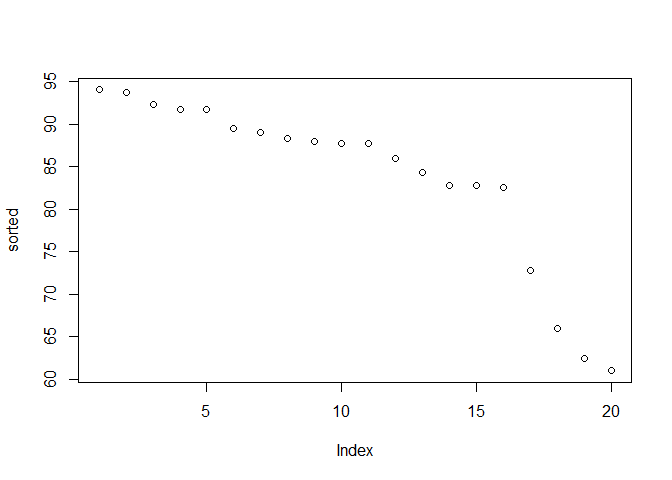

Class 7: Bioinformatics R packages from CRAN and BioConductor
================

\#\#More on function writing

First we will revist our function from last day

``` r
source("http://tinyurl.com/rescale-R")
```

Test the **rescale()**
    function

``` r
rescale(1:10)
```

    ##  [1] 0.0000000 0.1111111 0.2222222 0.3333333 0.4444444 0.5555556 0.6666667
    ##  [8] 0.7777778 0.8888889 1.0000000

``` r
#rescale(c(1:10,"string"))
```

## FUNCTION PRACTICE

Write a function to ID NA elements in 2 vectors Start with simple, known
sample data

``` r
x <- c( 1, 2, NA, 3, NA)
y <- c(NA, 3, NA, 3,  4)
```

``` r
is.na(x)
```

    ## [1] FALSE FALSE  TRUE FALSE  TRUE

``` r
is.na(y)
```

    ## [1]  TRUE FALSE  TRUE FALSE FALSE

``` r
is.na(x) & is.na(y)
```

    ## [1] FALSE FALSE  TRUE FALSE FALSE

Take the sum to find out how many (True =1 false = 0)

``` r
sum(is.na(x) & is.na(y))
```

    ## [1] 1

This is my working snippet of code that i can use as the body of my
first function

``` r
both_na <-  function(x,y) {
  sum( is.na(x) & is.na(y) )  
}
```

``` r
both_na(x,y)
```

    ## [1] 1

``` r
both_na(c(NA, NA, NA), c(NA, NA, 1))
```

    ## [1] 2

``` r
both_na(c(NA, NA, NA), c(1, NA, NA, NA))
```

    ## Warning in is.na(x) & is.na(y): longer object length is not a multiple of
    ## shorter object length

    ## [1] 3

``` r
both_na(c(NA, NA, NA), c(1, NA, NA, NA, NA, NA))
```

    ## [1] 5

Check the length of our inputs are equal

``` r
x <- c(NA, NA, NA)
y <- c(NA, NA, NA, NA, NA, NA)
length(x) != length(y)
```

    ## [1] TRUE

``` r
3 != 2
```

    ## [1] TRUE

``` r
#x <- c(NA, NA, NA)
#y <- c(NA, NA, NA, NA, NA, NA)
# if(length(x) != length(y)) {
 #  stop("Input x and y should be the same length")
 # }
```

Try the both\_na3() function with extra features

``` r
x <- c( 1, 2, NA, 3, NA)
y <- c(NA, 3, NA, 3,  4)

both_na3(x,y)
```

    ## Found 1 NA's at position(s):3

    ## $number
    ## [1] 1
    ## 
    ## $which
    ## [1] 3

\#Which shows which is true

``` r
which(c(F,F,F,T))
```

    ## [1] 4

## WRITE A FUNCTION grade()

``` r
#Student_1 
st_1 <- c(100, 100, 100, 100, 100, 100, 100, 90)

#student_2
st_2 <- c(100, NA, 90, 90, 90, 90, 97, 80)
```

``` r
min(st_1)
```

    ## [1] 90

``` r
min(st_2)
```

    ## [1] NA

``` r
(sum(st_1)-min(st_1))/7
```

    ## [1] 100

``` r
x <- c(100, 100, 100, 100, 100, 100, 100, 90)

(sum(x)-min(x))/ (length(x)-1)
```

    ## [1] 100

\#SNIPPET

``` r
x <- c(100, 100, 100, 100, 100, 100, 100, 90)

grade <- function(x) {
  (sum(x)-min(x))/ (length(x)-1)
}
```

``` r
x <- c(100, NA, 90, 90, 90, 90, 97, 80)

grade <- function(x) {
  (sum(x, na.rm = TRUE)-min(x, na.rm = TRUE))/ (length(x)-1)
}
grade(x)
```

    ## [1] 79.57143

``` r
url <- "https://tinyurl.com/gradeinput"
class_scores <- read.csv(url, row.names = 1)
grade <- function(x) {
  (sum(x, na.rm = TRUE)-min(x, na.rm = TRUE))/ (length(x)-1)
}
grade(class_scores[5,])
```

    ## [1] 88.25

``` r
ans <- apply(class_scores, 1, grade)
```

``` r
sorted <- sort(ans, decreasing = TRUE)
```

lpot(ans)

``` r
plot(sorted)
```

<!-- -->

``` r
x <- df1$IDs
y <- df2$IDs

intersect(x,y)
```

    ## [1] "gene2" "gene3"

``` r
x
```

    ## [1] "gene1" "gene2" "gene3"

``` r
y
```

    ## [1] "gene2" "gene4" "gene3" "gene5"

``` r
x %in% y
```

    ## [1] FALSE  TRUE  TRUE

``` r
x[x %in% y]
```

    ## [1] "gene2" "gene3"

``` r
gene_intersect <- function(x, y) {
  cbind( x[x %in% y],
  y[y %in% x])
}
```

``` r
merge(df1,df2,by="IDs")
```

    ##     IDs exp.x exp.y
    ## 1 gene2     1    -2
    ## 2 gene3     1     1

## NOW WE WORK WITH “SHINY”

``` r
library(shiny)

# Define UI for app that draws a histogram ----
ui <- fluidPage(

  # App title ----
  titlePanel("Hello Shiny!"),

  # Sidebar layout with input and output definitions ----
  sidebarLayout(

    # Sidebar panel for inputs ----
    sidebarPanel(

      # Input: Slider for the number of bins ----
      sliderInput(inputId = "bins",
                  label = "Number of bins:",
                  min = 1,
                  max = 50,
                  value = 30)

    ),

    # Main panel for displaying outputs ----
    mainPanel(

      # Output: Histogram ----
      plotOutput(outputId = "distPlot")

    )
  )
)
```

``` r
# Define server logic required to draw a histogram ----
server <- function(input, output) {

  # Histogram of the Old Faithful Geyser Data ----
  # with requested number of bins
  # This expression that generates a histogram is wrapped in a call
  # to renderPlot to indicate that:
  #
  # 1. It is "reactive" and therefore should be automatically
  #    re-executed when inputs (input$bins) change
  # 2. Its output type is a plot
  output$distPlot <- renderPlot({

    x    <- faithful$waiting
    bins <- seq(min(x), max(x), length.out = input$bins + 1)

    hist(x, breaks = bins, col = "#75AADB", border = "white",
         xlab = "Waiting time to next eruption (in mins)",
         main = "Histogram of waiting times")

    })

}
```

``` r
shinyApp(ui = ui, server = server)
```

    ## PhantomJS not found. You can install it with webshot::install_phantomjs(). If it is installed, please make sure the phantomjs executable can be found via the PATH variable.

<!--html_preserve-->

<div class="muted well" style="width: 100% ; height: 400px ; text-align: center; box-sizing: border-box; -moz-box-sizing: border-box; -webkit-box-sizing: border-box;">

Shiny applications not supported in static R Markdown documents

</div>

<!--/html_preserve-->
