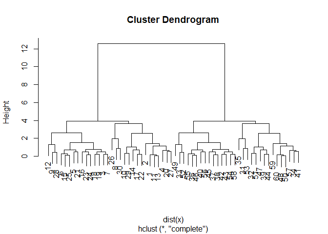
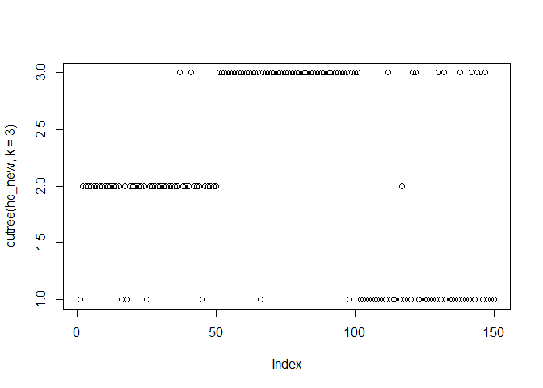

Class 8: Introduction to machine learning for Bioinformatics (Part 1)
================

## Kmeans Clustering

``` r
# Generate some example data for clustering
tmp <- c(rnorm(30,-3), rnorm(30,3))
x <- cbind(x=tmp, y=rev(tmp))
plot(x)
```

<!-- -->

Use the kmeans() function setting k to 2 and nstart=20

Inspect/print the results

Q. How many points are in each cluster? Q. What ‘component’ of your
result object details - cluster size? - cluster assignment/membership? -
cluster center?

Plot x colored by the kmeans cluster assignment and add cluster centers
as blue points

``` r
k <- kmeans(x,2,20)
print(k)
```

    ## K-means clustering with 2 clusters of sizes 30, 30
    ## 
    ## Cluster means:
    ##           x         y
    ## 1 -2.863021  2.767819
    ## 2  2.767819 -2.863021
    ## 
    ## Clustering vector:
    ##  [1] 1 1 1 1 1 1 1 1 1 1 1 1 1 1 1 1 1 1 1 1 1 1 1 1 1 1 1 1 1 1 2 2 2 2 2
    ## [36] 2 2 2 2 2 2 2 2 2 2 2 2 2 2 2 2 2 2 2 2 2 2 2 2 2
    ## 
    ## Within cluster sum of squares by cluster:
    ## [1] 44.70413 44.70413
    ##  (between_SS / total_SS =  91.4 %)
    ## 
    ## Available components:
    ## 
    ## [1] "cluster"      "centers"      "totss"        "withinss"    
    ## [5] "tot.withinss" "betweenss"    "size"         "iter"        
    ## [9] "ifault"

``` r
k$cluster
```

    ##  [1] 1 1 1 1 1 1 1 1 1 1 1 1 1 1 1 1 1 1 1 1 1 1 1 1 1 1 1 1 1 1 2 2 2 2 2
    ## [36] 2 2 2 2 2 2 2 2 2 2 2 2 2 2 2 2 2 2 2 2 2 2 2 2 2

``` r
table(k$cluster)
```

    ## 
    ##  1  2 
    ## 30 30

``` r
k$centers
```

    ##           x         y
    ## 1 -2.863021  2.767819
    ## 2  2.767819 -2.863021

``` r
plot(x, col= k$cluster) 
points(k$center, col= "blue", pch=18, cex=2)
```

<!-- -->

``` r
# Generate some example data for clustering
tmp <- c(rnorm(30,-3), rnorm(30,3))
x <- cbind(x=tmp, y=rev(tmp))

#kmeans
k <- kmeans(x,6,1000000000)
#plot K-means
plot(x, col= k$cluster) 
points(k$center, col= "blue", pch=18, cex=2)
```

<!-- -->

\#\#HIERARCHIAL CLUSTERING

``` r
hc <- hclust( dist(x))
hc
```

    ## 
    ## Call:
    ## hclust(d = dist(x))
    ## 
    ## Cluster method   : complete 
    ## Distance         : euclidean 
    ## Number of objects: 60

\#Lets plot hclust results

``` r
plot(hc)
```

<!-- -->

``` r
plot(hc)
abline(h=6, col="red")
```

<!-- -->

``` r
cutree(hc, h=6)
```

    ##  [1] 1 1 1 1 1 1 1 1 1 1 1 1 1 1 1 1 1 1 1 1 1 1 1 1 1 1 1 1 1 1 2 2 2 2 2
    ## [36] 2 2 2 2 2 2 2 2 2 2 2 2 2 2 2 2 2 2 2 2 2 2 2 2 2

``` r
gp2 = cutree(hc, k=2)
gp3 = cutree(hc, k=3)
table(gp2)
```

    ## gp2
    ##  1  2 
    ## 30 30

``` r
table(gp3)
```

    ## gp3
    ##  1  2  3 
    ## 30 15 15

``` r
table(gp2,gp3)
```

    ##    gp3
    ## gp2  1  2  3
    ##   1 30  0  0
    ##   2  0 15 15

# Step 1. Generate some example data for clustering

x \<- rbind( matrix(rnorm(100, mean=0, sd = 0.3), ncol = 2), \# c1
matrix(rnorm(100, mean = 1, sd = 0.3), ncol = 2), \# c2
matrix(c(rnorm(50, mean = 1, sd = 0.3), \# c3 rnorm(50, mean = 0, sd =
0.3)), ncol = 2)) colnames(x) \<- c(“x”, “y”)

``` r
# Step 1. Generate some example data for clustering
x <- rbind(
  matrix(rnorm(100, mean=0, sd = 0.3), ncol = 2),   # c1
  matrix(rnorm(100, mean = 1, sd = 0.3), ncol = 2), # c2
  matrix(c(rnorm(50, mean = 1, sd = 0.3),           # c3
           rnorm(50, mean = 0, sd = 0.3)), ncol = 2))
colnames(x) <- c("x", "y")
```

``` r
# Step 2. Plot the data without clustering
plot(x)
```

<!-- -->

``` r
# Step 3. Generate colors for known clusters 
#         (just so we can compare to hclust results)
col <- as.factor( rep(c("c1","c2","c3"), each=50) ) 
plot(x, col=col)
```

<!-- -->
Your Turn\!

\#Q. Use the dist(), hclust(), plot() and cutree() functions to return 2
and 3 clusters

``` r
hc_new <- hclust(dist(x))
plot(hc_new)
```

<!-- -->

``` r
cutree(hc_new, k = 2)
```

    ##   [1] 1 2 2 2 2 2 2 2 2 2 2 2 2 2 2 1 2 1 2 2 2 2 2 2 1 2 2 2 2 2 2 2 2 2 2
    ##  [36] 2 1 2 2 2 1 2 2 2 1 2 2 2 2 2 1 1 1 1 1 1 1 1 1 1 1 1 1 1 1 1 1 1 1 1
    ##  [71] 1 1 1 1 1 1 1 1 1 1 1 1 1 1 1 1 1 1 1 1 1 1 1 1 1 1 1 1 1 1 1 1 1 1 1
    ## [106] 1 1 1 1 1 1 1 1 1 1 1 2 1 1 1 1 1 1 1 1 1 1 1 1 1 1 1 1 1 1 1 1 1 1 1
    ## [141] 1 1 1 1 1 1 1 1 1 1

``` r
plot(x, col= k$cluster) 
points(k$center, col= "blue", pch=18, cex=2)
```

<!-- -->

``` r
cutree(hc_new, k =3)
```

    ##   [1] 1 2 2 2 2 2 2 2 2 2 2 2 2 2 2 1 2 1 2 2 2 2 2 2 1 2 2 2 2 2 2 2 2 2 2
    ##  [36] 2 3 2 2 2 3 2 2 2 1 2 2 2 2 2 3 3 3 3 3 3 3 3 3 3 3 3 3 3 3 1 3 3 3 3
    ##  [71] 3 3 3 3 3 3 3 3 3 3 3 3 3 3 3 3 3 3 3 3 3 3 3 3 3 3 3 1 3 3 3 1 1 1 1
    ## [106] 1 1 1 1 1 1 3 1 1 1 1 2 1 1 1 3 3 1 1 1 1 1 1 1 3 1 3 1 1 1 1 1 3 1 1
    ## [141] 1 3 1 3 3 1 3 1 1 1

``` r
plot(x, col= k$cluster) 
points(k$center, col= "blue", pch=18, cex=2)
```

<!-- -->

``` r
plot(cutree(hc_new, k = 2))
```

<!-- -->

``` r
plot(cutree(hc_new, k = 3))
```

<!-- -->

\#Q. How does this compare to your known ‘col’ groups?

\#\#PCA

``` r
mydata <- read.csv("https://tinyurl.com/expression-CSV", 
                   row.names=1) 
head(mydata)
```

    ##        wt1 wt2  wt3  wt4 wt5 ko1 ko2 ko3 ko4 ko5
    ## gene1  439 458  408  429 420  90  88  86  90  93
    ## gene2  219 200  204  210 187 427 423 434 433 426
    ## gene3 1006 989 1030 1017 973 252 237 238 226 210
    ## gene4  783 792  829  856 760 849 856 835 885 894
    ## gene5  181 249  204  244 225 277 305 272 270 279
    ## gene6  460 502  491  491 493 612 594 577 618 638

``` r
pca <- prcomp( t(mydata), scale=TRUE)
summary(pca)
```

    ## Importance of components:
    ##                           PC1    PC2     PC3     PC4     PC5     PC6
    ## Standard deviation     9.6237 1.5198 1.05787 1.05203 0.88062 0.82545
    ## Proportion of Variance 0.9262 0.0231 0.01119 0.01107 0.00775 0.00681
    ## Cumulative Proportion  0.9262 0.9493 0.96045 0.97152 0.97928 0.98609
    ##                            PC7     PC8     PC9      PC10
    ## Standard deviation     0.80111 0.62065 0.60342 3.348e-15
    ## Proportion of Variance 0.00642 0.00385 0.00364 0.000e+00
    ## Cumulative Proportion  0.99251 0.99636 1.00000 1.000e+00

``` r
pca.var <- pca$sdev^2
pca.var.per <- round(pca.var/sum(pca.var)*100, 1)
plot(pca.var.per)
```

<!-- -->

``` r
plot(pca)
```

<!-- -->

\#load UK data, analyze its dimensions

``` r
x <- read.csv("UK_foods.csv")
dim(x)
```

    ## [1] 17  5

``` r
head(x)
```

    ##                X England Wales Scotland N.Ireland
    ## 1         Cheese     105   103      103        66
    ## 2  Carcass_meat      245   227      242       267
    ## 3    Other_meat      685   803      750       586
    ## 4           Fish     147   160      122        93
    ## 5 Fats_and_oils      193   235      184       209
    ## 6         Sugars     156   175      147       139

``` r
tail(x)
```

    ##                    X England Wales Scotland N.Ireland
    ## 12      Fresh_fruit     1102  1137      957       674
    ## 13          Cereals     1472  1582     1462      1494
    ## 14         Beverages      57    73       53        47
    ## 15      Soft_drinks     1374  1256     1572      1506
    ## 16 Alcoholic_drinks      375   475      458       135
    ## 17    Confectionery       54    64       62        41

``` r
#view(X)
```

``` r
# Note how the minus indexing works
rownames(x) <- x[,1]
head(x)
```

    ##                             X England Wales Scotland N.Ireland
    ## Cheese                 Cheese     105   103      103        66
    ## Carcass_meat    Carcass_meat      245   227      242       267
    ## Other_meat        Other_meat      685   803      750       586
    ## Fish                     Fish     147   160      122        93
    ## Fats_and_oils  Fats_and_oils      193   235      184       209
    ## Sugars                 Sugars     156   175      147       139

``` r
x <- x[,-1]
head(x)
```

    ##                England Wales Scotland N.Ireland
    ## Cheese             105   103      103        66
    ## Carcass_meat       245   227      242       267
    ## Other_meat         685   803      750       586
    ## Fish               147   160      122        93
    ## Fats_and_oils      193   235      184       209
    ## Sugars             156   175      147       139

``` r
x <- read.csv("UK_foods.csv", row.names=1)
head(x)
```

    ##                England Wales Scotland N.Ireland
    ## Cheese             105   103      103        66
    ## Carcass_meat       245   227      242       267
    ## Other_meat         685   803      750       586
    ## Fish               147   160      122        93
    ## Fats_and_oils      193   235      184       209
    ## Sugars             156   175      147       139

``` r
barplot(as.matrix(x), beside=T, col=rainbow(nrow(x)))
```

<!-- -->

``` r
barplot(as.matrix(x), beside=F, col=rainbow(nrow(x)))
```

<!-- -->

``` r
pairs(x, col=rainbow(10), pch=16)
```

<!-- -->

\#PCA of UK Data

``` r
# Use the prcomp() PCA function 
pca <- prcomp( t(x) )
summary(pca)
```

    ## Importance of components:
    ##                             PC1      PC2      PC3       PC4
    ## Standard deviation     324.1502 212.7478 73.87622 4.189e-14
    ## Proportion of Variance   0.6744   0.2905  0.03503 0.000e+00
    ## Cumulative Proportion    0.6744   0.9650  1.00000 1.000e+00
